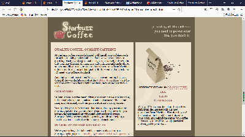

## 凝胶状态：
    - 介于流动和冻结之间：由一个固定大小的div包围页面的所有内容（冻结布局），然后利用auto属性值允许外边距扩展；
    - 在冻结布局的基础上，增加：
    #allcontent{
        margin-left:auto;
		margin-right:auto;
    }
    - 保证页面处于正中间

    - 缺点：页面不会自动填充整个空间
