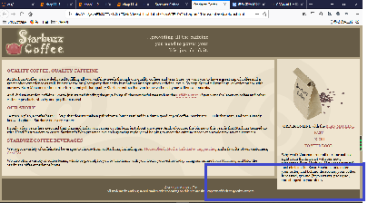

## 绝对定位
    - 使用绝对定位的元素会自动从页面的正常流中删除
    - 方法：我们对于侧边栏使用绝对定位，当窗口大小发生变化时，主内容区会进行扩展或者收缩，随着窗口大小的变化侧边栏的相对位置和大小不会发生变化 
        - 为侧边栏增加规则约束：
            #sidebar{
                padding:15px;
                margin:10px;
                position:absolute;  定义此元素属于绝对定位
                top:128px;          此元素距离页面上的距离
                right:0px;          此元素距离页面右边的距离
                width:280px;        此元素内容宽度
            }
            15+10+280+10+15=330px
        - 修改#main的右外边距：
            #main{
                margin:0px 330px 10px 10px;
            }

        -出现问题了，当页面宽度过大时，页脚上出现了浮动页面，由于侧边栏不在正常流中，所以我们不能使用clear属性解决目前的问题；

## 同一位置处的元素的上下顺序：z-index
    - 首先使用同一个绝对定位的位置保证两个元素处于同一个位置
    - 其次，使用z-index属性：底层元素设置为0，上层元素设置为1,如果层数多，就有2，3，4...
        - 这个属性只有绝对定位，相对定位，固定定位的元素具有
    #award{
        position:absolute;
        top:10px;
        left:10px;
        z-index:0;
    }

    #logo{
        position:absolute;
        top:10px;
        left:10px;
        z-index:1;

## CSS表格显示：解决上面的问题

### position：
    - 有四个值：static(默认),relative,absolute,fixed;
