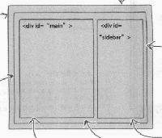
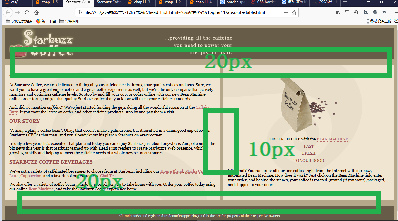

## CSS表格显示
    - 首先定义一个div包含表格显示的所有内容,名为tableContainer;
    - 然后为一行定义一个div,名为tableRow;
    - 最后，各列放置现有的main
和sidebar

    - 例如，一个一行一列的表格显示如下：
        ...
        

            

                

                    ...
                

                

                    ...
                

             

         

         ...

### CSS创建表格的规则
    - 整个表格的div规则：
        div#tableContainer{
            display:table;  说明这个div表示一个表格
            border-spacing:10px;设置相邻单元格的边框间的距离为10px;
        }
    - 为行增加的div规则：
        div#tableRow{
            display:table-row;  说明这个div表示表格中的一行
        }
    - 为单元格main和sidebar增加div规则：
        #main{
            display:table-cell;   说明这个div表示表格中的一个单元格
            vertical-align:top;   确保单元格中的内容相对于单元格上边对齐
            width:50%;            定义本单元格的宽度为整张表格宽度的一半
        }
        #sidebar{
            display:table-cell;
            vertical-align:top;
        }
    - 在界定每个单元格所占的宽度时，最好使用百分数，并且保证一行内单元格的整体宽度总和为100%，这样在窗口缩放时各个单元格的宽度也会缩放

## 外间距的折叠
    - 相互挨着的块元素的垂直外边距会折叠，例如左边块元素右外边距10px,右边块元素的左外边距为10px,则两个块元素之间就相差10px,两个外边距交叠在一起了
    - border-spacing和外边距创建的空间不会折叠
    - 在上面的结果中我们发现表格上下的边距大于单元格之间的边距，这是由于我们给页眉设置了10px的下外边距，给页脚设置了10px的上外边距，再加上表格设置了10px的border-spacing，就变成了20px;
