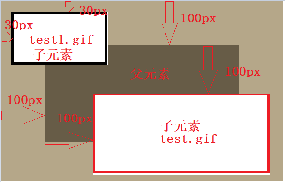
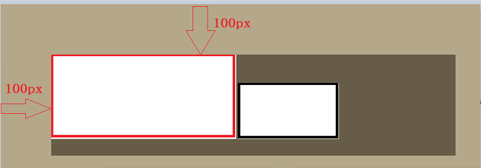
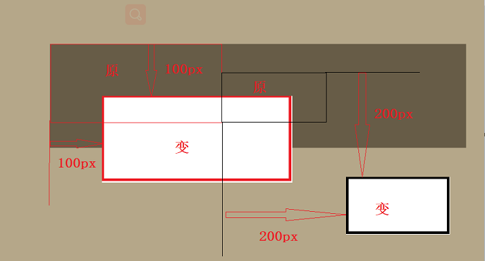

## 绝对定位：
    - 绝对定位的参照物是祖先元素的位置，如果祖先元素没有设定位置，则参照于窗口的位置
    - 固定定位始终是相对于窗口的
    - 脱离了文档流


```python
<!DOCTYPE html>
<html>
  <head>
    <meta charset="utf-8">
    <title>Starbuzz Coffee</title>
    <link rel="stylesheet" type="text/css" href="z.css">
  </head> 

  <body>
    <div id="header">
      
	  
	</div>
  </body>
</html>

.css文件：
body { 
  background-color: #b5a789;
  font-family:      Georgia, "Times New Roman", Times, serif;
  font-size:        small;
  margin:           0px;
}

#header {
  background-color: #675c47;
  height:           200px;
  width:400px;
  position:absolute;     header不具备父元素，所以时相对于窗口的绝对定位
	top:100px;
	left:100px;
}

#test{
	position:absolute;    当父元素具备了定位，子元素相对于父元素的绝对定位
	top:100px;              
	left:100px;
}

#test1{
	position:fixed;      固定定位始终是相对于窗口的
	top:30px;              
	left:30px;
}
```



## 相对定位
    - 始终相对于元素自身的位置（默认位置static处），添加top,bottom,left,right的偏移量
    - 没有脱离文档流，当移动位置之后，原来的位置还会给它保留

    - 不加任何偏移量时：


```python
body { 
  background-color: #b5a789;
  font-family:      Georgia, "Times New Roman", Times, serif;
  font-size:        small;
  margin:           0px;
}

#header {
  background-color: #675c47;
  height:           200px;
  width:800px;
  position:absolute;
	top:100px;
	left:100px;
}
```



    - 加上绝对定位的定义，并且加上偏移量：


