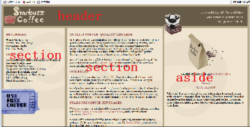

## - html5中新增加的一些元素
    - 我们发现，在html中我们在分布结构时，都是使用块元素div,html5中就增加了一些元素，替代div
        - header:放在页面顶部或者某个模块顶部的内容
        - footer：放在页面底部或者某个模块底部的内容
        - nav:页面的导航链接
        - article:页面中一个独立的组成部分，如一个博客帖子、新闻报道等
        - time:可能包含一个时期或者时间，或者同时包含
        - aisde:对于页面内容的补充，如边栏或者插图等
        - section:一个主题性的内容分组，通常包含一个首部和一个底部
        - video:为页面增加视频媒体




    - 在修改的时候，我们只需要建原本的div改为header,并且由于这个界面中只有一个header,所以不用加id
        - 如果某个界面中同时包含多个Header,这时我么如果想为其中一个header指定特殊的样式，就可以为其添加class属性或者id属性，单独在css中设定
    - 但是由于具备两个section，所以这两部分还是需要添加id的


```python
<html>
    <head>
        ...
    </head>
    <body>
        <header>
        ...
        </header>
        
        <div id="tableContainer">
            <div id="tableRow">
                <section id="drinks">
                ...
                </section>
                
                <section id="main">
                ...
                </section>
                
                <aside>
                ...
                <aside>
            </div>
        </div>
        
        <footer>
        ...
        </footer>
    </body>
</html>
```


```python
header{
    ...
}
#drinks{
    ...
}
#main{
    ...
}
aside{
    ...
}
footer{
    ...
}
```
