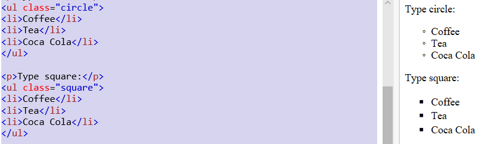
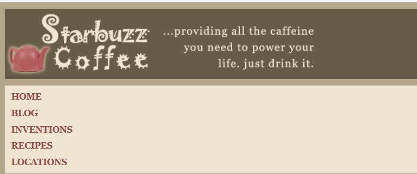
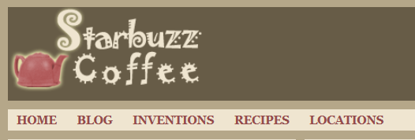

    - 一般而言，我们需要为section和article创建header属性，这样可以达到区分内容的效果

## - 添加导航栏
    - 首先为导航栏创建一组链接：
        <a href="index.html">HOME</a>
        <a href="blog.html">BLOG</a>
        <a href="">INVENTIONS</a>
        <a href="">RECIPES</a>
        <a href="">LOCATIONS</a>
    - 现在，把这些锚包围在一个无序列表中，把这些链接作为一组列表项
        <ul>
            <li><a href="index.html">HOME</a></li>
            <li><a href="blog.html">BLOG</a></li>
            <li><a href="">INVENTIONS</a></li>
            <li><a href="">RECIPES</a></li>
            <li><a href="">LOCATIONS</a></li>
        </ul>

### list-style-type:none; 
        ul.circle {list-style-type:circle}
        ul.square {list-style-type:square}

    - 还有其他很多种形式https://www.w3school.com.cn/cssref/pr_list-style-type.asp

### display:inline
    - 将元素看做内联元素显示为同一行
        - 例如，在添加导航栏的过程中，如果不添加下面的代码，
            nav ul li{
                display:inline;
            }
            - 那么得到的结果将是：

    - 添加之后，得到的结果是

### 设定CSS样式：
        nav{
            background-color:#efe5d0; 为整个nav元素设定背景颜色和边距
            margin:10px 10px 0px 10px;
        }

        nav ul{  设定列表的边距和列表项的表头标记样式
            margin:0px;
            list-style-type:none; 
            padding:5px 0px 5px 0px;
        }

        nav ul li{
            display:inline;  设置对象作为行内元素显示
            padding:5px 10px 5px 10px;
        }

        ul li a:link,ul li a:visited{
            color:#954b4b;
            border-bottom:none;
            font-weight:bold;
        }

        nav ul li.selected{
            background-color:#c8b99c;
        }

#### 切换导航栏时，相应的界面的导航键的背景发生变化
    - 为了做到这样，我们需要在每一个界面添加导航键，并且在对应的界面为链接的内容添加类属性，最后在CSS中统一为该类定义格式：例如：
        在index.html中：
        <li class="selected"><a href="index.html">HOME</a></li>
        在starbuzz.html以及blog.html中：
        <li class="selected"><a href="blog.html">BLOG</a></li>
        
        CSS:
        nav ul li.selected {   为所有的selected类元素设定样式
            background-color: #c8b99c;
        }
