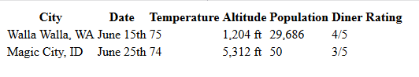
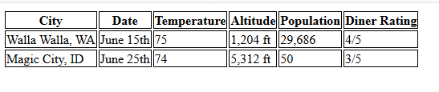
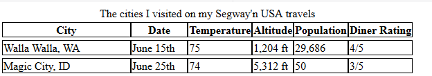

### table元素
    - 一个table元素开启一个表格
    - tr元素开启一行
    - td开启一个单元格
    - th开启一个表头元素
        - 注意：当表格的某一个单元格的内容为空时，为了保证表格对齐，需要在空位处写：<td></td>表示内容为空
        - 如果希望将表头放在第一列，则可以将每一行的元素的第一个内容使用th来写
        - 单元格里面还可以嵌套表格

    - 在html中使用这样的元素书写表格之后，内容会以没有边框线的表格形式显示

    - 为了出现边框线，我们就需要设定css样式

    - 添加样式：
    - 注意在表格中我们不添加外边距margin,而是统一使用一个border-spacing属性控制单元格之间的间距
    

    - 但是这种还不像是正常的表格

### 为表格添加标题caption
    <table>
        <caption>标题</caption>
        <tr>...</tr>
        <tr>...</tr>
    </table>

    - 我们还可以修改标题的位置，使用caption-side属性控制top和bottom，即放在表格上面还是下面，默认下面

### border-spacing 属性：控制单元格之间的外部间距
    - 注意不能单独的设定某两个单元格之间的间距，也不能使用margin指定外边距
    - 对于上面表格中存在的问题，可以:
        table{
            border-spacing:0px;
        }

    - 但是我们可以在垂直和水平方向上设定不同的边框间距：
        table{
            border-spacing:0px 4px;  0像素的水平间距和4像素的垂直间距
        }

### border-collapse:去掉单元格之间的边框
    table{
        border-collapse:collapse;  折叠边框
    }
    - border-collapse:separate;打开边框
