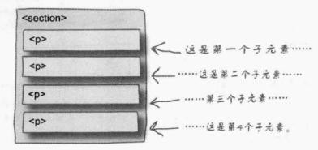

### nth-child伪类
    - 直接在css中出现，不会在html中标记指出

    - 当我们想为奇数段落和偶数段落设定不同的背景颜色时，就可以使用它，即：
        p:nth-child(even){   
            background-color:red;
        }
        p:nth-child(odd){
            background-color:gray;
        }
    - 除此之外，还可以使用表达式规定：
        p:nth-child(2n){
            background-color:red;  第2n个p元素的背景为红色
        }
        p:nth-child(2n+1){
            background-color:gray;
        }

    - 在之前的表格中，我们就可以使用它为不同的行设定不同的颜色，区分奇数行和偶数行
        tr:nth-child(even){
            background-color:red;
        }
        tr:nth-child(odd){
            background-color:gray;
        }

### 类似的有first-child,second-child,....
    /*tableRow中的第一个段落的文本右对齐*/
    div.tableRow p:first-child {  
        text-align: right;
    }
