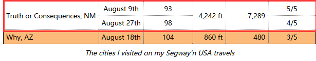
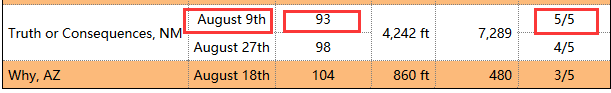
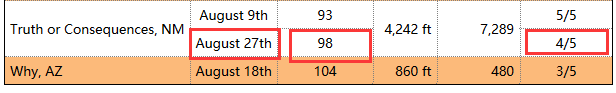
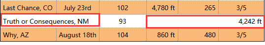

### 1 某个单元格占据多行

    - 当出现类似于这种情况时，我们应该如何处理

#### 使用td元素的rowspan属性
    - 在第一次碰到需要跨行的单元格时，给其添加rowspan属性，即rowspan="2"

    - 
            <tr>
                <td rowspan="2">Truth or Consequences, NM</td>
                <td class="center">August 9th</td>
                <td class="center">93</td>
                <td rowspan="2" class="right">4,242 ft</td>
                <td rowspan="2" class="right">7,289</td>
                <td class="center">5/5</td>
            </tr>

    - 紧接着添加跨行元素的值
		<tr>
			<td class="center">August 27th</td>
			<td class="center">98</td>
			<td class="center">4/5</td>
		</tr>

### 2 某些单元格占据多列
    - 

#### 使用colspan属性
    - 在碰到需要跨列的单元格时，给其添加colspan属性
        <tr>
			<td colspan="2">Truth or Consequences, NM</td>  跨越两行，则需要删除其后面一个单元格的内容
			<td class="center">93</td>
			<td colspan="3" class="right">4,242 ft</td> 跨越三行，则需要删除其后面两个单元格的内
		</tr>

        
