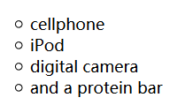

### 为表格增加标记：list-style-type

    - 上面这个无序表中，使用的list-style-type:circle;
    - disc（默认实心圆点）,square,none等等

### 定制图片标记:list-style-image属性
    li {
      list-style-image: url(images/backpack.gif); 
      padding-top:      5px;
      margin-left:      10px;
    }

#### list-style-position属性：设置在何处放置列表项标记。
    list-style-position：inside;在列表框内，和列表项占据一个单元格
    list-style-position：outside;在列表框外
    list-style-position：inherit ;规定应该从父元素继承 list-style-position 属性的值。
