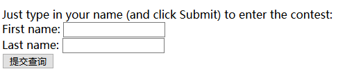

### 本章的主要内容：得到用户的反馈

### 表单如何工作
    - 用户访问一个包含表单的web界面，填写表单，提交
    - web浏览器将所有数据打包发送给web服务器，web服务器收到数据，并且将其传送给一个服务器脚本进行处理
    - 服务器脚本处理完数据，创建一个全新的web界面作为响应，将其依次传递到服务器和浏览器，最终显示该界面

### 创建表单
        <form action="http://wickedlysmart.com/hfhtmlcss/contest.php" method="POST">
          
Just type in your name (and click Submit) to enter the contest: 

            First name: <input type="text" name="firstname" value=""> 
            Last name:  <input type="text" name="lastname" value=""> 
            <input type="submit">
          

        </form>

    - 所有的表单元素均放在一个form元素中，并且需要指明表单的提交位置
        - .php文件时服务器脚本文件，所以action就是告诉浏览器需要处理该表单数据的服务器脚本文件的位置
            - 创建服务器脚本需要专门学习
        - post确定表单数据如何发送到服务器
    - 文本内容需要使用input元素创建,type为text
    - 按钮也使用input内容创建，但是type为submit
        - 如果不想提交按钮上显示提交，可以添加value属性，为其添加特定的内容
    - 每个表单元素的name都必须是唯一的，但是单选钮不同，它属于一组，相当于是一个元素，所以可以指定相同的内容

### 表单元素名name是如何工作的

    - 提交表单时，浏览器会根据这些唯一的元素名打包数据，即：
    First name = Wu
    Last name = Huanhuan
