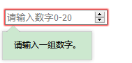

### placeholder属性
    - 为填写表单的人提供一个提示
    <input type="number" min="0" max="20" placeholder="请输入数字0-20">
<input type="number" min="0" max="20" placeholder="请输入数字0-20">
    

### reqiured属性:
    - 具备这个属性的表单元素，必须要填写内容，否则不能提交表单
    <input type="number" min="0" max="20" placeholder="请输入数字0-20">
<input type="number" min="0" max="20" placeholder="请输入数字0-20" required>

