## 常用的字体属性
    - 页面所使用字体font-famliy:Verdana,Geneva,Arial,sans-serif;
    - 字体大小：font-size
        - body/p:14px; 
        - h1:21px;
        - h2:17px;
    - 文本颜色color:silver;
    - 字体粗细font-weight:bold;
    - 为文本增加更多风格text-decoration:underline;
        - none;overline;line-through;
    

#### 字体系列font-famlily
    - 总共有5个字体系列：sans-serif;serif;monospace;cursive;fantasy;
    - 每一个字体系列都包含一组有共同特征的字体
        - sans-serif：Verdana/Arial Black/Trebuchet MS/Arial/Geneva
        - Serif(有衬线):Times/Times New Roman/Georgia
        - monospace(包含固定宽度的字符):Courier/Courier New/Andale Mono
        - Cursive(类似于手写，多用于标题):Comic Sans/Apple Chancery;
        - Fantasy(具有某种装饰性):LAST NINJA/Impact
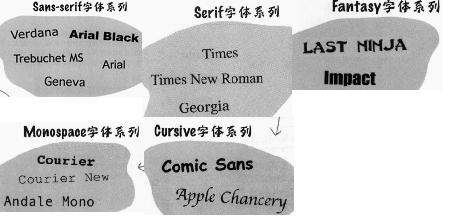
    - 注意这些字体在拼写是一定要完全按照这里的大小写书写

#### 使用CSS指定字体系列
        body{
            font-family:Verdana,Geneva,Arial,sans-serif;
        }
    - 使用font-family可以指定多个字体，字体名之间用分号隔开
    - 最后一个总是放置通用的字体系列名
    - 对于并列列出的多种字体，浏览器会首先查看该计算机中是否包含Verdana字体，如果有，body中的内容就会优先使用这个字体，依次进行，如果前面列出的几种字体均没有找到，则会使用默认的sans-serif字体
    - 对于字体名为两个单词的字体，在指定时需要加上双引号：
        font-family:"Courier New",Courier,monospace;

### 为页面增加web字体@font-face：方法一
    - 1 找到一个字体
    - 2 确保字体具备正确的格式：
        - TrueType字体：.ttf
        - OpenType字体：.otf
        - Embedded OpenType字体：.eot
        - SVG字体：.svg
        - Web开放字体：.woff
    - 3 把你的字体文件放在Web上
        - 想让用户的浏览器可以访问你的字体，就需要把字体文件放在web上，但是也需要知道字体文件的url
        - 例如：http://wickedlysmart.com/hfhtmlcss/chapter8/journal/EmblemaOne-Regular.woff
            http://wickedlysmart.com/hfhtmlcss/chapter8/journal/EmblemaOne-Regular.ttf
    - 4 在css中增加@font-face属性
        - 在journal.css文件中增加一个@font-face规则，把这个规则增加到.css文件的最上面，放在body规则之上
        - 由于目前该字体的网页版链接仅存在这两种格式，所以不能兼容所有的浏览器，所以这种方法很可能不会产生预期的效果，最保险还是使用方法二，将字体直接下载到本地端，然后通过那个网站的得到所有可行的字体格式，保证所有浏览器均具备适配的字体显示格式；当然，如果你可以将关于该字体的所有格式均上传到指定的网站，也可以使用这个方法，两者大同小异，只是字体所在的位置不同
            @font-face{
                font-family:"Emblema One";
                srl:url("http://wickedlysmart.com/hfhtmlcss/chapter8/journal/EmblemaOne-Regular.woff");
                srl:url("http://wickedlysmart.com/hfhtmlcss/chapter8/journal/EmblemaOne-Regular.ttf");
                /*src属性告诉浏览器在哪里可以得到这个字体*/
            }
        - @font-face规则告诉浏览器：要加载src URL指定的字体文件，浏览器会试图加载每一个src文件，直到找到一个它可以支持使用的文件
    - 5 在css中使用font-family名
        h1{
            font-family:"Emblema One",sans-serif;
        }
    - 6 加载页面
        打开html页面查看

### 为页面增加web字体，方法二：
。
#### 为了保证浏览器对于字体的兼容性，在得到一种字体的某种形式之后，我们还需要得到其他的形式，从而确保字体可以完整显示
参考https://blog.csdn.net/qq_34254618/article/details/51132995?depth_1-utm_source=distribute.pc_relevant.none-task&utm_source=distribute.pc_relevant.none-task
    - 第一步：得到某种字体的其中一种形式，例如.ttf等
    - 第二步：在https://www.fontsquirrel.com/这个网站上，选择
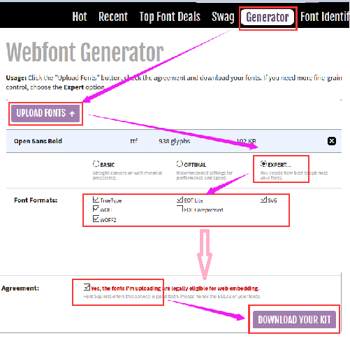
            - 下载得到一个压缩文件，其中包含5种形式的字体文件和一个.css文件

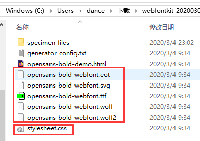

        - 这个.css文件中包含了以下的规则：
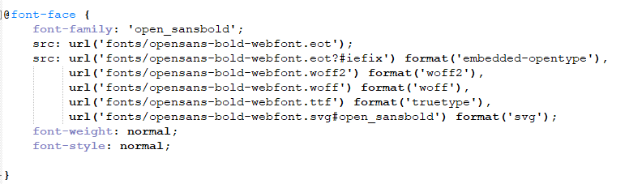

    - 第三步：写html文件：
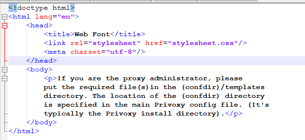

    - 第四步：在.css文件中加入对于html文件中相关内容的规则：
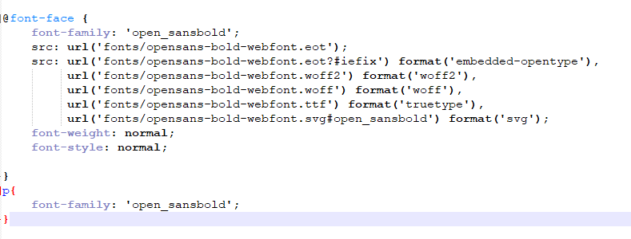
    

    - 运行html文件，得到下面的结果：
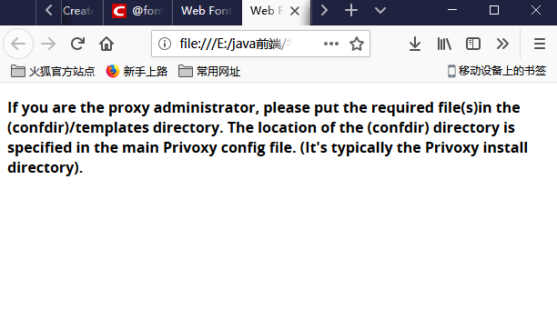

### 关于@font-face的一些小tips:
    - 从表面看@font-face并不是一个直接的选择器规则，它是一个内置的CSS规则，用它可以获取一个web字体，并且为它分配一个font-family名，然后供其他的选择器规则使用；
    - 其他需要了解的内置CSS规则：@import和@media
        - @import允许导入其他CSS文件
        - @media允许创建特定于某些媒体类型的CSS规则，如印刷页等
    - web字体的应用会增加页面加载的时间，所以要适度使用web字体
    - http://www.fontsquirrel.com/提供了很多开源、免费的字体
    - http://www.google.com/webfonts也可以

## 调整字体大小：font-size属性
    - 一般情况下，如果我们不指定，则字体大小为16px,就是body中的默认字体大小
    - h1是默认字体大小的200%(32px),h2是150%,h3是120%，h4是100%,h5是90%，h6是60%
    - 方法1：使用px
        body{
            font-size:14px;
        }
        - 此时，font-size设置字体的高度为14像素
    - 方法2：使用百分数
        body{
            font-size:150%;
        }
        - 由于font-size是一个继承与父元素的属性，所以这里的百分数是相对于父元素的字体大小而言的
    - 方法3：使用em
            font-size:150%;
        - 它类似于百分数，指定了一个比例因子，父元素字体大小的1.2倍
    - 方法4：关键字：xx-small,x-small,small,medium,large,x-large,xx-large
            font-size:small;
        - small相当于12px,每个比前一个大20%

### 如何选择使用哪一个字体方法
    - 第一步： 选择一个关键字，指定它作为页面中body中的规则，此时相当于重新定义了页面中默认字体的大小
        - 在body中也可以使用em或者百分数指定字体大小，这时意思就是默认字体（16px）的多少
    - 第二步： 使用em或者百分数，相对于body字体大小其他元素的字体大小
    - 这样，如果我们想更改字体大小就只需要更改关键字，整体就会发生变化
        body{
            font-size:small;
        }
        h1{font-size:150%;}
        h2{font-size:120%;}
        - 这样我们就会得到一个文档树
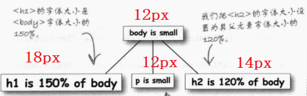

    - 如果此时我们想增大web页面的字体大小，就可以直接
        body{
            font-size:large;
        }
        h1{font-size:150%;}
        h2{font-size:120%;}
        - 此时得到的文档树就是这样：
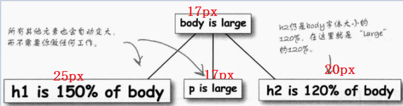
        

### 改变字体粗细：font-weight
    - font-weight:bold;粗体文本  相当于700px
    - font-weight:normal;正常文本  相当于400

### 为字体增加风格font-style
    - font-style:italic;斜体，并且衬线有弯曲
    - font-style:not italic;非斜体
    
    - font-style:oblique;倾斜文本
    - font-style:not oblique;非倾斜文本
    
    - 注意：虽然元素<em>内部的文本也是斜体显示的，但是由于浏览器的不同，有时并不能显示斜体，所以不能将em和斜体文本设置font-style看做是同等的

### 文本装饰
    - text-decoration:underline/none/overline/line-through;
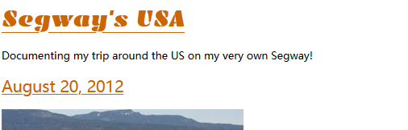
    - 同时为一个元素添加多个时,中间留空格：
        text-decoration:underline overline;
    - 如果由于继承，文本具备一些不需要的装饰，可以使用
        text-decoration:none;取消

    - <del>指定要删除的内容：<del>...</del>
        <del>wee</del>
<del>wee</del>
    - <ins>指定要删除的内容：<ins>...</ins>
        <ins>wee</ins>
<ins>wee</ins>

### 替代下划线
    h1{
        border-bottom:thin dotted #888888;
        /*在h1元素下面增加一个下边框，细的点虚线，颜色为#888888
    }
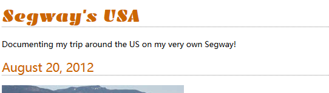

### 文本简写
    font:font-style font-variant font-weight font-size/line-height font-family
    - 斜体加粗 小写字母转大写并且字号整体变小一些 字体粗细 字体大小/行高 字体系列
    - font-style font-variant font-weight均是可选的，但是这些必须放在font-size之前
    - line-height也是可选的
    - font-size，font-family:必须要有，否则不能使用简写形式
