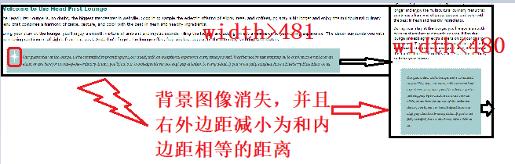

## 为CSS指定有特定属性的设备

### 方法一：link标记结合media属性：将样式表应用于其它的设备（PC，平板，手机等）调整页面样式
    - media属性允许你指定使用这个样式表的设备类型
    - 例如：
        - 规定有屏幕的设备并且屏幕宽度不超过480px
            <link style="text/css" rel="stylesheet" href="form1.css" media="screen and (max-device-width:480px)"> 
            类似的有min-device-width,orientation:横向（landscape）或者纵向（portrait）
        - 匹配打印机设备：
            <link style="text/css" rel="stylesheet" href="form2.css" media="print">
    - 注意：max-device-width和min-device-width是取决于设备的屏幕宽度
    - 如果想得到浏览器的实际屏幕宽度，可以使用max-width和min-width，当你改变浏览器的窗口宽度时，显示也会根据规则的设定而发生变化


```python
    - 例如E:\java前端\学习代码与笔记\css\chap_9代码\lounge\中lounge.html中
<!doctype html>
<html lang="en">
	<head>
		<meta charset="utf-8">
		<title>Head First Lounge</title>
        如果浏览器窗口宽度大于481px时，页面会正常显示
		<link type="text/css" rel="stylesheet" href="lounge.css" 
		media="screen and (min-width:481px)">
        如果浏览器窗口宽度小于480px,则页面中会适当删掉一些元素，例如减小内边距，删掉背景图像等等
		<link type="text/css" rel="stylesheet" href="lounge-mobile.css" 
	      media="screen and (max-width: 480px)">
	</head>
    <body>
    ...
    </body>
```



### 方法二：直接在CSS中增加媒体查询，使用@media规则
        /*对于有屏幕并且屏幕宽度不小于481像素的设备，将所有适用规则放在大括号里面*/
        @media screen and (min-device-width:481px){
            #guarantee{
                margin-right:250px;
            }
        }
        @media print{
            body{
                font-family:Times,"Times New Roman",serif;
            }
        }
        /*所有其他的规则会应用于整个界面，因为它们未包含在@media规则中*/
        p.specials{
            color:red;
        }
    - 注意：需要把对所有媒体类型均通用的规则放在@media规则的下面
    - 在加载页面时，浏览器会通过媒体类型确定页面所适用的规则，忽略掉不匹配的规则
