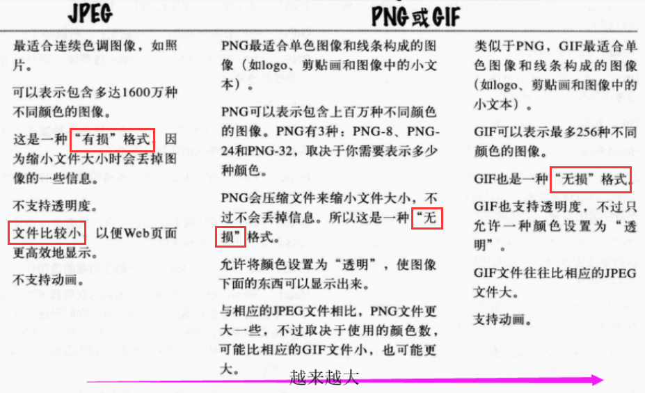
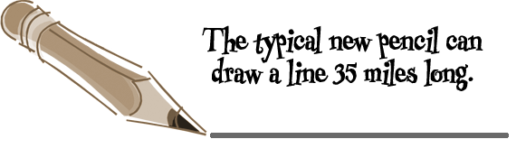
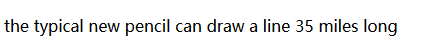
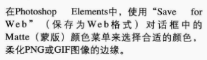

## 学习如何为页面增加图像

### jpeg,png,gif的区别
    - 照片和复杂图像使用jpeg
    - 单色图像，logo、文本和几何图像使用png和gif
    - 需要透明和多种颜色，适合使用png

### <img元素>
        
    - 元素是一个内联元素，不会在前面或者后面插入换行，所以当在同一行可以放下几个图像时，会自动并排放，不会换行
    - 元素，无内容（void类型）
    - img元素中不仅可以使用相对链接，还可以使用url，例如
        
		
        

        - 注意：对于同一界面的图像显示最好使用相对链接，对于其他页面图像的链接还是使用Url比较好

    - 浏览器一般会同时获取到一个web界面中的所有图像
    - 如果我们想获取网页中某个图像的url，可以通过右键单击该图像复制该图像地址，但是有时候我们得到的图像地址可能是相对链接，需要结合网站名重新构造
    

#### 1 <img元素>的alt属性
    - 在图片不能正确显示，即图片的地址出现偏差时，会直接显示alt的内容
    - 例如：
        
    - 本来应该显示

    - 但是当我们把地址搞错时，会显示

#### <img元素>的width和height属性：
        

		
        

    - 根据像素数确定图片的显示宽度和高度

#### <img元素>添加超链接
    - <a>元素在前，将元素作为<a>元素的内容
    - </a>结尾
        
    

    - 简单的版式：
        
        - type->类型,这里是style的属性；text/css ->文本/css,即css文本;这句话去掉效果一样，这里只是标注一下这个样式的属性是css文本；
        - background-color:#eaf3da;标注网页的背景颜色

### 对于photoshop elements中的图像处理
    - 主要是打开图像之后，将其保存为web形式，然后修改相关的保存格式，jpeg,png,gif等
    - 对于logo的透明化和边缘处理：
        - 主要是勾选透明度那个选项和获取背景颜色后直接改变边缘化的颜色
