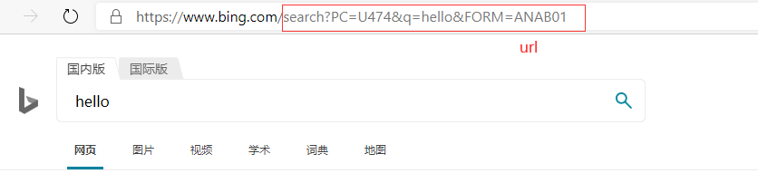
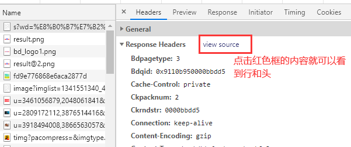
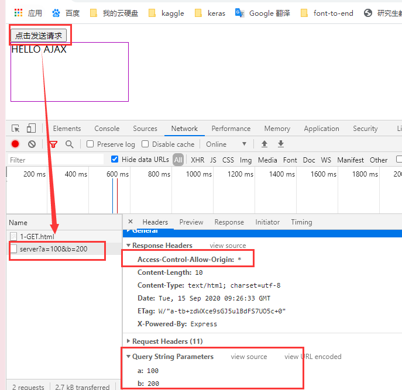
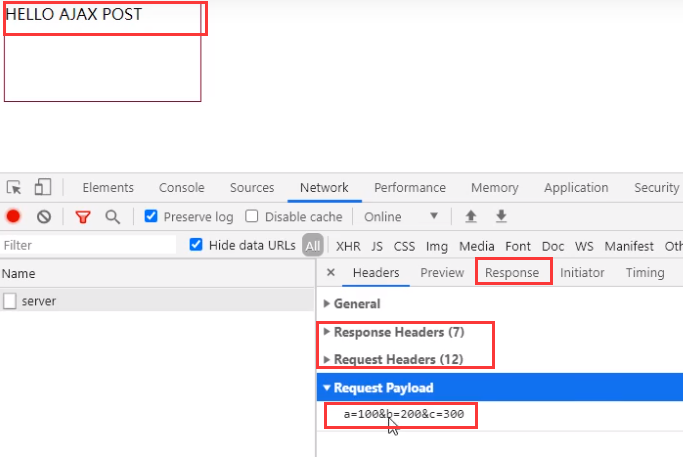
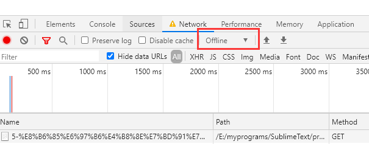
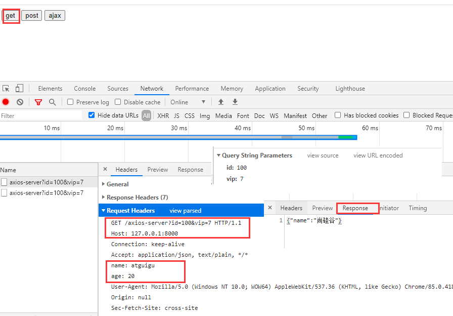
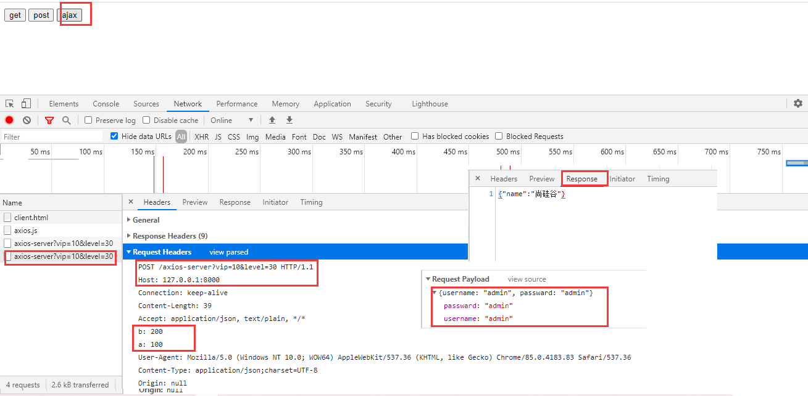

<!-- TOC -->

- [note](#note)
- [1 HTTP](#1-http)
  - [1.1 请求报文](#11-请求报文)
  - [1.2 响应报文](#12-响应报文)
  - [1.3 在 Chrome 浏览器中查看请求报文和响应报文](#13-在-chrome-浏览器中查看请求报文和响应报文)
- [2 express 基本使用](#2-express-基本使用)
- [3 ajax 发送 GET 请求](#3-ajax-发送-get-请求)
- [4 ajax 发送 POST 请求](#4-ajax-发送-post-请求)
- [5 ajax 响应 JSON 请求](#5-ajax-响应-json-请求)
- [6 nodemon 工具](#6-nodemon-工具)
- [7 AJAX 的 IE 缓存问题](#7-ajax-的-ie-缓存问题)
- [8 AJAX 请求超时与网络异常](#8-ajax-请求超时与网络异常)
- [9 ajax 重复发送请求](#9-ajax-重复发送请求)
- [10 Jquery 中的 ajax](#10-jquery-中的-ajax)
- [11 axios-ajax 函数发送请求](#11-axios-ajax-函数发送请求)
- [12 fetch](#12-fetch)
- [13 跨域](#13-跨域)
- [13 跨域解决](#13-跨域解决)
    - [（1)JSONP](#1jsonp)
- [13 CROS](#13-cros)

<!-- /TOC -->

# note

- 这部分是本人在观看了尚硅谷 ajax 教程做的笔记，教程源：https://www.bilibili.com/video/BV1WC4y1b78y，后续会根据自己的学习继续添加改进

# 1 HTTP

HTTP（hypertext transport protocol）协议『超文本传输协议』，协议详细规定了浏览器和万维网服务器之间互相通信的规则。
约定, 规则

## 1.1 请求报文

重点是格式与参数

```
行      POST  /s?ie=utf-8  HTTP/1.1        请求类型(GET,POST)   url路径(search?PC=U474&q=hello&FORM=ANAB01)   HTTP的版本
头      Host: atguigu.com                  格式都是A: B
        Cookie: name=guigu
        Content-type: application/x-www-form-urlencoded
        User-Agent: chrome 83
空行
体      username=admin&password=admin      GET请求的请求体为空，POST请求可以不为空
```



## 1.2 响应报文

```
行      HTTP/1.1  200  OK                  协议版本   响应状态码   响应状态字符串
头      Content-Type: text/html;charset=utf-8
        Content-length: 2048
        Content-encoding: gzip
空行
体      <html>                             浏览器向服务端发送请求，服务端向浏览器返回的报文中包含了四个部分，响应体中就包含了html的内容，浏览器通过解析再将该内容取出，渲染页面并且呈现
            <head>
            </head>
            <body>
                <h1>尚硅谷</h1>
            </body>
        </html>
```

- 404 找不到
- 403 没有权限
- 401 未授权
- 500 内部错误
- 200 ok

## 1.3 在 Chrome 浏览器中查看请求报文和响应报文

- 百度搜索谷粒学院，打开后台端，查看 network 部分
  
- 刷新页面，点击第一个,这是一个 GET 请求类型，没有报文体
  
  
  
  

# 2 express 基本使用

- express 是基于 Node.js 平台，快速、开放、极简的 Web 开发框架

```
npm init --yes:初始化，npm是一个包管理工具
npm i express:安装express
```

- express 使用的例子：
  - app.get(url,回调)：url 指的是服务器的地址规则，使用正则表达式的方式

```
// 1 先引入express
const express = require('express');
// 2 创建应用对象
const app = express();
// 3 创建路由规则
app.get('/',(request,response)=>{
    // request是对请求报文的一个封装
    // response是对响应报文的一个封装
    response.send('HELLO EXPRESS');
});
// 4 监听端口启动服务
app.listen(8000,()=>{
    console.log('服务已经启动，8000端口监听中');
})
```

# 3 ajax 发送 GET 请求

- 显示效果：当点击 button 后向服务器端发送请求，然后将响应体的结果呈现在 div 中



- 1 服务器端
  - 模拟一个服务器端：创建路由规则，并且设定响应体和响应头

```
// 服务器端准备
//1. 引入express
const express = require('express');

//2. 创建应用对象
const app = express();

//3. 创建路由规则
// request 是对请求报文的封装
// response 是对响应报文的封装
// url设置的是响应请求的地址(正则表达式)，必须包含server关键词或者是/server，这是路由规则
app.get('/server', (request, response)=>{
    // 设置响应头,设置允许跨域
    response.setHeader('Access-Control-Allow-Origin','*')
    //设置响应
    response.send('HELLO AJAX');
});

//4. 监听端口启动服务
app.listen(8000, ()=>{
    console.log("服务已经启动, 8000 端口监听中....");
});
```

- 设置好服务器端后，需要在服务器文件所在的文件夹下开启该服务器：

```
node ./.server.js
```

- 2 浏览器端
  - 定义请求对象，设置请求方法及请求的浏览器地址，发送请求
  - xhr.open(method,url);
    - url 指定想要访问的地址
    - **127.0.0.1 是回送地址，指本地机，一般用来测试使用**。回送地址（127.x.x.x）是本机回送地址（Loopback Address），即主机 IP 堆栈内部的 IP 地址，主要用于网络软件测试以及本地机进程间通信，无论什么程序，一旦使用回送地址发送数据，协议软件立即返回，不进行任何网络传输。

```
css:
<style>
    #result {
        width: 200px;
        height: 100px;
        border: solid 1px #90b;
    }
</style>

html:
<button>点击发送请求</button>
<div id="result"></div>

js:
<script>
    // 获取button元素
    const btn = document.getElementsByTagName('button')[0];
    console.log(btn);
    const result = document.getElementById('result');
    // onclick小写，我们的目的是点击按钮从而获取服务器的返回报文
    btn.onclick = function(){
        // 1 创建对象
        const xhr = new XMLHttpRequest();
        // 2 初始化，设置请求的方法和url
        // 在url中传递参数，使用?分割，参数名1=参数值1&参数名2=参数值2
        // url是要服务器端的地址，表示向谁发送请求
        xhr.open('GET','http://127.0.0.1:8000/server?a=100&b=200');
        // 3 发送
        xhr.send();
        // 4 事件绑定，处理服务端返回的结果
        /*
        readystate是xhr对象的属性，表示状态,5个值
            - 0(未初始化)
            - 1(open方法调用完毕)
            - 2(send方法调用完毕)
            - 3(服务端返回了结果)
            - 4(服务端返回的所有的结果)
        */
       // 当状态改变时调用下面的方法
        xhr.onreadystatechange = function(){
            // 判断(服务器返回了所有的结果)
            if(xhr.readyState === 4){
                // 判断响应状态码 200 404 403 401 500
                // 2xx均表示成功
                if(xhr.status >= 200 && xhr.status < 300){
                    // 处理结果：行，头，空行，体
                    // 1 响应行：状态码和状态字符串
                    console.log(xhr.status);
                    console.log(xhr.statusText);
                    // 2 响应头
                    console.log(xhr.getAllResponseHeaders);
                    // 3 响应体
                    console.log(xhr.response);
                    result.innerHTML = xhr.response;
                }
            }else{
            }
        }
    }
</script>
```

# 4 ajax 发送 POST 请求

- 实现的效果：当鼠标移动到 div 框上时向服务器端发送 POST 请求，然后将响应体的结果呈现在 div 中
  
- 服务器端
  - 当发送的是 post 请求并且路径是'/server'才会响应

```
// 服务器端准备
//1. 引入express
const express = require('express');

//2. 创建应用对象
const app = express();

//3. 创建路由规则
// request 是对请求报文的封装
// response 是对响应报文的封装
// 请求服务的路径必须包含server关键词或者是/server，这是路由规则
app.post('/server', (request, response)=>{
    // 设置响应头,设置允许跨域
    response.setHeader('Access-Control-Allow-Origin','*')
    // 添加一个特殊的响应头,表示允许浏览器发送的报文中包含自定义的头信息
    // response.setHeader('Access-Control-Allow-Headers','*');
    //设置响应
    response.send('HELLO AJAX POST');
});

//4. 监听端口启动服务
app.listen(8000, ()=>{
    console.log("服务已经启动, 8000 端口监听中....");
});
```

- 浏览器端

```
<style>
    #result{
        width:200px;
        height:100px;
        border:solid 1px #903;
    }
</style>

<div id="result"></div>
<script>
    //获取元素对象
    const result = document.getElementById("result");
    //绑定事件
    result.addEventListener("mouseover", function(){
        //1. 创建对象
        const xhr = new XMLHttpRequest();

        //2. 初始化 设置类型与 URL
        xhr.open('POST', 'http://127.0.0.1:8000/server');

        //设置请求头
        xhr.setRequestHeader('Content-Type','application/x-www-form-urlencoded');
        // 自定义头信息，但是注意：添加了这个自定义的请求头之后会报错,因为浏览器存在安全机制
        // xhr.setRequestHeader('name','atguigu');

        //3. 发送   设置请求体
        xhr.send('a=100&b=200&c=300');
        // xhr.send('a:100&b:200&c:300');
        // xhr.send('1233211234567');

        //4. 事件绑定
        xhr.onreadystatechange = function(){
            //判断
            if(xhr.readyState === 4){
                if(xhr.status >= 200 && xhr.status < 300){
                    //处理服务端返回的结果
                    result.innerHTML = xhr.response;
                }
            }
        }
    });
</script>
```

- ajax 设置请求头信息
  - xhr.setRequestHeader('名字','值');
- 如果浏览器在发送请求报文时添加了自定义的头信息，比如

```
xhr.setRequestHeader('name','atguigu');
```

- 由于浏览器的安全机制，会报错，所以在服务器端需要添加一行代码，表示允许浏览器发送的报文中包含自定义的头信息

```
// *表示支持所有自定义的头信息
response.setHeader('Access-Control-Allow-Headers','*');
```

- 但是这样写还不够，浏览器还会发送一个 OPTIONS 请求，去检测我自己定义的头信息可不可以用，因为在上面的代码中，没有设置与 OPTIONS 请求对应的服务器响应，所以得不到结果，从而导致 post 请求不能产生响应。所以还需要将 app.post 修改为 app.all,允许所有类型的浏览器请求(get,post,options 等)均得到响应

# 5 ajax 响应 JSON 请求

- 1 服务器端
  - 如果希望响应体传输一个 object 数据，而由于 send(字符串)函数的限制，不能传递除了字符串之外的值，所以可以先使用 JSON.stringify()将 object 方法转为 JSON 字符串，然后传递

```
app.all('/json-server', (request, response)=>{
    // 设置响应头,设置允许跨域
    response.setHeader('Access-Control-Allow-Origin','*')
    // 添加一个特殊的响应头,表示允许浏览器发送的报文中包含自定义的头信息
    response.setHeader('Access-Control-Allow-Headers','*');
    console.log(1111)
    // 响应一个数据
    const data = {
        name:'atguigu'
    }
    //设置响应,由于send只能接收字符串类型，所以需要对data做转换
    // 借助于JSON.Stringify()
    let str = JSON.stringify(data);
    response.send(str);
});
```

- 2 浏览器端

  - 有两种方法将响应报文体中的 json 数据转换为 object
    - (1)自动:设置响应体数据的类型必须为 json,然后自动将 json 响应体数据转换为 object`xhr.responseType = 'json';`
    - (2)手动:使用 JSON.parse() 将 JSON 字符串转换为对象`let data = JSON.parse(xhr.response); result.innerHTML = data.name;`

- 浏览器端设置：

```
window.onkeydown = function(){
    const result = document.getElementById('result');
    const xhr = new XMLHttpRequest();
    // 将地址改为json-server
    xhr.open('GET','http://127.0.0.1:8000/json-server');

    // 方法2 ：设置响应体数据的类型必须为json,然后自动将json响应体数据转换为object
    xhr.responseType = 'json';

    xhr.send();
    xhr.onreadystatechange= function(){
        if(xhr.readyState === 4){
            if(xhr.status >= 200 && xhr.status < 300){

                // 方法1： 使用JSON.parse()  将JSON字符串转换为对象，再将其name属性值取出来
                // let data = JSON.parse(xhr.response);
                // result.innerHTML = data.name;

                console.log(typeof xhr.response);  // object
                result.innerHTML = xhr.response.name;
            }
        }
    }
}
```

# 6 nodemon 工具

- nodemon 用来监视 node.js 应用程序中的任何更改并自动重启服务,非常适合用在开发环境中
- 安装

```
npm install -g nodemon
```

- 然后再 server.js 所在的文件夹下输入下面的代码，回车即可启动服务器的 8000 端口进行监视：

```
nodemon .\server.js
```

- 注意如果上一个步骤报错，则以管理员身份打开`power shell`,输入`set-ExecutionPolicy RemoteSigned`回车，然后选择 A 或者 Y，回车即可解决
- 使用它开启监视之后，只要我们随机改变 server.js 并且保存后，就会自动重启服务器，从而不需要再每次使用 node server.js 重新启动了

# 7 AJAX 的 IE 缓存问题

- 这个问题在 ie11 中仍然存在,Microsoft Edge 中已经改好了
- IE 浏览器会将 AJAX 的请求结果缓存起来，当下一次再次请求时会从本地的缓存结果中寻找，这样就会导致时效性较强的场景出现问题
- 比如我们第一次点击请求服务之后得到响应体为'HELLO IE',然后在服务器中修改响应体为'HELLO IE 2',在 ie 浏览器中再次点击请求服务还是会出现'HELLO IE'
- 解决这个问题的办法：在每次请求的 url 中添加一个时间戳，这样每次请求的参数均不相同，ie 就会将其作为两个不同的请求处理

```
xhr.open("GET",'http://127.0.0.1:8000/ie?t='+Date.now());
```

# 8 AJAX 请求超时与网络异常

- 使用 xhr 对象的 timeout 属性设置一个确切的时间，

```
<script>
  const btn = document.getElementsByTagName('button')[0];
  const result = document.querySelector('#result');

  btn.addEventListener('click', function(){
      const xhr = new XMLHttpRequest();

      //超时设置 2s，当点击请求2s后没有得到响应，则就会自动取消响应
      xhr.timeout = 2000;

      //超时回调，当超过指定时长自动调用的函数，向用户解释
      xhr.ontimeout = function(){
          alert("网络异常, 请稍后重试!!");
      }
      //网络异常回调
      xhr.onerror = function(){
          alert("你的网络似乎出了一些问题!");
      }

      xhr.open("GET",'http://127.0.0.1:8000/delay');
      xhr.send();
      xhr.onreadystatechange = function(){
          if(xhr.readyState === 4){
              if(xhr.status >= 200 && xhr.status< 300){
                  result.innerHTML = xhr.response;
              }
          }
      }
  })
</script>
```

- 服务器端：

```
app.get('/delay', (request, response)=>{
    // 设置响应头,设置允许跨域
    response.setHeader('Access-Control-Allow-Origin','*')
    // 3秒以后再将响应结果发送给服务器端
    setTimeout(()=>{
        response.send('HELLO DELAY');
    },3000);
    //设置响应
});
```

- 网络异常演示:将图中的 online 修改为 offline,然后点击请求服务，就会直接调用网络异常的回调函数 onerror
  

9 # ajax 取消请求

- 在发送请求之后，并且没有得到响应报文之前，可以通过代码自动取消请求
- 实现的效果：定义两个按钮，一个发送请求，一个取消请求，设置服务器端延时响应，使用请求超时设置的服务器，点击发送请求后，等待 3 秒，服务器才会发送响应报文，所以在 3 秒内，点击取消请求均可以取消，取消请求的设置如下：

```
xhr.abort();  // 即可取消
```

- 浏览器端设置如下：

```
<button>发送请求</button>
<button>取消请求</button>
<script>
    const btn = document.querySelectorAll('button');
    // xhr对象两个按钮均需要使用，所以需要放在外面定义
    let xhr = null;
    // 发送请求
    btn[0].onclick = function(){
        xhr = new XMLHttpRequest();
        xhr.open('GET','http://127.0.0.1:8000/delay');
        xhr.send();
    }
    // 取消请求
    btn[1].onclick = function(){
        xhr.abort();
    }
</script>
```

# 9 ajax 重复发送请求

- 当用户发送请求 1 之后，在未得到响应之前再发送请求 2，一旦此时存在大量的用户这样反复请求，会导致浏览器奔溃，所以此时就需要取消请求 1，保证对于一个任务就创建一个请求 2
- 添加一个标识变量，在创建对象之后令 isSending=true,然后通过判断状态码改变为 4 后就将该变量修改为 false;

```
<button>发送请求</button>
<script>
    const btn = document.querySelectorAll('button')[0];
    let xhr = null;
    // 建立标识变量
    let isSending = false;
    btn[0].onclick = function(){
        // 如果正在发送，则取消该请求，创建一个新的请求
        if(isSending) {
            xhr.abort();
        }
        xhr = new XMLHttpRequest();
        isSending = true;
        xhr.open('GET','http://127.0.0.1:8000/delay');
        xhr.send();
        xhr.onreadystatechange = function(){
            if(xhr.readyState === 4){
                isSending = false;
            }
        }
    }
</script>
```

# 10 Jquery 中的 ajax

# 11 axios-ajax 函数发送请求

- axios 的包配置如下：https://github.com/axios/axios
- axios 发送 get 请求：
  - `axios.get(url,{其他配置})`
- axios 发送 post 请求：
  - `axios.post(url,{请求体},{其他配置})`
- axios 发送 ajax 请求
  - `axios({所有配置})`
- 例子：定义 3 个按钮，分别使用 axios.get,axios.post,axios 发送请求
- 浏览器端：

```
// 需要引入axios的一个远程资源，包
<script crossorigin='anonymous' src="https://cdn.bootcdn.net/ajax/libs/axios/0.19.2/axios.js"></script>
<button>get</button>
<button>post</button>
<button>ajax</button>
<script>
    const btn = document.querySelectorAll('button');
    // 配置baseURL
    axios.defaults.baseURL = 'http://127.0.0.1:8000';
    btn[0].onclick = function(){
        // get请求
        axios.get('/axios-server',{
            // url参数
            params:{
                id:100,
                vip:7
            },
            // 请求头参数
            headers:{
                name:'atguigu',
                age:20
            }
        }).then(value=>{
            // value是响应体解析之后得到的对象
            console.log(value);
        });
    }

    btn[1].onclick = function(){
        // post请求
        axios.post('/axios-server', { // 请求体
            username:'admin',
            passward:'admin'
        },{
            // url参数
            params:{
                id:200,
                vip:9
            },
            // 请求头参数
            headers:{
                name:'huanhuan',
                age:23
            }
        }).then(value=>{
            // value是响应体解析之后得到的对象
            console.log(value);
        });
    }

    btn[2].onclick = function(){
        axios({
            'method':'POST',
            url:'/axios-server',
            // url参数
            params:{
               vip:10,
               level:30
            },
            headers:{
                a:100,
                b:200
            },
            data:{
                username:'admin',
                passward:'admin'
            }
        }).then(response => {
            // 响应体
            console.log(response);
        })
    }
</script>
```

- 服务器端

```
// axios服务
app.all('/axios-server', (request, response)=>{
    // 设置响应头,设置允许跨域
    response.setHeader('Access-Control-Allow-Origin','*');
    // 添加一个特殊的响应头,表示允许浏览器发送的报文中包含自定义的头信息
    response.setHeader('Access-Control-Allow-Headers','*');
    const data = {
        name:'尚硅谷'
    }
    //设置响应,由于send只能接收字符串类型，所以需要对data做转换
    // 借助于JSON.Stringify()
    let str = JSON.stringify(data);
    response.send(str);
});
```

- get 请求的效果：
  
- post 请求的效果：
  
- axios 请求的结果：
  
- 三个请求服务器端的返回结果均相同，由于请求的参数设置不同，请求头不同

# 12 fetch

- API 文件：https://developer.mozilla.org/zh-CN/docs/Web/API/WindowOrWorkerGlobalScope/fetch
- `fetch('url',{其他配置})`
- fetch 会返回一个 Promise 对象，可以通过 then 方法获取，该对象中的函数体包含在 text()(或者 json(),这取决于响应体的数据类型)

```
fetch(url,{}).then(response => {
    return response.text();
}).then(body => {
    console.log(body);
})
```

- 例子：使用一个 button 按钮控制发送 fetch 请求
- 服务器端：

```
// fetch服务
app.all('/fetch-server', (request, response)=>{
    // 设置响应头,设置允许跨域
    response.setHeader('Access-Control-Allow-Origin','*');
    // 添加一个特殊的响应头,表示允许浏览器发送的报文中包含自定义的头信息
    response.setHeader('Access-Control-Allow-Headers','*');
    const data = {
        name:'尚硅谷'
    }
    //设置响应,由于send只能接收字符串类型，所以需要对data做转换
    // 借助于JSON.Stringify()
    let str = JSON.stringify(data);
    response.send(str);
});
```

- 浏览器端

```
<button>发送请求</button>
<script>
    const btn = document.querySelector('button');
    console.log(btn);
    btn.onclick = function(){
        console.log(1111);
        fetch('http://127.0.0.1:8000/fetch-server?vip=10',{
            method:"POST",
            headers:{
                name:'huanhuan'
            },
            body:'username=admin&password=admin'
        }).then(response => {
            // 返回一个Promise对象response,响应对象包含在text()中
            return response.text();
            // 如果响应是一个json字符串，则可以使用response.json()操作
        }).then(body => {
            // 通过使用ex6中then方法的传递性，前一个then的return作为这一个then的参数传入
            console.log(body);
        })
    }
</script>
```

# 13 跨域

- 同源策略：

  - 当前发送请求的 url 与 ajax 请求的目标资源的 url 必须保证：协议、域名、端口号完全相同
  - ajax 默认遵循同源策略
  - 违背同源策略就是跨域

- 例如：下面发送请求的界面 index.html 来自于`http:127.0.0.1:9000/home`，而响应数据也是来自于这个 url
  - 首先在文件所在的文件下位置下打开服务器端：`nodemon server.js`
  - 然后在浏览器中输入`http:127.0.0.1:9000/home`就可以打开 index 界面，这就是发送请求的 html,然后点击发送请求按钮，此时就会发送一个 get 请求，返回的数据来自于`http:127.0.0.1:9000/data`。协议，域名，端口号均相同
- 服务器端：

```
const express = require('express');
const { request, response } = require('express');
const app = express();
app.get('/home',(request,response)=>{
    // 响应一个页面
    response.sendFile(__dirname+'/index.html');

})
app.get('/data',(request,response)=>{
    // 响应一个页面
    response.send('用户数据');

})
app.listen(9000, ()=>{
    console.log('服务已经启动....');
});
```

- 浏览器端

```
<button>点击获取用户数据</button>
<script>
    const btn = document.querySelector('button');
    btn.onclick = function(){
        const xhr = new XMLHttpRequest();
        xhr.open('GET','/data');
        xhr.send();
        xhr.onreadystatechange = function(){
            if(xhr.readyState === 4){
                if(xhr.status >= 200 && xhr.status<300){
                    console.log(xhr.response);
                }
            }
        }
    }
</script>
```

# 13 跨域解决

### （1)JSONP

- 利用 script 标签的 src 属性发送 http get(post 等)请求，这样即使浏览器端 url 为本地地址(比如 file:///E:/myprograms/SublimeText/project/ajax/%E8%B7%A8%E5%9F%9F/client.html)，但是也可以访问 url(http://127.0.0.1:8000/check-username)的内容
- 很明显可以发现这两个地址的协议、域名、端口号均不相同，属于非同源，也就是跨域操作
- 注意：**使用 script 标签发送的请求要求返回的报文体一定是 js 代码段**
- 例子参见：页面布局一个文本框，一个段落。在文本框内输入文本，失去焦点后，自动发送 http get 请求
- 服务器端：

```
const express = require('express');
const app = express();
// 注意：request和response的位置不能改变
app.get('/check-username',(request,resopnse) => {
    const data = {
        exist: 1,
        msg: 用户名存在
    }
    // 转json字符串
    let str = data.stringify(data);
    // 响应体为js中的函数调用，虽然表示为字符串的行为，但是浏览器接收到之后，会自动执行js代码段
    response.send('handle(' + str + ')');
})
app.listen(8000, ()=>{
    console.log('服务器已经启动...');
})
```

- 浏览器端

```
<!DOCTYPE>
<html>
    <head>
        <meta charset='utf-8'>
        <title>跨域jsonp操作</title>
        <style type='text/css'>
            p {
                width: 200px;
                height: 100px;
                border: yellow 2px solid;
            }
        </style>
    </head>
    <body>
        用户名：<input type='text' />
        <p></p>
        const input = document.querySelector('input');
        const p = document.querySelector('p');

        function handle(data){
            // 修改input的边框颜色
            input.style.border = '1px solid red';
            // 将返回值的msg属性添加到p中
            p.innerHTML = data.msg;
        }

        // 失去焦点：向服务端发送请求，检测用户名是否存在
        input.onblur = function(){

            // 创建一个script标签，发送http get请求
            const script = document.createElement('script');
            script.src = 'http://127.0.0.1:8000/check-name';
            // 将script标签添加到body中
            document.body.appendChild(script);
        }
    </body>
</html>
```

# 13 CROS

- 文档：https://developer.mozilla.org/zh-CN/docs/Web/HTTP/Access_control_CORS
- 对于之前原生 ajax 中的操作均是跨域操作，但是我们不是使用 jsonp 实现的，而是使用 CROS 实现的
- CROS：Cross-Origin Resource Sharing 跨域资源共享
- 一种官方的解决方案，不需要在浏览器端做任何处理，直接在服务器端进行处理，支持 get 和 post 请求
- CROS 提供了一组 HTTP 首部字段，允许服务器声明哪些源站通过浏览器有访问权限访问哪些资源
  - 通过设置一个响应头莱高速浏览器，该请求允许跨域，浏览器收到该响应后就会对该响应放行

```
app.get(url,(request,response) => {
    // 允许跨域，第二个参数表示允许的站源，*表示通配，指代所有
    response.setHeader('Access-Control-Allow-Origin','*');
    // 只允许http:127.0.0.1这个网页通过8000端口访问该服务器url
    response.serHeader('Access-Control-Allow-Origin','http:127.0.0.1:8000');

    // 允许自定义请求头
    response.setHeader('Access-Control-Allow-Headers','*');
    // 允许自定义请求方法，默认get和post可以用,如果要是用其他方法请求就可以设置
    response.setHeader('Access-Control-Allow-method','*');
})
```
