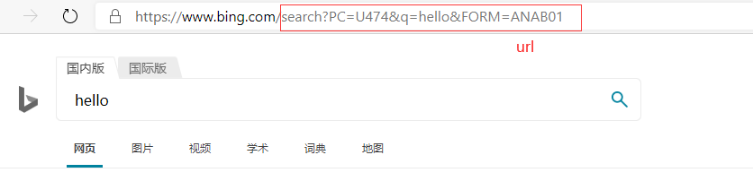

# HTTP
HTTP（hypertext transport protocol）协议『超文本传输协议』，协议详细规定了浏览器和万维网服务器之间互相通信的规则。
约定, 规则

## 请求报文
重点是格式与参数
```
行      POST  /s?ie=utf-8  HTTP/1.1        请求类型(GET,POST)   url路径(search?PC=U474&q=hello&FORM=ANAB01)   HTTP的版本
头      Host: atguigu.com                  格式都是A: B
        Cookie: name=guigu
        Content-type: application/x-www-form-urlencoded
        User-Agent: chrome 83
空行
体      username=admin&password=admin      GET请求的请求体为空，POST请求可以不为空
```

## 响应报文
```
行      HTTP/1.1  200  OK                  协议版本   响应状态码   响应状态字符串
头      Content-Type: text/html;charset=utf-8
        Content-length: 2048
        Content-encoding: gzip
空行    
体      <html>                             浏览器向服务端发送请求，服务端向浏览器返回的报文中包含了四个部分，响应体中就包含了html的内容，浏览器通过解析再将该内容取出，渲染页面并且呈现
            <head>
            </head>
            <body>
                <h1>尚硅谷</h1>
            </body>
        </html>
```
* 404  找不到
* 403  没有权限
* 401  未授权
* 500  内部错误
* 200  ok


#### 2 在Chrome浏览器中查看请求报文和响应报文
- 百度搜索谷粒学院，打开后台端，查看network部分

- 刷新页面，点击第一个,这是一个GET请求类型，没有报文体


