  


- [note](#note )
- [1 HTTP](#1-http )
  - [1.1 请求报文](#11-请求报文 )
  - [1.2 响应报文](#12-响应报文 )
  - [1.3 在 Chrome 浏览器中查看请求报文和响应报文](#13-在-chrome-浏览器中查看请求报文和响应报文 )
- [2 express 基本使用](#2-express-基本使用 )
- [3 ajax 发送 GET 请求](#3-ajax-发送-get-请求 )
- [4 ajax 发送 POST 请求](#4-ajax-发送-post-请求 )
- [5 ajax 响应 JSON 请求](#5-ajax-响应-json-请求 )
- [6 nodemon 工具](#6-nodemon-工具 )
- [7 AJAX 的 IE 缓存问题](#7-ajax-的-ie-缓存问题 )
- [8 AJAX 请求超时与网络异常](#8-ajax-请求超时与网络异常 )
- [9 ajax 重复发送请求](#9-ajax-重复发送请求 )
- [10 Jquery 中的 ajax](#10-jquery-中的-ajax )
- [11 axios-ajax 函数发送请求](#11-axios-ajax-函数发送请求 )
- [12 fetch](#12-fetch )
- [13 跨域](#13-跨域 )
- [13 跨域解决](#13-跨域解决 )
  
    - [（1)JSONP](#1jsonp )
- [13 CROS](#13-cros )
  
  
  
  
#  note


- 这部分是本人在观看了尚硅谷 ajax 教程做的笔记，教程源：https://www.bilibili.com/video/BV1WC4y1b78y，后续会根据自己的学习继续添加改进
# 一、Ajax简介

## ajax及XMLHttpRequest对象

浏览器和服务器之间，采用http协议通信

> - ajax: Asynchronous Javascript and XML 异步js通信，浏览器发请求，取得连接后，从服务器端获取到XML文档(目前从服务器返回的数据都是Json)，从中提取数据，再更新当前网页对应的界面，**而不用刷新整个网页**
> - AJAX 只能向同源网址（协议、域名、端口都相同）发出 HTTP 请求


AJAX通信的具体步骤：

> - 创建XMLHttpRequest实例
> - 发出http请求
> - 接收服务器传回的数据
> - 更新网页

`XMLHttpRequest`对象是AJAX通信的主要接口，用于服务器和浏览器之间的通信，尽管名字里面有`XML`和`Http`，它实际上可以使用多种协议（比如`file`或`ftp`），发送任何格式的数据（包括字符串和二进制）。

所有现代浏览器（IE7+、Firefox、Chrome、Safari 和 Opera）都有内建的 XMLHttpRequest 对象。可以使用new命令产生实例

```
// 创建实例
var xhr = new XMLHttpRequest();
// 指定建立http连接的方法和服务器地址，true表示请求是异步的
xhr.open('GET', 'http://www.example.com/page.php', true);
// 指定回调函数，监听通信状态（readyState属性）的变化。
xhr.onreadystatechange = function(){
  // 通信成功时，状态值为4
  /*
    readystate是xhr对象的属性，表示状态,5个值
        - 0(xhr实例生成了，但是实例的open()方法还没有被调用)
        - 1(open方法调用完毕)
        - 2(send方法调用完毕)
        - 3(服务端返回了结果)
        - 4(服务端返回的所有的结果)
  */
  if (xhr.readyState === 4){
    // 请求结束，服务器端返回了所有的结果，开始处理返回的数据
    // 判断响应状态码 200 404 403 401 500
    // 2xx均表示成功
    if(xhr.status >= 200 && xhr.status < 300){
        // 处理服务器返回的数据体
        console.log(xhr.response);
        // responseType表示服务器返回数据的类型,可写
        console.log(xhr.responseType);
        // responseText属性返回从服务器接收到的字符串，可读
        console.log(xhr.responseText);
        result.innerHTML = xhr.response;
    } else {
      console.error(xhr.statusText);
    }
  }
};
// 最后使用send()方法，实际发出请求。
xhr.send(null);
// send()的参数为null，表示发送请求的时候，不带有数据体
```

其他的属性：

```
xhr.responseURL:字符串，表示发送数据的服务器的网址
xhr.responseXML:返回从服务器接收到的 HTML 或 XML 文档对象，该属性为只读
xhr.status:表示服务器回应的 HTTP 状态码
	200, OK，访问正常
    301, Moved Permanently，永久移动
    302, Moved temporarily，暂时移动
    304, Not Modified，未修改,从缓存中得到
    307, Temporary Redirect，暂时重定向
    401, Unauthorized，未授权
    403, Forbidden，禁止访问
    404, Not Found，未发现指定网址
    500, Internal Server Error，服务器发生错误
    只有2xx和304的状态码，表示服务器返回是正常状态
xhr.statusText:返回一个字符串，表示服务器发送的状态提示
	“OK”
	“Not Found”
	
xhr.withCredentials:一个布尔值，表示跨域请求时，用户信息（比如 Cookie 和认证的 HTTP 头信息）是否会包含在请求之中，默认为false,如果需要，则将其设为true；如果服务器响应的响应头中包含`Access-Control-Allow-Credentials: true`,则需要在浏览器端打开

xhr.setRequestHeader():设置浏览器发送的 HTTP 请求的头信息
xhr.getResponseHeader():返回 HTTP 头信息指定字段的值
xhr.getAllResponseHeaders():返回一个字符串，表示服务器发来的所有 HTTP 头信息
xhr.abort():终止已经发出的 HTTP 请求,调用这个方法以后，readyState属性变为4，status属性变为0

```

事件监听属性：

```
XMLHttpRequest.onloadstart：loadstart 事件（HTTP 请求发出）的监听函数
XMLHttpRequest.onprogress：progress事件（正在发送和加载数据）的监听函数
XMLHttpRequest.onabort：abort 事件（请求中止，比如用户调用了abort()方法）的监听函数
XMLHttpRequest.onerror：error 事件（请求失败）的监听函数
XMLHttpRequest.onload：load 事件（请求成功完成）的监听函数
XMLHttpRequest.ontimeout：timeout 事件（用户指定的时限超过了，请求还未完成）的监听函数
XMLHttpRequest.onloadend：loadend 事件（请求完成，不管成功或失败）的监听函数
```

## 1.1 HTTP

HTTP（hypertext transport protocol）协议『超文本传输协议』，协议详细规定了浏览器和万维网服务器之间互相通信的规则。
约定, 规则

### 1.1.1 请求报文


重点是格式与参数

```
行      POST  /s?ie=utf-8  HTTP/1.1        请求类型(GET,POST)   url路径(search?PC=U474&q=hello&FORM=ANAB01)   HTTP的版本
头      Host: atguigu.com                  格式都是A: B
        Cookie: name=guigu
        Content-type: application/x-www-form-urlencoded
        User-Agent: chrome 83
空行
体      username=admin&password=admin      GET请求的请求体为空，POST请求可以不为空
```

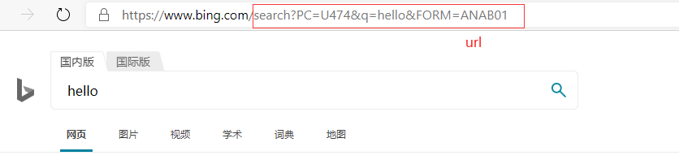

### 1.1.2 响应报文


```
行      HTTP/1.1  200  OK                  协议版本   响应状态码   响应状态字符串
头      Content-Type: text/html;charset=utf-8
        Content-length: 2048
        Content-encoding: gzip
空行
体      <html>                             浏览器向服务端发送请求，服务端向浏览器返回的报文中包含了四个部分，响应体中就包含了html的内容，浏览器通过解析再将该内容取出，渲染页面并且呈现
            <head>
            </head>
            <body>
                <h1>尚硅谷</h1>
            </body>
        </html>
```

> - 响应状态码：
>   - 404 服务器无法根据客户端的请求找到资源
>   - 403 直接在本地缓存中读取
>   - 401 未授权/请求要求用户的身份认证
>   - 500 服务器内部错误，无法完成请求
>   - 200 ok

### 1.1.3 在 Chrome 浏览器中查看请求报文和响应报文


- 百度搜索谷粒学院，打开后台端，查看 network 部分
  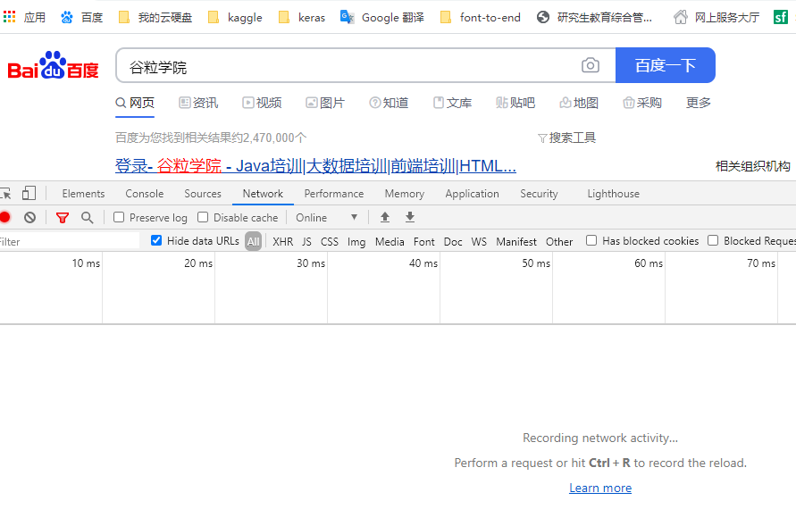
- 刷新页面，点击第一个,这是一个 GET 请求类型，没有报文体
  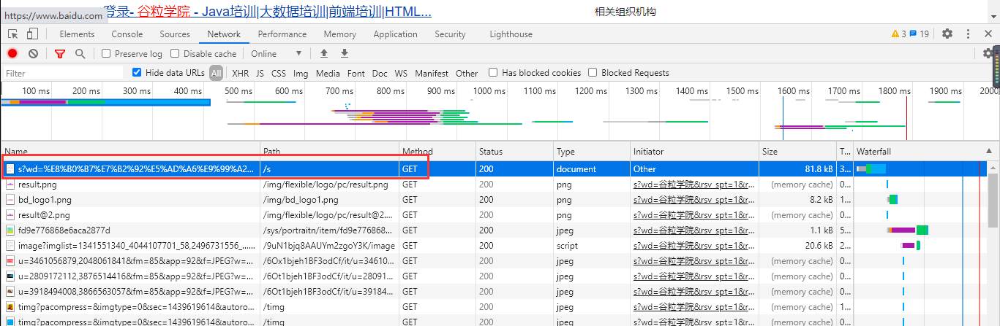
  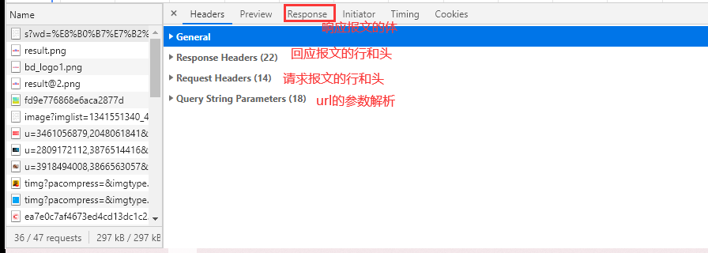
  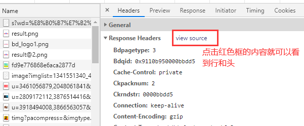
  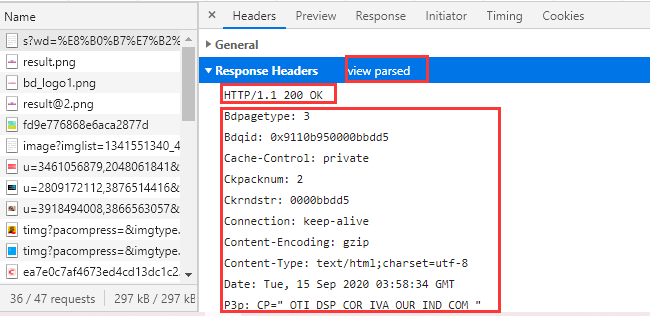

### 1.1.4 rest API

请求方法：

- GET: 从服务器端读取数据，浏览器发送的都是get请求
- POST: 向服务器端添加新数据
- PUT: 更新服务器端的数据
- DELETE: 删除服务器端数据

API的分类：

> - 1 REST API :restful
>   - 发送请求进行CRUD(create retrieve update delete)    具体执行哪个操作由请求方式决定
>   - 同一个请求路径可以进行多个操作，这主要由服务器端的接口处的代码决定
>   - 请求方式可以是get/post/put/delete  
>     - get用于查询，post用于添加，put用于更新，delete用于删除
>   - 例如，对于同一个接口/user,get方法设置了一个响应方式，post又设置了另一个
> - 2 非REST API:  restless
>   - 请求方式不决定请求的CRUD操作
>   - 一个请求路径只对应一个操作
>   - 请求方法一般只有get/post

使用json-server搭建rest接口：

```
json-server:是一个工具包
https://github.com/typicode/json-server

1 全局安装json-server
	npm install -g json-server
2 创建一个文件db.json  
	这个文件就模拟数据库，在其中预存一些数据 posts表示文档，comments表示文章的评论，profile所有文章的共同作者
	{
      "posts": [
        { "id": 1, "title": "json-server", "author": "typicode" },
        { "id": 2, "title": "json-server2", "author": "typicode2" }
      ],
      "comments": [
        { "id": 1, "body": "some comment", "postId": 1 }
      ],
      "profile": { "name": "typicode" }
    }
3 启动服务器，监视db.json,也就是按照不同的请求方法和路径操作db文件，类似于数据库的增删改除
	json-server --watch db.json
4 验证get请求，浏览器的地址栏发送的请求都输出get请求，所以直接访问http://localhost:3000/
```

> - 可以发现，它提供了三个接口`posts,comments,profile`,每一个接口都可以进行增删改查操作

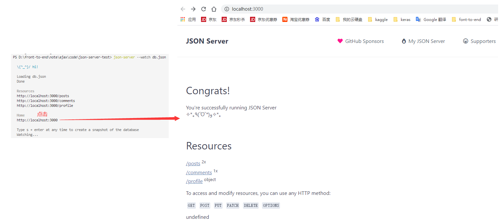

紧接着访问`http://localhost:3000/posts`即可发送get请求获得db.json中的数据：

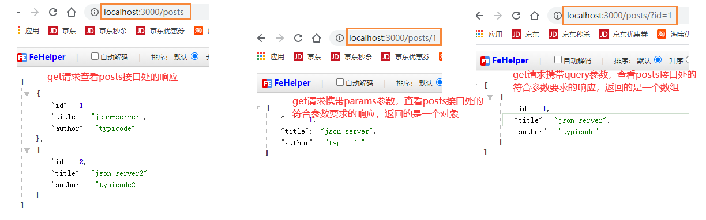

使用postman发送post请求，向数据库中添加数据：

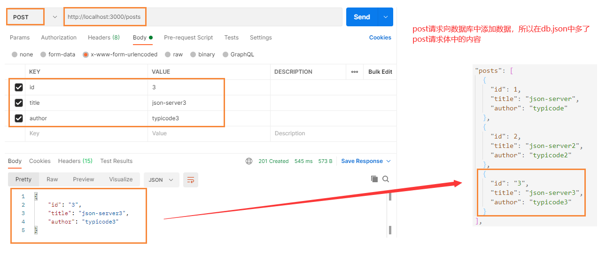

使用postman发送put请求,更新数据库中的数据

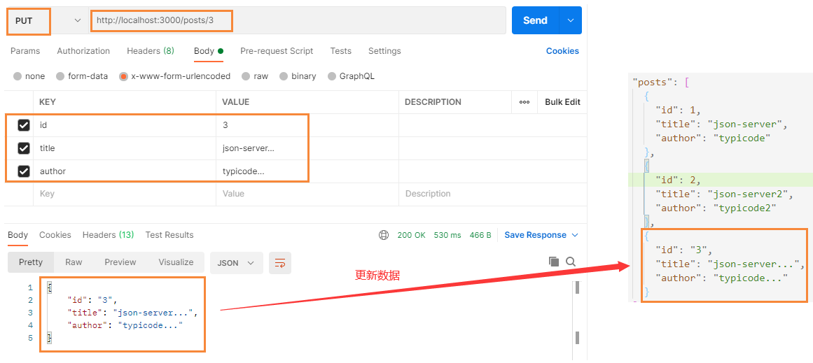

使用postman发送delete请求,删除数据库中的数据

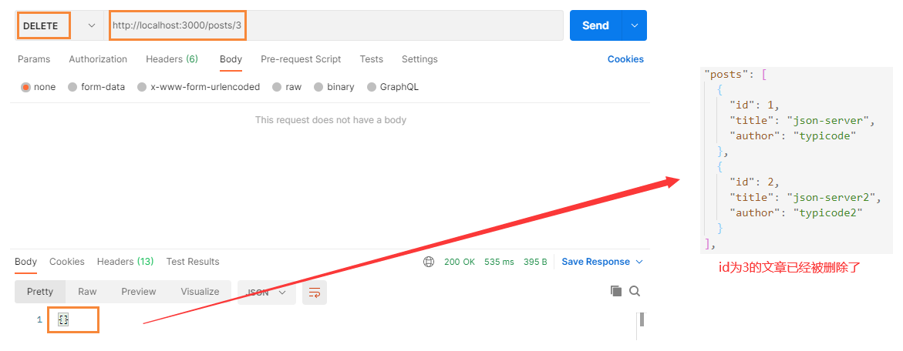


## 1.2 区别ajax请求和http请求

```
1 ajax请求是一种特别的http请求
2 对于服务器而言，两者没有任何区别，区别在于浏览器端
3 浏览器端发送请求：只有xhr和fetch发出的才是ajax请求，其他均不是ajax请求
4 浏览器端接收到响应
	1. 一般请求：浏览器一般会直接显示响应体数据，也就是刷新或者跳转页面
	2. ajax请求：浏览器不会对界面进行任何的更新操作，只是调用监视的回调函数，并且传入响应相关数据，一般我们会将修改DOM的代码放置在回调函数中
```

## 1.2 express 基本使用


- express 是基于 Node.js 平台，快速、开放、极简的 Web 开发框架
- 模拟一个服务器，产生对于各个路由路径的响应
```
npm init --yes:初始化，npm是一个包管理工具
npm i express:安装express
```

- express 使用的例子：
  - app.get(url,回调)：url 指的是服务器的地址规则，使用正则表达式的方式
```
// 1 先引入express
const express = require('express');
// 2 创建应用对象
const app = express();
// 3 创建路由规则
app.get('/',(request,response)=>{
    // request是对请求报文的一个封装
    // response是对响应报文的一个封装
    response.send('HELLO EXPRESS');
});
// 4 监听端口启动服务
app.listen(8000,()=>{
    console.log('服务已经启动，8000端口监听中');
})
```

## 1.3 ajax 发送 GET 请求


- 显示效果：当点击 button 后向服务器端发送请求，然后将响应体的结果呈现在 div 中

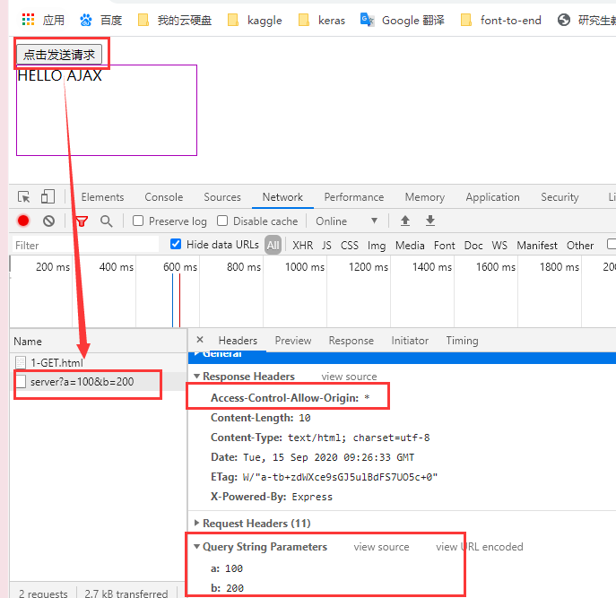

- 1 服务器端
  - 模拟一个服务器端：创建路由规则，并且设定响应体和响应头
```
// 服务器端准备
//1. 引入express
const express = require('express');
  
//2. 创建应用对象
const app = express();
  
//3. 创建路由规则
// request 是对请求报文的封装
// response 是对响应报文的封装
// url设置的是响应请求的地址(正则表达式)，必须包含server关键词或者是/server，这是路由规则
app.get('/server', (request, response)=>{
    // 设置响应头,设置允许跨域
    response.setHeader('Access-Control-Allow-Origin','*')
    //设置响应
    response.send('HELLO AJAX');
});
  
//4. 监听端口启动服务
app.listen(8000, ()=>{
    console.log("服务已经启动, 8000 端口监听中....");
});
```

- 设置好服务器端后，需要在服务器文件所在的文件夹下开启该服务器：
```
node ./.server.js
```

- 2 浏览器端
  - 定义请求对象，设置请求方法及请求的浏览器地址，发送请求
  - xhr.open(method,url);
    - url 指定想要访问的地址
    - **127.0.0.1 是回送地址，指本地机，一般用来测试使用**。回送地址（127.x.x.x）是本机回送地址（Loopback Address），即主机 IP 堆栈内部的 IP 地址，主要用于网络软件测试以及本地机进程间通信，无论什么程序，一旦使用回送地址发送数据，协议软件立即返回，不进行任何网络传输。
```
css:
<style>
    #result {
        width: 200px;
        height: 100px;
        border: solid 1px #90b;
    }
</style>
  
html:
<button>点击发送请求</button>
<div id="result"></div>
  
js:
<script>
    // 获取button元素
    const btn = document.getElementsByTagName('button')[0];
    console.log(btn);
    const result = document.getElementById('result');
    // onclick小写，我们的目的是点击按钮从而获取服务器的返回报文
    btn.onclick = function(){
        // 1 创建对象
        const xhr = new XMLHttpRequest();
        // 2 初始化，设置请求的方法和url
        // 在url中传递参数，使用?分割，参数名1=参数值1&参数名2=参数值2
        // url是要服务器端的地址，表示向谁发送请求
        xhr.open('GET','http://127.0.0.1:8000/server?a=100&b=200');
        // 3 发送
        xhr.send();
        // 4 事件绑定，处理服务端返回的结果
        
       // 当状态改变时调用下面的方法
        xhr.onreadystatechange = function(){
            // 判断(服务器返回了所有的结果)
            if(xhr.readyState === 4){
                // 判断响应状态码 200 404 403 401 500
                // 2xx均表示成功
                if(xhr.status >= 200 && xhr.status < 300){
                    // 处理结果：行，头，空行，体
                    // 1 响应行：状态码和状态字符串
                    console.log(xhr.status);
                    console.log(xhr.statusText);
                    // 2 响应头
                    console.log(xhr.getAllResponseHeaders);
                    // 3 响应体
                    console.log(xhr.response);
                    result.innerHTML = xhr.response;
                }
            }else{
            }
        }
    }
</script>
```

## 1.4 ajax 发送 POST 请求


- 实现的效果：当鼠标移动到 div 框上时向服务器端发送 POST 请求，然后将响应体的结果呈现在 div 中
  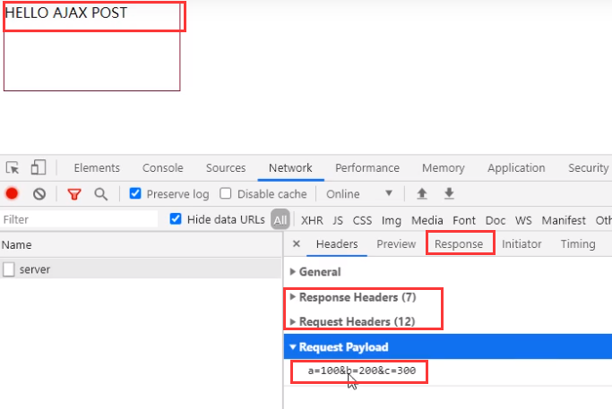
- 服务器端
  - 当发送的是 post 请求并且路径是'/server'才会响应
```
// 服务器端准备
//1. 引入express
const express = require('express');
  
//2. 创建应用对象
const app = express();
  
//3. 创建路由规则
// request 是对请求报文的封装
// response 是对响应报文的封装
// 请求服务的路径必须包含server关键词或者是/server，这是路由规则
app.post('/server', (request, response)=>{
    // 设置响应头,设置允许跨域
    response.setHeader('Access-Control-Allow-Origin','*')
    // 添加一个特殊的响应头,表示允许浏览器发送的报文中包含自定义的头信息
    // response.setHeader('Access-Control-Allow-Headers','*');
    //设置响应
    response.send('HELLO AJAX POST');
});
  
//4. 监听端口启动服务
app.listen(8000, ()=>{
    console.log("服务已经启动, 8000 端口监听中....");
});
```

- 浏览器端
```
<style>
    #result{
        width:200px;
        height:100px;
        border:solid 1px #903;
    }
</style>
  
<div id="result"></div>
<script>
    //获取元素对象
    const result = document.getElementById("result");
    //绑定事件
    result.addEventListener("mouseover", function(){
        //1. 创建对象
        const xhr = new XMLHttpRequest();
  
        //2. 初始化 设置类型与 URL
        xhr.open('POST', 'http://127.0.0.1:8000/server');
  
        //设置请求头
        xhr.setRequestHeader('Content-Type','application/x-www-form-urlencoded');
        // 自定义头信息，但是注意：添加了这个自定义的请求头之后会报错,因为浏览器存在安全机制
        // xhr.setRequestHeader('name','atguigu');
  
        //3. 发送   设置请求体
        xhr.send('a=100&b=200&c=300');
        // xhr.send('a:100&b:200&c:300');
        // xhr.send('1233211234567');
  
        //4. 事件绑定
        xhr.onreadystatechange = function(){
            //判断
            if(xhr.readyState === 4){
                if(xhr.status >= 200 && xhr.status < 300){
                    //处理服务端返回的结果
                    result.innerHTML = xhr.response;
                }
            }
        }
    });
</script>
```

- ajax 设置请求头信息
  - xhr.setRequestHeader('名字','值');
- 如果浏览器在发送请求报文时添加了自定义的头信息，比如
```
xhr.setRequestHeader('name','atguigu');
```

- 由于浏览器的安全机制，会报错，所以在服务器端需要添加一行代码，表示允许浏览器发送的报文中包含自定义的头信息
```
// *表示支持所有自定义的头信息
response.setHeader('Access-Control-Allow-Headers','*');
```

- 但是这样写还不够，浏览器还会发送一个 OPTIONS 请求，去检测我自己定义的头信息可不可以用，因为在上面的代码中，没有设置与 OPTIONS 请求对应的服务器响应，所以得不到结果，从而导致 post 请求不能产生响应。所以还需要将 app.post 修改为 app.all,允许所有类型的浏览器请求(get,post,options 等)均得到响应
## 1.5 ajax 响应 JSON 请求


- 1 服务器端
  - 如果希望响应体传输一个 object 数据，而由于 send(字符串)函数的限制，不能传递除了字符串之外的值，所以可以先使用 JSON.stringify()将 object 方法转为 JSON 字符串，然后传递
```
app.all('/json-server', (request, response)=>{
    // 设置响应头,设置允许跨域
    response.setHeader('Access-Control-Allow-Origin','*')
    // 添加一个特殊的响应头,表示允许浏览器发送的报文中包含自定义的头信息
    response.setHeader('Access-Control-Allow-Headers','*');
    console.log(1111)
    // 响应一个数据
    const data = {
        name:'atguigu'
    }
    //设置响应,由于send只能接收字符串类型，所以需要对data做转换
    // 借助于JSON.Stringify()
    let str = JSON.stringify(data);
    response.send(str);
});
```

- 2 浏览器端
  
  - 有两种方法将响应报文体中的 json 数据转换为 object
    - (1)自动:设置响应体数据的类型必须为 json,然后自动将 json 响应体数据转换为 object`xhr.responseType = 'json';`
    - (2)手动:使用 JSON.parse() 将 JSON 字符串转换为对象`let data = JSON.parse(xhr.response); result.innerHTML = data.name;`
  
- 浏览器端设置：
```
window.onkeydown = function(){
    const result = document.getElementById('result');
    const xhr = new XMLHttpRequest();
    // 将地址改为json-server
    xhr.open('GET','http://127.0.0.1:8000/json-server');
  
    // 方法2 ：设置响应体数据的类型必须为json,然后自动将json响应体数据转换为object
    xhr.responseType = 'json';
  
    xhr.send();
    xhr.onreadystatechange= function(){
        if(xhr.readyState === 4){
            if(xhr.status >= 200 && xhr.status < 300){
  
                // 方法1： 使用JSON.parse()  将JSON字符串转换为对象，再将其name属性值取出来
                // let data = JSON.parse(xhr.response);
                // result.innerHTML = data.name;
  
                console.log(typeof xhr.response);  // object
                result.innerHTML = xhr.response.name;
            }
        }
    }
}
```

## 1.6 nodemon 工具


- nodemon 用来监视 node.js 应用程序中的任何更改并自动重启服务,非常适合用在开发环境中
- 安装
```
npm install -g nodemon
```

- 然后再 server.js 所在的文件夹下输入下面的代码，回车即可启动服务器的 8000 端口进行监视：
```
nodemon .\server.js
```

- 注意如果上一个步骤报错，则以管理员身份打开`power shell`,输入`set-ExecutionPolicy RemoteSigned`回车，然后选择 A 或者 Y，回车即可解决
- 使用它开启监视之后，只要我们随机改变 server.js 并且保存后，就会自动重启服务器，从而不需要再每次使用 node server.js 重新启动了
## 1.7 AJAX 的 IE 缓存问题


- 这个问题在 ie11 中仍然存在,Microsoft Edge 中已经改好了
- IE 浏览器会将 AJAX 的请求结果缓存起来，当下一次再次请求时会从本地的缓存结果中寻找，这样就会导致时效性较强的场景出现问题
- 比如我们第一次点击请求服务之后得到响应体为'HELLO IE',然后在服务器中修改响应体为'HELLO IE 2',在 ie 浏览器中再次点击请求服务还是会出现'HELLO IE'
- 解决这个问题的办法：在每次请求的 url 中添加一个时间戳，这样每次请求的参数均不相同，ie 就会将其作为两个不同的请求处理
```
xhr.open("GET",'http://127.0.0.1:8000/ie?t='+Date.now());
```

## 1.8 AJAX 请求超时与网络异常


- 使用 xhr 对象的 timeout 属性设置一个确切的时间，
```
<script>
  const btn = document.getElementsByTagName('button')[0];
  const result = document.querySelector('#result');
  
  btn.addEventListener('click', function(){
      const xhr = new XMLHttpRequest();
  
      //超时设置 2s，当点击请求2s后没有得到响应，则就会自动取消响应
      xhr.timeout = 2000;
  
      //超时回调，当超过指定时长自动调用的函数，向用户解释
      xhr.ontimeout = function(){
          alert("网络异常, 请稍后重试!!");
      }
      //网络异常回调
      xhr.onerror = function(){
          alert("你的网络似乎出了一些问题!");
      }
  
      xhr.open("GET",'http://127.0.0.1:8000/delay');
      xhr.send();
      xhr.onreadystatechange = function(){
          if(xhr.readyState === 4){
              if(xhr.status >= 200 && xhr.status< 300){
                  result.innerHTML = xhr.response;
              }
          }
      }
  })
</script>
```

- 服务器端：
```
app.get('/delay', (request, response)=>{
    // 设置响应头,设置允许跨域
    response.setHeader('Access-Control-Allow-Origin','*')
    // 3秒以后再将响应结果发送给服务器端
    setTimeout(()=>{
        response.send('HELLO DELAY');
    },3000);
    //设置响应
});
```

- 网络异常演示:将图中的 online 修改为 offline,然后点击请求服务，就会直接调用网络异常的回调函数 onerror
  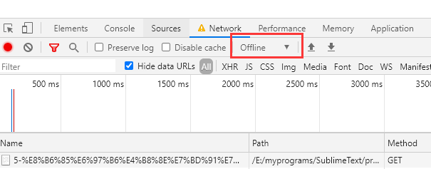

9 # ajax 取消请求

- 在发送请求之后，并且没有得到响应报文之前，可以通过代码自动取消请求
- 实现的效果：定义两个按钮，一个发送请求，一个取消请求，设置服务器端延时响应，使用请求超时设置的服务器，点击发送请求后，等待 3 秒，服务器才会发送响应报文，所以在 3 秒内，点击取消请求均可以取消，取消请求的设置如下：
```
xhr.abort();  // 即可取消
```

- 浏览器端设置如下：
```
<button>发送请求</button>
<button>取消请求</button>
<script>
    const btn = document.querySelectorAll('button');
    // xhr对象两个按钮均需要使用，所以需要放在外面定义
    let xhr = null;
    // 发送请求
    btn[0].onclick = function(){
        xhr = new XMLHttpRequest();
        xhr.open('GET','http://127.0.0.1:8000/delay');
        xhr.send();
    }
    // 取消请求
    btn[1].onclick = function(){
        xhr.abort();
    }
</script>
```

## 1.9 ajax 重复发送请求


- 当用户发送请求 1 之后，在未得到响应之前再发送请求 2，一旦此时存在大量的用户这样反复请求，会导致浏览器奔溃，所以此时就需要取消请求 1，保证对于一个任务就创建一个请求 2
- 添加一个标识变量，在创建对象之后令 isSending=true,然后通过判断状态码改变为 4 后就将该变量修改为 false;
```
<button>发送请求</button>
<script>
    const btn = document.querySelectorAll('button')[0];
    let xhr = null;
    // 建立标识变量
    let isSending = false;
    btn[0].onclick = function(){
        // 如果正在发送，则取消该请求，创建一个新的请求
        if(isSending) {
            xhr.abort();
        }
        xhr = new XMLHttpRequest();
        isSending = true;
        xhr.open('GET','http://127.0.0.1:8000/delay');
        xhr.send();
        xhr.onreadystatechange = function(){
            if(xhr.readyState === 4){
                isSending = false;
            }
        }
    }
</script>
```

# 二、第三方库的出现

由于xhr对象使用较为繁琐，所以就出现了一些第三方库对其进行了封装，方便使用

常用的ajax请求库：

> - jQuery:比较重，jquery是专门操作DOM的，与React设计初衷相违背，React核心就是不自己操作DOM
> - axios:轻量级，建议使用
>   - 封装了浏览器的XMLHttpRequest对象的ajax
>   - promise风格
>   - 可以用在浏览器端和node服务器端

## 2.1 Jquery 中的 ajax

## 2.2 axios


- axios 的包配置如下：https://github.com/axios/axios
- axios 发送 get 请求：
  - `axios.get(url,{其他配置})`
- axios 发送 post 请求：
  - `axios.post(url,{请求体},{其他配置})`
- axios 发送 ajax 请求
  - `axios({所有配置})`
- 例子：定义 3 个按钮，分别使用 axios.get,axios.post,axios 发送请求
- 浏览器端：
```
// 需要引入axios的一个远程资源，包
<script crossorigin='anonymous' src="https://cdn.bootcdn.net/ajax/libs/axios/0.19.2/axios.js"></script>
<button>get</button>
<button>post</button>
<button>ajax</button>
<script>
    const btn = document.querySelectorAll('button');
    // 配置baseURL
    axios.defaults.baseURL = 'http://127.0.0.1:8000';
    btn[0].onclick = function(){
        // get请求
        axios.get('/axios-server',{
            // url参数
            params:{
                id:100,
                vip:7
            },
            // 请求头参数
            headers:{
                name:'atguigu',
                age:20
            }
        }).then(value=>{
            // value是响应体解析之后得到的对象
            console.log(value);
        });
    }
  
    btn[1].onclick = function(){
        // post请求
        axios.post('/axios-server', { // 请求体
            username:'admin',
            passward:'admin'
        },{
            // url参数
            params:{
                id:200,
                vip:9
            },
            // 请求头参数
            headers:{
                name:'huanhuan',
                age:23
            }
        }).then(value=>{
            // value是响应体解析之后得到的对象
            console.log(value);
        });
    }
  
    btn[2].onclick = function(){
        axios({
            'method':'POST',
            url:'/axios-server',
            // url参数
            params:{
               vip:10,
               level:30
            },
            headers:{
                a:100,
                b:200
            },
            data:{
                username:'admin',
                passward:'admin'
            }
        }).then(response => {
            // 响应体
            console.log(response);
        })
    }
</script>
```

- 服务器端
```
// axios服务
app.all('/axios-server', (request, response)=>{
    // 设置响应头,设置允许跨域
    response.setHeader('Access-Control-Allow-Origin','*');
    // 添加一个特殊的响应头,表示允许浏览器发送的报文中包含自定义的头信息
    response.setHeader('Access-Control-Allow-Headers','*');
    const data = {
        name:'尚硅谷'
    }
    //设置响应,由于send只能接收字符串类型，所以需要对data做转换
    // 借助于JSON.Stringify()
    let str = JSON.stringify(data);
    response.send(str);
});
```

- get 请求的效果：
  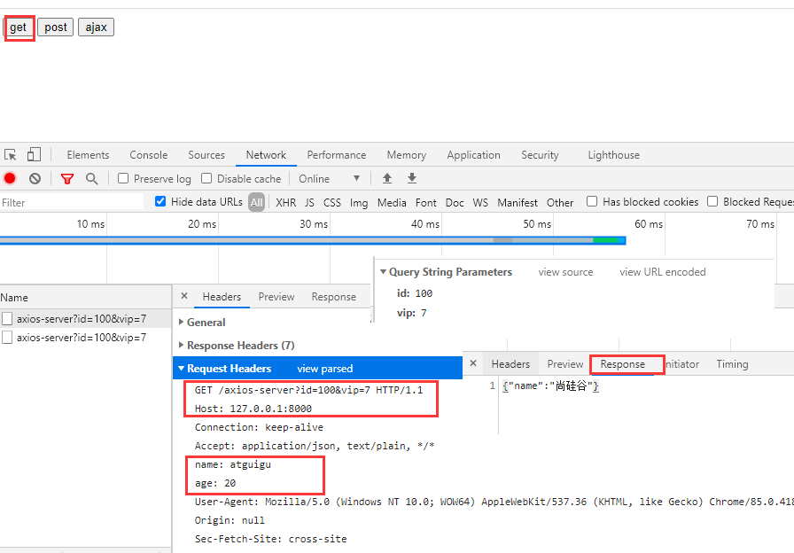
- post 请求的效果：
  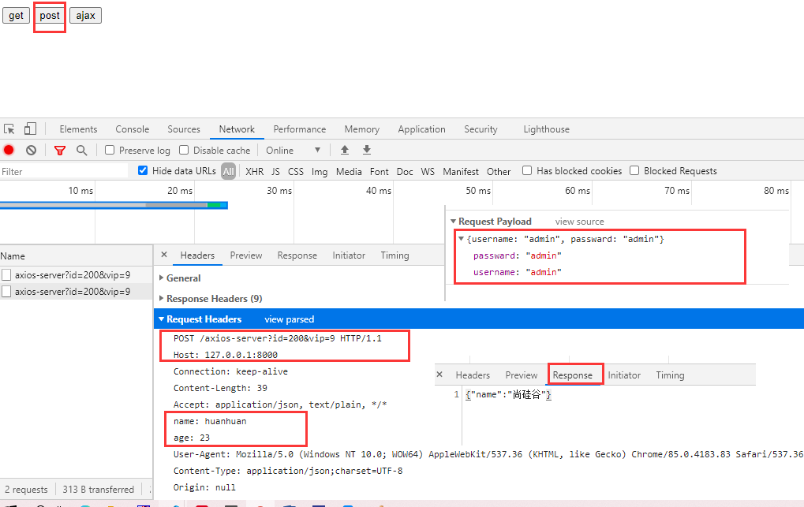
- axios 请求的结果：
  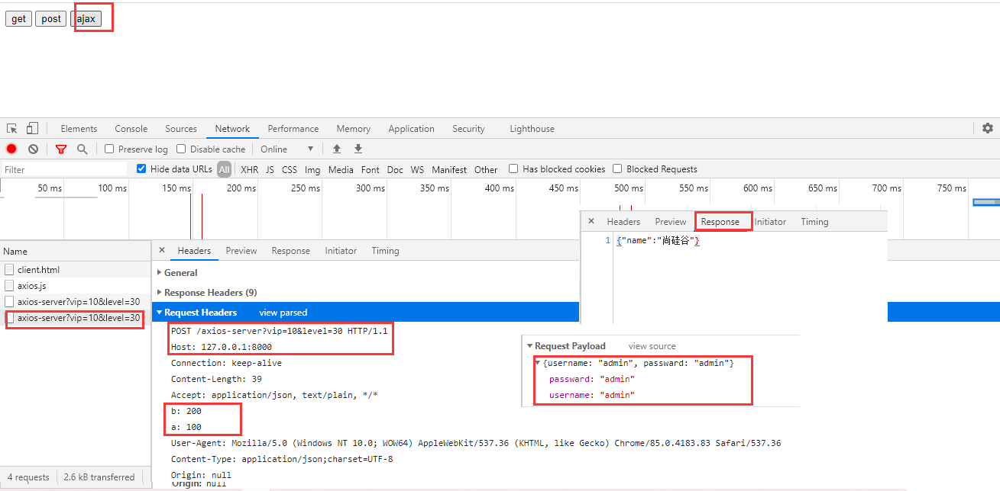
- 三个请求服务器端的返回结果均相同，由于请求的参数设置不同，请求头不同
## 2.3 fetch

fetch是浏览器自带的发请求的一个对象，与xhr是同等级的，promise风格的，但是兼容性不好，老版本浏览器不支持


- API 文件：https://developer.mozilla.org/zh-CN/docs/Web/API/WindowOrWorkerGlobalScope/fetch
- `fetch('url',{其他配置})`
- fetch 会返回一个 Promise 对象，可以通过 then 方法获取，该对象中的函数体包含在 text()(或者 json(),这取决于响应体的数据类型)
```
fetch(url,{}).then(response => {
    return response.text();
}).then(body => {
    console.log(body);
})
```

- 例子：使用一个 button 按钮控制发送 fetch 请求
- 服务器端：
```
// fetch服务
app.all('/fetch-server', (request, response)=>{
    // 设置响应头,设置允许跨域
    response.setHeader('Access-Control-Allow-Origin','*');
    // 添加一个特殊的响应头,表示允许浏览器发送的报文中包含自定义的头信息
    response.setHeader('Access-Control-Allow-Headers','*');
    const data = {
        name:'尚硅谷'
    }
    //设置响应,由于send只能接收字符串类型，所以需要对data做转换
    // 借助于JSON.Stringify()
    let str = JSON.stringify(data);
    response.send(str);
});
```

- 浏览器端
```
<button>发送请求</button>
<script>
    const btn = document.querySelector('button');
    console.log(btn);
    btn.onclick = function(){
        console.log(1111);
        fetch('http://127.0.0.1:8000/fetch-server?vip=10',{
            method:"POST",
            headers:{
                name:'huanhuan'
            },
            body:'username=admin&password=admin'
        }).then(response => {
            // 返回一个Promise对象response,响应对象包含在text()中
            return response.text();
            // 如果响应是一个json字符串，则可以使用response.json()操作
        }).then(body => {
            // 通过使用ex6中then方法的传递性，前一个then的return作为这一个then的参数传入
            console.log(body);
        })
    }
</script>
```

# 三、 跨域


- 同源策略：
  
  - 当前发送请求的 url 与 ajax 请求的目标资源的 url 必须保证：协议、域名、端口号完全相同
  - ajax 默认遵循同源策略
  - 违背同源策略就是跨域
  
- 例如：下面发送请求的界面 index.html 来自于`http:127.0.0.1:9000/home`，而响应数据也是来自于这个 url
  - 首先在文件所在的文件下位置下打开服务器端：`nodemon server.js`
  - 然后在浏览器中输入`http:127.0.0.1:9000/home`就可以打开 index 界面，这就是发送请求的 html,然后点击发送请求按钮，此时就会发送一个 get 请求，返回的数据来自于`http:127.0.0.1:9000/data`。协议，域名，端口号均相同
- 服务器端：
```
const express = require('express');
const { request, response } = require('express');
const app = express();
app.get('/home',(request,response)=>{
    // 响应一个页面
    response.sendFile(__dirname+'/index.html');
  
})
app.get('/data',(request,response)=>{
    // 响应一个页面
    response.send('用户数据');
  
})
app.listen(9000, ()=>{
    console.log('服务已经启动....');
});
```

- 浏览器端
```
<button>点击获取用户数据</button>
<script>
    const btn = document.querySelector('button');
    btn.onclick = function(){
        const xhr = new XMLHttpRequest();
        xhr.open('GET','/data');
        xhr.send();
        xhr.onreadystatechange = function(){
            if(xhr.readyState === 4){
                if(xhr.status >= 200 && xhr.status<300){
                    console.log(xhr.response);
                }
            }
        }
    }
</script>
```

## 3.1 跨域解决方案1: JSONP


- 利用 script 标签的 src 属性发送 http get请求，不要求同源，但是jsonp只支持get请求
- 这样即使浏览器端 url 为本地地址(比如 file:///E:/myprograms/SublimeText/project/ajax/%E8%B7%A8%E5%9F%9F/client.html)，但是也可以访问 url(http://127.0.0.1:8000/check-username)的内容，很明显可以发现这两个地址的协议、域名、端口号均不相同，属于非同源，也就是跨域操作
- 注意：**使用 script 标签发送的请求要求返回的报文体一定是 js 代码段**
- 例子参见：页面布局一个文本框，一个段落。在文本框内输入文本，失去焦点后，自动发送 http get 请求
- 服务器端：
```
const express = require('express');
const app = express();
// 注意：request和response的位置不能改变
app.get('/check-username',(request,resopnse) => {
    const data = {
        exist: 1,
        msg: 用户名存在
    }
    // 转json字符串
    let str = data.stringify(data);
    // 响应体为js中的函数调用，虽然表示为字符串的行为，但是浏览器接收到之后，会自动执行js代码段
    response.send('handle(' + str + ')');
})
app.listen(8000, ()=>{
    console.log('服务器已经启动...');
})
```

- 浏览器端
```
<!DOCTYPE>
<html>
    <head>
        <meta charset='utf-8'>
        <title>跨域jsonp操作</title>
        <style type='text/css'>
            p {
                width: 200px;
                height: 100px;
                border: yellow 2px solid;
            }
        </style>
    </head>
    <body>
        用户名：<input type='text' />
        <p></p>
        const input = document.querySelector('input');
        const p = document.querySelector('p');
  
        function handle(data){
            // 修改input的边框颜色
            input.style.border = '1px solid red';
            // 将返回值的msg属性添加到p中
            p.innerHTML = data.msg;
        }
  
        // 失去焦点：向服务端发送请求，检测用户名是否存在
        input.onblur = function(){
  
            // 创建一个script标签，发送http get请求
            const script = document.createElement('script');
            script.src = 'http://127.0.0.1:8000/check-name';
            // 将script标签添加到body中
            document.body.appendChild(script);
        }
    </body>
</html>
```

## 3.2 跨域解决方案2:CORS


- 文档：https://developer.mozilla.org/zh-CN/docs/Web/HTTP/Access_control_CORS
- 对于之前原生 ajax 中的操作均是跨域操作，但是我们不是使用 jsonp 实现的，而是使用 CROS 实现的
- CORS：Cross-Origin Resource Sharing 跨域资源共享
- 一种官方的解决方案，不需要在浏览器端做任何处理，直接在服务器端进行处理，支持 get 和 post 请求
- CORS 提供了一组 HTTP 首部字段，允许服务器声明哪些源站通过浏览器有访问权限访问哪些资源
  - 通过设置一个响应头来告诉浏览器，允许跨域请求，浏览器收到该响应后就会对该响应放行
```
app.get(url,(request,response) => {
    // 允许跨域，第二个参数表示允许的站源，*表示通配，指代所有
    response.setHeader('Access-Control-Allow-Origin','*');
    // 只允许http:127.0.0.1这个网页通过8000端口访问该服务器url
    response.serHeader('Access-Control-Allow-Origin','http:127.0.0.1:8000');
  
    // 允许自定义请求头
    response.setHeader('Access-Control-Allow-Headers','*');
    // 允许自定义请求方法，默认get和post可以用,如果要是用其他方法请求就可以设置
    response.setHeader('Access-Control-Allow-method','*');
})
```

参考：https://wangdoc.com/javascript/bom/cors.html

浏览器一旦发现 AJAX 请求跨域，就会自动添加一些附加的头信息，有时还会多出一次附加的请求，但用户不会有感知。因此，实现 CORS 通信的关键是服务器。只要服务器实现了 CORS 接口，就可以跨域通信。

CORS请求分为两类：简单请求和非简单请求

### 3.3.1 简单请求

只要同时满足以下两大条件，就属于简单请求。

（1）请求方法是以下三种方法之一。

> - HEAD：类似于get请求，返回的响应中不包含响应体，用户获取报头
> - GET：数据包含在url中，返回的响应中有响应体
> - POST：数据包含在请求体中

（2）HTTP 的请求头信息不超出以下几种字段。

> - Accept
> - Accept-Language：允许客户端声明它可以理解的自然语言
> - Content-Language：访问者希望采用的语言或语言组合
> - Last-Event-ID
> - Content-Type：告诉服务器实际发送的数据类型
>   - 只限于三个值
>   - `application/x-www-form-urlencoded`:表单默认的提交数据的格式,key/value格式
>   - `multipart/form-data`:需要在表单中进行文件上传时，就需要使用该格式
>   - `text/plain`:纯文本格式

### 3.1.2 非简单请求

除了简单请求，就是非简单请求了

非简单请求的 CORS 请求，会在正式通信之前，增加一次 HTTP 查询请求，称为**“预检”请求（preflight）**。

> - 浏览器先询问服务器，当前网页所在的域名是否在服务器的许可名单之中，以及可以使用哪些 HTTP 方法和头信息字段。只有得到肯定答复，浏览器才会发出正式的`XMLHttpRequest`请求，否则就报错。
> - 这是为了防止这些新增的请求，对传统的没有 CORS 支持的服务器形成压力，给服务器一个提前拒绝的机会，这样可以防止服务器收到大量`DELETE`和`PUT`请求，这些传统的表单不可能跨域发出的请求。

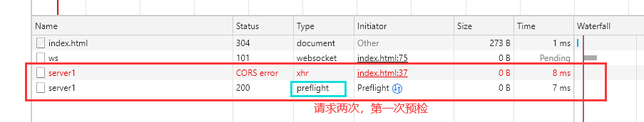

#### (1) 预检请求

如果服务器设置的Access-Control-Allow-Origin中不包含当前请求的url，则服务器会返回一个正常的HTTP回应，但是响应头中不包含任何与CROS相关的头信息字段

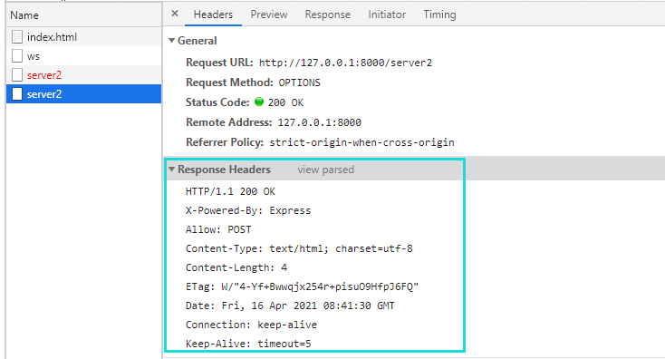

与CROS相关的头信息字段：

```
Access-Control-Allow-Origin字段:允许哪些域访问当前服务器
Access-Control-Allow-Methods:表明服务器支持的所有跨域请求的方法
Access-Control-Allow-Headers：表明服务器支持的所有头信息字段
Access-Control-Allow-Credentials：浏览器是否可以发送cookie信息
Access-Control-Max-Age：用来指定本次预检请求的有效期，单位为秒
```

这时，浏览器就会认定，服务器不同意预检请求，会报错，表示预检请求的响应头中不包含Access-Control-Allow-Origin字段，导致当前请求失败

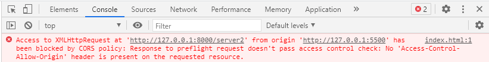

#### (2) 浏览器的正常请求和响应

如果服务器设置的Access-Control-Allow-Origin中包含当前请求的url，则预检请求会通过。但是由于我们在请求中加入了一个请求头：`xhr.setRequestHeader('X-Custom-Header', 'value');`,所以在服务器端需要使用`response.setHeader('Access-Control-Allow-Headers','*');`设置该请求头可访问

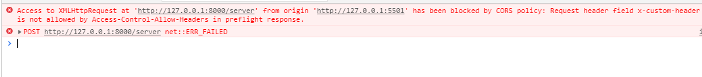


一旦服务器通过了“预检”请求，以后每次浏览器正常的 CORS 请求，就都跟简单请求一样，会有一个`Origin`头信息字段。服务器的回应，也都会有一个`Access-Control-Allow-Origin`头信息字段。

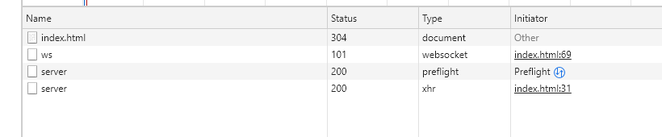

### 3.1.3 jsonp和CROS比较

> - jsonp不要求同源，CROS要求同源
> - jsonp只能发送get请求，cros可以发送任何http请求
> - JSONP 的优势在于支持老式浏览器，以及可以向不支持 CORS 的网站请求数据。

# axios

axios是前端最流行的轻量级的ajax请求库，它内部封装了xhr对象

## 1 axios

### 1.1 API 

```
axios(config)  通用最本质的发任意请求的方式
axios(url,config) 可以只指定url发送get请求
axios.request(config) 等同于 axios(config)
axios.get(url,config) 
axios.post(url,config) 
axios.put(url,config) 
axios.delete(url,config) 

axios.defaults.xxx   请求的全局默认配置
axios.interceptors.request.use()  添加请求拦截器
axios.interceptors.response.use()  添加响应拦截器

axios.create(config)  创建新的axios

axios.cancel()：创建取消请求的错误对象
axios.cancelToken()  创建取消请求的token对象
axios.isCancel()  是否是一个取消请求的错误
axios.all(promises)：批量发送多个请求，请求都成功，则才会返回一个成功的promise对象
```

使用：

```
axios.defaults.baseURL = 'http://localhost:3000';
axios({url:'/posts',params:{id:1}});  // 默认get请求
axios({url:'/posts',method:'post',data: { title: "json-server3", author: "typicode3" }}); 
axios({url:'/posts',params:{id:1},method:'put',data: { title: "json-server3", author: "typicode3" }}); 
axios({url:'/posts',method:'delete',params:{id:1}});
```

### 1.2 发送请求的参数传递方式

#### 1.2.1 get请求携带参数的两种方法

> - 1 前台向后台发送get请求携带query参数：

```
axios('http://localhost:3000/api/?id=123&age=18')
或者
axios('http://localhost:3000/api',{params:{id:123,age:18}})
```

此时后台接口配置应该为：

```
router.get('/api',function(req,res){
    // 在这里，虽然第二种方式里面有params,但这两种我们都要用req.query.id来获取里面的id值
    console.log(req.query.id)
    console.log(req.query.age)
    .......
})
```

> - 2 前台向后台发送get请求携带params参数：
>   - 直接将参数写入url中

```
axios.get(`/api/123-18`)
```

此时后台接口配置应该为：

```
router.get('/api/:id-:age',function(req,res){
    console.log(req.params.id)
	console.log(req.params.age)
    .......
})
```

#### 1.2.2 post请求携带参数的方法

> -  前台向后台发送post请求携带参数：
>
>   ```
>   axios({url:'http://localhost:3000/api',method:"POST",data:{id:123}})
>   或者
>   axios.post('http://localhost:3000/api',data:{id:123}},{})
>   ```
>
>   此时后台接口配置应该为：
>
>   ```
>   router.get('/api',function(req,res){
>       console.log(req.body.id)
>       .......
>   })
>   ```

### 1.3 简单封装实现axios

```
// 自定义axios
function axios({ url, method = "GET", params = {}, data = {} }) {
    // url params={a:1,b:2} --> url1=url?a=1&b=2
    // 处理query参数，拼接到url上,目前我们做的只是当前url中不存在query参数的情况下的处理
    let queryString = "";
    Object.keys(params).forEach((key) => {
      queryString += `${key}=${params[key]}&`;
    });
    // 去除最后一个多加的&
    if (queryString) {
      queryString = queryString.substring(0, queryString.length - 1);
      url += "?" + queryString;
    }

    // 处理method的大小写问题,同意修改为大写
    method = method.toUpperCase();

    // 返回一个promise对象
    return new Promise((resolve, reject) => {
      // 执行异步任务，发送ajax请求
      var xhr = new XMLHttpRequest();
      xhr.open(method, url, true);
      // data得是json格式的字符串
      if (method === "GET" || method === "DELETE") {
        xhr.send();
      } else if (method === "POST" || method === "PUT") {
        // 告诉服务器请求体的格式是JSON
        xhr.setRequestHeader(
          "Content-Type",
          "application/json;charset=utf-8"
        );
        xhr.send(JSON.stringify(data));
      }
      // 如果请求成功，调用resolve
      // 如果失败，调用reject
    });
}
```

## 2 axios的难点语法

> - 面试时，会问到axios的二次封装，为什么是二次呢？
>   - 第一次封装：axios本身是封装了xhr对象的
>   - 第二次封装：我们对于axios再次封装，就称为二次封装
>   - 这个问题的完整说法应该是：axios的ajax请求的二次封装
>   - 这里需要解决

### 2.1 axios.create(config)

> - 根据指定配置创建一个新的axios
>   - 这样创建的instance在axios的默认配置的基础上还加入了新的config,新的config可以覆盖掉axios的默认配置，也可以添加新的配置项
>   - 新的axios只是没有取消请求和批量发请求的方法，其他语法都是相同的
> - 为什么要设计这个语法
>   - 项目中有部分接口需要的配置与另一部分接口不同，这个语法就可以为不同的instance创建不同的配置，从而应用到不同要求的接口中

```
例如：
	存在三个接口/aaa /bbb /ccc的请求超时时间均是2000ms,基地址：'http://localhost:4000'
	存在另外三个接口/ddd /eee /fff的请求超时时间均是5000ms,基地址：'http://localhost:3000'
	则可以产生两个axios实例，对应不同的配置
	如果不这样，直接使用axios，则每次均需要分别设置地址和超时时间，比较麻烦，代码复用率低
	
const instance1 = axios.create({
	baseURL:'http://localhost:4000',
	// `headers` 是即将被发送的自定义请求头
  	headers: {'X-Requested-With': 'XMLHttpRequest'},
  	timeout: 1000,
})

// 使用instance发送ajax请求
instance1({
	url:'/aaa'   // 这里访问的是http://localhost:4000/xxx 
})

instance1({
	url:'/bbb'   // 这里访问的是http://localhost:4000/xxx 
})

instance1({
	url:'/ccc'   // 这里访问的是http://localhost:4000/xxx 
})

const instance2 = axios.create({
	baseURL:'http://localhost:3000',
  	timeout: 4000,
})

// 使用instance发送ajax请求
instance2({
	url:'/ddd'   // 这里访问的是http://localhost:4000/ddd 
})

instance2({
	url:'/eee'   // 这里访问的是http://localhost:4000/eee 
})

instance2({
	url:'/fff'   // 这里访问的是http://localhost:4000/fff 
})
```

> 可以看到留个请求都已经发送，但是由于我们没有开启的对应的后台接口响应，所以请求都是失败的，但是这验证了instance的用法

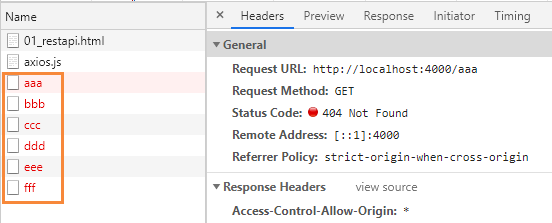

### 2.2 axios拦截器

> - 请求拦截器在请求发出后执行它所定义的回调，回调中传递的是config
>   - 并且，**先定义**的请求拦截器的回调**后执行**
> - 响应拦截器在刚得到响应后执行它所定义的回调,回调中传递的是response
>   - 并且，**先定义先执行**
> - 最后执行axios的回调

```
// 添加请求拦截器1
  axios.interceptors.request.use(
    (config) => {
      // 在请求发送之前做一些操作
      console.log("request interceptor1 onResolved");
      return config;
    },
    (error) => {
      // 请求出错之后做一些操作
      console.log("request interceptor1 error");
      return Promise.reject(error);
    }
  );

  // 添加请求拦截器2
  axios.interceptors.request.use(
    (config) => {
      // 在请求发送之前做一些操作
      console.log("request interceptor2 onResolved");
      return config;
    },
    (error) => {
      // 请求出错之后做一些操作
      console.log("request interceptor2 error");
      return Promise.reject(error);
    }
  );

  // 添加响应拦截器1
  axios.interceptors.response.use(
    (response) => {
      // 请求成功得到响应，即响应状态码为2xx即可调用此函数
      console.log("response interceptor1 onResolved");
      return response;
    },
    (error) => {
      // 响应失败，即可调用此函数
      console.log("response interceptor1 error");
      return Promise.reject(error);
    }
  );

  // 添加响应拦截器2
  axios.interceptors.response.use(
    (response) => {
      // 请求成功得到响应，即响应状态码为2xx即可调用此函数
      console.log("response interceptor2 onResolved");
      return response;
    },
    (error) => {
      // 得到失败的响应，即可调用此函数
      console.log("response interceptor2 error");
      return Promise.reject(error);
    }
  );

  // 注意：要使得拦截器起作用，就需要在发请求之前定义
  axios.get("http://localhost:3000/posts").then(
    (response) => {
      console.log(response);
    },
    (err) => {
      console.log(err);
    }
  );
```

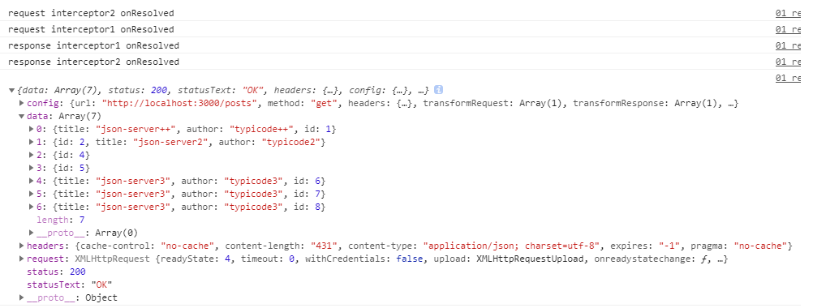

> - 注意：如果在第2个请求响应拦截器的onResolved回调中不return config,则在第1个请求拦截器的onResolved回调中接收到的就是undefined,从而由于config不满足要求，根本就不会发送请求

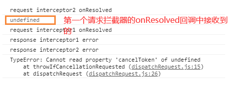

> - 同理，如果在第1个响应拦截器的onResolved回调中不return config,则在第2个响应拦截器的onResolved回调中接收到的就是undefined,从而导致最终传递给浏览器的响应就是undefined

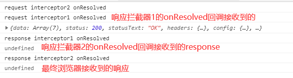

> - 可以看出多个拦截器之间也是以类似于then的链式法则处理的

### 2.3 取消请求cancelToken

发送请求，在浏览器还未得到响应数据之前取消请求

> - 一个请求想要被取消，则需要在请求发出时为其添加cancelToken配置，并且将取消该请求的函数保存起来
> - 一个请求可以被取消的时间要求：在发出请求，但是尚未接收到响应的时间段内
> - 所以如果一个请求已经成功或者失败，进入到成功或者失败的响应函数中，则该请求已经不能被取消，所以需要将该请求的取消函数回收cancel=null
> - 在取消请求成功后，意味着该请求失败，会调用请求失败的回调，并且返回一个Cancel实例对象保存错误信息，其中包含message属性，是取消请求时设置的提示信息

```
<button onclick="getProducts1()">获取商品列表1</button><br />
<button onclick="getProducts2()">获取商品列表2</button><br />
<button onclick="cancelReq()">取消请求</button><br />


var CancelToken = axios.CancelToken;
  let cancel; // 用于保存取消请求的函数，方便后续取消当前请求
  
  function getProducts1() {
    axios({
      url: "http://localhost:4000/products1",
      cancelToken: new CancelToken((c) => {
        // 这个函数在请求发出时就会执行，将取消此请求的函数交给cancel保存
        cancel = c;
      }),
    }).then(
      (response) => {
        // 无论请求成功还是失败，cancel都不可能再用了，所以回收
        cancel = null;
        console.log("请求1成功了", response);
      },
      (err) => {
        cancel = null;
        console.log("请求1失败了", err);
      }
    );
  }
  function getProducts2() {
    axios({
      url: "http://localhost:4000/products2",
      cancelToken: new CancelToken((c) => {
        cancel = c;
      }),
    }).then(
      (response) => {
        // 无论请求成功还是失败，cancel都不可能再用了，所以回收
        cancel = null;
        console.log("请求2成功了", response);
      },
      (err) => {
        cancel = null;
        console.log("请求2失败了", err);
      }
    );
  }
  function cancelReq() {
    // 取消请求
    if (typeof cancel === "function") {
      cancel("强制取消请求");
    }
  }
```

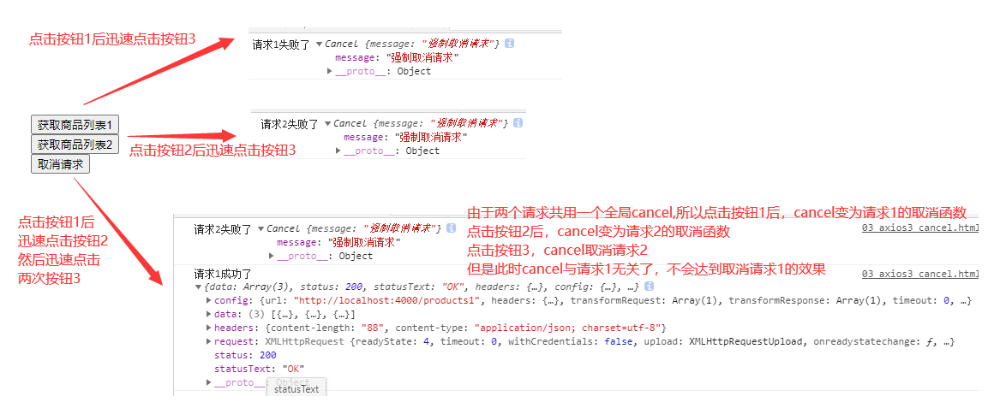

> - 2 实现功能：在发新的请求之前，先取消前面尚未完成的请求
>   - 之前提到，使用cancel取消的请求，执行失败回调onRejected时传入的不是一般的Error类型的错误，而是一个Cancel类型的错误，所以需要对于两者进行区分
>   - 考虑在发起一个新的请求前，通过判断cancel的类型，决定是否存在尚未完成的请求
>     - 如果cancel是一个函数，则表示该函数对应的请求尚未完成，则调用cancel取消请求
>     - 否则，表示并无未完成请求，因为只要请求完成(成功或失败)都会清除该请求对应的cancel，所以只要cancel不是函数，则就可以说明请求均已完成

```
var CancelToken = axios.CancelToken;
  let cancel; // 用于保存取消请求的函数，方便后续取消当前请求
  function getProducts1() {
    // 在准备发送新请求时，取消其他的请求
    if (typeof cancel === "function") {
      cancel("强制取消请求");
    }
    axios({
      url: "http://localhost:4000/products1",
      cancelToken: new CancelToken((c) => {
        cancel = c;
      }),
    }).then(
      (response) => {
        // 无论请求成功还是失败，cancel都不可能再用了，所以回收
        cancel = null;
        console.log("请求1成功了", response);
      },
      (err) => {
        // 这里要注意：区分Cancel取消产生的错误和请求失败产生的错误
        // Cancel取消产生的错误不需要清除cancel
        if (axios.isCancel(err)) {
          console.log("请求1取消的错误：", err.message);
        } else {
          // 请求出错了
          cancel = null;
          console.log("请求1出错的错误：", err.message);
        }
      }
    );
  }
  function getProducts2() {
    // 在准备发送新请求时，结束其他的请求
    if (typeof cancel === "function") {
      cancel("强制取消请求");
    }
    axios({
      url: "http://localhost:4000/products2",
      cancelToken: new CancelToken((c) => {
        cancel = c;
      }),
    }).then(
      (response) => {
        // 无论请求成功还是失败，cancel都不可能再用了，所以回收
        cancel = null;
        console.log("请求2成功了", response);
      },
      (err) => {
        // 这里要注意：区分Cancel取消产生的错误和请求失败产生的错误
        if (axios.isCancel(err)) {
          console.log("请求2取消的错误：", err.message);
        } else {
          // 请求出错了
          cancel = null;
          console.log("请求2出错的错误：", err.message);
        }
      }
    );
  }
  function cancelReq() {
    // 取消请求
    if (typeof cancel === "function") {
      cancel("强制取消请求");
    }
  }
```

> - 发送请求1，cancel赋值cancel1，返回一个pending状态的p1,then保存回调
> - 发送请求2之前，将请求1取消，p1变成rejected状态，onRejected回调进入微队列
> - 发送请求2，cancel赋值cancel2，返回一个pending状态的p1,then保存回调
> - 执行微任务，此时如果直接将cancel赋值为null,则是将请求2的取消函数给去掉了，所以不能这样做
>   - 需要判断此时产生的错误类型：
>     - 如果此时产生的错误是Cancel类型，则说明此时请求p1是被其他请求强制取消的，则此时的cancel已经不是cancel1,不需要清除
>     - 如果是Error类型，则清除，说明此时该请求并非是被人为取消，而是因为其他原因自动失败了，则cancel1就无用了，将其清除即可

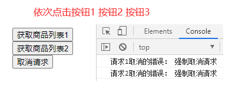

> 3 使用拦截器解决冗余问题

但是此时可以发现代码存在冗余，每一次请求之前均需要存在取消前一个请求的代码段，并且得到响应后还需要对于响应或者错误做出相似的处理，比较冗余，考虑使用**拦截器**处理

```
var CancelToken = axios.CancelToken;
  let cancel; // 用于保存取消请求的函数，方便后续取消当前请求
  // 添加请求拦截器
  axios.interceptors.request.use((config) => {
    // 在准备发送新请求时，取消其他的请求
    if (typeof cancel === "function") {
      cancel("强制取消请求");
    }
    // 给config添加配置
    config.cancelToken = new CancelToken((c) => {
      cancel = c;
    });
    return config;
  });

  // 添加响应拦截器
  axios.interceptors.response.use(
    (response) => {
      // 请求成功，则清除取消函数
      cancel = null;
      return response;
    },
    (error) => {
      // 请求失败，两种原因：Cancel取消产生的错误和请求失败产生的错误
      // Cancel取消产生的错误不需要清除cancel
      if (axios.isCancel(error)) {
        console.log("请求取消的错误：", error.message);
        // 中断promise链接
        return new Promise(() => {});
      } else {
        // 请求出错了
        cancel = null;
        return Promise.reject(error);
      }
    }
  );

  function getProducts1() {
    axios({
      url: "http://localhost:4000/products1",
    }).then(
      (response) => {
        console.log("请求1成功了", response);
      },
      (err) => {
        console.log("请求1出错的错误：", err.message);
      }
    );
  }
  function getProducts2() {
    axios({
      url: "http://localhost:4000/products2",
    }).then(
      (response) => {
        console.log("请求2成功了", response);
      },
      (err) => {
        console.log("请求2出错的错误：", err.message);
      }
    );
  }
  function cancelReq() {
    // 取消请求
    if (typeof cancel === "function") {
      cancel("强制取消请求");
    }
  }
```

## 3 axios源码分析

### 3.1 axios和Axios的关系

> - 首先：axios不是Axios的实例
> - 但是从功能上说，axios具备了Axios原型上的所有方法，以及Axios对象上的所有属性，所以说它具备与Axios相同的功能
> - axios是Axios的一个实例

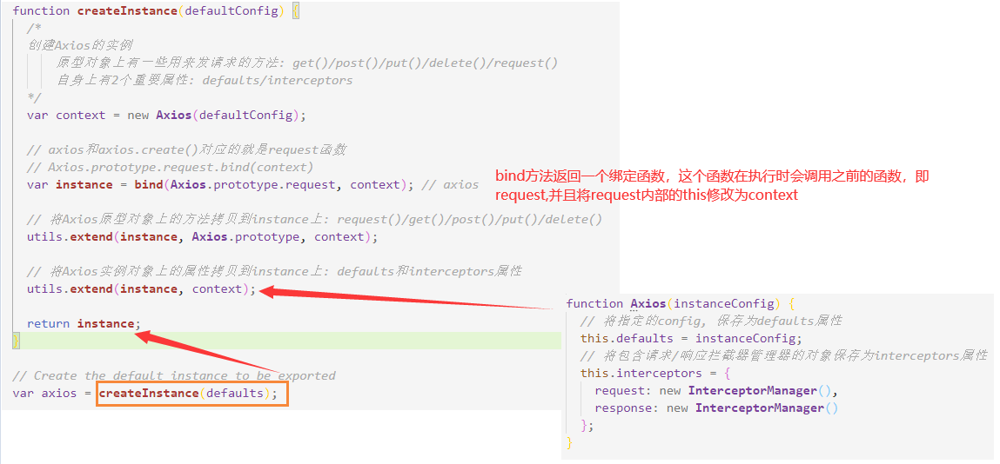

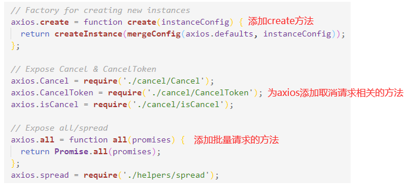

### 3.2 instance和axios的区别

> - 相同点：
>   - 两者都能发送任意请求，对应着request(config)
>   - 都具备发送特定请求的方法:get(),post(),put(),delete()
>   - 都具备默认配置和拦截器的属性defaults/interceptors
> - 不同点：
>   - 默认匹配的值可能不一样,instance在创建时，在axios的默认配置的基础上，还可以自己添加新的配置
>     - 即，如果我们使用instance=axios.create({})传入的新的配置是一个空对象，则两者的配置相同，但是如果传入的是axios中不具备的配置，则会导致两者配置不同
>   - instance没有axios后面添加的一些方法，例如Cancel,CancelToken,isCancel()等取消请求的方法以及批量all、create等是axios自己的

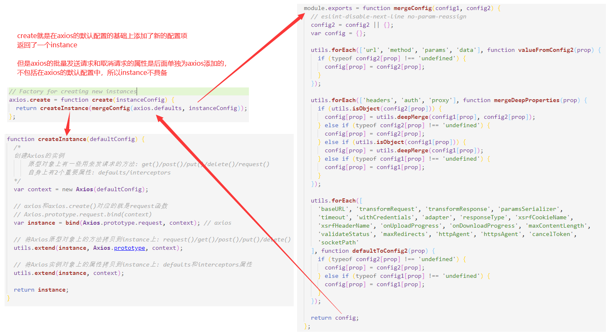

### 3.3 axios运行的整体流程

> - 1 axios(config)、axios.create(config)、axios.get等均是调用Axios原型的request方法
> - 执行request的同步代码，获取promise链
> - 执行promise回调：
>   - 执行请求拦截器的相关回调
>   - 然后分发请求：xhr请求和一般的http请求，发出请求   dispatchRequest(config)  xhrAdapter(config)
>     - dispatchRequest(config):转换请求数据=>调用xhrAdapter()发请求=>请求返回后转换响应数据=>返回promise
>     - xhrAdapter():创建xhr对象，根据config进行相关配置，发送特定请求，并且接收响应数据，返回promise
>   - 执行响应拦截器
>   - 执行onResolved回调

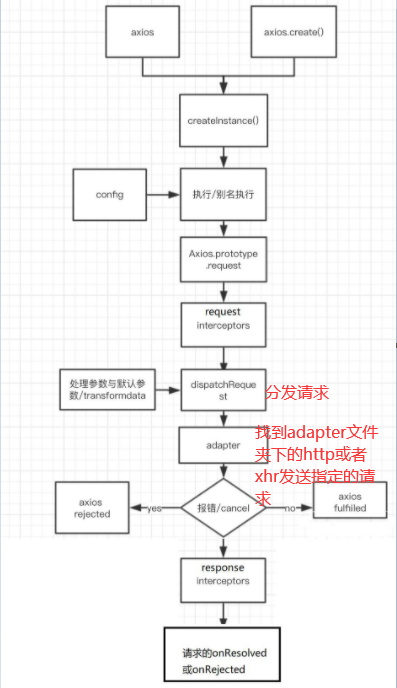

#### 3.3.1 promise串连如何实现的 

> - 1. 请求拦截器: 在真正发请求前, 可以对请求进行检查或配置进行特定处理的函数, 
>                     包括成功/失败的函数, 传递的必须是config
> - 2. 响应拦截器: 在请求返回后, 可以对响应数据进行特定处理的函数,
>         包括成功/失败的函数, 传递的默认是response
>   3. 通过promise串连

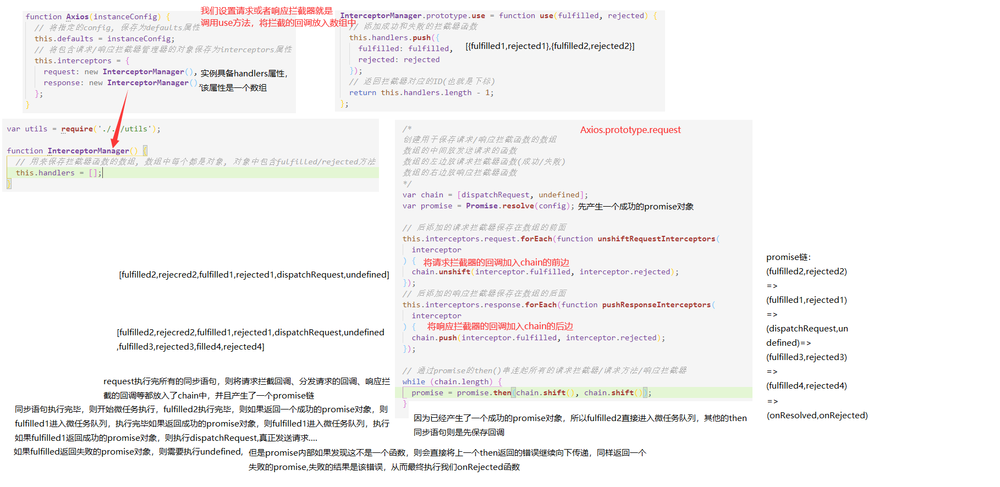

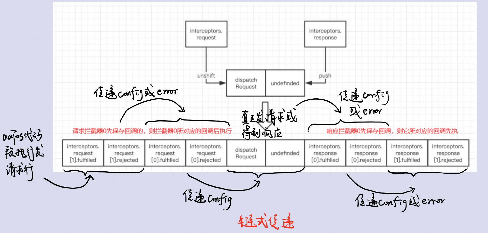

#### 3.3.2 axios的请求/响应数据转换器：dispatchRequest(config)

> - 1 请求转换器: 对请求头和请求体数据进行特定处理的函数
>
>   - 如果当前请求体是对象类型，则将其转换为json类型，并且json类型的数据需要添加特定请求头
>
>        setContentTypeIfUnset(headers, 'application/json;charset=utf-8');  添加请求头
>         return JSON.stringify(data)   转换为json类型
>
> - 2 响应转换器: 将响应体json字符串解析为js对象或数组的函数
>       response.data = JSON.parse(response.data)

#### 3.3.3 发送请求xhrAdapter(config)

#### 3.3.4 response和error的整体结构
```
response:
{
    data,
    status,
    statusText,
    headers,
    config,
    request
}

error:
{
    message,
    request,
    response
}
```

#### 3.3.5 如何取消未完成的请求

> - 1 当配置了cancelToken对象时, 保存cancel函数
>   - 创建一个用于将来中断请求的cancelPromise
>   - 并定义了一个用于取消请求的cancel函数
>   - 将cancel函数传递出来
> - 2.调用cancel()取消请求
>   - 执行cacel函数, 传入错误信息message
>   - 内部会让cancelPromise变为成功, 且成功的值为一个Cancel对象
>   - 在cancelPromise的成功回调中中断请求, 并让发请求的proimse失败, 失败的reason为Cacel对象

## 4 axios二次封装

> - 之所以称为二次封装，是因为axios本身就封装了浏览器的XMLHttpRequest对象，所以对axios再次封装，就称为二次封装
> - 二次封装是在axios包的基础上添加一些基础的配置，添加拦截器操作等，使得axios的使用变得简单，不需要再为每一个axios请求添加相同的配置以及拦截器，代码复用率变高

```
// 二次封装axios
import axios from "axios";

// 根据环境变量区分接口，设置请求基地址
switch (process.env.NODE_ENV) {
  // 生产环境，基地址是生产时服务器的地址
  case "production":
    axios.defaults.baseURL = "http://api.baidu.com";
    break;
  // 测试环境，基地址就是测试服务器的地址
  case "beat":
    axios.defaults.baseURL = "http://192.168.20.12:8080";
    break;
  // 开发环境，匹配开发环境的服务器的地址
  default:
    axios.defaults.baseURL = "http://localhost:4000";
}

// 设置超时时间和快鱼是否允许携带凭证：允许携带cookie信息
axios.defaults.timeout = 10000; // 10s
axios.defaults.withCredentials = true;

// 具体还是要看服务器要求的格式，json格式最常用
// 将请求体的格式修改为json格式，并且添加请求头
axios.defaults.transformRequest = (data) => JSON.stringify(data);
axios.defaults.headers["Content-Type"] = "application/x-www-form-urlencoded";

// token校验：接收服务器返回的token,存储在redux或者本地存储中，每一次向服务器发送请求，则需要携带token
// 添加请求拦截器
axios.interceptors.request.use(
  (config) => {
    // 在配置项中添加token
    let token = localStorage.getItem("token");
    token && (config.headers.Authorization = token);
    return config;
  },
  (error) => {
    return Promise.reject(error);
  }
);

// 添加响应拦截器
axios.defaults.validateStatus = (status) => {
  // 自定义响应成功的HTTP状态码   2xx 或者 3xx 则表示成功  3xx一般走缓存
  return /^(2|3)\d{2}$/.test(status);
};
axios.interceptors.response.use(
  (response) => {
    // 在响应拦截器中直接返回主体内容
    return response.data;
  },
  (error) => {
    console.log(error);
    let { response } = error;
    if (response) {
      // 服务器最起码返回结果了
      switch (response.status) {
        case 401: // 当前请求用户需要验证，一般是未登录
          break;
        case 403: // 服务器已经理解请求，但是拒绝执行，token过期
          localStorage.removeItem("token");
          // 跳转到登录页
          break;
        case 404: // 请求失败，请求所希望得到的资源未在服务器上发现，找不到界面
          break;
        default:
          break;
      }
    } else {
      // 服务器没有返回结果
      if (!window.navigator.onLine) {
        console.log("断网啦");
        // 如果是断网，则进行响应处理，一般就是刷新界面
        return;
      }
      //   如果不是断网的原因，而是服务器的原因，则返回错误原因
      return Promise.reject(error);
    }
  }
);

export default axios;
```

> - 使用express开启一个4000端口的服务器，然后在3000端口的服务器上，访问4000端口的服务器的数据
> - 注意：此时由于属于跨域请求，所以需要在服务器响应端添加响应头：`res.setHeader("Access-Control-Allow-Origin", "*");`,表示允许跨域访问
> - 但是又由于ajax请求时开启了允许携带cookie参数的请求头：`axios.defaults.withCredentials = true;`,所以不能将`Access-Control-Allow-Origin`设置为`*`,需要将其修改为除了`*`之外的值，这里将其修改为请求地址`http://localhost:3000`
> - **如果前端配置了这个withCredentials=true，后段设置Access-Control-Allow-Origin不能为 " \* ",必须是你的源地址**，主要是考虑安全性，客户端将cookie信息交给服务器端，如果其他客户端也可以访问服务器获取到该客户端的cookie信息，就会造成cookie信息的泄漏

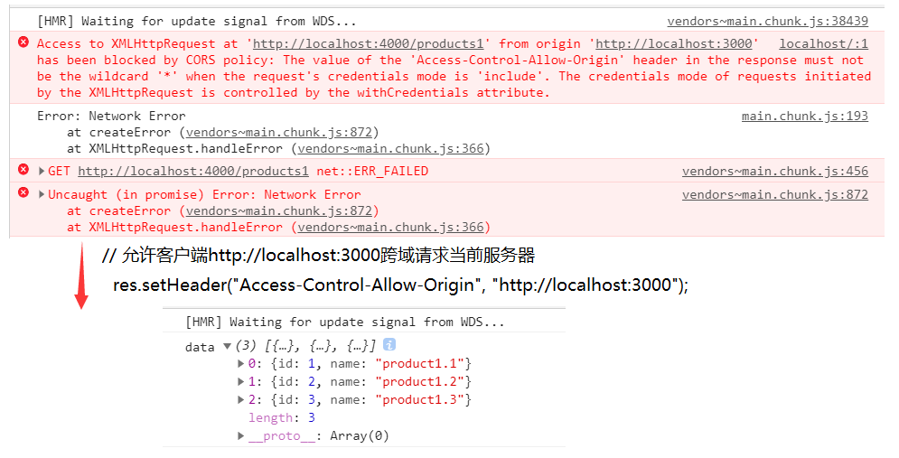

