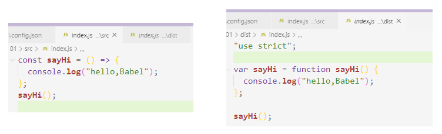
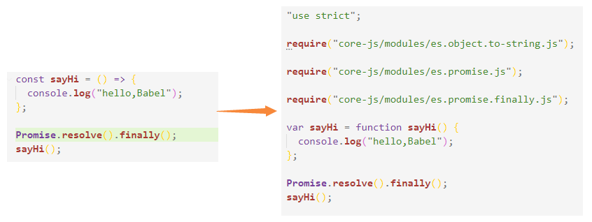
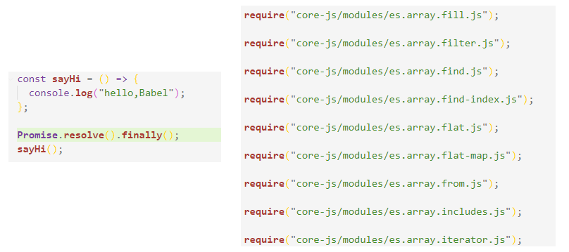

Babel使用

## 1 基本使用

首先这个是基于Babel`v7.8.0` 及以上版本

1. 安装包

   ```
   npm install --save-dev @babel/core @babel/cli @babel/preset-env
   注意：这里选的都是--save-dev -dev表示开发环境的配置，不会被打包
   ```

2. 从终端导入插件选项的方式：

   1. 直接：`npx babel src -d dist --presets=@babel/preset-env`,表示将src目录的文件使用@babel/preset-env插件编译输出到dist目录中

   2. 注意：有时@babel/preset-env在使用的时候会简写为@babel/env

   3. 如果觉得每次执行的命令太长了，可以将其放入package.json的scripts中：具体取什么名称，自己定义，然后直接使用`npm run build:env`命令即可运行编译

      ```
      "scripts":{
      	"build:env": "babel src -d dist --presets=@babel/preset-env"
      }
      ```

      

3. 在配置文件定义插件的方式:

   1. `babel.config.json`

      ```
      {
        "presets": [
          [
            "@babel/env",
            {
              "targets": {
                "edge": "17",
                "firefox": "60",
                "chrome": "67",
                "safari": "11.1",
                "ie": "9"
              },
              "useBuiltIns": "usage",
              "corejs": "3.6.5"
            }
          ]
        ]
      }
      ```

   2. 转换:`npx babel src -d dist`，同样它也可以配置到package.json中

   

##  2 polyfill

自 Babel 7.4.0 起，此 package 已被弃用，你可以直接引入 `core-js/stable`（用于 polyfill ECMAScript 新特性）以及 `regenerator-runtime/runtime` (被用于转译 generator 函数)：

1. 安装polyfill,`npm install --save @babel/polyfill`,**使用 `--save` 选项，而不是 `--save-dev`，这是因为 polyfill 需要在运行时中在源代码之前执行**。

2. 写配置文件

   ```
   {
     "presets": [
       [
         "@babel/preset-env",
         {
           "targets": {
             "edge": "17",
             "firefox": "60",
             "chrome": "67",
             "safari": "11.1"
           },
           "useBuiltIns": "usage"
         }
       ]
     ]
   }
   ```

3. 在index.js中加入`Promise.resolve().finally();`

4. 编译：`npx babel src -d dist`

5. 不同于在webpack中使用，不需要在入口文件中引入polyfill

   

6. 如果useBuiltIns指定为entry,则需要在入口文件中引入`core-js`或者`regenerator runtime`模块，因为由于 [@babel/polyfill](https://babel.docschina.org/docs/en/babel-polyfill) 已被 [废弃](https://babel.docschina.org/docs/en/usage/#polyfill-deprecated)。并且这样的话得到的结果会比较大,因为它导入了很多没有用到的东西

   

## 3 @babel/core

上面在转换时都用到了@babel/core，虽然没有显式的写出，但是内部都用到了，它实际上是调用了@babel/core模块的transform方法进行的转换：下面的代码可以直接在node环境下使用

新建文件`build.js`:

```
const babel = require("@babel/core");

let code = `
    const sayHi = () => {
        console.log("hello,Babel");
    };
    sayHi();
`;

const result = babel.transform(code, {});
console.log(result);

```

指定`node build.js`,得到结果：

```
{
  metadata: {},
  options: {
    assumptions: {},
    targets: {},   // 指定浏览器的兼容性
    cloneInputAst: true,
    babelrc: false,   // 有没有使用.babelrc文件
    configFile: false,
    browserslistConfigFile: false,   // package.json有无broswerlist配置
    passPerPreset: false,
    envName: 'development',  // 配置环境
    cwd: 'E:\\workspaces\\code\\MyCode\\babel\\01',
    root: 'E:\\workspaces\\code\\MyCode\\babel\\01',
    rootMode: 'root',
    plugins: [
      [Plugin], [Plugin], [Plugin], [Plugin],
      [Plugin], [Plugin], [Plugin], [Plugin],
      [Plugin], [Plugin], [Plugin], [Plugin],
      [Plugin], [Plugin], [Plugin], [Plugin],
      [Plugin], [Plugin], [Plugin], [Plugin],
      [Plugin], [Plugin], [Plugin], [Plugin],
      [Plugin], [Plugin], [Plugin], [Plugin],
      [Plugin], [Plugin], [Plugin], [Plugin],
      [Plugin], [Plugin], [Plugin], [Plugin],
      [Plugin], [Plugin], [Plugin], [Plugin],
      [Plugin], [Plugin]
    ],
    presets: [],
    parserOpts: {
      sourceType: 'module',
      sourceFileName: undefined,
      plugins: [Array]
    },
    generatorOpts: {
      filename: undefined,
      auxiliaryCommentBefore: undefined,
      auxiliaryCommentAfter: undefined,
      retainLines: undefined,
      comments: true,
      shouldPrintComment: undefined,
      compact: 'auto',
      minified: undefined,
      sourceMaps: false,
      sourceRoot: undefined,
      sourceFileName: 'unknown',
      jsescOption: [Object]
    }
  },
  ast: null,        // ast抽象语法树
  code: '"use strict";\n' +       // 转换后的代码
    '\n' +
    'var sayHi = function sayHi() {\n' +
    '  console.log("hello,Babel");\n' +
    '};\n' +
    '\n' +
    'sayHi();',
  map: null,
  sourceType: 'script'
}
```

我们需要的就是code部分，拿到该code后，将其输出到一个文件中，产生buddle即可

