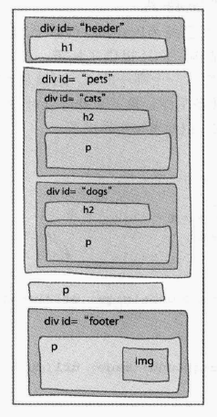

## 高级web建设——div
    - div是一个块元素，div为块级内容划分逻辑区:一个逻辑区放置相关的一些元素
    - 在一个逻辑区的周围放置
开始和结束标记
    - 为了区分各个div区域，可以为每个div区域增加id属性，唯一表示
区域
    - div也可以嵌套

    - 注意：使用div只是为了更好地区分页面的结构，方便于 页面样式的指定，不能为了增加架构而使用div,这样会导致页面结构的复杂化

    - width:指定元素内容区的宽度
    - 整个div块的宽度=左外边距+边框线宽度+左内边距+width+右内边距+边框线宽度+右外边距
    - 一般，不用指定元素的高度，因为一旦指定了宽度，高度也会随着内容发生变化

    - text-align:元素内容的居中情况：left,center,right
    - 这是块元素才有的规则，内联元素没有
    - 在块元素中使用后，该块元素中的所有内容（文字和图片等均会居中）

### 子孙选择器

    - 一个div块元素内的所有直接元素均称为是该块元素的孩子，孩子的孩子称为该块元素的孙子,...
        

            <h2>
                <p2>  为了区分，这里将段落写为p1,p2
            <p1>
                <em>
                <a>
            <blockquote>
            
            ...
        

        - 在这个例子中:<h2>,<p1>,<blockquote>,均是
的孩子，<p2>,<em>和<a>是div的孙子
        - 当想为所有段落子孙(包括<p1><p2>)指定规则时：
            #whh p{
                ...
            }
        - 当想为直接孩子<p1>指定规则时：
            #whh>p{
                ...
            }
        - 当想为孙子元素p2指定规则时：
            #whh h2 p{
                ...
            }

    - 行高：line-height:
        - 1em:当前body元素字体的1倍
        - 1：各个元素字体行高的1倍，这样标题行高和正文行高就不同了
