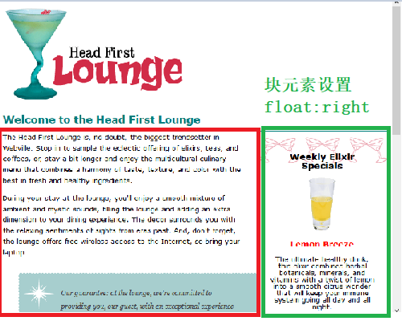
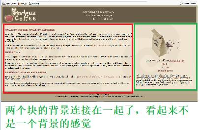
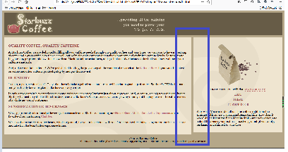
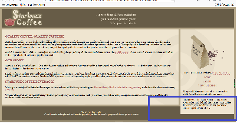
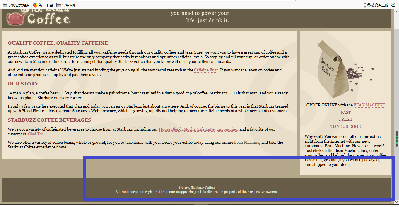
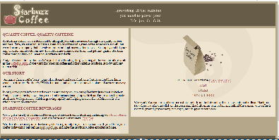

## Flow流
    - 浏览器在页面上摆放元素的方法
    - 首先为边栏的div块（绿色部分）元素设定width（内容区宽度）
    - 然后为该块元素设置下面的属性时：float:right，则该块元素后面的内容会填充在该块元素的左边，效果如下：

### 1 背景混合的问题
    - 同样类型的问题，得到了下面的结果：

    - 为了解决这个问题，就需要增大红色区域的右边外边距，保证两个块的背景不发生连接

    - margin:0px 450px 10px 10px;

### 2 产生浮动页面的问题——clear属性：
    - 还有一个问题，当块区域的宽度设置不当时，会导致块区域的内容延伸到页脚部分（产生浮动页面），如下：

    - 为了修正，就引入了clear属性
        - clear:right;指出某个区域的右边不允许有浮动内容
        - clear:left;指出某个区域的左边不允许有浮动内容
    - 所以我们就可以在页脚的规则中加入clear:right;，这样页脚就会 自动根据页面内容的长度下移，避免产生浮动内容

## 固定边栏区的缺点
    - 但是这种固定边栏区的方法由于需要将边栏区的内容在html中放在head之下，所以当在小的显示屏幕上看时，会发现首先看到的是边栏区，主内容区在下面，这很不利于信息的快速获取
    - 所以可以将主内容区固定在左边，将边栏区进行流动处理
        #main{
            width:550px;
            float:left;
        }
        #sidebar{
            margin:0px,10px,10px,560px;
        }
        #footer{
            clear:left;
        }

    - 但是这种看起来不是很美观

    - 注意：在具有流的页面中，计算块元素的整体宽度(左外边距+左边框宽度+左内边距+内容区宽度+右内边距+右边框宽度+右外边距)一定要格外注意：
    - 需要留出两个块元素之间的间距，例如第二种方法中：
        左边块固定宽度600px,内边距10px,margin:10px;
        则右边的左外边距就需要大于10+10+600+10+10=640px,另外为了留出间距，则左外边距就需要至少设置为650px

## 流体布局方法的缺点：
    - 需要将侧边栏移到主页面之上
    - 并且不能得到两个相同高度的列

### 能不能有一种方法可以同时具备第一种方法的紧凑型显示和第二种方法的信息快速获取性——流体与冻结设计
