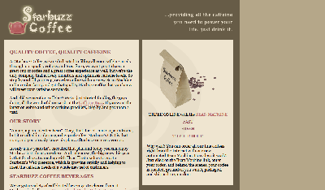

## 冻结布局
    - 将元素固定在页面，不会由于屏幕大小的改变而发生变化
    - 方法：
        - 在body元素的下面加一个div元素，包围所有页面内的元素
            <body>
                

                    ...
                

            </body>
        - 为该div元素设定规则：
            #allcontent{
                width:1000px;
                padding:10px;
                background-color:#675c47;
            }

