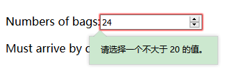

### 单选钮radio
    - 设定多个单选钮时，一次只能选中一个单选钮,当选中某一个按钮时，其余的按钮会自动弹起
        <input type="radio" name="hotorcold" value="hot" checked>  hot   
        <input type="radio" name="hotorcold" value="cold">  cold
        - 为任何一个钮添加checked(布尔属性，不需要值)，则当链接打开时，该按钮默认是选中的状态
        - 对于单选按钮，value属性值的内容不会出现在 用户界面。value 属性值只在提交表单时向服务端传递数据。如果一个 单选按钮处于选中状态，在提交表单时，单选按钮的值才会传递到服务端（未选中按钮是不会传递数据到服务端的）。所以单选按钮的value需要与选择项的内容保持一致
        - 单选按钮的name要保持一致，因为在传送表单时只会对应其中一个值，这写按钮选项都是name的一个可能值
<input type="radio" name="hotornot" value="hot" checked>  hot  
<input type="radio" name="hotornot" value="cold">  cold

### 复选框checkbox
    - 可以选中两个或者两个以上的按钮
        <input type="checkbox" name="food_like[]" value="banana" checked>  banana
        <input type="checkbox" name="food_like[]" value="orange">  orange
        <input type="checkbox" name="food_like[]" value="apple">  apple 
        - 对于复选框，为了表示一个表单元素可以选择多个值，所以一般在name后会加入一个[]
<input type="checkbox" name="food_like[]" value="banana" checked>  banana 
<input type="checkbox" name="food_like[]" value="orange">  orange   
<input type="checkbox" name="food_like[]" value="apple">  apple

### 多行文本区textarea
       - 创建一个可以输入多行文本的区域，当文本内容在规定的区域放不下时，在其右方还会出现一个滚动条
       <textarea name="comments" rows="10" cols="48>haha</textarea>
           - haha作为文本框中的初始文本
           - name属性制定一个唯一的名字
           - rows和cols指定文本框的大小
<textarea name="comments" rows="10" cols="48>haha</textarea>
                                          

### 下拉式单选菜单select，结合option元素
    - 提供了一组从一组选项中做出选择的方法
        characters:
        <select name="characters">
            <option value="happy">happy zhang</option>
            <option value="angry">angry li</option>
            <option value="hurry">hurry wang</option>
            <option value="excited">excited kang</option>
            <option value="wonderful">wonderful wu</option>
        </select>
characters:
<select name="characters">
     <option value="happy">happy zhang</option>
     <option value="angry">angry li</option>
     <option value="hurry">hurry wang</option>
     <option value="excited">excited kang</option>
     <option value="wonderful">wonderful wu</option>
</select>

### 多选菜单：在单选菜单的基础上添加multiple属性
    characters:
    <select name="characters" multiple>
         <option value="happy">happy zhang</option>
         <option value="angry">angry li</option>
         <option value="hurry">hurry wang</option>
         <option value="excited">excited kang</option>
         <option value="wonderful">wonderful wu</option>
    </select>
    - 显示时所有的选项会以展开的形式显示，按住ctrl键可以选择多个选项
characters:
<select name="characters" multiple>
     <option value="happy">happy zhang</option>
     <option value="angry">angry li</option>
     <option value="hurry">hurry wang</option>
     <option value="excited">excited kang</option>
     <option value="wonderful">wonderful wu</option>
</select>

# 数字输入
    number: <input type="number" min="0" max="9" step="2">
        - 使用min和max控制输入数字的范围，右边出现的两个箭头分别用来增加和减小数字
        - step默认是1
number: <input type="number" min="0" max="20" step="2"> 
    - 当输入的数超出范围时：

### 滑动条range
    range:<input type="range" min="0" max="20" step="5>
range: <input type="range" min="0" max="20" step="5">

### 颜色输入
    color: <input type="color">
        - 单击这个控件时会弹出一个颜色选择框
color: <input type="color">

### 日期输入
    Date: <input type="date">
    - 单击这个控件时会弹出一个日期选择框
Date: <input type="date">

### email输入
    Email: <input type="email">
    - 单击这个控件时会弹出一个方便输入email的定制键盘
Email: <input type="email">

# tel输入
    Tel: <input type="tel">
    - 单击这个控件时会弹出一个方便输入电话号码的定制键盘
tel: <input type="tel">

# url输入
    URL: <input type="url">
    - 单击这个控件时会弹出一个方便输入url的定制键盘
url: <input type="url">

## password输入
    password: <input type="password">
    - 单击这个控件时会弹出一个方便输入url的定制键盘
password: <input type="password">

### 文件输入
     <input type="file" name="doc">
    - 单击这个控件时会弹出一个方便输入url的定制键盘
<input type="file" name="doc">
