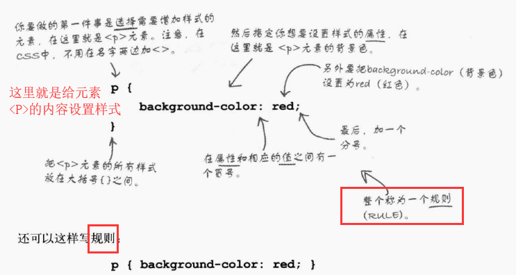
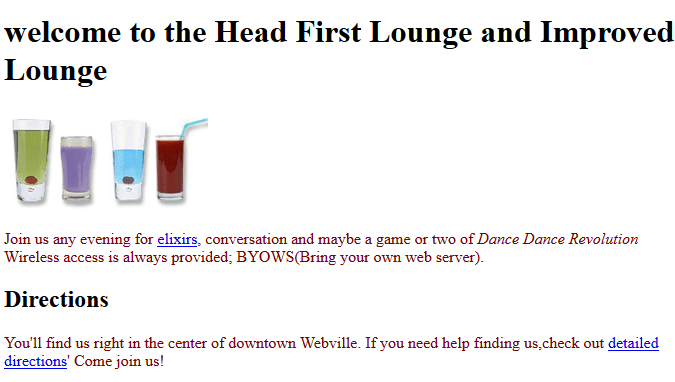
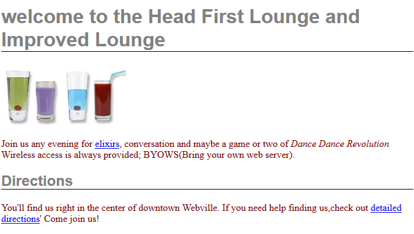
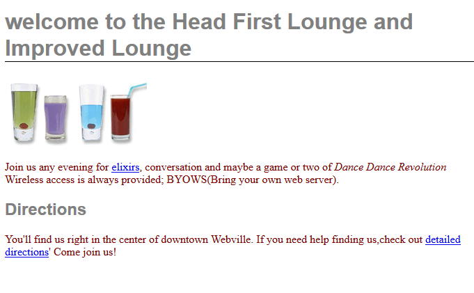
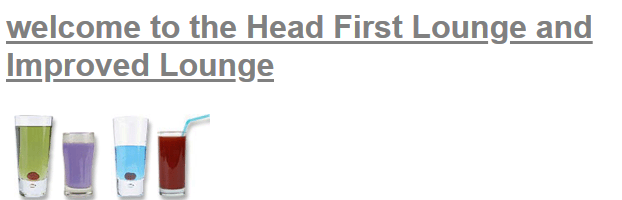
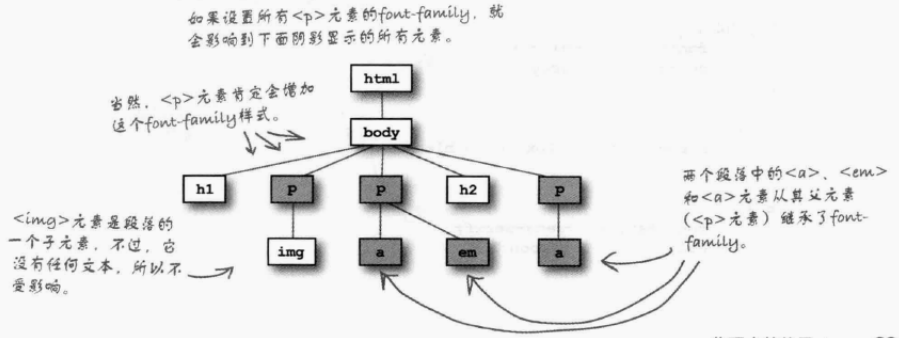
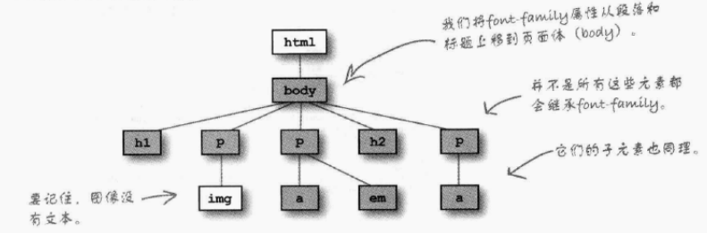
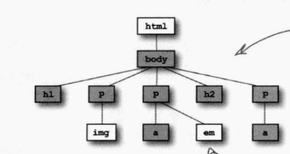
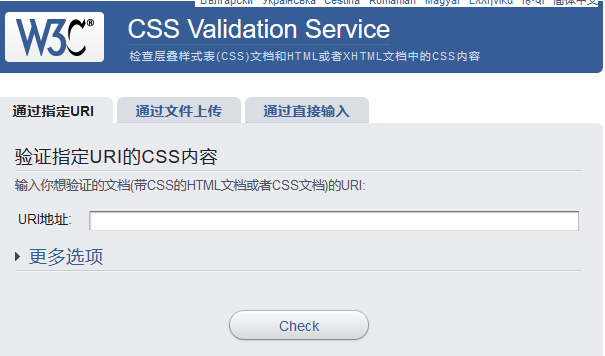

## CSS修饰的方法
    - html创建web页面的架构，css修饰web界面

    - 可以给不同的段落设置不同的样式
        例如：
        P{
            background-color:red;
            border:1px solid gray;边框为1像素，灰色，实线
        }
    - 由于不同的元素具备很多不同的属性，后面的学习中我们会熟悉一些常用的属性，详细的属性可以查阅CSS Pocket Reference这本书

## 将CSS放入html：
### 方法一：使用style标记
    - 需要在<head>中加入<style>标记：放在这里会作用于html中的所有内容
        <head>
            <title>...</title>
            <meta charset="...">
            <style>
            ....
            </style>
        </head>
    - style中就是CSS规则
    


```python
# 修改段落的字体颜色
<style>
    p{
        color:maroon;<!--将段落内部的文字修改为茶红色-->
    }
</style> 
例如我们为E:\java前端\学习代码与笔记\html\chap2_代码\lounge.html中
加入了上面的CSS规则，就修改了该文档中所有段落内部除了超链接之外的全部文字颜色
```


- 最上面一句不在p内部
- 注意超链接文字的颜色没有改变


```python
#修改标题的字体和颜色，在下面加边界线
h1,h2{
	font-family:sans-serif;
	color:gray;
    border-bottom:1px solid black;
}
```




```python
# 如果只想在h1标题下添加下划线，则可以这样：
h1,h2{
	font-family:sans-serif;
	color:gray;
}
h1{
    border-bottom:1px solid black;
}
```




```python
# 或者添加下划线还可以使用text-decoration:underline;
h1,h2{
	font-family:sans-serif;
	color:gray;
}
h1{
    text-decoration:underline;
}
```

- 但是这种做法只会给文本加下划线，不会延伸到页面边缘


### 方法二：建立.css文件，将其直接连接到.html文件中
    - 以E:\java前端\学习代码与笔记\html\chap2_代码\lounge.html为例：
    - 先建立lounge.css文件：
        h1,h2{
            font-family:sans-serif;
            color:gray;
        }
        h1{
            text-decoration:underline;
        }
    - 在html文件的<head>标记中，使用<link>元素连入外部信息
        <link type="text/css" rel="stylesheet" href="lounge.css">
        建立lounge1.html文件
        - type="text/css"表明这是一个css样式表
        - rel属性指定了html文件与所连接的文件的关系，stylesheet表明所连接的文件是一个样式表
        - <link>是一个void元素，没有结束标记
使用这种方法的优点：当需要改变web界面的样式时，直接改变css文件的内容即可，相比于第一种需要改变html文件的多个部分而言，这样的方式更加简单方便

#### 元素的继承
    - <p>元素所设置的样式会直接影响<p>元素内部的元素的样式


#### 向上移动字体设置的位置
    - 为body增加css规则，这样，所有的p相关的文字都会变为font-family
        p{
            color:maroon;<!--将段落内部的文字修改为茶红色-->
        }
        h1,h2{
            color:gray;
        }
        h1{
            border-bottom:1px solid black;
        }
        body{
            font-family:sans-serif;
        }


#### 当我们不希望em内部的文字也使用该指定字体时，可以再次为em增加一个css规则，覆盖之前继承的规则
        em{
            font-family:serif;
        }

    - 一般css所显示的规则是最小单位所规定的形式，例如p规定了字体颜色，而em中也规定了，则会优先选择em的规则
    - 一般与文本相关的属性都是可以继承的，例如字体的大小，斜体等
    - 一般只要是可以被继承的属性都是可以被覆盖的
    - css中注释代码的方式是/*内容*/

### 为单独的段落指定样式——添加类
    - 将元素加入一个类，需要为该元素增加class属性，并且为其赋值（提供类名）,例如元素p
           <h2>Green Tea Cooler</h2>
           <p class="greentea">
               
               ...
           </p>
    - 创建一个类选择器，并且为这个类中的元素设定样式
            p.greentea{
                color:green
            }
        - 同理
            <blockquote class="greentea">...</blockquote>
            blockquote.greentea{..}

#### 把h1、h2、p、blockquote均加入greentea类中：
        - 首先需要在html文件中，在这几个元素中加入类属性，并且均命名为"greentea"
           <h1 class="greentea">Our Elixirs</h1>
           <h2 class="greentea">Green Tea Cooler</h2>
           <p class="greentea">
               
               ...
           </p>
       - 然后在css文件中加入下面的内容：
            .green{
                color:green;
            }

#### 一个元素可以加入多个类：
    <p class="greentea bluetea">...</p>
- 对于该类内部的元素到底遵从于哪一个css规则，取决于哪一个css规则位于css文件的最后

### 验证css文件的正确性
    - http://jigsaw.w3.org/css-validator/


### 常用的属性：
    - color:文本颜色
    - background-color:背景颜色
    - font-weight:字体粗细
    - line-height:文本元素行间距
    - font-size:让文本更大或者更小
    - text-align:文本左对齐或居中或右对齐
    - letter-spacing:文本之间设置间距
    - font-style:设置斜体文本
    - list-style:改变列表中列表项的外观
    - background-image:在元素后面放置一个图像
    - left:指定元素左边所在位置
    - top:控制元素顶部的位置
    - border:在元素周围加边框
    - padding:内边距
    - 
