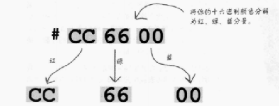

## Web颜色
    - web颜色是红绿蓝三种颜色分量组合而成的,0~255
        - 例如三种均是100%得到的是白色，三种均占60%(255*60%=153)得到的是灰色，红80%绿40%得到橙色，三种均是0得到的是黑色
    - web指定颜色有很多种方法，但是宗旨都是为了告诉浏览器红绿蓝三种分量所占的比例

### 方法一：按名指定颜色
    - 这包含了16种基本颜色和150种扩展颜色
    - 这些颜色名只是预定义了红绿蓝三种颜色分量
    - Aqua,Black,Blue,Fuchsia,Gray,Green,Lime,Maroon,Navy,Olive,Purple,Red,Sliver,Teal,Whilte,Yellow
        body{
            background-color:sliver;
        }

### 方法二：用红绿蓝值指定颜色
    - 使用红绿蓝分量的百分数指定颜色
        body{
            background-color:rgb(80%,40%,0%);
        }
    - 使用红绿蓝指定为0~255之间的一个数值
        body{
            background-color:rgb(204,102,0);
        }

### 方法三：使用十六进制码指定颜色
    - 例如#cc6600:每两位数字代表颜色的红绿蓝分量，cc表示红色，66表示绿色，00表示蓝色

    - 每两位数表示一个0~255之间的数
    - 1,2,3,4,5,6,7,8,9,a(10),b(11),c(12),d(13),e(14),f(15)
        body{
            background-color:#cc6600;
            或者：（当每个分量的数字相同时，可以简写）
            background-color:#c60;
        }
