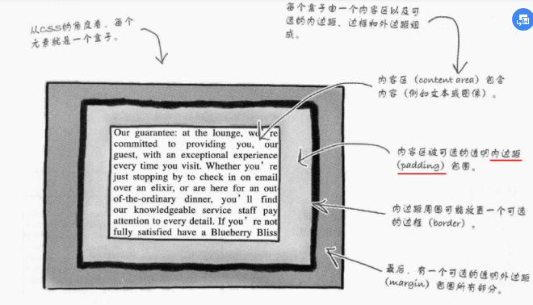
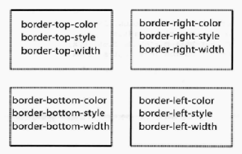
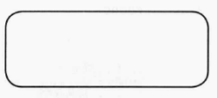
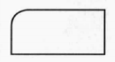

## 一、盒模型
    - 盒模型就是Css看待元素的一种方式
    - CSS将每个元素看作由一个盒子表示,包括p,hi,h2,..,blockquote,ol,ul,li,em,a等等
    - 每个盒子由一个内容区，可选的内边距，边框和外边距组成
        - 内容区（content area）包含文本和图像
        - 内边距（padding）周围可能放置一个可选的（不一定有）边框
            - 内边距是内容到达边框的距离
        - 可选的边框border
        - 可选的透明外边距(margin)包围所有部分：外边距指的是边框到达外部元素的距离

    - 外边距提供元素之间的间距
    - 内边距是在内容周围增加额外的空间
    - 边框处于内外边距之间
    - 内外边距都是为了提供更多可见的空间，不能指定颜色或者进行装饰
    - 元素的背景颜色会延伸到内边距下面，但不会延伸到外边距
    - 内容区可以自行设置宽度和高度，不受内容多少的限制

## 二、保证段落的实现
    - 首先在html文件中为该段落添加一个类属性，标记起来

### 1 边框border：
    - 有关边框的属性有很多:
        border-color:
            - red;...
            - rgb(100%,0%,0%);
            - #ff0000;
        border-width:
            - thin(细),medium,thick;
            - 1px,2px,...,6px,...
        border-style:
            - 8种：solid(实线),dotted(虚线),double(双线),dashed(破折线),groove(槽线),inset(内凹),outset(外凸),ridge(脊线);
    - 指定某一边的边框颜色、样式和线宽：

        

    - 指定边框的圆角：
        border-radius:15px;用一个数指定4个角

    border-top-left-radius:3em;指定一个角，其余角默认0px
        - em相对于元素字体大小

    - 简洁方式：border:1px solid #007e7e;(顺序可以改变)

### 2 内边距padding：内容到边框的距离
    - 关于内边距的属性：
        padding:
        padding-right:
        padding-left:
        padding-top:
        padding-bottom:
    - 简洁方式：
        - 各个边距均不相等：padding：0px 20px 30px 10px;(顺时针:上右下左)
        - 上下同，左右同：padding:0px 20px;(上下 左右)
        - 均相同：padding:20px;

### 3 外边距margin:边框到外部元素的距离
    - 关于外边距的属性：
        margin:
        margin-right:
        margin-left:
        margin-top:
        margin-bottom:
    - 简洁方式：
        - 各个边距均不相等：margin：0px 20px 30px 10px;(顺时针:上右下左)
        - 上下同，左右同：margin:0px 20px;(上下 左右)
        - 均相同：margin:20px;

### 4 增加背景图像
    - background-color:
        - 在设定了背景颜色后，可以添加一个透明背景的图像作为背景图像
    - background-image:url(images/background.gif);不加引号
    - background-position:top left;中间用空格
        - top,bottom,center,left,right;
    - background-repeat:
        - no repeat,repeat-x(只在top的水平方向重复一行),repeat-y（只在left的垂直方向重复一列）,inherit(按照父元素的设置来)

    - 简洁方式：
        background:white url(images/background.gif) repeat-x;
        - 顺序可以变化

    - ©在html中的写法为：&copy;

    - 增加文本的行间距：line-height:1.6em;(相对于字体大小而言)

## 三、id属性：
    - 元素唯一个标识符
    - 当想要对多个元素使用一个样式时就可以使用class
    - 如果只有一个元素需要加样式，就可以使用id
        
Please steal this page

    - 一个元素只能有一个id,同样地，一个id只能给一个元素使用，二者一一对应
    - 在css中使用id:此时id选择器仅仅与页面中的一个元素有关
        #footer{
            color:red;
        }
        或者由于一个css文件可能为多个html文件服务，所以可能在别的界面中footer是一个blockquote的id,所以需要为p和blockquote均制定css规则，所以需要区分
        p#footer{
            color:red;
        }
    - id的命名可以是字母或者数字开头，可以包含下划线，但不能有空格
    - class必须以字母开头，也不能有空格
