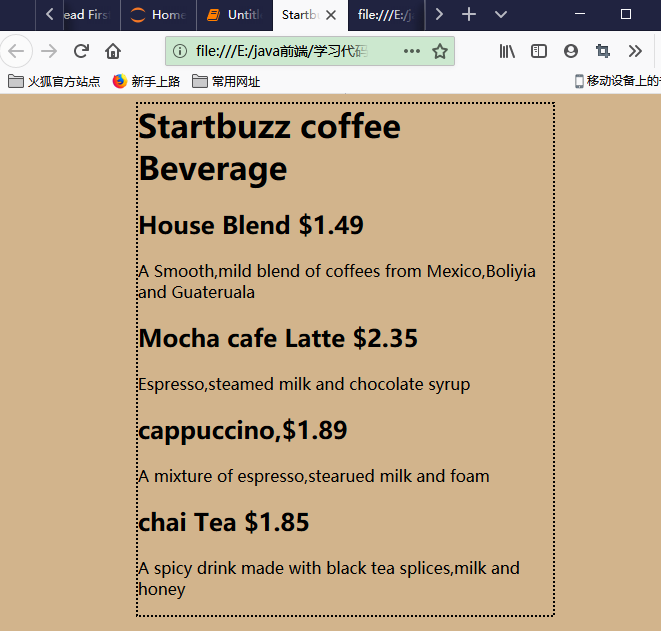

# 初识HTML
- Hyper Text Markup Language 超文本标记语言

```
创建web界面的步骤：
    - 创建.html文件，并且将这些文件放在一个web服务器上
    - 将文件放在web浏览器之后，任何浏览器就可以通过互联网访问你的界面了
    - 如果编写的足够好，那么你的网页就可以在手机和移动设备上很好地显示

web服务器如何工作：
    - pc端的浏览器发出请求，要求得到html界面或者其他资源
    - web服务器找到这个洁面后就会将其发给浏览器
    - pc端显示该html界面
```


```python
# 例1：Head first lounge.html
<HTML>  <!--告诉浏览器html文件从这里开始-->
    <head>
        <!--为页面制定一个标题,浏览器的界面标题-->
        <title>Head First Lounge</title>
    </head>  <!--head结束-->
    <body> <!--页面主体body开始-->
        <!--### h1,h2,...,h6表示六级标题-->
        <h1>welcome to the Head First Lounge</h1>  <!--告诉浏览器这是一个一级标题-->
        
        <p>  <!--开始一个段落-->
            Join us any evening foe refreshing elixirs,
            conversation and maybe a game or
            two of <em>Dance Dance Revolution</em> <!--强调Dance Dance Revolution-->
            Wireless access is always provided;
            BYOWS(Bring your own web server).
        </p> 
        <h2>Directions</h2> <!--告诉浏览器这是一个二级标题-->
        <p>  <!--开始另外一个段落-->
            You'll find us right in the center of 
            downtown Webville.Come join us!
        </p>
    </body>
</HTML>
```

<HTML>  <!--告诉浏览器html文件从这里开始-->
    <head>
        <!--为页面制定一个标题,浏览器的界面标题-->
        <title>Head First Lounge</title>
    </head>  <!--head结束-->
    <body> <!--页面主体body开始-->
        <!--### h1,h2,...,h6表示六级标题-->
        <h1>welcome to the Head First Lounge</h1>  <!--告诉浏览器这是一个一级标题-->
        
        <p>  <!--开始一个段落-->
            Join us any evening foe refreshing elixirs,
            conversation and maybe a game or
            two of <em>Dance Dance Revolution</em> <!--强调Dance Dance Revolution-->
            Wireless access is always provided;
            BYOWS(Bring your own web server).
        </p> 
        <h2>Directions</h2> <!--告诉浏览器这是一个二级标题-->
        <p>  <!--开始另外一个段落-->
            You'll find us right in the center of 
            downtown Webville.Come join us!
        </p>
    </body>
</HTML>


# HTML文件都干了什么？？？
    - HTML会告诉浏览器web页面的结构和内容,比如标题是什么，放在哪里，哪些文本需要强调等等
    - 在浏览器中显示时会自动忽略掉html文档中的制表符和缩进等，它们是根据标记确定在哪里换行和分段处理的，我们在编辑时插入格式是为了让自己更加容易的读懂文档
    - 内部标题总共有6级：h1,h2,...,h6。一般用到h2就可以了
    


```python
- <h1>一级标题</h1>
- <h2>二级标题</h2>
- <p>段落内容</p>
- 一个元素：开始标记+内容+结束标记
- 对于图片而言，是简化之后的元素
```

    - <html>标记是为了告诉浏览器这个文档确实是一个html文档，如果不加该标记，有些浏览器不能识别
    - html文件不仅仅是后缀.html，更加重要的是其内部的内容
    - html5是html的最新版本，它大大简化了html,并且提供了一些新的内容
    - 在html文件中加入自己的注释：<!--注释-->,注释的内容不会显示在浏览器端

    - 例子2:StartBuzz coffee：E:\java前端\学习代码与笔记\startbuzz
    - 在经过两次的修改之后，还需要对于界面进行美化，这时候就需要使用css

# CSS(Cascading Style Sheets):层叠样式表
    - 给html元素添加属性
    - 通过属性可以给元素提供附加信息，比如可以通过<style>元素制定是什么类型的样式
    - 例子：E:\java前端\学习代码与笔记\startbuzz\初识CSS\index_3.html


```python
<head>
        <title>Startbuzz coffee</title>
        <!--style元素总是要放在<head>元素中-->
        <style type='text/css'>
            <!--定义CSS属性内容-->
        </style>
</head>
```
<<<<<<< HEAD


=======


>>>>>>> b01b0dcc172860b6a3016c5a95178d3b7b0dbe6e

    - 使用CSS给Startbuzz网站添加样式
    - E:\java前端\学习代码与笔记\startbuzz\初识CSS\index_4.html


```python
<head>
        <title>Startbuzz coffee</title>
        <style type='text/css'>
            <!--这里的body指的是要将CSS用于html的body元素的内容-->
            <!--根据这个方法同样可以设置h1元素和其他元素的样式-->
            body{
                <!--增加背景颜色为土黄色-->
                background-color:#d2b48c;
                <!--左右外边距分别占据页面的20%-->
                margin-left:20%;
                margin-right:20%;
                <!--页面主体周围的边框是黑线，虚线-->
                border:2px dotted black;
                <!--页面主体的内边距-->
                padding:10px 10px 10px 10px
                <!--文本使用的字体等-->
                font-family:sans-serif
            }
        </style>
</head>
```



      - CSS看起来和html是两种完全不同的语言，两者具备不同的作用
      - html负责搭建框架，CSS负责创建样式，两者各司其职
      - 用CSS指定颜色有很多方式，最常用的就是十六进制码

## chap1总结：
    - 大体上介绍了HTML和CSS
    - 引入了一个属性<style type='text/css'>
