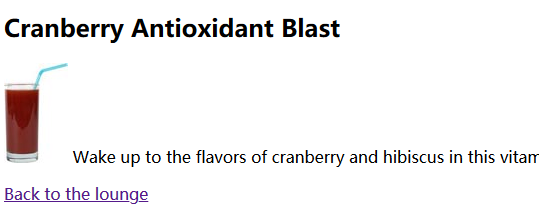
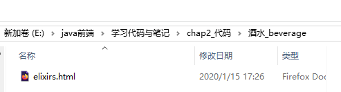

# 改良chap1中的head_first_lounge
    - 在该页面中加入两个超链接，点击可以直接跳转到别的界面
    - 1、需要编辑两个新的html文件：elixirs.html和Directions.html
    - 2、将其嵌入head_first_lounge.html中
    

## 引入超链接的方式：从lounge.html到elixirs.html和Directions.html 
    - 使用<a href=''>内容</a>
    - 详见E:\java前端\学习代码与笔记\chap2\lounge.html代码
        - 首先将连接文本放入<a>元素中：<a>elixirs</a>，其中elixirs就是链接文本，链接到另一个web界面
            - 浏览器中连接文本是有下划线的，表示这是可点击的
        - 然后需要告诉浏览器这个链接文本的指向（链接到哪一个web界面）：使用href属性指定链接的目标文件
    - href:hypertext reference:超链接，读作h ref


```python
<p>  
    Join us any evening for 
    <a href='elixirs.html'>elixirs</a>,
    conversation and maybe a game or
    two of <em>Dance Dance Revolution</em> <!--强调Dance Dance Revolution-->
    Wireless access is always provided;
    BYOWS(Bring your own web server).
</p>
```

<p>  
    Join us any evening for 
    <a href='elixirs.html'>elixirs</a>,
    conversation and maybe a game or
    two of <em>Dance Dance Revolution</em> <!--强调Dance Dance Revolution-->
    Wireless access is always provided;
    BYOWS(Bring your own web server).
</p>


## 了解属性
    - 回顾之前见到的几个属性：
        - <style type='text/css'>:type属性指定使用哪种语言，这里选择CSS
        - <a href='test.html'>：href指定一个超链接文件
        - ：src属性指定一个img标记显示的图像的文件名
    - 属性书写特点：
        - 属性名="属性值"
        - 注意一定要加双引号

    - 一般HTML元素的属性都是定制好的，不能随意创造，在html5中可以允许定制新的属性
    - 本书中会慢慢学习部分元素支持的属性

### 至此我们已经创建了从lounge.html到elixir.html和Directions.html的链接,接下来就想办法在elixir.html中创建一个链接返回到lounge.html中
    - 同样在elixir.html的body中加入一个文本超链接即可


```python
<p>
    <a href='lounge.html'>Back to the lounge</a>
</p>
```

<p>
            <a href='lounge.html'>Back to the lounge</a>
        </p>



    - 除了可以将文本设为超链接之外，还可以将图片作为超链接
        - <a href='Driections.html'></a>
    - 总之将任何东西放在<a>元素中均可以产生一个超链接，可以是<p>元素或者<h1>元素

### 目前包含了三个界面的跳转，并且内部包含了5个图片
### 为了更加良好地存放这些内容，需要建立一些文件夹





## 单纯修改文件位置之后的问题
    - 原来的web超链接、图片等都不能很好地显示出来
    - 所以我们还需要修改html文件的内容，对于超链接的路径，图片的路径进行修改
    - 使用相对路径
    - 在上面的文件夹中：
        - 根文件到子文件：lounge中要访问酒水和相关内容中的html文件
            - 
            - <a href='酒水_beverage/elixirs.html'>elixirs</a>
            - <a href='相关内容_about/Driections.html''>detailed directions</a>'
        - 子文件要访问根文件：酒水_beverage中的elixirs.html想要访问image图像
            - 首先先回到image文件夹所在目录下（这里也就是elixirs.html的父目录）：../
            - 然后进入image文件夹下：

    - 文件夹A中有文件B，则称A所在的目录为B的父目录，从B所在路径访问的方法就是：../
    - ../可以叠加使用：../../表示B的父路径的父路径

## chap2总结：
    - 引入超链接，父路径、子路径的引用转换
