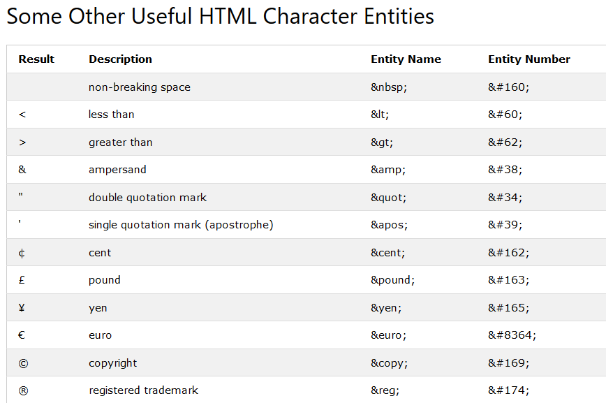
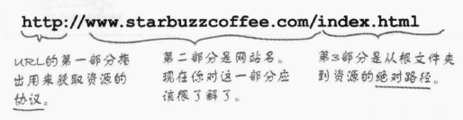
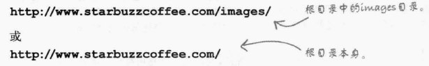

## 本章的学习内容：将本地电脑端创建的web网页发布到互联网上
###      需要借助托管企业，将web界面托管到服务器上
    - 我们要做的就是把我们的web页面托管到服务器上
    - 如何做呢？？
        - 首先找一家托管公司
        - 然后为自己的网站选定一个名字，例如www.startbuzzcoffee.com
        - 把文件从你的计算机上传到托管服务器上
            - 也就是把自己网站的根文件夹复制到web服务器的根文件夹下
            - 大多数托管公司都支持一种叫做FTP（File Transfer Protocol）的文件传输方法
            - 需要依靠这个协议将文件复制过去
        - 把你的新网站告诉大家，大家就可以通过搜索享受你的成果了
    - 如果上传之后想要对于部分内容进行修改怎么整呢？？？
        - 通常我们需要在自己的电脑端进行修改，然后将其上传到服务器端
        - 一般不建议直接在服务器上编辑
    这里留了家庭作业，但是我不会写。。。。。。。。。。。。。。。。。。 

## FTP:File Transfer Protocol
    - FTP如何工作：
        - 首先，使用FTP连接到你的服务器：托管公司会提供一个用户名和口令，输入口令后连接并登录更成功
        - 其次，使用cd命令将当前目录切换到文件传输的目标目录
        - 使用put命令将文件上传到服务器
        - 还可以使用mkdir命令在服务器上创建一个新目录
        - 还可以使用get命令获取文件
        - 使用pwd命令可以查看当前的目录

#### 1 找一家托管企业:
    这部分的内容没有搞明白，还需要继续查资料

### 域名：
    - 一个唯一可以用来定位你的网站的名字
        - 网站名：www.startbuzzcoffee.com
        - 域名：startbuzzcoffee.com
        - 服务器名称：www
    - 不同的域名结尾也不同，例如com、edu、cn等等，用途不同，表示不同
        - 买下一个域名就相当于买下了一块地，在这个域名下我们可以建立很多的网站，也就是使用不同的服务器，比如
            :home.startbuzzcoffee.com
            :outhome.startbuzzcoffee.com等等，这些都是网站
    - 如何得到一个域名：托管公司一般会提供域名注册
        - 另外，一般如果你想知道某个域名是否已经被占用，可以查询：
        - http://www.internic.net/regist.html
    - 域名由一个权威机构ICANN控制，保证一次只能有一个人使用某个域名，所以要保留自己的域名，每年还需要缴纳一定的费用
    - 这里不太懂，先放过去

## 使用wampserver上传自己的网页到服务器:这里借助的是自己的ip地址创建了一个服务器
    - 参考https://www.cnblogs.com/gzy-tw/p/10100049.html
    - 安装好wampserver（E:\wamp）后：
            - 安装教程：http://soft.onlinedown.net/soft/82112.htm
        - 1、在cmd中输入ipconfig，获取自己的ipv4地址：比如192.168.3.103
        - 2、将自己的html程序放入E:\wamp\www文件夹下：hello.html
        - 3、在浏览器中输入http://192.168.3.103/hello.html,就可以访问自己的web界面了
    - 其他的方式可以参考https://blog.csdn.net/xinxin_2011/article/details/90714646，这部分的内容我没有看

## URL:uniform Resource Locator
    - 一个全局地址，可以用来定位web上的任意资源，包括html页面，音频、视频等很多其他形式的web内容
    - url还可以指定用来获取资源的协议，例如http,https

## HTTP:
    - HyperText Transfer Protocol:超文本传输协议
    - 一种在web上传输超文本文档的方法或者协议
    - 每次在浏览器地址栏输入一个URL时，浏览器就会使用Http向服务器请求相应的资源，如果服务器找到这个资源，就会把它返回给浏览器，由浏览器显示
    - 如果服务器没有找到对应的文件，则会显示#404错误
类似的还有其他协议，例如mail邮件传输协议以及ftp协议等

## 文件的绝对路径
    - 绝对路径告诉服务器如何从根文件夹到达某个指定的页面或者文件，例如

    - 第二个文件直接是请求根目录（注意一定要包含'/'），在这样的情况下，服务器一般会在该目录下寻找是否存在默认文件，若存在则直接返回根目录下的默认页面，这取决于托管公司如何命名默认文件夹。可以是index.html或者default.htm
    

    - 如果服务器收到这样的url:

    - 会默认在url后面添加一个'/',然后返回该目录下的默认页面

## 超链接的两种形式
    - 一：使用相对地址的形式，这种适用于链接同一网站内的页面
    - 二：使用完整的url地址，这种适用于链接其他网站
            

			<!---这里使用了两种方式的超链接形式，一种相对地址，一种url形式--->
			<a href="mission.html">Read about our mission</a>
			    <!---分行显示--->
			Read the <a href="http://wickedlysmart.com/buzz">Caffeine Buzz</a>
		

    - 超链接的内容还可以是图片、段落
或者小的引用<quoteblock>等
            

			<!---这里使用了两种方式的超链接形式，一种相对地址，一种url形式--->
			<a href="mission.html">Read about our mission</a>
			<!---这里的超链接内容包含两个部分的内容，一部分文字，一部分图片--->
            

### 超链接的title属性设置
    - 使用这个属性
        

			<a href="mission.html"
			title="Read more about Startbuzz Coffee's important mission">Read about our mission</a>
            <!--- 这个内部的title是一个提示信息，当你将鼠标放在Read about our mission上面时，
			会显示这句话--->
			    <!---分行显示--->
			Read the <a href="http://wickedlysmart.com/buzz"
			title="Read all about Caffeine on the Buzz">Caffeine Buzz</a>
			<!--- 这个内部的title是一个提示信息，当你将鼠标放在Caffeine Buzz上面时，
			会显示这句话--->
		

### 超链接的id属性设置：
    - 使用这个属性可以直接链接到某个页面的某一个特定的部分，可以是标题部分或者中间的某个部分
    - 这适用于页面较长的文章，即一面显示不完的那种
    - id之间不能存在空格：字母开头，后面可以是字母，数字，下划线，横线，冒号或者点号
    - 为chai Tea添加id属性：
            

            <h2 id="chai">chai Tea $1.85</h2>
            

    - 这时当我们想直接链接到index.html的chaiTea界面，就可以使用#id
            <a href='index.html#chai'>See chai Tea</a>
    - 再比如：
            

			Read the <a href="http://wickedlysmart.com/buzz#Coffee"
			title="Read all about Caffeine on the Buzz">Caffeine Buzz</a>
            

    - 还可以链接到当前界面中的某个位置
        - 例如前面有一个元素，id为top,则可以在后面用<a href="#top">Back to top</a>回到前面位置处

## 单击超链接时直接新建一个窗口，而不是覆盖目前的窗口
    - 在打超链接时我们需要告诉服务器是在当前窗口内打开，还是在新的窗口内打开，这需要使用元素<a>的target属性，target属性会告诉浏览器页面的目标窗口。
        target="_blank":在新的窗口中打开链接页面
        无target:在当前窗口中打开，覆盖掉当前页面
    - 另外，还可以使用自定义的名称作为target的内容，这样这些使用同一个target内容的超链接就会在同一个新的窗口内覆盖打开，例如这里target="co"
        

			<!---这里使用了两种方式的超链接形式，一种相对地址，一种url形式--->
			<a target="co" href="mission.html">Read about our mission</a>
			    <!---分行显示--->
			Read the <a target="co" href="http://wickedlysmart.com/buzz#Coffee"
            >Caffeine Buzz</a>
		

    - 注意：由于浏览器设置的不同，使用target可能会在当前标签页中打开一个窗口或者打开一个新的标签页
