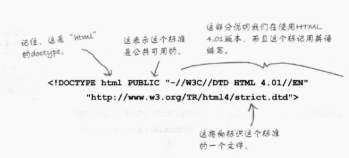
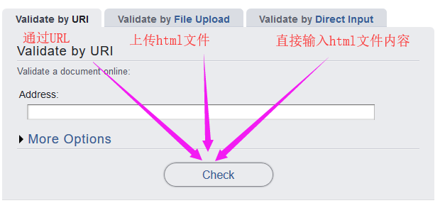

## 标准化html，使得可以适合html5
    - html5只是html的一个最新版本，直接称之为html,html5改进了复杂的doctype
        <!doctype html>
    - 原来的复杂的html4.1的doctype:

    - html从1.1版本开始经历了很多版，最后统一将其命名为html,目前的Html标准具备向后兼容性，就是说以后再添加新的内容也不会使得html界面的显示受到影响；如果我们今天写的一个html内容中的某个元素的使用规范明天被更改了，那我们今天所写的形式仍然是受到支持的，原来的规范和更新后的规范都是可以正常显示的
    - 规范就是一个文档，指定了html中包含的元素和属性，这个文档由W3C（World Wide Web Consortium）维护，但是任何人都可以改进这个标准
#### 我们需要做的
    - 我们要做的就是在html的编码前加入<!doctype html>，让浏览器知道明确知道我们使用的是html5（即标准html）,减少可能会出现的问题，这句话的加入丝毫不会影响页面的显示
        <!doctype html>
        <html>
            <head>
                <title>Sharpen your pencil trivial</title>
            </head>
            <body>
            
How long a line can you draw with the typical pencil?

            

                
            

            </body>
        </html>
#### html5和html的区别
    - 增加了新元素和新属性
    - html只是页面的一些静态显示，包含文字，图片，链接等，但是Html5增加了一些web应用，不再需要下载app，直接在web上就可以完成相应的工作

#### W3C验证工具：
    - 验证界面内部的符号书写是否存在错误
    - 获取方法：http://validator.w3.org/

    - 经过使用第三种方法验证第一章中head first lounge.html的内容，我们发现了以下几个问题：
        - 当我们不写第一行的<!doctype html>时会出现一个error:Start tag seen without seeing a doctype first. Expected <!DOCTYPE html>.
        - 1 根据W3C标准，img元素需要添加alt属性
            - 当图片不能正确显示时，会显示alt文字，这在chap5中也有讲
            - 对于有视力障碍的人，借助屏幕阅读器时会读取alt的内容
        - 2 需要在head中提前指定web所使用的编码方式：
                <head>
                    <meta charset="utf-8">
                    <title>内容</title>   <!--head中一定要有title--> 
                </head>
            - meta标记表示我们要告诉浏览器一些关于web的信息
            - charset是Mete的一个属性，指定web的字符编码
        - 3 存在一个Warning:给开始标记<html>增加一个属性lang声明这篇html文档使用的语言
            - 根据 W3C 推荐标准，您应该通过 <html> 标签中的 lang 属性对每张页面中的主要语言进行声明
                <html lang='zh'>
                ...
                </html>
                - lang可以是任何语言的缩写，例如中文Chines是zh等，详情参见https://www.w3school.com.cn/tags/html_ref_language_codes.asp
            - 
