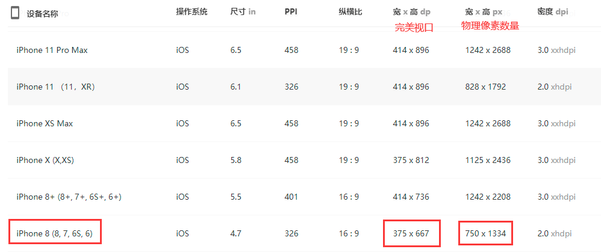
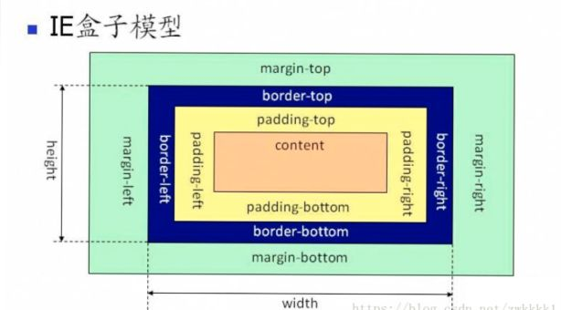
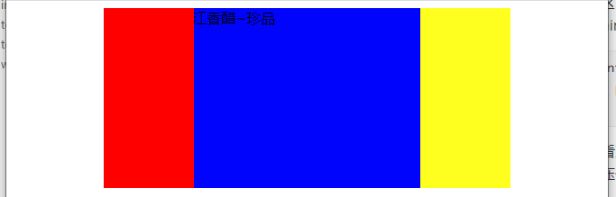
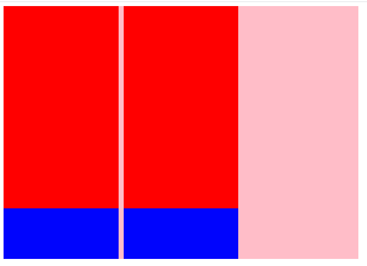

目录 <div id="0"></div>

[ 一、网页组成 ](#1)  
[二、CSS：层叠样式表](#2)  
[三、选择器](#3)  
[四、样式的继承](#4)  
[五、选择器的权重](#5)  
[六、像素和百分比](#6)  
[七、em 和 rem](#7)  
[八、RGB 颜色单位](#8)  
[九、文档流](#9)  
[十、盒模型](#10)  
[十一、盒子的水平布局](#11)  
[十二、垂直方向布局](#12)  
[十三、外边距的重叠](#13)  
[十四、行内元素的盒模型](#14)  
[十五、浏览器的默认样式](#15)  
[十六、盒子的大小](#16)  
[十七、轮廓阴影和圆角](#17)  
[十八、浮动](#18)  
[十九、简单的布局](#19)  
[二十、高度塌陷和 BFC](#20)  
[二十一、clear 属性](#21)  
[二十二、使用 after 伪类解决高度塌陷](#22)  
[二十三、使用 before 伪类解决相邻外边距重叠问题](#23)  
[二十四、clearfix 解决外边距重叠和浮动影响问题](#24)  
[二十五、定位](#25)  
[二十六、网页层级](#26)  
[二十七、字体族](#27)  
[二十八、图标字体简介](#28)  
[二十九、行高、字体框行间距](#29)  
[三十、font 设置简写属性](#30)  
[三十一、文本的水平和垂直居中](#31)  
[三十二、其他的文本样式](#32)  
[三十三、背景](#33)  
[三十四、表格](#34)  
[三十五、表单](#35)  
[三十六、项目搭建](#36)  
[三十七、过渡 transition](#37)  
[三十八、动画 Animation](#38)  
[三十九、变形平移 transform](#39)  
[四十、less](#40)  
[四十一、弹性盒简介](#41)  
[四十二、像素](#42)  
[四十三、媒体查询](#43)

## 一、 网页组成[∧](#0)<div id="1"></div>

- 结构:html
- 表现:css
- 行为:javascript

## 二、CSS：层叠样式表（Cascading Style Sheets）[∧](#0) <div id="2"></div>

三种形式：

- 内联样式：`<p style='color:red; font-size:14px; '> 哒哒 </p>`
- 内部样式表`<style type="text/css"> p{} </style>`
- 外部样式表`<link rel="stylesheet" type="text/css" href="#">`

## 三、选择器[∧](#0) <div id="3"></div>

除了 id 选择器，类选择器，标签选择器以及他们的组合选择器外，还有关系选择器，属性选择器、伪类选择器

#### 1 元素选择器

- 元素选择器会选中页面中所有的该元素

```
p {

}
```

#### 2 id 选择器

- 因为 id 是独一无二的，所以一定是只选中一个元素

```
<p id='p1'></p>
#p1 {

}
```

#### 3 类选择器

- 因为多个元素可以使用一个类名，所以类选择器可以选中多个元素

```
<p class="para">
    我是p1
</p>
<p class="para">
    我是p2
</p>
<!-- 会同时选中两个段落 -->
.class {

}
```

#### 3 通配符选择器\*

- 选中页面内的所有元素

```
* {

}
```

#### 4 交集选择器

- 同时使用多个选择器界定，则只有满足多个选择器的元素才可以被选中
- 选择器 1 选择器 2 选择器 3 ... {}
- 如果多个选择器中有元素选择器，则元素选择器应该写在最前面

```
符合两个条件：是div元素，并且具有box1类
必须写成div.box1,不能写成.box1 div
div.box1 {

}
```

#### 5 并集选择器

- 选择器之间使用逗号隔开，满足任何一个选择器就可以被选中

```
h1,.box1,p {

}
```

#### 6 关系选择器：

- `div > span`:选中 div 块中的所有子元素 span(直接儿子，不包含孙子 span)
  - 比如在下面的例子中，只会选中`我是div内部的span1,span2,span3,span4`,p 内的 span 不会选中

```
<div class="box1">
    <span>我是div内部的span1</span>
    <span>我是div内部的span2</span>
    <span>我是div内部的span3</span>
    <p>
        我是div内部的p
        <span>我是div p内的span1</span>
        <span>我是div p内的span2</span>
    </p>
    <span>我是div内部的span4</span>
</div>
```

- `div span{}`:选中 div 块中的所有后代元素 span,包括儿子，孙子，...,在上面的例子中，所有标签元素 span 均会被选中
- `div + span`:选中 div 后面的第一个兄弟元素 span，div 和 span 必须是相邻的
  - 比如：下面的只会选中`我是div内的span1`,[效果](练习/12.选择器/01.兄弟选择器+.html)

```
<div class="box1">
    <li>我是列表1</li>
    <li>我是列表2</li>
    <span>我是div内部的span1</span>
    <span>我是div内部的span2</span>
    <span>我是div内部的span3</span>
    <p>我是div内部的p</p>
    <span>我是div内部的span5</span>
</div>

.box1 li + span { // 选中div中的li的第一个span兄弟
    color: red;
}
```

- `div~span`:选中 div 后面的多个兄弟元素 span,不要求相邻，在上面的例子中，会选中`span1,span2,span3,span4`,[效果](练习/12.选择器/02.兄弟选择器~.html)

#### 7 属性选择器：

- `div[title]`:选择有 title 属性的 div 块
- `div[title=value]`:选择有 title 属性并且其属性值为 value 的 div 块]
- `div[title^=value]`:选择 title 属性值为以 value 开头的 div 块
- `div[title￥=value]`:选择 title 属性值为以 value 结尾的 div 块
- `div[title*=value]`:选择 title 属性值含有 value 的 div 块

选择器练习可以参见：http://flukeout.github.io/

#### 3 伪类及伪类选择器

伪类像类一样，用来选择 DOM 树上本就存在的某个元素。选择条件两种：

（1）描述一个元素的特殊状态：如第一个元素，被点击的元素，鼠标移入的元素

1. `Lvfha`
   1. `a:link`-->没有访问过的超链接
   2. `a:visited`-->访问以后的超链接
   3. `a:hover`-->鼠标移入
   4. `a:active`-->鼠标点击，不松手时的状态
   5. `元素:focus`--->鼠标选中时的状态，获得焦点时的状态
   6. 为某个超链接设置状态样式时，需要按照`Lvfha` 顺序设置，否则一些样式会被其他样式覆盖
2. link 和 visited 属于链接伪类，只会在超链接上起作用。**注意：visited 只能作用于 color,background-color,border-color**
3. hover active 是动态伪类，可以作用于所有的元素
4. 表单伪类：
   1. enabled:匹配可编辑的表单
   2. disabled:匹配被禁用的表单
   3. checked:匹配被选中的表单
   4. focus:匹配获取到焦点的表单

（2）元素是否满足某种 DOM 结构方面的要求

- 特点：一般使用:开头

  - 当父元素的第 i 个元素是 A 类型时才选中，如果不是则没有选中。看是第几个元素时不管元素类型，得到第几个元素后，如果该元素是 A 类型，则就为其添加样式，否则不添加
    - `父元素 > 子元素A:first-child{}`：选中父元素的第一个 A 类型子元素
    - `父元素 > 子元素A:last-child{}`：选中父元素的最后一个 A 类型子元素
    - `父元素 > 子元素A:nth-child(){}`：
      - (n):选中父元素的所有 A 类型子元素
      - (2n):选中偶数 A 类型子元素
      - (2n+1):选中奇数位 A 类型子元素
      - (1):选中父元素的第一个 A 类型子元素
  - 选择父元素的 A 类型元素中的第 i 个：
    - `父元素 > 子元素A.first-of-type{}`:选中父元素的第一个 A 类型子元素
    - `父元素 > 子元素A.last-of-type{}`:选中父元素的最后一个 A 类型子元素
    - `父元素 > 子元素A.nth-of-type(1){}`:选中父元素的第 1 个 A 类型子元素
  - `:not{}`:将符合条件的元素从选择器中去除
    - `ul > li:not(:nth-child(2)){}`:选中 ul 中除了第二个元素的所有 li

- nth-of-type 的坑：**nth-of-type 以元素作为中心**

  ```
  <div id='wrap'>
  	<div class='inner'></div>
  	<p class='inner'></p>
  	<span class='inner'></span>
  </div>

  <style>
  	// 这表示给wrap下所有类型为inner的每一种元素类型的第一个元素添加border样式
  	#wrap .inner:nth-of-type(1) {
  		border:1px solid red;
  	}
  </style>
  ```

- empty:选定空元素，有空格都不行，可以有高度和宽度，内容为空

#### 5 伪元素及伪元素选择器

伪元素：表示页面中一些特殊的并不真实存在的元素，使用::开头

- `::first-letter{}`:第一个字母
- `::first-line{}`:第一行
- `::selection{}`:选中的内容
- `::before{}`:元素的开始位置
- `::after{}`:元素的结束位置
  - before 和 after 必须结合 content 使用，例如`div::before{content:'abc' color:red}`;

## 四、样式的继承[∧](#0) <div id="4"></div>

- 我们为一个父元素指定的样式也会应用到它的后代元素上
- 并不是所有样式均会继承：背景布局相关的样式不会继承

## 五、选择器的权重[∧](#0) <div id="5"></div>

权重相加，得到最终的权重：

    !important   Infinity  (慎用，用了样式就不能在js或者style中修改了),放在分号之前
    内联样式       1,0,0,0
    id            0,1,0,0
    类和伪类、属性   0,0,1,0
    标签           0,0,0,1
    通配选择器*     0,0,0,0
    继承样式      没有优先级

    注意：
    	属性选择器 div[id="test"]  0,0,1,1
    	id选择器   #test          0,1,0,0

    权重是不进位的，例如选择器包含100个id，则权重为： 0,100,0,0 ，依然小于内联样式1,0,0,0的权重

`<span style='color:red !important;'>大家好</span>`

## 六、像素和百分比[∧](#0) <div id="6"></div>

#### 1 像素

长度单位 ，构成屏幕的一个个小点，实际上是正方形的

- 不同屏幕的像素大小不同
- 像素越小的屏幕，显示的效果就越清晰

#### 2 百分比

设置属性相对于父元素的百分比

```
<div id='box1'>
    <div id='box2'></div>
</div>

#box1{
    width:200px;
    height:200px;
}

#box2{
    width:50%;  //100px
    height:50%;  // 100px
}
```

## 七、em 和 rem[∧](#0) <div id="7"></div>

#### 1 em

- 相对于元素自身的字体大小计算，1em=10font-size;
- font-size 默认为 16px,也可以自己指定;

```
<div id='box3'></div>
#box3{
    font-size:14px;
    width:10em;  //140px
    height:10em;  //140px
}
```

#### 2 rem

相对于根元素(html)的字体大小计算,默认为 16px

```
<div>咔咔</div>
html {
    font-size:14px;
}
div {
    width:10rem;  //140px
    height:10rem;  //140px
}
```

## 八、RGB 颜色单位[∧](#0) <div id="8"></div>

在 css 中颜色有几种表示方式：

- 1 颜色名：red,yellow,...
- 2 RGB 值：通过三种颜色的不同浓度调配不同的颜色

```
    - R:red,G:green,B:blue
    - 每种颜色的范围为：[0,255]
    - 语法：RGB(红色,绿色,蓝色)
    - 例如：rgb(255,0,0):红色，rgb(0,0,0):黑色，rgb(255,255,255):白色
```

- 3 RGBA:A 表示透明度[0-1]，0 表示完全透明(就没有颜色了)，1 表示不透明

```
    - 例如:rgb(0,0,0,1):黑色不透明
```

- 4 十六进制的 RGB 值：#红色绿色蓝色，范围分别是 00-ff

```
    - 例如:#000000表是黑色，#ffffff表示白色
    - 简写：#aabbcc--->#abc
```

## HSL 值 HSLA 值 (使用较少，ps 中使用次数多)

```
    - H：色相,定义色相 (0 到 360) - 0 (或 360) 为红色, 120 为绿色, 240 为蓝色
    - S：饱和度, 0% 为灰色， 100% 全色
    - L：亮度, 0% 为暗, 50% 为普通, 100% 为白
    - A：透明度,透明度 0（透完全明） ~ 1（完全不透明）
```

## 九、文档流[∧](#0) <div id="9"></div>

网页是一个多层结构，一层摞着一层，通过 css 可以为每一层指定样式，作为用户只能看到最顶一层,最底下一层就称为**文档流**，我们创建的元素默认都在文档流中

- 元素两种状态：
  - 在文档流
  - 脱离了文档流

#### 1 元素在文档流：

- 块元素：在页面中独占一行，自上向下垂直排列

```
    默认宽度和父元素一致，会把父元素撑满
    默认高度被内容(子元素)撑开
```

- 行内元素

```
    行内元素不会独占一行，自左向右水平排列
    如果一行中不能容纳所有行内元素，就会自动换到第二行，这和书写习惯一致
    默认宽度和高度被内容撑开
```

## 十、盒模型[∧](#0) <div id="10"></div>

css 将页面中的所有元素均设置为了一个矩形的盒子，则对于页面的布局就变成了盒子的位置摆放

每个盒子都具备以下几个部分：

- 内容区 content：

```
元素中的所有子元素和文本内容均在内容区
width和height设置内容区大小
```

- 内边距 padding:
- 边框 border:

```
边框宽度 border-width:默认3px;
边框颜色 border-color:red;
边框样式 border-style:solid;
    solid:实线
```

- 外边距 margin:

#### 1 边框:

**边框宽度** border-width

    指定四个方向的边框的宽度
        border-width:10px 2px 3px 1px;上右下左
        border-width:10px 2px 3px;上 左右 下
        border-width:10px 2px;上下 左右

border-xxx-width:指定某一边框的宽度

    border-top-width:上边框宽度
    border-bottom-width:下边框宽度
    border-left-width:左边框宽度
    border-right-width:右边框宽度

**边框颜色** border-color :规则同边框宽度一样

    如果不指定border-color，则默认使用color值

**边框样式** border-style :规则同边框宽度一样

    solid:实线
    dotted:点状虚线
    dashed:虚线
    double:双线
    默认值：none，表示没有边框

**border 简写属性**

    border:width color style;
        例如：border:1px red solid;

border-xxx:设置某一边的宽度，颜色，样式。 例如 border-top:1px red dashed;

**特殊地：border-image** 将图像作为元素的边框，使用 border-image 时，其将会替换掉 border-style 属性所设置的边框样式。

```
Opera需要添加-o-前缀

border-image-source: none
border-image-slice: 100%
border-image-width: 1
border-image-outset: none   10px
border-image-repeat: stretch
```

#### 2 内边距

内边距 padding:内容区和边框之间的距离  
padding-xxx:

    xxx取top,bottom,left,right
    内边距的设置会影响盒子大小，内容区的背景颜色会延伸到内边距部分

padding:不可以使用负值

    四个值：上 右 下 左
    三个值：上 左右 下
    两个值：上下 左右
    一个值：上下左右

**计算盒子可见框的大小**

可见框大小：不包含 margin

    盒子宽度：左边框宽度+左内边距+内容区宽度+右内边距+右边框宽度
    盒子宽度：上边框高度+上内边距+内容区高度+下内边距+下边框高度

> - \*padding 可以取继承 inherit：直接继承父元素的 padding 大小\*\*
> - _padding 取百分比：基于父元素宽度(无论垂直还是水平，均是基于父元素宽度)_
> - auto:好像用不了了\*

#### 3 外边距

margin-xxx:

    xxx取top,bottom,left,right
    不会影响盒子可见框的大小，当前盒子与其他盒子的距离
    会影响盒子实际占用页面的大小

margin:可以设置负值

    四个值：上 右 下 左
    三个值：上 左右 下
    两个值：上下 左右
    一个值：上下左右

## 十一、盒子的水平布局[∧](#0) <div id="11"></div>

元素在其父元素(块元素)中水平方向的位置由以下几个属性共同决定：

    margin-left
    border-left
    padding-left
    width
    padding-right
    border-right
    margin-right

一个元素在其父元素中可以水平布局的**必要因素**：
`margin-left+border-left+padding-left+width+padding-right+border-right+margin-right = 父元素的内容区宽度width`

- 如果不满足这个等式,且没有值为 auto,则浏览器会自动调整子元素的 margin-right,使得等式满足，虽然这个调整不会以文字的形式表示出来

- 即使我们人为设置了 margin-right 的值，但是等式不满足时，也会自动调整

- 如果有一个值为 auto,则浏览器会率先调整那个为 auto 的值，这七个值中有三个值可以设置为 auto

  - width
  - margin-left
  - margin-right

- 如果 width 有值，两个外边距均为 auto,则会将其设置为相同的值，子元素在父元素中居中显示，**这可以用于设置元素的居中显示**

  - ```
    width:xxx; // 要指定宽度，否则宽度默认也是auto,则三个值都是auto,就会变成100%
    margin:xxx auto;
    ```

- 如果三个值都是 auto，则 width 会变为 100%，margin-left 和 mrgin-right 会变成 0

- 如果某个外边距和 width 是具体 auto，则这个值为 auto 的外边距会被调整为 0，其余内容被 width 填充

- 如果超出了，子元素宽度大于父元素内容区宽度，子元素内容会超出父元素的大小显示，但是会将子元素 margin-right 调整为负值

## 十二、垂直方向布局[∧](#0) <div id="12"></div>

- 默认父元素宽度被子元素撑开
- 如果子元素大小超过父元素，则会发生溢出，需要处理，一般使用 overflow 属性设置

```
overflow可选值：
    visible:默认值，子元素溢出部分在父元素外部显示
    hidden:裁剪溢出部分
    scroll:生成两个滚动条，水平和垂直,滚动条位于父元素内容区的最底部和最右边,通过滚动条来查看完整内容
    auto:根据需要生成滚动条
overflow-x:单独处理水平方向
    visible,hidden,scroll,auto
overflow-y:单独处理垂直方向
    visible,hidden,scroll,auto
```

> - overflow：scroll 存在的问题：滚动条不能平滑滚动
> - 解决：`webkit-overflow-scrollling-touch:touch`,这会开启硬件加速，所以滑动很平滑

## 十三、外边距的重叠[∧](#0) <div id="13"></div>

块级元素的上外边距（margin-top）与下外边距（margin-bottom）有时会合并为单个外边距，这样的现象称为“margin 合并”。垂直外边距的重叠发生的条件：

- 1 margin 相邻
- 2 垂直方向

**水平相邻外边距会累加**

> - 根据 w3c 规范，两个 margin 是邻接的必须满足以下条件：
>   - 必须是处于**常规文档流**（非 float 和绝对定位、固定定位）的块级盒子，并且处于同一个 BFC 当中。
>   - **没有线盒**，没有空隙，没有 padding 和 border 将他们分隔开
>   - 都属于**垂直方向**上相邻的外边距，可以是下面任意一种情况
>     - 元素的 margin-top 与其第一个常规文档流的子元素的 margin-top **父与子**
>     - 元素的 margin-bottom 与其下一个常规文档流的兄弟元素的 margin-top **兄弟元素之间**
>     - height 为 auto 的元素的 margin-bottom 与其最后一个常规文档流的子元素的 margin-bottom
>     - 高度为 0 并且最小高度也为 0，不包含常规文档流的子元素，并且自身没有建立新的 BFC 的元素的 margin-top
>       和 margin-bottom

解决办法：

> - 使其脱离文档流：这会开启 BFC
>   - 开启绝对定位、固定定位
>   - 开启浮动
> - 解决相邻问题：
>   - 添加边框、padding 等
>   - 添加空的伪元素：clearfix 类
> - 其他开启 BFC 的方法：开启 BFC 的元素会形成一个单独的区域，不影响外部元素的布局
>   - overflow:非 visible 的值
>   - display:flex，inline-block;

#### 1 兄弟元素的相邻垂直外边距重叠

- 两者均是正数：取两者之间的**较大值**
- 一正一负：取两者的和
- 都是负值，取两者中绝对值较大的

对开发有利，所以不需要处理

#### 2 父子元素的相邻垂直外边距重叠

- 子元素会传递给父元素，给子元素设置 margin-top=100px,在相邻情况下，就会导致看起来像是父元素产生了 margin-top=100px;
- 所以父子外边距的折叠就必须得处理

**处理办法：**

- 方法 1 不让父元素与子元素的外边距相邻
  - 给父元素增加边框(可以增加 1 像素的透明边框)或者内边距
  - 注意：在加入了边框或者内边距之后，我们需要在 height 和 width 中减去相应的宽度
  - 为什么要减：一般我们在放置一个盒子时，得到的是盒子的整体宽度 box_w 和高度 box_h，最开始我们直接将内容区设置为 box_w 和 box_h,在设置了内边距和边框后，为了保证盒子的大小不变，就需要减去内边距和边框的宽度(因为盒子的大小包含了内容区，边框和内边距)。
- 方法 2 不使用外边距，使用内边距

## 十四、行内元素的盒模型[∧](#0) <div id="14"></div>

- 行内元素不支持设置宽度和高度，它是被内容撑开的
- 行内元素可以设置 padding,但是垂直方向的 padding 不会影响页面的布局,会直接盖在旁边元素上，不会将旁边元素挤开
- border 垂直方向设置无效，也不会影响布局
- margin 垂直方向上，不会有效果

#### display 属性,设置 hidden 后不显示，也不占据页面位置

用来设置元素显示的类型，取值：

- inline:行内元素
- block:块元素
- inline-block:行内块元素(由于在 html 中每个元素分在两行写，之间存在空格，所以在将两个行内元素变成行内块元素后，分布在一行时中间存在空格，如果将字体大小设为 0，空格可消失；或者在 html 中将两个元素写在一行,尽量避免使用)
- table:将元素设置为一个表格
- none:隐藏元素，看不见了,也不会占位置
- table-cell:将元素设置为一个表格单元格，类似于<td><th> 不能设置 margin,可以设置 padding 属性

#### visibility 属性,即使设置元素不可见也会占据页面位置

- visible:正常显示，默认值
- hidden:不显示，但是占位置

## 十五、浏览器的默认样式[∧](#0) <div id="15"></div>

```
<p>哒哒</p>
<p>咔咔</p>
```

- 可以看到上面的`p`段落显示之间存在一定的间距，相应的还有其他元素也具备默认样式
- 一般浏览器不同，默认样式也不同，所以一般需要先去除默认样式

#### 1 部分标签的默认样式(firefox 浏览器中)

- 一般 body 具备`margin:8px;`，所以我们所添加的元素距离 body 都会有一小段缝隙，去除这个：

```
body {
    margin: 0;
}
```

- p 一般具有'margin:8px;',去除：

```
p {
    margin: 0;
}
```

- ul 的默认样式：`padding-left:40px; margin:16px 0;`,将 margin 和 padding 设置为 0 后会发现列表项的点也不见了，其实它只是隐藏到屏幕左边去了，一般我们也不需要点，所以可以使用`list-style:none;`一起去除

```
ul {
    margin: 0;
    padding: 0;
    list-style:none;  // 去除列表项的点(也可以单独为某个列表项设置)
}
```

- a 的默认样式：存在下划线

```
text-decoration: none;
```

#### 2 去除所有标签的默认样式

使用通配符\*直接去除所有元素的默认内边距和外边距

```
* {
    margin: 0;
    padding: 0;
}
```

一般会有一个重置样式表，这个表就是前人搜索了所有的元素的默认样式，并且总结的 css 文件：[reset.css](reset.css)和[normalize.css](normalize.css);

##### 这两个样式表的区别：

- reset.css 直接去除了浏览器的默认样式
- normalize.css 对默认样式进行了统一，使得所有浏览器的默认样式都保持一致

布置练习：
[图片列表](练习/01.布置练习/01.图片列表.html)  
[京东左侧导航条](练习/01.布置练习/02.京东左侧导航条.html)  
[网易新闻的右侧列表](练习/01.布置练习/03.网易新闻的右侧列表.html)

## 十六、盒子的大小[∧](#0) <div id="16"></div>

属性`box-sizing`

- 指定 width 和 height 的作用范围
- 默认 width 和 height 指定的是内容区的大小
- 可选值：

  - `content-box`:默认值，width 和 height 指定内容区大小

  - `border-box`:width 和 height 指定盒子大小(内容区+左右内边距+左右边框)

  - `inherit`: 从父元素继承 box-sizing 的值

## 十七、轮廓阴影和圆角[∧](#0) <div id="17"></div>

**轮廓，box-shadow 都不会影响可见框占据页面的大小**

**轮廓`outline`看似是高于文档流，由于它不占据页面空间，会将后续的内容盖住**

**box-shadow 看似低于文档流，后续的内容会将其盖住，比如后续的文字会显示在 shadow 上方**

#### 1 轮廓：`outline`

- 设置元素的轮廓线，用法和 border 一样
- `outline:1px red solid`;
- 但是轮廓不会影响可见框的大小，即就是说如果盒子的下面有一行字，给盒子加上轮廓后，会盖住下面的字，不会将字挤下去
- 轮廓紧挨着边框线，没有边框则会紧挨着 padding。

#### 2 阴影：`box-shadow`

- 用来设置元素的阴影，不会影响页面的布局
- `box-shadow:v1 v2 v3 v4 rgba(0,0,0,.3)`;

  - 默认情况下盒子的阴影和盒子大小相同，被盒子覆盖住了(偏移量为 0)，所以需要添加两个偏移量，上面的`v1,v2`就是阴影的偏移量(左侧 上侧)

  - `v3`是阴影的模糊半径，值越大，模糊效果越好

  - v4 是扩张半径，一般盒子的阴影默认为黑色，位于盒子的正下方，被盒子盖住，如果不设置偏移量想要看到阴影的，可以设置扩张半径，将阴影部分扩展到盒子的外部，就好像给它设置了一个外边框，但实际上它是不占用空间的。外扩半径也是紧挨着 border 区

    

    通过逐渐增大的外扩半径还可以设置多层边框的效果：但实际上这些阴影是不占据页面空间的，后续的元素会直接放置在阴影所在的区域

    

  - 一般使用 rgba 设置阴影的颜色

#### 3 圆角：`border-radius`

- 用来设置圆角:左上 右上 右下 下左(同理，写一个值就是四个角取相同)
  - 三个值：左上 右上/左下 右下
  - 两个值：左上/右下 右上/左下
- 这些值指的是圆的半径大小
- `border-top/bottom-right/left-radius`:分别设置四个角
  - 一般直接写一个值，得到的是一个圆角，`border-top-right-radius: 20px;`
  - 如果写两个值，表示得到一个椭圆，`border-top-right-radius: 20px 10px;`,水平方向的半径 20px,垂直方向半径 10px;
- 将元素设置为一个圆形：`border-radius: 50%;(半径为元素宽度和高度的50%)`

如果将 border-radius 设置为圆角，则 outline 不会也变成圆角，而 box-shadow 会变成圆角,以次可以实现一个外部直角，内部圆角的效果


## 十八、浮动:脱离文档流[∧](#0) <div id="18"></div>

- float 属性：设置元素的浮动，通过浮动可以向其父元素的左侧或者右侧移动
- 可选值：none(默认),left(向左),right(向右)
- 元素设置浮动后，**水平布局的等式就不需要强制成立了，浏览器就不会自动调整元素的右外边距了，就不存在虚拟的右外边距了**
- 元素设置浮动之后，会完全从文档流中脱离(元素会存在于文档上层，类似于不在一个图层)，不再占用文档流的位置，所以排在元素下边的元素会自动向上移动,**被 float 元素覆盖(除了文字)**
  - 文字会自动环绕在浮动元素的周围，所以可以利用这个设置文字环绕图片的效果
- 浮动元素可以实现横向排列

#### 浮动的特点

- 浮动元素会脱离文档流，不再占据文档的位置,元素的层级会提升 0.5。
- 设置浮动后，元素会向父元素的左侧或者右侧移动
- 浮动元素不会从父元素中移出
- 浮动元素向左向右移动时不会盖住其他的浮动元素
- **浮动元素不会超过它之前的兄弟元素，最多和兄弟元素在一个屏幕的同一个水平高度上**
- 如果一行容纳不下所有的浮动元素，则会自动向下一行移动
- 对于**块元素和行内元素**而言，脱离文档流后：

```
块元素：
    块元素不再独占页面的一行，默认宽度和高度被子元素撑开
行内元素：
    行内元素会变成块元素，可以设置宽度和高度，和块元素脱离了文档流之后的效果相同
```

- **所以脱离了文档流之后就不用区分块元素和行内元素了**

#### 简单总结

- 浮动主要作用就是让页面中的元素水平排列，从而可以根据浮动制作一些水平方向的布局

导航条的练习：[导航条的练习](练习/02.浮动练习/01.w3school导航条.html)

## 十九、简单的布局[∧](#0) <div id="19"></div>

总结来说就是盒子套盒子，计算好盒子的宽度和高度
[盒子布局练习](练习/03.布局练习/01.简单盒子布局.html)

## 二十、高度塌陷和 BFC[∧](#0) <div id="20"></div>

#### 1 高度塌陷

- 发生高度塌陷的情况：父元素不设置高度，子元素设置浮动，导致子元素无法撑开父元素，父元素高度丢失
- 父元素高度丢失后，其下的子元素会自动上移，导致页面布局混乱

#### 2 BFC 解决高度塌陷

- `BFC：Block Formatting Context`(块级格式化环境)，全称是块级格式化上下文，用于对块级元素排版，默认情况下只有根元素（body）一个块级上下文，独立的块级上下文可以包裹浮动流，全部浮动子元素也不会引起容器高度塌陷，就是说**包含块会把浮动元素的高度也计算在内**

- BFC 是 css 中的隐函属性，开启 BFC 的元素会变成一个独立的布局区域， 它规定了内部的块级元素如何布局，并且与这个区域外部毫不相干

- 开启 BFC 后元素的特点

  > - 不会被浮动元素所覆盖
  > - **子元素和父元素外边距不会重叠**
  > - 可以包含浮动的子元素

- **如何开启 BFC 呢？** 相当于清除浮动

  > - 1 给父元素设置浮动(不推荐，但是浮动之后父元素的宽度会丢失，并且父元素的同级元素会上移，被父元素盖住)
  > - 2 将父元素设置为行内块元素(不推荐，会使得父元素丢失宽度) display:inline-block;
  > - 3 将父元素的 overflow 设置为 hidden 或者 auto,一般设置为 hidden(推荐使用)，使其可包含流动元素，并且不丢失宽度，设置了 overflow 属性后，浮动元素又回到了容器层，把容器高度撑开，达到了清理浮动的效果

  - BFC 只支持 Ie7 及以上的浏览器和其他浏览器，在 Ie6 及以下的浏览器中不支持 BFC
  - 在 Ie6 及以下的浏览器中不支持 BFC，所以使用这种方式不能兼容 IE6
  - 在 IE6 中存在另一个隐含的属性叫做 Has Layout,该属性的作用和 BFC 类似，所以在 Ie6 浏览器中可以通过开启 Has Layout 解决问题
    - haslayout 为 true 时表示元素自己对于自身内容进行组织和尺寸计算,相当于开启了 BFC，否则元素由其包含块进行组织和尺寸计算
    - 开启方式很多：直接使用一种副作用最小的。将元素的 zoom 设置为 1 即可,zoom 表示放大，写几就将元素放大几倍。zoom：1 表示不放大元素
    - 但是这种方法只支持 Ie7 及以下的浏览器

## 二十一、`clear属性`[∧](#0) <div id="21"></div>

- 如果我们不希望某个元素因为其他元素的浮动而受到影响，可以通过`clear属性`来清除影响
- 可选值：
  - `left`:清除开启了`float:left`的元素的影响
  - `right`:清除开启了`float:rigth`的元素的影响
  - `both`:清除两侧中最大影响的那个
- 原理：设置清除浮动后，浏览器会自动为元素添加**上外边距**，所以元素不会向上移动到浮动元素所在的位置

## 二十二、使用`after伪元素`解决高度塌陷：基本无缺陷[∧](#0) <div id="22"></div>

- 之前讲的使用`overflow:hidden;`解决高度塌陷问题，但是这个方法有点问题
- 使用`after伪元素`解决：在父元素的最后增加一个伪元素 after,为其清除浮动，从而自动增加上外边距，撑开父元素

```
/*父元素box1不设置高度，子元素box2设置浮动，在父元素的内部最后加入一个子元素——伪元素after,为其设置清除浮动属性后，浏览器会自动为该伪元素增加上外边距，这个上外边距的高度正好是子元素box2的高度，从而撑开了父元素box1*/
<div class="box1">
    <div class="box2"></div>
</div>
.box1 {
    border:1px red solid;
}
.box2 {
    width: 100px;
    height: 100px;
    float: left;
}
.box1:after {
    /*将after元素的内容设置为空，
    after伪元素默认是一个行内元素，为了使其在清除浮动后换行出现，所以需要先将其转为块元素*/
    display: block;(也可以是table,将元素转换为块级表格)
    content: '';
    clear: both;
}
/*
 * 在Ie6中不支持after伪类,还是需要使用Has Layout处理
 */
.box{
    zoom:1;
}
```

## 二十三、使用`before伪元素`解决相邻外边距重叠问题[∧](#0) <div id="23"></div>

- 使用`before伪元素`:在父元素的内部的最上面为其**添加一个伪元素 before**,设置其内容为空，并为其增加`display:table;`属性(将元素转换为块级表格)，从而使用内容将父元素外边距和子元素外边距阻隔开，从而导致其**不满足相邻条件**

```
<div class="box1">
    <div class="box2"></div>
</div>

.box1 {
    width:100px;
    height: 100px;
    background-color:red;
    margin-top:100px;
}
.box2 {
    width: 100px;
    height: 100px;
    background-color:yellow;
    margin-top:100px;
}

.box1::before {
    content:'';
    display:table;  /*before本来是一个行内元素，将其转换为块级表格*/
}
```

## 二十四、使用 clearfix 同时解决外边距重叠和高度塌陷问题：[∧](#0) <div id="24"></div>

- 如果需要清除某个元素受到其他元素浮动的影响，以及防止外边距重叠，就可以为该元素添加`clearfix`类

```
<div class='clearfix'>哒哒</clearfix>

.clearfix::before,
.clearfix::after {
    content:'';
    display:table;  // clear属性只有块级元素才有效的，而::after等伪元素默认都是内联水平，这就是借助伪元素清除浮动影响时需要设置display属性值的原因。
    clear:both;
}

.clearfix {
	zoom: 1;
}
```

#### 清除浮动总结：

- 1 给父元素设置浮动(不推荐，但是浮动之后父元素的宽度会丢失，并且父元素的同级元素会上移，被父元素盖住)
- 2 将父元素设置为行内块元素(不推荐，会使得父元素丢失宽度) display:inline-block;
- 3 将父元素的 overflow 设置为 hidden 或者 auto,一般设置为 hidden(推荐使用)，使其可包含流动元素，并且不丢失宽度，设置了 overflow 属性后，浮动元素又回到了容器层，把容器高度撑开，达到了清理浮动的效果
- 4 给浮动元素的后面的元素添加 clear 属性；如果浮动元素后面不存在其它元素，则为其添加一个空的元素，并为其添加 clear 属性。
- 5 给父元素添加 clearfix 类

## 二十五、定位[∧](#0) <div id="25"></div>

**special: 浮动元素层级提升半层，只有在浮动的时候 才需要考虑元素分两层。定位元素提升一层。相对定位会有残留**

- 定位:一种更加高级的定位手段，通过定位可以将元素放到页面的任意位置
- `position属性`
  - `static`:默认值，未开启定位
  - `absolute`:绝对定位
  - `relative`:相对定位
  - `fixed`:固定定位
  - `sticky`:粘滞定位
- `偏移量offset`:元素相对于其他元素(也可以是自身)的偏移位置

  - top:定位元素和定位位置上边的距离

  - bottom

  - right

  - left

  - **未开启定位的元素在盒子内放置时，只会放在内容区**

### 1、相对定位`position:relative`：不脱离文档流

- 元素开启相对定位后，不设置偏移量元素不会发生任何变化，**元素的层级会提升 1，但是在文档流中存在残余，相当于相对定位后元素分为上层和下层，下层不脱离文档流，上层层级提升 1 且脱离文档流**
- 在相对定位中，默认偏移量是相对于定位元素自身而言的，指的是定位元素相对于它本身应该所在的位置（指的是左上角的 padding 区域，不包括 margin）的偏移量
- 相对定位会提升元素的层级，它的层级高于文档的层级
- 不会脱离文档流
- 相对定位不会修改元素的性质，块还是块，行内还是行内

### 2、绝对定位`position:absolute;`：脱离文档流

- 开启绝对定位后，元素的位置不会发生改变
- 开启绝对定位后，元素会脱离文档流(高于文档流，提升层级)
- **绝对定位会改变元素的性质：行内-->特殊块，但是宽高丢失，块的宽高被内容撑开，位置默认相对于父元素内容区 0 偏移处**
- 绝对定位的参考元素为`包含块`,计算该包含块的 content 的

#### 包含块

```
包含块（containing block）就是元素用来计算和定位的一个框。
left,right,bottom,top都是相对于包含块而言的
```

- 正常情况下：包含块指的是离当前元素最近的祖先块元素

```
<div>
    /*包含块就是div*/
    <span></span>
</div>
```

- 在开启定位后，包含块指的是`离当前元素最近的开启了定位的祖先块元素`,如果所有祖先元素均没有开启定位，则包含块就是初始包含块——根元素 html

  ```
  (1)如果 position 属性为 static 、 relative 或 sticky，包含块可能由它的最近的祖先块元素（比如说inline-block, block 或 list-item元素）的**内容区**的边缘组成

  （2）如果元素position:fixed，则“包含块”是“初始包含块”。

  （3）如果元素position:absolute，则“包含块”由最近的position不为static的祖先元素建立，具体方式如下：
  	包含块就是由它的最近的 position 的值不是 static （也就是值为fixed, absolute, relative 或 sticky）的祖先元素的**内边距区**的边缘组成。
  	当不指定left,right,bottom,top时，默认元素放在内容区的边缘，指定left:0,top:0时元素会紧挨着包含块的padding边缘放置

  如果没有符合条件的祖先元素，则“包含块”是“初始包含块”。
  ```

#### 水平布局

- 开启绝对定位后，水平方向的布局就变成了`left+margin-left+border-left+padding-left+width+padding-right+border-right+margin-right+right`，当等式不满足时：

```
- 9个值没有auto,则自动调整right值以使得等式成立
    - 可设置为auto的值：`margin left right width`
- 9个值中有auto,则先调整auto(注意left和right的值默认为auto)
- 水平居中：left=right=0,margin:auto;
```

- 绝对定位元素在父元素中水平居中:

```
子元素 {
    position: absolute;
    margin: auto;
    left: 0;
    right: 0;
}
父元素 {
    position:relative;
}
```

#### 垂直布局

- 垂直方向的布局同理，只不过添加了 top 和 bottom(自动调整 bottom)
- 绝对定位元素在父元素中垂直居中:

```
子元素 {
    position: absolute;
    margin: auto;
    top: 0;
    bottom: 0;
}
父元素 {
    position:relative;
}
```

#### 绝对定位元素在父元素中水平垂直居中

```
子元素 {
    position: absolute;
    margin: auto;
    left: 0;
    right: 0;
    top: 0;
    bottom: 0;
}
父元素 {
    position:relative;
}
```

参见例子：[绝对定位元素在父元素中水平垂直居中](练习/04.定位练习/02.绝对定位元素在父元素中的水平垂直居中.html)

### 3、固定定位`position:fixed;`：脱离文档流

- 固定定位也是一种绝对定位，所以很多特点和绝对定位相同
- 唯一不同的是`固定定位永远参照于浏览器的**视口**`，不会随着滚动条滚动

#### 视口

- 浏览器的可见框口
- 比如我们定义了一个 100px 宽 100px 高的块

```
- 将其设置为固定定位,偏移量设置为0，则其就位于浏览器的左上角的位置，当我们向下滑动页面时，该块始终处于该位置，固定不变；
- 将其设置为绝对定位，偏移量设置为0，则其就位于浏览器的左上角的位置，当我们向下滑动页面时，该块就会跟随页面向上移动； 因为此时包含块是html
```

- 很多的小广告就是使用绝对定位产生的

### 4、粘滞定位`position:sticky`，不脱离文档流

- 相对于包含块

- 兼容性不好，ie 不支持

- 和相对定位特点基本一致

- 不同的是粘滞定位可以在元素到达某个位置时将其固定。在到达包含块指定位置前随浏览器滚动条滚动，达到之后不再随滚动条滚动（兼容性较差，一般不用）

- 设置了 sticky 的元素，**在屏幕范围（viewport）时该元素的位置并不受到定位影响**（设置是 top、left 等属性无效），**当该元素的位置将要移出偏移范围时，定位又会变成 fixed，根据设置的 left、top 等属性成固定位置的效果。**

- 元素固定的相对偏移是相对于离它最近的具有滚动框的祖先元素，如果祖先元素都不可以滚动，那么是相对于 viewport 来计算元素的偏移量

  > - 可以知道 sticky 属性有以下几个特点：
  >   - 该元素**并不脱离文档流**，仍然保留元素原本在文档流中的位置
  >   - 当元素在容器中被滚动超过指定的偏移值时，元素在容器内固定在指定位置。亦即如果你设置了 top: 50px，那么在 sticky 元素到达距离相对定位的元素顶部 50px 的位置时固定，不再向上移动

- 例如下面的[粘滞练习](练习/04.定位练习/01.粘滞练习.html)中将导航栏设置粘滞定位，定义如下：

```
// 下面的div块在滚动到距离的距离为0时将其固定
.nav {
    position:sticky;
    top: 0;
}
```

#### 5 使用绝对定位模拟固定定位

```
用绝对定位来模拟固定定位
    1.禁止系统滚动条
    2.将滚动条作用在最外层的包裹器上或者在body上
    3.因为移动包裹器或者body身上的滚动条并不会影响初始包含块的位置
        所以一个按照初始包含块定位的元素就不会产生移动

<style type="text/css">
    *{
        margin: 0;
        padding: 0;
    }
    html{
        height: 100%;
        overflow: hidden;
    }
    body{
        height: 100%;
        overflow: hidden;
    }
    #wrap{
        height: 100%;
        border: 1px solid deeppink;
        overflow: auto;
    }
    #pink{
        position: absolute;
        left: 0;
        top: 0;
        width: 200px;
        height: 200px;
        background: pink;
    }
</style>

<body>
    <!--初始包含块：是一个视窗大小的矩形！！-->
    <div id="wrap">
        <div id="pink">    <!--pink是绝对定位的元素-->

        </div>
        <div id="test" style="height: 3000px;">    <!--给test添加滚动条-->

        </div>
    </div>
</body>

这样当滑动test的滚动条时，pink不会产生滑动，因为它的包含块是html，而滚动条是test元素的
```

## 二十六、网页层级：`z-index`[∧](#0) <div id="26"></div>

- 默认情况下，谁在 html 中后出现谁的层级越高，位于相同位置的后出现的元素就会压住先出现的元素

```
box1盖住box2
<div class="box2"></div>
<div class="box1"></div>

.box1 {
    position:absolute;
}
.box2 {
    position:absolute;
}
```

- 对于开启了定位的元素可以通过`z-index属性`设置层级
- 取值：整数，值越大元素的层级越高
- 对于兄弟元素而言：值越高的元素会压住同等位置的值较低的元素

```
<div class="box2"></div>
<div class="box1"></div>

.box1 {
    positiron:absolute;
    z-index:2;
}
.box2 {
    position:absolute;
    z-index:3;
}
```

- 但是祖先元素层级再高也不会盖住子元素
  [轮播图练习]

## 二十七、字体族[∧](#0) <div id="27"></div>

- 与字体相关的样式
  - color 设置字体颜色
  - font-size 设置字体大小：em 相对于当前元素的字体大小，rem 相对于根元素的字体大小
- font-family 字体族，字体族有以下几种类别，每个字体族都包含很多种字体样式
  - serif 衬线字体
  - sans-serif 非衬线字体
  - monospace 等宽字体
- font-family 可以同时指定多种字体，优先使用第一种字体，第一个字体不存在则使用第二种

```
// 前面的这些字体均是属于sans-serif这个字体族的
font-family: Microsoft YaHei,Heiti SC,tahoma,arial,Hiragino Sans GB,"\5B8B\4F53",sans-serif;
```

- 自定义字体：消除了对于电脑自身所带字体的依赖

  - ```
    <style>
    	@font-face {
    		font-family: "Damu";
    		url: (font/BAUHS93.TTF);  // 增加网络负担，页面初始加载时会发送请求下载该字体
    	}
    	p {
    		font: 50px "Damu";
    	}
    </style>
    ```

## 二十八、图标字体简介[∧](#0) <div id="28"></div>

- 图标字体(iconfont)
- 在网页中经常需要使用一些图标，可以通过图片来引入图标，但是图片本身比较大，不太方便
- 所以在使用图标时，我们还可以将图标直接设置为字体，然后通过 font-face 的形式引入
- 这样就可以通过使用字体的形式使用图标
  使用 font-Awesome：
- 我们使用 font-Awesome:https://fontawesome.com/
- 下载，解压，将解压文件中的 css 和 webfonts 移动到我们的项目中(练习/05.font 练习/)
- 将 css 文件夹下的 all.css 直接引入到项目中

```
<link rel="stylesheet" type="text/css" href="css/all.css">
```

#### 1、 使用图标字体，一般使用 i 标签，直接通过类名（可以参见 zeal)指定所使用的的图标

```
fas和fab是固定的
<i class="fas fa-bell" style="font-size: 150px"></i>
<i class="fab fa-accessible-icon"></i>
这就会显示一个铃铛和一个坐轮椅的人

或者通过图标字体的编号：
<span class="fas">&#xf0f3;</span> // 铃铛的编码是f0f3
<i class="fas">&#xf04a;</i> // 后退图标
```

具体参见：[图标练习](练习/05.font练习/01.图标字体.html)

#### 2、通过伪元素添加图标字体

具体参见：[图标练习](练习/05.font练习/02.伪元素操作图标字体.html)

```
li::before {
    /*在zeal中选中一个图标文字，得到它的编码，然后将编码作为内容，判断这个图标文字属于fas还是fab
    然后在all.css找到fab或者fas的字体样式*/
    content: "\f1b0";
    font-family: 'Font Awesome 5 Free';
    font-weight: 900;
    color: blue;
    margin-right: 10px;
}
```

#### 3 自定义图标字体

```
1. 先产生一个矢量图，比如a.svg
2. 将不同的矢量图绑定到不同的字符上生成自定义字体，一般通过工具或者站点来处理,可以使用https://icomoon.io/app/#/select/font这个站点实现，实现以后下载字体
3. 在页面中引入：下载得到的结果中包含一个样式表style.css,包含每个图标字体的类名以及编码，引入该样式文件，并且在span加入对应字体的类名即可

还可以修改图标字体的颜色
```

## 二十九、行高、字体框行间距[∧](#0) <div id="29"></div>

#### 1、行高

- 行高：文字占页面的实际高度，通过 line-height 设置，行高
- 可以直接指定大小 px，也可以直接为行高设置一个整数 em(表示字体大小的整数倍)

#### 2、字体框

- 字体框就是字体存在的盒子，设置 font-size 实际上就是在设置字体框的高度
  - 实际上显示的字的高度要小于字体框的高度
- 行高会在字体框的上下平均分配
  
- 经常令`line-height = height`，使得单行文本垂直居中

#### 3、行间距

- `行间距 = 行高 - 字体大小`
  

## 三十、font 设置简写属性[∧](#0) <div id="30"></div>

- `font:font-weight font-style font-size/line-height font-family`;
- 使用 font 设置字体时，`font-size和font-family`是必须有的，如果只指定这两个值，则剩余的值就是默认值，并且如果之前有对剩余值的 css 描述，则会被覆盖

```
font-weight: bold;
font:14px 'microsoft yahei',sans-serif;
下面font中直接默认line-height=1.3(字体大小的1.3倍),font-weight = normal,font-style = normal
也就是覆盖了之前设置的bold
```

> - font-style:`Italic或者oblique` 都是斜体的意思，Italic 使用当前字体的斜体，oblique`只是单纯地让文字倾斜
> - 如果当前字体没有对应的斜体，则退而求其次，直接让其倾斜显示

## 三十一、文本的水平和垂直居中[∧](#0) <div id="31"></div>

- 水平：`text-align` ，设置父元素，则可以使得该元素内的所有文本保持对应的对齐方式
  - 取值范围:right,left,center,justify(两边对齐)
- 垂直：`vertical-align`:
  - baseline:基线对齐，文字底边的线
  - top:顶部对齐，字体框对齐
  - bottom
  - middle:居中对齐(对于一行中不在同一水平线上的文字使其处于一个水平线上)，并不是指关于行高的居中对齐
- 对于图片而言，一般都是沿着基线对齐，所以在其底部和框线直线会存在间距，为了去除这个间距，一般会使用`vertical-align`,只要取值不是`baseline`就可以达到效果。适用于图片和其它元素的对齐

## 三十二、其他的文本样式[∧](#0) <div id="32"></div>

- `text-decoration`：设置文本的修饰
  - none,underline,line-through(删除线),overline(上划线)
  - 还可以指定线条的样式

```
text-decoration:underline red dotted;
```

- `white-space`:设置空白的处理方式
  - `normal`:正常
  - `nowrap`：不换行
  - `pre`:保留空白
- `text-overflow`:设置文本的溢出处理方式
  - `ellipsis`:溢出部分使用省略号代替
  - `clip`:直接隐藏
- 使用`text-overflow`时需要结合`white-space`与`overflow`使用

```
p {
    /*前面三行保证段落p中的文本只有一行，并且在达到指定宽度后不会换行，直接截断文本*/
    width: 200px;
    overflow: hidden;
    white-space: nowrap;
    <!-- 将溢出文本显示为省略号 -->
    text-overflow: ellipsis;
}
```

参见[京东头部导航条](练习/05.font练习/03.京东头部导航条.html)

[下拉框的制作](练习/05.font练习/04.下拉框.html)

下拉框的制作需要注意的点：

```
  第一个不能给p1添加hover时令其显示p2,原因是这样做当我们的鼠标放置在p1上时可以看到p2,但是当我们的鼠标移到p2的位置处时，p2会消失，因为hover是加给p1的，所以应该将hover添加给p1与p2的父元素.inner
  第二个细节就是p1如何盖住p2的上边框线的一部分：
		 给p1增加下内边距，但是由于p1与p2是兄弟元素，所以p2会跟着向下移动，就需要为p2增加定位，令其直接贴到p1的内容部分的下面
		 然后因为p2脱离了文档流，盖住了p1,导致p2的上边框线还是遮不住，所以需要提升p1的层级(设置z-index需要开启定位)。需要给p1开启定位，同时p1不脱离文档流，就为其开启相对定位即可,绝对定位也可
```

- opacity:透明度，不具备继承性，但是它会影响后代元素的透明度
- rgba(0,0,0,.7) 可以实现背景透明、文字不透明，直接给背景颜色添加透明度
- text-shadow:[color 阴影颜色] offset-x 水平偏移 offset-y 垂直偏移 模糊程度 px; 指定文字阴影
  - 指定多层：`text-shadow：pink 10px 10px 20px, gray 10px 10px 30px;`
  - 文字模糊效果
- `filter:blur(10px); ` 让整个元素模糊

## 三十三、背景[∧](#0) <div id="33"></div>

#### 1、常用 CSS 属性

- `background-color`:设置背景颜色
- `background-image：url(img/01.png)`:设置背景图片
  - 当背景图片小于元素时，背景图片会自动沿着 x 轴和 y 轴平铺，将元素充满
  - 当背景图片大于元素时，背景图片会自动裁剪，只显示一部分
  - 两者一样大，则正常显示
- `background-repeat`:设置背景图片是否重复
  - `repeat`:默认沿着 x 轴和 y 轴平铺，填满整个元素
  - `repeat-x`:沿着 x 轴重复
  - `repeat-y`:沿着 y 轴重复
  - `no-repeat`：不重复
- `background-position`：设置背景图片的放置位置
  - `top,left,center,right,bottom`
    - `top left`:左上
    - 如果只指定一个值，则另一个默认为`center`
  - `100px 200px`:水平偏移量 100px,垂直偏移量 200px(注意中间没有逗号)
- `background-clip`:设置背景的作用范围
  - `border-box`：默认值，背景(颜色或者图片等)会出现在边框的下边。
  - `content-box`:背景只作用于内容区部分
  - `padding-box`:背景作用于内边距和内容区部分。如果不希望背景侵入到边框区域，则可以使用它，如果要设置透明边框，则可以通过 hsla 或者 rgba 来设置边框的背景颜色
- `background-origin`:背景图片的偏移量计算的原点
  - `border-box`：默认值，原点位于边框左上角
  - `content-box`:原点位于内容区左上角
  - `padding-box`:原点位于内边距左上角
- `background-size`:设置背景图片的大小
  - `宽度 高度`
  - 如果只写一个值表示宽度，另一个值默认为 auto,会跟着第一个值进行相应的变化
  - `cover`:图片的比例不变，将元素充满
  - `contain`:图片比例不变，将图片在元素中完整显示
- `background-attachment`:设置背景图片是否跟随元素移动
  - `scroll`:默认值，背景跟随元素移动
  - `fixed`:背景图片固定在页面中，不随元素移动
  - 自己感觉把这个属性拎出来比较好，不要在`background`属性中写
- `background`:简写属性，所有与背景相关的属性均可以简写设置
  - `background:#bfa url(img/01.png) no-repeat center center/contain fixed content-box;` 没有顺序要求
  - 必须遵守的：`background-position/background-size`
  - 必须遵守的：`background-origin`要在`background-clip`之前
  - 没有哪个属性是必须写的
- [背景练习 1](练习/06.背景/01.背景练习.html)
- [渐变背景 2](练习/06.背景/02.渐变背景.html)
- [超链接各种状态练习 3](练习/06.背景/03.按钮练习.html)

```
.a1 {
    display:block;
    width: 168px;
    height: 40px;
}
.a1:link {
    background: url(img/04.png) no-repeat;
}
.a1:hover {
    background: url(img/05.png) no-repeat;
}
.a1:active {
    background: url(img/06.png) no-repeat;
}
```

#### 2、雪碧图

- 图片属于网页中的外部资源，外部资源需要浏览器单独发送请求加载
  - 浏览器加载外部资源是“按需求”加载的，用就加载，不用就不加载
  - 在上面的练习 3 中超链接.a1：
    - link 的背景图片先加载
    - 在鼠标放置在 a 上时，加载 hover 的背景图片
    - 鼠标点击后，加载 active 的背景图片
    - 所以在第一次切换时会出现突然的闪烁问题
- 解决的办法就是让它们的背景分布于一张图片，第一次使用就加载好了所有图片，利用`background-position`属性指定背景图片的偏移量，从而表示不同的状态，这个技术在网页中应用很多，被称为 CSS-Sprite，这种图我们称为**雪碧图**

```
.a2 {
    display:block;
    width: 155px;
    height: 51px;
}
.a2:link {
    background: url(img/07.png) no-repeat 10px 0;
}
.a2:hover {
    background-position: -150px 0;
}
.a2:active {
    background-position: -300px 0;
}
```

- 雪碧图使用步骤：
  - 确定所要使用的图标，并且测量图标的大小，根据测量结果创建一个元素
  - 将雪碧图设置为元素的背景图片
  - 设置一个偏移量以显示正确的图像
  - 主要提升用户的体验，加快访问速度(局限于背景图片)
- [雪碧图](练习/06.背景/04.雪碧图.html)

#### 3、线性渐变

##### 3.1 第一种：linear-gradient

- 通过渐变可以设置一些复杂的背景颜色，可以实现从一个颜色到其他颜色的过渡的效果
- **渐变是图片**，需要通过`background-image`属性来设置
- `background-image:linear-gradient(颜色1, 颜色2)`:线性渐变，颜色沿着一条直线从颜色 1 到颜色 2 发生变化(上----->下)
- 开头是颜色 1，结束是颜色 2，中间是两个颜色的过渡阶段
- `background-image:linear-gradient(to right, 颜色1, 颜色2)`:颜色从左向右变化
  - `to top(bottom,left,right)`:默认是 to bottom
  - `to top left(top right, bottom left, bottom right)`:这样的也行
- `background-image:linear-gradient(xxxdeg, 颜色1, 颜色2)`:从某个角度开始变化
  - `0deg===360deg`:从下至上
  - `90deg===-270deg`:从左至右
  - `180deg===-180deg`:从上至下
  - 可以取任意角度,角度的旋转方向：下 左 上 右
- `background-image:linear-gradient(xxxturn, 颜色1, 颜色2)`
  - `turn`表示一圈，下 左 上 右
  - `0turn`:下--->上
  - `0.25turn`:左--->右
- **注意不止可以写两种颜色，可以写多种颜色**：`linear-gradient(to top/xxdeg/xxturn 颜色1, 颜色2, 颜色3, ..., 颜色n)`
- 默认将元素等分为 n 个，每个颜色占据 1/n 的距离

```
比如有一个div:宽度200，高度200
linear-gradient(red, yellow):默认红色在0px，黄色在200px，中间部分就是两种颜色的过渡阶段
```

- 可以指定每种颜色开始的位置：`linear-gradient(red 50px,yellow 100px)`

```
红色在50px，黄色位于100px,两者之间是过渡部分
50px之前就默认填充红色，100px以后默认填充黄色
```

- [线性渐变 1](练习/06.背景/05.线性渐变练习.html)

##### 3.2 第二种：repeating-linear-gradient

- 例如：`background-image:repeating-linear-gradient(red 50px, yellow 100px)`
- [线性渐变 2](练习/06.背景/06.线性渐变练习2.html)

#### 4、径向渐变

##### 4.1 radial-gradient

- `radial-gradient(颜色1，颜色2)`：渐变的形状由元素的形状决定
  - 元素正方形----> 圆形
  - 元素长方形----> 椭圆形
- 可以手动指定径向渐变的大小和位置：`radial-gradient(横向半径 竖向半径 at 水平偏移量 垂直偏移量，颜色1，颜色2)`：此时渐变就是一个位于元素中央的圆或者椭圆
  - `横向半径 竖向半径`也可以是`circle或者eclipse`
  - 也可以是`at top left(right，center，bottom)`

## 三十四、表格[∧](#0) <div id="34"></div>

- 表格使用 table 标签，经常用来显示一些格式化的数据，例如课程表，成绩单等
- 每一行使用一个`<tr></tr>`标签
- 每一行有几个列，就是用几个`<td></td>`标签
- 表头部分的元素一般使用`<th></th>`标签,使用`<th></th>`标签，表格元素内容会加粗，从而和表格的主题内容进行区分
- 合并某一行的两个单元格：`<td colspan='2'></td>`
- 合并某一列的两个单元格：`<td rowspan='2'></td>`

```
// 三行三列的表格
<table>
    <tr>
        <th>姓名</th>
        <th>年龄</th>
        <th>工资</th>
    </tr>
    <tr>
        <td>大大</td>
        <td>89</td>
        <td>1500</td>
    </tr>
        <td>小小</td>
        <td>98</td>
        <td>2000</td>
    </tr>
    </tr>
        <td colspan='2'>总计</td>
        <td>3500</td>
    </tr>
</table>
```

<table>
    <tr>
        <th>姓名</th>
        <th>年龄</th>
        <th>工资</th>
    </tr>
    <tr>
        <td>大大</td>
        <td>89</td>
        <td>1500</td>
    </tr>
    </tr>
        <td>小小</td>
        <td>98</td>
        <td>2000</td>
    </tr>
    </tr>
        <td colspan='2'>总计</td>
        <td>3500</td>
    </tr>
</table>

- `border-spacing`:边框之间的间距，一般我们给 table 添加边框之后，它会出现双边框线，可以令`border-spacing: 0;`将两条边框线叠在一起解决
- `border-collapse: collapse;`，将边框线叠起来
- `vertical-align`可以设置单元格元素的**垂直居中**，可选值有`top,bottom,middle`,默认是 middle
- `text-align`可以设置单元格元素的**水平居中**，可选值有`left,right,center`，默认值是 left
- 参见例子：[table 练习](练习/07.表格练习/01.表格.html)
- **垂直居中的又一种方式**:`display: table-cell`:将元素转为单元格处理，转为单元格之后就可以通过为该元素设置`vertical-align:center;`使得元素内容垂直居中，如果其内有文字，想让文字水平居中，则可再设置`text-align:center`,就达到了使得其内文字水平垂直居中的效果
- 参见例子：[display: table-cell 属性练习](练习/07.表格练习/02.表格练习.html)

## 三十五、表单[∧](#0) <div id="35"></div>

- 表单用于提交数据
- 网页中也会经常使用表单，用于将本地的数据提交给远程的服务器，例如我们使用百度搜索，在我们点击百度一下按钮之后就会将我们的搜索项提交到远程服务器中
- 创建表单：`form`
- 属性：

  - `action`:表单要提交的服务器的地址，告知我们要将数据提交到哪一个远程服务器进行处理

- 常用的表单项：
  - 文本框：`<input type='text' name=''>`
  - 提交按钮：`<input type='submit' name='' value='指定按钮上显示的文字'>`
  - 密码框：`<input type='password' name='' >`
  - 单选按钮：需要设置相同的 name 属性，才能说明这些选项属于一个单选问题
  ```
  <input type='radio' name='我们是单选按钮' value='我是A选项'>
  <input type='radio' name='我们是单选按钮' value='我是B选项'>
  ```
  - 多选框：可以选中多个
  ```
  <input type='checkbox' name='我们是多选按钮' value='我是A选项'>
  <input type='checkbox' name='我们是多选按钮' value='我是B选项'>
  <input type='checkbox' name='我们是多选按钮' value='我是C选项'>
  ```
  - 下拉列表：可以为某个选项添加`selected`属性，表示默认选中
  ```
  <select name='我是下拉列表'>
      <option value='1' name='我们是下拉列表'>选项1</option>
      <option value='2' name='我们是下拉列表'>选项2</option>
      <option value='3' name='我们是下拉列表'>选项3</option>
  </select>
  ```
- **需要为每个表单项添加`name`属性，这样才可以提交成功**，提交成功跳转得到的页面的网址中会包含`我是文本框=dada&我是按钮=注册`，其中 dada 是我在文本框中输入的值
- `checked`:为某个选项添加 checked 属性，会将该选项设置为默认选中的状态
- 例子：

```
<form action="01.html">
    用户名：<input type="text" name="我是用户名框"><br>
    密码：<input type='password' name='我是密码框'><br>
    单选按钮：<br>
    <input type='radio' name='我们是单选按钮' value='我是A选项' checked>A
    <input type='radio' name='我们是单选按钮' value='我是A选项'>B
    <br>
    多选按钮：<br>
    <input type='checkbox' name='我们是多选按钮' value='我是A选项' checked="">A
    <input type='checkbox' name='我们是多选按钮' value='我是B选项'>B
    <input type='checkbox' name='我们是多选按钮' value='我是C选项' checked="">C
    <br>
    <select name='我是下拉列表'>
        <option value='1' name='我们是下拉列表'>选项1</option>
        <option value='2' name='我们是下拉列表'>选项2</option>
        <option value='3' name='我们是下拉列表'>选项3</option>
    </select>
    <br><br>
    <input type="submit" value="注册"><br>
</form>
```

<form action="01.html">
    用户名：<input type="text" name="我是用户名框"><br>
    密码：<input type='password' name='我是密码框'><br>
    单选按钮：<br>
    <input type='radio' name='我们是单选按钮' value='我是A选项' checked>A  
    <input type='radio' name='我们是单选按钮' value='我是A选项'>B
    <br>
    多选按钮：<br>
    <input type='checkbox' name='我们是多选按钮' value='我是A选项' checked="">A
    <input type='checkbox' name='我们是多选按钮' value='我是B选项'>B
    <input type='checkbox' name='我们是多选按钮' value='我是C选项' checked="">C
    <br>
    <select name='我是下拉列表'>
        <option value='1' name='我们是下拉列表'>选项1</option>
        <option value='2' name='我们是下拉列表'>选项2</option>
        <option value='3' name='我们是下拉列表'>选项3</option>
    </select>
    <br><br>
    <input type="submit" value="注册"><br>
</form>

- [结果](练习/08.表单练习/01.表单练习.html)

## 三十六、项目搭建[∧](#0) <div id="36"></div>

#### 1、隐藏某个元素有两种方法：

- 方法 1：
  ```
  div {
      display: none;
  }
  ```
- 方法 2：
  ```
  div {
      height: 0;
      overflow: hidden;
  }
  ```

#### 2、产生小三角的方法

- 产生空心小三角：使用图标字体`<i class="fas fa-angle-up"></i>`

- 产生实心小三角：使用 0 宽度 0 高度的块元素的边框,可以发现当我们为其设置了较大的边框，并且每个边框的颜色不相同时就会出现四个明显的小三角，为了得到最下方的小三角，我们可以先将所有的边框颜色设置为透明`transparent`，然后单独将下方边框的颜色设置为非透明，这样我们就得到了一个尖尖向上的小三角 box3。还需要注意：上边的 border 仍然占据着空间，要想绘制出三角尺寸最小化，则需要将上 border 宽度置零，border-top:0px;
- [小三角](练习/09.小米官网创建/小三角.html)

  ```
  <div class="box1"></div>
  <div class="box2"></div>
  <div class="box3"></div>
  .box1 {
      width: 100px;
      height: 100px;
      border: 10px solid;
      border-color: red orange blue yellow;
      margin-bottom: 50px;
  }
  .box2 {
      /*可以发现这个盒子就包含了三个四个小三角*/
      width: 0px;
      height: 0px;
      border: 10px solid;
      /*此时可以看到边框的颜色相接的部分是一个斜的*/
      border-color: red orange blue yellow;
      margin-bottom: 50px;
  }
  .box3 {
      width: 0px;
      height: 0px;
      border: 10px transparent solid;
      /*此时可以看到边框的颜色相接的部分是一个斜的*/
      border-bottom-color: red;
  }
  ```

**实现带边框的三角形** : 由于当前的小三角就是通过 border 实现的，所以自然不能通过 border 为其设置边框了，最直接的方法就是小三角的叠放，将当前的小三角叠放在一个更大的三角形上面，则需要为两个小三角，具体参见：https://www.jianshu.com/p/9a463d50e441

#### 3、为样式设置过渡效果：`transition: css样式:时间;`

- 让元素高度过渡出现:先令其`height：0; overflow:hidden;`，并且为高度设置过渡出现效果`transition: height 3s;`，之后在某种状态下为其设置最终高度，从而令其出现
- 例子，[结果](练习/09.小米官网创建/过渡效果.html)

```
<!-- 打开页面，下拉框box2不出现，当鼠标在box1上时，box2过渡出现 -->
<div class="box1">
    <a href="javascript:;">
        我是超链接
        <div class="box2">
            
        </div>
    </a>
</div>
<p>锄禾日当午，汗滴禾下土，谁知盘中餐，粒粒皆辛苦</p>
<div class="box3"></div>

/*设置外部容器的属性*/
.box1 {
    width: 100px;
    height: 40px;
    background-color: #bfa;
    line-height: 40px;
}
a {
    text-decoration: none;
}
/* 设置下拉框 */
.box2 {
    width: 100px;
    /* 设置其高度为0，并且溢出内容自动隐藏，这样在打开界面时我们是看不到这个下拉框的 */
    height: 0;
    overflow: hidden;
    /* 为高度设置过渡效果：当Box2的高度发生变化时，以2s的时间实现这个变化 */
    transition: height 0.3s;
    /* 为其添加定位，令其脱离文档流，不影响其它元素的分布*/
    position: absolute;
}
.box2 img{
    /* 设置图片的高度和宽度*/
    height: 90px;
    width: 90px;
}
/* 当鼠标位于box1上时，以过渡效果出现下拉框 */
.box1:hover .box2{
    /* 设置下拉框的最终高度 */
    height: 100px;
}
.box3 {
    height: 100px;
    width: 100px;
    background-color: red;
}
```

## 三十七、过渡`transition`[∧](#0) <div id="37"></div>

#### 1、过渡

- 在某些属性的属性值发生变化时产生一些动态效果

#### 2、属性

- `transition-property:属性A;`：确定要添加过渡效果的属性
- `transition-duration:时间t;`：确定过渡效果的执行时间，**记得带单位**,例如：5s,1000ms 等等

```
也可以一次指定两个属性：
transition-property: height, width;
transition-duration: 100ms, 2s;
```

- `transition-timing-function:;`：确定过渡的时序函数
  - 可选值：
  - `ease`:默认值，慢速开始，先加速，后减速
  - `linear`:匀速运动
  - `ease-in`:以慢速开始
  - `ease-out`:以慢速结束
  - `ease-in-out`:以慢速开始和结束
  - `cubic-bezier(n,n,n,n)`：自己规定 n 的值，确定过渡的执行效果
  - `steps(n,start/end)`:过渡效果 n 步结束,第二个参数表示在何时执行过渡效果
    - 例如，对于一个 2s 的过渡效果，执行 2 步，则 start(默认值)表示刚开始就执行第一步，等到 1s 的时候再执行第二步
      规定以慢速开始的过渡效果
- `transition-delay: 时间t1;`：规定过渡效果开始的延迟时间
- 例子参见：[各种时序函数的过渡练习](练习/10.过渡/01.过渡效果.html)
- 当过渡完成时触发一个事件，在符合标准的浏览器下，这个事件是 transitionend, 在 WebKit 下是 webkitTransitionEnd。（每一个拥有过渡的属性在其完成过渡时都会触发一次 transitionend 事件）

#### 3、简写属性

- `transition: duration property delay ...` ：注意属性值之间没有逗号，空格隔开
  - **注意`transition`简写时需要将过渡执行时间放在延迟时间之前**
- [米兔练习](练习/10.过渡/02.米兔练习.html)

## 三十八、动画`Animation`[∧](#0) <div id="38"></div>

#### 1、基本概念

- 动画：与过渡类似，都可以实现一些动态效果，但是过渡需要在某些属性发生变化时才会触发这个动态效果，动画可以自动触发
- 设置动画效果，需要先设置一个`关键帧`
  - 设置了动画执行的每一个步骤
  - from 表示动画的开始位置，也可以表示为 0%
  - to 表示动画的结束位置，也可以表示为 100%
  - 当然可以使用 0%-100%之间的数,表示动画持续时间的百分比

```
以一个div块的margin-left为例：
@keyframe animation_name {
    from {
        margin-left: 0;
    }
    to {
        margin-left: 700px;
    }
}
```

- 为.box2 设置动画：

```
.box2 {
    width: 100px;
    height: 100px;
    background-color: #bfa;
    animation-name: test;  // 指定动画效果
    animation-duration: 2s;  // 指定动画执行的时间
}
```

- [执行效果](练习/11.动画/01.动画练习.html)

#### 2、属性

- `animation-name`:设置动画的名称
- `animation-duration`:设置动画的执行时长
- `animation-delay`:设置动画的延迟执行时长
- `animation-timing-function`:设置动画的时序函数,这与过渡中的效果一致
- `animation-iteration-count`:设置动画执行的次数
  - 数字或者 infinite
- `animation-direction`:设置动画的执行方向
  - 默认：`normal`,从 from 到 to 执行
  - `reverse`:从 to 向 from 执行
  - `alternate`:从 from 到 to,当`animation-iteration-count`不为 1 时，重复执行从 to 到 from
  - `alternate-reverse`:从 to 到 from,当`animation-iteration-count`不为 1 时，重复执行 from 到 to
  - 例子参见：[动画执行效果](练习/11.动画/02.动画的属性练习.html)
- `animation-play-state`:设置动画的执行状态
  - `running`:动画运行
  - `pause`:动画暂停
  - [例子](练习/11.动画/03.动画暂停执行.html)
- `animation-fill-mode`:动画的填充效果
  - none：动画执行完毕后返回 style 标签设定的初始状态
  - forwards:动画执行完毕停止在动画结束的状态
  - backwards:动画延迟等待时元素就会处于动画开始的状态，结束时返回 style 标签设定的初始状态
  - both:动画延迟等待时元素就会处于动画开始的状态,并且动画执行完毕停止在动画结束的状态
  - [例子](练习/11.动画/04.动画执行完毕位置测试.html)

#### 3、简写属性：

- 执行时长在 delay 之前,简写又可以啦
- `animation:name duration delay ...`,属性之间使用空格隔开
- [米兔练习的动画执行方式](练习/11.动画/05.米兔练习.html)
- [奔跑的少年](练习/11.动画/06.奔跑的少年.html)

```
两种设置方法：
    1.将最终的背景偏移量设置为-(n-1)/n倍的雪碧图的宽度,n表示雪碧图中小图的数量，然后将步数设置为(n-1)
    2.将最终的背景偏移量设置为雪碧图的宽度，然后将步数设置为(n)
        - 这是由于背景图片会默认平铺，所以第六步会默认加载雪碧图的第一个小图
```

- [小球下落](练习/11.动画/07.小球下落.html)

```
box2小球下落到父元素box1的下边框线上：给box2开启绝对定位，调整box2的bottom属性，确定box2所处的位置
    - to:小球在顶部，刚开始下落，加速运动，animation-time-function设置为ease in
    - 33%:小球下落到底部，预备弹起来，减速运动，animation-time-function设置为ease out
    - 50%：小球弹起到了200px,预备下落，加速运动，animation-time-function设置为ease in
    - to：小球下落到底部
```

## 三十九、变形平移[∧](#0) <div id="39"></div>

- 通过 css 改变元素的形状和位置
- 不会影响页面的布局 -` transform`:设置元素的变形效果,不会引发回流
  - `translateX(100px)`：沿着 x 轴方向平移,水平向右移动 100px
  - `translateY(100px)`：沿着 y 轴方向平移
  - `translateZ(100px)`：沿着 z 轴方向平移，z 轴方向指向我们
    - 括号中还可以使用百分比，这个百分比就是相对于自身大小
  - `translateX() translateY() ...`
- 左手伸出来，食指朝上(x)，大拇指指向自己(z)，中指指向右边(y)

#### 1、x 和 y 轴的平移实现

- 使用它**可以实现未指定宽度和高度的元素居中**：[效果展示](练习/13.变形平移/02.居中练习.html)

```
<div class="box2">aaa</div>
.box2 {
    /*box2未指定宽度和高度，被内容撑开*/
    background-color: orange;
    position: absolute;
    /*开启定位，并且将其左边偏移量设置为它的包含块宽度的50%，此时它的包含块就是离它最近的开启了定位的父元素的，这里只有它自身开启了定位，则包含块就是html本身*/
    left: 50%;
    /*然后令其向左平移其自身一半的宽度即可*/
    transform: translateX(-50%);
}
```


- 对于这样未指定高度和宽度的元素不能使用 margin:auto;解决居中问题，因为元素宽度和高度在未指定时，默认是 auto,那么它会自动先对宽度和高度进行填充,[效果展示](练习/13.变形平移/03.居中练习.html)

```
<!-- 这只能解决大小确定的元素的居中问题 -->
.box2 {
    /*box2未指定宽度和高度，被内容撑开*/
    background-color: orange;
    position: absolute;
    top: 0;
    left:0;
    right:0;
    bottom:0;
    margin: auto;
}
```

- 当然我们可以为其指定宽度为 0，高度为 0，然后令 margin 为 auto,这样也可以居中,[效果展示](练习/13.变形平移/04.居中练习.html)

```
.box2 {
    /*box2未指定宽度和高度，被内容撑开*/
    background-color: orange;
    width: 0;
    height: 0;
    margin: auto;
}
```

- [小米练习](练习/13.变形平移/05.小米练习.html)
  - 虽然实现这个效果可以通过 margin 或者 left 等属性完成，但是使用 transform 不会影响其它元素的位置，比较好

#### 2、z 轴的平移实现

- z 轴的平移属于立体效果(近大远小),默认情况下我们的网页不支持透视
- 如果我们需要看见这个效果，就需要设置网页的视距`perspective`，这个值一般设置给 html 标签
- [效果展示](练习/13.变形平移/06.z轴练习.html)

```
<div class="box2">aaa</div>
html {
    <!-- 设置视距 -->
    perspective: 800px;
}
body {
    /*这里也发现了一个问题：body的大小是被子元素撑开的*/
    border: 1px red solid;
    background-color: silver;
}
.box2 {
    background-color: orange;
    width: 100px;
    height: 100px;
    margin: 200px auto;
    transition: 2s;
}
body:hover .box2{
    /*当鼠标移入body时，就会发现box2大小发生变化，但是它只是距离我们近了一些*/
    transform: translateZ(100px);
}
```

#### 3、旋转,也需要设置视距，会出现透视效果

- `transform:rotateX(45deg)`:表示沿着 x 轴旋转
- `transform:rotateY(1turn)`:表示沿着 y 轴旋转
- `transform:rotateZ(0.5turn)`:表示沿着 z 轴旋转
  - 还可以以`turn`作为单位，表示圈
- **注意：每次旋转设置的值都是相对于未旋转前，而不是上一次旋转的结果**
- [效果展示](练习/13.变形平移/07.旋转练习.html)
- 沿着 y 轴 180 度旋转时图片会出现左右透视的对称效果，左边部分出现在了右边，右边部分出现在了左边
- 相应的 x 轴旋转 180 度旋转，上下颠倒
- 沿着 z 轴 180 度旋转，上下颠倒

#### 4、旋转和平移的叠加使用

- 注意旋转和平移两者指定的前后顺序
- `transform: rotateY(90deg) translateZ(100px);`:此时 y 轴指向了电脑后背，x 轴指向下方，z 轴指向了电脑右边，所以 translateZ(100px)会向右平移 100px
  - [效果展示](练习/13.变形平移/08.旋转加平移.html)
- `transform: translateZ(100px) rotateY(90deg); `:此时先朝着原来的 z 轴靠近了 100px,然后再沿着 y 轴旋转
  - [效果展示](练习/13.变形平移/09.平移加旋转.html)

#### 5、其他性质

- `backface-visibility:hidden;`:旋转结束后不显示旋转的结果
  - `visible`:显示
- `transform-style: preserve-3d;`：以 3d 效果展示
  - flat 表示所有子元素在 2D 平面呈现，
  - preserve-3d 表示所有子元素在 3D 平面呈现，

#### 6、旋转加移动练习

- 秒针的制作
  - 首先设定一个外部容器 sec-wrapper,设置宽度和高度
  - 然后在其中放置一个内部容器 sec，为 sec 设置宽和高，宽随意设定 3px 即可，高度设定为整个外部容器高度的一半，水平居中
  - 然后为外部容器设置旋转动画(以 z 轴为中心，从 0 度到 360 度)，这样看起来就像是内容的 sec 在旋转一样 -[秒针效果](练习/13.变形平移/10.秒针.html)
- 钟表的制作
  - 分为时针，秒针和分针，分别令其外部容器旋转即可
  - [钟表效果](练习/13.变形平移/11.表.html)
- 立方体展示
  - 1. 一定要设置视距，创建一个容器，放置整个立方体
  - 2. 由于是立方体，所以分别设置它的上下，左右，前后面
  - 上下：分别创建一个容器 top,bottom 表示上边和下面，分别加入图片
    - top 沿着 x 轴旋转-90 度，然后依据旋转后的轴向，设置向 z 轴平移，使得 top 正好位于整个容器的上边
    - bottom 沿着 x 轴旋转 90 度，然后依据旋转后的轴向，设置向 z 轴平移，使得 bottom 正好位于整个容器的下边
  - 前后和左右依次类推
  - 最后设置整个容器以 3d 效果展示:`transform-style: preserve-3d;`
  - 然后为整个容器加入动画，展示即可
  - [立方体展示](练习/13.变形平移/12.立方体展示.html)

#### 7、缩放

- transform:scale(n):进行 x,y 轴的缩放
- transform:scaleX(n):进行 x 轴的缩放,n 表示原宽度的 n 倍
- transform:scaleY(n):进行 y 轴的缩放,n 表示原高度的 n 倍
- 用途：有时当我们将鼠标移入到某个图片时，明显可以感觉到图片放大了，这就是使用 scale 完成的效果，例如：[图片 hover 缩放](练习/13.变形平移/13.图片缩放.html)
- `transform-origin:20px 20px;`:指定旋转、缩放元素的定点,指定哪一点，则旋转、缩放时哪一点的位置不变
  - 默认值是`center center`
  - 配合 transform 使用，transform 中指定了旋转，则旋转的定点就会发生变化
  - [效果测试](练习/13.变形平移/14.缩放定点.html)

### 8 3D 效果和景深

```
perspective: 500px;
transform-style: preserve-3d;

一般还需要设置宽高
```

## 四十、less[∧](#0)<div id="40"></div>

#### 1、简介

- less 是一门 css 的预处理语言
- 是 css 的增强版，通过 less 可以使用更少的代码实现更加强大的样式

```
输入:.box$*3，再按tab键就可以创建三个div,类名分别为box1,box2,box3s
<div class="box1"></div>
<div class="box2"></div>
<div class="box3"></div>
```

- less 语法大体上和 css 语法相同，但是增加了很多对 css 的扩展，所以浏览器无法直接执行 less 代码，必须先将 less 编译成 css 格式,vscode 中有一个插件`easy-less`负责将 less 转换为 css
  - 先建立一个 less 文件，然后保存，就可以在相同目录下生成一个 css 文件
  - 这样我们就可以很方便的对某一个父元素下的子元素进行 css 样式设置

```
.less文件内容:
.box1 {
    width: 100px;
    p {
        color: red;
    }
}


.css文件就会出现下面的内容：
.box1 {
  width: 100px;
}
.box1 p {
  color: red;
}
```

#### 2、注释

- //单行注释，解析后不会出现在 css 文件中
- /\*\*/多行注释，解析后会出现在 css 文件中

#### 3、变量

- 在变量中，可以存储任意一个值，并且可以修改
- 变量的语法：@变量名
- 编译后`@a:100px;`不会出现在 css 文件中
  - 作为类名和属性值使用时方式不同
- 当一个变量倍赋予了多个值时，优先使用离它最近的变量
- 可以在变量声明前使用，不建议这样

```
less文件：
@a:100px;
@b:#bfa;
@c:box6;   //类
// 作为属性值使用
.box5 {
    width: @a;
    background-color:@b;
}
// 作为类名使用
.@{c} {
    width: 100px;
    // 作为一部分值使用
    background-image: url("@{c}/1.png")
}

css文件：
.box5 {
    width: 100px;
    background-color: #bfa;
}
.box6 {
    width: 100px;
    background-image: url(box6/1.png)
}
```

- 直接使用已有属性的值

```
.box1 {
    width: 100px;
    height: $width;
}
```

#### 4、&符号

- 表示最近的父元素

```
.box1 {
    .box2 {
        color: red;
    }
    >.box3 {
        color: pink;
        // &表示.box1>.box3
        &:hover {
            color: orange;
        }
    }
    // &表示.box1
    &:hover {
        color: blue;
    }
}

css文件：
.box1 .box2 {
  color: red;
}
.box1 > .box3 {
  color: pink;
}
.box1 > .box3:hover {
  color: orange;
}
.box1:hover {
  color: blue;
}
```

#### 5、extend

- 对当前选择器扩展已有选择器的样式
- 语法：选择器 A:extend(选择器 B) {} //选择器 A 在具备了选择器 B 的样式的情况下，定义自己的样式

```
less文件：
.p1 {
    width: 100px;
    height: 100px;
}
// p2包含了p1的所有样式，并且还可以定义自己的样式
.p2:extend(.p1) {
    color: red;
}

css文件：
.p1,
.p2 {
  width: 100px;
  height: 100px;
}
.p2 {
  color: red;
}
```

- 直接将指定选择器的样式复制到当前选择器中

```
.p1 {
    width: 100px;
    height: 100px;
}
.p2 {
    .p1()或者.p1;
}

css文件：
.p1 {
  width: 100px;
  height: 100px;
}
.p2 {
  width: 100px;
  height: 100px;
}
```

- 使用类选择器时可以直接在选择器后面添加一个括号，相当于创建了一个 mixin
- 这样，p1 并不会出现在 css 文件中
- 像这样的选择器就是专门为别人服务的

```
.p1() {
    width: 100px;
    height: 100px;
}
.p2 {
    .p1()或者.p1;
}

css文件：
.p2 {
  width: 100px;
  height: 100px;
}
```

#### 6、混合函数

```
.test(@w:50px,@h:50px) {
    width: @w;
    height: @h;
    background-color: red;
}
div {
    // 调用混合函数，按照顺序传递参数
    .test(100px,200px);
}
.box2 {
    // 不按照顺序传递参数
    .test(@h:200px,100px)
}
.box3 {
    // 有默认参数，可以不传入参数
    .test()
}
.box4 {
    // 有默认参数，可以不传入参数
    .test(300px)
}

css文件：
div {
  width: 100px;
  height: 200px;
  background-color: red;
}
.box2 {
  width: 100px;
  height: 200px;
  background-color: red;
}
.box3 {
  width: 50px;
  height: 50px;
  background-color: red;
}
.box4 {
  width: 300px;
  height: 50px;
  background-color: red;
}
```

#### 7、 支持设置变量

    - 这样的话，对于需要使用很多次的属性，并且属性值相同时，我们就可以定义一个变量，当需要修改属性值时，只需要直接变动最初定义的`--color`的值即可
    - 缺点：ie完全不支持

```
html {
    --color: #bfa;
}
.box1 {
    background-color: var(--color);
}
.box2 {
   color: var(--color);
}
```

#### 8、支持一些函数

- average(颜色 1，颜色 2)： 对颜色进行平均

```
.box1 {
    color: average(red,yellow);
}

css文件：
.box1 {
  color: #ff8000;
}
```

- darken(颜色 A,5%):颜色 A 加深 5%

```
.box1 {
    background-color: red;
    &:hover {
        background-color: darken(red,10%);
    }
}

css文件：
.box1 {
  background-color: red;
}
.box1:hover {
  background-color: #cc0000;
}
```

-计算函数`cacl(256/3)`:可以直接这样设置，不需要我们手动计算 - ie9+支持

```
.box1 {
    width: calc(10px + 100px);
}
```

#### 9、less 内容补充

```
.box1 {
    width: 100px + 200px;
    height: 100px/2;
}
```

- `@import`将其他的 less 文件引入到当前的 less 文件中
- 编译之后 css 文件中同时会包含两个 less 文件中的内容

```
@import "01.less"
```

## 四十一、弹性盒简介[∧](#0)<div id="41"></div>

- `flex`(弹性盒、伸缩盒) IE10+ 相当于开启了 BFC，但是它内部还是可以使用其他的 css 样式，比如 margin 等
- 可以参考`https://www.runoob.com/css3/css3-flexbox.html`
- 是 css 的一种布局手段，主要就是代替浮动完成页面的布局
  - 移动端或者不需要兼容老版本浏览器时建议使用，但是如果要兼容 ie,就得使用 float 了
- flex 可以让元素具备弹性，使得元素可以跟随页面大小的改变而改变
- 弹性容器
  - 要使用弹性盒，就需要先将一个元素设置为弹性容器
  - `display: flex`; 设置块级弹性容器(相当于给子元素设置了 float:left,而且不会发生塌陷问题)
  - `display: inline-flex;` 设置行内弹性容器
- 下面代码的效果展示：[效果展示](练习/15.弹性盒/01.弹性盒练习.html)

```
<ul>
    <li></li>
    <li></li>
    <li></li>
</ul>

ul {
    width: 800px;
    border: 10px solid red;
    <!-- 将ul设置为弹性盒 -->
    display: flex;
    flex-direction: column;
}
li {
    width: 100px;
    height: 100px;
    background-color: #bfa;
}
ul li:nth-child(2){
    background-color: orange;
}
ul li:nth-child(3){
    background-color: yellow;
}
```

- 弹性元素
  - 弹性容器的直接子元素就是弹性元素(弹性项)
  - 一个元素可以同时是弹性容器和弹性元素

#### 1、弹性容器的属性

- `flex-direction`: 设置弹性元素在弹性容器中的排列方向

  - `row`:水平排列，元素处在一行，自左向右
  - `row-reverse`: 水平排列，在我们国家就是从右至左
  - `column`: 垂直排列，一个元素占据一行，自上向下
  - `column-reverse`: 垂直排列，自下向上

- 主轴：弹性元素的排列方向，例如`row`时主轴方向是自左向右

- 辅轴：与主轴垂直

- `flex-wrap`:设置弹性元素是否自动换行

  - `nowrap`:不换行
  - `wrap`：自动换行(沿着辅轴方向换行)
  - `wrap-reverse`:沿着辅轴反方向换行

- `flex-flow`:direction 和 wrap 的简写属性，无顺序要求

  - 例如：`row wrap`表示水平排列，元素超出时自动换行，从左至右

- **主轴：**

- `justify-content`: 如何分配**主轴**的空白空间

  - `flex-start`: 元素沿着主轴的起边排列，空白在最后
  - `flex-end`: 元素按着主轴的终点排列，空白在最开始的地方
  - `center`:所有元素居中排列，空白在两边
  - `space-around`: 空白平均分布到每个元素两侧，最左边元素左边也有，最右边元素右边也有
  - `space-evenly`:空白分布到每个元素的单侧
  - `space-between`：空白均匀分布到元素之间，最左边元素前边没有空白，最右边元素后边没有空白

- **辅轴**:

- `align-items`:设置元素在**辅轴**上如何对齐

  - display:flex;时，主轴相当于 x 轴，指向右边，辅轴指向下边
  - `strecth`:默认值：将每一行元素的高度设置为相同值，不同行元素高度可能不同
  - `flex-start`:元素不拉伸，沿着辅轴起边对齐
  - `flex-end`:元素不拉伸，沿着辅轴终边对齐
  - `center`:居中对齐
  - `base-line`:基线对齐
  - [效果展示](练习/15.弹性盒/03.辅轴元素对齐.html)，可以修改`align-itmes`的值观察变化
  - `align-self`:弹性元素属性(单独为某个弹性元素设置)，会将`align-items`覆盖掉

- `align-content`:设置**辅轴**上空白空间的分配

  - 与`jusitify-content`用法一致

  ```
  <div class="flex-container">
    <div class="flex-item">flex item 1</div>
    <div class="flex-item">flex item 2</div>
    <div class="flex-item">flex item 3</div>
  </div>

  .flex-container {
      display: -webkit-flex;
      display: flex;  /* 设置为弹性容器 */
  	flex-direction: column;  /* 主轴是y轴 */
  	justify-content:center;  /* 设置主轴空白填充方式 */
  	align-items: center;  /* 设置元素在辅轴的对齐方式 */
      width: 400px;
      height: 400px;
      background-color: lightgrey;
  }

  .flex-item {

      background-color: cornflowerblue;
      width: 50px;
      height: 50px;
      margin: 10px;
  }
  ```

  

  ### 2、弹性元素的属性

- `flex-grow`: 指定弹性元素的伸展系数
  - 当父元素有多余空间时设置，使得子元素占满整个空间，父元素的剩余空间会按照子元素设置的伸展系数的比例分配
  - `0`： 不伸展
  - `n(整数)`，值越大伸展的越多
  - 例如 ul 宽度 900px,三个 li 为 100 宽 100 高，剩余了 600px 宽度，三个 li 的伸展系数分别为 1,2,3,则三个 li 的宽度会分别生长 100px,200px,300px,按照比例生长
  - [导航条练习效果](练习/15.弹性盒/02.导航条.html)
    - 主要是将外部 ul 设置为弹性容器，然后将内部的 li 的增长系数统一设置为 1，父元素多余部分平均增长
- `flex-shink`:收缩系数：指定弹性元素的收缩系数
  - 当父元素的空间不足以容纳所有子元素时，按照比例对子元素收缩
  - 0：不会收缩
  - n(整数)，值越大元素收缩的越多
- `flex-basis:100px`:弹性元素在主轴上的基础长度
  - 主轴是横向的，则指代元素宽度
  - 主轴是竖向的，则指代元素高度
  - 默认值：auto，表示参考元素自身的高度或者宽度
- `flex:增长 缩减 基础值`：简写属性
  - 默认值：`initial`,相当于`0 1 auto`
  - `auto`:相当于`1 1 auto`
  - `none`:`0 0 auto`
  - `1`：`1 1 auto`
- `order:n;`:决定弹性元素的排列顺序，**首先需要保证是弹性元素**
  - 直接给某个弹性元素设置 order:1
  - 未指定顺序的元素会优先放置，如果需要严格按照某种顺序执行，则给所有元素均指定一个顺序比较好
- **`align-self`**: 允许单个项目有与其他项目不一样的对齐方式，可覆盖`align-items`属性。默认值为`auto`，表示继承父元素的`align-items`属性，如果没有父元素，则等同于`stretch`。

  - ```css
    .item {
      align-self: auto | flex-start | flex-end | center | baseline | stretch;
    }

    stretch: 表示占满包含其内容区的整个辅轴空间，如果设置了宽高，则该元素就按照宽高占;
    ```

#### 3、练习

- 1 淘宝导航栏练习
  - [效果](练习/15.弹性盒/04.手机版淘宝导航条练习.html)
- 2 居中练习
  - 这个只需要将弹性元素的 margin:auto;即可实现该弹性元素在弹性容器中的水平垂直居中
  - [效果](练习/15.弹性盒/05.弹性元素居中.html)

```
.flex-item {
    background-color: cornflowerblue;
    width: 75px;
    height: 75px;
    margin: auto;
}
```

## Grid

兼容性：IE10+ Opera 不支持

相比较于 flex,它属于二维布局，flex 属于一维布局

参考：[CSS Grid 网格布局教程 - 阮一峰的网络日志 (ruanyifeng.com)](http://www.ruanyifeng.com/blog/2019/03/grid-layout-tutorial.html)

外部容器设置：display:grid; 则在内部元素没有设置大小的情况下，会将外部元素平均分为 m 行 n 列的网格。

容器元素都是块级元素，但也可以设成行内元素：display:inline-block;

容器属性：

```
grid-template-columns属性定义每一列的列宽，grid-template-rows属性定义每一行的行高。
    .container {
      display: grid;
      grid-template-columns: 33.33% 33.33% 33.33%;
      grid-template-rows: 33.33% 33.33% 33.33%;
    }

grid-row-gap属性设置行与行的间隔（行间距），grid-column-gap属性设置列与列的间隔（列间距）。	grid-gap: <grid-row-gap> <grid-column-gap>;

grid-auto-flow 属性: 默认值是row
划分网格以后，容器的子元素会按照顺序，自动放置在每一个网格。默认的放置顺序是"先行后列"，即先填满第一行，再开始放入第二行，即下图数字的顺序。

justify-items属性设置单元格内容的水平位置（左中右），align-items属性设置单元格内容的垂直位置（上中下）。

justify-content属性是整个内容区域在容器里面的水平位置（左中右），align-content属性是整个内容区域的垂直位置（上中下）。
	start | end | center | stretch | space-around | space-between | space-evenly;


```

容器内元素的属性：

## 四十二、像素[∧](#0)<div id="42"></div>

1. 像素：屏幕是由一个个发光的小点构成，每个小点就是像素

   1. 像素越小，屏幕越清晰 2. 本电脑屏幕尺寸：13.9 英寸 (31 厘米 X17 厘米) 3. 分辨率：(本电脑)1366×768，指的就是屏幕中小点的数量 4. 可以得到本电脑：1 厘米有 1366/31=44 个像素

2. 在前端开发中，分为**CSS 像素**和**物理像素**，分辨率指的就是物理像素

   1. CSS 像素：编写网页时所用的像素
   2. 浏览器在显示网页时，需要将 CSS 像素转换为物理像素，然后再呈现
   3. 一个 CSS 像素最终由几个物理像素显示，取决于浏览器
   4. 默认情况下 PC 端：1 个 CSS 像素===一个物理像素

3. 视口，在网页中查看 html 的宽度就是视口宽度：

   1. 屏幕中用来显示网页的区域，通过最大化最小化可以改变视口大小

   2. 默认情况下在 PC 端：

      1. 本电脑视口宽度为(本电脑最大化)1366px(CSS 像素)，此时物理像素与 CSS 像素是 1:1 的
      2. 当我们放大网页为 200%，视口宽度：CSS 像素：675px 。视口所能容纳的 CSS 像素个数，所以说**放大就是放大 CSS 像素，从而导致在相同的物理宽度下 CSS 像素的数量减少**，物理像素数是不变的。物理像素依然是 1366px(我们用截图工具得到的也是物理像素)，此时两者比例：1:2

   3. 手机像素

      1. 一般智能手机的像素远远小于电脑显示屏的像素(像素点更小一些)，分辨率相对高一些

      2. 默认情况下，移动端的浏览器网页均会将视口设置为 980px(CSS 像素),从而确保 PC 端的网页可以在移动端正常显示，但是如果 PC 端网页宽度超过了 980px,则移动端的浏览器会自动对其进行缩放从而保证网页的完整显示

         **注意：这里的默认情况指的是不通过 meta 标签设置当前浏览器视口大小,即不添加<meta name="viewport" content="width=device-width,initial-scale=1.0"/>**,因为 width=device-width 会将当前视口大小设置为手机支持的完美视口大小

      3. 如果直接在网页中编写移动端代码，这样在 980px 的视口下像素比是非常小的，因为网页端的视口大小在默认情况下是等于其物理宽度的，比如我的是 1366px,现在直接将 1366px 对应的网页内容放到了 980px 的视口下，则内容就会缩小，从而导致网页中的内容非常小。用户效果不是很好，所以大部分网站都会再设计一个移动端网页

4. 完美视口

   1. 移动端浏览器默认的视口大小是 980px(CSS 像素)，IE 是 1024px，这个也被成为 layout viewport

   2. 默认情况下，移动端的像素比是 980px/移动端宽度(物理像素数量)

   3. 对应于 iphone6 而言，它的物理像素数量是 750，像素比就是 980/750 (可以在`https://uiiiuiii.com/screen/`查看各个型号手机的物理像素数量)

      

   4. 所以我们在编写移动端页面时，需要确保有一个合理的像素比，所以会另外设置移动端的视口大小

      1. 一般：一个 css 像素 对应 2 个物理像素
      2. 或者：1 个 css 像素 对应 3 个物理像素

   5. 可以通过 meta 改变网页的视口大小
      1. `<meta name='viewport' content='width=375px;'>`
      2. 此时视口大小变成了 375px,则像素比就是 375/750=1:2
      3. 每一款移动设备在设计时均会有一个最佳的像素比，一般我们只需要将像素比设置为最佳值，即可得到最佳效果，`对于iphone6而言是1:2，则视口宽度就应该设置为375px`
      4. 但是我们设计时不能只考虑一台移动设备，需要考虑多个型号的设备，所以一般需要`device-width`这个变量，设置为`<meta name='viewport' content='width=device-width;'>`,这样就可以在所有移动设备上正常显示了。
      5. 对于 iphone6 而言，最佳像素比 2,设备的物理像素为 750px,决定了 device-width=375px
      6. 对于 iphone6plus,最佳像素比为 2.6，物理像素为 1080px,从而决定了 device-width 为 414px

5. `vw`单位

   1. 不同设备的完美视口大小也不相同,这个完美视口叫做 ideal viewport
      1. iphone6: 375p
      2. iphone6plus: 414px
   2. 由于不同设备的视口和像素比不同，所以元素在不同的设备中的表现不同，例如一个宽度为 375px 的元素(CSS 像素)

      1. 在 iphone6 中，像素比是 1:2，对应于物理像素就是 750px,从而该元素显示时是占满全屏幕的
      2. 在 iphone6plus，像素比是 1:2.6，对应于物理像素就是 975px,而该设备的物理像素是 1080px,所以该元素在显示时不是占满屏幕的
      3. 这就导致了相同页面在不同设备中显示不同，比如在 iphone6 中三个元素占满了整个屏幕，而在 iphone6plus 中旁边还有留白，就不美观了。所以在移动端的设计中就不能使用像素作为单位制定元素的宽度和高度

   3. 使用`vw`作为单位：`viewport`

      1. 表示视口宽度。指定元素宽度`width:100vw;`表示一个视口宽度
      2. 完美视口情况下：在 iphone6 中就是 375px，在 iphone6plus 中就是 414px。可以放心在移动端使用
      3. 比如对于一个设计图：750×1150px 物理像素(我们在电脑上 1:1 时测的，所以就是物理像素)
      4. 想要显示一个宽度为 35px(css 像素)的一个元素，即需要保证在不同设备中显示的比例相同，就可以指定该元素的宽度为 100vw/750px\*35px
         1. 100vw/750px:指定一个视口宽度包含了多少像素
         2. 100vw/750px\*35px:指定该元素包含了多少个视口宽度

   4. 例子参见：[简易移动页面练习](练习/16.像素/03.简易移动端页面练习.html) 主要关注 css 的写法，使用的是 less 编写自动产生的 css 文件

      ```
      100vw是一个视口的宽度
      上例中设计图的宽度：750px   则1px=100vw/750px=0.133333vw
      即存在： 0.13333333vw = 1px  则有48px = 0.133333vw×48=6.4vw   但是很明显这样直接用vw表示像素值不是很方便，有小数，并且需要不断转换
      ```

6. `vw适配`

   1. 为了计算方便提出的

   2. `1rem`：表示 html 的字体大小

   3. `1em`:表示元素自身字体大小

   4. 网页中字体最小为 12px,其次是 0，如果设置了小于 12px,但是大于 0 的字体大小，会自动跳转为 12px 显示

      ```
      当设计图的宽度为750px时：

      html {
          font-size: 100vw/750px; /* 1px */
      }
      div {
          <!-- 然后设置元素宽度和高度 -->
          width: 48rem;   /* 这里本应该显示48px */
          height: 35rem;
          background-color: red;
      }

      上面本应该是48px和35px,但是由于0.133333vw表示1px,并且直接给html设置字体大小小于12px时，浏览器会自动将字体调整为12px,所以width=48×12px  height=35×12px  从而出错

      所以我们应该考虑调高html的字体大小，起码大于12px,即最少应该有font-size:100vw/750px*12; 但是这样做会导致我们在后期设置width时，需要使用目标宽度除以12，比较不好算，即width: 48/12rem

      所以考虑给其乘以100，即有1rem=100px,则后面在设置width时直接用：width:0.48rem; height:0.35rem;

      html {
          font-size: 100vw/750px*100px;
          <!-- 给它扩大100倍，否则设置的字体大小小于12px，浏览器会自动将字体大小 -->
      }
      div {
          <!-- 然后设置元素宽度和高度，缩小100倍 -->
          width: 0.48rem;
          height: 0.35rem;
          background-color: red;
      }
      ```

7. visiual viewport, ideal viewport, layout viewport

   > - visiual viewport:视觉视口，浏览器可视区域的大小
   > - ideal viewport：完美视口，通过 width=device-width
   > - layout viewport: 980px,浏览器默认的视口大小，因为移动端尺寸较小，为了能够正常显示电脑端的网页

## 四十三、媒体查询[∧](#0)<div id="43"></div>

#### 1 响应式布局

- 网页可以根据不同的窗口大小呈现出不同的效果
- 响应式布局可以使得一个网页适用于所有设备
- 关键就是**媒体查询**，通过媒体查询可以为不同的设备设置样式
- 使用媒体查询：`@media 查询规则{}`
- 媒体类型：
  - `all`:所有设备
  - `print`：所有可打印的设备（打印机）
  - `screen`:带有屏幕的设备，电脑，手机等
  - `speech`：屏幕阅读器

```
<style type="text/css">
    <!-- 无论在何种设备下背景颜色均是黄色 -->
    @media all {
        body {
            background-color: yellow;
        }
    }
    <!--在打印时背景颜色均是黄色 -->
    @media print {
        body {
            background-color: yellow;
        }
    }
    <!-- 还可使用逗号连接多个设备类型混合使用 -->
    @media print,screen {
        body {
            background-color: yellow;
        }
    }
</style>
```

- 添加`only`表示只有在某种媒体类型时其内部定义的规则才可生效
  - 看起来好像和不添加的作用相同
  - 但是 only 会兼容一些老版本的浏览器

```
<style type="text/css">
    <!-- 只有在打印时背景颜色是黄色的 -->
    @media only print {
        body {
            background-color: yellow;
        }
    }
</style>
```

#### 2 媒体特性

- width 特性：限定视口宽度
  - min-width:视口最小宽度
  - max-width:视口最大宽度
  - 通过设置最大和最小，就会出现样式切换的分界点，也可称其为断点，即网页样式会在这个点发生变化
    - 常用断点：
      - max-width:768px--->超小屏幕(手机)
      - min-width:768px--->小屏幕
      - min-width:992px--->中型屏幕
      - min-width:1000px--->大屏幕
- height:限定视口高度(一般不设置)

```
<style type="text/css">
    /* 只有当视口宽度为360px时，样式生效 */
    @media (width: 360px) {
      div {
        color: red;
      }
    }

    /* 当视口最小宽度为35rem时样式生效 */
    @media (min-width: 35rem) {
      div {
        background: yellow;
      }
    }

    /* 最大视口宽度 */
    @media (max-width: 50rem) {
      div {
        border: 2px solid blue;
      }
    }

    /* 混合使用:小于700并且大于500 */
    @media (min-width: 500px) and (max-width: 700px) {
        div {
            border: 2px solid blue;
          }
    }
</style>
```

#### 3 逻辑运算符

- and:将多个媒体运算符组合成一个单一的媒体查询，媒体类型之间是并且的关系
- not:反转查询

```
@media not all and (monochrome) { ... }
顺序为：
@media (not (all and (monochrome))) { ... }
```

- ,:各个媒体类型之间是或者的关系
- only：不使用时 only，较早的浏览器会将查询解释 screen and (max-width: 500px)为 screen，忽略查询的其余部分，并在所有屏幕上应用其样式

#### 3 美图导航栏例子

像这种响应式设计，随着屏幕的宽度变化页面发生变化，移动端和 PC 端不一致的情况，首先写移动端，然后通过媒体查询设置 PC 端的变化

- [结果](练习/17.媒体查询/01.美图官网.html)

  ```
  max-width:1200px;   因为在本例中设置的topbar的宽度是html的宽度，只设置了左右两边的padding,所以随着浏览器窗口大小的变化，topbar也会随着变大。  设置了max-width之后，当topbar的宽度增大至1200px之后，即使浏览器显示区变大，topbar也不会增宽
  ```

```
// 设置媒体查询
@media only screen {
  // 大于768px时的变化
  @media (min-width: 768px) {
    body {
      background-color: #bfa;
    }
    .left_bar {
      order: 2;
      flex: auto;
      // 显示菜单
      .menu {
        position: static;  // 清除之前设置的位置样式
        padding-top: 0; // 清除之前的样式
        display: flex;  // 开启弹性容器，所以内部li会在水平方向放置
        justify-content: space-around;

        li { // 去除之前对于li作出的样式
          width: auto;
          border-bottom: none;

          a {
            line-height: 48px;
          }

          span {
            display: none;
          }
        }
      }
      .line {
        display: none;  // 不显示 也不占页面位置
        // visibility: hidden;  会占位
      }
    }
    .logo {
      order: 1;
    }
    .info {
      order: 3;
    }
  }
}

```

## 四十四、盒子水平垂直居中的五大方案

html 布局及基本样式：

> - 打开一个 html 页面，在不做任何设置的前提下，html 的高度是 0,所以直接给 body 设置`height:100%`是没有用的，body 的 height 还是 0，所以先需要设置 html 的高度为 100%
> - 但是在最新的浏览器中貌似没有这个问题了

```
<body>
	<div id='box'>水平垂直居中</div>
</body>

<style>
	* {
        margin: 0;
        padding: 0;
    }
    html {
    /*这里要注意：如果需要给body设置100%，则需要先给它的父元素设置高度100%*/
    	height: 100%;
    }
	body {
		height: 100%;
		overflow: hidden;
	}
	#box {
		box-sizing: border-box;
		width: 200px;
		height: 50px;
		line-height: 48px;
		text-align: center;
		font-size: 16px;
		border: 1px solid lightblue;
		background: lightcyan;
	}
</style>
```


### 1 定位的三种方法

```
方法1：需要预先知道内部盒子的宽高
body {
    position: relative;
}
#box {
    position: absolute;
    top: 50%;   // 相对于父元素的高度
    left: 50%;
    margin-left: -100px; /*向左移动自身高度的一般*/
    margin-top: -25px;
}

方法2：利用盒模型的自动调整,满足水平垂直等式
需要设定好盒子的宽高，如果不设置，则宽高默认为auto,会被自动调整为100%
body {
    position: relative;
}
#box {
    position: absolute;
    top: 0;
    left: 0;
    right: 0;
    bottom: 0;
    margin: auto;
}
```


方法 3：利用 css3 的位移特性

> - 不需要设置 box 的宽高，可以根据内容调整
> - 将预先定义的样式中的 height 和 width 属性去掉

```
body {
    position: relative;
}
#box {
    position: absolute;
    top: 50%;
    left: 50%;
    transform: translate(-50%,-50%);  /* 这里面分别是向左和向上移动自身宽高的一半 */
 }
```


### 2 flex 弹性伸缩盒模型

> - 无需指定 box 的宽高，根据内容即可确定
> - 存在兼容性的问题，不兼容 ie

```
body {
    display: flex;
    justify-content: center;
    align-items: center;
}
```

### 3 js 实现

> - 盒子的 left = (外部容器的宽度-盒子的宽度)/2
> - 盒子的 top = (外部容器的高度-盒子的高度)/2
> - 内部 box 不用显式指定宽高，被内容撑开
> - 原理和定位的第一种方法相同

```
body {
	posiiton: relative;
}
#box {
	positive: absolute;
}
<script>
	window.onload = function(){
		var Html = document.documentElement;
		var box = document.getElementById('box');
		box.style.left = (Html.clientWidth - box.offsetWidth)/2 + 'px';
		box.style.top = (Html.clientHeight - box.offsetHeight)/2 + 'px';
	}
</script>
```

### 4 display:table-cell 实现

> - display：table-cell 此元素会作为一个表格单元格显示，对于表格单元格而言，不能设置 margin 属性，可以设置 border 和 padding 属性 表格单元格默认是等高的
> - 下面 body 中的设置实质上是控制 body 中的文本的水平垂直居中。为了使得其内部的 box 水平垂直，则需要将其变为行内块元素
> - 但是此方案要求父元素必须具备固定的宽高，不能是百分比表示的宽高

```
body {
	display: table-cell;
	vertical-align: middle;   /* 垂直居中 */
	text-align: center;   /* 水平居中 */
	width: 500px;
	height: 500px;
	border: 1px solid red;
}
#box {
	display: inline-block;
}
```


在这里发现一个问题，给 body 设置背景颜色以后，尽管设定了 body 的宽高，该颜色还是会铺满整个屏幕，这是为什么呢？？？

> - 浏览器规定了：如果没有给 html 页面设置背景颜色，而给 body 设置了背景颜色，则浏览器会自动将 body 的背景颜色作为整个页面的背景颜色，从而导致该颜色铺满整个页面
> - 所以如果需要设定 Body 的背景颜色，则需要先为 html 设置背景颜色

```
html {
	background-color: orange;
}
body {
	width: 50px;
	height: 50px;
	background-color: bfa;
}
```


### 行内元素水平垂直居中

```
line-height=height
text-align:center

如果行内元素占据页面的宽度已知s，父元素的宽度也知道p，则可以通过设置margin实现居中效果
son{
    margin: (p-s)/2 px
}
```

> - 行内元素设置 margin,水平位置会改变，垂直方向不变，**垂直方向上根本没有**
> - 设置 padding 和 border,水平位置会改变，垂直方向不变，**垂直方向上添加了，但是不占据页面空间**

## 两栏布局

```
左浮动，右相对定位

#container {
  height: 100px;
  position: relative;    // 不要忘记设置包含块
}
#left {    浮动后元素会变成行内块元素，默认宽高都是0，需要手动指定
  float: left;
  width: 200px;
  height: 100%;
  background-color: pink;
}
#right {    // 开启绝对定位后，块元素失去宽高，宽高由内容撑开，可以设置
  position: absolute;
  left: 200px;
  height: 100%;
  width: 100%;
  background-color: #bfa;
}
```

左浮动，右 margin:

```
#container {
  height: 100px;
}

#left {
  float: left;
  width: 200px;
  height: 100%;
  background-color: pink;
}
#right {   块元素默认宽度100%
  margin-left: 200px;
  height: 100%;
  background-color: #bfa;
}
```

左浮动，右开启 BFC

```
#container {
  height: 100px;
}
#left {
  float: left;
  width: 200px;
  height: 100%;
  background-color: pink;
}
#right {
  overflow: hidden;
  height: 100%;
  background-color: #bfa;
}
```

## 两栏等高,左侧宽度不确定

```
#container {
  height: 100px;
  display: flex;
}

#left {
  height: 100%;
  background-color: pink;
}
#right {
  height: 100%;
  background-color: #bfa;
  flex: 1 1 auto;
}

两栏等宽：
#left {
  height: 100%;
  background-color: pink;
  flex: 1 1 50%;
}
#right {
  height: 100%;
  background-color: #bfa;
  flex: 1 1 50%;
}
```

## width 默认值：auto

> - width 默认值是`auto`
> - 对于块元素而言，默认值是 100%
> - 对于浮动，绝对定位，`inline-block`水平元素或`table`表格等元素而言，可以认为是**收放到合适**

## 行内元素、行内块元素、块元素

> - 行内元素：默认宽高由内容撑开，默认不换行，不可以设置宽高，默认都是 0
> - 行内块：可以设置宽高，默认不换行,宽度默认 0
> - 块：可以设置宽高，默认换行，默认宽度 100%
> - **相同点：三者高度默认都是 0**

## 四十五、css 中的盒模型

### (1）标准盒子模型

> - 标准盒模型就是 box-sizing: content-box
> - 也就是 width 和 height 不包括 padding/border 的盒模型


### (2) 怪异盒模型

开启怪异模式：去除 doctype

> - box-sizing: border-box
> - 也就是 width 和 height 包括 padding/border 的盒模型
> - 现在用的比较多



### (3) flex 盒模型


## 四十六、几大经典布局方式

### 方式 1：

> - left,right 开启左右浮动，main 宽度占据 100%，然后设置左右 margin
> - 优势：简单
> - 劣势：中间部分最后加载，内容较多时影响体验


```
<body>
    <div class="container">
    	/* 注意：这里一定要先写left和right,因为如果先加载main,则main会占据整个页面的100%,从而将left和right挤到第二行，等于将整个container的内容溢出到了第二行 */
    	/* 如果先加载left和right,则由于这两个开启了浮动，所以脱离了文档流，从而main会顶在container的左上部展示 */
        <div class="left"></div>
        <div class="right"></div>
        <div class="main"></div>
    </div>
</body>

<style>
  * {
    padding: 0;
    margin: 0;
  }
  .left {
    float: left;
    width: 100px;
    height: 200px;
    background-color: red;
  }

  .right {
    float: right;
    width: 100px;
    height: 200px;
    background-color: yellow;
  }

  .main {
    background-color: green;
    height: 200px;
    /* 因为left和right的宽度均为100px,为了在中间留些间距，所以增加了20px */
    margin: 0 120px;
  }

  .container {
    border: 5px solid black;
  }
</style>
```

### 方式 2：BFC+浮动

> - 和方式 1 相同，只是对于 main 的处理不同
> - 将 main 元素设定为 BFC 元素，是一个独立的区域，不会和浮动元素重叠
> - 这样 main 会占据到剩余的全部宽度


```
<body>
    <div class="container">
    /* 这里的顺序也不能变 */
        <div class="left"></div>
        <div class="right"></div>
        <div class="main"></div>
    </div>
</body>

<style>
  * {
    padding: 0;
    margin: 0;
  }
  .left {
    float: left;
    width: 100px;
    height: 200px;
    background-color: red;
  }

  .right {
    float: right;
    width: 100px;
    height: 200px;
    background-color: yellow;
  }

  .main {
    background-color: green;
    height: 200px;
    /* 为main开启BFC */
    overflow: hidden;
  }

  .container {
    border: 5px solid black;
  }
</style>
```

### 方式 3：**圣杯布局**

> - 圣杯布局的核心是左、中、右三栏都通过 float 进行浮动，然后通过 margin 进行调整。

```
<body>
    <div class="container">
    注意：这里首先加载main,然后才是left和right
      <div class="main"></div>
      <div class="left"></div>
      <div class="right"></div>
    </div>
</body>
```

css 样式：

```
<style>
  .left {
    float: left;
    width: 100px;
    height: 200px;
    background-color: red;
  }

  .right {
    float: left;
    width: 100px;
    height: 200px;
    background-color: yellow;
  }

  .main {
    float: left;
    width: 100%;
    height: 200px;
    background-color: blue;
  }
</style>
```

显示结果：


此时看到的效果是：左、右两栏被挤到第二行。这是因为 main 的宽度为 100%。接下来我们通过调整左、右两栏的 margin 来将左、中、右放在一行中：

```
.left {
	margin-left: -100%;
}
.right {
	/* 这里用-100px，是因为left已经移到了正确的位置，则第二行就只剩下right自己，所以移动自己的宽度即可*/
	margin-left: -100px;
}
```


但是此时注意了：main 的宽度仍然是占据了整个父元素的宽度的，只是 left 和 right 盖住了一部分而已，如果我们在 main 中放入一些文本内容，则部分会被盖住，所以还需要进一步处理：给 container 一个 padding，该 padding 应该正好等于左、右栏的宽度：

```
.container {
	padding: 0 100px;
}
```

此时看到的结果是左、中、右三栏都整体收缩了，但文字依然被压住了。这样 left/main/right 都会放在 container 的内容区：



给左、右两栏加上相对布局(相对布局是相对于它自身的位置移动的)，然后再通过设置 left 值向外移动：

```
.left {
	position: relative;
	left: -100px;
}
.right {
	position: relative;
	right: 100px;
}
```


### 方式 4：双飞翼布局

> - 首先外部三个容器，main/left/right 也是设置向左浮动
> - **main 中提供了一个内容块**，并为该内容块设置了左右外边距，为 left 和 right 提供位置

```
<div class="main">
	<div class="content"></div>
</div>
<div class="left"></div>
<div class="right"></div>

<style>
    .main {
        float: left;
        width: 100%;
      }
      .content {
        height: 200px;
        margin-left: 110px;
        margin-right: 110px;
        background-color: green;
      }

      .left {
        float: left;
        height: 200px;
        width: 100px;
        background-color: red;
      }

      .right {
        width: 100px;
        height: 200px;
        float: left;
        background-color: blue;
      }
</style>
```


然后设置 left 和 right 的 margin-left 属性将其移动到正确的位置：

```
.left {
	margin-left: -100%;
}
.right {
	/* 这里用-100px，是因为left已经移到了正确的位置，则第二行就只剩下right自己，所以移动自己的宽度即可*/
	margin-left: -100px;
}
```


### 方式 5：flex 布局

```
<div class="container">
  <div class="main"></div>
  <div class="left"></div>
  <div class="right"></div>
</div>

<style type="text/css">
  .container {
    display: flex;
  }
  .main {
    height: 200px;
    background-color: red;
    /* 设置main伸缩，占据剩余位置 */
    flex-grow: 1;
  }

  .left {
    height: 200px;
    /* 设置弹性元素排列的顺序 */
    /* -1：如果其他弹性元素没有比-1小的，则第一个排列的就是left */
    /* 主要是因为main在left之前加载 */
    order: -1;
    margin-right: 20px;
    background-color: yellow;
    /* 伸展 收缩 基础值 */
    flex: 0 1 200px;
  }

  .right {
    height: 200px;
    margin-left: 20px;
    background-color: green;
    flex: 0 1 200px;
  }
</style>
```


### 方式 6：绝对定位

```
<div class="container">
  <div class="main"></div>
  <div class="left"></div>
  <div class="right"></div>
</div>

<style type="text/css">
  .main {
    position: absolute;
    left: 200px;
    right: 200px;
    height: 300px;
    background-color: yellow;
  }

  .left {
    position: absolute;
    left: 0px;
    width: 200px;
    height: 300px;
    background-color: red;
  }

  .right {
    position: absolute;
    right: 0px;
    width: 200px;
    background-color: green;
    height: 300px;
  }
</style>
```

## 四十七、移动端响应式开发布局的三大方案

> - 媒体查询@media,适用于移动和网页端使用同一套页面的
> - rem：基本根标签的字体大小
>   - **在使用 rem 实现响应式布局的时候，需要将根据页面的大小变化修改根字体的大小，从而需要在 onresize 事件中添加修改根字体的代码，并且修改根字体大小的代码需要放在 css 样式之前**
> - flex：部分布局结构会使用
> - vh/vw:基于视口宽高按照百分比确定宽高
>   - opera 不兼容

## 四十八、课后作业

1 使用 css 让一个 div 消失在视野中

```
1.position:absolute/relative/fixed  +  方位 top/bottom/left/right: -9999px
	相对定位不脱离文档流，会占位置
	其余两个脱离文档流，不占位置
2.display:none
	不占位置
3.visibility:hidden
	占位置
4.width:0 + overflow:hidden
  height:0 +  overflow:hidden
  	overflow主要是设置div宽高为0后，其他元素会上移，但是div块内的元素仍然会存在
5.margin-top/bottom/left/right:-9999px;
	这样设置会导致div块后面的元素也上移、消失
6.background-color:transparent
	占位置
7.opacity:0
	占位置
8.transform: translateX(-9999px)/translateY(-9999px)/translate(-9999px,-9999px)
	css3的新属性，占位置
9.transform: scale(0)
	css3新特性：缩放，缩放原宽度的0倍，占位置
```

2 说明 z-index 的工作原理，适用范围

> - z-index 是针对网页显示中的一个特殊属性。因为显示器是显示的图案是一个二维平面，拥有 x 轴和 y 轴来表示位置属性。为了表示三维立体的概念如显示元素的上下层的叠加顺序引入了 z-index 属性来表示 z 轴的区别。表示一个元素在叠加顺序上的上下立体关系。
> - 当 z-index 跟的属性值越大说明这个元素离电脑屏幕越近
> - 适用范围：
>   - 网页两侧的浮动窗口（播放器，指定按钮，广告等）
>   - 导航栏浮动值顶
>   - 隐藏 div 实现弹窗功能（通过设置 div 定位和 z-index 控制 div 的位置和出现隐藏）

3 谈谈对 html5 的理解

4 如何使得一个 div 块中的文字垂直居中

```
1 height=line-height
2 display: table-cell;
  vertical-align: middle;
3 display: flex;
  justify-content: center;  水平居中
  align-items: center;  垂直居中
4 display: box;
  box-orient: horizontal;
  box-pack: center;
  box-align: center;

  display: -webkit-box;
  -webkit-box-orient: horizontal;
  -webkit-box-pack: center;
  -webkit-box-align: center;

  display: -moz-box;
  -moz-box-orient: horizontal;
  -moz-box-pack: center;
  -moz-box-align: center;

  display: -o-box;
  -o-box-orient: horizontal;
  -o-box-pack: center;
  -o-box-align: center;

  display: -ms-box;
  -ms-box-orient: horizontal;
  -ms-box-pack: center;
  -ms-box-align: center;
```

其中：

```
-moz代表firefox浏览器私有属性；
-ms代表IE浏览器私有属性；
-webkit代表chrome、safari私有属性；
-o代表Opera私有属性。

这些都是为了兼容老版本浏览器的写法
```

5 文字的大小根据屏幕大小自适应

css 实现：

> - 这个主要是在移动端使用媒体查询来设置，在不同的宽度下设置不同的字体大小
> - 但是它也是界定了宽度范围的,宽度改变一定程度字体大小才会改变

```
p {
  font-size: 36px;
}

@media (max-width: 1000px) {
  p {
    font-size: 30px;
  }
}

@media (max-width: 800px) {
  p {
    font-size: 24px;
  }
}

@media (max-width: 600px) {
  p {
    font-size: 18px;
  }
}

@media (max-width: 400px) {
  p {
    font-size: 14px;
  }
}
```

借助 js 的方法 1：动态计算字体大小

> - 通过计算原有 font-size 下文案所撑起的宽度，除以容器宽度（这里设定容器宽度为屏幕宽度），得出需要缩放的系数，将系数换算成百分比赋值给 font-size 即可。

```

<div class="hd hd1">
    <span class="hd-text">这个标题很长哦可能一行放不下的怎么办呢</span>
</div>

<script>
    var hdWidth = document.body.getBoundingClientRect().width;
    var textWidth = document.getElementsByClassName('hd-text')[0].offsetWidth;
    var scale = hdWidth / textWidth;

    document.getElementsByClassName('hd-text')[0].style.fontSize = scale * 100 + '%';
</script>
```

js 方法 2：缩放容器

> - 和方法 1 相同，只是它是通过缩放容器实现的

```
<div class="hd">
    <span class="hd-text">这个标题很长哦可能一行放不下的怎么办呢</span>
</div>
<script>
    var hdWidth = document.body.getBoundingClientRect().width;
    var textWidth = document.getElementsByClassName('hd-text')[0].offsetWidth;
    var scale = hdWidth / textWidth;

    document.getElementsByClassName('hd-text')[0].style.zoom = scale;
</script>
```

# 有关 BFC

## 1 开启 BFC 的方法：

- `BFC：Block Formatting Context`(块级格式化环境)，全称是块级格式化上下文，用于对块级元素排版，默认情况下只有根元素（body）一个块级上下文

- BFC 是 css 中的隐函属性，开启 BFC 的元素会变成一个独立的布局区域， 它规定了内部的块级元素如何布局，并且与这个区域外部毫不相干

- 开启 BFC 后元素的特点

  > - 不会被浮动元素所覆盖
  > - **子元素和父元素外边距不会重叠**，从而解决外边距重叠的问题
  >   - 内部一般的子元素的垂直外边距还会重叠，只会解决父元素和外边距和子元素的外边距问题
  >   - 两个 BFC 兄弟元素之间的垂直外边距会累加，无论正负
  > - 可以包含浮动的子元素,从而解决高度塌陷的问题

- **如何开启 BFC 呢？**

  > - 1 给父元素设置浮动(不推荐，但是浮动之后父元素的宽度会丢失，并且父元素的同级元素会上移，被父元素盖住)
  > - 2 将父元素设置为行内块元素(不推荐，会使得父元素丢失宽度) display:inline-block;
  > - 3 将父元素的 overflow 设置为 hidden 或者 auto,一般设置为 hidden(推荐使用)，使其可包含流动元素，并且不丢失宽度，设置了 overflow 属性后，浮动元素又回到了容器层，把容器高度撑开，达到了清理浮动的效果

  BFC 只支持 Ie7 及以上的浏览器和其他浏览器，在 Ie6 及以下的浏览器中不支持 BFC

  > - 在 Ie6 及以下的浏览器中不支持 BFC，所以使用这种方式不能兼容 IE6
  > - 在 IE6 中存在另一个隐含的属性叫做 Has Layout,该属性的作用和 BFC 类似，所以在 Ie6 浏览器中可以通过开启 Has Layout 解决问题
  >   - 开启方式很多：直接使用一种副作用最小的
  >   - 将元素的 zoom 设置为 1 即可,zoom 表示放大，写几就将元素放大几倍
  >   - zoom：1 表示不放大元素，开启 Has Layout
  >   - 但是这种方法只支持 Ie7 及以下的浏览器

## 2 垂直外边距问题

块级元素的上外边距（margin-top）与下外边距（margin-bottom）有时会合并为单个外边距，这样的现象称为“margin 合并”。垂直外边距的重叠发生的条件：

- 1 margin 相邻
- 2 垂直方向

**水平相邻外边距会累加**

> - 根据 w3c 规范，两个 margin 是邻接的必须满足以下条件：
>   - 必须是处于**常规文档流**（非 float 和绝对定位、固定定位）的块级盒子，并且处于同一个 BFC 当中。
>   - **没有线盒**，没有空隙，没有 padding 和 border 将他们分隔开
>   - 都属于**垂直方向**上相邻的外边距，可以是下面任意一种情况
>     - 元素的 margin-top 与其第一个常规文档流的子元素的 margin-top **父与子**
>     - 元素的 margin-bottom 与其下一个常规文档流的兄弟元素的 margin-top **兄弟元素之间**
>     - height 为 auto 的元素的 margin-bottom 与其最后一个常规文档流的子元素的 margin-bottom
>     - 高度为 0 并且最小高度也为 0，不包含常规文档流的子元素，并且自身没有建立新的 BFC 的元素的 margin-top
>       和 margin-bottom

解决办法：

> - 使其脱离文档流：这会开启 BFC
>   - 开启绝对定位、固定定位
>   - 开启浮动
> - 解决相邻问题：
>   - 添加边框、padding 等
>   - 添加空的伪元素：clearfix 类
> - 其他开启 BFC 的方法：开启 BFC 的元素会形成一个单独的区域，不影响外部元素的布局
>   - overflow:非 visible 的值
>   - display:flex，inline-block;

## 3 子元素浮动导致父元素高度塌陷问题

> - 开启 BFC 即可
> - 或者直接添加伪类：clearfix

问题 1：BFC 区域内部元素的垂直外边距是否会发生重叠？？？？

# 不开启 BFC 时 margin 问题

> - _不开启 BFC:_
>
>   - 两个兄弟元素之间：
>
>     - \*均大于 0：外边距取较大者\*\*
>     - \*_一个大于 0，一个小于 0： 取两者之和_
>     - 两个均小于 0： 取绝对值较大者\*
>
>   - _父子元素：外边距重叠_
>
>     ​ _均大于 0：外边距取较大者_
>
>     ​ _一个大于 0，一个小于 0： 取两者之和_
>
>     ​ _两个均小于 0： 取绝对值较大者_
>
> - **开启 BFC 的元素：**
>
>   ​ _自身外边距不会和第一个子元素或者最后一个子元素的外边距重叠_
>
>   ​ _两个都开启 BFC 元素之间的垂直外边距(无论正负)会累加，因为它们都不会相互影响_

# 瀑布流

[掘金：云中桥](https://juejin.cn/post/6844904004720263176)

### 方法 1：`Multi-column`

> - `multi-column`布局中子元素的排列顺序是**先`从上往下`再`从左至右`**。
> - `multi-column`实现`瀑布流`主要依赖以下几个属性：
>   - `column-count`: 设置共有几列
>   - `column-width`: 设置每列宽度，列数由`总宽度`与`每列宽度`计算得出
>   - `column-gap`: 设置列与列之间的间距

```
<!DOCTYPE html>
<html lang="en">
  <head>
    <meta charset="UTF-8" />
    <meta name="viewport" content="width=device-width, initial-scale=1.0" />
    <title>Document</title>
    <style>
      #div1 {
        width: 700px;
        height: 500px;
        column-count: 3;
        column-gap: 10px;
        background-color: pink;
      }
      li {
        list-style: none;
      }
      #div1 > li:nth-child(2n) {
        height: 100px;
        background-color: blue;
      }
      #div1 > li:nth-child(2n + 1) {
        height: 400px;
        background-color: red;
      }
    </style>
  </head>
  <body>
    <div id="div1">
      <li></li>
      <li></li>
      <li></li>
      <li></li>
    </div>
  </body>
</html>
```

效果图：


> - 问题：multi-column 为了平衡内部元素在每一列占据的高度，将某个元素自动切分到了两列，所以需要再 给内部的元素添加一个属性:`break-inside: auto | avoid`
>   - auto: 元素可以中断
>   - avoid: 元素不能中断



### 方法 2：flex 布局

> - 首先外部元素设置为 flex 弹性容器，设置内部元素的排列方式，主轴是行
> - 内部：存在几列就添加几个 div 块，每个 div 块都设置为弹性容器，并且设置它的主轴为列，这样弹性元素就会顺着垂直方向先排列

```
<!DOCTYPE html>
<html lang="en">
  <head>
    <meta charset="UTF-8" />
    <meta name="viewport" content="width=device-width, initial-scale=1.0" />
    <title>Document</title>
    <style>
      #div1 {
        display: flex;
        flex-direction: row;
        justify-content: space-around;
        background-color: pink;
      }
      #div1 > div {
        width: 200px;
        display: flex;
        flex-direction: column;
      }
      li {
        list-style: none;
      }
      #left > li:nth-child(2n) {
        height: 100px;
        background-color: blue;
      }
      #left > li:nth-child(2n + 1) {
        height: 50px;
        background-color: red;
      }
      #center > li:nth-child(2n) {
        height: 100px;
        background-color: red;
      }
      #center > li:nth-child(2n + 1) {
        height: 50px;
        background-color: blue;
      }
      #right > li:nth-child(2n) {
        height: 50px;
        background-color: red;
      }
      #right > li:nth-child(2n + 1) {
        height: 100px;
        background-color: blue;
      }
    </style>
  </head>
  <body>
    <div id="div1">
      <div id="left">
        <li></li>
        <li></li>
        <li></li>
      </div>
      <div id="center">
        <li></li>
        <li></li>
        <li></li>
      </div>
      <div id="right">
        <li></li>
        <li></li>
        <li></li>
      </div>
    </div>
  </body>
</html>
```


> - 如果是图片资源，则需要使用 js 存放每一列需要放置的图片的个数

### 方法 3： grid 布局

# CSS sprite

将一个页面涉及到的图片都包含到一个大图中，然后利用 background-position 去设置每张图片的位置

> - 优点：减少 http 请求数，极大地提高页面的加载速度
> - 缺点：如果修改一张图片，则可能需要重新布局整张图片，样式

# CSS 预处理器

> - 是一门编程语言，为 css 增加了一些编程的特性。css 预处理器提供了一种专门的编程语言，进行 web 页面样式设计，然后再编译为正常的 css 文件。
> - 增强了代码的复用性，还有层级，mixin，变量，循环，函数等，具有很方便地 UI 组件模块法编译能力，极大地提高工作效率。

# CSS 后处理器

> - 对 css 进行处理
> - 在 webpack 中，使用 postcss-loader 解决 css 在不同浏览器的兼容性问题，比如添加前缀等。

# Chrome 中显示 12px 以下的字体

> - chrome 默认字体大小是 16px,最小可显示的字体大小是 12px
> - 通过 js 获取元素字体大小:`getComputed(ele).fontSize`
> - 通过 css3 的属性 scale 设置小于 12px 的字体大小：·`p{transform: scale(0.5)}` ，虽然通过 js 获取到的字体大小仍然是 16px，但是显示出来的大小已经变小了
>   - 但是存在一个问题：transform-origin 指定平移旋转缩放的原点，默认是 center,所以需要先将原点调整为 0,这样就不会导致缩放后元素的位置发生变化


```
<!DOCTYPE html>
<html>
  <head>
    <meta charset="utf-8" />
    <title></title>
    <style media="screen">
      * {
        margin: 0;
        padding: 0;
      }
      p {
        transform: scale(0.5);
        transform-origin: 0;
      }
    </style>
    <script>
      window.onload = function () {
        var p = document.getElementsByTagName("p")[0];
        console.log(getComputedStyle(p).fontSize);   // 16px
      };
    </script>
  </head>
  <body>
    <p>我是p</p>
  </body>
</html>
```

# 百分比

> - 相对于包含块：
>   - 宽度高度设置的百分比相对于包含块宽高
>   - padding,margin 相对于包含块宽度
>   - 相对定位的偏移量设置为百分比时，是相对于包含块元素宽高的大小，定位还是相对于自身位置
>   - 绝对定位的偏移量设置为百分比时，是相对于包含块元素宽高的大小，定位还是相对于包含块 padding 区域
> - 相对于自身
>   - translate 相对于自身
>   - border-radius 相对于自身宽高

实现一个自适应矩形，水平垂直居中，宽高比 2:1

```
1 水平垂直居中 可以使用4种

绝对定位，偏移量为0
绝对定位，top,left为50%, translateX,translateY为自身的50%
flex定位
display:table-cell  vertical-align:middle  height=line-height

2 宽高比2:1
width: 20%;
height:0;
margin-top: 10%;
```

实现一个宽高自适应的正方形：

```
方法1：
p {
    width: 50%;
    margin-top:50%;
    height:0;
}

方法2：利用伪元素
p {
	width: 50%;
}
p::after {
	content: '';
	height: 100%;
	display: block;
}
```

# 通配符\*

> - 一般不建议直接通过`*{margin:0; padding:0}`设置，因为这样会将所有的标签全部遍历一遍，当网站样式较多时，就会增加网站运行的负载。

# 浏览器怎样解析 css 选择器的

> - 从右向左：只要发现不匹配就直接舍弃，然后遍历下一个符合当前选择器的元素

# css 优化

> - 压缩 css 代码，节省体积
> - 避免使用通配符选择器
> - 属性值为 0 时，不加单位
> - css 雪碧图
> - 避免回流：
>   - 改变 font-size
>   - 改变元素宽高
>   - display:none
> - 将具有相同属性的样式抽离出来，整合并且通过 class 在页面中引入

# base64

> - base64 是一种图片处理格式，通过特定的算法将图片编码成一长串字符串，在页面显示的时候，可以使用该字符串来代替图片的 url 属性
> - 减少 http 请求
> - 缺点：
>   - base64 编码后的文件会比原文件大 1/3，增加浏览器解析和渲染的时间
>   - ie8 以前的浏览器不支持

# width:100%和 width:auto

> - `width:100%`:元素 width 占据父元素的 width
> - `width:auto`:元素 width+padding+border+margin 占据父元素的 border box,各个值的大小自动分配

# 设置多列等高布局

> - padding-bottom 和 margin-bottom 正负相抵
> - table-cell 所有单元格高度都相等
> - flex 的 align-item 的 stretch,设置了宽度的元素会填充满整个父容器的高度。

# CSS module

> - css 中遇到样式冲突的解决办法：
>   - 增加 CSS 样式选择器的深度，提高样式的权重；
>   - 使用!important 提高所要生效样式的权重；
>   - 给每个样式都起与众不同的名字，保证不会出现重名;
>   - 替当前模块设置一个 nameSpace 和其他模块进行区分；
> - 但是这也容易产生其他问题：
>   - 选择器嵌套过深
>   - 可扩展性不好
>   - 全局污染：在项目中已经定义了某一个元素的样式，但是现在有一个需求是这个元素的样式要重新定义，但是全局已经定义了

> - 第一步：在 style.css 文件中：`.div1{ width:100px; height:100px; }`
> - 第二步：`import style from 'style.css'`
> - 第三步：在 js 或者 jsx 中使用，`<div className={style.div1}>啦啦啦</div>`
> - 这样就可以实现将样式文件`style.css`输入到`style`对象，然后引用`style.div1`代表一个`class`。
> - 当应用在打包的时候，会将该类名`style.div1`编译成一个哈希字符串。类似于`<div class="_3zyde4l1yATCOkgn-DBWEL">啦啦啦</div>`

CSS Modules 提供各种[插件](https://github.com/css-modules/css-modules/blob/master/docs/get-started.md)，支持不同的构建工具。本文使用的是 Webpack 的[`css-loader`](https://github.com/webpack/css-loader#css-modules)插件，因为它对 CSS Modules 的支持最好，而且很容易使用。

# 三点骰法

```
div {
	display:flex;
	justify-content: between;
}

div li:nth-child(1){
	align-self: flex-start;
}
div li:nth-child(2){
	align-self: center;
}
div li:nth-child(3){
	align-self: flex-end;
}
```

# 行框，行内框，内容区高度

一行中存在多个行内框和内容区，每个行内框都有一个内容区与之对应

- 内容区高度：font-size 的值
- 行内框：line-height
- 行框：行框的高度指的是最高的行内框的顶边到最低的行内框的底边的距离

```
<p>This is <strong>a nice</strong> day</p>

p {
  font-size: 12px;
  line-height: 12px;
}
strong {
  font-size: 15px;
}
文本垂直方向对齐方式默认是baseline
```


