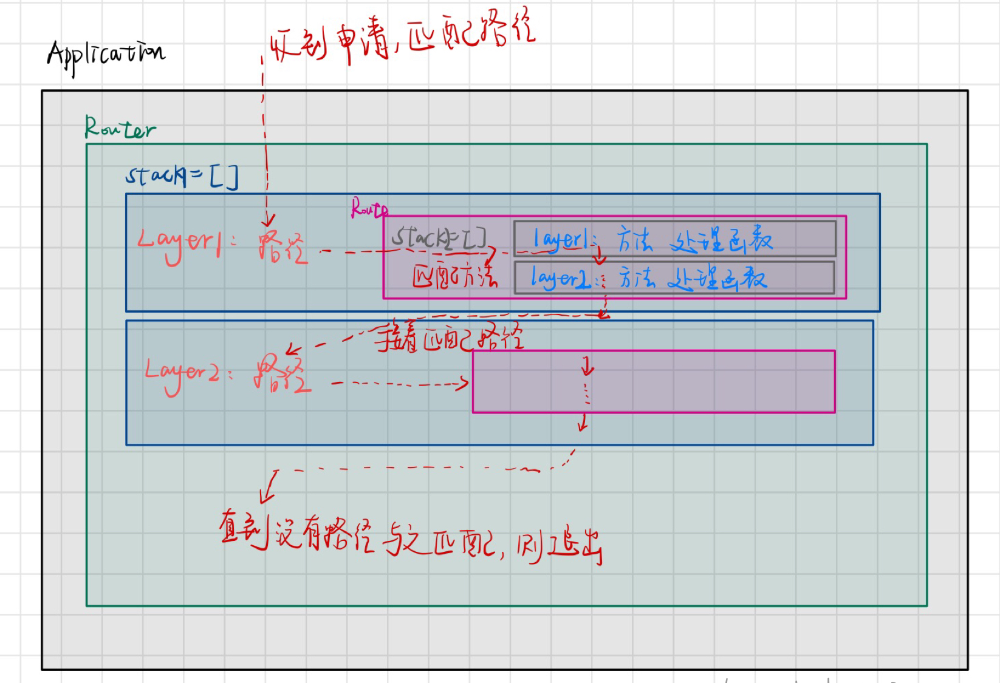
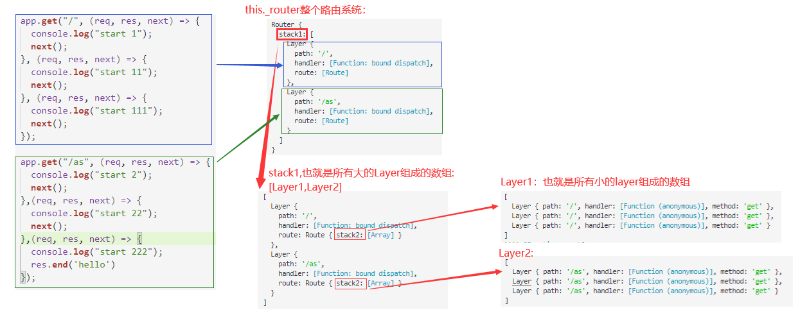

<!-- TOC -->

- [1 express 源码（简化版本）实现：](#1-express-源码简化版本实现)
  - [1.1 集成式的简单实现](#11-集成式的简单实现)
  - [1.2 将创建应用的行为和应用的内容分开](#12-将创建应用的行为和应用的内容分开)
  - [1.3 将路由系统和应用分开呈现](#13-将路由系统和应用分开呈现)
    - [1.3.1 express 的其他操作](#131-express-的其他操作)
    - [1.3.2 分离结果](#132-分离结果)
- [2 源码的理解:](#2-源码的理解)

<!-- /TOC -->

# 1 express 源码（简化版本）实现：

## 1 一个小问题

[忽略node.js服务中favicon.icon的请求](https://www.cnblogs.com/xiaoyucoding/p/7506652.html)

一个最简单的node.js的http服务,在访问目标路径时会发出两条请求

- 第一条是用户输入的地址
- 第二条是加载页面在浏览器收藏夹中的显示图标

第二条信息是不去处理的，应当过滤掉，不干扰处理第一条请求。处理办法如链接所示。

## 2 第二个小问题

nodejs中本身不具备response.send方法，这是express框架封装的，nodejs中存在response.end()方法

## 1.1 集成式的简单实现

例如 server.js 的内容如下：目的是创建服务器监听 3000 端口，一旦用户访问 localhost:3000，则返回 hello

**server.js 的内容：**

```
let express = require("./Lib/express.js");
let app = express();
app.get("/", (req, res) => {
  res.end("hello");
});

app.listen(3000);
```

创建 Lib 文件夹，在其下创建 express.js 模块

考虑存在一个栈（数组）保存访问的路径，方法及响应回调函数，另外，导入的 express 应该是一个函数，该函数执行后会返回一个对象 app。app 内封装了两个方法 get 和 listen：

1. 考虑 get 方法将当前请求的路径、方法及响应回调函数放入栈中
2. listen 方法中创建 http 服务器，并且监听该服务器，当存在请求时，就从栈中寻找是否存在对应的响应路径和方法，从而执行相应的响应函数 handler。

另外，http.createServer的回调在创建http请求的时候不执行，`server.listen`方法会执行先执行其参数列表中的回调函数，表明服务器已经创建好，端口处于监听状态。在前端发出请求时，`server.listen`方法就会调用http.createServer的回调，就从栈中寻找是否存在对应的响应路径和方法，从而执行相应的响应函数 handler。

在这样的思路下可以得到 express.js 模块的内容如下：

```
let http = require("http");
let url = require("url");

// 创造一个路由系统，里面放置所有的路由
var router = [
    // 默认响应，即如果请求的路径不存在响应路由，则按照下面的响应处理
  {
    path: "*",
    method: "*",
    handler(req, res) {
      res.end(`Cannot ${req.url} ${req.method}`);
    },
  },
];

function createApplication() {
  return {
    get(path, handler) {
      router.push({
        path,
        method: "get",
        handler,
      });
    },
    listen() {
      var server = http.createServer(
          (req, res) => {
            let { pathname } = url.parse(req.url);
            // 遍历所有的路由，找到当前请求的路由，执行对应的响应handler函数
            for (let i = 1; i < router.length; i++) {
              let { path, method, handler } = router[i];
              if (pathname == path && method == req.method.toLowerCase()) {
                return handler(req, res);
              }
            }
            // 如果没有找到对应的路由请求，则返回默认的路由响应
            return router[0].handler(req, res);
          }
      );
      // 注意：这里它接收了外部listen函数的参数，在http模块中，它会自动执行参数中的回调，比如listen(3000,function(){})   
      server.listen(...arguments);
    },
  };
}

module.exports = createApplication;
```

路由系统如下：

## 1.2 将创建应用的行为和应用的内容分开

**修改 express.js:定义创建应用的行为**

> - 所以说，创建的app实际上就是一个应用的实例，该实例中保存了一个路由系统，分别处理对应于某个路径和某个方法的请求，保存对应的回调，当请求发生时，遍历所有的路由，找到对应请求的回调，执行即可

```
let Application = require("./application.js");

// 创建应用
function createApplication() {
  return new Application();
}

module.exports = createApplication;
```

**创建 application.js：定义应用的内容**

```
let http = require("http");
let url = require("url");

// 应用的内容
class Application {
  constructor() {
    // 创造一个路由系统，里面放置所有的路由
    this._router = [
      {
        path: "*",
        method: "*",
        handler(req, res) {
          res.end(`Cannot ${req.method} ${req.url} `);
        },
      },
    ];
  }
  // 保存所有的请求路由信息
  get(path, handler) {
    this._router.push({
      path,
      method: "get",
      handler,
    });
  }
  // 创建http请求，并且监听
  listen() {
    var server = http.createServer((req, res) => {
      let { pathname } = url.parse(req.url);
      // 遍历所有的路由，找到当前请求的路由，执行对应的响应handler函数
      for (let i = 1; i < this._router.length; i++) {
        let { path, method, handler } = this._router[i];
        if (pathname == path && method == req.method.toLowerCase()) {
          return handler(req, res);
        }
      }
      // 如果没有找到对应的路由请求，则返回默认的路由响应
      return this._router[0].handler(req, res);
    });
    server.listen(...arguments);
  }
}
module.exports = Application;
```

分析可知上面的应用模块 application.js 中存在一个路由系统，下面就考虑将路由系统和应用分开

## 1.3 将路由系统和应用分开呈现

### 1.3.1 express 的其他操作

利用中间件，express 还存在下面的操作，中间件就是处理 HTTP 请求的函数，即是下面的回调函数，多个中间件之间可以使用 next()方法依次执行，这都是 express 模块定义的

```
app.get('/',function(req,res,next){
  console.log('start 1');
  next();  // 继续执行下一个
}
,function(req,res,next){
  console.log('start 11');
  next();  // 继续执行下一个
}
,function(req,res,next){
  console.log('start 111');
  next();  // 继续执行下一个
})

app.get('/',function(req,res,next){
  console.log('start 2');
  next();  // 继续执行下一个
}
,function(req,res,next){
  console.log('start 22');
})
```

所以 express 的路由系统就变成了下面这样，包含三个类：Router 路由器，Route 路由，Layer 层




### 1.3.2 分离结果

**application.js**

```
let http = require("http");
let url = require("url");
let Router = require("./router/index.js");

// 目的：分离路由系统和应用系统

// 应用的内容
class Application {
  constructor() {
    // 创造一个路由系统，里面放置所有的路由,**所有的**
    this._router = new Router();
  }
  // 保存路由信息
  get(path, ...handlers) {
    // 保存某一个Layer上的路由信息(Route)
    this._router.get(path, handlers);  
  }
  // 创建http请求，并且监听
  listen() {
    var server = http.createServer((req, res) => {
        if(req.url === '/favicon.ico') {
            console.log('ignore');
            // res.end(`不请求图标参数`);
          } 
          else{
              // 如果路由系统里处理不了当前的请求，调用done方法
              function done() {
                res.end(`Cannot ${req.method} ${req.url}`);
              }
              // 遍历所有的路由，找到当前请求的路由，执行对应的响应handler函数
              this._router.handle(req, res, done);
        });
    });
    server.listen(...arguments);
  }
}
module.exports = Application;
```

**index.js:定义路由器 Router 类**

```
const Route = require("./route.js");
const Layer = require("./layer.js");
let url = require("url");

class Router {
  constructor() {
    this.stack1 = [];   // [Layer1,Layer2,...]
  }
  // 调用get方法创造Layer,而且每个Layer上都有个route，
  // 还要将get上的handler传入到route中，route中将handler存起来

  // 创建route和layer的关系
  route(path) {
    let route = new Route();
    // 如果layer的路径匹配到了就交给route去处理
    let layer = new Layer(path, route.dispatch.bind(route));
    layer.route = route; // 把route放到layer上
    this.stack1.push(layer); // 把layer放到数组中
    return route;
  }
  // 保存路由信息
  get(path, handlers) {
    let route = this.route(path);
    // 将handler传递给route自身去处理,保存
    route.get(path,handlers); 
  }

  // 遍历所有的路由，找到当前请求的路由，执行对应的响应handler函数，out参数用于处理匹配不到路径时
  handle(req, res, out) {
    // 请求到来的时候会执行此方法

    let { pathname } = url.parse(req.url);
    let idx = 0;
    let next = () => {
      if (idx >= this.stack1.length) {
        return out();
      }
      let layer = this.stack1[idx++];

      // 判断当前的layer是否匹配到当前的请求路径
      if (layer.match(pathname)) {
        // 如果匹配到了，则去对应的层处理该回调函数
        // next方法是外层的下一层
        layer.handle_request(req, res, next);
      } else {
        next();
      }
    };
    next();
  }
}
module.exports = Router;
```

**route.js**:

```
let Layer = require("./layer.js");

class Route {
  constructor() {
    this.stack2 = [];   //一个Route:[layer11,layer12,layer13,...]
  }

  // 给route中添加层，这个层中需要存放各种方法名和handler
  get(path,handlers) {
    handlers.forEach((handler) => {
      let layer = new Layer(path, handler);
      layer.method = "get";
      this.stack2.push(layer);
    });
  }
  dispatch(req, res, out) {
    let idx = 0;
    console.log(out);
    // 大的Layer
    let next = () => {
      if (idx >= this.stack2.length) {
        return out();
      }
      let layer = this.stack2[idx++];
      // console.log(layer);
      // 如果当前route中的layer的方法匹配到了，执行此route上的handler
      if (layer.method === req.method.toLowerCase()) {
        layer.handle_request(req, res, next);
      } else {
        // 否则执行下一层Layer
        next();
      }
    };
    next();
  }
}

module.exports = Route;
```

**layer.js**

```
class Layer {
  constructor(path, handler) {
    this.path = path;
    this.handler = handler;
  }
  // 做路径匹配的方法，后续会继续扩展
  match(pathname) {
    return this.path === pathname;
  }

  handle_request(req, res, next) {
    // 执行回调
    this.handler(req, res, next);
  }
}
module.exports = Layer;

```

## 1.4 举例分析：



本文参考 b 站：
https://www.bilibili.com/video/BV1o4411T7gv?p=4

