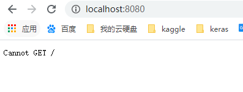
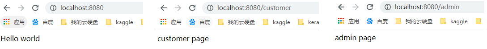
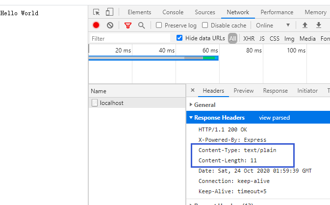
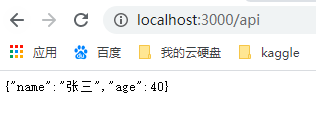
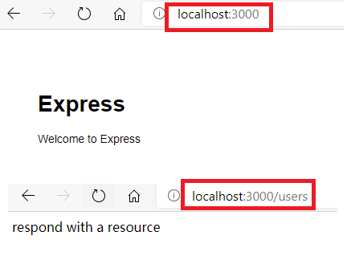

<!-- TOC -->

- [1 express 简介](#1-express-简介)
  - [1.1 hello-world 项目上手](#11-hello-world-项目上手)
    - [1.1.1 加载静态文件](#111-加载静态文件)
    - [1.1.2 加载动态网页](#112-加载动态网页)
  - [1.2 express 运行原理](#12-express-运行原理)
  - [1.3 中间件](#13-中间件)
    - [1.3.1 use 方法](#131-use-方法)
- [2 Express 的方法](#2-express-的方法)
  - [2.1 all,post,get,...](#21-allpostget)
  - [2.2 set 方法](#22-set-方法)
- [3 项目开发实例](#3-项目开发实例)
  - [3.1 编写启动脚本](#31-编写启动脚本)
  - [3.2 配置路由](#32-配置路由)
    - [3.2.1 指定根路径](#321-指定根路径)
    - [3.2.2 指定特定路径](#322-指定特定路径)
  - [3.3 静态网页模板](#33-静态网页模板)
  - [3.4 动态网页模板](#34-动态网页模板)
    - [3.4.1 安装模板引擎](#341-安装模板引擎)
    - [3.4.2 新建脚本数据](#342-新建脚本数据)
    - [3.4.3 新建网页模板](#343-新建网页模板)
    - [3.4.4 渲染模板](#344-渲染模板)
- [4 Express.Router](#4-expressrouter)
- [5 使用 vscode 快速创建 express 项目](#5-使用-vscode-快速创建-express-项目)
  - [5.1 创建方法](#51-创建方法)
  - [5.2 项目介绍](#52-项目介绍)

<!-- /TOC -->

# 1 express 简介

Express 是一个保持最小规模的灵活的 Node.js Web 应用程序开发框架，为 Web 和移动应用程序提供一组强大的功能。

## 1.1 hello-world 项目上手

新建一个 package.json 文件,在 dependences 中加入 express,指定项目的名称、描述、版本等，并且指定需要 4.0 版本以上的 Express。内容如下：

```
{
  "name": "hello-world",
  "description": "hello world test app",
  "version": "0.0.1",
  "private": true,
  "dependencies": {
    "express": "4.x"
  }
}
```

安装依赖包 express:`npm install`

### 1.1.1 加载静态文件

在根目录下新建一个文件`index.js`，作为项目的启动文件：

```
var express = require('express');  //加载express模块
var app = express();   // 创建express应用

app.use(express.static(__dirname + '/public'));
// 相当于 app.use('/',express.static(__dirname + '/public'))  当我们访问根目录的时候就会自动为其访问到public下的index.html文件
// 如果public下有其他的文件，index.css
// 就可以通过localhost:3000/index.css访问到

app.listen(8080);    // 监听
```

分析：

    express.static(root)是express内置的中间件功能，提供静态文件
        root:指定静态文件的根目录
        这个函数通过将req.url和指定的根目录相结合来确定要加载的文件，未找到时则调用next()方法到下一个中间件中寻找
    app.use(path,中间件函数1,...)
        将指定的中间件函数绑定到特定的path路径
        path: 默认路径'/'  当path与所请求的路径base相同时，执行中间件函数
    
    app.use(express.static(__dirname + '/public'));
        如果当前访问的路径是'/'，则执行中间件函数，则路径就变成了'/public'
        可以将use函数是各种请求的一个总称，中间件函数可以看作是对于该path路径的请求的响应操作

然后运行上面的脚本： `node index.js`，现在就可以在浏览器中访问`http://localhost:8080`了，它会在浏览器中打开当前目录的 public 子目录，严格来说会直接加载 public 子目录下的 index.html 文件。但是由于目前我们没有创建 public 文件夹，所以会显示无法请求：


比如我们创建一个 public 文件夹，在其中创建一个 index.html，随便显示一些文本，则可以得到：


比如在 public 下还有一个 img 文件夹，其中有一个图片 01.png,则可以通过`http://localhost:8080/img/01.png`访问

### 1.1.2 加载动态网页

修改 index.js:

    app.get方法用于设置不同的访问路径所对应的回调函数，即就是路由

```
var express = require('express');
var app = express();

// 设置对应于根路径'/'的get方法的路由
app.get('/', function (req, res) {
  res.send('Hello world!');
});
app.listen(3000);
```

一般可以有多个路由，此时就需要将其放入一个单独的文件中，在根目录下新建`routes/index.js`,将其写入到一个路由器函数 router 中，内容如下：

```
// routes/index.js

function router = (app) {
  app.get('/', function (req, res) {
    res.send('Hello world');
  });
  app.get('/customer', function(req, res){
    res.send('customer page');
  });
  app.get('/admin', function(req, res){
    res.send('admin page');
  });
};
module.exports = router;
```

然后在`index.js`中引入该文件：

```
// index.js
var express = require('express');
var app = express();
// 引入路由器函数
var router = require('./routes');
// 产生路由
var routes = router(app);
app.listen(3000);
```



## 1.2 express 运行原理

Express 框架建立在 node.js 内置的 http 模块上。http 模块生成服务器的原始代码如下：

```
var http = require("http");

// 生成一个HTTP服务器实例
var server = http.createServer(function(request, response) {
  // HTTP请求和HTTP回应的request对象和response对象
  response.writeHead(200, {"Content-Type": "text/plain"});
  response.end("Hello world!");
});
// 监听
server.listen(3000, "localhost");
```

实际上使用 express 创建的应用 app(app 只是一个 js 函数，主要目的在于将其作为处理请求的回调传递给 http 服务器)，它在实现监听时调用了 http 的方法产生了一个 http 服务器，实际上实现监听的还是 http 服务器自身

```
app.listen = function(port){
  // 创建http服务器，this就是app
  var server = http.createServer(this);
  server.listen.apply(server,port)
}
```

## 1.3 中间件

**中间件（middleware）就是处理 HTTP 请求的函数**。它最大的特点就是，一个中间件处理完，再传递给下一个中间件。App 实例在运行过程中，会调用一系列的中间件。

每个中间件可以从 App 实例，接收三个参数，依次为 request 对象（代表 HTTP 请求）、response 对象（代表 HTTP 回应），next 回调函数（代表下一个中间件）。每个中间件都可以对 HTTP 请求（request 对象）进行加工，并且决定是否调用 next 方法，将 request 对象再传给下一个中间件。

```
function(request, response,next) {
  // HTTP请求和HTTP回应的request对象和response对象
  response.writeHead(200, {"Content-Type": "text/plain"});
  response.end("Hello world!");
  next();
}
```

next()不带参数则表示传递给下一个中间件，传递参数(next('出错了'))则代表抛出一个错误，参数为错误文本。抛出错误以后，后面的中间件将不再执行，直到发现一个错误处理函数为止。

如果中间件中没有调用 next 方法，则表示这个中间件被调用后，不再执行后面的中间件

### 1.3.1 use 方法

`use(path,middleware,...)`

use 是 express 注册中间件的方法,也就是说设置处理对应路径的 http 请求的方法,修改`index.js`。

```
var express = require("express");
var http = require("http");

var app = express();

app.use("/home", function(request, response, next) {
  response.writeHead(200, { "Content-Type": "text/plain" });
  response.end("Welcome to the homepage!\n");
});

app.use("/about", function(request, response, next) {
  response.writeHead(200, { "Content-Type": "text/plain" });
  response.end("Welcome to the about page!\n");
});

app.use(function(request, response) {
  response.writeHead(404, { "Content-Type": "text/plain" });
  response.end("404 error!\n");
});

http.createServer(app).listen(8080);
```

上面代码使用 app.use 方法，注册了两个中间件。对应/home 路径，加载一个 html 界面，显示 Welcome to the homepage!；对应/about 路径，加载一个 html 界面，显示 Welcome to the aboutpage! 其他路径均显示 404 错误


# 2 Express 的方法

## 2.1 all,post,get,...

针对不同的请求，Express 提供了 use 方法的一些别名：get,post,all 等,HTTP 动词都是 Express 的方法。

```
var express = require("express");
var http = require("http");
var app = express();

app.all("*", function(request, response, next) {
  response.writeHead(200, { "Content-Type": "text/plain" });
  next();
});

app.get("/", function(request, response) {
  response.end("Welcome to the homepage!");
});

app.get("/about", function(request, response) {
  response.end("Welcome to the about page!");
});

app.get("*", function(request, response) {
  response.end("404!");
});

http.createServer(app).listen(1337);
```

all 方法表示，所有请求都必须通过该中间件，参数中的“\*”表示对所有路径有效。get 方法则是只有 GET 动词的 HTTP 请求通过该中间件，它的第一个参数是请求的路径。

请求的路径:除了绝对匹配以外，Express 允许模式匹配。

```
app.get("/hello/:who", function(req, res) {
  res.end("Hello, " + req.params.who + ".");
});
```

上面代码将匹配“/hello/alice”网址，网址中的 alice 将被捕获，作为 req.params.who 属性的值。

## 2.2 set 方法

set 用于执行系统变量的值

```
// 设置views试图指向当前文件夹下的views目录
app.set("views", __dirname + "/views");
// 设置views视图下的文件后缀为jade
app.set("view engine", "jade");
```

# 3 项目开发实例

## 3.1 编写启动脚本

先建立一个项目目录（假定这个目录叫做 demo）。进入该目录，新建一个 package.json 文件，写入项目的配置信息。

```
{
   "name": "demo",
   "description": "My First Express App",
   "version": "0.0.1",
   "dependencies": {
      "express": "3.x"
   }
}
```

在项目目录中，新建文件 app.js。项目的代码就放在这个文件里面。

```
// 1 创建express应用
var express = require('express');  // 加载express模块
var app = express(); // 创建express应用
var path = require("path");  //加载path模块

/*
2 设定express应用的参数
*/
// 设定port变量，意为访问端口
app.set('port', process.env.PORT || 3000);

// 设定views变量，意为视图存放的目录
app.set('views', path.join(__dirname, 'views'));

// 设定view engine变量，意为网页模板引擎
app.set('view engine', 'jade');

app.use(express.favicon());
app.use(express.logger('dev'));
app.use(express.bodyParser());
app.use(express.methodOverride());

// 设定静态文件目录，比如本地文件
// 目录为demo/public/images，访问
// 网址则显示为http://localhost:3000/images
app.use(express.static(path.join(__dirname, 'public')));

// 3 设定监听
app.listen(app.get('port'));
```

此时执行`node app.js`会出现 Cannot get,这是因为我们还没有为指定的地址指定相应的路由

## 3.2 配置路由

路由指的就是用户在访问不同的路径时，指定特定的 http 请求响应方式

### 3.2.1 指定根路径

在 app.js 中：

```
app.get('/',function(req,res){
  res.send("Hello,World!");
})
```

此时，运行该文件，在浏览器中访问 http://localhost:3000，网页就会显示“Hello World”。

如果想要设置响应的头信息，则可以通过：

```
app.get('/', function(req, res){
  var body = 'Hello World';
  res.setHeader('Content-Type', 'text/plain');
  res.setHeader('Content-Length', body.length);
  res.end(body);
});
```

结果：

### 3.2.2 指定特定路径

假定用户访问/api 路径，希望返回一个 JSON 字符串

```
app.get('/api', function(request, response) {
   response.send({name:"张三",age:40});
});
```

重新运行文件，访问`http://localhost:3000/api`就可以显示一个 json 对象



我们可以将 app.get 的回调函数（处理 http 请求，返回 http 响应的中间件）封装成模块。在`routes/api.js`:

```
function index(req, res) {
  res.status(200).json({ name: "张三", age: 40 });
}
```

然后再 app.js 中，需要引入该模块：

```
var api = require("./routes/api");
app.get("/api", api.index);
```

到目前为止，我们已经学习了向浏览器发送简单的文本信息，但是如果需要发送复杂的内容，则需要使用网页模板

## 3.3 静态网页模板

在项目目录之中，建立一个子目录 views，用于存放网页模板。

假定这个项目有三个路径：根路径（/）、自我介绍（/about）和文章（/article）。那么，app.js 可以这样写：

```
var express = require('express');
var app = express();

app.get('/', function (req, res) {
    res.sendFile(__dirname + '/views/index.html');
});

app.get('/about', (req, res) => {
    res.sendFile(__dirname + '/views/about.html');
});

app.get('/article', (req, res) => {
    res.sendFile(__dirname + '/views/article.html');
});

app.listen(3000);
```

上面代码表示，三个路径分别对应 views 目录中的三个模板：index.html、about.html 和 article.html。另外，向服务器发送信息的方法，从 send 变成了 sendfile，后者专门用于发送文件。

## 3.4 动态网页模板

### 3.4.1 安装模板引擎

Express 支持多种模板引擎，这里采用 Handlebars 模板引擎的服务器端版本 hbs 模板引擎。

先安装 hbs：`npm install hbs --save-dev`

上面代码将 hbs 模块，安装在项目目录的子目录 node_modules 之中。save-dev 参数表示，将依赖关系写入 package.json 文件。安装以后的 package.json 文件变成下面这样：

```
{
  "name": "hello-world",
  "description": "hello world test app",
  "version": "0.0.1",
  "private": true,
  "dependencies": {
    "express": "4.x"
  },
  "devDependencies": {
    "hbs": "^4.1.1"
  }
}
```

安装模板引擎之后，就要改写 app.js。

```
// app.js文件

var express = require('express');
var app = express();

// 加载hbs模块
var hbs = require('hbs');

// 指定模板文件的后缀名为html
app.set('view engine', 'html');

// 运行hbs模块
app.engine('html', hbs.__express);

app.get('/', function (req, res){
	res.render('index');
});

app.get('/about', function(req, res) {
	res.render('about');
});

app.get('/article', function(req, res) {
	res.render('article');
});
```

上面代码改用 render 方法，对网页模板进行渲染。render 方法的参数就是模板的文件名，默认放在子目录 views 之中，后缀名已经在前面指定为 html，这里可以省略。所以，res.render(‘index’) 就是指，把子目录 views 下面的 index.html 文件，交给模板引擎 hbs 渲染。

### 3.4.2 新建脚本数据

渲染是指将数据代入模板的过程。实际运用中，数据都是保存在数据库之中的，这里为了简化问题，假定数据保存在一个脚本文件中。

在项目目录中，新建一个文件 blog.js，用于存放数据。blog.js 的写法符合 CommonJS 规范，使得它可以被 require 语句加载。

### 3.4.3 新建网页模板

接着，新建模板文件 index.html。

```
<!-- views/index.html文件 -->

<h1>文章列表</h1>

{{#each entries}}
   <p>
      <a href="/article/{{id}}">{{title}}</a><br/>
      Published: {{published}}
   </p>
{{/each}}
```

模板文件 about.html。

```

<!-- views/about.html文件 -->

<h1>自我介绍</h1>

<p>正文</p>
```

模板文件 article.html。

```
<!-- views/article.html文件 -->

<h1>{{blog.title}}</h1>
Published: {{blog.published}}

<p/>

{{blog.body}}
```

可以看到，上面三个模板文件都只有网页主体。因为网页布局是共享的，所以布局的部分可以单独新建一个文件 layout.html。

```
<!-- views/layout.html文件 -->

<html>

<head>
   <title>{{title}}</title>
</head>

<body>

	{{{body}}}

   <footer>
      <p>
         <a href="/">首页</a> - <a href="/about">自我介绍</a>
      </p>
   </footer>

</body>
</html>
```

### 3.4.4 渲染模板

最后，改写 app.js 文件。

```
// app.js文件

var express = require('express');
var app = express();

var hbs = require('hbs');

// 加载数据模块
var blogEngine = require('./blog');

app.set('view engine', 'html');
app.engine('html', hbs.__express);
app.use(express.bodyParser());

app.get('/', function(req, res) {
   res.render('index',{title:"最近文章", entries:blogEngine.getBlogEntries()});
});

app.get('/about', function(req, res) {
   res.render('about', {title:"自我介绍"});
});

app.get('/article/:id', function(req, res) {
   var entry = blogEngine.getBlogEntry(req.params.id);
   res.render('article',{title:entry.title, blog:entry});
});

app.listen(3000);
```

上面代码中的 render 方法，现在加入了第二个参数，表示模板变量绑定的数据。

现在重启 node 服务器，然后访问http://127.0.0.1:3000。

# 4 Express.Router

从 Express 4.0 开始，路由器功能成了一个单独的组件 Express.Router。它好像小型的 express 应用程序一样，有自己的 use、get、param 和 route 方法。

首先，Express.Router 是一个构造函数，调用后返回一个路由器实例。然后，使用该实例的 HTTP 动词方法，为不同的访问路径，指定回调函数；最后，挂载到某个路径。

```
var router = express.Router();

router.get('/', function(req, res) {
res.send('首页');
});

router.get('/about', function(req, res) {
res.send('关于');
});

app.use('/', router);
```

上面代码先定义了两个访问路径，然后将它们挂载到根目录。如果最后一行改为 app.use(‘/app’, router)，则相当于为/app 和/app/about 这两个路径，指定了回调函数。

这种路由器可以自由挂载的做法，为程序带来了更大的灵活性，既可以定义多个路由器实例，也可以为将同一个路由器实例挂载到多个路径。

# 5 使用 vscode 快速创建 express 项目

## 5.1 创建方法

- 1 在 vscode 中先安装 express 插件
- 2 再安装 express 应用生成器：`npm install -g express-generator`
- 3 产生 express 应用：`express -e app_name`
  - 使用`-e`是因为这样产生的应用下的 views 文件夹下是.ejs 文件
  - `express -j app_name`or`express app_name`在 views 文件夹下会产生`.jade`文件
  - 使用`express --no-view app_name`产生的是 html 界面，在 public 文件夹下
- 4 安装其他的依赖包:`npm install`
  - express 创建项目的时候，对于一些依赖的模块，在 package.json 中的 dependences 中说明了，用命令 npm install 初始化一下，把这些 express 依赖的库装入。
- 5 运行项目：`npm start`,然后在浏览器的 3000 端口查看结果：`http://127.0.0.1:3000/`

## 5.2 项目介绍

比如快速创建了一个应用：app_name

    bin, 存放启动项目的脚本文件,管理的是使用 url 访问项目的端口号，以及url访问出错情况下的一些处理
    node_modules, 存放所有的项目依赖库。
    public，静态文件(css,js,img)
    routes，路由文件(MVC中的C,controller)
    views，页面文件(Ejs模板)
    package.json，项目依赖配置及开发者信息
    app.js，应用核心配置文件

app.js:

```
// 加载会使用到的模块
var createError = require('http-errors');
var express = require('express');
var path = require('path');
var cookieParser = require('cookie-parser');
var logger = require('morgan');

// 加载路由模块
var indexRouter = require('./routes/index');
var usersRouter = require('./routes/users');

// 创建express应用
var app = express();

// view engine setup
app.set('views', path.join(__dirname, 'views')); // 设置views变量指向views文件夹
app.set('view engine', 'ejs'); // 设置views目录下的文件的后缀为ejs

// 加载中间件
app.use(logger('dev'));
app.use(express.json());
app.use(express.urlencoded({ extended: false }));
app.use(cookieParser());
app.use(express.static(path.join(__dirname, 'public')));

// 将路由模块挂载到对应的路径中
app.use('/', indexRouter);
app.use('/users', usersRouter);

// catch 404 and forward to error handler
app.use(function(req, res, next) {
  next(createError(404));
});

// error handler
app.use(function(err, req, res, next) {
  // set locals, only providing error in development
  res.locals.message = err.message;
  res.locals.error = req.app.get('env') === 'development' ? err : {};

  // render the error page
  res.status(err.status || 500);
  res.render('error');
});

module.exports = app;
```

package.json:说明了此项目的基本配置及所依赖的模块

```
{
  "name": "app-name",
  "version": "0.0.0",
  "private": true,
  "scripts": {
    "start": "node ./bin/www"
  },
  "dependencies": {
    "cookie-parser": "~1.4.4",
    "debug": "~2.6.9",
    "ejs": "~2.6.1",
    "express": "~4.16.1",
    "http-errors": "~1.6.3",
    "morgan": "~1.9.1"
  }
}
```

bin/www: 主要是创建 http 服务器，实现监听，并且处理一些监听异常

```
#!/usr/bin/env node

// 加载依赖模块
var app = require('../app');
var debug = require('debug')('app-name:server');
var http = require('http');

// 设定监听端口，默认是3000，可以自己修改
var port = normalizePort(process.env.PORT || '3000');
app.set('port', port);

// 创建http服务器
var server = http.createServer(app);

// 实现监听
server.listen(port);
server.on('error', onError);
server.on('listening', onListening);

/**
 * Normalize a port into a number, string, or false.
 */

function normalizePort(val) {
  var port = parseInt(val, 10);

  if (isNaN(port)) {
    // named pipe
    return val;
  }

  if (port >= 0) {
    // port number
    return port;
  }

  return false;
}

/**
 * Event listener for HTTP server "error" event.
 */

function onError(error) {
  if (error.syscall !== 'listen') {
    throw error;
  }

  var bind = typeof port === 'string'
    ? 'Pipe ' + port
    : 'Port ' + port;

  // handle specific listen errors with friendly messages
  switch (error.code) {
    case 'EACCES':
      console.error(bind + ' requires elevated privileges');
      process.exit(1);
      break;
    case 'EADDRINUSE':
      console.error(bind + ' is already in use');
      process.exit(1);
      break;
    default:
      throw error;
  }
}

/**
 * Event listener for HTTP server "listening" event.
 */

function onListening() {
  var addr = server.address();
  var bind = typeof addr === 'string'
    ? 'pipe ' + addr
    : 'port ' + addr.port;
  debug('Listening on ' + bind);
}
```

routes/index.js 或者 routes/users.js :指定了对应路径的响应页面

运行该项目：npm start,得到在两种路径下的响应页面：


# 中间件

express的理解：

> - express是用来搭建后台路由的web框架(库)
> - 它本身的功能非常简单，需要通过其中间件来扩展其功能

Route路由的理解：

> - 每一个路由就是一个key与value组成的映射关系
> - key是请求方式和path的组合，多个路由之间key不能相同
> - value是callback,用来处理请求，返回响应

Request对象和Response对象

> - Request对象
>   - Request对象是路由回调函数中的第一个参数，代表了用户发给服务器的请求
>   - query包含get请求的所有query参数的对象
>   - params包含get请求的所有param参数的对象
>   - body包含post请求的所有参数的对象
> - Response对象
>   - Response是路由回调函数中的第二个参数，代表和服务器发送给用户的响应信息
>   - res.send(body) 返回响应体
>   - res.json(obj/array) 以json格式返回响应体
>   - res.redirect(path) 重定向到指定路径
>   - render(viewName, dataObj)   渲染模板后返回数据

get请求和post请求传递数据:

> - get请求：
>
>   - query参数：
>
>     - 路由path: /xxx
>     - 请求路径：/xxx?name=tom&age=12
>     - 获取参数数据： const {name,age} = req.query;
>
>   - params参数：
>
>     - 路由path: /xxx/:name/:age
>
>     - 请求路径：/xxx?tom/12
>
>     - 获取参数数据： const {name,age} = req.params;
>
>     - ```
>       // 路由和句柄函数（中间件系统），处理指向/user/:id的GET请求
>       app.get('/user/:id',(req,res,next)=>{
>           console.log('USER');
>       })
>       ```
>
> - post请求的2中格式的文本参数
>
>   - urlencoded格式
>     - 格式： name=tom&age=12
>     - 服务器端使用对应的中间件：`app.use(express.urlencoded({ extended: false }));`
>     - 注意：表单使用此格式，服务器端都会支持此格式
>   - json格式
>     - 格式：{"name":"tom", "age":"12"}
>     - 服务器端使用对应的中间件:`app.use(express.json());`
>     - 有的服务器端可能不支持此格式

中间件：

> - 一种特别的函数:` (req,res,next)=>{}`
>
> - 作用：为express处理请求做特定处理工作，比如：解析post请求参数
>
> - 分类：
>
>   - 内置中间件：
>
>     - `express.static(rootPath, options)`:指定静态资源根路径的中间件
>
>       - `app.use(express.static(path.join(__dirname, "public")));`
>
>       - options配置：
>
>         - ```
>           dotfiles	是否对外输出文件名以点（.）开头的文件。可选值为 “allow”、“deny” 和 “ignore”	String	"ignore"
>           etag	是否启用etag生成	Boolean	true，用于开启强缓存
>           extensions	设置文件扩展名备份选项	Array	[ ]
>           index	发送目录索引文件，设置为 false 禁用目录索引。	mixed	"index.html"
>           lastModified	设置 Last-Modified 头为文件在操作系统上的最后修改日期	Boolean	true,用于开启协商缓存
>           maxAge	毫秒或者其字符串格式设置 Cache-Control 头的 max-age 属性	Number	0
>           redirect	当路径为目录时，重定向至"/"	Boolean	true
>           setHeaders	设置HTTP头以提供文件的函数	Function	
>           ```
>
>         - ```
>           var options = {
>             dotfiles: 'ignore',
>             etag: false,
>             extensions: ['htm', 'html'],
>             index: false,
>             maxAge: '1d',
>             redirect: false,
>             setHeaders: function (res, path, stat) {
>               res.set('x-timestamp', Date.now());
>             }
>           }
>           
>           app.use(express.static('public', options));
>           ```
>
>     - `express.Router()`: 建立一个路由器，然后针对每个路径存在对应的路由器中间件
>
>       - ```
>         var router = express.Router();
>         router.get("/", function (req, res, next) {
>           res.render("index", { title: "Express" });
>         });
>         ```
>
>   - 第三方中间件：
>
>     - body-parser: 解析post请求的中间件
>     - cookie-parser: 解析cookie的中间件
>     - express-session: 解析session的中间件
>
>   - 自定义中间件：
>
>     - `function xxx(req,res,next){}`
>
> - 声明使用中间件：
>
>   - `express.use(path,middleware)`
>   - `app.use(middleware)`   path默认为/,匹配处理任意请求

