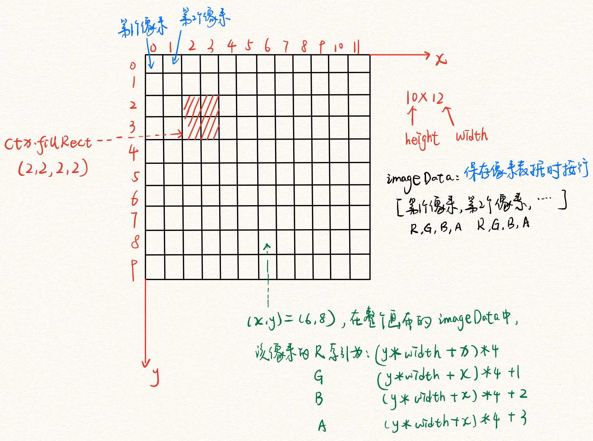
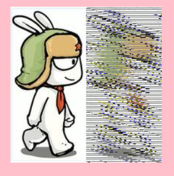

# 1 HTML笔记

## 1.1 font标签
```
<p>我的心愿是<font color='red' size='14'>世界和平</font>哈哈</p>
```

## 1.2 文档声明：`<doctype>`
html5的文档声明：用来告诉浏览器当前网页的版本
```
<!doctype html>
<!doctype HTML>
```

## 1.3 `<meta>`设置网页的元数据
- `<meta name='keywords' content='网上购物，手机，笔记本电脑' charset='utf-8'>`
- name:指定数据的名称，取值：
    - keywords表示网页的关键字，可以指定多个关键字，关键字之间使用逗号隔开
    - description表示网页的描述，一般是一段话
    - http-equiv:将网页重定向到另一个页面
- content:指定数据的内容
    - 作为keywords时，这些内容在网页引擎时作为标题显示
    - 作为discription时，这些内容在网页引擎时作为主体内容显示
    - 作为http-equiv:3秒后跳转到百度界面
        `<meta name='http-equiv' content='3,http://www.baidu.com' charset='utf-8'>`
- 具体可以参见京东页面


## 1.4 html字符实体

- 浏览器会默认将多个空格其解析为一个空格  
- 由于`<>`是标签的符号，如果我们想要显示这些内容也会出现问题  
- 如果我们想要显示特殊符号，则需要转义：&实体的名字;  
- 例如：空格就是`&nbsp;`    大于符号就是`&gt;`   小于符号就是`&lt;`
```
<p>
    今天         天气真不错!
    今天&nbsp;&nbsp;&nbsp;&nbsp;天气真不错
</p>
```

## 1.5 块元素和行内元素:理解标签主要从语义入手
- hgroup标签将一组相关的标题放在一起，为标题分组：`<hgroup> <h1>哒哒</h1> <h2>哈哈</h2> </hgroup>`
- 块元素：在页面中独占一行的元素
    - h1~h6：其中一个页面中一般只有一个h1
    - div
- 行内元素：主要用来包裹文字,span

- 两者的嵌套使用：
	- 一般块元素中可以放置任何元素，但是p元素内不能放置块元素
    - 行内元素内部不能放置块元素
- 如果我们的写法不符合规范，浏览器在解析时一般会自动对网页中的内容进行修正，但是不会在源码中修正，而是在网页运行产生的内存中修正  

## 1.6 列表
- 列表有三类：有序列表，无序列表，自定义列表  
- 一般在使用中，由于列表自己产生的序号在各个浏览器中显示的大小不同，所以一般直接将序号去掉
- **有序列表**：每个列表项前使用.排列
```
<ol>
    <li></li>
    <li></li>
</ol>
```
- **无序列表**：每个列表项前使用1,2,...排列
```
<ul>
    <li></li>
    <li></li>
</ul>
```
- **自定义列表**：dl标签定义创建一个定义列表，dt表示定义的内容，dd表示解释说明内容
```
<dl>
    <dt></dt>
    <dd></dd>
</dl>
```

## 1.7 超链接

`<a href="#" target="_self"></a>`

- href属性：指定超链接指定的网页，可以使用绝对地址或者相对地址
    - `#`：点击后页面不会跳转，而是跳转到当前页面的顶部位置，即回到顶部
    - #目标元素的id名:可以直接跳转到该元素所在的位置

- target属性：指定超链接打开的位置
    -  `_self`:在当前页面中打开
	- `_blank`:在一个新的页面中打开

在开发中，如果我们还没有确定超链接的连接地址，就可以将href属性设置为`#`或者`javascript;`,此时点击超链接将没有任何反应
```
<a href="#"></a>
<a href="javascript;"></a>
```

## 1.8 图片标签``

- src属性规定外部图片的地址  
- alt规定图片的替代文本，在图片无法正常显示时显示该文本内容；搜索引擎会根据alt的内容来识别图片，所以不写alt时搜索引擎不会识别该图片  
- `width`:图片的宽度(单位是像素)
- `height`:图片的高度
    宽度与高度只修改一个，另外一个会等比例放缩
    在pc端，不建议修改图片的大小，需要图片多大就裁多大
    在客户端，经常需要修改图片的大小

#### (1) 图片的格式
- jpeg:支持颜色较丰富，不支持透明效果，不支持动图
    - 一般显示照片
- gif:支持颜色少，支持简单透明，支持动图
    - 适合颜色单一的图片，动图
- png:支持颜色较丰富，支持复杂透明，不支持动图
    - 适合颜色丰富，复杂透明图片
- webp:谷歌推出的专门用于表示网页图片的一种格式，具备其他图片的优点，还比较小
    - 缺点：兼容性差
- base64:将图片使用base64编码，即将图片转为字符引入，这样可以实现图片和网页一起加载的效果，较少用(图片转为base64后：字符比较复杂且长，但是使用了base64编码的图片就不需要单独发送http请求获取了，可以和html页面合并为一次请求)
    - 图片在线转base64:https://tool.chinaz.com/tools/imgtobase

#### (2) 选择原则
- 效果一样，用小的
- 效果不一样，用好的

#### (3) base64编码的好处

```
<div
      style="border: 2px ridge rgb(51, 51, 51); rgb(244, 245, 235); width: 200px; padding-top: 4px;"
    >
      <a href="javascript:alert('Home')" title="Home"
        ></a>
      <a href="javascript:alert('Gift')" title="Gift"
        ></a>
      <a href="javascript:alert('Cart')" title="Cart"
        ></a>
      <a href="javascript:alert('Settings')" title="Settings"
        ></a>
      <a href="javascript:alert('Help')" title="Help"
        ></a>
    </div>
```


直接写的话可以发现5张图片发送了5次http请求

使用base64转码处理第一张和第三张图片：

```
<div
      style="border: 2px ridge rgb(51, 51, 51); rgb(244, 245, 235); width: 200px; padding-top: 4px;"
    >
      <a href="javascript:alert('Home')" title="Home"
        ></a>
      <a href="javascript:alert('Gift')" title="Gift"
        ></a>
      <a href="javascript:alert('Cart')" title="Cart"
        ></a>
      <a href="javascript:alert('Settings')" title="Settings"
        ></a>
      <a href="javascript:alert('Help')" title="Help"
        ></a>
    </div>
```


可以发现使用了base64编码的图片没有发送http请求

#### (4) 图片优化

[《图片优化》](https://blog.csdn.net/imagine_tion/article/details/114554358)

```
1. 图片懒加载，打开页面时只请求展示显示区域内的图片
	js实现：在图片没有进入可视区域时，先不给的src赋值，这样浏览器就不会发送请求了，等到图片进入可视区域再给src赋值
	react实现组件的懒加载：lazy Suspense
2. 渐进式图片：在高画质图像加载完之前会先显示低画质版本。低画质版本由于画质低、压缩率高，尺寸很小，加载很快。在两者之间我们也可以根据需要显示不同画质的版本
3. 使用Webp：同样尺寸的图片，WebP 有损文件比 JPEG 文件小 25% 至 34%，WebP 无损文件比 PNG 文件小 26%，但是WebP 的全球用户支持率大约为 74%
4. 雪碧图 CSS Sprites:对于一些小图片，比如图标等，可以采用雪碧图的方案，将多张比较小的图片，合并到一张大的图片上面，大的图片背景透明，使用的时候，通过把该张图片当做背景图片，通过不同的 background-position 定位来展示的那部分图片
	缺点：后期维护困难，添加一张图片需要重新制作
		应用麻烦，每一张图都需要计算位置，通过调整位置来展示图片，对误差的要求很严格后期维护困难，添加一张图片需要重新制作
5. iconfont：字体图标，不能用来显示复杂图像，通常只限于一种颜色，除非应用一些 CSS 技巧
```

## 1.9 内联框架iframe

`<iframe src="" width='' height='' frameborder='0'></iframe>`

- 向页面中引入其他的页面
    - src属性为其他页面的地址
    - width、height:指定框架的宽度和高度
    - frameborder:指定框架是否具备边框，0没有，1有
- `<iframe src="http://www.baidu.com" width="800px" height="500px" frameborder="0"></iframe>`
很少使用

# 2 HTML5

## 2.1 H5中的小功能

### (1) classList属性

> - H5为每个元素添加了一个属性：`classList`,保存着该元素的所有类名，是一个类数组的结构，ie、opera不是很兼容
> - 另外，该属性还具备一些操作类名的方法，add,remove,contains,toggle等

```
<div id='test' class='a b c d'></div>
<script>
    var div = document.querySelector('#test');
    console.log(div.classList)
</script>

// 结果：DOMTokenList(4) ["a", "b", "c", "d", value: "a b c d"]

div.classList.add('newClass');
//添加类newClass

div.classList.remove('cla1');
//删除类cla1

div.classList.contains('cla1');
//判断是否有这个类

div.classList.toggle('toggle')
//如果没有这个类，就加上，有这个类，就去掉。
```


### (2) 自定义属性编辑

> - 为元素自定义属性,在js中获取结果是undefined
> - 需要使用`data-attr_name`为属性名,然后使用`dom.dataset.attr_name`获取
>   - 注意写入时和获取时的写法：
>   - 例如：写入时：`data-whh-name`,获取时变成小驼峰形式:`dataset.whhName`

```
<div id='test' whh='123' data-whh='456'></div>
<script>
    var div = document.querySelector('#test');
    console.log(div.whh)   // undefined
    div.whh = '456'   // 并不会修改whh的值，因为这个属性压根获取不到
    
    // 获取该属性值
    console.log(div.dataset.whh)  // 456
    div.dataset.whh = 111;    // 修改值
</script>
```

### (3) contenteditable属性

> - `contenteditable`属性：内容是否可以编辑
> - 设置为true后，就可以修改其中的文字

```
<div id='test' contenteditable='true'>我我我我我</div>
<script>
    var div = document.querySelector('#test');
</script>
```


## 2.2 H5和H4的区别

H5优势：

> - 跨平台：唯一一个通吃PC MAC IPhone Android等主流平台的跨平台语言
> - 快速迭代
> - 降低成本
> - 导流入口多
> - 分发效率高

## 2.3 H5语义化标签

在H5出来之前，我们用div来表示页面的头部、章节、页脚、侧边栏等等，但是这些div都没有实际意义。各大浏览器厂商分析了上百万的页面，从而发现div名称的通用ID名称大量重复。例如头部，基本上页面中都会使用一个id名为header的div块表示，所以H5引入了更多的语义化标签：

> - 语义化的好处：
>   - H5让更多语义化结构化的代码代替大量无意义的div标签，提升了网页的质量和意义，对搜多引擎更加友好
>   - 这些标签没有任何的默认样式，只是为了代替div,
>   - 会让文本另起一行

```
hgroup：代表网页或者section的标题，当有多个层级时，该元素可以将h1到h6放到其内
	<hgroup>
		<h1>H5</h1>
		<h2>这是一篇介绍H5语义化标签的文章</h2>
	</hgroup>
	使用注意：
		如果只需要一个h1-h6标签，则不用hgroup
		如果有连续多个h1-h6标签就用hgroup
		如果有连续多个标题和其他文章数据，h1-h6就用hgroup包住，其他文章元数据一起放入header标签

header：表示网页或者section的页眉
	通常包含h1-h6或者hgroup
	<header>
		<hgroup>
			<h1>网站标题</h1>
			<h2>网站副标题</h2>
		</hgroup>
	</header>
	使用注意：
		可以是网页或者section的头部
		没有个数限制
		
nav：表示页面的导航链接区域，主要用于页面的主要导航部分
	<nav>
		<ul>
			<li></li>
			<li></li>
			<li></li>
		</ul>
	</nav>
	使用注意：主要用在页面的主导航，其他部分不合适就不用
		
section：代表文档中的节或者段，段可以是一个页面按照主题的分段，节可以是一个页面里的分组
	<section>
		<h1>section是啥?</h1>
		<article>
			<h2>关于section</h2>
			<p>section的介绍</p>
			<section>
				<h3>关于其他</h3>
				<p>关于其他section的介绍</p>
			</section>
		</article>
	</section>
	使用注意：
		article,nav,aside可以理解为特殊的section
	
footer

article:代表一个在文档、页面或者网站中自成一体的内容
	独立文章：article
	单独模块：section
	没有语义：div

aside:包含在article中作为主要内容的附属信息部分，其中的内容可以是与当前文章有关的相关资料、标签、名词解释等
	最典型的是侧边栏，其中的内容可以是日志串联、其他组的导航
	<article>
		<p>内容</p>
		<aside>
			<h1>作者简介</h1>
			<p>小北，前段一枚</p>
		</aside>
	</article>
```

## 2.4 canvas(画布)

### 1 canvas api

```
1 canvas:
	是html5新增的元素，可用于通过使用js的脚本来绘制图形，创建动画。
	canvas最早由Apple引入Webkit内核中。
	canvas元素具有默认宽度和高度：`width:300px,height:150px`
	
	canvas的渲染极快，不会出现代码覆盖后延迟渲染的问题，写canvas代码时一定要具备同步思想
	canvas中的图形无法通过css选择器选择到，只能通过画笔的api操作
	
	画布默认是透明的
	
	画布的默认原点是画布的左上角(0,0)处，横向往右是x轴正向，竖向朝下是y轴正向，第一列的最后一个像素的坐标是(0,canvas.height-1)，第一行的最后一个像素的坐标是(canvas.width-1,0)
	
2 替换内容：
	canvas很容易定义一些替换内容，特别是IE8-
	<canvas>
	    // 当浏览器不支持该画布时，会显示下面的文字提示
	    // 如果浏览器支持，则会自动忽略文字提示信息
		<span>抱歉，您的浏览器不支持画布，请您更换浏览器查看</span>
	</canvas>
	
3 canvas的两个属性：
	canvas和img元素很像，但是它没有src和alt属性
	它只有两个属性：width和height
	
	画布的宽高：
		html标签中直接使用width height属性设置宽高，只影响画布本身，不影响画布内容
		css属性设置width height,不但会影响画布本身的宽高，还会使得画布中的内容等比例缩放
		
4 渲染上下文
	canvas只是创建了一个固定大小的画布，要想在它上面绘制内容，还需要找到它的渲染上下文(画笔)
	canvas元素有一个getContext()方法，用于获取渲染上下文和它的绘画功能
		getContext()是有一个参数，表示上下文的格式
		// 获取方式
		var canvas = document.getElementById('canvas');
		// 检测是否支持canvas
		if(canvas.getContext){
			var ctx = canvas.getContext('2d');  // 取得画笔
		}		
```

### 2 上下文api(画笔api)

#### 2.1 绘制矩形

```
HTML中的元素canvas只支持一种原生的图形绘制：矩形，其余图形均需要至少生成一条路径

1 绘制矩形
	canvas提供了三种方法：
		fillRect(x,y,width,height) 绘制一个填充的矩形，默认填充黑色
		strokeRect(x,y,width,height) 绘制一个矩形的边框，默认边框1像素实心黑色
		clearRect(x,y,width,height) 清除指定矩形区域，让清除部分完全透明,
			这个方法实际没有清除，只是在原图形上放置了一个和背景颜色相同的矩形将原图形盖住
		x,y指定了canvas画布上所绘制的矩形的左上角的坐标(相对于原点)
		width height指定矩形的尺寸 包含边框
		
2 strokeRect时 边框像素渲染问题
	按理渲染出的边框应该是1px的
	canvas在渲染矩形边框时，边框宽度是平均分在偏移位置的两侧，但是由于css不支持小数点，所以导致边框会占据两个像素
    context.strokeRect(10,10,50,50)
        边框会渲染在10.5 和 9.5之间,浏览器是不会让一个像素只用自己的一半的，所以边框会渲染到从左边数第9个像素和第10个像素
        所以为了实现一个像素的边框，使用小数确定x和y
    context.strokeRect(10.5,10.5,50,50)
        边框会渲染在从左边数第11个像素
        
3.添加样式和颜色
    fillStyle :设置图形的填充颜色。
    	ctx.fillStyle = 'green';  //给画笔填充颜色，需要在画图形之前设置
    strokeStyle :设置图形轮廓的颜色。
    	ctx.strokeStyle = '#bfa'  //给画笔设置画轮廓时的颜色，需要在画图形之前设置
    默认情况下，线条和填充颜色都是黑色(CSS 颜色值 #000000)
    
    lineWidth : 这个属性设置当前绘线的粗细。属性值必须为正数。
    	描述线段宽度的数字。 0、 负数、 Infinity 和 NaN 会被忽略。
    	默认值是1.0。
    	并且设置的值，在画轮廓时，往上延伸一半宽度，往下延伸一半宽度
    	
    lineJoin: 设置矩形拐角处的样式
    	round:圆角
    	bevel:斜角
    	miter:直角(默认)
```

举例：

```
<script>
    window.onload = () => {
        var canvas = document.querySelector('#canvas');
        if(canvas.getContext){
            var ctx = canvas.getContext('2d');
            ctx.fillStyle = 'green';  //给画笔填充颜色，需要在画图形之前设置
            ctx.strokeStyle = '#bfa';
            ctx.lineJoin = 'round';
            ctx.lineWidth = 25;
            ctx.fillRect(0,0,100,100);
            ctx.strokeRect(100,100,100,100);

        }
    }
</script>
```


#### 2.2 canvas绘制路径

```
canvas的基本元素就是路径。路径是通过不同颜色和宽度的线段或者曲线相连形成的不同形状的点的集合。

步骤：
	1 创建路径起始点
	2 使用画布命令画出路径
	3 封闭路径
	4 一旦路径生成，则可通过描边或者填充路径区域渲染图形

绘制三角形：
	beginPath()
		新建一条路径，生成之后，图形绘制命令被指向到路径上准备生成路径
		行到这个函数时，context中止当前的路径，立刻把当前的坐标设置为起点(0,0)，开始一条新的路径。
	moveTo(x,y)
		将笔触移动到指定的坐标(x,y)处
	lineTo(x,y)
		绘制一条从当前位置到(x,y)的直线
	closePath()
		闭合路径之后，图形绘制命令又重新指向到上下文中
		这个步骤不是必须的，这个方法会绘制一条从当前点到开始点的直线来实现图形的闭合
		如果图形已经闭合，则啥都不做
	以上三个方法在调用后都不会画出图形，调用stroke后才会绘制线条  closePath必须放在stroke之前	
	stroke()
		通过线条来绘制图形轮廓，不会自动闭合
		不会自动调用closePath()
	
	fill()
		通过填充路径的内容区域生成实心的图形，会自动闭合
		会自动调用closePath()
```

举例：

> - ctx的moveTo、lineTo都会形成对应的路径存入一个路径管理器，然后使用stroke等将路径连接起来，这会对路径管理器中的所有路径起作用
> - 如果要绘制一个新的图形，不希望影响之前的图形，则需要使用beginPath清空路径容器
>   - beginPath的重要性：https://developers.weixin.qq.com/community/develop/article/doc/00026c4d25cf107c8d78d70eb51013

```
<script>
    window.onload = () => {
        var canvas = document.querySelector('#canvas');
        if(canvas.getContext){
            var ctx = canvas.getContext('2d');
            ctx.fillStyle = 'green';
            ctx.moveTo(50,50);
            ctx.lineTo(50,100);
            ctx.lineTo(100,100);
            ctx.closePath();
            ctx.stroke();

            // 清空路径容器，这样新图形的操作不会影响之前的图形
            ctx.beginPath();
            ctx.moveTo(200,200);
            ctx.lineTo(200,300);
            ctx.lineTo(300,300);
            ctx.closePath();
            ctx.fill();
        }
    }
</script>

一开始，样式容器中放入了ctx.fillStyle = 'green';
然后：路径容器中放入了：
	ctx.moveTo(50,50);
    ctx.lineTo(50,100);
    ctx.lineTo(100,100);
    ctx.closePath();
stroke()绘制该路径容器中的所有图形，绘制一个黑色边框的三角形

紧接着：ctx.beginPath(); 清空路径容器，然后放入了：
	ctx.moveTo(200,200);
    ctx.lineTo(200,300);
    ctx.lineTo(300,300);
    ctx.closePath();
ctx.fill();绘制该容器中的所有图形，使用样式容器中设置的fill样式

如果没有ctx.beginPath();，则第二次绘制时会绘制两个图形，一个黑色填充的三角形，一个绿色填充的三角形。因为容器中放入了两个图形的绘制方案
```


```
绘制矩形
	rect(x,y,width,height)
	 绘制一个左上角坐标为(x,y),宽高为width height的矩形
	 该方法执行时，moveTo()方法自动绘制坐标参数(0,0)
	 
<script>
    window.onload = () => {
        var canvas = document.querySelector('#canvas');
        if(canvas.getContext){
            var ctx = canvas.getContext('2d');
            ctx.fillStyle = 'green';

            ctx.rect(0,0,100,100);
            ctx.fill()
        }
    }
</script>
```


```
lineCap
	是canvas 2D API中指定如何绘制每一条线段末端的属性
	可选值：
		butt:末端以方形结束，默认值
		round:末端以圆形结束，在两边分别加了一个半圆，半径是线段宽度的一半
		square:末端以方形结束，但是是在原线段的基础上在两边分别添加了一个宽度和线段相同，高度是线段厚度一半的矩形区域
		
<script>
    window.onload = () => {
        var canvas = document.querySelector('#canvas');
        if(canvas.getContext){
            var ctx = canvas.getContext('2d');
            ctx.strokeStyle = 'green';
            ctx.lineWidth = 10;
            ctx.moveTo(100,100);
            ctx.lineTo(100,200);  
            ctx.stroke();  

            ctx.lineCap = 'round';
            ctx.beginPath();
            ctx.moveTo(200,100);
            ctx.lineTo(200,200);  
            ctx.stroke(); 

            ctx.lineCap = 'square';
            ctx.beginPath();
            ctx.moveTo(250,100);
            ctx.lineTo(250,200);  
            ctx.stroke();
        }
    }
</script>
```


#### 样式容器 路径容器  样式栈

```
save:
	将当前状态放入绘图状态栈中，保存canvas全部状态的方法
	保存到绘图状态栈中的状态包括：
		当前的变换矩阵
		当前的剪切区域
		当前的虚线列表
		以下属性当前的值：strokeStyle,fillStyle,lineWidth,lineCap,lineJoin
		
restore
	在绘图状态栈中弹出顶端的状态，将canvas恢复到最近的状态
	如果栈中没有保存方法，则此方法不做任何改变
	
save和restore应该成对出现，这样前一个图形定制的样式在下一个图形勾勒之前就可以被全部出栈处理掉，不会影响到下一个图形的样式

路径容器：
	每次调用路径api(moveTo,lineTo,rect等)都会在路径容器中做登记
	调用beginPath():清空整个路径容器
样式容器：是栈，但是对于相同的属性，新的值会覆盖旧的值
	每次调用样式api(strokeStyle,fillStyle,lineWidth,lineCap,lineJoin等)都会在样式容器中做登记，图像最终渲染的样式依赖于样式容器
	调用save():将样式容器中的样式压入样式栈
样式栈：
	调用restore():将样式栈中的样式弹出更新样式容器中的样式
	
	
<script>
    window.onload = () => {
        var canvas = document.querySelector('#canvas');
        if(canvas.getContext){
            var ctx = canvas.getContext('2d');
            
            // 4个save 4个restore
            ctx.save();  //保存前一个图形的样式
            // 定制新图形的样式
            ctx.fillStyle = '#bfa';   // 将ctx.fillStyle = '#bfa'加入样式容器
            ctx.save();  // 将ctx.fillStyle = '#bfa'从样式容器中弹出，放入样式栈
            ctx.fillStyle = 'blue'; // 将ctx.fillStyle = 'blue'加入样式容器
            ctx.save(); // 将ctx.fillStyle = 'blue'从样式容器中弹出，放入样式栈
            ctx.fillStyle = 'purple'; // 将ctx.fillStyle = 'purple'加入样式容器
            ctx.save();  // 将ctx.fillStyle = 'purple'从样式容器中弹出，放入样式栈
            // 画图
            ctx.beginPath();   // 清空路径容器
            
            ctx.restore();   // 将'purple'从样式栈中弹出，更新样式容器
            ctx.restore();   // 将'blue'从样式栈中弹出，更新样式容器，覆盖purple
            ctx.restore();   // 将'#bfa'从样式栈中弹出，更新样式容器，覆盖blue
            ctx.restore();   // 将默认颜色black从样式栈中弹出，更新样式容器
            ctx.fillRect(100,100,100,100);
        }
    }
</script>
```


#### 2.3 手写签名例子

1. 原理：在鼠标按下时将画笔移动到鼠标所在的位置，当鼠标移动时就开始划线，移动的起始点就是鼠标按下时的位置到鼠标移动的位置
2. 注意：一般在画新的图之前，使用ctx.save()将容器样式中的样式压入样式栈，然后再设置新的样式放入容器样式中，清空路径容器，添加路径，绘制图形。然后将该样式从样式栈中弹出。
3. 但是在这个例子中，绘制的时候的样式都是相同的，所以不需要压入样式栈，再弹出了


```
<!DOCTYPE html>
<html lang="en">
<head>
    <meta charset="UTF-8">
    <meta http-equiv="X-UA-Compatible" content="IE=edge">
    <meta name="viewport" content="width=device-width, initial-scale=1.0">
    <title>Document</title>
    <style>
        #canvas {
            background-color: pink;
            position: absolute;
            top:0;
            left:0;
            right: 0;
            bottom: 0;
            margin: auto;
        }
    </style>
</head>
<body>
    <canvas id='canvas' width='300px' height="300px">
		<span>抱歉，您的浏览器不支持画布，请您更换浏览器查看</span>
	</canvas>
    <script>
        window.onload = () => {
            var canvas = document.querySelector('#canvas');
            if(canvas.getContext){
                var ctx = canvas.getContext('2d');
            }
            canvas.onmousedown = (e) => {
                e = e || window.event;
                if(canvas.setCapture){
                    canvas.setCapture();
                }
                // 先将画笔移动到当前鼠标光标所在的位置
                ctx.save();
                ctx.strokeStyle = 'green';
                ctx.beginPath();
                ctx.moveTo(e.clientX-canvas.offsetLeft,e.clientY-canvas.offsetTop);

                document.onmousemove = (e) => {
                    e = e || window.event;
                    // 移动光标，则修改画笔的位置
                    ctx.lineTo(e.clientX-canvas.offsetLeft,e.clientY-canvas.offsetTop);
                    ctx.stroke();
                }

                document.onmouseup = () => {
                    document.onmousemove = null;
                    if(document.releaseCapture){
                        document.releaseCapture();
                    }
                }
                return false;
                
            }
        }
    </script>
</body>
</html>
```

#### 2.4 canvas曲线

```
圆：
	角度与弧度的js表达式：radians=(Math.PI/180)*degrees
canvas绘制圆形：
	arc(x,y,radius,startAngle,endAngle,anticlockwise)
		画一个以(x,y)为圆心，radius为半径的圆弧(圆)，从startAngle(弧度)开始到endAngle结束
		按照anticlockwise给定的方向来生成(默认顺时针)
			true:顺时针
			false:逆时针
	arcTo(x1,y1,x2,y2,radius)
    	给定控制点和半径画一段圆弧
    	x1,y1,x2,y2控制圆弧的走向
```

举例：

```
<script>
    window.onload = () => {
        var canvas = document.querySelector('#canvas');
        if(canvas.getContext){
            var ctx = canvas.getContext('2d');
        }
        ctx.beginPath();
        ctx.moveTo(100,100)
        ctx.arc(100,100,50,0*(Math.PI/180),90*(Math.PI/180))
        ctx.closePath()
        ctx.stroke()
    }
</script>
```


```
<script>
    window.onload = () => {
        var canvas = document.querySelector('#canvas');
        if(canvas.getContext){
            var ctx = canvas.getContext('2d');
        }
        ctx.beginPath();
        ctx.moveTo(50,50)
        ctx.lineTo(300,0)
        ctx.lineTo(200,200)
        ctx.stroke()

        ctx.strokeStyle='green'
        ctx.beginPath();
        ctx.moveTo(50,50)
        ctx.arcTo(300,0,200,200,50)
        ctx.stroke()
    }
</script>
```


```
二次贝塞尔
	quadraticCurveTo(cp1x,cp1y,x,y)
		cp1x,cp1y是一个控制点，x,y是结束点
		曲线肯定经过x,y和起始点
三次贝塞尔
	bezierCurveTo(cp1x,xp2y,cp2x,xp2y,x,y)
		cp1x,cp1y，cp2x,xp2y是两个控制点，x,y是结束点
		曲线肯定经过x,y和起始点
		
起始点为moveTo指定的点
```

举例：

```
<script>
  window.onload = function () {
    var canvas = document.getElementById("test");
    if (canvas.getContext) {
      var ctx = canvas.getContext("2d");

      ctx.beginPath();
      ctx.moveTo(50, 50);
      ctx.lineTo(300, 0);
      ctx.lineTo(200, 200);
      ctx.stroke();

      ctx.strokeStyle = "green";
      ctx.beginPath();
      ctx.moveTo(50, 50);
      ctx.quadraticCurveTo(300, 0, 200, 200);
      ctx.stroke();
    }
  };
</script>
```


```
<script>
  window.onload = function () {
    var canvas = document.getElementById("test");
    if (canvas.getContext) {
      var ctx = canvas.getContext("2d");

      ctx.beginPath();
      ctx.moveTo(50, 50);
      ctx.lineTo(300, 0);
      ctx.lineTo(200, 200);
      ctx.lineTo(300, 300);

      ctx.stroke();

      ctx.strokeStyle = "green";
      ctx.beginPath();
      ctx.moveTo(50, 50);
      ctx.bezierCurveTo(300, 0, 200, 200, 300, 300);
      ctx.stroke();
    }
  };
</script>
```


#### 2.5 canvas变换

```
translate(x,y)
	移动canvas的原点到一个不同的位置
	**在canvas中translate是累加的**，均是相对于第一次旋转前图形的角度

rotate(angle)
	angle表示旋转的角度，顺指针方向，从y轴(上)顺时针旋转
	旋转的中心是canvas的原点
	**在canvas中rotate是累加的**，均是相对于第一次旋转前图形的角度
	
scale(x,y)
	缩放图形
	x,y分别是横轴和纵轴的缩放因子，它们都必须是正值
	值<1.0表示缩小，大于1.0表示放大
	在canvas中scale是累加的
	放大和缩小：画布的实际占据页面的尺寸没有变化，相对于整个页面而言，画布默认还是300px*150px，对应于整个屏幕占据的物理大小也不会发生变化
	如果执行放大操作：
		放大的是css像素的面积，也就是该画布内一个css像素所占据的物理大小，可能放大之前一个css像素占据屏幕的物理面积是1cm*1cm,放大之后占据屏幕的物理面积可能会变成1.2cm*1.2cm,从而该尺寸的css像素就少了
	缩小：
		缩小css像素的面积，画布内的css像素个数增多

<script>
  window.onload = function () {
    var canvas = document.getElementById("test");
    if (canvas.getContext) {
      var ctx = canvas.getContext("2d");
      ctx.translate(50, 50);
      ctx.translate(50, 50); //累加操作，原点移动到100px,100px处
      ctx.rotate((45 * Math.PI) / 180);
      ctx.rotate((45 * Math.PI) / 180); //累加操作，顺时针旋转90度
      ctx.scale(0.8, 0.8); // 先缩小为80*80
      ctx.scale(0.5, 0.5); // 先缩小为40*40
      ctx.beginPath();
      ctx.fillRect(0, 0, 100, 100);
      ctx.stroke();

      ctx.beginPath();
    }
  };
</script>
```


##### 1 变换实例

原理：

1. 先画一个矩形
2. 开启一个定时器，每16.6ms就清空一次画布，画一个新的图形。新的图形的参数需要注意：
   1. 标志位flag负责控制每次旋转的角度，**（每次旋转的角度都是相对于前一次旋转后图形的角度而言的）**
   2. 设置缩放参数：缩放的范围设置为[0.02,2]，由于缩放不会叠加，所以需要手动叠加，并且**缩放都是相对于前一次缩放的结果**，还需要判断如果达到了放大或者缩小的最大程度，则需要修改增量正负。如果到了最大放大程度，则需要将增量修改为负；相反则将增量修改为正。


```
<!DOCTYPE html>
<html lang="en">
  <head>
    <meta charset="UTF-8" />
    <meta
      name="viewport"
      content="width=device-width,initial-scale=1.0, minimum-scale=1.0, maximum-scale=1.0, user-scalable=no"
    />
    <title>Document</title>
    <style>
      html,
      body {
        height: 100%;
        overflow: hidden;
      }
      #test {
        background-color: pink;
        position: absolute;
        top: 0;
        bottom: 0;
        left: 0;
        right: 0;
        margin: 100px auto;
      }
    </style>
    <script>
      window.onload = function () {
        var flag = 0; //设置每次旋转的角度
        var scale = 0; // 设置每次缩放的倍数
        var flag_scale = 0;
        var canvas = document.getElementById("test");
        if (canvas.getContext) {
          var ctx = canvas.getContext("2d");

          ctx.save();
          ctx.translate(150, 150); // 设置缩放原点 150 150

          ctx.beginPath();
          ctx.fillRect(-50, -50, 100, 100); // 画矩形，位于100px 100px处
          ctx.restore(); // 将本次画图的状态栈清空，一次save对应一次restore

          setInterval(function () {
            // 清除画布,准备画下一图形
            ctx.clearRect(0, 0, canvas.width, canvas.height);

            ctx.save();
            // 开始画下一个图形
            ctx.translate(150, 150); // 设置缩放原点 150 150
            flag++;
            ctx.rotate((flag * Math.PI) / 180); // 设置旋转角度，一秒钟旋转60次

            // 设置每一次缩放的倍数，先增大再减小 scale范围：1~100
            if (scale >= 2) {
              //达到放大的最大状态，则开始缩小,设置每次的缩小倍数
              flag_scale = -0.02;
            } else if (scale <= 0) {
              //达到缩小的最大状态，则开始放大,设置每次的放大倍数
              flag_scale = 0.02;
            }
            scale += flag_scale; // 累加缩小倍数，scale不会自动累加
            ctx.scale(scale, scale); // scale范围：0.02~2
            
            ctx.beginPath();
            ctx.fillRect(-50, -50, 100, 100);
            ctx.restore(); // 一个save对应一个restore
          }, 1000 / 60);
        }
      };
    </script>
  </head>
  <body>
    <canvas id="test" width="300px" height="300px">
      <span>抱歉，当前浏览器不支持展示画布内容，请更换浏览器查看</span>
    </canvas>
  </body>
</html>
```

##### 2 表盘


```
<!DOCTYPE html>
<html lang="en">
<head>
    <meta charset="UTF-8">
    <meta http-equiv="X-UA-Compatible" content="IE=edge">
    <meta name="viewport" content="width=device-width, initial-scale=1.0">
    <title>Document</title>
    <style>
        * {
            margin: 0;
            padding: 0;
        }
        html,body {
            height: 100%;
            overflow: hidden;
            background-color: pink;
        }
        #canvas {
            background-color: gray;
            position: absolute;
            top:0;
            left:0;
            right: 0;
            bottom: 0;
            margin: auto;
        }
    </style>
</head>
<body>
    <canvas id='canvas' width='400px' height="400px">
		<span>抱歉，您的浏览器不支持画布，请您更换浏览器查看</span>
	</canvas>
    <script>
        window.onload = () => {
            var canvas = document.querySelector('#canvas');
            if(canvas.getContext){
                var ctx = canvas.getContext('2d');
                setInterval(function(){
                    ctx.clearRect(0,0,canvas.width,canvas.height)
                    move();
                },1000/60);
            }

            function move(){
                ctx.save();
                // 设置样式
                ctx.translate(200,200);  //修改原点
                ctx.rotate(-90*Math.PI/180)   // 修改坐标轴，上y右x
                ctx.strokeStyle = 'black';
                ctx.lineWidth = 8;
                ctx.lineCap = 'round';
                ctx.beginPath();
                // 设置路径

                // 画外层空心圆盘
                ctx.save();
                ctx.strokeStyle = '#325FA2';
                ctx.lineWidth = 14;
                ctx.beginPath();
                ctx.arc(0,0,140,0,360*Math.PI/180);
                ctx.stroke();  
                ctx.restore();

                // 画时针刻度
                ctx.save();
                ctx.beginPath();
                for(let i=0;i<12;i++){
                    ctx.rotate(30*Math.PI/180)   // 累加
                    ctx.beginPath();
                    ctx.moveTo(100,0);
                    ctx.lineTo(120,0)
                    ctx.stroke(); 
                } 
                ctx.restore();
                
                // 画分针刻度
                ctx.save();
                ctx.lineWidth = 4;
                ctx.beginPath();
                for(let i=0;i<60;i++){
                    ctx.rotate(6*Math.PI/180)   // 累加
                    if((i+1)%5!==0){   // 去除在时针处的小分针
                        ctx.beginPath();
                        ctx.moveTo(117,0);
                        ctx.lineTo(120,0)
                        ctx.stroke();
                    } 
                } 
                ctx.restore();

                // 画时针 分针 秒针 表座
                var date = new Date();
                var s = date.getSeconds();   // 秒 0-59
                var m = date.getMinutes()+s/60;  // 0-59
                var h = date.getHours()+m/60; 
                h = h>=12 ? h-12: h; // 0-11

                // 画时针
                ctx.save();
                ctx.lineWidth = 14;
                ctx.rotate(h*30*Math.PI/180);
                ctx.beginPath()
                ctx.moveTo(-20,0);
                ctx.lineTo(80,0)
                ctx.stroke()
                ctx.restore()

                // 画分针
                ctx.save();
                ctx.lineWidth = 10;
                ctx.rotate(m*6*Math.PI/180);
                ctx.beginPath()
                ctx.moveTo(-28,0);
                ctx.lineTo(112,0)
                ctx.stroke()
                ctx.restore()

                // 画秒针
                ctx.save();
                ctx.strokeStyle='#D40000'
                ctx.fillStyle='#D40000'
                ctx.lineWidth = 6;
                ctx.rotate(s*6*Math.PI/180);
                // 秒针
                ctx.beginPath()
                ctx.moveTo(-30,0);
                ctx.lineTo(83,0)
                ctx.stroke()
                // 表触,中间的实心小圆点
                ctx.beginPath()
                ctx.arc(0,0,10,0,360*Math.PI/180);
                ctx.fill()
                // 秒头
                ctx.beginPath()
                ctx.arc(96,0,10,0,360*Math.PI/180);
                ctx.stroke()
                ctx.restore()


                ctx.restore();
            }
        }
    </script>
</body>
</html>
```

#### 2.6 canvas使用图片

```
在canvas中插入图片，需要使用window属性Image创建image对象
	1 操作图片时，需要等图片完全加载完才可以操作
	2 drawImage(image,x,y,width,height)
		其中image是image或者canvas对象，x,y是该对象在目标canvas中的起始坐标
		width height控制当前canvas画入时应该缩放的大小
	3 createPattern(img图像源,repeate)
		repeate参数：
            "repeat" (both directions),
            "repeat-x" (horizontal only),
            "repeat-y" (vertical only), 
            "no-repeat" (neither).
        一般情况下可以将createPattern返回的对象作为fillStyle的值
```

例子：

```
<script>
    window.onload = () => {
        var canvas = document.querySelector('#canvas');
        if(canvas.getContext){
            var ctx = canvas.getContext('2d');

            var image = new Image();
            image.src = '1.jpg'
            image.onload = function(){
                var pattern = ctx.createPattern(image,'no-repeat');
                ctx.fillStyle=pattern;
                ctx.fillRect(0,0,400,400);
            }
        }
    }
</script>
```


#### 2.7 canvas使用渐变

```
线性渐变
	gradient = createLinearGradient(x1,y1,x2,y2)
		x1,y1表示渐变的起点
		x2,y2表示渐变的终点
		这两个坐标点控制渐变的方向，以及渐变分布的区域
		一般将gradient赋值给fillStyle

径向渐变：
	createRadialGradient(x1,y1,r1,x2,y2,r2)
		前三个参数定义一个以(x1,y1)为原点，以r1为半径的圆
		后三个参数定义一个以(x2,y2)为原点，以r2为半径的圆
		
gradient.addColorStop(position,color)
    position:0.0-1.0之间的数值，表示渐变中颜色所在的相对位置
    color:一个有效的css颜色值
```

举例：线性渐变

```
<script>
    window.onload = () => {
        var canvas = document.querySelector('#canvas');
        if(canvas.getContext){
            var ctx = canvas.getContext('2d');

            var image = new Image();
            image.src = '1.jpg'
            image.onload = function(){
                var gradient = ctx.createLinearGradient(0,0,300,300);
                // 0表示渐变的开始位置
                gradient.addColorStop(0,'red')
                // 0.5表示渐变区域的中间位置150
                gradient.addColorStop(0.5,'yellow')
                // 1表示渐变区域的结束位置300处，剩余300-400使用green填充
                gradient.addColorStop(1,'green')
                ctx.fillStyle=gradient;
                ctx.fillRect(0,0,400,400);
            }
        }
    }
</script>
```


径向渐变举例：


```
<script>
    window.onload = () => {
        var canvas = document.querySelector('#canvas');
        if(canvas.getContext){
            var ctx = canvas.getContext('2d');

            var image = new Image();
            image.src = '1.jpg'
            image.onload = function(){
                var gradient = ctx.createRadialGradient(150,150,50,150,150,100);
                // 总的渐变区域是从50~100处
                gradient.addColorStop(0,'red')  // 内部小圆是红色的，不属于渐变区域
                // 0.5表示渐变区域的中间位置75处是黄色，50-75的环形区域属于红到黄的渐变区域
                gradient.addColorStop(0.5,'yellow') 
                // 1表示渐变区域的结束位置100处是绿色，75-100的环形区域属于黄到绿的渐变区域
                gradient.addColorStop(1,'green')
                ctx.fillStyle=gradient;
                ctx.fillRect(0,0,400,400);  // 大圆之外的地方使用green填充


                // 内部小圆
                ctx.save();
                ctx.beginPath();
                ctx.arc(150,150,50,0,360*(Math.PI/180))
                ctx.stroke();
                ctx.restore();

                // 中间的圆
                ctx.save();
                ctx.beginPath();
                ctx.arc(150,150,75,0,360*(Math.PI/180))
                ctx.stroke();
                ctx.restore();

                // 外部的大圆
                ctx.save();
                ctx.beginPath();
                ctx.arc(150,150,100,0,360*(Math.PI/180))
                ctx.stroke();
                ctx.restore();
            }


        }
    }
</script>
```

##### 1 飞鸟实例

实现下面的小人循环从左边走到最右边：

原理：每隔1000/5ms就开启一个延时器，用flag标识图片的序号，每一次序号都+1，并且用value表示图片将要被放置的x轴的值，步长是10。每次在画新的图片之前都要清除掉画布上的内容，保证同时只出现一个图片。


```
实现的原理：有4张图片，分别是小人走路的姿势，每次通过切换图片及图片的位置构造出一种小人在走路的动图

<script>
    window.onload = () => {
        var canvas = document.querySelector('#canvas');
        canvas.width = document.documentElement.clientWidth;
            canvas.height = document.documentElement.clientHeight;
        if(canvas.getContext){
            var ctx = canvas.getContext('2d');
            var flag = 0;   // 保存当前显示的图片的编号
            var value = 0;  // 保存当前图片显示的x轴坐标值，从0增加到指定宽度再调为0
            setInterval(function(){
                value+=10;
                if(value>=canvas.width){
                    value=0;
                }
                flag++;
                if(flag == 5){
                    flag = 1;
                }
                var img = new Image();
                img.src = flag+'.png';
                // 图片加载后的回调
                img.onload = function(){
                    // 在每次画新的图形之前先清理掉前一个图形
                    ctx.clearRect(0,0,canvas.width,canvas.height);
                    draw(this,value);
                }
            },1000/5)
        }

        function draw(img,value){
            ctx.drawImage(img,value,0)
        }
    }
</script>
```

#### 2.8 canvas文本相关

```
canvas提供了两种方法渲染文本：
    fillText(text,x,y)
        在(x,y)处填充指定的文本
    strokeText(text,x,y)
        在(x,y)处绘制文本边框
文本样式：
	font=value
		默认字体是10px sans-serif
		font属性指定时，必须要有大小和字体 缺一不可
	textAlign = value
		文本对齐选项 left right center
		这里的center比较特别，是基于fillText时给定的x的值的，也就是说文本一半在x的左边，一半在x的右边
	textBaseline = value
		绘制文本时，当前文本基线的属性
		top bottom middle 分别表示文本基线在文本的头部 底部 中间
```

举例：未开启center--->开启center  

> - 也可以发现一个问题：这个初始化的文本基线比较迷，不在top bottom middle的任何位置


```
<script>
  window.onload = function () {
    var flag = 0;
    var scale = 0;
    var flag_scale = 0;
    var canvas = document.getElementById("test");
    if (canvas.getContext) {
      var ctx = canvas.getContext("2d");
      ctx.save();
      ctx.fillStyle = "#bfa";
      ctx.font = "30px sans-serif";
      ctx.textAlign = "center";
      ctx.fillText("你好啊", 50, 50);

      ctx.save();
      ctx.beginPath();
      ctx.strokeRect(50, 50, 100, 100);
      ctx.stroke();
      ctx.restore();
    }
  };
</script>
```

其他api:

```
measureText(文本)
	返回一个TextMetrics对象，包含关于该文本尺寸的信息
	
canvas文本水平垂直居中
	
    <script>
      window.onload = function () {
        var flag = 0;
        var scale = 0;
        var flag_scale = 0;
        var canvas = document.getElementById("test");
        if (canvas.getContext) {
          var ctx = canvas.getContext("2d");
          ctx.save();
          ctx.fillStyle = "#bfa";
          ctx.font = "30px sans-serif";
          // 为下面预留一半的高度做准备
          ctx.textBaseline = "top";
          // 获取期望填充的文本要占据的画布的宽度
          var w = ctx.measureText("你好啊").width;
          console.log((canvas.width - w) / 2, (canvas.height - 30) / 2);
          ctx.fillText(
            "你好啊",
            (canvas.width - w) / 2,
            (canvas.height - 30) / 2
          );
        }
      };
    </script>
```

 

#### 2.9 canvas像素操作

##### 1 多像素操作

```
在canvas中的像素操作：
	可以直接通过ImageData对象操作像素数据，直接读取或将数据写入该对象中

得到像素数据：
	getImageData(sx,sy,sw,sh):获得一个包含画布场景像素数据的ImageData对象，它表示了画布区域的对象数据
	sx:将要被提取的图像数据矩形区域的左上角x坐标
	sy:将要被提取的图像数据矩形区域的左上角y坐标                             
	sw:将要被提取的图像数据矩形区域的宽度
	sh:将要被提取的图像数据矩形区域的高度

ImageData对象
	该对象中储存着canvas对象真实的像素数据，包含以下几个只读属性：
		width:图片宽度，单位是像素
		height
		data：Uint8ClampedArray类型的一维数组，包含着RGBA格式的整型数据，范围在0~255之间
			R G B A 范围均为0~255 A表示透明度
		
在场景中写入像素数据
	putImageData(myImageData,x,y)
		x,y表示想把该像素数据放置到画布的左上角坐标
		
创建一个imageData对象
	createImageData(width,height)
	默认创建出来是透明的
```

例子：

> - ImageData中前四个数值表示左上角的第一个像素的颜色值，紧接着的四个数值表示第一行(横向)的第二个像素的颜色值


```
<script>
  window.onload = function () {
    var flag = 0;
    var scale = 0;
    var flag_scale = 0;
    var canvas = document.getElementById("test");
    if (canvas.getContext) {
      var ctx = canvas.getContext("2d");
      // 方法1调整透明度，直接将颜色设置为带有透明度的颜色
      ctx.fillStyle = "rgba(100,100,100,.3)";
      ctx.fillRect(0, 0, 100, 100);

      // 方法1调整透明度
      // 调整每一个像素的透明度
      var imageData = ctx.getImageData(0, 0, 100, 100);
      for (let i = 0; i < imageData.data.length; i++) {
        imageData.data[4 * i + 3] = "100";
      }
      ctx.putImageData(imageData, 0, 0);

      // 默认创建出来的imageData就是透明的，画布底色是啥，它就显示啥颜色
      var imageData2 = ctx.createImageData(100, 100);
      // 修改透明度
      for (let i = 0; i < imageData2.data.length; i++) {
        imageData2.data[4 * i + 3] = "255";
      }
      ctx.putImageData(imageData2, 150, 150);
    }
  };
</script>
```

##### 2 单像素操作

> - 获取单个像素的颜色
> - 设置距离画布原点x,y处的像素的颜色



```
<script>
  window.onload = function () {
    var flag = 0;
    var scale = 0;
    var flag_scale = 0;
    var canvas = document.getElementById("test");
    if (canvas.getContext) {
      var ctx = canvas.getContext("2d");

      ctx.save();
      ctx.fillStyle = "pink";
      ctx.beginPath();
      ctx.fillRect(50, 50, 100, 100);
      ctx.restore();

      var imageData = ctx.getImageData(0, 0, canvas.width, canvas.height);
      var color = getPxInfo(imageData, 50, 50);
      console.log(color); //粉色

      // 将100 100处的像素数据点修改为黑色
      setPxInfo(imageData, 100, 100, [0, 0, 0, 255]);
      // 需要将修改后的像素数据放入画布中
      ctx.putImageData(imageData, 0, 0);
    }

	// 获取相对于画布原点x,y处的像素点的颜色列表
    function getPxInfo(imageData, x, y) {
      var color = [];
      var data = imageData.data;
      var w = imageData.width;
      var h = imageData.height;
      color[0] = data[(y * w + x) * 4];
      color[1] = data[(y * w + x) * 4 + 1];
      color[2] = data[(y * w + x) * 4 + 2];
      color[3] = data[(y * w + x) * 4 + 3];

      return color;
    }

	// 设置相对于画布原点x,y处的像素点的颜色为color
    function setPxInfo(imageData, x, y, color) {
      var data = imageData.data;
      var w = imageData.width;
      var h = imageData.height;
      data[(y * w + x) * 4] = color[0];
      data[(y * w + x) * 4 + 1] = color[1];
      data[(y * w + x) * 4 + 2] = color[2];
      data[(y * w + x) * 4 + 3] = color[3];
    }
  };
</script>
```

##### 3 马赛克实例

原理：将一个马赛克矩形中的像素的颜色均设置为该矩形框内某个随机的颜色


实现的效果：



```
<script>
window.onload = function () {
  var canvas = document.getElementById("canvas");
  if (canvas.getContext) {
    var ctx = canvas.getContext("2d");

    var img = new Image();
    img.src = '1.jpg'
    img.onload = function(){
        canvas.width = img.width*2;
        canvas.height = img.height;
        draw(img);
        // 获取原图的像素数据
        var oldImageData = ctx.getImageData(0,0,img.width,img.height);
        // 创建马赛克图像的像素数据
        var newImageData = ctx.createImageData(img.width,img.height);
        // 制作马赛克
        // 1 选取一个马赛克矩形
        var size = 2;
        // 2 从马赛克矩形中随机抽取一个像素点的信息rgba
        for(let i=0;i<oldImageData.width/size;i++){
            for(let j=0;j<oldImageData.height/size;j++){
                // i,j表示每一个马赛克矩形的坐标
                // 0,0 表示(0,0)像素点到(4,4)像素点    x:[0,4]
                // 0,1 表示(0,5)像素点到(4,9)像素点
                // 1,0 表示(5,0)像素点到(9,4)像素点
                // 1,1 表示(5,5)像素点到(9,9)像素点

                // Math.random() [0,1)
                // Math.random()*size  [0,5)
                // Math.floor(Math.random()*size)  [0,4]
                var color = getPxInfo(oldImageData,i*size+Math.floor(Math.random()*size),j*size+Math.floor(Math.random()*size));
                // 3 将整个马赛克矩形中的像素点信息统一调成随机抽取的那个rgba 
                for(let a=0;a<size;a++){
                    for(let b=0;b<size;b++){
                        setPxInfo(newImageData,i*size+a,j*size+b,color)
                    }
                }
            }
        }


        ctx.putImageData(newImageData,img.width,0)

    }
    function draw(img){
        ctx.drawImage(img,0,0);
    }

    // 获取相对于画布原点x,y处的像素点的颜色列表
    function getPxInfo(imageData, x, y) {
        var color = [];
        var data = imageData.data;
        var w = imageData.width;
        var h = imageData.height;
        color[0] = data[(y * h + x) * 4];
        color[1] = data[(y * h + x) * 4 + 1];
        color[2] = data[(y * h + x) * 4 + 2];
        color[3] = data[(y * h + x) * 4 + 3];

        return color;
    }

    // 设置相对于画布原点x,y处的像素点的颜色为color
    function setPxInfo(imageData, x, y, color) {
        var data = imageData.data;
        var w = imageData.width;
        var h = imageData.height;
        data[(y * h + x) * 4] = color[0];
        data[(y * h + x) * 4 + 1] = color[1];
        data[(y * h + x) * 4 + 2] = color[2];
        data[(y * h + x) * 4 + 3] = color[3];
    }

  }
};
</script>
```

#### 2.10 全局透明度设置

```
globalAlpha = value
	这个属性会影响到canvas中的所有图形的透明度
	有效值范围0.0-1.0(完全不透明)
	默认是1.0
```

#### 2.11 canvas覆盖合成

当有两个图像出现叠放的情况下：

```
source:新的图像
destination:已经绘制过的图形

globalCompositeOperation
	source-over(默认值)：源在上面，新的图像层级比较高
	source-in:只留下源和目标的重叠部分(源的那一部分)
	source-out:只留下源超出目标的那部分
	source-atop:砍掉源溢出的部分
	
	destination-over:目标在上，旧的图像层级比较高
	destination-in:只留下源和目标的重叠部分(目标的那一部分)
	destination-out:只留下目标超出目标的那部分
	destination-atop:砍掉目标溢出的部分
```


```
<script>
    window.onload = function () {
      var canvas = document.getElementById("canvas");
      if (canvas.getContext) {
        var ctx = canvas.getContext("2d");
        ctx.fillStyle = 'pink';
        ctx.fillRect(50,50,100,100);  // 目标

        ctx.globalCompositeOperation = 'destination-atop'
        ctx.fillStyle='green'
        ctx.fillRect(100,100,100,100);  // 源
      }
    };
</script>
```

##### 1 刮刮乐

实现的效果：


> - 是一个移动端的应用，div中包含一个canvas和一个ul,两者占据页面的大小都是100%，为了让canvas放置在ul的上面，为其开启绝对定位，脱离文档流
> - 利用canvas覆盖合成的原理：首先在画布上放置一个图片，该图片占据了画布的全部大小。然后在画布上画图形，该图形和画布上的图片发生了覆盖，从而使用`destination-out`即可实现令图片与图形重复区域不展示，只展示图片溢出部分的效果
> - 由于li中设置了背景图片，ul位于canvas画布的底部，由于画布本身是透明的，所以重叠区域就会显示li的背景图片，实现刮刮乐的效果
> - 当用户手指接触到屏幕，则开始画图形
> - 当用户手指移动时，继续画图形
> - 当用户手指离开屏幕，则判断如果当前用户所画的图形的面积大于等于当前画布面积的一半，则开启过渡效果自动刮掉剩余的部分
> - 当过渡效果结束时，删除页面中的canvas标签，因为这时候需要在ul上干其他的事情了，如果不撤掉，则鼠标永远点击不到ul上

```
<!DOCTYPE html>
<html lang="en">
<head>
    <meta charset="UTF-8">
    <meta http-equiv="X-UA-Compatible" content="IE=edge">
    <meta
      name="viewport"
      content="width=device-width,initial-scale=1.0, minimum-scale=1.0, maximum-scale=1.0, user-scalable=no"
    />
    <title>Document</title>
    <style>
        * {
            margin: 0;
            padding: 0;
        }
        html,body {
            height: 100%;
            overflow: hidden;
            /* background-color: pink; */
        }
        #wrap,ul,li {
            height: 100%;
        }
        li {
            background: url(bkpp.jpg);
            background-size: 100% 100%;
        }
        canvas {
            /* canvas开启了绝对定位，位于ul之上 */
            position: absolute;
            left:0;
            right:0;
            transition: 1s opacity;   // 为当前元素的透明度属性设置过渡效果
        }
    </style>
</head>
<body>
    <div id="wrap">
        <canvas id='canvas'>
            <span>抱歉，您的浏览器不支持画布，请您更换浏览器查看</span>
        </canvas>
        <ul>
            <li></li>
        </ul>
    </div>
    <script>
        window.onload = function () {
          var canvas = document.getElementById("canvas");
          canvas.width = document.documentElement.clientWidth;
          canvas.height = document.documentElement.clientHeight;
          if (canvas.getContext) {
            var ctx = canvas.getContext("2d");
            var img = new Image();
            img.src = 'bkpp2.jpg'
            img.onload = function(){
                draw(img);
            }
          }
          function draw(img){
              var flag = 0;
              ctx.drawImage(img,0,0)
              
              // 当用户手机接触到屏幕时，开始画直线
              canvas.addEventListener('touchstart',function(e){
                  // 每次点击后画直线
                  e = e || event;
                  var touchC = e.changedTouches[0];  //代表手指列表，拿到第一根手指
                  var x = touchC.clientX - canvas.offsetLeft;
                  var y = touchC.clientY - canvas.offsetTop;

                  ctx.globalCompositeOperation = 'destination-out'
                  ctx.lineWidth = 40;
                  ctx.lineCap = 'round'  // 加帽子
                  ctx.lineJoin = 'round'
                  ctx.save();
                  ctx.beginPath();
                  // 画圆存在问题
                //   ctx.arc(x,y,10,0,360*Math.PI/180);
                  ctx.moveTo(x,y);
                  ctx.lineTo(x+1,y+1);  // 从x移动到x+1,则加上帽子就会产生一个圆
                  ctx.stroke();
                  ctx.restore();
              })
              // 手指移动时，画直线
              canvas.addEventListener('touchmove',function(e){
                  // 每次点击后画圆
                  e = e || event;
                  var touchC = e.changedTouches[0];  //代表手指列表，拿到第一根手指
                  var x = touchC.clientX - canvas.offsetLeft;
                  var y = touchC.clientY - canvas.offsetTop;

                  ctx.save();
                //   ctx.arc(x,y,40,0,360*Math.PI/180);
                  ctx.lineTo(x,y);
                  ctx.stroke();
                  ctx.restore();
              })
              // 当用户刮的面积大于整个画布的一半时，直接自动刮完后面的部分
              canvas.addEventListener('touchend',function(e){
                  var imageData = ctx.getImageData(0,0,canvas.width,canvas.height);
                  var allPx = imageData.width * imageData.height;
                  for(let i=0;i<allPx;i++){
                      if(imageData.data[4*i+3] === 0){
                          flag++;
                      }
                  }
                  if(flag >= allPx/2){
                      canvas.style.opacity = 0;
                  }
              })
              // 当过渡效果结束时，删掉页面中的canvas标签
              canvas.addEventListener('transitionend',function(e){
                  this.remove();
              })

            }
        };
    </script>
</body>
</html>
```

注意：不能通过画圆形实现，因为我们在touchmove事件中，如果画圆，意味着我们每次移动手指，都会连续画好多个圆，如果移动过快，就会出现多个断断续续的圆。


#### 2.12 canvas其他

```
将画布导出为图像，为该画布生成一个网页链接
	var url = canvas.toDataURL()
	在网页中访问该链接即可获得该画笔导出的图像
	
事件操作：
	ctx.isPointInPath(x,y)
	判断在当前路径中是否包含检测点(x,y)
	此方法只作用于最新的canvas画布
```

举例：

```
<script>
    window.onload = function () {
      var canvas = document.getElementById("canvas");
      if (canvas.getContext) {
        var ctx = canvas.getContext("2d");
        ctx.save();
        ctx.beginPath();
        ctx.fillRect(0,0,50,50);
        ctx.restore();
        var url = canvas.toDataURL();
        console.log(url)
     }
    };
</script>
```


举例：点画布中的黑色正方形区域出现123，其它部分无反应

很奇怪，在fillRect和strokeRect中失效了

```
<script>
    window.onload = function () {
      var canvas = document.getElementById("canvas");

      if (canvas.getContext) {
        var ctx = canvas.getContext("2d");

        ctx.save()
        ctx.beginPath();
        // ctx.strokeRect(50,50,100,100)
        ctx.rect(50,50,100,100)
        ctx.stroke()
        // ctx.arc(100,100,50,0,360*Math.PI/180);
        // ctx.fill()
        ctx.restore()

        ctx.save()
         // 加入beginPath后前一个图形就不是最新的图形了，所以只会在点击第二个图形的时候显示
        ctx.beginPath(); 
        // ctx.strokeRect(50,50,100,100)
        ctx.rect(150,150,50,50)
        ctx.stroke()
        // ctx.arc(100,100,50,0,360*Math.PI/180);
        // ctx.fill()
        ctx.restore()


        canvas.onclick = function(e){
            console.log(1)
            e = e || event;
            var x = e.clientX - canvas.offsetLeft;
            var y = e.clientY - canvas.offsetTop;
            if(ctx.isPointInPath(x,y)){
                alert(123);
            }
        }
      }


    };
</script>
```

## 2.5 引入音视频文件

### 2.5.1 音视频标签

首先，音视频标签是行内标签

#### 1 音频

`<audio src='' controls autoplay loop></audio>`:引入音频文件，默认不允许用户控制

  - controls:调出控制组件，允许用户自己控制，audio必须配置controls,否则页面中将无法显示音频标签，不同浏览器下控件的样式不同，所以为了统一，一般不使用controls，一般自定义控件 
  - autoplay:音频文件自动播放
  - loop:音乐循环播放

- 除了通过src指定文件路径外，还可以使用`<source src="" type="">`  
- 这样就可以在浏览器不支持的情况下给予用户提示   

```
<audio controls>
    对不起，您的浏览器不支持播放音频，请升级浏览器！！
    <source src="1.mp3">
</audio>
```

- 上面两种ie8均不支持，基本所有浏览器均支持：`<embed src='' type='audio/mp3' width='' height=''></embed>`,但是这不好用  

- 兼容使用：

```
<audio controls>
    对不起，您的浏览器不支持播放音频，请升级浏览器！！
    <source src="1.mp3">
    <embed src='' type='audio/mp3' width='' height=''></embed>
</audio>
```

#### 2 视频

引入视频文件：`<video src=''></video>`

```
<video controls>
    对不起，您的浏览器不支持播放音频，请升级浏览器！！
    <source src="1.mp3">
    <embed src='' type='audio/mp3' width='' height=''></embed>
</video>
```

### 2.5.2 一些概念

```
容器：
	.avi,.mp4只是容器的格式，它只决定怎么将视频存储起来，而不关注存储的内容
	视频文件中包含了音频轨道、视频轨道和其他的元数据
	视频播放的时候，音频轨道和视频轨道是绑定在一起的，元数据包含了视频的封面、标题、子标题、字幕等。
	
	主流的视频文件格式：
		MPEG-4,通常以mp4作为扩展名
		Flash,.flv为扩展名
		Ogg:   .webm
	主流的音频文件格式：
		MPEG-3,通常以mp3作为扩展名
		Acc:   .acc
		Ogg:   .ogg
		
编解码器：
	音频/视频编码/解码是一组算法，用来对一段特定的音频或者视频进行解码和编码，以便于其能够播放。原始的媒体文件体积非常大，如果不进行编码，在网络上传播会非常慢，如果不进行解码，就无法获得编码前的媒体数据
	
	视频编解码器：
		H.264
		VP8
		Ogg Theora
	音频编解码器：
		AAC
		MPEG-3
		Ogg Vorbis		
```

### 2.5.3 不同格式音视频文件的兼容性

> - 浏览器先查看source中的type属性的值，如果是该浏览器所支持的类型，则转而去对应的src处下载对应的音视频文件，否则查看下一个source的type值，继续判断

```
<video width="500px" height="300px">
    <source src='01.mp4' type='video/mp4'></video>
    <source src='01.ogv' type='video/ogv'></source>
    <source src='01.webm' type='video/webm'></source>
    <object width="" height="" type="application/x-shockwave-flash" data='01.swf'>
        <param name='movie' value='01.swf'></param>
        <param name='flashvars' value='autostart=true&amp;file=01.swf'></param>
    </object>
    // 不支持video标签的浏览器提示错误信息
    当前浏览器不支持video直接播放，点击这里下载视频:<a href='01.webm'>下载视频</a>
</video>

<audio width="500px" height="300px">
    <source src='01.mp3' type='audio/mp3></video>
    <source src='01.aac' type='audio/aac';codecs='aac'></source>
    <source src='01.ogg' type='audio/ogg';codecs='vorbis'></source>
    // 不支持video标签的浏览器提示错误信息
    当前浏览器不支持video直接播放，点击这里下载视频:<a href='01.webm'>下载视频</a>
</audio>

```

### 2.5.4 音视频标签的属性

```
video标签的属性：
	width
	height
	poster:设置视频的封面(第一帧显示的内容)：
		<video poster='路径'></video>
	src
	controls:是否开启浏览器自带控件
	autoplay:媒体是否自动播放
	loop:媒体是否循环播放
	muted:是否静音
	preload:告诉浏览器作者认为最佳的用户体验方式
		none:作者认为用户不需要查看该视频，服务器也需要最小化访问流量
			即告诉浏览器不需要缓存该视频
		metadata:(默认值)作者认为用户不需要查看该视频，但是抓取元数据还是很合理的
		auto:用户需要优先加载这个视频，也就是说，可以下载整个视频，即使用户并不一定会用
		空字符串：指代auto值

audio:
	src
	controls:是否开启浏览器自带控件
	autoplay:媒体是否自动播放
	loop:媒体是否循环播放
	muted:是否静音
	preload:
```

### 2.5.5 音视频js属性

```
两者共同具备的js属性:
    可读写：
        currentTime:开始播放到目前播放的时刻所用的时间
        volumn:音量值，0.0-1.0
        muted:是否静音
        	volumn和muted应该是同步的，当设置volumn为0时，应该设置muted为true,相反也同样
        	muted优先级更高
    只读：
        duration: 媒体总时间，需要等待媒体加载完毕后获取，可以在suspend事件监听中获取
        paused:媒体是否暂停
        ended:媒体是否播放完毕
        error:媒体发生错误的时候，返回错误代码
        currentStr:以字符串形式返回媒体地址
视频中多的js属性：
	poster：视频播放前的预览图片
	width,height：设置音视频标签占据页面的尺寸
	videoWidth,videoHeight:只读，视频的实际尺寸，如果在刚打开界面，视频还未加载的情况下，两者都为0
```

### 2.5.6 音视频js方法

```
js相关函数：
	play()
	pause()
	load():重新加载媒体。结合source标签的时候才有用，例如在修改了src属性后，需要使用Load重新加载音视频才可以得到修改后的音视频

js相关事件：
	事件	   		   描述
    abort			在播放被终止时触发。
    				例如, 当播放中的视频重新开始播放时会触发这个事件。
    canplay			在媒体数据已经有足够的数据（至少播放数帧）可供播放时触发。
    				这个事件对应CAN_PLAY的readyState。
    canplaythrough	在媒体的 readyState 变为 CAN_PLAY_THROUGH 时触发，表明媒体可以在保持当前的下载速度的情况下不被中断地播放完毕。
    				注意：手动设置 currentTime 会使得 firefox 触发一次 canplaythrough 事件，其他浏览器或许不会如此。
    durationchange	元信息已载入或已改变，表明媒体的长度发生了改变。
    				例如：在媒体已被加载足够的长度从而得知总长度时会触发这个事件。
    emptied			媒体被清空（初始化）时触发。
    ended			播放结束时触发。
    error			在发生错误时触发。
    				元素的 error 属性会包含更多信息。参阅 HTMLMediaElement.error 获得详细信息。
    loadeddata		媒体的第一帧已经加载完毕。
    loadedmetadata	媒体的元数据已经加载完毕，现在所有的属性包含了它们应有的有效信息。
    loadstart		在媒体开始加载时触发。
    mozaudioavailable	当音频数据缓存并交给音频层处理时。
    pause			播放暂停时触发。
    play			在媒体回放被暂停后再次开始时触发。
    				即，在一次暂停事件后恢复媒体回放。
    playing			在媒体开始播放时触发（不论是初次播放、在暂停后恢复、或是在结束后重新开始）。
    progress		告知媒体相关部分的下载进度时周期性地触发。
    				有关媒体当前已下载总计的信息可以在元素的 buffered 属性中获取到。
    ratechange		在回放速率变化时触发。
    seeked			在跳跃操作完成时触发。
    seeking			在跳跃操作开始时触发。
    stalled			在尝试获取媒体数据，但数据不可用时触发。
    suspend			在媒体资源加载终止时触发，这可能是因为下载已完成或因为其他原因暂停。
    timeupdate		元素的 currentTime 属性表示的时间已经改变。
    volumechange	在音频音量改变时触发（既可以是 volume 属性改变，也可以是 muted 属性改变）。
    waiting			在一个待执行的操作（如回放）因等待另一个操作（如跳跃或下载）被延迟时触发。
```

### 2.5.7 音阶导航例子

首先发现一个问题：在浏览器中，如果想要实现某个音频或者视频的播放，需要用户和界面进行交互才可以，也就是说必须是用户点击才可以，不可以直接在脚本中使用`audio.play()`方法播放，表示不经过用户同意是不允许播放的。否则会报出下面的错误：


目前这个问题无法得到有效解决，所以只能为audio添加controls组件，先手动播放一次，后面才能自动播放

在chrome浏览器中，autoplay在第一次加载页面后是没有用的，需要用户手动点击播放后，autoplay才会有用

在其他的浏览器中，autoplay在第一次加载页面后就是有用的，所以可以先为audio添加`autoplay`属性，然后在事件回调中为audio添加`src`属性，实现自动播放

实现的效果：


```
<!DOCTYPE html>
<html lang="en">
<head>
    <meta charset="UTF-8">
    <meta http-equiv="X-UA-Compatible" content="IE=edge">
    <meta name="viewport" content="width=device-width, initial-scale=1.0">
    <title>音阶导航</title>
    <style>
        * {
            margin: 0;
            padding: 0;
        }
        html,body {
            height: 100%;
            overflow: hidden;
        }
        ul{
            list-style: none;
            width: 908px;
            height: 38px;
            margin: 50px auto;
            background-color: #bfa;
            border: 1px solid #000;
            overflow: hidden;
        }
        a {
            text-decoration: none;
            display: block;
            color: #000;
        }
        ul>li {
            float: left;
            height: 100%;
            width: 100px;
            text-align: center;
            line-height: 38px;
            border-right: 1px solid #000;
        }
        ul>li:last-child{
            border-right: none;
        }
        ul>li .down {
            width: 100%;
            height: 100%;
            background-color: pink;
            transition: 1s;
        }
        ul>li:hover .down {
            transform: translateY(-38px);
        }
    </style>
</head>
<body>       
    <div id='wrap'> 
        
        <audio autoplay controls src= 'http://s8.qhimg.com/share/audio/piano1/a4.mp3'></audio>
        <ul id="nav">
            <li flag='a'><a href="javascript:;">我的主页</a><div class="down"></div></li>
            <li><a href="javascript:;">新闻头条</a><div class="down"></div></li>
            <li flag='b'><a href="javascript:;">电视剧</a><div class="down"></div></li>
            <li><a href="javascript:;">最新电影</a><div class="down"></div></li>
            <li flag='c'><a href="javascript:;">午间新闻</a><div class="down"></div></li>
            <li><a href="javascript:;">小说大全</a><div class="down"></div></li>
            <li flag='d'><a href="javascript:;">旅游度假</a><div class="down"></div></li>
            <li><a href="javascript:;">正品团购</a><div class="down"></div></li>
            <li flag='e'><a href="javascript:;">今日团购</a><div class="down"></div></li>
        </ul>
    </div>

    <script>
        window.onload = function(){
            var lis = document.querySelectorAll('#nav>li');
            var audio = document.querySelector('audio');
            for(var i=0;i<lis.length;i++){
                lis[i].addEventListener('mouseenter',function(){
                    var flag = this.getAttribute('flag');
                    if(flag){
                        audio.src= 'http://s8.qhimg.com/share/audio/piano1/'+flag+'4.mp3'
                    }
                })
            }
        }
    </script>
</body>
</html>
```

### 2.5.8 自定义播放器例子

本例中为了统一不同浏览器下的播放控件，则需要自定义播放控件,页面总共分为两部分，第一部分是`video`,第二部分就是控件部分

> - 


#### 1 页面布局

两部分，上下分布，外层包裹一个div

```
<div id="wrap">
  <video src="./168978282-1-208.mp4"></video>
  <div class="control"></div>
</div>

./index.less
#wrap {
  .control {
    height: 25px;
    background-color: #bfa;
  }
}
```

此时得到结果：


存在两个问题：

> - 由于video的宽高比较大，所以导致整个页面出现了上下滚动条
> - 由于video是行内标签，在video和control之间出现了一条缝，这是将video后面的空格当做文本标签造成的，所以设置font-size:0;

解决:

```
./index.less

html,
body {
  height: 100%;
  overflow: hidden;
}

#wrap {
  font-size: 0;
  .control {
    height: 25px;
    background-color: #bfa;
  }
}
```

确定页面的结构：

> - 上下结构
> - 上：video
> - 下：control
>   - 左：按钮部分.btns
>     - 开始播放按钮和停止播放按钮
>   - 中：进度条部分.progress
>     - 整个进度条
>     - 播放以后的进度条
>   - 右：其他部分.others
>     - 时间区域
>     - 音量控制区域
>     - 全屏区域


```
<body>
    <div id="wrap">
      <video src="./168978282-1-208.mp4"></video>
      <div class="control">
        <div class="btns">
          <!-- 开始播放按钮和停止按钮 -->
          <span class="start"></span>
          <span class="stop"></span>
        </div>
        <div class="progress">
          <!-- 用一个容器包裹总进度条和进度条拖拽点 -->
          <div class="wrap">
            <div class="inner"></div>
          </div>
          <!-- 播放过的进度条 -->
          <div class="deeppink"></div>
        </div>
        <div class="others">
          <!-- 播放时间 -->
          <div class="time">
            <span class="now">00:00:00</span>/<span class="all">00:00:00</span>
          </div>
          <!-- 声音控制区域 -->
          <div class="sound">
            <div class="switch"></div>
            <div class="progress">
              <!-- 用一个容器包裹总进度条和进度条拖拽点 -->
              <div class="wrap">
                <div class="inner"></div>
              </div>
              <!-- 播放过的进度条 -->
              <div class="deeppink"></div>
            </div>
          </div>
          <!-- 设置全屏区域 -->
          <div class="full-screen">
            <span></span>
          </div>
        </div>
      </div>
    </div>
</body>
```

设置底部控制条,并且通过js控制video的高度，video的高度就是视口的高度-底部控制条的高度：

```
底部控制条：25px 高度
底部控制条背景色:#2A2A2A
全局背景色：#383838

html,
body {
  height: 100%;
  overflow: hidden;
  background-color: #383838;
}

#wrap {
  font-size: 0;
  .control {
    height: 25px;
    background-color: #2a2a2a;
  }
}

<script>
  window.onload = function () {
    var control = document.querySelector("#wrap .control");
    var video = document.querySelector("video");
    video.width = document.documentElement.clientWidth;
    // html的内容区的高度-control的怪异高度
    video.height =
      document.documentElement.clientHeight - control.offsetHeight;

    // 目前只有在页面刚打开时，video的大小会和视口的大小按照上面的式子进行配置
    // 当视口大小变化时，video不会变化大小,需要监听resize
    window.addEventListener("resize", function (e) {
      video.width = document.documentElement.clientWidth;
      // html的内容区的高度-control的怪异高度
      video.height =
        document.documentElement.clientHeight - control.offsetHeight;
    });
  };
</script>

```


设置底部control的布局：

```
按钮排的大小:宽55 * 高25
主进度条的大小:宽度自适应,两边margin:55 230
右侧信息栏的大小:宽230 * 高25

#wrap {
  font-size: 0;
  .control {
    height: 25px;
    background-color: #2a2a2a;
    position: relative;

    & > div {
      height: 100%;
    }
    & > .progress {
      margin: 0px 230px 0px 55px;
      background-color: red;
    }

    .btns {
      width: 55px;
      background-color: #bfa;
      position: absolute;
      top: 0;
      left: 0;
    }

    .others {
      width: 230px;
      background-color: yellow;
      position: absolute;
      top: 0;
      right: 0;
    }
  }
}
```


设置主进度条部分：

```
进度条的高度:3px 背景色:#737373
进度条小方块尺寸:宽9 * 高7 ; 背景白色 ; 2px圆角
	
& > .progress {
  margin: 0px 230px 0px 55px;
  background-color: red;
  position: relative;
  & > .wrap {
    height: 3px;
    background-color: #737373;
    width: 100%;
    margin: 11px 0;
    position: absolute; // 开启BFC，防止外边距重叠
    & > .inner {
      width: 9px;
      height: 7px;
      background-color: #fff;
      border-radius: 2px;
      margin-top: -3.5px;
      position: absolute; // 开启BFC，防止外边距重叠
    }
  }
}
```

设置按钮区：

```
按钮大小:宽9 * 高11

.btns {
  width: 55px;
  //   background-color: #bfa;
  position: absolute;
  top: 0;
  left: 0;
  text-align: center;
  & > span {
    width: 9px;
    height: 11px;
    // background-color: white;
    display: inline-block;
    margin: 7px 0;
    background: url(./icon.png) no-repeat;
    &:nth-child(1) {
      margin-right: 10px;
      background-position: 0 -23px;
    }
    &:nth-child(2) {
      background-position: 0 0;
    }
  }
}
```

设置右侧信息栏：

```
右侧信息栏的大小:宽230 * 高25
	文字部分:宽120
		字体大小:12px
		颜色:white
		
	声音:宽80
		切换控件:宽20 高25
			子项:	宽12 高12
		进度条:宽60 高25

    全屏:宽30
          子项:宽12 高12
          
.others {
      width: 230px;
      //   background-color: yellow;
      position: absolute;
      top: 0;
      right: 0;

      & > div {
        height: 100%;
        float: left;
      }
      & > .time {
        width: 120px;
        // background-color: pink;
        font-size: 12px;
        color: white;
        line-height: 25px;
        text-align: center;
      }
      & > .sound {
        width: 80px;
        // background-color: #bfa;
        & > div {
          height: 100%;
          float: left;
        }
        & > .switch {
          width: 20px;
          //   background-color: #bfa;
          & > span {
            // 主要是为了为其设置大小，还可以开启BFC，解决margin重叠的问题
            display: inline-block;
            width: 12px;
            height: 12px;
            margin: 7px auto;
            background: url(./icon.png) no-repeat;
            background-position: 0 -35px;
          }
        }
        & > .progress {
          width: 60px;
          //   background-color: pink;
          position: relative;
          & > .wrap {
            height: 3px;
            background-color: #737373;
            width: 100%;
            margin: 11px 0;
            position: absolute; // 开启BFC，防止外边距重叠
            & > .inner {
              width: 9px;
              height: 7px;
              background-color: #fff;
              border-radius: 2px;
              margin-top: -3.5px;
              position: absolute;
            }
          }
        }
      }
      & > .full-screen {
        width: 30px;
        // background-color: purple;
        text-align: center;
        & > span {
          // 主要是为了为其设置大小，还可以开启BFC，解决margin重叠的问题
          display: inline-block;
          width: 12px;
          height: 12px;
          margin: 7px auto;
          background: url(./icon.png) no-repeat;
          background-position: 0 -58px;
        }
      }
    }
```


#### 2 js实现进度条的拖拽

> - 注意点：拖拽进度条只需要实现水平方向上的偏移量的改变，不需要改变垂直方向
> - 一定要记得加单位px

```
./util.js
function drag(node, callback) {
  // 鼠标起始位置
  var startPoint = { x: 0, y: 0 };
  // node初始位置
  var nodePoint = { x: 0, y: 0 };
  node.onmousedown = function (e) {
    e = e || event;
    startPoint.x = e.clientX;
    startPoint.y = e.clientY;
    nodePoint.x = node.offsetLeft;
    nodePoint.y = node.offsetTop;

    node.setCapture && node.setCapture();

    document.onmousemove = function (e) {
      e = e || event;
      //   只改变x轴的偏移量即可
      var L = nodePoint.x + (e.clientX - startPoint.x);
      //   var T = nodePoint.y + (e.clientY - startPoint.y);
      if (L < 0) {
        L = 0;
      } else if (L > node.parentNode.offsetWidth - node.offsetWidth) {
        L = node.parentNode.offsetWidth - node.offsetWidth;
      }
      node.style.left = L + "px";
      // 如果callback存在并且callback中存在move函数，则调用move
      // move负责修改已播放的进度条的宽度
      if (callback && typeof callback["move"] === "function") {
        callback["move"].call(node);
      }
    };

    document.onmouseup = function () {
      document.onmousemove = document.onmouseup = null;
      document.releaseCapture && document.releaseCapture();
    };
    return false;
  };
}
```

在index.html中直接调用该函数：

```
<script type="text/javascript" src="./util.js"></script>

// 进度条拖拽
var progress = document.querySelector("#wrap .control > .progress");
var inner = document.querySelector(
  "#wrap .control > .progress > .wrap > .inner"
);
var deeppink = document.querySelector(
  "#wrap .control > .progress > .deeppink"
);
var callback = {
  move: function () {
    deeppink.style.width = this.offsetLeft + "px";
  },
};
drag(inner, callback);
```


#### 3 js实现按钮区域

点击播放按钮后：

> - 播放视频
> - 切换暂停图标为播放图标
> - 播放视频的同时，移动进度条
> - 视频播放完毕，则修改播放图标为暂停图标

```
// 播放视频
var start = document.querySelector(".start");
start.onclick = function () {
  if (video.paused) {
    // 从暂停到播放，显示播放按钮
    addClass(this, "active");
    video.play();
    // 每秒都去修改进度条
    timer = setInterval(move, 1000);
  } else {
    removeClass(this, "active");
    video.pause();
    // 视频停止播放后，关闭定时器，不再修改进度条
    clearInterval(timer);
  }
};
function move() {
  inner.style.left = deeppink.style.width =
    (video.currentTime / video.duration) *
      (progress.clientWidth - inner.offsetWidth) +
    "px";
  // 视频播放完毕后
  if (video.currentTime / video.duration == 1) {
    // 修改播放图标为暂停图标
    removeClass(start, "active");
    // 视频停止播放后，关闭定时器，不再修改进度条
    clearInterval(timer);
  }
}
```

点击停止播放按钮后：

> - 停止播放视频
> - 切换播放图标为暂停图标
> - 关掉调整进度条的定时器，将进度条回归到0偏移处
> - 设置video的已播放时间为0s

```
var stop = document.querySelector(".stop");
// 停止视频的播放
var stop = document.querySelector(".stop");
stop.onclick = function () {
  // 停止播放视频
  video.pause();
  // 切换播放图标为暂停图标
  removeClass(start, "active");
  // 视频停止播放后，关闭定时器，不再修改进度条
  clearInterval(timer);
  // 进度条回归到0偏移处
  inner.style.left = deeppink.style.width = 0;
  video.currentTime = 0;
};
```

#### 4 js实现进度条

1 拖动进度条到某个位置后，则视频就从该位置对应的时刻开始播放

> - 这需要在callback中的move函数中设置video.currentTime

```
var callback = {
  move: function () {
    deeppink.style.width = this.offsetLeft + "px";
    // 设置进度条到达当前位置后，视频对应的时刻
    video.currentTime =
      video.duration *
      (this.offsetLeft / (progress.clientWidth - this.offsetWidth));
    
  },
};
```

2 点击进度条的某个位置

> - 小圆点和deeppink自动跳转到该位置
> - 视频从该位置开始播放
> - 切换暂停图标为播放图标

```
// 点击进度条播放视频
progress.onclick = function (e) {
  e = e || event;
  // 小圆点和deeppink自动跳转到该位置
  inner.style.left = deeppink.style.width =
    e.clientX - this.offsetLeft + "px";
  // 视频从该位置开始播放
  video.currentTime =
    video.duration *
    ((e.clientX - this.offsetLeft) /
      (progress.clientWidth - inner.offsetWidth));
  video.play();
  // 开启定时器，移动进度条
  timer = setInterval(move, 1000);
  // 切换暂停图标为播放图标
  addClass(start, "active");
};
```

#### 5 js实现信息部分

##### 5.1 显示时间

> - 显示总时间
>   - 注意：在刚打开页面时，视频是没有加载完毕的，所以获取到的总时间是NaN，所以需要等到媒体的第一帧加载完毕，即监听video的loadeddata事件
> - 只要进度条移动就显示播放时间
>   - 点击进度条，显示播放时间
>   - 进度条移动，显示播放时间
>   - 拖动进度条时，显示播放时间
> - 但是注意到，获取到的时间是以秒为单位的，所以需要将其转换为00:00:00的形式

```
var now = document.querySelector("#wrap .control .others > .time .now");
var all = document.querySelector("#wrap .control .others > .time .all");

video.addEventListener("loadeddata", function () {
  // 显示总时间
  all.innerText = changeDataForm(video.duration);
});

var callback = {
  move: function () {
    deeppink.style.width = this.offsetLeft + "px";
    // 设置进度条到达当前位置后，视频对应的时刻
    video.currentTime =
      video.duration *
      (this.offsetLeft / (progress.clientWidth - this.offsetWidth));
    // 拖动进度条时，实时显示当前的播放时间
    now.innerText = changeDataForm(video.currentTime);
  },
};

var callback = {
  move: function () {
    deeppink.style.width = this.offsetLeft + "px";
    // 设置进度条到达当前位置后，视频对应的时刻
    video.currentTime =
      video.duration *
      (this.offsetLeft / (progress.clientWidth - this.offsetWidth));
    // 拖动进度条时，实时显示当前的播放时间
    now.innerText = changeDataForm(video.currentTime);
  },
};

// 点击进度条播放视频
progress.onclick = function (e) {
  e = e || event;
  inner.style.left = deeppink.style.width =
    e.clientX - this.offsetLeft + "px";
  video.currentTime =
    video.duration *
    ((e.clientX - this.offsetLeft) /
      (progress.clientWidth - inner.offsetWidth));
  // 点击进度条时，实时显示当前的播放时间
  now.innerText = changeDataForm(video.currentTime);
  timer = setInterval(move, 1000);
  video.play();
  addClass(start, "active");
};

util.js
function changeDataForm(seconds) {
  console.log(1111);
  // seconds是number类型
  var h = Math.floor(seconds / 3600);
  var m = Math.floor((seconds % 3600) / 60);
  var s = Math.floor((seconds % 3600) % 60);
  return addZero(h) + ":" + addZero(m) + ":" + addZero(s);
}

function addZero(time) {
  return time < 10 ? "0" + time : time;
}
```

##### 5.2 音量控制

> - 1 点击选项切换静音和非静音
>   - 切换muted值
>   - 切换volume值
>   - 切换switchSpan的样式

```
./index.less

& > .switch {
  width: 20px;
  //   background-color: #bfa;
  & > span {
    // 主要是为了为其设置大小，还可以开启BFC，解决margin重叠的问题
    display: inline-block;
    width: 12px;
    height: 12px;
    margin: 7px auto;
    background: url(./icon.png) no-repeat;
    background-position: 0 -34px;
    // 为switchSpan添加一个类名，控制该元素在静音下的图标
    &.active {
      background-position: 0 -46px;
    }
  }
}

// 2 音量控制
// 2.1 静音
var switchSpan = document.querySelector(
  "#wrap .control .others > .sound > .switch span"
);
switchSpan.onclick = function () {
  if (!video.muted) {
    // 非静音 ---> 静音
    video.muted = true;
    video.volume = 0;
    addClass(this, "active");
  } else {
    video.muted = false;
    // 先暂时将volume定为1
    video.volume = 1;
    removeClass(this, "active");
  }
};
```

> 2 拖动进度条控制播放音量

```
// 2.2 拖动进度条控制播放音量
var progress2 = document.querySelector(
  "#wrap .control .others > .sound > .progress"
);
var inner2 = document.querySelector(
  "#wrap .control .others > .sound > .progress > .wrap > .inner"
);
var deeppink2 = document.querySelector(
  "#wrap .control .others > .sound > .progress > .deeppink"
);
// 存放当前拖动进度条后控制的音量
var flag;
var callback2 = {
  move: function () {
    deeppink2.style.width = this.offsetLeft + "px";
    flag =
      1 *
      (this.offsetLeft / (progress2.clientWidth - this.offsetWidth));
    if (flag === 0) {
      video.volume = 0;
      video.muted = true;
      addClass(switchSpan, "active");
    } else {
      video.volume = flag;
      video.muted = false;
      removeClass(switchSpan, "active");
    }
  },
};
drag(inner2, callback2);
```

> - 3 静音按钮控制音量进度条
>   - 静音后，音量控制条归0
>   - 非静音后，音量控制条回到静音前的位置

```
switchSpan.onclick = function () {
  if (!video.muted) {
    // 非静音 ---> 静音
    video.muted = true;
    video.volume = 0;
    addClass(this, "active");
    // 静音后，音量控制条归0
    deeppink2.style.width = inner2.style.left = 0;
  } else {
    video.muted = false;
    // 特殊情况：如果点击静音按钮前，音量就为0，则点击按钮从静音到非静音后，设置静音前的音量为0.5
    flag = flag ==0 ? 0.5 : flag;
    video.volume = flag;
    removeClass(this, "active");
    // 非静音后，音量控制条回到静音前的位置
    deeppink2.style.width = inner2.style.left =
      flag * (progress2.clientWidth - inner2.offsetWidth) + "px";
  }
};
```

> - 4 页面初始化后音量初始化为1
>   - 音量进度条移到最右边

```
video.volume = 1;
deeppink2.style.width = inner2.style.left = 1*(progress2.clientWidth - inner2.offsetWidth) + "px";
```

> - 5 点击音量进度条，修改音量

```
// 2.4 点击音量进度条，修改音量
var others = document.querySelector("#wrap .control .others");
progress2.onclick = function (e) {
  // 获得比例
  flag =
    1 *
    ((e.clientX - progress2.offsetLeft - others.offsetLeft) /
      (progress2.offsetWidth - inner2.offsetWidth));
  flag = flag > 1 ? 1 : flag;
  // 修改音量进度条
  deeppink2.style.width = inner2.style.left =
    flag * (progress2.offsetWidth - inner2.offsetWidth) + "px";
  volume = flag;
  // 修改静音控制按钮
  if (flag === 0) {
    video.volume = 0;
    video.muted = true;
    addClass(switchSpan, "active");
  } else {
    video.volume = flag;
    video.muted = false;
    removeClass(switchSpan, "active");
  }
};
```


##### 5.3 全屏控制

```
./index.less

& > .full-screen {
    width: 30px;
    // background-color: purple;
    text-align: center;
    & > span {
      // 主要是为了为其设置大小，还可以开启BFC，解决margin重叠的问题
      display: inline-block;
      width: 12px;
      height: 12px;
      margin: 7px auto;
      background: url(./icon.png) no-repeat;
      background-position: 0 -58px;
      // 添加全屏后的图标
      &.active {
        background-position: 0 -70px;
      }
    }
  }
}

// 3 全屏切换
var fullScreenSpan = document.querySelector(
  "#wrap .control .others > .full-screen > span"
);
// 初始化是否全屏为 否
var isFullScreen = false;
fullScreenSpan.onclick = function () {
  if (isFullScreen) {
    isFullScreen = false;
    removeClass(this, "active");
    if (document.exitFullscreen) {
      document.exitFullscreen();
    } else if (document.mozCancelFullScreen) {
      document.mozCancelFullScreen();
    } else if (document.webkitCancelFullScreen) {
      document.webkitCancelFullScreen();
    } else if (document.msExitFullscreen) {
      document.msExitFullscreen();
    }
  } else {
    isFullScreen = true;
    addClass(this, "active");
    var docElm = document.documentElement;
    //W3C
    if (docElm.requestFullscreen) {
      docElm.requestFullscreen();
    }
    //FireFox
    else if (docElm.mozRequestFullScreen) {
      docElm.mozRequestFullScreen();
    }
    //Chrome等
    else if (docElm.webkitRequestFullScreen) {
      docElm.webkitRequestFullScreen();
    }
    //IE11
    else if (docElm.msRequestFullscreen) {
      docElm.msRequestFullscreen();
    }
  }
};
```

#### 6 其他的功能

> - 1 点击video部分，自动播放视频
>   - 直接将start的onclick事件赋值给video的onclick事件，但是需要注意：在start的onclick事件中，切换图标时使用的是this,需要修改为start,否则active就会添加给video

```
// 点击video,自动播放视频
video.onclick = start.onclick;
```

> - 键盘控制音量和前进后退
>   - 上键：加音量
>   - 下键：减音量
>   - 左键：后退2s
>   - 右键：前进2s
> - 提取到一个`moveVolume`函数，但是由于该函数中使用了`video/switchSpan/deeppink2`等标签对应的DOM，所以需要将该函数放在window.onload中,不能置于`util.js`中

```
// 键盘控制视频的前进和后退播放
document.onkeydown = function () {
  if (event.keyCode == 39) {
    video.currentTime =
      video.currentTime + 2 > video.duration
        ? video.duration
        : video.currentTime + 2;
    // 移动进度条
    setInterval(move, 1000);
  } else if (event.keyCode == 37) {
    video.currentTime =
      video.currentTime < 0 ? 0 : video.currentTime - 2;
    // 移动进度条
    setInterval(move, 1000);
  } else if (event.keyCode == 38) {
    flag = video.volume + 0.1 > 1 ? 1 : video.volume + 0.1;
    // 修改进度条和静音按钮
    moveVolume(flag);
  } else if (event.keyCode == 40) {
    flag = video.volume - 0.1 <= 0 ? 0 : video.volume - 0.1;
    // 修改进度条和静音按钮
    moveVolume(flag);
  }
};

// 根据当前的音量控制比例 修改音量、进度条和静音按钮
function moveVolume(flag) {
  if (flag <= 0) {
    video.volume = 0;
    video.muted = true;
    addClass(switchSpan, "active");
  } else {
    video.volume = flag;
    video.muted = false;
    removeClass(switchSpan, "active");
    // 这里不能用this.offsetLeft,因为这里this的包含块不是body,是others,所以还需要减去others.offsetLeft
  }
  inner2.style.left = deeppink2.style.width =
    flag * (progress2.clientWidth - inner2.offsetWidth) + "px";
}
```

另外，发现上面所定义的moveVolume函数在之前的代码中存在多处冗余，所以考虑替换掉：

```
// 2.2 拖动进度条控制播放音量
var progress2 = document.querySelector(
  "#wrap .control .others > .sound > .progress"
);
var inner2 = document.querySelector(
  "#wrap .control .others > .sound > .progress > .wrap > .inner"
);
var deeppink2 = document.querySelector(
  "#wrap .control .others > .sound > .progress > .deeppink"
);
var flag;
var callback2 = {
  move: function () {
    deeppink2.style.width = this.offsetLeft + "px";
    flag =
      1 *
      (this.offsetLeft / (progress2.clientWidth - this.offsetWidth));
    // 根据当前的音量控制比例 修改音量、进度条和静音按钮
    moveVolume(flag);
  },
};
drag(inner2, callback2);

// 2.3 初始化音量为最大值
video.volume = 1;
deeppink2.style.width = inner2.style.left =
  1 * (progress2.clientWidth - inner2.offsetWidth) + "px";

// 2.4 点击音量进度条，修改音量
var others = document.querySelector("#wrap .control .others");
progress2.onclick = function (e) {
  // 获得比例
  flag =
    1 *
    ((e.clientX - progress2.offsetLeft - others.offsetLeft) /
      (progress2.offsetWidth - inner2.offsetWidth));
  flag = flag > 1 ? 1 : flag;
  // 根据当前的音量控制比例 修改音量、进度条和静音按钮
  moveVolume(flag);
};
```

## 2.6 视频与canvas结合

下面的内容是需要浏览器支持用户与界面不产生交互的情况下可以自动播放视频的情况，所以在Chrome中并不支持

效果：页面打开后，视频就开始自动播放。在canvas画布上，逐步获取到当前播放的视频的每一帧，然后依次放到该画布上，达到播放视频的效果。类似于在屏幕上放置了一个放映机


```
<!DOCTYPE html>
<html lang="en">
  <head>
    <meta charset="UTF-8" />
    <meta name="viewport" content="width=device-width, initial-scale=1.0" />
    <title>Document</title>
    <style>
      canvas {
        background: #bfa;
      }
    </style>
  </head>
  <body>
    <video
      src="http://www.17sucai.com/preview/501914/2017-08-04/%E9%A1%B5%E9%9D%A2/media/mov_bbb.mp4"
      width="0"
      height="0"
      autoplay="true"
    ></video>
    <canvas id="canvas" width="500px" height="500px"></canvas>
    <script>
      window.onload = function () {
        var canvas = document.querySelector("#canvas");
        var video = document.querySelector("video");
        if (canvas.getContext) {
          var ctx = canvas.getContext("2d");
          video.addEventListener("loadeddata", function () {
            setInterval(function () {
              ctx.drawImage(video, 50, 50, 300, 300);
            });
          });
        }
      };
    </script>
  </body>
</html>
```

## 2.7 其他标签

> - 1 meter标签:可以在移动端做电量显示

```
meter:用来显示已知范围的标量值或者分数值。
		value:当前的数值。默认范围0.0-1.0
		min和max:表示整个条的左右区间，则value必须取[min value]之间的内容
		low和high:定义了正常显示的区间范围
		optimum:最优值
		
举例：
<meter value=".5" min=".2" low=".4" high=".8"></meter>
```


在添加最优值之前

> - 只存在两种渲染的颜色：黄色和绿色
> - value只能出现在三个区间:[min low] [low high] [high max]
> - value出现在两边,则显示黄色，出现在中间区间显示绿色

添加最优值：

> - 如果optimum出现在两边区间，则根据value的取值会显示三种颜色
> - 如果optimum出现在中间区间，则根据value的取值会显示两种颜色

```
<meter value=".3" min=".2" low=".4" high=".8" optimum="80"></meter>
```


> - 2 progress标签

```
progress标签
	max:描述了progress标签所表示的任务一共需要完成多少工作
	value:指定已完成的工作量
	如果没有value属性,则该进度条的进度为"不确定",也就是说,进度条不会显示任何进度,你无法估计当前的工作会在何时完成
	
<progress max="1" value='.3'></progress>
<progress max="1"></progress>
```


> - 3 列表标签datalist
>   - datalist会包含一组option元素，这些元素表示某个表单控件的可选值，**但是它的id必须要和input中的list一致**

```
修改input框中placeholder的文字的颜色：
input::-webkit-input-placeholder {
	color: pink;
}

<input type="text" placeholder="你最喜欢的明星是？" list="ido" />
<datalist id="ido">
  <option value="1">周冬雨</option>
  <option value="2">iu</option>
  <option value="3">pp</option>
  <option value="4">bk</option>
</datalist>
```


> - 4 details  块元素
>   -  一个ui小部件，用户可以从其中检索附加信息。
>   - open属性来控制附加信息的显示与隐藏
>   - summary:用作 一个<details>元素的一个内容摘要（标题）

```
<details>
  <summary>bkpp铁粉</summary>
  <p>bkpp绝配</p>
  <p>磕到真cp了</p>
</details>
```


> - 5 ruby
>   - 配合rt使用

```
<p>
  <ruby>花<rt>hua</rt></ruby
  >开花落
</p>
```


> - 6 标记标签
>   - mark

```
<p>以你的心诠释我的爱<mark>bkpp</mark></p>
```


## 2.8 表单标签

### 1 H5之前的表单及属性

```
<form action="" method="">
  <!-- 单选框必须保证name一致 -->
  <input type="radio" value="" name="1" />
  <input type="radio" value="" name="1" />
  <input type="radio" value="" name="1" />
  <!-- 一定要写name属性，因为表单提交时需要传递给后台：name=value -->
  <input type="text" value="" name="" />
</form>
```

H5中新添内容：

```
在Html5中:
		1.表单仍然使用<form>元素作为容器,我们可以在其中设置基本的提交特性
			form的action指向一个服务器地址（接口）
		2.当用户或开发人员提交页面时,表单仍然用于向服务端发送表单中控件的值
			注意表单项的name属性必须有值，服务器才能获取表单
		3.所有之前的表单控件都保持不变
		4.仍然可以使用脚本操作表单控件
		5.Html5之前的表单
			标签为input
				type:text:文本框
				type:password:密码框
				type:radio:单选按钮
					注意以name分组，确保单选关系，也为了后台能成功获取
					必须有value属性，为了后台获取后的识别（不写统一为on）
					checked属性,选中控制
				type:checkbox:复选框
					注意以name分组，确保为一组，也为了后台能成功获取
					必须有value属性，为了后台获取后的识别（不写统一为on）
					checked属性,选中控制
				type:submit:提交按钮
				type:reset:重置按钮
				type:button:普通按钮
			

			标签为select:下拉框
				name属性在select标签上
				multiple:可选多项
				子项可以通过optgroup来进行分组
					label属性用来定义组名
					子项为option标签
						selected属性,选中控制
						必须有value属性,为了后台获取后的识别
			
			标签为textarea:文本域
			
			标签为button:按钮
				type:submit:提交按钮
				type:reset:重置按钮
				type:button:普通按钮
				
			标签为lable:控制文本与表单的关系
				for属性指向一个input的id
				
			标签fieldset 标签legend:来为表单分组	
					
		6.attr & prop
		7.Html5 新增
```

### 2 新增表单控件			
	1.type:email :email地址类型
	        当格式不符合email格式时，提交是不会成功的，会出现提示；只有当格式相符时，提交才会通过
	        在移动端获焦的时候会切换到英文键盘
	
	2.type:tel :电话类型
	    在移动端获焦的时候会切换到数字键盘
	
	3.type:url :url类型
	    当格式不符合url格式时，提交是不会成功的，会出现提示；只有当格式相符时，提交才会通过
	
	4.type:search :搜索类型
	    有清空文本的按钮
	
	5.type:range  :  特定范围内的数值选择器
	    属性:min、max、step
	
	6.
	  type:number          :  只能包含数字的输入框
	  type:color  	       		:  颜色选择器
	  type:datetime        	 :  显示完整日期(移动端浏览器支持)
	  type:datetime-local  :  显示完整日期，不含时区
	  type:time            :  显示时间，不含时区
	  type:date            :  显示日期
	  type:week            :  显示周
	  type:month           :  显示月


### 3 新增表单属性
	placeholder  :  输入框提示信息
	    适用于form,以及type为text,search,url,tel,email,password类型的input
	
	autofocus  :  指定表单获取输入焦点
	
	required  :  此项必填，不能为空
	
	pattern : 正则验证  pattern="\d{1,5}
	
	formaction 在submit里定义提交地址
	
	list和datalist  :  为输入框构造一个选择列表
	                    list值为datalist标签的id

### 3 表单验证反馈

> - validity对象，通过下面的valid可以查看验证是 - 否通过，如果八种验证都通过返回true，一种验证失败返回false
>
> - node.addEventListener("invalid",fn1,false);	

	valueMissing  	 :  输入值为空时返回true
	typeMismatch 	 :  控件值与预期类型不匹配返回true
	patternMismatch  :  输入值不满足pattern正则返回true
	
	tooLong  		 :  超过maxLength最大限制返回true
	rangeUnderflow   :  验证的range最小值返回true
	rangeOverflow    :  验证的range最大值返回true
	stepMismatch     :  验证range 的当前值 是否符合min、max及step的规则返回true
	
	customError 不符合自定义验证返回true
		setCustomValidity

### 4 关闭验证

> - formnovalidate属性  

## 3

getElementById,...和querySelector的区别：

getElementById,...获取到的是动态的元素集合，每次调用使用它创建的元素都会根据文档的修改而修改，

querySelector获取到的是静态元素集合，只会保存创建该元素时所包含的内容

```
下面的代码会进入死循环：

<script type="text/javascript">
//获取到ul，为了之后动态的添加li
    var ul = document.getElementById('box');
//获取到现有ul里面的li
    var list = ul.getElementsByTagName('li');
     for(var i =0;i<list.length;i++){   // list的长度会动态修改
        ul.appendChild(document.createElement('li')); //动态追加li
    }
</script>

下面的代码会正常执行：

<script type="text/javascript">
//获取到ul，为了之后动态的添加li
    var ul = document.querySelector('#box');
//获取到现有ul里面的li
    var list = ul.querySelector('#li');
     for(var i =0;i<list.length;i++){   // list的长度不会变
        ul.appendChild(document.createElement('li')); //动态追加li
    }
    console.log(list.length)  // 还是最开始的值
</script>
```