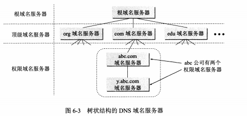
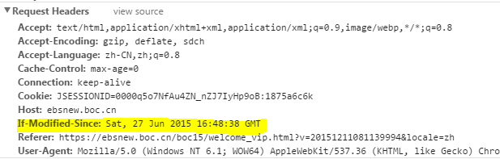
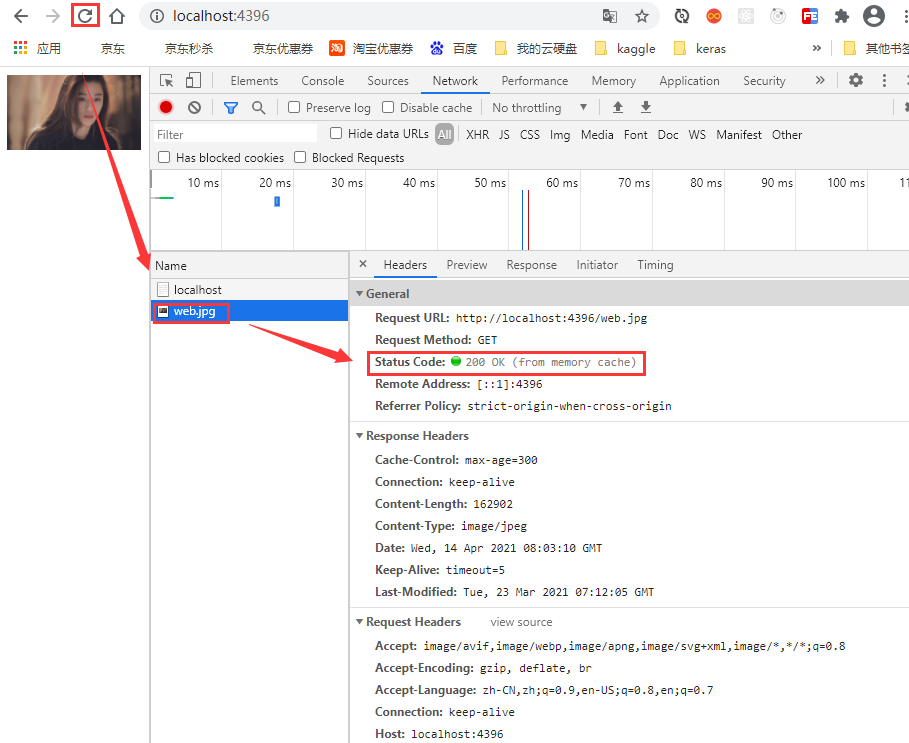

# 1 一次完整的HTTP服务过程

当我们在web浏览器的地址栏中输入：`www.baidu.com`，具体发生了什么？

```
1. 对`www.baidu.com`这个网址进行DNS域名解析，向DNS服务器发送请求，获取到该url所在的服务器的IP地址
2. 根据这个IP，找到对应的服务器，发起TCP的三次握手
3. 建立TCP连接后发起HTTP请求  
4. 服务器响应HTTP请求，浏览器得到html代码
5. 浏览器解析html代码，并请求html代码中的资源（如js、css、图片等）（先得到html代码，才能去找这些资源）
6. 浏览器对页面进行渲染呈现给用户
7. 服务器关闭TCP连接
```

## 1.1 DNS域名解析

对`www.baidu.com`这个网址进行DNS域名解析，向DNS服务器发送请求，获取到该url所在的服务器的IP地址

```
url(ww.baidu.com) => ip(例如192.168.1.2)
这一步很关键：就像你是一名快递员，在送快递前要先找中间人询问收件人的地址。而 DNS 就是这个告诉你目标地址的中间人，如果 DNS 告诉了你错误的地址、或者请求被拦截、再或者 DNS 挂了，都会导致你无法访问网站。

DNS域名解析采用的是递归查询的方式:   DNS缓存：就是一些ip和域名的映射关系
	- 浏览器首先会搜索自身的DNS缓存（缓存时间比较短，大概只有1分钟，且只能容纳1000条缓存）
	- 没有则搜索操作系统的DNS缓存
	- 如果还没有，那么尝试从本地计算机的 hosts文件里面去找，hosts文件中保存着本地的DNS缓存，hosts文件地址:C:\Windows\System32\drivers\etc
	- 在前面三个过程都没获取到的情况下，就递归地去域名服务器去查找
```

hosts文件的内容：

```
140.82.112.4 github.com     访问github.com 映射得到的ip就是140.82.112.4
192.30.255.113 github.com
13.114.40.48 github.com

这里的ip可以在DNS查询网站中得到：http://tool.chinaz.com/dns?
```

DNS域名系统：

```
用户与服务器进行交互时，必须知道对方的IP地址，然后IP地址是32位的二进制数，不太容易记住

所以在应用层为了方便用户记忆各种网络应用，就设计了DNS系统，用户只需要记住主机名，域名系统DNS可以将主机名字直接转换为对应的IP地址

任何一个在互联网上的主机或者路由器都具备一个唯一的层次结构的名字，即域名。
域还可以进一步划分：顶级域、二级域、三级域等
每一个域名都由标号序列组成，各个标号之间使用点隔开
	mail.cctv.com
	三级  二级  顶级

DNS服务器的管辖范围是以区为单位的，区可能等于或者小于域
```


```
互联网上的DNS域名服务器也是按照层次安排的，每一个域名服务器都只对域名体系中的一部分进行管辖。
```



## 1.2 建立TCP连接

TCP三次握手和四次挥手：

```
摘录：https://blog.csdn.net/qq_38950316/article/details/81087809

TCP传送的数据单位是报文段，一个TCP报文段分为首部和数据两部分，TCP的全部功能都体现在它首部中各字段的作用
下面将TCP的首部展开：
	前20字节是固定的，故TCP首部最小长度是20字节
```


```
序号seq：占4个字节，用来标记数据段的顺序，TCP把连接中发送的所有数据字节都编上一个序号，第一个字节的编号由本地随机产生；序号字段值seq就是这个报文段中的第一个字节的数据编号。
	例如一段报文的序号是301，而携带的数据共有100字节，则表示：本报文段的第一个字节的数据序号是301,最后一个字节序号为400，下一个报文段的数据序号应该从401开始，即下个报文段的序号字段值应该为401

确认号ack：占4个字节，期待收到对方下一个报文段的第一个数据字节的序号；确认号指的是期望接收到下一个字节的编号；因此当前报文段最后一个字节的编号+1即为确认号。若确认号为N，则表示到序号N-1为止的所有数据都已正确收到。
	例如：B正确收到了A发送过来的一个报文段，其序号字段为500，而数据长度为200，则表明B正确收到了A发送的到序号700为止的数据，因此，B期望收到的下一个数据序号是701，于是B在给A发送的确认报文中将确认号ack置为701。

确认ACK：占1位，仅当ACK=1时，确认号字段ack才有效。ACK=0时，确认号字段无效

同步SYN：连接建立时用于同步序号。当SYN=1，ACK=0时表示：这是一个连接请求报文段。若同意连接，则在响应报文段中使得SYN=1，ACK=1。因此，SYN=1表示这是一个连接请求报文。SYN这个标志位只有在TCP建产连接时才会被置1，握手完成后SYN标志位被置0。

终止FIN：用来释放一个连接。FIN=1表示：此报文段的发送方的数据已经发送完毕，并要求释放运输连接

PS：ACK、SYN和FIN这些大写的单词表示标志位，其值要么是1，要么是0；ack、seq小写的单词表示序号。
```

TCP三次握手：


```
客户端A主动打开连接，服务器端B被动打开连接

B的TCP服务器进程先创建传输控制块TCB，准备接受客户进程的连接请求，然后服务器进程处于LISTEN状态，等待客户端发送请求

A的TCP客户进程创建传输控制模块TCB

第一次握手：建立连接时，客户端A发送连接请求报文段（SYN=1，选择初始序号syn=x）到服务器，并进入SYN_SENT（同步已发送）状态，等待服务器确认；
	TCP规定，SYN报文段(即SYN=1的报文段)不能携带数据，但是要消耗掉一个序号
	所以第二次握手中的确认报文的确认号ack=x+1

第二次握手：服务器B收到客户端A的连接请求报文段，如果同意连接，则必须发送确认报文段（SYN=1,ACK=1,ack=x+1，选择初始序号seq=y），此时服务器进入SYN_RECV（同步收到）状态；

第三次握手：客户端A收到服务器B的确认报文段，向服务器发送ACK确认报文段(ACK=1,seq=x+1,ack=y+1），此包发送完毕，客户端进入ESTABLISHED（TCP连接成功）状态，完成三次握手。

服务器端在收到ACK报文段后，也进入连接建立状态。

	TCP规定，ACK报文可以携带数据，所以如果B发给A的ACK报文中携带了M字节的数据，则第三次握手时ack=y+M+1
```

相关问题：

```
1 为什么A还要再次确认呢？第三次握手存在的意义
	主要是为了防止已经失效的连接请求报文段突然又传给了B，造成B的资源浪费
	解释：
		假定两次握手就可以建立TCP连接
		假设A先发送了一个连接请求1，但是该请求在某些网络结点长时间滞留了。
		于是A又重新发起了连接请求2，并且请求2得到了确认，A、B之间建立了连接，两者传输数据结束并且释放了连接之后的一段时间，请求1到达了B，则B会以为A又发起了一次新的请求，就会发送确认报文，则两者之间的连接就建立了。但是此时A并不会理睬B的确认，也不会向B发送数据，B却一直在等待A发送数据，就导致了B资源的浪费。
		使用三次握手，则A收到B的确认报文后，A不会向B发送确认报文，则B由于收不到确认报文，就知道A没有请求建立连接
		
2 第三次握手，服务器没有收到客户端的ACK确认包，但是却收到了客户端发送的请求，会如何？

首先，服务器没有收到客户端发送的ACK确认报文，则服务器端会因此会重发之前的SYN+ACK（默认重发五次，之后自动关闭连接），Client收到后会重新传ACK给Server。

如果服务器端始终没有收到客户端的ACK报文，但是在自动关闭之前收到了客户端传递过来的数据，则由于服务器端此时还处于同步收到状态，所以服务器会以reset释放连接包响应。

在交互的双方中的某一方长期未收到来自对方的确认报文，则其在超出一定的重传次数或时间后，会主动向对端发送reset报文释放该TCP连接
```

## 1.3 发起HTTP请求 

TCP请求是比Http更底层的一个协议	 
IP是比TCP更底层的     
所以要先获取IP->tcp->http


```
http:(HyperText Transfer Protocal) 超文本传输协议

定义了浏览器怎样向万维网服务器请求万维网文档，以及服务器怎样把文档传输给浏览器
Http使用了面向连接的TCP协议作为传输层协议，保证了数据的可靠传输
Http协议本身是无连接的
```

HTTP报文：

```
HTTP请求报文由三部分组成：请求行，请求头、空行 / 请求正文
	请求行：用于描述客户端的请求方式（GET/POST等），请求的资源名称(URL)以及使用的HTTP协议的版本号
	请求头：用于描述客户端请求哪台主机及其端口，以及客户端的一些环境信息等
	空行：空行就是\r\n (POST请求时候有)
	请求正文：当使用POST等方法时，通常需要客户端向服务器传递数据。这些数据就储存在请求正文中（GET方式是保存在url地址后面，不会放到这里）
```

举例：

**GET请求**

```
下面是浏览器对 http://localhost:8081/test?name=XXG&age=23的GET 请求时发送给服务器的数据：
```


可以看出请求包含请求行和请求头两部分

**POST请求**

```
下面是浏览器对 http://localhost:8081/test 的 POST 请求时发送给服务器的数据，消息体中带上参数 name=XXG&age=23
```


```
可以看出，上面的请求包含三个部分：请求行、请求头、空格/消息体，比之前的 GET 请求多了一个请求消息，其中请求头和消息体之间用一个空行分割。

POST 请求的参数不在 URL 中，而是在消息体中，请求头中多了一项 Content-Length 用于表示消息体的字节数，这样服务器才能知道请求是否发送结束。这也就是 GET 请求和 POST 请求的主要区别。
```

**那么起始行中的请求方法有哪些种呢？**

```
GET: 完整请求一个资源 （常用）
HEAD: 仅请求响应首部
POST：提交表单  （常用）
PUT: (webdav) 上传文件（但是浏览器不支持该方法）
DELETE：(webdav) 删除
OPTIONS：返回请求的资源所支持的方法的方法
TRACE: 追求一个资源请求中间所经过的代理（该方法不能由浏览器发出）
```

## 1.4 服务器响应HTTP请求

```
HTTP响应也由三部分组成：状态行，响应头，空格，消息体

状态行包括：协议版本、状态码、状态码描述
    状态码：状态码用于表示服务器对请求的处理结果
        1xx：指示信息——表示请求已经接受，继续处理
        2xx：成功——表示请求已经被成功接收、理解、接受。
        3xx：重定向——要完成请求必须进行更进一步的操作
        4xx：客户端错误——请求有语法错误或请求无法实现
        5xx：服务器端错误——服务器未能实现合法的请求。
        几种常见的：
            200（没有问题） 
            302（要你去找别人） 
            304（要你去拿缓存） 
            307（要你去拿缓存） 
            403（有这个资源，但是没有访问权限） 
            404（服务器没有这个资源） 
            500（服务器这边有问题）
            状态码：
                301： 永久移动，请求的资源已经永久移动到新的url，返回的信息中心会包含新的url,浏览器会自动重定向到新的url,今后所有的请求都会使用新的url代替

                302：临时移动，资源只是被临时移动到新的url,客户端后续请求应该继续使用原来的url

                304：未修改，所请求的资源未修改，服务器不会反悔任何资源。客户端直接去缓存中寻找。
响应头：响应头用于描述服务器的基本信息，以及客户端如何处理数据 
空格：CRLF（即 \r\n）分割
消息体：服务器返回给客户端的数据
```

响应格式：


```
上面的 HTTP 响应中，响应头中的 Content-Length 同样用于表示消息体的字节数。
Content-Type 表示消息体的类型，通常浏览网页其类型是HTML，当然还会有其他类型，比如图片、视频等。
```

## 1.5 解析资源

浏览器得到html代码浏览器解析html代码，并请求html代码中的资源（如js、css、图片等）（先得到html代码，才能去找这些资源）

```
浏览器拿到html文件后，就开始解析其中的html代码
	遇到js/css/image等静态资源时，就向服务器端去请求下载（会使用多线程下载，每个浏览器的线程数不一样），这时就用上 keep-alive特性了，建立一次HTTP连接，可以请求多个资源，下载资源的顺序就是按照代码里面的顺序，但是由于每个资源大小不一样，而浏览器又是多线程请求请求资源，所以这里显示的顺序并不一定是代码里面的顺序。
```

## 1.6 渲染并呈现页面

浏览器对页面进行渲染呈现给用户

```
最后，浏览器利用自己内部的工作机制，把请求的静态资源和html代码进行渲染，渲染之后呈现给用户，浏览器是一个边解析边渲染的过程。

首先浏览器解析HTML文件构建DOM树，然后解析CSS文件构建渲染树，等到渲染树构建完成后，浏览器开始布局渲染树并将其绘制到屏幕上。

这个过程比较复杂，涉及到两个概念: reflow(回流)和repain(重绘)。

DOM节点中的各个元素都是以盒模型的形式存在，这些都需要浏览器去计算其位置和大小等，这个过程称为relow;当盒模型的位置,大小以及其他属性，如颜色,字体,等确定下来之后，浏览器便开始绘制内容，这个过程称为repain。

页面在首次加载时必然会经历reflow和repain。

reflow和repain过程是非常消耗性能的，尤其是在移动设备上，它会破坏用户体验，有时会造成页面卡顿。所以我们应该尽可能少的减少reflow和repain。

JS的解析是由浏览器中的JS解析引擎完成的。

JS是单线程运行，JS有可能修改DOM结构，意味着JS执行完成前，后续所有资源的下载是没有必要的，所以JS是单线程，会阻塞后续资源下载。
```

## 1.7 关闭TCP连接

```
一般情况下，一旦Web服务器向浏览器发送了请求数据，它就要关闭TCP连接，然后如果浏览器或者服务器在其头信息加入了这行代码：Connection:keep-alive 

TCP连接在发送后将仍然保持打开状态，于是，浏览器可以继续通过相同的连接发送请求。保持连接节省了为每个请求建立新连接所需的时间，还节约了网络带宽。

自此一次完整的HTTP事务宣告完成.
```

如果数据传输结束，不再传输数据，则双方需要释放连接，进行TCP四次挥手：

```
数据传输结束，通信双方均可以释放连接
```


```
第一次挥手：A发送释放连接请求，A进入终止等待1状态
1）客户端进程A发出连接释放报文FIN，并且停止发送数据。将释放报文首部的FIN置为1，其序列号为seq=u（等于前面已经传送过来的数据的最后一个字节的序号加1），此时，客户端A进入FIN-WAIT-1（终止等待1）状态。 
	TCP规定，FIN报文段即使不携带数据，也要消耗一个序号。

第二次挥手：B确认收到了A释放连接的请求，B进入关闭等待状态，但是B还可以发送数据给A
2）服务器B收到连接释放报文，发出确认报文FIN+ACK，ACK=1，ack=u+1，选择序列号seq=v，此时，服务端就进入了CLOSE-WAIT（关闭等待）状态。
	TCP服务器通知高层的应用进程，客户端向服务器的方向就释放了，这时候处于半关闭状态，即客户端已经没有数据要发送了，但是服务器若发送数据，客户端依然要接受。
	这个状态还要持续一段时间，也就是整个CLOSE-WAIT状态持续的时间。

3）客户端A收到服务器B的确认请求后，此时，客户端A就进入FIN-WAIT-2（终止等待2）状态，等待服务器发送连接释放报文（在这之前还需要接受服务器发送的最后的数据）。

第三次挥手：B传输完了数据，发送释放连接报文，进入最后确认的状态
4）服务器将最后的数据发送完毕后，就向客户端发送连接释放报文FIN，FIN=1，ack=u+1，由于在半关闭状态，服务器很可能又发送了一些数据，假定此时的序列号为seq=w，此时，服务器就进入了LAST-ACK（最后确认）状态，等待客户端的确认。

第四次挥手：A收到释放连接报文，发出确认收到释放连接的报文，进入时间等待状态
5）客户端收到服务器的连接释放报文后，必须发出确认报文FIN+ACK，ACK=1，ack=w+1，而自己的序列号是seq=u+1，此时，客户端就进入了TIME-WAIT（时间等待）状态。注意此时TCP连接还没有释放，必须经过2MSL（最长报文段寿命）的时间后，当客户端撤销相应的TCB后，才进入CLOSED状态。
	MSL是由TCP的时间等待计时器设置的，叫做最长报文段寿命

6）服务器只要收到了客户端发出的释放连接确认，立即进入CLOSED状态。同样，撤销TCB后，就结束了这次的TCP连接。可以看到，服务器结束TCP连接的时间要比客户端早一些。
```

相关问题：

```
1 A为什么要等待2MSL的时间才能进入关闭状态呢？
	（1）为了保证B收到了A第四次挥手时发送的FIN+ACK报文
		这个报文很有可能丢失，从而导致处于最后确认状态的B收不到，B就会超时重传FIN报文，而A就可以在2MSL时间内收到FIN报文，并且再次发送确认报文FIN+ACK，这样B就可以完成释放连接，否则B收不到就无法释放连接进入CLOSED状态
	（2）防止已失效的报文请求连接

2 如果已经建立连接，但是客户端A出现故障，如何传输数据呢？
	除了时间等待计时器，TCP还设有一个保活计时器
	服务器每次收到一次客户端的数据，就会重新设置保活计时器，通常设置两个小时，若两小时内没有收到A发送的数据，则服务器就发送一个探测报文段，以后每隔75s发送一次，若一连发送10个探测报文段后A仍无响应，则服务器就认为iA出现了故障，然后就关闭两者之间的连接。
	
3 为什么连接的时候是三次握手，关闭的时候却是四次握手？
	因为当Server端收到Client端的SYN连接请求报文后，可以直接发送SYN+ACK报文。其中ACK报文是用来应答的，SYN报文是用来同步的。但是关闭连接时，当Server端收到FIN报文时，很可能并不会立即关闭SOCKET，所以只能先回复一个ACK报文，告诉Client端，"你发的FIN报文我收到了"。只有等到我Server端所有的报文都发送完了，我才能发送FIN报文，因此不能一起发送。故需要四步握手。
```

# 2 http缓存控制

```
Web 缓存大致可以分为：数据库缓存、服务器端缓存（代理服务器缓存、CDN 缓存）、浏览器缓存。

浏览器缓存也包含很多内容： HTTP 缓存、indexDB、cookie、localstorage 等等。这里我们只讨论 HTTP 缓存相关内容。
```

在具体了解 HTTP 缓存之前先来明确几个术语：

- 缓存命中率：从缓存中得到数据的请求数与所有请求数的比率。理想状态是越高越好。
- 过期内容：超过设置的有效时间，被标记为“陈旧”的内容。通常过期内容不能用于回复客户端的请求，必须重新向源服务器请求新的内容或者验证缓存的内容是否仍然有效。
- 验证：验证缓存中的过期内容是否仍然有效，验证通过的话刷新过期时间。
- 失效：失效就是把内容从缓存中移除。当内容发生改变时就必须移除失效的内容。

## 2.1 浏览器缓存

浏览器缓存主要是 HTTP 协议定义的缓存机制。例如`<META HTTP-EQUIV="Pragma" CONTENT="no-store">`含义是让浏览器不缓存当前页面。缓存是否可以用，有效时间等都是服务器端设置的。

但是代理服务器不解析 HTML 内容，**一般应用广泛的是用 HTTP 头信息控制缓存**。

浏览器缓存分为强缓存和协商缓存：

```
浏览器再次访问一个已经访问过的页面的简单流程如下：
    1. 浏览器先根据这个资源的http头信息来判断是否命中强缓存。如果命中则直接加载缓存中的资源，并不会将请求发送到服务器。（强缓存）
    2. 如果未命中强缓存，则浏览器会将资源加载请求发送到服务器。服务器来判断浏览器本地缓存是否失效。若可以使用，则服务器并不会返回资源信息，浏览器继续从缓存加载资源。（协商缓存）
    3. 如果未命中协商缓存，则服务器会将完整的资源返回给浏览器，浏览器加载新资源，并更新缓存。（新的请求）
```

[《浏览器存储和缓存机制》](https://blog.csdn.net/wantingtr/article/details/100559520)

### 2.1.1 强缓存

```
命中强缓存时，浏览器并不会将请求发送给服务器。在Chrome的开发者工具中看到http的返回码是200，但是在Size列会显示为(from cache)。
```


```
强缓存是利用http的返回头(响应头)中的Expires或者Cache-Control两个字段来控制的，用来表示资源的缓存时间。
```

#### (1) Expires字段

```
Expires
    缓存过期时间，用来指定资源到期的时间，是服务器端的具体的时间点。
    Expires=max-age + 请求时间，需要和Last-modified结合使用。
    cache-control的优先级更高。 
    Expires是Web服务器响应消息头字段，在响应http请求时告诉浏览器在过期时间内浏览器可以直接从浏览器缓存取数据，而无需再次请求。
```


```
在上图中：该字段返回了一个时间，比如Expires:Thu,31 Dec 2037 23:59:59 GMT。这个时间代表着这个资源的失效时间，也就是说在2037年12月31日23点59分59秒之前都是有效的，即命中缓存。
```

**这种方式有一个明显的缺点，由于失效时间是一个绝对时间，所以当客户端本地时间被修改以后，服务器与客户端时间偏差变大以后，就会导致缓存混乱。于是发展出了Cache-Control。**

#### (2) Cache-Control字段

```
Cache-Control：
	Cache-Control是一个相对时间，例如Cache-Control:3600，代表着资源的有效期是3600秒。由于是相对时间，并且都是与客户端时间比较，所以服务器与客户端时间偏差也不会导致问题。

	Cache-Control与Expires可以在服务端配置同时启用或者启用任意一个，同时启用的时候Cache-Control优先级高。
```

Cache-Control 可以由多个字段组合而成，主要有以下几个取值：

```
max-age： 指定一个时间长度，在这个时间段内缓存是有效的，单位是s。
    例如设置 Cache-Control:max-age=31536000，也就是说缓存有效期为（31536000 / 24 / 60 * 60）天，第一次访问这个资源的时候，服务器端也返回了 Expires 字段，并且过期时间是一年后。
s-maxage:同 max-age，覆盖 max-age、Expires，但仅适用于共享缓存，在私有缓存中被忽略。
public:表明响应可以被任何对象（发送请求的客户端、代理服务器等等）缓存。
private:表明响应只能被单个用户（可能是操作系统用户、浏览器用户）缓存，是非共享的，不能被代理服务器缓存。
no-cache:强制所有缓存了该响应的用户，在使用已缓存的数据前，发送带验证器的请求到服务器。不是字面意思上的不缓存。
no-store:禁止缓存，每次请求都要向服务器重新获取数据。
must-revalidate:指定如果页面是过期的，则去服务器进行获取。这个指令并不常用，就不做过多的讨论了。
```


```
在没有禁用缓存并且没有超过有效时间的情况下，再次访问这个资源就命中了缓存，不会向服务器请求资源而是直接从浏览器缓存中取。
```

### 2.1.2 协商缓存

若未命中强缓存，则浏览器会将请求发送至服务器。服务器根据http头信息中的Last-Modify/If-Modify-Since或Etag/If-None-Match来判断是否命中协商缓存。如果命中，则http返回码为304，浏览器从缓存中加载资源。

#### (1) Last-Modify/If-Modify-Since

```
浏览器第一次请求一个资源的时候，服务器返回的header中会加上Last-Modify，Last-modify是一个时间标识该资源的最后修改时间，例如`Last-Modify: Thu,31 Dec 2037 23:59:59 GMT`。
```


```
当浏览器再次请求该资源时，发送的请求头中会包含If-Modify-Since，该值为缓存之前返回的Last-Modify。服务器收到If-Modify-Since后，根据资源的最后修改时间判断是否命中缓存。
```



```
如果命中缓存，则返回http304，并且不会返回资源内容，并且不会返回Last-Modify。

由于对比的服务端时间，所以客户端与服务端时间差距不会导致问题。

但是有时候通过最后修改时间来判断资源是否修改还是不太准确（资源变化了最后修改时间也可以一致）。于是出现了ETag/If-None-Match。
```

#### (2) ETag/If-None-Match

```
Etag/If-None-Match返回的是一个校验码（ETag: entity tag）。

ETag可以保证每一个资源是唯一的，资源变化都会导致ETag变化。

ETag值的变更则说明资源状态已经被修改。服务器根据浏览器上发送的If-None-Match值来判断是否命中协商缓存。
	如果ETag=If-None-Match,则说明命中了协商缓存
	否则，没有命中
```


 ```
ETag扩展说明

我们对ETag寄予厚望，希望它对于每一个url生成唯一的值，资源变化时ETag也发生变化。神秘的Etag是如何生成的呢？以Apache为例，ETag生成靠以下几种因子

1. 文件的i-node编号，此i-node非彼iNode。是Linux/Unix用来识别文件的编号。是的，识别文件用的不是文件名。使用命令’ls –I’可以看到。
2. 文件最后修改时间
3. 文件大小
   生成Etag的时候，可以使用其中一种或几种因子，使用抗碰撞散列函数来生成。所以，理论上ETag也是会重复的，只是概率小到可以忽略。
 ```

#### (3) 既生Last-Modified何生Etag？

```
你可能会觉得使用Last-Modified已经足以让浏览器知道本地的缓存副本是否足够新，为什么还需要Etag（实体标识）呢？HTTP1.1中Etag的出现主要是为了解决几个Last-Modified比较难解决的问题：

1. **Last-Modified标注的最后修改只能精确到秒级，如果某些文件在1秒钟以内，被修改多次的话，它将不能准确标注文件的修改时间**

2. 如果某些文件会被定期生成，当有时内容并没有任何变化，但Last-Modified却改变了，导致文件没法使用缓存

3.有可能存在服务器没有准确获取文件修改时间，或者与代理服务器时间不一致等情形

Etag是服务器自动生成或者由开发者生成的对应资源在服务器端的唯一标识符，能够更加准确的控制缓存。Last-Modified与ETag是可以一起使用的，服务器会优先验证ETag，一致的情况下，才会继续比对Last-Modified，最后才决定是否返回304。
```

**浏览器第一次请求**


**浏览器第二次请求**


### 2.1.3 缓存的资源去哪里了

#### (1) memory cache

```
MemoryCache顾名思义，就是将资源缓存到内存中，等待下次访问时不需要重新下载资源，而直接从内存中获取。

浏览器打开一个Tab页，就开启了一个进程，对应于该进程就会产生一个memory cache,当关闭标签页，即关闭该进程后，memory cache也会随之消失

Webkit早已支持memoryCache。

目前Webkit资源分成两类
	一类是主资源，比如HTML页面，或者下载项
	一类是派生资源，比如HTML页面中内嵌的图片或者脚本链接
	分别对应代码中两个类：MainResourceLoader和SubresourceLoader。

虽然Webkit支持memoryCache，但是也只是针对派生资源，它对应的类为CachedResource，用于保存原始数据（比如CSS，JS等），以及解码过的图片数据。
```

#### (2) disk cache

```
DiskCache:将资源缓存到磁盘中，等待下次访问时不需要重新下载资源，而直接从磁盘中获取，它的直接操作对象为CurlCacheManager。

谷歌中disk cache缓存的位置为：C:\Users\Administrator\AppData\Local\google\Chrome\User Data\Default\Cache
每刷新一次页面，结果也会更新一次
```

#### (3) 比较

```
相同点：只能存储一些派生类资源文件
不同点：
		memory cache:退出进程时数据会被清除
		disk cache:退出进程时数据不会被清除
		
一般脚本、字体、图片会存在内存当中
一般非脚本会存在内存当中，如css等

因为CSS文件加载一次就可渲染出来,我们不会频繁读取它,所以它不适合缓存到内存中
但是js之类的脚本却随时可能会执行,如果脚本保存在磁盘当中,我们在执行脚本的时候需要从磁盘取到内存中来,这样IO开销就很大了,有可能导致浏览器失去响应。
```

### 2.1.4 浏览器缓存的优点

```
1.减少了冗余的数据传输
2.减少了服务器的负担，大大提升了网站的性能
3.加快了客户端加载网页的速度
```

### 2.1.5 举例分析

因为我们要设置缓存的相关属性，所以需要将浏览器控制台的Disable cache设置为不打√的状态


#### (1) 使用web开发框架——koa搭建服务器


新建文件夹`koa-app`,加入下面的`package.json`文件：

```
package.json
依赖包：koa,koa-static,nodemon
确定了入口文件：index.js

{
  "name": "webcache",
  "version": "1.0.0",
  "description": "",
  "main": "index.js",
  "scripts": {
    "cache": "nodemon ./index.js"
  },
  "author": "webfansplz",
  "license": "MIT",
  "devDependencies": {
    "@babel/core": "^7.2.2",
    "@babel/preset-env": "^7.2.3",
    "@babel/register": "^7.0.0",
    "koa": "^2.6.2",
    "koa-static": "^5.0.0"
  },
  "dependencies": {
    "nodemon": "^1.18.9"
  }
}
```

然后使用`npm install`安装依赖包，初始化项目。

创建`webcache.js`:

```
import Koa from 'koa';
import path from 'path';
//静态资源中间件
import resource from 'koa-static';
const app = new Koa();
const host = 'localhost';
const port = 4396;

app.use(resource(path.join(__dirname, './static')));

app.listen(port, () => {
  console.log(`server is listen in ${host}:${port}`);
});
```

编写入口文件`index.js`：

```
// 入口文件

require('@babel/register');
require('./webcache.js');
```

新建static文件夹，在内部新建index.html，并且将web.jpg放在该文件夹下：

```
<!DOCTYPE html>
<html lang="en">
  <head>
    <meta charset="UTF-8" />
    <meta name="viewport" content="width=device-width, initial-scale=1.0" />
    <meta http-equiv="X-UA-Compatible" content="ie=edge" />
    <title>前端缓存</title>
    <style>
      .web-cache img {
        display: block;
        width: 100%;
      }
    </style>
  </head>
  <body>
    <div class="web-cache"></div>
  </body>
</html>
```

在命令行执行`npm run cache`运行服务器,打开`http://localhost:4396/`可以看到：


此时我们还没有在响应头中设置与缓存有关的字段，所以目前Cache_Control为0


#### (2) 验证Cache-Control

通过 cache-control设置强缓存：

```
webcache.js     设置响应头Cache-Control

import Koa from 'koa';
import path from 'path';
//静态资源中间件
import resource from 'koa-static';
const app = new Koa();
const host = 'localhost';
const port = 4396;

app.use(async (ctx, next) => {
// 设置响应头Cache-Control 设置资源有效期为300秒
    ctx.set({
    'Cache-Control': 'max-age=60'  
    });
    await next();
});

app.use(resource(path.join(__dirname, './static')));

app.listen(port, () => {
  console.log(`server is listen in ${host}:${port}`);
});
```

可以看到此时Cache-Control：300s


在我们刚才进行网络请求时，由于设置了强缓存，所以此时web.jpg已经被存入了磁盘和内存中，根据三级缓存原理，此时再刷新页面，会先在内存中找资源，刷新页面，查看结果，可以发现`from cache`,来自于内存



将该页面关掉，则关掉了该进程，从而也会关掉进程中的内存，memory cache就不存在了。然后随便打开一个页面，先打开控制台，然后输入url:`localhost:4396`,回车，则可以看到下面的结果`from disk cache`：


我们设置的缓存有效时长是300s，等待300s时间后，刷新界面，可以发现此时它是从http请求重新得到的，并且设置了新的有效缓存时长


#### (3) 验证协商缓存

为了验证协商缓存，首先去除强缓存Cache-Control。

安装ETag

```
//ETag support for Koa responses using etag.
npm install koa-tag
// etag works together with conditional-get
npm install koa-conditional-get
```

设置ETag响应头：

```
webcache.js

import Koa from 'koa';
import path from 'path';
//静态资源中间件
import resource from 'koa-static';
import conditional from 'koa-conditional-get';
import etag from 'koa-etag';
const app = new Koa();
const host = 'localhost';
const port = 4396;

// 设置ETag响应头
app.use(conditional());
app.use(etag());

app.use(resource(path.join(__dirname, './static')));

app.listen(port, () => {
 console.log(`server is listen in ${host}:${port}`);
});
```

访问`http://localhost:4396`，得到html页面和外部图片资源均是200响应码，表示从服务器那里成功得到响应


刷新页面，此时html页面和外部图片资源的请求响应码都是304，请求头将If-None-Match设定为前一次请求的ETag，得到新的ETag=If-None-Match,所以命中了协商缓存


切换新的图片,资源产生的变化，可以看到产生了一个新的ETag,对比之前的ETag，两者并不相同，所以直接进行了再一次请求：


### 明确考察点

1. http缓存作用范围
2. http缓存分类  
3. http缓存实现技术

### 回答思路

​    首先回答http缓存的作用范围， 然后点出http缓存主要分为强缓存和协商缓存。最后重点阐述强缓存和协商缓存的配置实现和相关http响应头字段的用法。

### 3.1.4 iframe内联框架

可以实现同一个标签页的父子页面之间的通信

具体参见：[iframe](../iframe/iframe.md)

# 3 浏览器内多个标签页之间的通讯

本题主要考察多页应用中各个页签之间数据交互的技术手段，也就是数据存储的知识。

```
数据存储方式有两种：浏览器数据存储方式和服务器存储方式。

浏览器数据存储的方式主要用本地存储方式解决，即调用 localStorage、Cookie等本地存储方式。

服务器方式主要使用websocket技术使多页签都监听服务器推送事件来获得其他页签发送的数据。
```

## 3.1 在浏览器端存储

### 3.1.1 localStorage(同源)

```
在一个标签页里面使用 localStorage.setItem(key,value)添加（修改、删除）内容； 
在另外一个标签页监听document对象的storage事件,在事件event对象属性中获取信息
        event事件对象包含以下信息
            1. domain
            2. newValue
            3. oldValue
            4. key。 
即可得到 localstorge 存储的值，实现不同标签页之间的通信。

可以跨域，故可以使用vscode的open with broswer插件直接打开两个界面查看结果

LocalStorage 在 2.5MB 到 10MB 之间（各家浏览器不同），而且不提供搜索功能，不能建立自定义的索引
LocalStorage 在存储大数据时会造成浏览器死锁，属于同步操作
```

标签页1：

```html
<input id="name"> 
<input type="button" id="btn" value="提交"> 
<script type="text/javascript"> 
        window.onload = function () {
            var btnEle = document.getElementById('btn');
            var nameEle = document.getElementById('name');
            btnEle.onclick = function () {
                var name = nameEle.value;
                localStorage.setItem("name", name);
            }
        }
</script> 
```

标签页2：

```html
<script type="text/javascript"> 
        window.onload = function () {
            window.addEventListener("storage", function (event) {
                console.log(event.key + "=" + event.newValue);
            });
        }
</script> 
```

使用`open with default broswer`将两个页面分别打开，可以在页面2的控制台得到输出，并且可以在浏览器的控制台的`application`的`location storage`中查看到我们存入的值，两个界面都可以看到


##### H5 sessionStorage

sessionStorage不支持多个标签页之间进行通讯，但是它也是H5中提出用于客户端存储的，所以在这里提一下

sessionStorage只能在一个标签页中使用，可以缓存该标签页在打开期间使用的数据，但是一旦该标签页被关闭，则所缓存的数据也会消失，刷新界面数据不会消失。

在不同的页面访问同一个标签，创建的缓存数据相互不影响，不会共享

```
<!DOCTYPE html>
<html>
  <head>
    <script>
      function clickCounter() {
        // 确定支持Storage
        if (typeof Storage !== "undefined") {
          if (sessionStorage.clickcount) {
            sessionStorage.clickcount = Number(sessionStorage.clickcount) + 1;
          } else {
            sessionStorage.clickcount = 1;
          }
          document.getElementById("result").innerHTML =
            "在本 session 中，您已经点击这个按钮 " +
            sessionStorage.clickcount +
            " 次。";
        } else {
          document.getElementById("result").innerHTML =
            "抱歉！您的浏览器不支持 Web Storage ...";
        }
      }
    </script>
  </head>
  <body>
    <p><button onclick="clickCounter()" type="button">请点击这里</button></p>
    <div id="result"></div>
    <p>请点击按钮使计数器递增。</p>
    <p>请关闭浏览器或标签页，然后再试一次，计数器会重置。</p>
  </body>
</html>
```


### 3.1.2 调用 cookie+setInterval()—同源

- **HTTP协议是一种无状态协议**，在前端请求服务器对任何HTTP请求都需要携带cookie,其中**包含着会话信息**，用来辨别用户身份。
- 服务端生成，客户端进行维护和存储。所以cookie的本职工作并非本地存储，而是**维持状态**

```
将要传递的信息存储在cookie中，每隔一定时间读取cookie信息，即可随时获取要传递的信息。

在A页面将需要传递的消息存储在cookie当中

在B页面设置setInterval，以一定的时间间隔去读取cookie的值。

要注意：需要在同一个服务器下打开两个页面，不然域名不相同，cookie是不共享的
	可以使用vscode的内置服务器插件open with live server，也可以自己搭建一个服务器
	不能使用open with broswer,这样打开的域名不相同
	
所以使用cookie的前提就是不能跨域

另外，js是可以直接操作cookie信息的，具体API可见：https://www.runoob.com/js/js-cookies.html

Cookie 每次存储的数据的大小不应该超过 4KB，所以不适合大量数据的存储，且每次请求cookie信息都会发送回服务器，如果数据太大，会导致请求过于冗余
```

页面1：存入了两个cookie，一个是用户名，一个是用户的年龄

```html
<input id="name" autocomplete="off"> 
<input type="button" id="btn" value="提交"> 
<input id="age" autocomplete="off"> 
<input type="button" id="btn2" value="提交"> 

<script type="text/javascript"> 
	window.onload = function () {
        var btnEle = document.getElementById('btn');
        var nameEle = document.getElementById('name')

        btnEle.onclick = function(){
            var name = nameEle.value;
            document.cookie = "name=" + name;
        }

        var btnEle2 = document.getElementById('btn2');
        var nameEle2 = document.getElementById('age')
        btnEle2.onclick = function(){
            var age = nameEle2.value;
            document.cookie = "age=" + age;
        }
    }
</script> 
```

页面2：封装一个函数分别读取

```html
window.onload = function () {
    //封装获取cookie的函数
    // cookie是通过一个分号加空格的形式串联起来的字符串  "name=whh; age=18"
    // 所以我们要把每一对值分割开来，方便取值
    function getCookie(key){
        //首先取出每一对值
        var arr1=document.cookie.split('; ');  // ["name=whh", "age=18"]   
        for(var i=0;i<arr1.length;i++){
            // 将每一对值分解成一个只有“名”和“值”的一个数组
            var arr2=arr1[i].split('=');  // ["name","whh"]
            if(arr2[0]==key){
                //返回解码之后的“值”
                return decodeURI(arr2[1]);
            }
        }
    }  
    setInterval(function(){  
        console.log("name=" + getCookie("name"));  
        console.log("age=" + getCookie("age"));    
    }, 5000);   
}
```

打开页面1，可以看到：


打开页面2后每5秒钟就会获取一次cookie信息,由于刚开始没有设置任何cookie信息，所以name和age都是undefined：


在页面1中设置了cookie信息后，在页面2中就可以得到输出,另外，设置了cookie后，在两个页面的浏览器的控制台也可以看到cookie的信息：


### 3.1.3 IndexDB—同源

参考：https://wangdoc.com/javascript/bom/indexeddb.html

随着浏览器的功能不断增强，越来越多的网站开始考虑，将大量数据储存在客户端，这样可以减少从服务器获取数据，直接从本地获取数据。

现有的浏览器数据储存方案，都不适合储存大量数据。所以，需要一种新的解决方案，这就是 IndexedDB 诞生的背景。

通俗地说，IndexedDB 就是浏览器提供的本地数据库，它可以被网页脚本创建和操作。IndexedDB 允许储存大量数据，提供查找接口，还能建立索引。这些都是 LocalStorage 所不具备的。就数据库类型而言，IndexedDB 不属于关系型数据库（不支持 SQL 查询语句），更接近 NoSQL 数据库。

```
IndexedDB 具有以下特点。

（1）键值对储存。 IndexedDB 内部采用对象仓库（object store）存放数据。所有类型的数据都可以直接存入，包括 JavaScript 对象。对象仓库中，数据以“键值对”的形式保存，每一个数据记录都有对应的主键，主键是独一无二的，不能有重复，否则会抛出一个错误。

（2）异步。 IndexedDB 操作时不会锁死浏览器，用户依然可以进行其他操作，这与 LocalStorage 形成对比，后者的操作是同步的。异步设计是为了防止大量数据的读写，拖慢网页的表现。

（3）支持事务。 IndexedDB 支持事务（transaction），这意味着一系列操作步骤之中，只要有一步失败，整个事务就都取消，数据库回滚到事务发生之前的状态，不存在只改写一部分数据的情况。

（4）同源限制。 IndexedDB 受到同源限制，每一个数据库对应创建它的域名。网页只能访问自身域名下的数据库，而不能访问跨域的数据库。

（5）储存空间大。 IndexedDB 的储存空间比 LocalStorage 大得多，一般来说不少于 250MB，甚至没有上限。

（6）支持二进制储存。 IndexedDB 不仅可以储存字符串，还可以储存二进制数据（ArrayBuffer 对象和 Blob 对象）。
```

举例分析：

建立本地数据库之后，可以在控制台的Application中查看


页面1或者页面2：两者相同

```

<!DOCTYPE html>
<html>
<head>
<meta name="viewport" content="width=device-width, initial-scale=1" />
<title>HTML5 - IndexedDB</title>
<script type="text/javascript">
window.onload = function(){
    var db;  // 数据库对象
    var request;   // IDBOpenDBRequest 对象
    var objectStore;  // IDBObjectStore 对象对应一个对象仓库
    function _create(dbName){
        // 打开或者新建数据库dbName,版本号为1,返回一个IDBRequest对象
        request=indexedDB.open(dbName,1);
        // 处理打开操作的结果
        request.onerror = function () {
            alert("打开数据库失败:"+event.target.message);
        }
        request.onsuccess = function (event) {
            alert("打开数据库成功!");
            db=event.target.result;
            // 创建info表的事务对象，对于数据记录进行读写和删改
            var transaction = db.transaction(["info"], "readwrite");
            // 创建 IDBObjectStore 对象,对应一个对象仓库。对应info表
            objectStore = transaction.objectStore("info");
        } 
        request.onupgradeneeded = function(event) {
            alert("版本变化！");
            db = event.target.result;
            // 新建对象仓库，即表
            // 新增一张叫做info的表格，主键是userId
            objectStore = db.createObjectStore("info", {keyPath: "userId",autoIncrement: true});
        }
    }
    
    function _delete(dbName){
        request=window.indexedDB.deleteDatabase(dbName);
            console.log(request)
        request.onerror = function () {
            alert("删除数据库失败:"+event.target.message);
        }
        request.onsuccess = function (event) {
            alert("删除数据库成功!");
        } 
    }
    
    function _get (argument) {
        var p=document.getElementById("display");
        p.innerHTML="";//获取数据前先清理一下页面已显示的数据
        if(!db){
            alert("请打开数据先！");
            return false;
        }
        objectStore = db.transaction("info").objectStore("info");
        var keyRange = IDBKeyRange.lowerBound(0);//规定keyRange从0开始
        var cursorRequest = store.openCursor(keyRange);//按照keyRange的设置开启游标
    
        cursorRequest.onsuccess = function (e) {
    
            var result = e.target.result;
    
            if (!!result == false)
                return;
    
            _render(result.value);
            result.continue();//这边执行轮询读取
        };
    
        cursorRequest.onerror = function (e) {
            alert("数据检索失败！");
        };
    
    }
    
    function _render (e) {
        var p=document.getElementById("display");
        p.innerHTML+="姓名:"+e.name+" 年龄:"+e.age+" 性别:"+e.xb+"<br />";
    }
    
    function _add (argument) {
        var name=document.getElementById("name").value;
        var age=document.getElementById("age").value;
        var xb,flag=document.getElementById("nan").checked;
        if(flag)
            xb="男";
        else
            xb="女";
        var detail={
            name:name,
            age:age,
            xb:xb
        }
        if(!db){
            alert("请打开数据先！");
            return false;
        }
        var transaction = db.transaction(["info"], "readwrite");
        // 新建仓库对象
        objectStore = transaction.objectStore("info");
        objectStore.add(detail);
        alert("添加成功！");
    }
    
    var btn1 = document.getElementById('btn1');
    btn1.onclick = function(){
        _create('user1');
    };
    var btn2 = document.getElementById('btn2');
    btn2.onclick = function(){
        console.log(3333)
        _delete('user1');
    };
    var btn3 = document.getElementById('btn3');
    btn3.onclick = function(){
        _add();
    };
    var btn4 = document.getElementById('btn4');
    btn4.onclick = function(){
        _get();
    };
}
</script>
</head>
<body>
	<small>添加前请先打开数据库(如数据库不存在则执行创建过程)</small><br /><br />
    <button id='btn1'>打开数据库</button>
   	<button id='btn2'>删除数据库</button><br /><br />
    姓名：<input type="text" id="name"><br />
    年龄：<input type="number" id="age" min=1><br />
    性别：<br />
    	  男：<input type="radio" id="nan" name="xb" value="male" checked>
    	  女：<input type="radio" id="nv" name="xb" value="female"><br />
    
    <button id='btn3'>添加数据</button>
    <button id='btn4'>获取数据</button><br />
    <p id="display"></p>
    
</body>
</html>
```

在页面1中点击打开数据库，在页面2中刷新就可以看到控制台的`IndexDB`中有建立数据库，两个页面的数据库内容是同步的，在页面2中添加数据在页面1的控制台的`IndexDB`中也可以看到

### 3.1.4 iframe和多窗口通信

iframe主要实现同一页面内的父子页面通信，并且如果父子需要访问对方的DOM，则需要保证同源

具体参见:[iframe](../iframe/iframe.md)

## 3.2 在服务器端存储

### 3.2.1 webSocket通讯—不要求同源

阮一峰：https://javascript.ruanyifeng.com/htmlapi/websocket.html

WebSocket是全双工(full-duplex)通信自然可以实现多个标签页之间的通信。

WebSocket是HTML5新增的协议，它的目的是在浏览器和服务器之间建立一个不受限的双向通信的通道，比如说，服务器可以在任意时刻发送消息给浏览器。

为什么传统的HTTP协议不能做到WebSocket实现的功能？

```
这是因为HTTP协议是一个请求－响应协议，请求必须先由浏览器发给服务器，服务器才能响应这个请求，再把数据发送给浏览器。这种单向请求的特点，注定了如果服务器有连续的状态变化，客户端要获知就非常麻烦。我们只能使用“轮询”：每隔一段时候，就发出一个询问，了解服务器有没有新的信息。最典型的场景就是聊天室。

轮询的效率低，非常浪费资源（因为必须不停连接，或者 HTTP 连接始终打开）。因此，工程师们一直在思考，有没有更好的方法。WebSocket 就是这样发明的

它的最大特点就是，服务器可以主动向客户端推送信息，客户端也可以主动向服务器发送信息，是真正的双向平等对话，属于服务器推送技术的一种。WebSocket 允许服务器端与客户端进行全双工（full-duplex）的通信。
```

WebSocket并不是全新的协议，而是利用了HTTP协议来建立连接。

为什么WebSocket连接可以实现全双工通信而HTTP连接不行呢？

```
实际上HTTP协议是建立在TCP协议之上的，TCP协议本身就实现了全双工通信，但是HTTP协议的请求－应答机制限制了全双工通信。

WebSocket连接建立以后，其实只是简单规定了一下：接下来，咱们通信就不使用HTTP协议了，直接互相发数据吧。安全的WebSocket连接机制和HTTPS类似。首先，浏览器用wss://xxx创建WebSocket连接时，会先通过HTTPS创建安全的连接，然后，该HTTPS连接升级为WebSocket连接，底层通信走的仍然是安全的SSL/TLS协议。
```


```
（1）建立在 TCP 协议之上，服务器端的实现比较容易。
（2）与 HTTP 协议有着良好的兼容性。默认端口也是80和443，并且握手阶段采用 HTTP 协议，因此握手时不容易屏蔽，能通过各种 HTTP 代理服务器。
（3）数据格式比较轻量，性能开销小，通信高效。
（4）可以发送文本，也可以发送二进制数据。
（5）没有同源限制，客户端可以与任意服务器通信。
（6）协议标识符是ws（如果加密，则为wss），服务器网址就是 URL。
```

示例： 客户端代码

```js
// Create WebSocket connection.
const socket = new WebSocket('ws://localhost:8080');

// Connection opened
socket.addEventListener('open', function (event) {
    socket.send('Hello Server!');
});

// Listen for messages
socket.addEventListener('message', function (event) {
    console.log('Message from server ', event.data);
});
```

服务器端：

```
WebSocket 协议需要服务器支持。
Node实现WebSocket的三种方法：
	µWebSockets
    Socket.IO：封装了H5 WebSocket和http轮询poiling,连接时，客户端先尝试建立WebSocket连接，如果没有，将返回到 HTTP 长轮询。
    WebSocket-Node
```

新建一个文件夹：`socketIO/test.js`

```
module.exports = function (server) {
  // 先引入socket.io这个库，得到一个函数，以server为参数，表示挂在这个服务器上，得到了一个IO对象
  const io = require("socket.io")(server);

  // 监视连接 当有任何一个客户端连接上服务器时运行回调
  io.on("connection", function (socket) {
    console.log("socketio connected");

    // 绑定sendMsg监听，接收客户端发送的消息
    socket.on("sendMsg", function (data) {
      console.log("服务器接收到浏览器的消息", data);

      // 处理接收到的数据
      const data = data.name + "_" + data.date;

      // 向客户端发送消息(名称，数据)
      io.emit("receiveMsg", data); // io是全局对象，发送给所有连接上服务器的客户端
      // socket.emit("receiveMsg", data); // socket是局部对象，发送给当前socket对应的客户端，只有一个
      console.log("服务器向浏览器发送消息", data);
    });
  });
};
```

在`bin/www`中引入 test.js 文件(在创建了 server 语句之后,因为它要作为 test.js 中创建的函数的参数引入)：

```
/**
 * Create HTTP server.
 */

var server = http.createServer(app);
// ------------------- 关键代码start -----------------
require("../socketIO/test")(server);
// ------------------- 关键代码end -----------------
```

客户端:

在`src`下新建一个文件夹：`src/test/socketio_test.js`

```
// 引入客户端 io
import io from "socket.io-client";

// 连接服务器, 得到代表连接的 socket 对象     
// {transports: ["websocket"] }可以解决CROS跨域的问题，强制连接方式为websocket
// 默认设置为{ transports: [“poiling","websocket"] }
const socket = io("ws://localhost:4000", { transports: ["websocket"] });

// 绑定'reciveMsg'的监听, 来接收服务器发送的消息
socket.on("receiveMsg", function (data) {
  console.log("浏览器端接收到消息:", data);
});

// 向服务器发送消息
socket.emit("sendMsg", { name: "Tom", date: Date.now() });
console.log("浏览器端向服务器发送消息:", { name: "Tom", date: Date.now() });

```

在客户端的入口文件`src/index.js`中引入该 socketio 的测试模块：

```
import "./test/socketio_test";
```

然后分别运行服务器端和浏览器端，可以直接得到：


#### websocket心跳机制

[理解WebSocket心跳及重连机制](https://www.cnblogs.com/tugenhua0707/p/8648044.html)

在使用websocket的过程中，有时候会遇到网络断开的情况，但是在网络断开的时候服务器端并没有触发onclose的事件。这样会有：服务器会继续向客户端发送多余的链接，并且这些数据还会丢失。所以就需要一种机制来检测客户端和服务端是否处于正常的链接状态。因此就有了websocket的心跳了。还有心跳，说明还活着，没有心跳说明已经挂掉了。

心跳机制是每隔一段时间会向服务器发送一个数据包，告诉服务器自己还活着，同时客户端会确认服务器端是否还活着，如果还活着的话，就会回传一个数据包给客户端来确定服务器端也还活着，否则的话，有可能是网络断开连接了。需要重连~

### 3.2.2 H5 SharedWorker—要求同源

普通的web worker直接使用new Worker()即可创建，这种webworker是当前页面专有的。

还有种共享的(SharedWorker)，这种是可以多个标签页、iframe共同使用的。SharedWorker创建的分线程可以被多个window共同使用，但必须保证这些标签页都是**同源的**(相同的协议，主机和端口号

具体可以查看：[sharedWorker](../js/BOM_DOM_高级JS.md)

2. [SharedWorker api](https://developer.mozilla.org/zh-CN/docs/Web/API/SharedWorker/SharedWorker)
2. IE不支持此方法

# 4 离线缓存：ServiceWorker @ CacheStorage

[Web离线应用解决方案——ServiceWorker](https://www.cnblogs.com/dojo-lzz/p/8047336.html)  [《Service Worker —这应该是一个挺全面的整理》](https://juejin.cn/post/6844903613270081543#heading-1)

Service Worker 是浏览器在后台独立于网页运行的脚本，可以把 Service Worker 理解为一个介于客户端和服务器之间的一个代理服务器。在 Service Worker 中我们可以做很多事情，比如拦截客户端的请求、向客户端发送消息、向服务器发起请求等等，其中最重要的作用之一就是离线资源缓存。

**资源缓存**：拦截请求后，就可以在自己的缓存资源中查找，如果存在客户端需要的响应数据，则直接返回该数据，如果没有，则发起请求，得到响应后，先更新缓存，再返回给客户端

**代理**：拦截客户端的请求，向服务端发起请求

**问题：兼容性不好，IE和Opera均不支持**

对于 Service Worker ，了解过 Web Worker 的同学可能会比较好理解。它和  Web Worker 相比，有相同的点，也有不同的地方。

相同：

1. Service Worker 工作在 worker context 中，是**没有访问 DOM 的权限**的，所以我们无法在 Service Worker 中获取 DOM 节点，也无法在其中操作 DOM 元素；
2. 我们可以通过 `postMessage` 接口把数据传递给其他 JS 文件；[《Service Worker —这应该是一个挺全面的整理》](https://juejin.cn/post/6844903613270081543#heading-1)
3. Service Worker 中运行的代码**不会被阻塞**，也不会阻塞其他页面的 JS 文件中的代码；

不同的地方在于，Service Worker 是一个浏览器中的**进程**而不是浏览器内核下的线程，因此它在被注册安装之后，能够被在多个页面中使用，也不会因为页面的关闭而被销毁。因此，Service Worker 很适合被用与多个页面需要使用的复杂数据的计算——购买一次，全家“收益”。

另外有一点需要注意的是，出于对安全问题的考虑，**Service Worker 只能被使用在 https 或者本地的 localhost 环境下**。


当前使用的浏览器支持 Service Worker ，则在 window.navigator 下会存在 serviceWorker 对象，我们可以使用这个对象的 register 方法来注册一个 Service Worker。

```
/* 判断当前浏览器是否支持serviceWorker,因为当前IE和Opera均不支持 */
if (navigator.serviceWorker !== null) {
    //   注册一个service worker,指定worker文件的路径sw.js
    navigator.serviceWorker.register("sw.js",{scope:'./'}).then(function (registration) {
 		console.log("Registered events at scope:", registration.scope);
	});
}

register 方法接受两个参数
	第一个是 service worker 文件的路径，请注意：这个文件路径是相对于 Origin ，而不是当前 JS 文件的目录的
	第二个参数是 Serivce Worker 的配置项，可选填，其中比较重要的是 scope 属性。按照文档上描述，它是 Service Worker 控制的内容的子目录，这个属性所表示的路径不能在 service worker 文件的路径之上，默认是 Serivce Worker 文件所在的目录；
	
注意：请求路径是scope目录下的文件的fetch请求才会被service worker的fetch监听拦截，不属于该目录的请求不会被拦截
	例如：scope默认就是'./'
	则只有url是req目录下的文件的请求才会被拦截       这部分存在问题，感觉说的不是很清楚
```

html文件设置：

> - 在页面内故意加入了图片等元素，为了说明service worker缓存静态资源的能力

```
<!DOCTYPE html>
<html lang="en">
  <head>
    <meta charset="UTF-8" />
    <meta http-equiv="X-UA-Compatible" content="IE=edge" />
    <meta name="viewport" content="width=device-width, initial-scale=1.0" />
    <title>Document</title>
  </head>
  <body>
    <div class="revision">Revision 9</div>
    
    <div class="main-text">Minimal PWA,open Console for more</div>
    <div class="network-message">
      NetWork：
      <span id="network-status" class="">Good</span>
    </div>
    <script>
      /* 判断当前浏览器是否支持serviceWorker,因为当前IE和Opera均不支持 */
      if (navigator.serviceWorker !== null) {
        //   注册一个service worker,指定文件的路径
        navigator.serviceWorker.register("sw.js",{scope:'./'}).then(function (registration) {
          console.log("Registered events at scope:", registration.scope);
        });
      }
      var statusEle = document.querySelector("#network-status");
      if (!navigator.onLine) {
        statusEle.classList = ["is-offline"];
        statusEle.innerHTML = "offline";
      }
    </script>
  </body>
</html>
```

#### 9.1 缓存静态文件

```
./sw.js

console.log("Script Start");

var cacheStorageKey = "minimal-pwa-2"; // 定义缓存列表名称
var cacheList = ["/", "index.html", "1.jpg", "data.json"]; // 需要缓存的静态文件

// 当浏览器解析完sw文件时，seviceWorker内部触发install事件
this.addEventListener("install", function (e) {
  console.log("Cache Event!");
  // 打开一个缓存空间，将需要缓存的资源添加到缓存空间中
  e.waitUntil(
    caches
      .open(cacheStorageKey)
      .then(function (cache) {
        console.log("Adding to Cache:", cacheList);
        return cache.addAll(cacheList);
      })
      .then(function () {
        console.log("install event open cache" + cacheStorageKey);
        console.log("Skip waiting!");
        // return this.skipWaiting();
      })
  );
});

// 如果浏览器没有激活的service worker，或者已经激活的worker被释放掉
// 新的service worker进入active事件
/*Service Worker 在安装完成后会被激活，所以我们也可监听 activate 事件 */
this.addEventListener("activate", function (e) {
  console.log("Activate event");
  console.log("Promise all");
  // activate中经常做一些过期资源的释放工作
  var cacheDeletePromises = caches.keys().then((cacheNames) => {
    console.log("cacheNames", cacheNames, cacheNames.map);
    return Promise.all(
      cacheNames.map((name) => {
        if (name !== cacheStorageKey) {
          // 如果资源的key与当前需要缓存的key不同，则将该资源释放掉
          console.log("caches delete", caches.delete);
          var deletePromise = caches.delete(name);
          console.log("cache delete result", deletePromise);
          return deletePromise;
        } else {
          return Promise.resolve();
        }
      })
    );
  });
  console.log("cacheDeletePromise:", cacheDeletePromises);
  e.waitUntil(
    Promise.all([cacheDeletePromises]).then(() => {
      console.log("activate event: " + cacheStorageKey);
      console.log("Client claims");
      // return this.client.claim();
    })
  );
});
```

在线状态下：


#### 9.2 缓存动态资源——请求的响应资源

在页面中加入fetch请求：

```
<!DOCTYPE html>
<html lang="en">
  <head>
    <meta charset="UTF-8" />
    <meta http-equiv="X-UA-Compatible" content="IE=edge" />
    <meta name="viewport" content="width=device-width, initial-scale=1.0" />
    <title>Document</title>
  </head>
  <body>
    <div class="revision">Revision 9</div>
    
    <div class="main-text">Minimal PWA,open Console for more</div>
    <div class="network-message">
      NetWork：
      <span id="network-status" class="">Good</span>
    </div>
    <script>
      /* 判断当前浏览器是否支持serviceWorker,因为当前IE和Opera均不支持 */
      if (navigator.serviceWorker !== null) {
        //   注册一个service worker,指定文件的路径
        navigator.serviceWorker.register("sw.js").then(function (registration) {
          console.log("Registered events at scope:", registration.scope);
        });
      }
      var statusEle = document.querySelector("#network-status");
      if (!navigator.onLine) {
        statusEle.classList = ["is-offline"];
        statusEle.innerHTML = "offline";
      }
      fetch('./data12.json')
    </script>
  </body>
</html>
```

页面中的所有在此service-worker规定的请求地址范围内的fetch请求都会被service worker的fetch监听拦截

```
./sw.js

/* 注册fetch事件，拦截全站的请求 */
this.addEventListener("fetch", function (event) {
  console.log("Fetch event: " + cacheStorageKey + ":", event.request.url);
  event.respondWith(
    //首先判断缓存中是否有相同的资源
    caches.match(event.request).then((res) => {
      console.log("res:", res);
      if (res !== undefined) {
        // 如果缓存中已有资源，则直接将该资源返回给主线程
        console.log("Using cache for: ", event.request.url);
        console.log(res);
        return res;
      }
      // 如果没有，则使用fetch API请求新的资源
      console.log("Fallback to fetch: ", event.request.url);
      return fetch(event.request.url).then(function (httpRes) {
        console.log(1111);
        // 请求失败，则直接返回请求失败的结果
        if (!httpRes || httpRes.status !== 200) {
          return httpRes;
        }

        // 请求成功的话，克隆一份响应结果，缓存起来
        var responseClone = httpRes.clone();
        caches.open(cacheStorageKey).then(function (cache) {
          console.log("Adding to Cache:", cacheList);
          // 将响应保存到缓存中
          cache.put(event.request, responseClone);
        });
        // 返回响应结果
        return httpRes;
      });
    })
  );
});
```


观察设置为离线状态后，页面的访问状态，可以看到设置为离线后，该页面还是可以正常访问的，类似的，只要在缓存中的数据都是可以正常访问的


关闭该页面，重新打开，可以发现数据依然存在


#### 9.3 自动更新

> 功能：在同一个界面修改了缓存列表名称后，将的缓存删除掉，即对于一个界面存在一个缓存
>
> 如果不使用下面的方法，也可以通过重新打开该界面实现该功能

重新修改回在线，将`var cacheStorageKey = "minimal-pwa-5"; *// 缓存列表名称*`修改为一个新的值，刷新页面可以发现它存在了两个缓存


这感觉不应该，因为既然要实现离线访问，就需要保证缓存的资源是最新的内容，所以在出现新的资源时，要删掉之前的缓存内容,需要实现自动更新：

- 1 在install监听中返回`return this.skipWaiting();`
- 2 在activate监听中返回`return this.client.claim();`

```
console.log("Script Start");

var cacheStorageKey = "minimal-pwa-5"; // 缓存列表名称
var cacheList = ["/", "index.html", "1.jpg", "data.json", "manifest.json"]; // 需要缓存的静态文件

// 当浏览器解析完sw文件时，seviceWorker内部触发install事件
this.addEventListener("install", function (e) {
  console.log("Cache Event!");
  // 打开一个缓存空间，将需要缓存的资源添加到缓存空间中
  e.waitUntil(
    caches
      .open(cacheStorageKey)
      .then(function (cache) {
        console.log("Adding to Cache:", cacheList);
        return cache.addAll(cacheList);
      })
      .then(function () {
        console.log("install event open cache" + cacheStorageKey);
        console.log("Skip waiting!");
        return this.skipWaiting();
      })
  );
});

// 如果浏览器没有激活的service worker，或者已经激活的worker被释放掉
// 新的service worker进入active事件
/*Service Worker 在安装完成后会被激活，所以我们也可监听 activate 事件 */
this.addEventListener("activate", function (e) {
  console.log("Activate event");
  console.log("Promise all");
  // activate中经常做一些过期资源的释放工作
  var cacheDeletePromises = caches.keys().then((cacheNames) => {
    console.log("cacheNames", cacheNames, cacheNames.map);
    return Promise.all(
      cacheNames.map((name) => {
        if (name !== cacheStorageKey) {
          // 如果资源的key与当前需要缓存的key不同，则将该资源释放掉
          console.log("caches delete", caches.delete);
          var deletePromise = caches.delete(name);
          console.log("cache delete result", deletePromise);
          return deletePromise;
        } else {
          return Promise.resolve();
        }
      })
    );
  });
  console.log("cacheDeletePromise:", cacheDeletePromises);
  e.waitUntil(
    Promise.all([cacheDeletePromises]).then(() => {
      console.log("activate event: " + cacheStorageKey);
      console.log("Client claims");
      return this.client.claim();
    })
  );
});

/* 注册fetch事件，拦截全站的请求 */
this.addEventListener("fetch", function (event) {
  console.log("Fetch event: " + cacheStorageKey + ":", event.request.url);
  event.respondWith(
    //首先判断缓存中是否有相同的资源
    caches.match(event.request).then((res) => {
      console.log("res:", res);
      if (res !== undefined) {
        // 如果缓存中已有资源，则直接将该资源返回给主线程
        console.log("Using cache for: ", event.request.url);
        console.log(res);
        return res;
      }
      // 如果没有，则使用fetch API请求新的资源
      console.log("Fallback to fetch: ", event.request.url);
      return fetch(event.request.url).then(function (httpRes) {
        console.log(1111);
        // 请求失败，则直接返回请求失败的结果
        if (!httpRes || httpRes.status !== 200) {
          return httpRes;
        }

        // 请求成功的话，克隆一份响应结果，缓存起来
        var responseClone = httpRes.clone();
        caches.open(cacheStorageKey).then(function (cache) {
          console.log("Adding to Cache:", cacheList);
          cache.put(event.request, responseClone);
        });
        return httpRes;
      });
    })
  );
});
```


