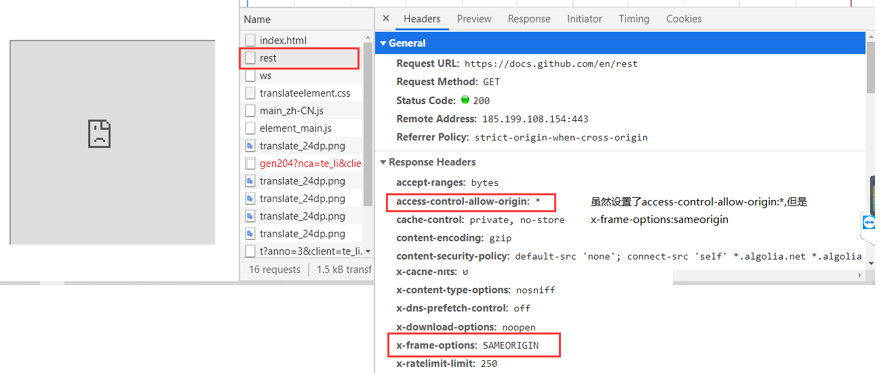

# 1 iframe

内联框架`<iframe src="" width='' height='' frameborder='0'></iframe>`

`iframe`元素可以在当前网页之中，嵌入其他网页。每个`iframe`元素形成自己的窗口，即有自己的`window`对象。`iframe`窗口之中的脚本，可以获得父窗口和子窗口。但是，只有在同源的情况下，父窗口和子窗口才能通信；如果跨域，就无法拿到对方的 DOM。

```
- 向页面中引入其他的页面
    - src属性为其他页面的地址
    - width、height:指定框架的宽度和高度
    - frameborder:指定框架是否具备边框，0没有，1有
- `<iframe src="http://www.baidu.com" width="800px" height="500px" frameborder="0"></iframe>`
- 很少使用
```

获取子页面的window对象：

```
方法1：获取某个框架内页面的window对象
document
.getElementById("myIFrame")
.contentWindow

父页面中存在多个框架时：
document.querySelectorAll('iframe')    // 返回一个多个框架节点组成的类数组对象，然后可以使用contentWindow获取某个子页面的window对象

方法2：var sonWindows = window.frames;   // 返回多个框架的window对象组成的类数组对象
```

## 1.1 单纯引入一个页面，不通信

```
在父页面中单纯引入一个子页面(不需要取到对方的DOM)
	- 如果同源,且子页面的响应头中没有设置对于在iframe中嵌套的限制，则没有任何问题
	- 如果不同源，则需要看子页面的响应头
		- 如果响应头设置了X-FRAME-OPTIONS
			- 值为deny，表示该页面不允许在frame中展示，即使同源也不行
			- 值为SAMEORIGIN。该页面可以在相同域名页面的iframe中展示
			- allow-from url：表示该页面可以在指定来源url的 frame 中展示。
		- 如果响应头设置了Access-Control-Allow-Origin：*，表示允许任意源的请求
```

例如引入子页面为`https://docs.github.com/en/rest`时，就会出现问题：




## 1.2 父子页面通信

但是如果需要拿到对方的DOM ，一定要满足**同源**，不允许跨域访问。

举例：

子页面：

```
<!DOCTYPE html>
<html lang="en">
  <head>
    <meta charset="UTF-8" />
    <meta name="viewport" content="width=device-width, initial-scale=1.0" />
    <meta http-equiv="X-UA-Compatible" content="ie=edge" />
    <title>Document</title>
  </head>
  <body>
    <div>我是子页面</div>
  </body>
  <script>
    window.onload = function () {
      // 在子页面中访问父页面的document,并且对其进行操作
      var parentWindow = window.parent; // 父页面的window对象
      var pdocument = parentWindow.document;
      console.log(pdocument.getElementById("hb"));
    };
  </script>
</html>
```

父页面：

```
<!DOCTYPE html>
<html lang="en">
  <head>
    <meta charset="UTF-8" />
    <meta name="viewport" content="width=device-width, initial-scale=1.0" />
    <meta http-equiv="X-UA-Compatible" content="ie=edge" />
    <title>Document</title>
    <script>
      window.onload = function () {
        window.name = "父页面";
        var sonWindow = document.getElementById("myIFrame").contentWindow;
      };
    </script>
  </head>

  <body>
    <div id="hb">我是父页面</div>
    <iframe
      id="myIFrame"
      src="./index1.html"
      frameborder="1px"
      width="300px"
      height="300px"
    ></iframe>
  </body>
</html>
```

如果直接使用vscode中的`open in browser`插件相当于使用本地地址打开html文件，这样域名是null，此时子页面去访问父页面就会报错：`使用一个域名为null的iframe去访问一个域名为null的页面`


所以需要使用服务器打开父页面，此时可以顺利得到结果：


这种情况不仅适用于`iframe`窗口，还适用于`window.open`方法打开的窗口，只要跨域，父窗口与子窗口之间就无法通信。

### 1.2.1 一级域名同，二级域名不同

**子域名**是在[域名系统](https://baike.baidu.com/item/域名系统)等级中，属于更高一层域的域。比如，mail.example.com和calendar.example.com是example.com的两个子域，而example.com则是[顶级域](https://baike.baidu.com/item/顶级域)[.com](https://baike.baidu.com/item/.com)的子域。

[www.a.baidu.com](http://www.a.baidu.com/) 与 [www.b.baidu.com](http://www.b.baidu.com/) 会发生跨域，可以通过设置动粗，document.domain=baidu.com消除跨域

举例来说，A 网页的网址是`http://w1.example.com/a.html`，B 网页的网址是`http://w2.example.com/b.html`，那么只要设置相同的`document.domain`，两个网页就可以实现通信了。因为浏览器通过`document.domain`属性来检查是否同源。设置为相同，则；浏览器就会判断两个界面同源

```
// 两个网页都需要设置
document.domain = 'example.com';

w1.example.com
三级  二级  顶级域名(一级)
```

注意，A 和 B 两个网页都需要设置`document.domain`属性，才能达到同源的目的。因为设置`document.domain`的同时，会把端口重置为`null`，因此如果只设置一个网页的`document.domain`，会导致两个网址的端口不同，还是达不到同源的目的。

### 1.2.2 完全不同源

来源：https://wangdoc.com/javascript/bom/same-origin.html#iframe-%E5%92%8C%E5%A4%9A%E7%AA%97%E5%8F%A3%E9%80%9A%E4%BF%A1

目前有两种方法，可以解决跨域窗口的通信问题，**但是还是不能直接在对方窗口获取并且操作对方的DOM属性**,只可以传递消息。

> - 片段识别符（fragment identifier):将信息放在hash值中，修改父或子页面的hash值，并且在子或父页面中监听hash的变化，一旦发生变化，则获取该hash值，实现父子页面的通信
>   - 这个方法存在局限性，传递的信息不能太长，否则url太繁琐了
> - 跨文档通信API（Cross-document messaging）：H5提出的 window.postMessage()

#### （1） 片段识别符#

片段标识符（fragment identifier）指的是，URL 的`#`号后面的部分，比如`http://example.com/x.html#fragment`的`#fragment`。如果只是改变片段标识符，页面不会重新刷新。

父窗口可以把信息，写入子窗口的片段标识符。

```
var src = originURL + '#' + data;
document.getElementById('myIFrame').src = src;
```

上面代码中，父窗口把所要传递的信息，写入 iframe 窗口的片段标识符。

子窗口通过监听`hashchange`事件得到通知,同时子窗口也可以修改父窗口的hash。

```
window.onhashchange = checkMessage;

function checkMessage() {
  var message = window.location.hash;
  // ...
}
```

同样的，子窗口也可以改变父窗口的片段标识符。

```
parent.location.href = target + '#' + hash;
```

##### 1 示例

结果：并不是上面所说的那么简单，多番查证发现了问题

> - 父页面中可以直接设定子界面的hash值，因为在父页面中子页面是由iframe引入的
> - 由于父子页面跨域，在IE和Chrome浏览器中的安全机制导致子页面不能直接修改父页面的hash值或者href值，**所以要利用一个中间的cnblogs域下的代理iframe**，即为子页面添加一个和父页面处于同一个域的frame，这样就可以在`proxy.html`中修改父页面的hash值了

父窗口：工作于本地服务器的5500端口  

子窗口：工作于本地服务器的3000端口  

proxy窗口：工作于本地服务器的5500端口

父窗口：

```
<!DOCTYPE html>
<html lang="en">
  <head>
    <meta charset="UTF-8" />
    <meta http-equiv="X-UA-Compatible" content="IE=edge" />
    <meta name="viewport" content="width=device-width, initial-scale=1.0" />
    <title>我是父页面</title>
  </head>
  <body>
    <div>我是父页面</div>
    <script>
      function startRequest() {
        var ifr = document.createElement("iframe");
        ifr.style.display = "none";
        ifr.src = "http://127.0.0.1:3000/index.html#paramdo";
        document.body.appendChild(ifr);
      }

      function checkHash() {
        try {
          console.log("我的hash改变了");
          var data = location.hash ? location.hash.substring(1) : "";
          console.log("Now the data is " + data);
        } catch (e) {}
      }
      startRequest();
      setInterval(checkHash, 2000);
    </script>
  </body>
</html>
```

子页面：

```
<!DOCTYPE html>
<html lang="en">
  <head>
    <meta charset="UTF-8" />
    <meta http-equiv="X-UA-Compatible" content="IE=edge" />
    <meta name="viewport" content="width=device-width, initial-scale=1.0" />
    <title>我是子页面1</title>
  </head>
  <body>
    <div>我是子页面1</div>
    <script>
      //模拟一个简单的参数处理操作
      // 接收通过hash传递过来的数据：location.hash
      switch (location.hash) {
        case "#paramdo":
          callBack();
          break;
        default:
          console.log(11111);
      }

      function callBack() {
        try {
          // 子页面接收到数据后，为父页面设置hash,传递信息
          parent.location.hash = "somedata";
        } catch (e) {
          // 由于子页面与父页面不在一个域中，ie、chrome的安全机制无法修改parent.location.hash或者parent.location.href
          // 所以要利用一个中间的cnblogs域下的代理iframe
          // 即为子页面添加一个和父页面处于同一个域的frame，这样就可以在proxy.html中修改它的父亲的父亲页面的hash值了,将需要修改的值传递给子页面的子页面
          var ifrproxy = document.createElement("iframe");
          ifrproxy.style.display = "none";
          ifrproxy.src = "http://127.0.0.1:5500/proxy.html#somedata"; // 注意该文件在"5500端口"域下
          document.body.appendChild(ifrproxy);
        }
      }
    </script>
  </body>
</html>
```

proxy.html

```
<!DOCTYPE html>
<html lang="en">
  <head>
    <meta charset="UTF-8" />
    <meta http-equiv="X-UA-Compatible" content="IE=edge" />
    <meta name="viewport" content="width=device-width, initial-scale=1.0" />
    <title>Document</title>
  </head>
  <body>
    <script>
      // 修改祖父的hash值
      parent.parent.location.hash = location.hash.substring(1);
    </script>
  </body>
</html>
```

# 2 H5 window.postMessage()

**不同源页面之间的通信**

HTML5 为了解决这个问题，引入了一个全新的API：跨文档通信 API（Cross-document messaging）。

这个 API 为`window`对象新增了一个`window.postMessage`方法，允许跨窗口通信，不论这两个窗口是否同源。举例来说，父窗口`aaa.com`向子窗口`bbb.com`发消息，调用`postMessage`方法就可以了。

```
// 父窗口打开一个子窗口
var popup = window.open('http://bbb.com', 'title');
// 父窗口向子窗口发消息
popup.postMessage('Hello World!', 'http://bbb.com');
```

`postMessage`方法的第一个参数是具体的信息内容，第二个参数是接收消息的窗口的源（origin），即“协议 + 域名 + 端口”。也可以设为`*`，表示不限制域名，向所有窗口发送。

子窗口向父窗口发送消息的写法类似。

```
// 子窗口向父窗口发消息
window.opener.postMessage('Nice to see you', 'http://aaa.com');
```

父窗口和子窗口都可以通过`message`事件，监听对方的消息。

```
// 父窗口和子窗口都可以用下面的代码，
// 监听 message 消息
window.addEventListener('message', function (e) {
  console.log(e.data);
},false);
```

`message`事件的参数是事件对象`event`，提供以下三个属性。

> - `event.source`：发送消息的窗口
> - `event.origin`: 消息发向的网址
> - `event.data`: 消息内容

下面的例子是，子窗口通过`event.source`属性引用父窗口，然后发送消息。

```
./子窗口中：
window.addEventListener('message', receiveMessage);
function receiveMessage(event) {
  event.source.postMessage('Nice to see you!', '*');
}
```

上面代码有几个地方需要注意。首先，`receiveMessage`函数里面没有过滤信息的来源，任意网址发来的信息都会被处理。其次，`postMessage`方法中指定的目标窗口的网址是一个星号，表示该信息可以向任意网址发送。通常来说，这两种做法是不推荐的，因为不够安全，可能会被恶意利用。

`event.origin`属性可以过滤不是发给本窗口的消息。

```
window.addEventListener('message', receiveMessage);
function receiveMessage(event) {
  if (event.origin !== 'http://aaa.com') return;
  if (event.data === 'Hello World') {
    event.source.postMessage('Hello', event.origin);
  } else {
    console.log(event.data);
  }
}
```

## 2.1 示例

结果：父页面与子页面不同域，但是它是以一种巧妙的方式避免了跨域通信的发生，而是在父页面中使用子页面的window对象向子页面所在的域发消息，在子页面使用父页面的window对象向父页面所在的域发消息，所以避免了跨域通信的直接发生，但是成功实现了两个页面的跨域通信，主要依赖于在父子页面中可以访问对方的window对象。

父页面：父页面工作在5500端口  子页面工作在3000端口

```
<!DOCTYPE html>
<html lang="en">
  <head>
    <meta charset="UTF-8" />
    <meta http-equiv="X-UA-Compatible" content="IE=edge" />
    <meta name="viewport" content="width=device-width, initial-scale=1.0" />
    <title>我是父页面</title>
  </head>
  <body>
    <div>我是父页面</div>
    <iframe
      frameborder="0"
      src="http://127.0.0.1:3000/index.html"
      id="ifr"
      style="display: none"
    ></iframe>
    <button id="btn">点我给子页面发消息</button>
    <script>
      window.onload = function () {
        var ifr = document.getElementById("ifr");
        var targetOrigin = "http://127.0.0.1:3000";

        btn.onclick = function () {
          ifr.contentWindow.postMessage("hello,子页面!", targetOrigin);
        };

		// 兼容火狐浏览器
        var onmessage = function (event) {
          var data = event.data; //消息
          var origin = event.origin; //消息来源地址
          var source = event.source; //源Window对象
          if (origin == origin) {
            console.log("父页面接收到子页面的消息:", data); //hello world!
          }
        };
        // 
        if (typeof window.addEventListener != "undefined") {
          window.addEventListener("message", onmessage, false);
        } else if (typeof window.attachEvent != "undefined") {
          //for ie
          window.attachEvent("onmessage", onmessage);
        }
      };
    </script>
  </body>
</html>

```

子页面：

```
<!DOCTYPE html>
<html lang="en">
  <head>
    <meta charset="UTF-8" />
    <meta http-equiv="X-UA-Compatible" content="IE=edge" />
    <meta name="viewport" content="width=device-width, initial-scale=1.0" />
    <title>我是子页面1</title>
  </head>
  <body>
    <div>我是子页面1</div>
    <script>
      var onmessage = function (event) {
        var data = event.data; //消息
        var origin = event.origin; //消息来源地址
        var source = event.source; //源Window对象
        if (origin == "http://127.0.0.1:5500") {
          console.log("子页面接收到父页面的消息:", data); //hello world!
          window.parent.postMessage("hello,父页面", origin);
        }
      };
      if (typeof window.addEventListener != "undefined") {
        window.addEventListener("message", onmessage, false);
      } else if (typeof window.attachEvent != "undefined") {
        //for ie
        window.attachEvent("onmessage", onmessage);
      }
    </script>
  </body>
</html>

```

