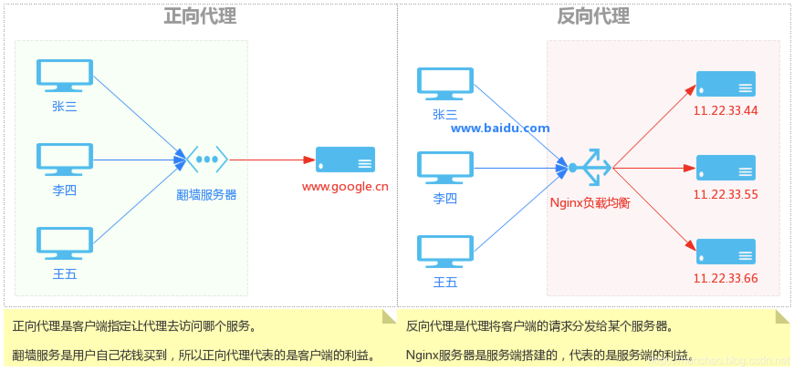

#### 1. Post 和 Get 的区别？

- post可以将参数放在url，body类请求兼容url类请求
- post请求参数的大小限制是服务器的处理能力

```
Post 和 Get 是 HTTP 请求的两种方法。

（1）从应用场景上来说，GET 请求是一个幂等的请求，一般 Get 请求用于对服务器资源不会产生影响的场景，比如说请求一个网页。而 Post 不是一个幂等的请求，一般用于对服务器资源会产生影响的情景。比如注册用户这一类的操作。

（2）get请求类似于查找的过程，用户获取数据，所以不用每次都和数据库连接，所以浏览器一般会对 Get 请求缓存。post请求一般是修改和删除操作，必须与数据库交互，所以不能使用缓存，但很少对 Post 请求缓存。

（3）从发送的报文格式来说，Get 请求的报文中实体部分为空，Post 请求的报文中实体部分一般为向服务器发送的数据。

（4）但是 Get 请求也可以将请求的参数放入 url 中向服务器发送，这样的做法相对于 Post 请求来说，一个方面是不太安全，因为请求的 url 会被保留在历史记录中。并且浏览器由于对 url 有一个长度上的限制，所以会影响 get 请求发送数据时的长度。这个限制是浏览器规定的，并不是 RFC 规定的。还有就是 post 的参数传递支持更多的数据类型。  **注意：http协议从未限制get请求的长度，只是浏览器限制了url的长度，而get请求就是在url中放置请求的参数，所以导致了get请求的长度限制**

（5）get请求，浏览器会将header和data一起发出去； post请求：浏览器先发送header,服务器响应100后，浏览器再发送data，post请求存在预检过程。
```

### 幂等

- HTTP幂等方法，是指无论调用这个URL多少次，都不会有不同的结果的HTTP方法。结果指的是服务器的资源没有变化
  - get 用于获取资源，不管调用多少次接口，结果都不会改变，所以是幂等的。
  - POST提交资源，是一个非幂等方法，它会对资源本身产生影响，每次调用都会有新的资源产生，因此不满足幂等性
  - PUT方法直接把实体部分数据替换到了服务器的资源，但我们多次调用它时，只会产生一次影响，即有相同结果的HTTP方法，所有满足幂等性

#### 2. TLS/SSL 中什么一定要用三个随机数，来生成"会话密钥"？

TLS:Transport Layer Secure

SSL:Secure Socket Layer

```
客户端和服务器都需要生成随机数，以此来保证每次生成的秘钥都不相同。

使用三个随机数，是因为 SSL 的协议不信任每个主机都能产生完全随机的数，所以需要客户端和服务器端都产生一个随机数。另外，由于SSL协议中证书是静态的，因此十分有必要引入一种随机因素来保证协商出来的密钥的随机性。

如果只使用一个伪随机的数来生成秘钥，就很容易被破解。通过使用三个随机数的方式，增加了自由度，一个伪随机可能被破解，但是三个伪随机就很接近于随机了，因此可以使用这种方法来保持生成秘钥的随机性和安全性。

个人理解：前两个随机数是明文传输的，可能被第三方截获到，后一个随机数是加密传输的，比较安全。而三个随机数产生秘钥，自由度增加。
```

#### 3. SSL 连接断开后如何恢复？

```
一共有两种方法来恢复断开的 SSL 连接，一种是使用 session ID，一种是 session ticket。

seesionID:

tcp握手阶段：客户端->(session ID,其他信息)->服务器端，服务器端查看sessionID为空，则进行完整的tcp连接，生成新的sessionID发送给客户端，客户端和服务器端均会保存该sessionID；否则将该sessionID与服务器缓存中的sessionID进行匹配，匹配到则直接进行http通话即可，无需进行tcp握手了。

浏览器会把sessionname->sessionid存到cooike中，同path下再次请求服务器时，会自动在请求头中带上cooike信息,服务器可以在_COOKIE中得取到想要的session. 

使用 session ID 的方式，服务器端保存会话信息，每一次的会话都有一个编号，当对话中断后，下一次重新连接时，只要客户端给出这个编号，服务器如果有这个编号的记录，那么双方就可以继续使用以前的秘钥，而不用重新生成一把。目前所有的浏览器都支持这一种方法。但是这种方法有一个缺点是，session ID 只能够存在一台服务器上，如果我们的请求通过负载平衡(大型应用可能会使用多个服务器，即一个域名对应了多个IP地址)被转移到了其他的服务器上，那么就无法恢复对话。

sessionTicket:

另一种方式是 session ticket 的方式客户端和服务器端建立了一次完整的握手过程后，服务器端将本次的会话数据进行加密，例如前面说到的，会话标识符、证书、密码套件和主密钥等，加密后生成一个ticket票据，并将票据通过NewSessionTicket子消息发送给客户端，由客户端来保存，下一次连接时客户端如果希望恢复上一次会话而不是重新进行握手，就将“票据”一起发送给服务器端，待服务器端解密校验无误后，进行一次简短的握手，恢复上一次会话。
```

[(8条消息) Session会话恢复：两种简短的握手总结SessionID&SessionTicket_大力海棠的博客-CSDN博客](https://blog.csdn.net/justinzengTM/article/details/105491809)

#### 4. RSA加密算法的安全性保障？

```
对极大整数做因数分解的难度决定了 RSA 算法的可靠性。

换言之，对一极大整数做因数分解愈困难，RSA 算法愈可靠。现在1024位的 RSA 密钥基本安全，2048位的密钥极其安全。
```

#### 5. DNS 为什么使用 UDP 协议作为传输层协议？

```
DNS 使用 UDP 协议作为传输层协议的主要原因是为了避免使用 TCP 协议时造成的连接时延。因为为了得到一个域名的 IP 地址，往往会向多个域名服务器查询，如果使用 TCP 协议，那么每次请求都会存在连接时延，这样使 DNS 服务变得很慢，因为大多数的地址查询请求，都是浏览器请求页面时发出的，这样会造成网页的等待时间过长。

使用 UDP 协议作为 DNS 协议会有一个问题，由于历史原因，物理链路的最小MTU = 576，所以为了限制报文长度不超过576，UDP 的报文段的长度被限制在 512 个字节以内，这样一旦 DNS 的查询或者应答报文，超过了 512 字节，那么基于 UDP 的DNS 协议就会被截断为 512 字节，那么有可能用户得到的 DNS 应答就是不完整的。这里 DNS 报文的长度一旦超过限制，并不会像 TCP 协议那样被拆分成多个报文段传输，因为 UDP 协议不会维护连接状态，所以我们没有办法确定那几个报文段属于同一个数据，UDP 只会将多余的数据给截取掉。为了解决这个问题，我们可以使用 TCP 协议去请求报文。

DNS 还存在的一个问题是安全问题，就是我们没有办法确定我们得到的应答，一定是一个安全的应答，因为应答可以被他人伪造，所以现在有了 DNS over HTTPS 来解决这个问题。

存在安全问题：
1. DNS劫持：DNS服务器给了错误的地址
2. HTTP劫持：ISP（网络服务提供商，电信，移动等）修改了IP地址，返回了错误的IP地址

DOT:DNS over TLS,使用TLS协议来传输DNS协议，TLS协议是目前最常用的安全加密协议之一。相比于之前的无连接无加密的UDP协议，TLS本身已经实现了完整性和保密性

DOH:DNS over HTTPs,使用HTTPs来传输DNS协议，DOH和DOT的安全原理相同，只不过DOH有了HTTP格式的封装，更加通用。DOH基于Http应用层协议，将查询发送到HTTPS端口上的特定HTTP端点，所以DOH的端口号就是443,而DOT的端口号是443

```

详细资料可以参考： [《为什么 DNS 使用 UDP 而不是 TCP？》](https://www.zhihu.com/question/310145373)

#### 6. 当你在浏览器中输入 Google.com 并且按下回车之后发生了什么？

```
（1）首先会对 URL 进行解析，分析所需要使用的传输协议和请求的资源的路径。如果输入的 URL 中的协议或者主机名不合法，将会把地址栏中输入的内容传递给搜索引擎。如果没有问题，浏览器会检查 URL 中是否出现了非法字符，如果存在非法字符，则对非法字符进行转义后再进行下一过程。

（2）浏览器会判断所请求的资源是否在缓存里，如果请求的资源在缓存里并且没有失效，那么就直接使用，否则向服务器发起新的请求。

（3）下一步我们首先需要获取的是输入的 URL 中的域名的 IP 地址，首先会判断本地是否有该域名的 IP 地址的缓存，如果有则使用，如果没有则向本地 DNS 服务器发起请求。本地 DNS 服务器也会先检查是否存在缓存，如果没有就会先向根域名服务器发起请求，获得负责的顶级域名服务器的地址后，再向顶级域名服务器请求，然后获得负责的权威域名服务器的地址后，再向权威域名服务器发起请求，最终获得域名的 IP 地址后，本地 DNS 服务器再将这个 IP 地址返回给请求的用户。用户向本地 DNS 服务器发起请求属于递归请求，本地 DNS 服务器向各级域名服务器发起请求属于迭代请求。

（4）当浏览器得到 IP 地址后，数据传输还需要知道目的主机 MAC 地址，因为应用层下发数据给传输层，TCP 协议会指定源端口号和目的端口号，然后下发给网络层。网络层会将本机地址作为源地址，获取的 IP 地址作为目的地址。然后将下发给数据链路层，数据链路层的发送需要加入通信双方的 MAC 地址，我们本机的 MAC 地址作为源 MAC 地址，目的 MAC 地址需要分情况处理，通过将 IP 地址与我们本机的子网掩码相与，我们可以判断我们是否与请求主机在同一个子网里，如果在同一个子网里，我们可以使用 APR 协议获取到目的主机的 MAC 地址，如果我们不在一个子网里，那么我们的请求应该转发给我们的网关，由它代为转发，此时同样可以通过 ARP 协议来获取网关的 MAC 地址，此时目的主机的 MAC 地址应该为网关的地址。

（5）下面是 TCP 建立连接的三次握手的过程，首先客户端向服务器发送一个 SYN 连接请求报文段和一个随机序号，服务端接收到请求后向服务器端发送一个 SYN ACK报文段，确认连接请求，并且也向客户端发送一个随机序号。客户端接收服务器的确认应答后，进入连接建立的状态，同时向服务器也发送一个 ACK 确认报文段，服务器端接收到确认后，也进入连接建立状态，此时双方的连接就建立起来了。

（6）如果使用的是 HTTPS 协议，在通信前还存在 TLS 的一个四次握手的过程。首先由客户端向服务器端发送使用的协议的版本号、一个随机数和可以使用的加密方法。服务器端收到后，确认加密的方法，也向客户端发送一个随机数和自己的数字证书。客户端收到后，首先检查数字证书是否有效，如果有效，则再生成一个随机数，并使用证书中的公钥对随机数加密，然后发送给服务器端，并且还会提供一个前面所有内容的 hash 值供服务器端检验。服务器端接收后，使用自己的私钥对数据解密，同时向客户端发送一个前面所有内容的 hash 值供客户端检验。这个时候双方都有了三个随机数，按照之前所约定的加密方法，使用这三个随机数生成一把秘钥，以后双方通信前，就使用这个秘钥对数据进行加密后再传输。

（7）当页面请求发送到服务器端后，服务器端会返回一个 html 文件作为响应，浏览器接收到响应后，开始对 html 文件进行解析，开始页面的渲染过程。

（8）浏览器首先会根据 html 文件构建 DOM 树，根据解析到的 css 文件构建 CSSOM 树，如果遇到 script 标签，则判端是否含有 defer 或者 async 属性，要不然 script 的加载和执行会造成页面的渲染的阻塞。如果遇到defer标签，则在DOM树构建完成后，再加载和执行该文件。如果遇到async，则该文件的加载过程和DOM树的构建异步进行，但是一旦该文件加载完毕，则会直接执行，无论DOM树是否构建完毕。当 DOM 树和 CSSOM 树建立好后，根据它们来构建渲染树。渲染树构建好后，会根据渲染树来进行布局。布局完成后，最后使用浏览器的 UI 接口对页面进行绘制。这个时候整个页面就显示出来了。

（9）最后一步是 TCP 断开连接的四次挥手过程。
```

详细资料可以参考： [《当你在浏览器中输入 Google.com 并且按下回车之后发生了什么？》](http://blog.jobbole.com/84870/)

#### 7. 谈谈 CDN 服务？

CDN : Content Delivery Network  内容分发网络

```
CDN 是一个内容分发网络，通过对源网站资源的缓存，利用本身多台位于不同地域、不同运营商的服务器，向用户提供资就近访问的功能。也就是说，用户的请求并不是直接发送给源网站，而是发送给 CDN 服务器，由 CND 服务器将请求定位到最近的含有该资源的服务器上去请求。

这样有利于提高网站的访问速度，同时通过这种方式也减轻了源服务器的访问压力。
```

详细资料可以参考： [《CDN 是什么？使用 CDN 有什么优势？》](https://www.zhihu.com/question/36514327?rf=37353035)

#### 8. 什么是正向代理和反向代理？

```
我们常说的代理也就是指正向代理，正向代理的过程，它隐藏了真实的请求客户端，服务端不知道真实的客户端是谁，客户端请求的服务都被代理服务器代替来请求。

反向代理隐藏了真实的服务器端，当我们请求一个网站的时候，背后可能有成千上万台服务器为我们服务，但具体是哪一台，我们不知道，也不需要知道，我们只需要知道反向代理服务器是谁就好了，反向代理服务器会帮我们把请求转发到真实的服务器那里去。反向代理器一般用来实现负载平衡。
```

详细资料可以参考： [《正向代理与反向代理有什么区别》](https://mp.weixin.qq.com/s/ikrI3rmSYs83wdSWqq2QIg?) [《webpack 配置 proxy 反向代理的原理是什么？》](https://segmentfault.com/q/1010000017502539/a-1020000017532348)

#### 9. 负载平衡的两种实现方式？

##### 1 DNS方式

```
	DNS 可以用于在冗余的服务器上实现负载平衡。因为现在一般的大型网站使用多台服务器提供服务，因此一个域名可能会对应多个IP地址。
	在DNS系统中有一个比较重要的的资源类型叫做主机记录也称为A记录，A记录是用于名称解析的重要记录，它将特定的主机名映射到对应主机的IP地址上。
	当用户发送请求的时候，DNS默认使用循环法在每次响应新客户端时以不同的顺序发送IP地址列表，用户一般会选择排在前面的地址发送请求。因此，不同的客户端将其请求定向到不同的服务器，从而有效地在服务器组之间分配负载。

缺点：
	1. 目前的DNS是多级解析的，每一级DNS都可能缓存A记录，当某台服务器下线之后，即使修改了A记录，要使其生效也需要较长的时间(该记录的刷新时间未到之前)，这段时间，DNS任然会将域名解析到已下线的服务器上，最终导致用户访问失败。
	2. 可能会造成额外的网络问题。为了使本DNS服务器和其他DNS服务器及时交互，保证DNS数据及时更新，使地址能随机分配，一般都要将DNS的刷新时间设置的较小，但太小将会使DNS流量大增造成额外的网络问题。
	3. 不能够按服务器的处理能力来分配负载。DNS负载均衡采用的是简单的轮询算法（不同的顺序返回IP地址列表），不能区分服务器之间的差异，不能反映服务器当前运行状态，所以其的负载均衡效果并不是太好。
```

例如：对于同一个域名，对应了三个IP地址,即A文件中对于该域名对应了3个IP地址，每次返回的顺序不一样

```
www.apusapp.com IN A 114.100.20.201;
www.apusapp.com IN A 114.100.20.202;
www.apusapp.com IN A 114.100.20.203;
```

##### 2 Nginx反向代理方式

```
	一种是使用反向代理的方式，用户的请求都发送到反向代理服务上，代理服务器根据客户端的请求，从其关联的一组或多组后端服务器上获取资源，然后再将这些资源返回给客户端，客户端只会得知反向代理的IP地址，而不知道在代理服务器后面的服务器簇的存在。
	正向代理是客户端指定代理去访问哪个服务器，反向代理是服务器端搭建的，客户端并不知道具体的服务器的IP地址，相当于服务器对外公布了该域名对应的IP地址就是Nginx代理服务器的IP地址，然后该代理服务器决定具体将请求转发给哪个实质处理请求的服务器
```



[图片来源](https://blog.csdn.net/xufengduo/article/details/100087119)

详细资料可以参考： [《负载均衡的原理》](https://mp.weixin.qq.com/s?__biz=MzA5Njc2OTg4NQ==&mid=2247483870&idx=1&sn=bab36544ec62c394c104df699cf85154&chksm=90aa43eca7ddcafa01634cefee12fd8a332250d3f49d8b6647f536c215ac297e4b6a53af8253#rd)

#### 10. http 请求方法 options 方法有什么用？

```
OPTIONS 请求与 HEAD 类似，一般也是用于客户端查看服务器的性能。这个方法会请求服务器返回该资源所支持的所有 HTTP 请求方法，该方法会用'*'来代替资源名称，向服务器发送 OPTIONS 请求，可以测试服务器功能是否正常。

JS 的 XMLHttpRequest对象进行 CORS 跨域资源共享时，对于复杂请求，就是使用 OPTIONS 方法发送嗅探请求，以判断是否有对指定资源的访问权限。
```

相关资料可以参考： [《HTTP 请求方法》](https://itbilu.com/other/relate/EkwKysXIl.html)

#### 12. 网站域名加 www 与不加 www 的区别？

详细资料可以参考： [《为什么域名前要加 www 前缀 www 是什么意思？》](https://www.f9seo.com/post-816.html) [《为什么越来越多的网站域名不加「www」前缀？》](https://www.zhihu.com/question/20414602) [《域名有 www 与没有 www 有什么区别？》](https://blog.csdn.net/andybruse/article/details/7982278)

#### 13. 即时通讯的实现，短轮询、长轮询、SSE 和 WebSocket 间的区别？

```
短轮询和长轮询的目的都是用于实现客户端和服务器端的一个即时通讯。

短轮询的基本思路就是浏览器每隔一段时间向服务器发送 http 请求，服务器端在收到请求后，不论是否有数据更新，都直接进行响应。这种方式实现的即时通信，本质上还是浏览器发送请求，服务器接受请求的一个过程，通过让客户端不断的进行请求，使得客户端能够模拟实时地收到服务器端的数据的变化。这种方式的优点是比较简单，易于理解。缺点是这种方式由于需要不断的建立 http 连接，严重浪费了服务器端和客户端的资源。当用户增加时，服务器端的压力就会变大，这是很不合理的。

长轮询的基本思路是，首先由客户端向服务器发起请求，当服务器收到客户端发来的请求后，服务器端不会直接进行响应，而是先将这个请求挂起，然后判断服务器端数据是否有更新。如果有更新，则进行响应，如果一直没有数据，则到达一定的时间限制才返回。客户端 JavaScript 响应处理函数会在处理完服务器返回的信息后，再次发出请求，重新建立连接。长轮询和短轮询比起来，它的优点是明显减少了很多不必要的 http 请求次数，相比之下节约了资源。长轮询的缺点在于，连接挂起也会导致资源的浪费。

SSE 的基本思想是，服务器使用流信息向服务器推送信息。严格地说，http 协议无法做到服务器主动推送信息。但是，有一种变通方法，就是服务器向客户端声明，接下来要发送的是流信息。也就是说，发送的不是一次性的数据包，而是一个数据流，会连续不断地发送过来。这时，客户端不会关闭连接，会一直等着服务器发过来的新的数据流，视频播放就是这样的例子。SSE 就是利用这种机制，使用流信息向浏览器推送信息。它基于 http 协议，目前除了 IE/Edge，其他浏览器都支持。它相对于前面两种方式来说，不需要建立过多的 http 请求，相比之下节约了资源。

上面三种方式本质上都是基于 http 协议的，我们还可以使用 WebSocket 协议来实现。WebSocket 是 Html5 定义的一个新协议，与传统的 http 协议不同，该协议允许由服务器主动的向客户端推送信息。使用 WebSocket 协议的缺点是在服务器端的配置比较复杂。WebSocket 是一个全双工的协议，也就是通信双方是平等的，可以相互发送消息，而 SSE 的方式是单向通信的，只能由服务器端向客户端推送信息，如果客户端需要发送信息就是属于下一个 http 请求了。
```

详细资料可以参考： [《轮询、长轮询、长连接、websocket》](https://cloud.tencent.com/developer/article/1076547) [《Server-Sent Events 教程》](http://www.ruanyifeng.com/blog/2017/05/server-sent_events.html) [《WebSocket 教程》](http://www.ruanyifeng.com/blog/2017/05/websocket.html)

#### 14. 怎么实现多个网站之间共享登录状态

```
在多个网站之间共享登录状态指的就是单点登录。多个应用系统中，用户只需要登录一次就可以访问所有相互信任的应用系统。

我认为单点登录可以这样来实现：
1. 首先将用户信息的验证中心独立出来，作为一个单独的认证中心，该认证中心的作用是判断客户端发送的账号密码的正确性，然后向客户端返回对应的用户信息，并且返回一个由服务器端秘钥加密的登录信息的token给客户端，该token 具有一定的有效时限。
2. 当一个应用系统跳转到另一个应用系统时，通过 url 参数的方式来传递token，然后转移到的应用站点发送给认证中心，认证中心对 token 进行解密后验证，如果用户信息没有失效，则向客户端返回对应的用户信息，如果失效了则将页面重定向会单点登录页面。
```

详细资料可以参考： [《HTTP 是个无状态协议，怎么保持登录状态？》](https://www.zhihu.com/question/35906139)

# Xss攻击

`XSS` 全称是 `Cross Site Scripting`(即`跨站脚本`)，为了和 CSS 区分，故叫它`XSS`。XSS 攻击是指浏览器中**执行恶意脚本**(无论是跨域还是同域)，从而拿到用户的信息并进行操作。

通常情况，XSS 攻击的实现有三种方式——**存储型**、**反射型**和**文档型**。

> - #### 存储型
>
>   `存储型`，顾名思义就是将恶意脚本存储了起来，确实，存储型的 XSS 将脚本存储到了服务端的数据库，然后在客户端执行这些脚本，从而达到攻击的效果。
>
>   常见的场景是留言评论区提交一段脚本代码，如果前后端没有做好转义的工作，那评论内容存到了数据库，在页面渲染过程中`直接执行`, 相当于执行一段未知逻辑的 JS 代码，是非常恐怖的。这就是存储型的 XSS 攻击。
>
> - #### 反射型
>
>   `反射型XSS`指的是恶意脚本作为**网络请求的一部分**，嵌入到请求的url中。
>
>   比如我输入:
>
>   ```
>   http://sanyuan.com?q=<script>alert("你完蛋了")</script>
>   复制代码
>   ```
>
>   这样在服务器端会拿到`q`参数,然后将内容返回给浏览器端，浏览器将这些内容作为HTML的一部分解析，发现是一个脚本，直接执行，这样就被攻击了。
>
>   **之所以叫它`反射型`, 是因为恶意脚本是通过作为网络请求的参数，经过服务器，然后再反射到HTML文档中，执行解析。和`存储型`不一样的是，服务器并不会存储这些恶意脚本。**比如发起请求后，跳转到了另外一个界面
>
> - #### 文档型
>
>   文档型的 XSS 攻击并不会经过服务端，而是作为中间人的角色，在数据传输过程劫持到网络数据包，然后**修改里面的 html 文档**！

避免Xss攻击：

> - 1.无论是在前端和服务端，都要对用户的输入进行**转码**或者**过滤**。
>
>   如:
>
>   ```
>   <script>alert('你完蛋了')</script>
>   复制代码
>   ```
>
>   转码后变为:
>
>   ```js
>   &lt;script&gt;alert(&#39;你完蛋了&#39;)&lt;/script&gt;
>   复制代码
>   ```
>
>   这样的代码在 html 解析的过程中是无法执行的。
>
> - #### 2.利用 HttpOnly
>
>   很多 XSS 攻击脚本都是用来窃取Cookie, 而设置 Cookie 的 HttpOnly 属性后，JavaScript 便无法读取 Cookie 的值。这样也能很好的防范 XSS 攻击。
>
> - 3.利用CSP，即浏览器中的内容安全策略
>
>   服务器决定浏览器加载哪些资源。限制其他域下的资源加载，提供上报机制，能帮助我们及时发现 XSS 攻击。

# CSRF攻击

CSRF(Cross-site request forgery), 即跨站请求伪造，指的是黑客诱导用户点击链接，打开黑客的网站，然后黑客利用用户**目前的登录状态**发起跨站请求。

> - 自动发get请求
>
>   例如我们之前登陆过一个页面，浏览器中还保留着cookie信息。如果此时点击一个图片``，进入页面后自动发送 get 请求，值得注意的是，这个请求会自动带上关于 xxx.com 的 cookie 信息,假如服务器端没有相应的验证机制，它可能认为发请求的是一个正常的用户，因为携带了相应的 cookie，然后进行相应的各种操作，可以是转账汇款以及其他的恶意操作。
>
> - 自动发post请求
>
>   黑客可能自己填了一个表单，写了一段自动提交的脚本。同样也会携带相应的用户 cookie 信息，让服务器误以为是一个正常的用户在操作，让各种恶意的操作变为可能。
>
> - #### 诱导点击发送 GET 请求
>
>   在黑客的网站上，可能会放上一个链接，驱使你来点击，点击后，自动发送 get 请求，接下来和`自动发 GET 请求`部分同理。

和`XSS`攻击对比，CSRF 攻击并不需要将恶意代码注入用户当前页面的`html`文档中，而是跳转到新的页面，利用服务器的**验证漏洞**和**用户之前的登录状态**来模拟用户进行操作。

防范措施：

> - #### 利用Cookie的SameSite属性
>
>   自动发送目标站点下的 `Cookie`,然后就是这一份 Cookie 模拟了用户的身份。在 http响应头中关于Cookie 当中有一个关键的字段，可以对请求中 Cookie 的携带作一些限制，这个字段就是`SameSite`。`SameSite`可以设置为三个值，`Strict`、`Lax`和`None`。
>
>   **a.** 在`Strict`模式下，浏览器完全禁止第三方请求携带Cookie。比如请求`sanyuan.com`网站只能在`sanyuan.com`域名当中请求才能携带 Cookie，在其他网站请求都不能。
>
>   **b.** 在`Lax`模式，就宽松一点了，但是只能在 `get 方法提交表单`况或者`a 标签发送 get 请求`的情况下可以携带 Cookie，其他情况均不能。
>
>   **c.** 在`None`模式下，也就是默认模式，请求会自动携带上 Cookie。
>
> - #### 验证来源站点
>
>   需要要用到请求头中的两个字段: **Origin**和**Referer**。
>
>   其中，**Origin**只包含域名信息，而**Referer**包含了`具体`的 URL 路径。Server 端在收到请求之后，可以去检查这个头信息，只接受来自本域的请求而忽略外部域的请求，这样就可以避免了很多风险。
>
>   当然，这两者都是可以伪造的，通过 Ajax 中自定义请求头即可，安全性略差。
>
> - #### CSRF Token
>
>   首先，浏览器向服务器发送请求时，服务器生成一个字符串token，将其植入到返回的页面中。
>
>   然后浏览器如果要发送请求，就必须带上这个token，然后服务器来验证是否合法，如果不合法则不予响应。这个字符串也就是`CSRF Token`，通常第三方站点无法拿到这个 token, 因此也就是被服务器给拒绝。

### HttpOnly

设置 HTTPOnly 属性可以防止客户端脚本通过 document.cookie 等方式访问 Cookie，有助于避免 XSS 攻击。

### SameSite

 SameSite 属性可以让 Cookie 在跨站请求时不会被发送，从而可以阻止跨站请求伪造攻击（CSRF）。
 SameSite 可以有下面三种值：
 1、Strict仅允许一方请求携带 Cookie，即浏览器将只发送相同站点请求的 Cookie，即当前网页 URL 与请求目标 URL 完全一致。
 2、Lax允许部分第三方请求携带 Cookie
 3、None无论是否跨站都会发送 Cookie
 造成现在无法获取cookie是因为之前默认是 None 的，Chrome80 后默认是 Lax。

### get请求传输数据的格式
　　在url中说明情请求的资源，比如https://www.baidu.com/com?from=self&name=xx 其中？后的数据就是请求的数据，并且连接用&，get方法也可以提交表单数据，但是提交的数据在url中，其他人可以通过查看历史记录中的url来获取你提交的数据，这样很不安全.

### post请求传输数据的格式

post请求中添加了两个请求头：`Content-type和Content-length`

> - application/x-www-form-urlencoded，form表单默认的数据格式，提交的数据按照 key1=val1&key2=val2 的方式进行编码，key 和 val 都进行了 URL 转码。大部分服务端语言都对这种方式有很好的支持。
> - **application/json**，现在越来越多的人把它作为请求头，用来告诉服务端消息主体是序列化后的 JSON 字符串。服务端语言也有很多函数去解析JSON，使用JSON可以支持更加复杂的结构化数据。
> - **multipart/form-data**，对用于在表单中上传文件时，也可以上传普通数据，只需要让from的ectyle等于multipart/form-data就可以了。

