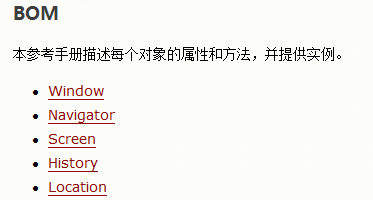
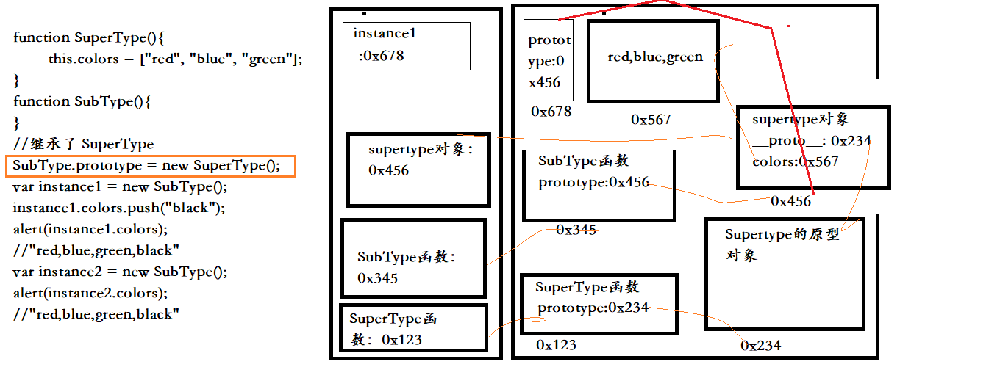
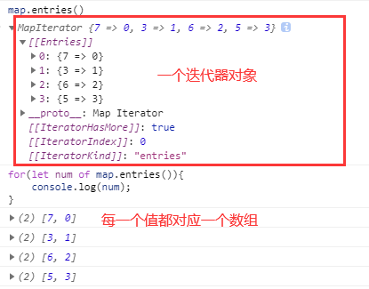

# 一、 DOM

## 1 DOM简介

```
DOM:Document Object Model 文档对象模型
	- JS中通过DOM操作html文档
	- 文档：整个html网页文档
	- 对象：将网页中的每一个部分都转换为了一个对象
	- 模型：表示对象之间的关系
- 节点Node:构成html文档的最基本单元
	- 节点分为四类：也就是四类对象
		文档节点(整个HTML文档)
		元素节点(HTML文档中的html标签)
		属性节点(元素的内容)
		文本节点(html标签中的文本内容)
		<p id="pId">This is a paragraph</p>
			其中：id属于属性节点，This is a paragraph属于文本节点
				p属于元素节点
 - 节点的属性：
	nodeName      nodeValue   nodetype
	文档节点       #document     9          null
	元素节点       标签名         1          null
	属性节点       属性名         2                         
	属性值
	文本节点       #text         3          文本内容
 通过nodetype的值可以判断节点的类型
```

## 2 事件

```
事件：
	- 文档或者浏览器窗口中发生的一些特定的交互瞬间
			比如：点击按钮，鼠标移动，关闭窗口
	- 我们可以在事件对应的属性中设置一些JS代码，这样当事件被触发时，这些代码就会执行
```

```
<body>
    <!--1 单击事件响应onclick
        像1,2这样直接把函数内容或者需要响应的函数写在结构中，出现了耦合，不推荐使用
        推荐方法3：将结构写在body中，需要响应的事件写在JS中
    -->
    <button id="btn1" onclick="alert('烦人');">我是按钮1</button>
    <!--2 双击事件相应ondblclick   dbl(double)-->
    <button id="btn2" ondblclick="btn2()">我是按钮2</button>

    <button id="btn3">我是按钮3</button>
    <script type="text/javascript">

        function btn2(){
            alert('讨厌,你点我干啥');
        }

        var btn3 = document.getElementById('btn3');
        console.log(btn3);
        btn3.onclick = function(){
            alert('嘎哈呀？？');
        }
    </script>
</body>
```

## 3 文档的加载

### 3.1 方法1(不可行)：

```
浏览器加载页面的顺序：自上向下
所以如果将script标签放在页面的上边：script中的内容先执行，此时并没有加载button，btn为null,以就不存在为其添加事件函数了
```

```
<head>
	<script>
        //获取id为btn的按钮
        var btn = document.getElementById("btn");
        console.log(btn);   // null
        // 为该按钮添加单击事件函数
        btn.onclick = function(){
            alert("hello");
        }
    </script>
</head>
<body>
    <button id="btn">点我一下</button>
</body>
```

### 3.2 方法2：

```
<body>
    <button id="btn">点我一下</button>
    <script type="text/javascript">
        /
        //获取id为btn的按钮
        var btn = document.getElementById("btn");
        console.log(btn);
        // 为该按钮添加单击事件函数
        btn.onclick = function(){
            alert("hello");
        }/
    </script>
</body>
```

### 3.3 方法3：`window.onload`

```
onload():在整个页面加载完成之后再触发
	- 为window绑定该事件,当整个页面加载完成之后触发其他的事件
```

```
<head>
	<script>
        window.onload = function(){
            //获取id为btn的按钮
            var btn = document.getElementById("btn");
            console.log(btn);
            // 为该按钮添加单击事件函数
            btn.onclick = function(){
                alert("hello");
            }
		}
    </script>
</head>
<body>
    <button id="btn">点我一下</button>
</body>
```

## 4 DOM查询

### 4.1 API

```
使用document对象调用：
    document.body:获取Body元素
    document.documentElement:获取html根标签
    document.all:页面中的所有元素，返回的是数组
        或者：document.getElementByTagName("");
    document.getElementById("id") 
        - 通过id属性获取一个元素节点的引用
    document.getElementsByName("name")
        - 通过name属性获取一组元素节点对象
        - 因为一个文档中的 name 属性可能不唯一
            （如 HTML表单中的单选按钮通常具有相同的 name 属性）
            所有 getElementsByName() 方法返回的是元素的数组
            而不是一个元素。
    document.getElementsByTagName(tagname) 
        - 通过标签名获取一组元素节点对象
        - 因为一个标签可能使用多次
```

```
使用具体的元素对象调用：获取子节点
    getElementsByTagName(tagname):
        - 返回当前节点的指定标签名
    childNodes:当前节点的所有子节点
            还包括换行造成的标签之间的空白文本节点
            但是在IE8及以下的浏览器中不会包含由于换行造成的空白文本节点
        children:获取当前节点的所有子元素，即不包括空白文本节点
            所有浏览器兼容
    firstChild:当前节点的第一个子节点
            还包括换行造成的标签之间的空白换行产生的文本节点
        firstElementChild:当前节点的第一个子元素节点，不包括空白换行文本节点
            兼容IE9+		
    lastChild:当前节点的最后一个子节点
            还包括换行造成的标签之间的空白文本节点
        lastElementChild:当前节点的最后一个子元素节点，不包括空白换行文本节点
            兼容IE9+
                使用具体的节点调用：获取兄弟节点和父节点
    parentNode:当前节点的父节点
    previousSibling:前一个兄弟节点
            还包括换行造成的标签之间的空白文本节点
        previousElementSibling:前一个兄弟元素，不包括换行
            兼容IE9+
    nextSibling:后一个兄弟节点
        nextElementSibling:后一个兄弟元素，不包括换行
            兼容IE9+
```

### 4.2 DOM查询的例子：


```
<!doctype html>
<html>
	<head>
		<meta charset="utf-8">
		<title>DOM查询练习</title>
		<!--文件名一旦是中文名，从hbuilder打开ie,不能正常显示样式-->
		<link rel="stylesheet" type="text/css" href="css/dom查询.css"/>
		<script type="text/javascript">
			/
定义一个函数，专门为指定元素绑定单击响应函数
参数：
idStr:要绑定的单级响应函数的对象的id属性值
fun:事件的回调函数，当单击元素时，该函数会被触发
/
			function myClick(idStr,fun){
				var btn = document.getElementById(idStr);
				btn.onclick = fun;
			}
			window.onload=function()
			{
				//1.查找#bj结点
				var btn01 = document.getElementById('btn01');
				btn01.onclick = function(){
					var bj = document.getElementById('bj');
					// 打印bj内部的html代码
					alert(bj.innerHTML);
				}
				//2.查找所有li结点
				var btn02 = document.getElementById('btn02');
				btn02.onclick = function(){
					// 根据标签名获取一组元素对象
					var lis = document.getElementsByTagName('li');
					// 打印数组的长度以及index为2的元素的内部文字
					alert(lis.length + lis[2].innerHTML);
				}
				//3.查找name=gender的所有结点
				var btn03 = document.getElementById('btn03');
				btn03.onclick = function(){
					var inputs = document.getElementsByName('gender');
					// 打印数组的长度以及index为0的元素的value属性
					/
		读取元素的某个属性：元素对象.属性名
		注意：class属性不能如此读取，class是保留字
		元素对象.className
		/
					alert(inputs.length + inputs[0].className);
				}
				//4.查找#city下的的所有li结点
				var btn04 = document.getElementById('btn04');
				btn04.onclick = function(){
					var c = document.getElementById('city');
					var lis = c.getElementsByTagName('li');
					// 
					alert(lis.length+lis[0].innerHTML);
				}
				//5.返回#city下的所有子结点
				var btn05 = document.getElementById('btn05');
				btn05.onclick = function(){
					var c = document.getElementById('city');
//					var child_nodes = c.childNodes;
					// childNodes还会获取到标签之间由于换行产生的空白文本
					// 这里自动将其作为了文本标签获取到了
					// 如果希望使用这个方法又不会获取到空白，就需要在html中将内容写在一行
					// 但是在IE8及以下的浏览器中不会包含由于换行造成的空白文本节点
//					alert(child_nodes.length);   //换行了  9
					var child = c.children;
					alert(child.length);   //4
//					for(var i=0; i<child_nodes.length; i++){
//						alert(child_nodes[i]);
//					}  
				}
				//6.返回#phone的第一个子结点
				var btn06 = document.getElementById("btn06");
				btn06.onclick = function(){
					var phone = document.getElementById("phone");
					var fc = phone.firstChild;
					/*firstChild 当前节点的第一个子节点
		还包括换行造成的标签之间的空白文本节点/
					fc = phone.firstElementChild;
					/*firstElementChild 当前节点的第一个子元素节点
		不包括换行造成的标签之间的空白文本节点
		兼容IE9+/
					alert(fc.innerHTML);
					
				}
				//7.返回#android的前一个兄弟结点(previousSibling)
				myClick("btn07",function(){
					var ad = document.getElementById('android');
					var ps = ad.previousSibling;
					/
		previousSibling包含空白文本节点和兄弟元素
		previousElementSibling只包含兄弟元素
		/
					ps = ad.previousElementSibling;
					alert(ps);
				})
				//8.读取#username的value属性值
				myClick("btn08",function(){
					var un = document.getElementById('username');
					var unv = un.value;
					alert(unv);
				})
				//9.设置#username的value属性值
				myClick("btn09",function(){
					var un = document.getElementById('username');
					un.value = "abcdefg";
					var unv = un.value;
					alert(unv);
				})
				//10.返回#bj的父结点(parentNode)
				myClick("btn10",function(){
					var bj = document.getElementById('bj');
					var pn = bj.parentNode;
					alert(pn.innerHTML); // 获取元素的内容，包含标签和文本
					alert(pn.innerText); // 获取元素内部的文本内容,不包含标签
				});
				//11.返回#bj的文本值
				myClick("btn11",function(){
					var bj = document.getElementById('bj');
					//
					alert(bj.innerText);
					// 或者
					alert(bj.innerHTML);
					// 或者   获取bj中的文本节点
					var fc = bj.firstChild;
					alert(fc);
					alert(fc.nodeValue);
				})
				//12.补充,获取body标签
				myClick("btn12",function(){
					/方法1:
					由于使用getElementsByTagName方法获取到的是一个数组
					 但是很明显一个html文件中只会有一个Body,所以这里使用一个[0]
					 获取它的第一个元素/
					var bd = document.getElementsByTagName('body')[0];
					/方法2：使用document.body属性/
					bd = document.body;
					alert(bd);
				})
				//13.获取html标签
				myClick("btn13",function(){
					/
		方法1：
		/
					var html = document.getElementsByTagName('html')[0];
					/方法2：使用document.htmlElement属性/
					html = document.documentElement;
					alert(html);
				})
			};	  
		</script>
	</head>

	<body>
		<div id="total">
			<div class="inner">
				<p>你喜欢哪个城市?</p>
				<ul id="city">
					<li id="bj">北京</li>
					<li>上海</li>
					<li>深圳</li>
					<li>南京</li>
				</ul>
				<br/></br/>
				<p>你喜欢哪款单机游戏?</p>
				<ul id="game">
					<li id="hj">红警</li>
					<li>实况</li>
					<li>飞车</li>
					<li>魔兽</li>
				</ul>
				<br/></br/>
				<p>你手机操作系统是?</p>
				<ul id="phone">
					<li>IOS</li>
					<li id="android">android</li>
					<li class="li3">windows phone</li>
				</ul>
			</div>
			<div class="inner1">
				gender:
				<input class="hello" type="radio" name="gender" value="male">male
				<input class="hello" type="radio" name="gender" value="female">female
				<br/><br/>
				name:
				<input type="text" name="name" id="username" value="abcde">
			</div>
		</div>
		<div id="btnlist">
			<div><button  id="btn01">查找#bj结点</button></div>
			<div><button  id="btn02">查找所有li结点</button></div>
			<div><button  id="btn03">查找name=gender的所有结点</button></div>
			<div><button  id="btn04">查找#city下的的所有li结点</button></div>
			<div><button  id="btn05">返回#city下的所有子结点</button></div>
			<div><button  id="btn06">返回#phone的第一个子结点</button></div>
			<div><button  id="btn07">返回#Android的前一个兄弟结点</button></div>
			<div><button  id="btn08">读取#username的value属性值</button></div>
			<div><button  id="btn09">设置#username的value属性值</button></div>
			<div><button  id="btn10">返回#bj的父结点</button></div>
			<div><button  id="btn11">返回#bj的文本值</button></div>
			<div><button  id="btn12">获取body标签</button></div>
			<div><button  id="btn13">获取html标签</button></div>
		</div>
	</body>
</html>
```

### 4.3 图片切换：


```
<!DOCTYPE html>
<html>
	<head>
		<meta charset="UTF-8">
		<title></title>
		<style>
			{
				margin:0px;
				padding: 0px;
			}
			#outer{
				width:500px;
				margin:500px auto;
				background-color: greenyellow;
				padding: 10px;
				text-align: center;
			}
			img{
				padding-top: 10px;
			}
		</style>
		<script type="text/javascript">
			window.onload = function(){
				/
	点击按钮切换图片
	也就是要修改img标签的src属性
	/
				var prev = document.getElementById('prev');
				var next = document.getElementById('next');
				
				// 获取id为info的p标签
				var info = document.getElementById("info");
				// 获取img标签
				var img = document.getElementsByTagName("img")[0];
				// 创建一个数组保存文件的路径
				var imgArr = ["img/1.jpg","img/2.jpg","img/3.jpg","img/4.jpg"];
				// 创建一个变量保存当前正在显示的图片的索引
				var index = 0;
				// 为p标签添加提示文字
				info.innerHTML = "一共"+imgArr.length+"张图片，这是第"+(index+1)+'张';
				//分别为两个按钮添加单击响应函数
				prev.onclick = function(){
					/
		切换到上一张，索引自减
		/
					// 切换图片就是修改img标签的src属性
					index--;
					if(index<0){
						index = imgArr.length-1;
					}
					img.src = imgArr[index];
					// 修改p标签的提示文字
					info.innerHTML = "一共"+imgArr.length+"张图片，这是第"+(index+1)+'张';
				}
				next.onclick = function(){
//					alert('下一张');
					/
		切换到下一张，索引自增
		/
					// 切换图片就是修改img标签的src属性
					index++;
					if(index > imgArr.length-1){
						index = 0;
					}
					img.src = imgArr[index];
					// 修改p标签的提示文字
					info.innerHTML = "一共"+imgArr.length+"张图片，这是第"+(index+1)+'张';
				}
			}
		</script>
	</head>
	<body>
		<div id="outer">
			<p id="info"></p>
			
			<button id="prev">上一张</button>
			<button id="next">下一张</button>
		</div>
		
	</body>
</html>
```

全选练习：


```
<!DOCTYPE html>
<html>
	<head>
		<meta charset="UTF-8">
		<title>全选练习</title>
		<script type="text/javascript">
			window.onload = function(){
				
				// 首先获取四个button对象
				var checkedAllBtn = document.getElementById("checkedAllBtn");
				var checkedNoBtn = document.getElementById("checkedNoBtn");
				var checkedRevBtn = document.getElementById("checkedRevBtn");
				var sendBtn = document.getElementById("sendBtn");
				
				// 获取全选/全不选对象
				var checkedAllBox = document.getElementById("checkedAllBox");
				
				// 获取四个多选框对象items
				var items = document.getElementsByName("items");
				
				// 1.#checkedAllBtn全选
				/
	点击按钮之后四个多选框全被选中
	/
				checkedAllBtn.onclick = function(){
					//遍历items
					for(var i=0;i<items.length; i++){
						// 使用checked属性，可以获取和设置多选框的选中状态
						// 设置为true,即选中
						items[i].checked = true;
					}
					// 当单击全选按钮之后，将全选/全不选也设置为选中状态
					checkedAllBox.checked = true;
				}
				
				
				// 2.#checkedNoBtn
				
				checkedNoBtn.onclick = function(){
					
					//遍历items
					for(var i=0;i<items.length; i++){
						items[i].checked = false;
					}
					// 当单击全不选按钮之后，将全选/全不选也设置为未选中状态
					checkedAllBox.checked = false;
				}
				
				
				// 3.#checkedRevBtn
				
				checkedRevBtn.onclick = function(){
					
					//遍历items
					for(var i=0;i<items.length; i++){
						if(items[i].checked){
							items[i].checked = false;
						}else{
							items[i].checked = true;
						}	
					}
					
					// 当单击items之后，所有复选框均处于选中状态，则将全选/全不选设置为选中
					// 当单击items之后，所有复选框均处于未选中状态，则将全选/全不选设置为未选中
					/*if(items[0].checked && items[1].checked && items[2].checked && items[3].checked){
						checkedAllBox.checked = true;
					}else{
						checkedAllBox.checked = false;
					}/
					
					// 或者：
					checkedAllBox.checked = true;
					for(var j=0 ; j<items.length ; j++){
						if(!items[j].checked){ 
							// 只要有一个不是全选状态，则将全选/全不选设置为false
							checkedAllBox.checked = false;
							break;
						}
					}
				}
				
				
				// 4.#sendBtn
				/
	点击按钮后，提交选中的多选框的value属性值弹出
	/
				
				sendBtn.onclick = function(){
					
					//遍历items
					for(var i=0;i<items.length; i++){
						// 判断多选框是否选中
						if(items[i].checked){
							alert(items[i].value);
						}			
					}
				}
				
				
				// 5.#checkedAllBox
				/
	当它选中时，其余的多选框也全选中
	当它不选中时，其余的多选框也不选中
	/
				
				
				checkedAllBox.onclick = function(){
					/*alert(this); //this是input元素对象,也就是checkedAllBox
					alert(this == checkedAllBox); //true
					在事件的响应函数中，响应函数是给谁绑定的，this就是谁
					 /
					if(checkedAllBox.checked){
						checkedAllBtn.onclick();
					}else{
						checkedNoBtn.onclick();
					}
					// 或者
					/
		for(var i=0;i<items.length; i++){
		items[i].checked = checkedAllBox.checked;
		// 或者
		items[i].checked = this.checked;
		}
		/
				}
				
				
				// 6.#items
				/
	在点击了全选/全不选按钮后，所有复选框均全选状态
	去掉任何一个复选框的全选状态，全选/全不选需要改变为未选中状态
	/
				
				
				for(var i=0;i<items.length; i++){ 
					items[i].onclick = function(){
						/
			首先将全选/全不选设置为true,然后进入for循环判断
			一旦找到一个为false的复选框，则将全选/全不选设置为false
			/
						checkedAllBox.checked = true;
						for(var j=0 ; j<items.length ; j++){
							if(!items[j].checked){ 
								// 只要有一个不是全选状态，则将全选/全不选设置为false
								checkedAllBox.checked = false;
								break;
							}
						}
					}
				}
			}
		</script>
	</head>
	<body>
		<!--添加表单项-->
		<from method="post" action="">
			你爱好的运动是：
			<input type="checkbox" id="checkedAllBox"/>全选/全不选
			<br />
			<input type="checkbox" name="items" value="足球"/>足球
			<input type="checkbox" name="items" value="篮球"/>篮球
			<input type="checkbox" name="items" value="羽毛球"/>羽毛球
			<input type="checkbox" name="items" value="乒乓球"/>乒乓球
			<br />
			<input type='button' id="checkedAllBtn" value="全 选" />
			<input type='button' id="checkedNoBtn" value="全不选" />
			<input type='button' id="checkedRevBtn" value="反 选" />
			<input type='button' id="sendBtn" value="提 交" />
			
		</from>
	</body>
</html>
```

## 5 DOM查询的其他方法

```
根据元素的class属性值查询一组元素节点对象
	getElementsByClassName()
		- 根据元素的类属性获取一组元素对象
		- 这个方法返回的是一个元素节点属性
		- 兼容IE9+
		- 目前还需要兼容IE8，所以这个方法少用				 
```

```
document.querySelector()
	- 需要一个选择器的字符串(可以是类名，也可以是id)作为参数
    - 可以根据一个css选择器来查询一个元素节点对象
    - 兼容IE8+
    - 此方法只会返回第一个元素
```

```
document.querySelectorAll():
    - 返回一组符合选择器条件的元素对象
    - 即使只有一个元素对象符合要求，也会返回一个NodeList
    - 兼容IE8+
```

## 6 DOM增删改查

### 6.1 API

```
document调用：
	createElement(tagName) 创建元素节点
		- 返回创建好的对象
	createTextNode(str) 创建文本节点
```

```
元素对象调用：
	父节点.appendChild(子节点) 
		- 把新的子节点添加到指定节点
	还可以通过innerHTML增加子节点，但是这种方法会改变所有的子节点
		一旦其他的子节点绑定了事件就会受到影响
			例如，添加一个列表项：使用+=符号
				city.innerHTML += "<li>广州</li>";
	父节点.insertBefore(new子节点，指定子节点) 
		- 在指定的子节点前面插入新的子节点
	父节点.replaceChild(new子节点，指定子节点) 
		- 替换指定子节点
	父节点.removeChild(子节点) 
		- 删除子节点
	若是未知子元素的父元素，则可以通过parentNode先获取父节点:
		子节点.parentNode.removeChild(子节点) 	
    createAttribute() 创建属性节点。  
    getAttribute() 返回指定的属性值。 
    setAttribute() 把指定属性设置或修改为指定的值。 
```

### 6.2 添加删除记录练习:


```
<!DOCTYPE html>
<html>
	<head>
		<meta charset="UTF-8">
		<title></title>
		<link rel="stylesheet" href="css/dom增删改.css" />
		<script type="text/javascript">
			
			// 为btn对象增加单击事件函数
			function myClick(idStr,fun){
				var btn = document.getElementById(idStr);
				btn.onclick = fun;
			}
			
			window.onload = function(){
				// 1.创建一个"广州"节点,添加到#city下
				myClick("btn01",function(){
					
					// 创建广州节点<li>广州</li>
					// 1:创建广州元素节点 2：创建广州文本节点 3：将文本节点添加到li中
					var li = document.createElement("li");
					
					// li.innerHTML = "广州";代替下面两句
					var str = document.createTextNode("广州");
					li.appendChild(str);
					
					// 将广州节点添加到city下
					var city = document.getElementById("city");
					city.appendChild(li);
				})
				
				// 2.将"广州"节点插入到#bj前面
				
				myClick("btn02",function(){
					// 创建广州节点<li>广州</li>
					// 1:创建广州元素节点 2：创建广州文本节点 3：将文本节点添加到li中
					var li = document.createElement("li");
					var str = document.createTextNode("广州");
					li.appendChild(str);
					
					// 将"广州"节点插入到#bj前面
					var bj = document.getElementById("bj");
					var city = document.getElementById("city");
					city.insertBefore(li,bj); 
				})
				
				// 3.使用"广州"节点替换#bj节点
				
				myClick("btn03",function(){
					// 创建广州节点<li>广州</li>
					// 1:创建广州元素节点 2：创建广州文本节点 3：将文本节点添加到li中
					var li = document.createElement("li");
					var str = document.createTextNode("广州");
					li.appendChild(str);
					
					// 使用"广州"节点替换#bj节点
					var bj = document.getElementById("bj");
					var city = document.getElementById("city");
					city.replaceChild(li,bj);
				})
				
				//4.删除#bj节点
				myClick("btn04",function(){
					
					var bj = document.getElementById("bj");
					var city = document.getElementById("city");
					city.removeChild(bj);
					
					/
		若是未知子元素的父元素，则可以通过parentNode先获取父节点
		bj.parentNode.removeChild(bj);
		/
				})
				
				//5.读取#city内的HTML代码
				myClick("btn05",function(){
					
					var city = document.getElementById("city");
					alert(city.innerHTML);
				})
				
				// 6.设置#bj内的HTML代码
				
				myClick("btn06",function(){
					
					var bj = document.getElementById("bj");
					bj.innerHTML = "BeiJing";
				})
				
				// 6.通过innerHTML添加“广州”节点
				
				myClick("btn07",function(){
					
					var city = document.getElementById("city");
					city.innerHTML += "<li>广州</li>";
				})
			}
		</script>
		
	</head>
	<body>
		<div id="total">
			<div id="inner">
				<p>你喜欢哪个城市?</p>
				<ul id="city">
					<li id="bj">北京</li>
					<li>上海</li>
					<li>东京</li>
					<li>首尔</li>
				</ul>
			</div>
			<div id="btnList">
	            <div><button id="btn01">创建一个"广州"节点,添加到#city下</button></div>
	            <div><button id="btn02">将"广州"节点插入到#bj前面</button></div>
	            <div><button id="btn03">使用"广州"节点替换#bj节点</button></div>
	            <div><button id="btn04">删除#bj节点</button></div>
	            <div><button id="btn05">读取#city内的HTML代码</button></div>
	            <div><button id="btn06">设置#bj内的HTML代码</button></div>
	            <div><button id="btn07">通过innerHTML添加“广州”节点</button></div>
	        </div>
		</div>	
	</body>
</html>
```

### 6.3 增加删除练习：


```
<!DOCTYPE html>
<html>
	<head>
		<meta charset="UTF-8">
		<title></title>
		<link rel="stylesheet" href="css/09增删改练习.css" />
		<script type="text/javascript">
			window.onload = function(){
				
				//1.点击超链接之后删除该行员工的信息
				
				<!-- // 获取超链接对象 -->
				var allA = document.getElementsByTagName("a");
				for(var i=0 ; i<allA.length ; i++){
					//for循环在页面加载完成之后会立即执行，为元素a添加响应程序，但不执行
					// for循环执行到 i =2时不满足条件，停止执行
					// 响应函数只有在单击时才会执行
					// 所以在单击之前，i已经变成了2
					allA[i].onclick = function(){
						/
			单击超链接之后删除对应行
			点击哪个超链接，this就是谁
			/
						alert(i);
//						alert(this);
						// 获取当前的tr元素
						var tr = this.parentNode.parentNode;
						
						/
			删除之前弹出一个提示框,confirm提供带有一段消息和一个确认按钮，一个取消按钮的提示框
			alert只有一个确认按钮
			confirm会返回true或者false,如果点击确定，返回true
			/
						// 获取要删除的员工的名字
						var td = tr.getElementsByTagName("td")[0];
						var name = td.innerHTML;
						
						var r = confirm("确认删除"+name+"的信息吗？");
						if(r){
							// 删除tr元素
							tr.parentNode.removeChild(tr);
						}
						
						/
			点击超链接之后，超链接会默认跳转到另一个页面
			但是此时我们不想它跳转，可以在响应函数的最后添加return false取消该行为
			或者在html页面中：<a href="javascript:;">delete</a>
			/
						return false;
					}
				}
			
				
				//2.点击submit将员工的信息添加到表格中
				/
	添加类似于这样的内容：
	<tr>
						<th>Name</th>
						<th>Email</th>
						<th>Salary</th>
						<th>&nbsp;</th>
					</tr>
	/
				
				// 为提交按钮增加单击事件响应函数
				var addEmpButton = document.getElementById("addEmpButton");
				addEmpButton.onclick = function(){
					
					// 获取用户填写的员工信息
					var empName = document.getElementById("empName").value;
					var email = document.getElementById('email').value;
					var salary = document.getElementById('salary').value;
//					alert(name+email+salary);
					
					/
		简单点的方式：
		var tr = document.createElement("tr");
						tr.innerHTML = "<td>"+empName+"</td>"+
										"<td>"+email+"</td>"+
										"<td>"+salary+"</td>"+
										"<td><a href='javascript:;'>delete</a></td>";
						var tbody = employeetable.getElementsByTagName("tbody")[0];
						tbody.appendChild(tr);
						然后为a添加单击事件函数
						
						// 注意不能直接使用innerHTML为tbody添加tr,这样会导致其他的tr的事件不能执行
		/
					
					// 创建tr元素
					var tr = document.createElement("tr");
					
					var td1 = document.createElement("td");
					td1.innerHTML = empName;
					
					var td2 = document.createElement("td");
					td2.innerHTML = email;
					
					var td3 = document.createElement("td");
					td3.innerHTML = salary;
					
					var td4 = document.createElement("td");
					var a = document.createElement('a');
					a.innerHTML = "delete";
					a.href = "javascript:;";
					td4.appendChild(a);
					
					tr.appendChild(td1);
					tr.appendChild(td2);
					tr.appendChild(td3);
					tr.appendChild(td4);
					
					var employeetable = document.getElementById("employeetable");
					
					 / 注意我们在创建表格时，直接将tr放在employeetable中
		但是浏览器会自动为我们添加一个tbody属性，并且将tr放在tbody中
		如果我们新增加的元素直接放在employeetable中，在浏览器中会和tbody成为同一级
		虽然显示上没有区别，但可能造成样式的不同
		所以我们直接将tr放在tbody中/
					 
					// 获取tbody元素：
					var tbody = employeetable.getElementsByTagName("tbody")[0];
					tbody.appendChild(tr);
					
					// 为a添加单击事件响应程序
					a.onclick = function(){
						var tr = this.parentNode.parentNode;
						// 获取要删除的员工的名字
						var td = tr.getElementsByTagName("td")[0];
						var name = td.innerHTML;
						
						var r = confirm("确认删除"+name+"的信息吗？");
						if(r){
							// 删除tr元素
							tr.parentNode.removeChild(tr);
						}
					}
				}
			}
		</script>
	</head>
	<body>
		<div id="total">
			<table id="employeetable">
				<tr>
					<th>Name</th>
					<th>Email</th>
					<th>Salary</th>
					<th>&nbsp;</th>
				</tr>
				<tr>
					<td>Lucy</td>
					<td>lucy@lucy.com</td>
					<td>10000</td>
					<td><a href="javascript:;">delete</a></td>
				</tr>
				<tr>
					<td>Bob</td>
					<td>boy@boy.com</td>
					<td>7500</td>
					<td><a href="deleteEmp?id=002">delete</a></td>
				</tr>
			</table>
			<div id="formDiv">
				<h4>添加新员工</h4>
				<table>
					<tr>
						<td class="word">name:</td>
						<td class="inp">
							<input type="text" name="empName" id="empName"/>
						</td>
					</tr>
					
					<tr>
						<td class="word">email:</td>
						<td class="inp">
							<input type="text" name="email" id="email"/>
						</td>
					</tr>
					
					<tr>
						<td class="word">salary:</td>
						<td class="inp">
							<input type="text" name="salary" id="salary"/>
						</td>
					</tr>
					<tr>
						<td colspan="2" align="center">
							<button id="addEmpButton">
								Submit
							</button>
						</td>
					</tr>
				</table>
			</div>
		</div>
		
	</body>
</html>
```

## 7 DOM修改css样式

```
通过JS修改元素的样式：
	元素.style.样式名 = 样式值;
	
我们通过style属性设置的样式均是内联样式:
	内联样式：<p style="color:red;">hello</p>  中的color>
	所以优先级高，会立即显示
通过style属性读取到的样式也是内联样式
	不能读取到<style>标签中的样式

注意：如果CSS样式名中存在-号，这在script中不合法,需要将这种样式名修改为驼峰命名法
去掉-号，大写-后的字母
```

```
box1.style.width = "100px";
box1.style.height = "100px";
box1.style.backgroundColor = "yellow";
box1.style.border = "3px solid black";
box1.style.padding = "10px";
box1.style.margin = "10px";
```

## 8 获取样式表中的样式

```
获取元素当前显示的样式：
	元素.currentStyle.样式名
		- 只支持IE
		- 只能读取属性，不能修改，
修改只能用元素.style.样式名
```

```
GetComputedStyle(元素,伪元素(一般写null))
	- 返回这个元素的样式对象
	- IE9+
	- 对象中封装了当前元素的样式
	- 只能读取属性，不能修改
修改只能用元素.style.样式名
	- 在获取元素的宽度和高度时，只是包含内容区
```

## 9 其他样式操作的属性

### 9.1 API

```
element.clientHeight  
	- 返回元素的可见高度(包括内容区和内边距),只能获取不能修改
element.clientWidth  
	- 返回元素的可见宽度(包括内容区和内边距),只能获取不能修改

element.offsetHeight 
	- 返回元素的高度(包含内容区，内边距和边框),只能获取不能修改
element.offsetWidth 
	- 返回元素的宽度(包含内容区，内边距和边框),只能获取不能修改

element.offsetParent 
	- 获取当前元素的定位父元素,返回的是元素节点对象
	- 获取的是   距离当前元素最近的   开启了定位的(position不是默认的)   祖先元素
		如果所有祖先元素均没有开启定位，则会返回body对象

element.offsetLeft 
	- 当前元素(边框)相对于其定位祖先元素的水平偏移位置

element.offsetTop
	- 当前元素(边框)相对于其定位祖先元素的垂直偏移位置
	
element.scrollHeight 
	- 获取整个滚动区域的高度。
element.scrollWidth 
	- 获取整个滚动区域的宽度。

element.scrollLeft 
	- 获取水平滚动条滚动的距离
element.scrollTop 
	- 获取垂直滚动条滚动的距离

当满足：scrollHeight - scrollTop == clientHeight :垂直滚动条滚动到底部了
		即垂直滚动条的长度 = clientHeight
当满足：scrollWidth - scrollLeft == clientWidth :水平滚动条滚动到最右边了
		即水平滚动条的长度 = clientWidth
作用：当注册时，经常会需要同意一大堆的协议，所以就会出现垂直滚动条，我们需要将垂直滚动条
		拖动到最下面之后，才可以点击同意按钮，此时就会用到这个判断等式：
```


### 9.2 滚动条协议练习


```
<!DOCTYPE html>
<html>
	<head>
		<meta charset="UTF-8">
		<title></title>
		<style type="text/css">
			#info{
				width:200px;
				height: 200px;
				background-color: #bfa;
				overflow: auto;
			}
		</style>
		<script type="text/javascript">
			window.onload = function(){
				// 当滚定条滚动到底时，表单项可用
				/
				查看滚动条是否滚动
				onscroll()
	/
				var inputs = document.getElementsByTagName("input")
				var cb = document.getElementById('cb');
				// 查看滚动条是否滚动
				info.onscroll = function(){
					// 判断是否滚动到底
					if(info.scrollHeight - info.scrollTop == info.clientHeight){
						// 使得表单项可用
						inputs[0].disabled = false;
						inputs[1].disabled = false;
					}
				}
				inputs[1].onclick = function(){
					if(inputs[0].checked == false){
						confirm('请勾选“同意”选项');
					}else{
						confirm('请进行下一步安装');
					}
					return false;
				}
			}
		</script>
	</head>
	<body>
		<h3>欢迎亲爱的用户注册</h3>
		<p id="info">
			亲爱的用户，请仔细阅读以下协议，如果你不仔细阅读，你就别注册；
			亲爱的用户，请仔细阅读以下协议，如果你不仔细阅读，你就别注册；
			亲爱的用户，请仔细阅读以下协议，如果你不仔细阅读，你就别注册；
			亲爱的用户，请仔细阅读以下协议，如果你不仔细阅读，你就别注册；
			亲爱的用户，请仔细阅读以下协议，如果你不仔细阅读，你就别注册；
			亲爱的用户，请仔细阅读以下协议，如果你不仔细阅读，你就别注册；
			亲爱的用户，请仔细阅读以下协议，如果你不仔细阅读，你就别注册；
			亲爱的用户，请仔细阅读以下协议，如果你不仔细阅读，你就别注册；
			亲爱的用户，请仔细阅读以下协议，如果你不仔细阅读，你就别注册；
			亲爱的用户，请仔细阅读以下协议，如果你不仔细阅读，你就别注册；
			亲爱的用户，请仔细阅读以下协议，如果你不仔细阅读，你就别注册；
			亲爱的用户，请仔细阅读以下协议，如果你不仔细阅读，你就别注册；
			亲爱的用户，请仔细阅读以下协议，如果你不仔细阅读，你就别注册；
			亲爱的用户，请仔细阅读以下协议，如果你不仔细阅读，你就别注册；
			亲爱的用户，请仔细阅读以下协议，如果你不仔细阅读，你就别注册；
			亲爱的用户，请仔细阅读以下协议，如果你不仔细阅读，你就别注册；
			亲爱的用户，请仔细阅读以下协议，如果你不仔细阅读，你就别注册；
			亲爱的用户，请仔细阅读以下协议，如果你不仔细阅读，你就别注册；
			亲爱的用户，请仔细阅读以下协议，如果你不仔细阅读，你就别注册；
			亲爱的用户，请仔细阅读以下协议，如果你不仔细阅读，你就别注册；
			亲爱的用户，请仔细阅读以下协议，如果你不仔细阅读，你就别注册；
			亲爱的用户，请仔细阅读以下协议，如果你不仔细阅读，你就别注册；
			亲爱的用户，请仔细阅读以下协议，如果你不仔细阅读，你就别注册；
			亲爱的用户，请仔细阅读以下协议，如果你不仔细阅读，你就别注册；
			亲爱的用户，请仔细阅读以下协议，如果你不仔细阅读，你就别注册；
			亲爱的用户，请仔细阅读以下协议，如果你不仔细阅读，你就别注册；
			亲爱的用户，请仔细阅读以下协议，如果你不仔细阅读，你就别注册；
			亲爱的用户，请仔细阅读以下协议，如果你不仔细阅读，你就别注册；
			亲爱的用户，请仔细阅读以下协议，如果你不仔细阅读，你就别注册；
			亲爱的用户，请仔细阅读以下协议，如果你不仔细阅读，你就别注册；
			亲爱的用户，请仔细阅读以下协议，如果你不仔细阅读，你就别注册；
			亲爱的用户，请仔细阅读以下协议，如果你不仔细阅读，你就别注册；
		</p>
		<!--加入disabled属性：
				true/disabled:表单项将不可用，不可点击
				false:表单项恢复正常
		--> 
		<form action="#" method="post">
			<input type="checkbox" id="cb" disabled="disabled"/>我已仔细阅读协议，一定遵守<br />
			<input type="submit" value="submit" disabled="disabled"/>
		</form>
	</body>
</html>
```

## 10 事件

### 10.1 事件对象

```
当事件的响应函数被触发时，浏览器（IE9+）每次都会将一个事件对象作为实参传递给响应函数；在事件对象中封装了当前事件的一切信息，比如鼠标的坐标，键盘哪个按键被按下 鼠标滚轮滚动的方向
    使用：event.属性名(IE9+)
在IE8及以下浏览器中，是将事件对象直接作为window对象的属性保存的,所以需要使用window.event.属性名(但是火狐不支持)

为了兼容两者就需要判断:event = event || window.event;
```

#### 10.1.1 显示鼠标在图框1中的位置


```
clientX 返回当事件被触发时，鼠标指针的水平坐标。 
		- 相对于窗口
clientY 返回当事件被触发时，鼠标指针的垂直坐标。

pageX,pageY:返回鼠标相对于页面的偏移量
        - 兼容IE9+
        - 所以如果需要兼容IE8，就不能使用
        - 页面：滚动条滑动，页面顶部也滑动
        - 窗口：滚动条怎么变化，窗口始终不变
```


```
<!DOCTYPE html>
<html>
	<head>
		<meta charset="utf-8" />
		<title></title>
		<style type="text/css">
			#areaDiv{
				border:1px solid black;
				height: 100px;
				width: 200px;;
			}
			#showMsg{
				margin-top: 10px;
				border:1px solid black;
				height: 30px;
				width: 200px;;
			}
		</style>
		<script type="text/javascript">
			window.onload = function(){
				/
				当鼠标在areaDiv中移动时
				在showMsgDiv中显示鼠标的坐标
	/
				var areaDiv = document.getElementById("areaDiv");
				var showMsg = document.getElementById("showMsg");
				/
				查看鼠标是否移动 onmousemove()
				鼠标在元素中移动时被处罚
	/
				areaDiv.onmousemove = function(event){
					// 在showMsgDiv中显示鼠标的坐标
					
					// 1. 获取鼠标的坐标
					if(!event){
						// 判断如果没有传入event对象参数，则令event等于window.event
						event = window.event;
					}
					// 或者event = event || window.event;
					var x = event.clientX;
					var y = event.clientY;
					
					// 2 显示鼠标的坐标
					showMsg.innerHTML = ("x="+x+",y="+y);
				}
			}
		</script>
	</head>
	<body>
		<div id="areaDiv">
			
		</div>
		<div id="showMsg">
			
		</div>
	</body>
</html>
```

#### 10.1.2 div随鼠标移动

鼠标去哪里，div块就跟着去哪里

```
很简单，想到直接为div块开启绝对定位，然后将left设置为鼠标相对于窗口左侧的距离，top设置为鼠标相对于窗口顶部的距离
但是存在问题：
	1 为div块开启绝对定位，则left,top等偏移量就是相对于其包含块，但是由于div块之外的元素均没有开启定位，则偏移量就是相对于html页面的。
	2 比如：页面的高度为2000px  窗口的高度只有1200px
	  则当我们向上滑动页面1600px，此时scrollTop=400px,则当我们的鼠标放在窗口的左上角时，由于clientY是相对于窗口的，则clientY=0,则会导致top=0,从而div块出现在下图中的实线div块中
```


```
<!DOCTYPE html>
<html>
	<head>
		<meta charset="UTF-8">
		<title></title>
		<style type="text/css">
			{
				margin: 0px;
				padding: 0px;
			}
			body{
				height: 1000px;
				width: 2000px;
			}
			#box1{
				width: 100px;
				height: 100px;
				background-color: red;
				position: absolute;
			}
		</style>
		<script type="text/javascript">
			window.onload = function(){
				// div块随着鼠标移动位置,鼠标在哪，红色方框在哪
				
				// 1.检查鼠标是否移动
				var box1 = document.getElementById("box1");
				document.onmousemove = function(event){
					
					// 01.获取到鼠标的坐标
					event = event || window.event;
					
					// 获取鼠标在可见窗口的坐标，滑动滚动条之后，窗口顶部不会变
					// div偏移量是相对于整个页面而言的，滑动滚动条之后，页面顶部也会滑动
					// 所以当我们滑动滚动条之后，鼠标和div显示就不在一个位置了，其实参照物不同
					
					var left = event.clientX;
					var top = event.clientY;
					
					/
					改进1：
					为了解决这个问题，我们选取参照于页面的偏移量计算:pageX pageY
							var left = event.pageX;
							var top = event.pageY;
					但是这个方法不兼容IE8,所以不能使用
					
					改进2：
					我们发现页面的偏移量 = 窗口的偏移量 + 窗口的滚动条滚动的距离
					
					但是火狐认为浏览器的滚动条是html的，html.scrollTop
					chrome认为浏览器的滚动条是body的，body.scrollTop
					所以需要进行判断：兼容二者
		/ 

					var st = document.body.scrollTop;
					if(!st){
					 	st = document.documentElement.scrollTop;
					}
					/
					或者：var st = document.body.scrollTop || document.documentElement.scrollTop;
					var sl = document.body.scrollLeft || document.documentElement.scrollLeft;
		/
					
					var sl = document.body.scrollLeft || document.documentElement.scrollLeft;
					// 02.设置div的偏移量,需要开启box1的绝对定位
					box1.style.left = left + sl +"px";
					box1.style.top = top + st +"px";
				} 
			}
		</script>
		
	</head>
	<body>
		<div id="box1"></div>
	</body>
</html>
```

### 10.2 事件的冒泡

```
事件冒泡：
	- 所谓的冒泡：就是事件的向上传导，当后代元素上的事件被触发时，其祖先元素的相同事件也会被触发
	- 大部分情况下冒泡是有利的
	- 如果不希望发生事件冒泡，可以通过事件发生对象取消冒泡
		- cancelBubble:true(取消) false(不取消)		
```
例子：

```
点击span:依次执行span的单击响应函数->box1的单击响应函数->body的单击响应函数
```


```
<!DOCTYPE html>
<html>
	<head>
		<meta charset="UTF-8">
		<title></title>
		<style type="text/css">
			#box1{
				width: 200px;
				height: 200px;
				background-color: yellowgreen;
			}
			#s1{
				background-color: yellow;
			}
		</style>
		<script type="text/javascript">
			window.onload = function(){
				// 为s1来添加单击响应函数
				var s1 = document.getElementById("s1");
				s1.onclick = function(event){
					alert("我是span的单击响应函数");
					event = event || window.event;
					event.cancelBubble = true;
				}
				
				// 为box1来添加单击响应函数
				var box1 = document.getElementById("box1");
				box1.onclick = function(event){
					alert("我是div的单击响应函数");
					event = event || window.event;
					event.cancelBubble = true;
				}
				
				// 为body来添加单击响应函数
				document.body.onclick = function(){
					alert("我是body的单击响应函数"); 
				}
			}
		</script>
	</head>
	<body>
		<div id="box1">
			我是box1
			<span id="s1">我是span</span>
		</div>
	</body>
</html>

```

### 10.3  事件的委派

```
事件的委派：
	 - 将事件统一绑定给元素的共同的祖先元素，这样当后代元素上的事件触发时会一直冒泡到祖先元素的响应函数来处理事件
	 - 委派减少了事件绑定的次数，本来我们需要为每一个a绑定事件，并且为后来新添加的a再绑定，现在只需要绑定一次
```

例子：

```
我们为每一个超链接都绑定了单击响应函数，但是这些单击响应函数只存在于页面加载时就存在的超链接中。新添加的超连接不具备，需要重新绑定

我们希望只绑定到一次事件，就可以应用到多个元素上，就算元素时后添加的也行
	可以尝试将其绑定给这些元素共同的祖先元素，这里可以尝试绑定给ul
	因为由于事件冒泡，我们单击子元素的单级响应函数时，也会触发其父元素的单级响应函数，并且新添加的li也是ul的子元素，自然也会触发ul的函数
```

```
<!DOCTYPE html>
<html>
	<head>
		<meta charset="UTF-8">
		<title></title>
	</head>
	<body>
		<button id="btn01">添加超链接</button>
		<ul id="u1" style="background-color: red;">
			<li><a href="javascript:;" class="link">超链接1</a></li>
			<li><a href="javascript:;" class="link">超链接2</a></li>
			<li><a href="javascript:;" class="link">超链接3</a></li>
		</ul>
		
		<script type="text/javascript">
			window.onload = function(){
				// 1. 为每一个超链接绑定一个单击响应函数
				var allA = document.getElementsByTagName('a');
				for(var i=0; i<allA.length; i++){
					allA[i].onclick = function(){
						alert('我是a的事件响应函数');
					}
				}
				
				// 2. 每点击一次按钮就增加一个超链接
				var btn01 = document.getElementById("btn01");
				btn01.onclick = function(){
					// 创建一个li
					li = document.createElement('li');
					li.innerHTML = "<a href='javascript:;' class='link'>新添加的超链接</a>"
					// 将li添加到ul中
					var u1 = document.getElementById("u1");
					u1.appendChild(li);
				}
				
				// 3.为ul绑定单击响应函数
				var u1 = document.getElementById("u1");
				u1.onclick = function(event){
					/
					但是由于ul是一个块元素，不仅仅包括超链接文字，还包含空白区域
							所以点击空白区域也可以触发事件
					需要一个功能：触发事件的是我们期望的元素，则执行，否则不执行
		/
					event = event || window.event;
					if(event.target.className == "link"){
						alert("我是ul的单击响应函数");
					}	
				}
			}
		</script>
	</body>
	
</html>

```

### 10.4 事件的绑定

```
// 为btn01绑定几个单击事件响应函数，只有最后一个生效，覆盖了
方法1：使用对象.事件 = function(){}只能为一个对象的一个事件绑定一个响应函数

方法2：对象.addEventListener(事件str,fun,false):可以绑定多个
		- 参数1：事件的字符串，不要on   "click"
		- 参数2:回调函数，当事件被触发时会被调用
		- 参数3：布尔值，是否在捕获阶段触发事件，一般选false
	  - this是 对象
	例如，为btn01绑定多个单击响应函数，不会被覆盖，按照绑定顺序执行
	- 兼容IE9+

方法3：attachEvent(事件str,fun):绑定多个
		- 参数1：事件的字符串，要on  "onclick"
		- 参数2:回调函数，当事件被触发时会被调用
	- this是window
	- 不同的是，执行顺序和绑定顺序相反
	- 只兼容IE

如果需要兼容两者，判断处理,将其合并为一个函数：
    function bind(obj,eventStr,fun){
    	if(btn01.addEventListener){
            btn01.addEventListener(eventStr,fun,false);
        }else{
                btn01.attachEvent("on"+eventStr,fun);
        }
    }
```

### 10.5 事件的传播

```
事件的传播：关于这个问题网景点公司和微软公司有不同的见解
	- 微软公司认为事件的传播应该是由内向外传播，也就是说事件触发时应该先触发当前元素上的事件，然后再冒泡触发其祖父元素的相同事件
	- 网景公司认为事件应该是由外向内传播，先触发祖先元素的事件，最后触发元素自身的事件
	- 最后，W3C综合了两个公司的方案，将事件的传播分成了三个阶段
		1. 捕获阶段：由外向内捕获事件，但是默认不触发事件
		2. 目标阶段：事件捕获到目标元素
		3. 冒泡阶段：事件从内由外触发

- 如果希望在捕获阶段就触发事件，需要
		对象.addEventListener(事件str,fun,true):可以绑定多个
            - 参数1：事件的字符串，不要on   "click"
            - 参数2:回调函数，当事件被触发时会被调用
            - 参数3：布尔值，是否在捕获阶段触发事件,这里选择true
                但是一般情况下我们不这样做
- 在IE8-中不存在捕获阶段，只有冒泡执行
```

#### 面试题：

**1. 对于同一个元素的同一个事件，同时添加冒泡处理事件和捕获阶段的处理事件，则先后顺序如何？**

[(14条消息) 事件冒泡和捕获的执行顺序_蘑菇炸了-CSDN博客_事件冒泡和事件捕获哪个先执行](https://blog.csdn.net/moguzhale/article/details/53503044)

结论：

1. 非目标元素按照先捕获后冒泡的顺序执行
2. 目标元素按照事件添加的顺序执行（冒泡和捕获哪个先添加哪个就先执行）

```
<div id="div1">
  <div id="div2">
    <div id="div3">
      <div id="div4"></div>
    </div>
  </div>
</div>

#div1 {
    width: 500px;
    height: 500px;
    background-color: red;
  }
  #div2 {
    width: 300px;
    height: 300px;
    background-color: green;
  }
  #div3 {
    width: 100px;
    height: 100px;
    background-color: orange;
  }
  #div4 {
    width: 50px;
    height: 50px;
    background-color: purple;
  }
  
div1.addEventListener("click",function () {alert("div1_冒泡");},false);
div1.addEventListener("click",function () {alert("div1_捕获");},true);

div2.addEventListener("click",function () {alert("div2_冒泡");},false);
div2.addEventListener("click",function () {alert("div2_捕获");},true);

div3.addEventListener("click",function () {alert("div3_冒泡");},false);
div3.addEventListener("click",function () {alert("div3_捕获");},true);

div4.addEventListener("click",function () {alert("div4_冒泡");},false);
div4.addEventListener("click",function () {alert("div4_捕获");},true);
```

点击div4:  div1_捕获    div2_捕获   div3_捕获    div4_冒泡    div4_捕获    div3_冒泡   div2_冒泡  div1_冒泡

点击div3：div1_捕获    div2_捕获    div3_冒泡     div3_捕获     div2_冒泡  div1_冒泡

**2. 如何让冒泡的事件处理程序执行早于捕获的事件处理程序**

可以给该元素捕获的事件处理程序添加一个定时器，延时时间默认0，则执行完冒泡处理程序后就会执行捕获事件。

### 10.6 练习

#### 10.6.1 拖拽练习

```
目标：使得box1可以被鼠标拖拽
	- 1. 鼠标在元素上按下时，开始拖拽    onmousedown
	- 2. 鼠标移动时，被拖拽元素跟随鼠标移动  onmousemove
	- 3. 鼠标松开时，被拖拽元素固定在当前位置   onmouseup
		- 注意：鼠标按下是box1感知到的，鼠标移动和松开，则是由document感知的
```


```
<body>
    <div id="box1"></div>
    <div id="box2"></div>
</body>

<style type="text/css">
    #box1{
        width: 100px;
        height: 100px;
        background-color: red;
        position: absolute;
    }
    #box2{
        width: 100px;
        height: 100px;
        background-color: yellow;
        position: absolute;
        left:200px;
        top: 200px;
    }
</style>

<script type="text/javascript">
    window.onload = function(){
        // 获取鼠标对象
        var box1 = document.getElementById('box1');
        // 1.感知鼠标键按下
        box1.onmousedown = function(){
            // 2 鼠标移动时，被拖拽元素跟随鼠标移动  onmousemove
            document.onmousemove = function(event){
                // 解决兼容问题
                event = event || window.event;
                // 鼠标移动时，被拖拽元素跟随鼠标移动
                // 获取鼠标的坐标
                var left = event.clientX;
                var top = event.clientY;
                // 修改box1的位置
                box1.style.left = left +"px";
                box1.style.top = top +"px";

            }

            // 3. 鼠标松开时，被拖拽元素固定在当前位置   onmouseup
            document.onmouseup = function(){
                // 鼠标松开时，被拖拽元素固定在当前位置
                // 取消document.onmousemove事件
                document.onmousemove = null;
                /*alert('onmouseup触发了');*/
                // 这里需要将onmouseup事件取消掉，
                // 否则在其他界面点击也会出现alert的内容
                document.onmouseup = null;
            } 
        }
    }
</script>
	
```

问题1：偏移量   

现在的问题：无论我们点击div块的任何地方，移动时鼠标指针总会跳转到div块的左上角


```
<script type="text/javascript">
        window.onload = function(event){
            var box1 = document.getElementById('box1');
            box1.onmousedown = function(event){
                /
                在鼠标被按下时：
                    求解div的偏移量:鼠标指针和box1的左上方那一点的偏移量
                        由于鼠标在按下时，鼠标的坐标和box1左上方的距离就确定了，所以在鼠标按下的程序中就可以计算得到偏移量了
                        偏移量 = 鼠标.clientX-元素.offsetLeft
                            - offsetLeft:当前元素(边框)相对于其定位祖先元素的水平偏移位置
        	/
                
                var ol = event.clientX - box1.offsetLeft;
                var ot = event.clientY - box1.offsetTop;

                document.onmousemove = function(event){
                    // 解决兼容问题
                    event = event || window.event;
                    // 鼠标移动时，被拖拽元素跟随鼠标移动
                    // 获取鼠标的坐标
                    var left = event.clientX;
                    var top = event.clientY;

					// 修改box1的位置：保证box1和鼠标的相对位置保持不变   
					/
                    鼠标移动时：
                        修改box1的位置：保证box1和鼠标的相对位置保持不变
                        - 由于鼠标的位置我们无法控制，所以我们需要控制box1的位置
                        - 又box1总是会偏到鼠标的右下方，所以需要使用减法,需要将多出的偏移量去掉
					/
                    box1.style.left = left - ol +"px";
                    box1.style.top = top - ot +"px";   

                }

                // 鼠标松开事件 需要将事件绑定给document
                document.onmouseup = function(){
                    // 取消document.onmousemove事件
                    document.onmousemove = null;
                    document.onmouseup=null;
            }
        }
    </script>

```

问题2：文字拖拽问题

选中文字，拖拽box时，虚化后的文字也会跟随着拖动，并且浏览器的搜索引擎会默认自动去搜索相关内容，`return false`解决,但是它只限于IE8+的浏览器


解决IE7-:`setCapture`

	- 设置某个元素对于鼠标按下相关的事件进行捕获
	- 当调用某个元素A的setCapture方法后，这个元素会将下一次所有的鼠标按下相关的事件捕获到自己身上，即点击其他元素的鼠标按下事件，会直接触发元素A的鼠标按下事件，但是只有效一次，再次点击其他元素则会正常触发其他元素的鼠标按下事件

```
<body>
    <p style="position: absolute;">
        我是一段文字
    </p>
    <div id="box1"></div>
    <div id="box2"></div>
</body>

<script type="text/javascript">
    window.onload = function(event){
        var box1 = document.getElementById('box1');
        box1.onmousedown = function(event){
        	// 设置box1捕获所有鼠标按下的事件，则第一次点击box1后，
            // IE8-
            if(box1.setCapture){
                box1.setCapture();
            }
            event = event || window.event;
            var ol = event.clientX - box1.offsetLeft;
            var ot = event.clientY - box1.offsetTop;

            document.onmousemove = function(event){
                event = event || window.event;
                var left = event.clientX;
                var top = event.clientY;
                
                box1.style.left = left - ol +"px";
                box1.style.top = top - ot +"px";   
            }
            
            document.onmouseup = function(){
                document.onmousemove = null;
                // IE8-
                // 当鼠标松开时，取消对于box1点击事件的捕获
                if(box1.releaseCapture){
                    box1.releaseCapture();
                }
                document.onmouseup = null;
            }
            // IE8+
            return false;
        }
    }
</script>
```

问题3：将拖拽提取为一个函数

```
目标：在上面的内容中，我们只是拖动了box1,如果我们需要同样拖动box2,就需要复制box1的事件给box2,这太麻烦了

所以我们考虑提取一个专门用于拖拽的函数,这样无论以后我们需要拖拽任何的元素，尽可以直接调用drag函数
```


```
<script type="text/javascript">
    window.onload = function(event){
        // 获取鼠标对象
        var box1 = document.getElementById('box1');
        var box2 = document.getElementById('box2');
        var p = document.getElementsByTagName('p');
        drag(box1);
        drag(box2);
    }

    function drag(obj){
        obj.onmousedown = function(event){
            // IE8-
            if(obj.setCapture){
                obj.setCapture();
            }
            event = event || window.event;

            // 求解div的偏移量
            var ol = event.clientX - obj.offsetLeft;
            var ot = event.clientY - obj.offsetTop;

            document.onmousemove = function(event){
                // 解决兼容问题
                event = event || window.event;
                // 获取鼠标的坐标
                var left = event.clientX;
                var top = event.clientY;


                // 修改box1的位置：保证box1和鼠标的相对位置保持不变
                obj.style.left = left - ol +"px";
                obj.style.top = top - ot +"px";   

            }

            // 鼠标松开事件 需要将事件绑定给document
            document.onmouseup = function(){
                document.onmousemove = null;

                // IE8-
                if(obj.releaseCapture){
                    obj.releaseCapture();
                }
                document.onmouseup = null;
            } 
            // IE9+
            return false;
        }
    }
</script>
```

##### 1 磁性吸附

对于上面的拖拽例子：磁性吸附指的是，在移动某个元素，快要到达某个位置时，就自动贴了过去，不需要再手动逐步拖动过去

这可以通过判断要赋值给left和top的值，比如想要实现left靠近10的时候实现自动吸附到left=0的效果，则判断该值如果等于0，则令left=0即可

#### 10.6.2 滚轮

```
当鼠标滚轮在box1上向下滑动时，box1的长度增大
当鼠标滚轮向下滑动时，box1的长度减小

onmousewheel:感知鼠标滚轮是否滚动
 	- 火狐不支持该属性，需要使用DOMMouseScroll 来绑定滚动事件,并且该事件需要使用addEventListener()函数来绑定
 	- bind(box1,'onmousewheel',fun);
 	
判断鼠标滚轮滚动的方向event.wheelDelta
    值大于0表示向上滑动，小于0表示向下滑动
    但是火狐中不支持这个属性,火狐中使用event.detail:向下滚动：3,向上滚：-3

问题：
1,2,3,4步骤结束之后发现一个问题：
    当我们将body的height调大之后，在滑动滚动条之后，整个页面向上滑动了,导致box1消失在了当前的可见页面中，需要解决这个问题,这是浏览器的默认行为，需要取消掉 return false
    
	但是由于火狐中使用的是bind函数，其中使用的是addEventLisenter()方法，需要使用event.preventDefault()来取消默认行为
```


```
<body style="height: 2000px;">
    <div id="box1" ></div>
</body>

<style type="text/css">
    #box1{
        width: 100px;
        height: 100px;
        background-color: red;
    }
</style>
<script type="text/javascript">
    window.onload = function(){
        // 1.获取box1对象
        var box1 = document.getElementById('box1');

        // 2.为box1绑定一个鼠标滚轮滚动的事件
        // 3.为除火狐之外的浏览器绑定滚轮事件
        box1.onmousewheel = function(event){

            / 当鼠标滚轮在box1上向下滑动时，box1的长度增大
            当鼠标滚轮向下滑动时，box1的长度减小 /

            event = event || window.event;

            // 4. 判断鼠标滚轮滚动的方向event.wheelDelta
            if(event.wheelDelta>0){
                // 向上滑动,box1变短
                if(box1.clientHeight > 10){
                    // 设置box1的最小高度为10
                    box1.style.height = box1.clientHeight - 10 + "px";
                }
            }else{
                // 向下滑动，box1变长
                box1.style.height = box1.clientHeight + 10 + "px";
            }

            // 5. 取消默认行为
            return false;
        };

        // 3.为火狐绑定滚轮事件
        bind(box1,'DOMMouseScroll',function(){
            // 4. 判断滚轮的方向
            if(event.detail < 0){
                // 向上滑动,box1变短
                if(box1.clientHeight > 10){
                    // 设置box1的最小高度为10
                    box1.style.height = box1.clientHeight - 10 + "px";
                }
            }else{
                // 向下滑动，box1变长
                box1.style.height = box1.clientHeight + 10 + "px";
            }

            // 5.取消默认行为
            event.preventDefault();
        });
    };
    function bind(obj,eventStr,fun){   
        // 为了兼容所有浏览器
        if(obj.addEventListener){
            // 大部分浏览器兼容
            obj.addEventListener(eventStr,fun,false);
//					alert('listener');
        }else{ 
            // IE8-
            obj.attachEvent("on"+eventStr,fun);
//					alert('attach');
        }
    }
</script>

```

### 10.7 键盘事件

```
键盘事件：
	- 键盘事件一般都会绑定给一些可以获取到焦点的对象或者是document,所以说不能绑定给box1
	
onkeydown:按键按下
    如果一直按着某个按键不松手，事件会连续被触发
    当onkeydown连续触发时，第一次和第二次之间的间隔长,之后速度会非常快,这是为了防止误操作
    - keydown中的e.keyCode返回的是按键的字符值
    
onkeypress:按键按下
    - keypress中的e.keyCode返回的是按键的ASCII码
    
onkeyup:按键被松开，不会连续触发
    - keyup中的e.keyCode返回的是按键的字符值
    
键盘代码表示键盘上真实键的数字
一般判断a-Z,0-9等具备具体数值的键时使用onkeypress
判断功能键可以使用onkeydown或者onkeyup
```

#### 10.7.1 小练习

```
<body>
    <input type="text" />
    <div id="box1" style="height: 100px;width: 100px;background-color: red;"></div>
</body>
	
<script type="text/javascript">
    window.onload = function(){
        var input = document.getElementsByTagName('input')[0];
        input.onkeydown = function(event){

            event = event || window.event;

            // 获取按的是哪一个键
            / keyCode获取按键的unicode编码 a:65   b:66
              altKey:判断alt键是否被按下
              ctrlKey:判断ctrl键是否被按下
              shiftKey:判断shift键是否被按下
             /

            // 判断y和ctrl是否同时被按下 
            if(event.keyCode == 89 && event.ctrlKey){
                console.log('y和ctrl被同时按下了');
            }

            // 如果希望文本框中不出现数字0-9，则可以使用return false
            / 因为在文本框中输入文字，会显示属于onkeydown的默认行为
                如果希望取出则使用return false
             /
            if(event.keyCode >= 48 && event.keyCode <= 57){
                return false;
            }
        }
        document.onkeyup = function(){
        	console.log('按键被松开了');
        }
    }
</script>
```

#### 10.7.2 键盘移动div

```
按下左键：box1向左移动
同理：按上下左右，box1向上下左右方向移动

同时按ctrl键+上下左右键，速度变为50
```


```
<script type="text/javascript">
    window.onload = function(){
        
        // 获取box1对象
        var box1 = document.getElementById('box1');
        document.onkeydown = function(event){

            event = event || window.event;
//					console.log(event.keyCode);

            // 定义一个移动变量，规定移动的速度
            var speed = 10;

            // 如果按下ctrl键加快移动速度
            if(event.ctrlKey){
                speed = 50;
            }

            // 判断哪个方向键按下
            if(event.keyCode == 37){
                //按下左键，box1向左移动
                box1.style.left = box1.offsetLeft - speed +'px';

            }
            if(event.keyCode == 39){
                //按下右键，box1向右移动
                box1.style.left = box1.offsetLeft + speed +'px';
            }
            if(event.keyCode == 38){
                //按下上键，box1向上移动
                box1.style.top = box1.offsetTop - speed +'px';
            }
            if(event.keyCode == 40){
                //按下下键，box1向下移动
                box1.style.top = box1.offsetTop + speed +'px';
            }

        } 

        document.onkeyup = function(){
        }
    }
</script>

```

## 11 querySelector()

```
querySelector()方法
	接收一个CSS选择符，返回与该模式匹配的第一个元素，如果没有找到匹配的元素，返回 null
	
	
//取得 body 元素
var body = document.querySelector("body"); 
//取得 ID 为"myDiv"的元素
var myDiv = document.querySelector("#myDiv"); 
//取得类为"selected"的第一个元素
var selected = document.querySelector(".selected"); 
//取得类为"button"的第一个图像元素
var img = document.body.querySelector("img.button");
```

    querySelectorAll()方法
    		接收一个CSS选择符，返回与该模式匹配的所有元素组成的NodeList对象，如果没有找到匹配的元素，返回空NodeList对象

```
//取得某<div>中的所有<em>元素（类似于 getElementsByTagName("em")）
var ems = document.getElementById("myDiv").querySelectorAll("em"); 
//取得类为"selected"的所有元素
var selecteds = document.querySelectorAll(".selected"); 
//取得所有<p>元素中的所有<strong>元素
var strongs = document.querySelectorAll("p strong");
```

## 12 matchesSelector()

    元素.matchesSelector(选择器)：检测某个元素是否与选择器匹配
        匹配返回true,否则返回false

```
<div id="myDiv" class="Div"></div>

document.div.matchesSelector("div");// true
document.div.matchesSelector("#myDiv");// true
document.div.matchesSelector(".Div");// true
```

    各个浏览器的兼容方法：
    IE 9+：msMatchesSelector()
    Firefox 3.6+：mozMatchesSelector()
    Safari 5+和 Chrome ：webkitMatchesSelector()

```
兼容各种方法：
// 先定义一个函数兼容各个浏览器的选择器匹配问题
function matchesSelector(element,selector){
    if(element.matchesSelector){
        return element.matchesSelector(selector);
    }
    if(element.msMatchesSelector){
        return element.msMatchesSelector(selector);
    }
    if(element.mozMatchesSelector){
        return element.mozMatchesSelector(selector);
    }
    if(element.webkitMatchesSelector){
        return element.webkitMatchesSelector(selector);
    }
}
```

# 二、 BOM

BOM的核心对象：



```
BOM：Broswer Object Module浏览器对象模型
	- 可以通过JS操作浏览器
	- 在BOM中提供了一组对象，完成对浏览器的操作
	- BOM对象：这里描述使用的是大写，实际的对象操作时使用的是小写
		Window
			- 代表整个浏览器的窗口，同时window也是网页作用域中的全局对象
		Navigator
			- 代表当前浏览器的信息，通过该对象可以识别不同的浏览器
		Location
			- 代表当前浏览器的地址栏信息，通过这个对象可以获取地址栏信息或者跳转页面
		History
			- 代表浏览器的历史记录，可以通过该对象操作浏览器的历史记录
			- 由于隐私原因，该对象不能获取具体的历史记录，只能操作浏览器向前或者后退
				而且该操作只在当次访问时有效
		Screen
			- 代表用于的屏幕信息，可以获取到用于的显示器的相关信息，pc端用的少
	- Navigator、Location、History、Screen均作为window对象的属性存在
		可以通过window对象使用，也可以直接使用
			例如window.navigator或者navigator

			console.log(window);
			console.log(window.navigator); 
			console.log(navigator);
```

## 1 Navigator

```
navigator:代表当前浏览器的信息，通过该对象可以识别不同的浏览器
	- 由于历史原因，navigator中的大部分属性均不可以帮我们识别浏览器
	- 一般我们只会使用userAgent来判断浏览器的信息
		- userAgent就是一个字符串，其中包含浏览器的信息，不同的浏览器内容不同
		
各个浏览器的userAgent:
    IE11：Mozilla/5.0 (Windows NT 10.0; WOW64; Trident/7.0; .NET4.0C; .NET4.0E; rv:11.0) like Gecko
        - 在11中已经将微软和IE相关的标识祛除了，所以基本不能通过UserAgent来识别IE11浏览器
        - 因为IE想说明自身和其他的浏览器无差别了,所以不能通过userAgent判断
    IE8：Mozilla/4.0 (compatible; MSIE 8.0; Windows NT 10.0; WOW64; Trident/7.0; .NET4.0C; .NET4.0E)
    火狐：Mozilla/5.0 (Windows NT 10.0; Win64; x64; rv:74.0) Gecko/20100101 Firefox/74.0
    chrome:Mozilla/5.0 (Windows NT 6.3; WOW64) AppleWebKit/537.36 (KHTML, like Gecko)  Chrome/35.0.1916.138 Safari/537.36
```

```
var ua = navigator.userAgent;
			
// 判断是哪个浏览器
if(/firefox/i.test(ua)){
    alert('你是火狐');
}else if(/chrome/i.test(ua)){
    alert('你是chrome');
}else if(/MSIE/i.test(ua)){
    // IE10-
    alert('你是IE');
}else if("ActiveXObject" in window){
    / 
       这个属性是IE特有的，但是不能使用window.ActiveXObject判断
       因为IE11发现很多人都使用这个方式判断，就将其返回值设为了false
       检查window是否包含这个属性，有就是IE，否则就不是
       由于之前已经用正则字符串判断过IE的其他版本了
       根据语句的执行顺序，则这种情况下只能是IE11
    /
    alert('你是IE11');
}
```

## 2 history

```
history:
	- 代表浏览器的历史记录，可以通过该对象操作浏览器的历史记录
	- 由于隐私原因，该对象不能获取具体的历史记录，只能操作浏览器向前或者后退
		而且该操作只在当次访问时有效

	- 属性：
		length:当前浏览器从打开到访问的页面的个数
			中间穿插着打开一个界面两次相当于两次
		back():回退到上一个界面，和浏览器的回退按钮一样
		forward():跳转到下一个界面，和浏览器的前进按钮一样
		history.go(number|URL)：number指的是向前跳转number个页面
			-1：向后跳转一个界面
			1：向前跳转一个界面
		
H5中引入的无刷新改变url的API（只改变url,不改变界面）:

    history.pushState(stateObj,title,url)：无刷新的向浏览器历史栈顶加入一条记录。
        stateObj:需要保存的数据，这个数据在触发popstate事件时保存在event.statehistory.state上,也可以直接通过window.state获取。
        title:可忽略
        url:需要展示的地址，需要遵循同源准则，不能在127.0.0.1/index.html中压入http://baidu.com
        
    window.popstate = function(){}  浏览器点击前进后退时触发的事件
    
    history.replaceState(stateObj,title,url):替换栈顶的历史项
    	其他与pushState同
```

举例：


```
实现功能：
点击左边的导航，进行ajax请求得到结果，在右边展示该内容，因为ajax请求不会产生历史记录，所以不能通过前进和后退箭头转换

现在结合pushState,则每次点击左边的导航栏后，也会同时更换url，产生历史记录，所以后面想要返回则就可以使用前进后退箭头处理

./index.html
<!DOCTYPE html>
<html lang="en">
  <head>
    <meta charset="UTF-8" />
    <meta http-equiv="X-UA-Compatible" content="IE=edge" />
    <meta name="viewport" content="width=device-width, initial-scale=1.0" />
    <title>Document</title>
    <script
      crossorigin="anonymous"
      src="https://cdn.bootcdn.net/ajax/libs/axios/0.19.2/axios.js"
    ></script>
    <style>
      #outer {
        width: 710px;
        margin: 0 auto;
        height: auto;
      }
      .directory {
        float: left;
        width: 200px;
        height: 500px;
        border: 1px solid #ddd;
      }
      .content {
        float: left;
        width: 500px;
        height: 500px;
        border: 1px solid #ddd;
      }
      .directory ol {
        margin: 10px 0;
        padding: 0 10px;
        float: left;
      }
      .directory ol li {
        margin: 10px 0;
        border-bottom: 1px dashed #ddd;
        list-style-position: inside;
      }
      .directory ol li a {
        color: #666;
        text-decoration: none;
        font-size: 14px;
      }
      .directory ol li a.active {
        color: #f00;
      }
    </style>
  </head>
  <body>
    <div id="outer">
      <h1>蹲在马路边看风景</h1>
      <div class="directory">
        <ol>
          <li>
            <a
              href="javascript:;"
              id="1"
              class="article01"
              onclick="linkArticle('/article01.html',true,'1')"
              >第一章：小溪边的童年</a
            >
          </li>
          <li>
            <a
              href="javascript:;"
              id="2"
              class="article02"
              onclick="linkArticle('/article02.html',true,'2')"
              >第一章：小溪边的童年</a
            >
          </li>
          <li>
            <a
              href="javascript:;"
              id="3"
              class="article03"
              onclick="linkArticle('/article03.html',true,'3')"
              >第一章：小溪边的童年</a
            >
          </li>
        </ol>
      </div>
      <div class="content"></div>
    </div>
    <script>
      var pathname = document.location.pathname;
      function linkArticle(url, addEntry, id) {
        // 发送请求
        axios({ url: url }).then((response) => {
          document.querySelector(".content").innerHTML = response.data;
        });
        if (addEntry) {
          history.pushState({ id: id }, null, url);
        }
      }
      window.addEventListener(
        "popstate",
        function (e) {
          if (pathname !== window.location.pathname && e.state!==null) {
            linkArticle(location.pathname, false, e.state.id);
          }
        },
        false
      );
    </script>
  </body>
</html>

./article01.html
<!DOCTYPE html>
<html lang="en">
  <head>
    <meta charset="UTF-8" />
    <meta http-equiv="X-UA-Compatible" content="IE=edge" />
    <meta name="viewport" content="width=device-width, initial-scale=1.0" />
    <title>Document</title>
    <style>
      h4 {
        text-align: center;
      }
      div p {
        word-wrap: break-word;
      }
    </style>
  </head>
  <body>
    <h4>小溪边的童年</h4>
    <div>
      <p>
        小溪的水很奇怪，经常有变色。
        清的时候尽管很清，但红色，黄色，黑色的时候也经常见。
        我小的时候，以为溪水就是这么变的，就没有问大人。
        因为喜欢吃小溪里的田螺，经常跑到小溪边，才发现小溪水有变颜色的情况。
      </p>
      <p>
        小溪在晚上是唯一的歌者，它比妈妈在枕边唱的歌还响亮。
        尽管它每个晚上都是那样唱，都是那首歌，都是那个音量，却不干扰人。
        可能小溪唱的歌不复杂，可能它的音量没有变化，可能那首歌，听多了就进入了我心里，因此，夜里的时候，再听到小溪唱歌，就会觉得很好睡的，不知是小溪唱的歌，我已经懂，还是小溪唱的歌正在我心里唱着，总之，听习惯了，就舒服了。
      </p>
    </div>
  </body>
</html>

./article02.html
<!DOCTYPE html>
<html lang="en">
  <head>
    <meta charset="UTF-8" />
    <meta http-equiv="X-UA-Compatible" content="IE=edge" />
    <meta name="viewport" content="width=device-width, initial-scale=1.0" />
    <title>Document</title>
    <style>
      h4 {
        text-align: center;
      }
    </style>
  </head>
  <body>
    <h4>小溪边的童年</h4>
    <div>
      <p>lalal</p>
      <p>aaaa</p>
    </div>
  </body>
</html>

article03.html
<!DOCTYPE html>
<html lang="en">
  <head>
    <meta charset="UTF-8" />
    <meta http-equiv="X-UA-Compatible" content="IE=edge" />
    <meta name="viewport" content="width=device-width, initial-scale=1.0" />
    <title>Document</title>
    <style>
      h4 {
        text-align: center;
      }
    </style>
  </head>
  <body>
    <h4>小溪边的童年</h4>
    <div>
      <p>lallaal</p>
      <p>
        小溪在晚上是唯一的歌者，它比妈妈在枕边唱的歌还响亮。
        尽管它每个晚上都是那样唱，都是那首歌，都是那个音量，却不干扰人。
        可能小溪唱的歌不复杂，可能它的音量没有变化，可能那首歌，听多了就进入了我心里，因此，夜里的时候，再听到小溪唱歌，就会觉得很好睡的，不知是小溪唱的歌，我已经懂，还是小溪唱的歌正在我心里唱着，总之，听习惯了，就舒服了。
      </p>
    </div>
  </body>
</html>
```


## 3 Location

```
Location:
	- 封装了地址栏的信息
	
直接修改当前页面的url,会生成历史记录			
    1.使用完整路径修改
    location = 'http://www.baidu.com';
    2. 使用相对路径修改
    location = '01.BOM---Navigator.html';
					
assign():跳转到其他界面,作用和直接修改url一样，会生成历史记录
	location.assign('http://www.baidu.com');
					
reload():重新加载当前文档,就是刷新
	但是由于浏览器的一些设置，当我们在文档的文本框中输入文字时，刷新也会保存
	为了不保存，可以在reload中加入true,这样会强制清空缓存
	location.reload(true);
					
replace()：用新的文档代替当前文档，不会生成历史记录,直接取代了当前页面，导致不能返回前一个界面
```

## 4 Window对象的方法

```
alert() 显示带有一段消息和一个确认按钮的警告框。 
blur() 把键盘焦点从顶层窗口移开。 
clearInterval() 取消由 setInterval() 设置的 timeout。 
clearTimeout() 取消由 setTimeout() 方法设置的 timeout。 
close() 关闭浏览器窗口。 
confirm() 显示带有一段消息以及确认按钮和取消按钮的对话框。 
createPopup() 创建一个 pop-up 窗口。 
focus() 把键盘焦点给予一个窗口。 
moveBy() 可相对窗口的当前坐标把它移动指定的像素。 
moveTo() 把窗口的左上角移动到一个指定的坐标。 
open() 打开一个新的浏览器窗口或查找一个已命名的窗口。 
print() 打印当前窗口的内容。 
prompt() 显示可提示用户输入的对话框。 
resizeBy() 按照指定的像素调整窗口的大小。 
resizeTo() 把窗口的大小调整到指定的宽度和高度。 
scrollBy() 按照指定的像素值来滚动内容。 
scrollTo() 把内容滚动到指定的坐标。 
setInterval() 按照指定的周期（以毫秒计）来调用函数或计算表达式。 
setTimeout() 在指定的毫秒数后调用函数或计算表达式。 
```

### 4.1 定时器

```
var timer = setInterval(fun,second) ;
    定时调用，将一个函数每隔一段时间(毫秒)执行一次
    会返回一个number类型的数据timer，这个数字表示定时器的唯一标识，1号定时器，2号,...
 	
clearInterval(timer标识)：关闭某个定时器
    它可以接收任何参数，比如none,undefined
    如果参数是有效的定时器标识，则停止该定时器
    如果参数无效，则无任何作用
```

实现一个10s的计时器：

```
window.onload = function(){			
    // 获取count对象
    var count = document.getElementById('count');
    // 使count中的内容自动切换
    var i = 0;
    var timer = setInterval(function(){
        count.innerHTML = i++;

        // 关闭定时器
        if(i == 11){
            clearInterval(1);
        }
    },1000);
}
```

#### 4.1.1 切换图片练习：

点击开始按钮，自动切换图片

点击结束按钮，停止图片的切换

需要注意：

```
由于定时器位于按钮1的单击函数中，所以我们每点击一次就会出现开启一个定时器，当我们开启多个时，就相当于有10个定时器在切换图片，而由于这10个定时器的开启时间不一样，所以就会加快图片切换的速度

并且在这样的情况下由于我们只保存了最新的timer,所以只能关闭最后一次开启的定时器，之前的定时器就关不掉了

所以我们需要在开启一个新的定时器之前，关闭之前的定时器，就可以解决问题
```


```
<body>
    <br />
    <button id="btn01">开始</button>
    <button id="btn02">结束</button>
</body>

<script type="text/javascript">
    window.onload = function(){
        //获取图片对象
        var img = document.getElementsByTagName('img')[0];
        // 创建一个数组来保存图片的路径
        var imgArr = ["img/1.jpg","img/2.jpg","img/3.jpg","img/4.jpg"];
        // 创建一个变量保存当前正在显示的图片的Index，默认为0
        var index = 0;
        // 创建一个变量保存定时器的标识
        var timer;
        var btn01 = document.getElementById('btn01');
        btn01.onclick = function(){
            // 开启一个定时器，自动切换图片	
            
            // 在给当前元素开启新的定时器之前，需要先关闭该元素上的之前打开的定时器
            clearInterval(timer);
            timer = setInterval(function(){
                // 翻页显示图片
                img.src = imgArr[index++];
                if(index >= imgArr.length){
                    index = 0;  
                }
            },1000);
        }

        var btn02 = document.getElementById('btn02');
        btn02.onclick = function(){
            // 关闭定时器
            clearInterval(timer);  
        }
    }
</script>	
```

#### 4.1.2 键盘移动div

```
<script type="text/javascript">
    window.onload = function() {
        /
          按下左键：box1向左移动
          同理：按上下左右，box1向上下左右方向移动
          
          按键结束：停止移动
         /
        // 获取box1对象
        var box1 = document.getElementById('box1');

        // 创建一个变量表示方向，通过修改dir可以直接影响元素的方向
        var dir = 1;

        // 定义一个移动变量，规定移动的速度
        var speed = 10;

        // 开启一个定时器控制box1的移动
        var timer = setInterval(function() {

            switch(dir) {
                case 37:
                    //按下左键，box1向左移动
                    box1.style.left = box1.offsetLeft - speed + 'px';
                    break;
                case 38:
                    //按下上键，box1向上移动
                    box1.style.top = box1.offsetTop - speed + 'px';
                    break;
                case 39:
                    //按下右键，box1向右移动
                    box1.style.left = box1.offsetLeft + speed + 'px';
                    break;
                case 40:
                    //按下下键，box1向下移动
                    box1.style.top = box1.offsetTop + speed + 'px';
                    break;
            }

        }, 50);

        document.onkeydown = function(event) {

            //解决兼容问题
            event = event || window.event;

            // 如果按下ctrl键加快移动速度
            if(event.ctrlKey) {
                speed = 50;
            } else {
                speed = 10;
            }

            // 根据按键确定方向
            dir = event.keyCode;
        }

        // 按键松开时，停止移动
        document.onkeyup = function() {
            // 设置方向为0
            dir = 0;
        }
    }
</script>
```

### 4.2 延时器

```
延时调用：setTimeout(fun,sec)
	fun不马上执行，隔sec之后再执行，而且只执行一次
停止：clearTimeout()关闭延时调用
```

### 4.3 定时器的应用

#### 4.3.1 应用1

点击按钮，box1向右移动，移动到left=800px的位置处，停止移动 


```
<body>
    <button id="btn01">点击按钮以后box1向右移动</button>
    <br />
    <div id="box1"></div>
    <div style="width：0;height: 1000px; border-left: 1px black solid;margin-left: 800px;"></div>
</body>

<style type="text/css">
    {
        margin: 0px;
        padding: 0px;
    }

    #box1{
        width: 100px;
        height: 100px;
        background-color: red;
        position: absolute;
    }
</style>

<script type="text/javascript">
    /
      点击按钮，box1向右移动，移动到left=800px的位置处，停止移动 
     /
    window.onload = function(){

        // 获取box1
        var box1 = document.getElementById('box1');
        // 获取btn01
        var btn01 = document.getElementById('btn01');

        var timer;
        // 点击按钮以后，box1向右移动，left的值增大

        btn01.onclick = function(event){
            event = event || window.event;

            clearInterval(timer);
             // 打开一个定时器,执行动画效果
            timer = setInterval(function(){
                ///方法1:
                box1.style.left = box1.offsetLeft + 10 +'px';
                // 当元素移动到800px时，停止执行动画
                 if(box1.offsetLeft == 800){
                    clearInterval(timer);
                 }/


                /
                  方法2：使用我们之前定义的getStyle()函数
                  返回left属性值时返回的是px,加10之前需要先将px去掉
                  用parseInt属性，后面再给其加上
                 /
                var oldValue = parseInt(getStyle(box1,'left'));
                var newValue = oldValue + 13;

                // 为了让box1一定停在left=800的位置处，需要在这里做个判断
                if(newValue > 800){
                    newValue = 800;
                }
                box1.style.left = newValue + 'px';
                if(newValue == 800){
                    clearInterval(timer);
                 } 

            },30); 
        }
    }
    function getStyle(obj,cssname){
        if(window.getComputedStyle){
            //判断window.getComputedStyle
            // 为true,则表示有getComputedStyle属性
            // 为undefined表示没有，则使用currentStyle属性

            // 正常浏览器的方式
            return getComputedStyle(obj,null)[cssname];
        }else{
            // IE8的方式
            return obj.currentStyle[cssname];
        }
    }
</script>

```

#### 4.3.2 应用2

将改变div块的某个属性的方法提取为一个函数，方便对于其他属性进行改变


```
<script type="text/javascript">
    /
      点击按钮1，box1向右移动，移动到指定的位置处，停止移动 
      点击按钮2，box1向左移动，移动到指定的位置处，停止移动
     /
    window.onload = function() {
        var box1 = document.getElementById('box1');
        var btn02 = document.getElementById('btn02');
        // 点击按钮1以后，box1向右移动，left的值增大
        btn01.onclick = function() {
            clickMove(box1, 800, 10);
        }
        // 点击按钮2以后，box1向左移动
        btn02.onclick = function() {
            clickMove(box1, 0, 10);
        }
    }

    function getStyle(obj, cssname) {
        if(window.getComputedStyle) {
            // 正常浏览器的方式
            return getComputedStyle(obj, null)[cssname];
        } else {
            // IE8的方式
            return obj.currentStyle[cssname];
        }
    }

    var timer;
    /
      clickMove函数:
      		参数1：obj,移动哪一个对象
      		参数2：target,box1移动的距离，停止移动的位置
      		参数3：speed,移动的速度，大于0的值
     /
    function clickMove(obj, target, speed) {

        // 获取目標的當前位置
        var current = parseInt(getStyle(obj, 'left'));
        // 判断box1的位置大於目標位置則將speed取負
        if(current > target){
            speed = -speed;
        }
        // 先关掉之前打开的定时器
        clearInterval(timer);
        // 打开一个定时器,执行动画效果
        timer = setInterval(function() {
            var oldValue = parseInt(getStyle(obj, 'left'));
            var newValue = oldValue + speed;

            // 为了让box1一定停在left=target的位置处，需要在这里做个判断
            if((newValue > target && speed) > 0 || (newValue < target && speed < 0)) {
                newValue = target;
            }
            obj.style.left = newValue + 'px';
            if(newValue == target) {
                clearInterval(timer);
            }
        }, 30);
    }
</script>
```

需要注意：

```
1 此时我们操作的元素只有一个，就是box1
2 我们设定的定时器的序号是一个全局元素，则当点击按钮1使得box1向右移动后，等于开启了一个定时器。在box1到达800px之前，如果我们点击了按钮2，则会先关掉之前打开的定时器，则直接操作box1向左移动
3 如果再加入一个新的元素，还使用一个全局的timer可以吗？？
```

#### 4.3.3 应用3

```
再加入一个元素box2,则就不能再使用同一个timer操作了

否则：当我们点击按钮1使得box1向右移动后，等于开启了一个定时器。在box1到达800px之前，如果我们点击了按钮3，则会先关掉之前打开的定时器，则直接操作box2向左移动

所以需要将timer添加为所移动的元素的属性，这样每个元素都会具备一个单独的timer，obj.timer = setInterval()

另外，我们之前设定的clickMove函数只传递了三个参数，我们默认修改的是某个元素的left属性，我们还可以加入第四个参数，表示修改元素的哪个属性
```


```
<script type="text/javascript">
    window.onload = function() {
        var box1 = document.getElementById('box1');
        var box2 = document.getElementById('box2');
        var btn01 = document.getElementById('btn01');
        var btn02 = document.getElementById('btn02');
        var btn03 = document.getElementById('btn03');
        // 点击按钮1以后，box1向右移动，left的值增大
        btn01.onclick = function() {
            clickMove(box1, 'left', 800, 10);
        }
        // 点击按钮2以后，box1的宽度减小至0
        btn02.onclick = function() {
            clickMove(box1, 'width', 0, 10);
        }
        // 点击按钮3以后，box2的高度增加至800px
        btn03.onclick = function() {
            clickMove(box2, 'height', 800, 10);
        }

    }

    function getStyle(obj, cssname) {
        if(window.getComputedStyle) {
            //判断window.getComputedStyle
            // 为true,则表示有getComputedStyle属性
            // 为undefined表示没有，则使用currentStyle属性

            // 正常浏览器的方式
            return getComputedStyle(obj, null)[cssname];
        } else {
            // IE8的方式
            return obj.currentStyle[cssname];
        }
    }

    /
      clickMove函数:
      		参数1：obj,移动哪一个对象
      		參數3：target,box1移动的距离，停止移动的位置
      		参数4：speed,移动的速度，大于0的值
     /
    function clickMove(obj, attr, target, speed) {

        // 获取目标当前所处的位置
        var current = parseInt(getStyle(obj,attr));

        // 判斷box1的位置大於目標位置則將speed取負
        if(current > target){
            speed = -speed;
        }

        clearInterval(obj.timer);
        // 打开一个定时器,执行动画效果
        obj.timer = setInterval(function() {
            var oldValue = parseInt(getStyle(obj, attr));
            var newValue = oldValue + speed;

            // 为了让box1一定停在left=target的位置处，需要在这里做个判断
            if((newValue > target && speed) > 0 || (newValue < target && speed < 0)) {
                newValue = target;
            }
            obj.style[attr] = newValue + 'px';
            if(newValue == target) {
                clearInterval(obj.timer);
            } 

        }, 30);
    }
</script>
```

#### 4.3.4 应用4

```
给clickMove函数添加一个新的参数，callback,并且在当次点击事件执行结束，关掉定时器后执行

这样，我们可以在callback中
```


```
/
  clickMove函数:
  		参数1：obj,移动哪一个对象
  		參數3：target,box1移动的距离，停止移动的位置
  		参数4：speed,移动的速度，大于0的值
       参数5：callback,回调函数，只执行一次
 /
function clickMove(obj, attr, target, speed, callback) {

    // 获取目标当前所处的位置
    var current = parseInt(getStyle(obj,attr));

    // 判斷box1的位置大於目標位置則將speed取負
    if(current > target){
        speed = -speed;
    }

    clearInterval(obj.timer);
    // 打开一个定时器,执行动画效果
    obj.timer = setInterval(function() {
        var oldValue = parseInt(getStyle(obj, attr));
        var newValue = oldValue + speed;

        // 为了让box1一定停在left=target的位置处，需要在这里做个判断
        if((newValue > target && speed) > 0 || (newValue < target && speed < 0)) {
            newValue = target;
        }
        obj.style[attr] = newValue + 'px';
        if(newValue == target) {
            clearInterval(obj.timer);
            callback();  // 在本次点击事件执行结束后执行
        } 

    }, 30);
}
```


```
// 点击按钮4以后，box2宽度变为800px后再将其高度修改为400px
btn04.onclick = function() {
    clickMove(box2, 'width', 800, 10, function(){
        // 動畫執行完畢之後執行
        clickMove(box2, 'height', 400, 10, function(){

        });  
    });
}
```

#### 4.3.5 应用5

```
考虑将我们之前自己定义的函数封装为一个模块，需要时导入该模块即可
<script type="text/javascript" src="./tools.js"></script>
./tools.js

/
  clickMove函数:
  		参数1：obj,移动哪一个对象
  		參數3：target,box1移动的距离，停止移动的位置
  		参数4：speed,移动的速度，大于0的值
       参数5：callback,回调函数，只执行一次
 /
function clickMove(obj, attr, target, speed, callback) {

    // 获取目标当前所处的位置
    var current = parseInt(getStyle(obj,attr));

    // 判斷box1的位置大於目標位置則將speed取負
    if(current > target){
        speed = -speed;
    }

    clearInterval(obj.timer);
    // 打开一个定时器,执行动画效果
    obj.timer = setInterval(function() {
        var oldValue = parseInt(getStyle(obj, attr));
        var newValue = oldValue + speed;

        // 为了让box1一定停在left=target的位置处，需要在这里做个判断
        if((newValue > target && speed) > 0 || (newValue < target && speed < 0)) {
            newValue = target;
        }
        obj.style[attr] = newValue + 'px';
        if(newValue == target) {
            clearInterval(obj.timer);
            callback();  // 在本次点击事件执行结束后执行
        } 

    }, 30);
}

// 获取obj元素的cssname属性
function getStyle(obj,cssname){
    if(window.getComputedStyle){
        //判断window.getComputedStyle
        // 为true,则表示有getComputedStyle属性
        // 为undefined表示没有，则使用currentStyle属性

        // 正常浏览器的方式
        return getComputedStyle(obj,null)[cssname];
    }else{
        // IE8的方式
        return obj.currentStyle[cssname];
    }
}

// 为obj元素绑定事件响应
function bind(obj,eventStr,fun){   
    // 为了兼容所有浏览器
    if(obj.addEventListener){
        // 大部分浏览器兼容
        obj.addEventListener(eventStr,fun,false);
    }else{ 
        // IE8-
        obj.attachEvent("on"+eventStr,fun);
    }
}
```

#### 4.3.6 轮播图1


```
点击下方红色框：显示对应的图片，选中时红色框变成灰色

实现的原理：
```


```
设置超链接框居中：
```


```

<style type="text/css">
    {
        margin: 0;
        padding: 0;
    }
    #outer{
        width: 520px;
        height: 510px;
        margin: 50px auto;
        background-color: greenyellow;
        padding: 10px 0px;
        position: relative;

        /// 裁剪溢出的内容,使得每次只能显示一个图片/
        overflow: hidden;
    }
    #imgList{
        /去除項目符號/
        list-style: none;

        /這裡不能將寬度定死，因為一旦增加圖片，圖片的整體寬度也應該增加，所以需要使用js確定/
        /*width: 2080px;*/

        /由于需要改变ul的left属性。所以需要为其开启绝对定位，相应的就需要为div开启相对定位/
        position: absolute;
        / 每次向左移动520个像素就显示下一张图片/
        left: 0px;


    }
    #imgList li{
        float: left;  // 开启浮动，从而使得所有图片位于一整行
        margin: 10px;
    }
    #navDiv{
        position: absolute;
        /设置位置/
        bottom: 20px;
        /设置居中(520-100)/2 = 210
         但是这样直接计算得到的结果一旦增加超链接的个数，就会导致不居中，所以需要通过js动态确定/
        /*left: 210px;*/
    }
    #navDiv a{

        float: left;
        width: 15px;
        height: 15px;
        background-color: red;
        margin: 0px 5px;
        /颜色太红了，设置半透明/
        opacity: 0.5;
        /兼容ie8的透明/
        filter: alpha(opacity=50);
    }

    #navDiv a:hover{
        background-color: black;
    }
</style>
<script type="text/javascript" src="js/tools.js"></script>
<script type="text/javascript">
    window.onload = function(){

        /
          1：改变imgList的宽度
         /
        // 设置imgList的宽度
        var imgList = document.getElementById('imgList');
        // 获取页面中所有的img标签 
        var imgArr = document.getElementsByTagName('img');
        // 设置imgList的宽度
        imgList.style.width = imgArr.length*520 + 'px';


        /
          2.设置导航按钮居中
         /
        var navDiv = document.getElementById('navDiv');
        var outer = document.getElementById('outer');
        navDiv.style.left =( outer.offsetWidth - navDiv.offsetWidth )/2 + 'px';

        /
          设置超链接的移入样式
         /
        var allA = document.getElementsByTagName('a');
        var index = 0;
        //设置第一个超链接被默认选中的效果
        allA[index].style.backgroundColor = 'black';

        /
          3.点击超链接切换到指定图片
          		点击第一个超链接显示第一个图片
          		点击第二个超链接显示第二个图片
          		...
          
         /
        // 为所有的超链接绑定单击响应函数
        for(var i=0; i<allA.length; i++){
            // 执行顺序，加载页面后for循环先执行完之后，点击超链接后再执行单击响应函数
            // 为每一个超链接添加一个num属性
            allA[i].num = i;
            allA[i].onclick = function(){
                // 获取被点击的超链接的索引,并将其设置为Index
                index = this.num;
                // 切换图片
                /
                  第一张图片：索引为0，left=0
                  第二张图片，索引为1，left=-520  1
                  ...
                 /
//						imgList.style.left = -520  index + 'px';
                // 修改正在选中的a的背景颜色
                setA();

                // 使用clickmove函数切换图片
                clickMove(imgList,'left',-520*index, 20, function(){

                });
            }
        }
        // 创建一个方法设置选中的超链接a
        function setA(){
            // 遍历所有的a并将它们的背景颜色设置为红色
            for(var i=0; i<allA.length; i++){
                // 这里设置为空，会直接使用样式表中的默认样式
                allA[i].style.backgroundColor = '';
            }
            // 将选中的a的背景设置为黑色
            allA[index].style.backgroundColor = 'black';
        }
    }
</script>

<body>
    <!--創建一個外部的div,作為大的容器-->
    <div id="outer">
        <!--創建一個無序列表，保存圖片-->
        <ul id="imgList">
            <li>
            <li>
            <li>
            <li>
        </ul>
        <!--创建导航按钮-->
        <div id="navDiv">
            <a href="javascript:;"></a>
            <a href="javascript:;"></a>
            <a href="javascript:;"></a>
            <a href="javascript:;"></a>
        </div>
    </div>
</body>
```

#### 4.3.7 轮播图2

```
创建一个函数实现图片的自动切换，即我们不需要点击超链接，打开页面时，图片就在自动切换
/
  创建一个函数开启自动切换图片
 /
function autoChange() {
    // 开启一个定时器用来定时切换图片
    timer = setInterval(function() {
        index++;
        if(index >= imgArr.length) {
            index = 0;
        }
        // 执行动画切换图片
        clickMove(imgList, 'left', -520  index, 20, function() {
            //设置选中超链接的样式
            setA();
        });
    }, 3000);
}
```


```
<script type="text/javascript">
    window.onload = function() {

        /
          1：改变imgList的宽度
         /
        //設置imgList的寬度
        var imgList = document.getElementById('imgList');
        // 獲取頁面中所有的img標籤 
        var imgArr = document.getElementsByTagName('img');
        // 設置imgList的寬度
        imgList.style.width = imgArr.length  520 + 'px';
        //				alert(imgList.style.width);

        /
          2.设置导航按钮居中
         /
        var navDiv = document.getElementById('navDiv');
        var outer = document.getElementById('outer');
        navDiv.style.left = (outer.offsetWidth - navDiv.offsetWidth) / 2 + 'px';

        /
          设置超链接的移入样式
         /
        var allA = document.getElementsByTagName('a');
        var index = 0;
        //设置默认选中的效果
        allA[index].style.backgroundColor = 'black';

        /
          3.点击超链接切换到指定图片
          		点击第一个超链接显示第一个图片
          		点击第二个超链接显示第二个图片
          		...
          
         /
        var timer;
        // 为所有的超链接绑定单击响应函数
        for(var i = 0; i < allA.length; i++) {
            // 执行顺序，加载页面后for循环先执行完之后，点击超链接后再执行单击响应函数
            // 为每一个超链接添加一个num属性
            allA[i].num = i;
            allA[i].onclick = function() {

                // 关闭自动切换图片的定时器
                clearInterval(timer);
                // 获取被点击的超链接的索引,并将其设置为Index
                index = this.num;
                // 切换图片
                imgList.style.left = -520  index + 'px';
                // 修改正在选中的a的背景颜色
                setA();

                // 使用clickmove函数切换图片
                clickMove(imgList, 'left', -520  index, 20, function() {
                    // 点击超链接的动画执行完毕之后，开启自动图片切换动画
                    autoChange();
                });

            }

        }
        autoChange();
    }
</script>
```

### 4.4 添加类属性

```
点击按钮后，修改box1的样式

由于我们需要修改的不仅仅是一个样式，在需要修改多个样式的情况下，可以为其添加一个已经设置好样式的新类，从而覆盖掉之前的样式
```


```
<body>
    <button id="btn01">点击按钮以后修改box1的样式</button>
    <br />
    <div id='box1' class="b1"></div>
</body>

<style type="text/css">
    .b1{
        width: 100px;
        height: 300px;
        background-color: red;
    }
    .b2{
        width: 200px;
        height: 200px;
        background-color: yellow;
    }
</style>

<script type="text/javascript">
    window.onload = function(){
        /
          问题1：点击按钮以后修改box1的样式
         /
        //获取Btn01
        var btn01 = document.getElementById('btn01');
        var box1 = document.getElementById('box1');
        btn01.onclick = function(){
            toggleClass(box1, 'b2');
        } 
    }
    
    //判断一个元素中是否含有指定的class属性值
    /如果有返回true,否则返回false*/
    function hasClass(obj, classname){
        var reg = new RegExp('\\b'+classname+'\\b');
        return reg.test(obj.className);
    }

    // 向一个元素中添加指定的class属性值
    /
      参数：
      		obj：要添加class属性的元素
      		classname：要添加的class值
     /
    function addClass(obj, classname){
        //先检查obj是否属于classname类，不属于则为其添加
        if(!hasClass(obj, classname)){
            obj.className += " " + classname;
        }
    }

    //删除一个元素中指定的class属性
    function removeClass(obj, classname){
        //先检查obj是否属于classname类，不属于则为其添加
        // 创建一个正则表达式
        var reg = new RegExp('\\b'+classname+'\\b');
        // 使用replace将字符串中第一个符合正则表达式的内容替换为空串
        obj.className = obj.className.replace(reg,'');
    }

    // toggleClass:切换一个类
    /如果元素中具有该类，则删除
        如果元素中没有该类，则添加/
    function toggleClass(obj, classname){
        // 判断元素中是否有classname
        if(hasClass(obj, classname)){
            removeClass(obj, classname);
        }else{
            addClass(obj, classname)
        }
    }
</script>

```

#### （1）二级菜单


```
分析：
首先不考虑折叠的情况，将所有的一级菜单均展开
点击某个菜单项后，则该项需要折叠，直接将该菜单项整体的高度变为：25px，并且为其设置overflow:hidden
为了方便，定义一个类collapsed，哪个一级菜单项需要折叠，则为其添加该类

整个div不用确定高度，其高度由内容填充变化
```

页面组成：

```
<body>
    <div id="my_menu" class="sdmenu">
        <div>
            <span class="menuSpan">在线工具</span>
            <a href="#">图像优化</a>
            <a href="#">收藏夹图标生成器</a>
            <a href="#">邮件</a>
            <a href="#">htaccess密码</a>
            <a href="#">梯度图像</a>
            <a href="#">按钮生成器</a>
        </div>
        <div class="collapsed">
            <span class="menuSpan">支持我们</span>
            <a href="#">推荐我们</a>
            <a href="#">链接我们</a>
            <a href="#">网络资源</a>
        </div>
        <div class="collapsed">
            <span class="menuSpan">合作伙伴</span>
            <a href="#">JavaScript工具包</a>
            <a href="#">CSS驱动</a>
            <a href="#">CodingForums</a>
            <a href="#">CSS例子</a>
        </div>
        <div class="collapsed">
            <span class="menuSpan">测试电流</span>
            <a href="#">Current or not</a>
            <a href="#">Current or not</a>
            <a href="#">Current or not</a>
            <a href="#">Current or not</a>
        </div>
    </div>
</body>
```

去除默认样式：

```
<style type="text/css">
    / 去除默认样式，修改字体 /
     {
        margin: 0;
        padding: 0;
        list-style-type: none;
    }

    a,
    img {
        border: 0;
        text-decoration: none;
    }

    body {
        font: 12px/180% Arial, Helvetica, sans-serif, "新宋体";
    }
</style>
```

设定样式:

```
./css/sdmenu.css

/
  整个div不用确定高度
  给每一个一级菜单添加collapsed类属性，控制其显示宽度，并且设置其溢出处理方式为hidden
 /

/1.确定整个菜单 /
.sdmenu{
	width: 150px;
	margin: 200px auto;
	font-family: Arial, sans-serif;
	font-size: 12px;
	padding-bottom: 10px;
	/ 给下边缘设置一个背景图片 /
	background: url(bottom.gif) no-repeat bottom;
	/ 字体颜色：黑色 /
	color: #fff;  
}

/ 设置一级菜单的整体属性 /
.sdmenu div {
	background: url(title.gif) repeat-x;
	/ 设置溢出隐藏 /
	overflow: hidden;
}

/ 定义collapsed类 /
.collapsed{
	height: 25px;
}

/ 设置第一个一级菜单项的背景图 /
.sdmenu div:first-child {
	background: url(toptitle.gif) no-repeat;
}

/ 设置div块中的span:也就是一级菜单项 /
.sdmenu div span {
	/ 一级菜单项独占一行 /
	display: block;
	/ line-height=height 字体上下居中 /
	height: 15px;
	line-height: 15px;
	padding: 5px 25px;
	/ 加粗 /
	font-weight: bold;
	/ 字体颜色：白色 /
	color: white;
	/ 设置三角图标：因为字体是在25px后展示，这里将三角放在10px处 /
	background: url(expanded.gif) no-repeat 10px center;
	/ 设置鼠标的形状 /
	cursor: pointer;
	border-bottom: 1px solid #ddd;
}

/ 设置一级菜单项折叠后的小箭头 /
.sdmenu .collapsed span {
	/ 因为在打开的时候已经设置了background,这里只需要修改url属性即可，其余属性保持不变 /
	background-image: url(collapsed.gif);
}

/ 设置二级菜单项 /
.sdmenu div a{
	/ 块元素：独占一行 /
	display: block;
	background: #eee;
	padding: 5px;
	border-bottom: 1px solid #ddd;
	color: #066;
}

/ 设置二级菜单项的鼠标悬浮样式 /
.sdmenu div a:hover{
	/ 设置背景图片：主要是右侧的箭头 /
	background: #066 url(linkarrow.gif) no-repeat right center;
	color: #fff;
	text-decoration: none;
}
```

脚本：

```
<link rel="stylesheet" type="text/css" href="css/test.css" />
<script type="text/javascript" src="js/tools.js"></script>
<script type="text/javascript">
    window.onload = function(){
        /
          我们的每一个菜单都是一个div
          		当div具备collapsed类时，div就是折叠的状态
          			否则div就是展开的状态
         /

        /
          问题1：点击菜单，切换菜单的显示状态
         /
        // 获取所有的class为menuSpan的元素
        var menuSpan = document.querySelectorAll('.menuSpan');

        // 定义一个变量保存当前打开的菜单,默认第一个打开
        var openDiv = menuSpan[0].parentNode;

        // 为span 绑定单机响应函数
        for(var i=0; i<menuSpan.length; i++){
            menuSpan[i].onclick = function(){
                // 获取当前span的父元素,当前整个小的div
                var parentDiv = this.parentNode;

                // 关闭或者打开parentDiv
                toggleClass(parentDiv,'collapsed');

                // 打开菜单之后，应该关闭之前打开的菜单
                if(openDiv != parentDiv && !hasClass(openDiv,'collapsed')){
                    // 判断两者如果是同一个div，则不关闭之前打开的div
                    toggleClass(openDiv,'collapsed');
                }
                // 然后将openDiv设置为目前更改之后打开的div
                openDiv = parentDiv;
            }
        }
    }
</script>
```

为二级菜单的展开和折叠添加动画效果，让你缓慢展开和折叠

```
分析：由高度A-->高度B    

1 需要获取两个高度值
2 使用clickMove函数从A->B

<script type="text/javascript">
    window.onload = function(){
        /
          问题1：点击菜单，切换菜单的显示状态
         /
        // 获取所有的class为menuSpan的元素
        var menuSpan = document.querySelectorAll('.menuSpan');

        // 定义一个变量保存当前打开的菜单,默认第一个打开
        var openDiv = menuSpan[0].parentNode;

        // 为span 绑定单机响应函数
        for(var i=0; i<menuSpan.length; i++){
            menuSpan[i].onclick = function(){
                // 获取当前span的父元素,当前整个小的div
                var parentDiv = this.parentNode;

                // 在切换类之前，获取元素的高度
                var begin = parentDiv.offsetHeight;

                // 关闭或者打开parentDiv
                toggleClass(parentDiv,'collapsed');  //一旦执行了这行代码，div块的高度就已经变了

                // 在切换类之后，获取元素的高度
                var end = parentDiv.offsetHeight;

                // 添加动画:从begin切换到end   添加动画前需要将高度设置为变化之前的高度
                parentDiv.style.height = begin + 'px';
                clickMove(parentDiv,'height',end,10,function(){
                    // 动画执行完毕，则删除内联样式
                    parentDiv.style.height = '';
                });


                // 打开菜单之后，应该关闭之前打开的菜单
                if(openDiv != parentDiv && !hasClass(openDiv,'collapsed')){
                    // 判断两者如果是同一个div，则不关闭之前打开的div

                    // 在切换类之前，获取元素的高度
                    var begin = openDiv.offsetHeight;

                    toggleClass(openDiv,'collapsed');

                    // 在切换类之后，获取元素的高度
                    var end = openDiv.offsetHeight;

                    // 添加动画:从begin切换到end
                    openDiv.style.height = begin + 'px';
                    move(openDiv,'height',end,10,function(){
                        // 动画执行完毕，则删除内联样式
                        openDiv.style.height = '';
                    });
                }
                // 然后将openDiv设置为目前更改之后打开的div
                openDiv = parentDiv;
            }
        }
    }
</script>
```

发现代码冗余，提出一个函数`toggleMenu`：

```
<script type="text/javascript">
    window.onload = function(){
        /*
         * 问题1：点击菜单，切换菜单的显示状态
         */
        // 获取所有的class为menuSpan的元素
        var menuSpan = document.querySelectorAll('.menuSpan');
        /*alert(menuSpan.length);   长度为4*/

        // 定义一个变量保存当前打开的菜单,默认第一个打开
        var openDiv = menuSpan[0].parentNode;

        // 为span 绑定单机响应函数
        for(var i=0; i<menuSpan.length; i++){
            menuSpan[i].onclick = function(){
                // 获取当前span的父元素,当前整个小的div
                var parentDiv = this.parentNode;

				// 切换菜单项，并且添加动画
                toggleMenu(parentDiv);

                // 打开菜单之后，应该关闭之前打开的菜单
                if(openDiv != parentDiv && !hasClass(openDiv,'collapsed')){
                	// 切换菜单项，并且添加动画
                    toggleMenu(openDiv);
                }
                // 然后将openDiv设置为目前更改之后打开的div
                openDiv = parentDiv;
            }
        }

        // 切换菜单的折叠和显示状态
        function toggleMenu(obj){
            // 在切换类之前，获取元素的高度
            var begin = obj.offsetHeight;

            // 关闭或者打开parentDiv
            toggleClass(obj,'collapsed');

            // 在切换类之后，获取元素的高度
            var end = obj.offsetHeight;

            // 添加动画:从begin切换到end
            obj.style.height = begin + 'px';
            move(obj,'height',end,10,function(){
                // 动画执行完毕，则删除内联样式
                obj.style.height = '';
            });
        }
    }
</script>
```

### 4.5  浏览器窗口的大小

    IE9+、Firefox、Safari、Opera 和 Chrome:
        innerWidth、innerHeight:浏览器内部html全体元素占据的大小，不包含控制台
        outerWidth 和 outerHeight:整个浏览器窗口的大小
    
    在IE、Firefox、Safari、Opera 和 Chrome 中，document.documentElement.clientWidth和document.documentElement.clientHeight中保存了页面视口的信息。在 IE6 中，这些属性必须在标准模式下才有效；
    
        如果是混杂模式，就必须通过document.body.clientWidth 和document.body.clientHeight 取得相同信息。
    
        对于混杂模式下的Chrome，则无论通过document.documentElement 还是document.body中的 clientWidth 和 clientHeight 属性，都可以取得视口的大小。

```
// 兼容所有浏览器
var pageWidth = window.innerWidth, pageHeight = window.innerHeight;
if (typeof pageWidth != "number"){
    if (document.compatMode == "CSS1Compat"){
        pageWidth = document.documentElement.clientWidth;
        pageHeight = document.documentElement.clientHeight;
    } else {
        pageWidth = document.body.clientWidth;
        pageHeight = document.body.clientHeight;
    }
}
```

### 4.6  导航和打开窗口

```
window.open(URL,name,specs,replace)打开一个新的窗口或者导航到特定的URL
URL:要加载的URL
name:窗口目标
    可选。指定target属性或窗口的名称。支持以下值：
        _blank - URL加载到一个新的窗口。这是默认
        _parent - URL加载到父框架
        _self - URL替换当前页面
        _top - URL替换任何可加载的框架集
        name - 窗口名称
specs:一个特性字符串
    fullscreen yes或no 表示浏览器窗口是否最大化。仅限IE 
    height 数值 表示新窗口的高度。不能小于100 
    left 数值 表示新窗口的左坐标。不能是负值
    location yes或no     
        表示是否在浏览器窗口中显示地址栏。不同浏览器的默认值不同。如果
    设置为no，地址栏可能会隐藏，也可能会被禁用（取决于浏览器）
    menubar yes或no 表示是否在浏览器窗口中显示菜单栏。默认值为no
    resizable yes或no 表示是否可以通过拖动浏览器窗口的边框改变其大小。默认值为no
    scrollbars yes或no 表示如果内容在视口中显示不下，是否允许滚动。默认值为no
    status yes或no 表示是否在浏览器窗口中显示状态栏。默认值为no
    toolbar yes或no 表示是否在浏览器窗口中显示工具栏。默认值为no
    top 数值 表示新窗口的上坐标。不能是负值
    width 数值 表示新窗口的宽度。不能小于100
replace:boolean类型，一个表示新页面是否取代浏览器历史记录中当前加载页面的布尔值
    true - URL 替换浏览历史中的当前条目。
    false - URL 在浏览历史中创建新的条目。
```

```
// 打开一个新的窗口
var wroxWin = window.open("http://www.wrox.com/","wroxWindow", 
 "height=400,width=400,top=10,left=10,resizable=yes"); 
//调整大小
wroxWin.resizeTo(500,500); 
//移动位置
wroxWin.moveTo(100,100); 
// 调用 close()方法还可以关闭新打开的窗口。
wroxWin.close(); 
但是，这个方法仅适用于通过window.open()打开的弹出窗口。
```

### 4.7 alert,confirm,prompt

    alert:一个警告框，只包含ok选项
        alert("hello");
    confirm：一个包含cancel和ok选项的选择框
        confirm("确定提交吗？");
    prompt:一个可以输入文本的系统框
        prompt("请输入你的名字：","Whh"); 默认在文本框中会出现Whh

## 5 JSON

```
JSON
    - JS中的对象只有JS认识，	其他语言均不认识
    - 例如：如果服务器使用java编码，我们需要将对象传递给服务器时就需要将JS对象转换为Java对象
    - 由于字符串在各种编码中均存在，所以我们就将其转换为字符串
    - JSON就是一种特殊格式的字符串，这个字符串可以被任意语言识别，并且转换为任意语言的字符串
    - JSON：
        - JSON的主要作用就是在不同语言自建交互
        - JavaScript Object Notation JS对象表示法
        - JSON和JS对象的格式一样，只不过JSON字符串中的属性名必须加双引号,其他与JS语法一致
    - JSON字符串的分类：
        - JSON对象{}:属性名必须加双引号
        - JSON数组[]:
            - 对象和数组可以嵌套使用
    - JSON中允许的值：
        - 字符串
        - 数值
        - 布尔值
        - null
        - JSON对象，不包括函数
        - 数组
        
 // 创建一个JS对象
var obj = {name:'孙悟空',age:18,gender:'男'};
console.log(obj.name);  

//创建一个JSON对象
var obj1 = '{"name":"孙悟空","age":18,"gender":"男"}';

//创建一个JSON数组 
var arr ='[1,2,3,"孙悟空",true]';

var arr1 = '[1,2,3,obj]';     
```

JSON转js :兼容IE7-

```
方法1：
    - eval():可以执行一段字符串形式的JS代码，并将执行结果返回
        - 使用eval执行的字符串中含有大括号，它会将大括号当为代码块
            不希望如此，则需要使用括号将字符串包围
    - eval函数的功能很强大，可以直接执行一个字符串中的js代码
        - 但是在开发中尽量不要使用，效率低并且不安全
方法2：
    如果需要兼容ie7-,可以通过引入一个外部的js文件来处理
    这个文件自己定义了一个JSON类，用来在ie7-中转换
		<script type="text/javascript" src="js/json2.js"></script>
		
var str = '{"name":"孙悟空","age":18,"gender":"男"}';
var str2 = "alert('hello')";
// 使用eval将json字符串转换为js对象
var obj = eval('(' + str +')');
```

JS中的json

```
JSON方法：
    - JS中为我们提供了一个类：JSON
        - 这个类可以帮我们实现JS和JSON的相互转换
        - 只兼容IE8+	
    - json字符串---->js对象
        - JSON.parse(jsonStr),返回js对象
    - js对象---->json字符串
        - JSON.stringify(obj3);
        
//创建一个JSON对象
var json1 = '{"name":"孙悟空","age":18,"gender":"男"}';
var obj1 = JSON.parse(json1);  
console.log(obj1)    {name:"孙悟空",age:18,gender:"男"}

//创建一个JSON数组 
var arr ='[1,2,3,"孙悟空",true]';
var arr1 = JSON.parse(arr);
console.log(arr1[0]);   // 1

// 创建一个js对象
var obj3 = {name:"猪八戒",age:28,gender:"男"};
var obj4 = JSON.stringify(obj3);
console.log(typeof obj4);      // string   
console.log(obj4);      // '{"name":"猪八戒","age":28,"gender":"男"}'
```

## 6 Cookie

js中可以直接对于cookie进行增删改查

参考：https://wangdoc.com/javascript/bom/cookie.html


#  三、知识点补充

## 3.1 数据类型

``` 
基本数据类型：string,number,boolean,null（定义并且赋值了，值为null）,undefined（定义未赋值）
	将一个值赋值为null，存在两种情况：
		（1）初始赋值：表明将要将其赋值为对象
		（2）结束某个对象的使用后：让其被垃圾回收器回收
引用数据类型：function,object,array

基本数据类型内容保存的就是值，而引用数据类型保存的是地址

使用typeof可以判断数据类型的有：string,number,boolean,undefined，function
使用typeof不可以判断数据类型的有：null,object,array   这几个的结果都是“object”

使用instanceof可以判断对象的具体类型

使用===可以判断undefined和null
	undefined === undefined  true
	null===null  true
	
方法1：
	使用typeof判断是否是object,分为两类
	对于object类：
	    是否等于null
	    不等于null,则就只剩下Array,function，Object,使用instanceOf判断即可
	   
方法2：Object.prototype.toString.call(obj)    
	Object.prototype.toString.call(123)
    //"[object Number]"
    Object.prototype.toString.call('str')
    //"[object String]"
    Object.prototype.toString.call(true)
    //"[object Boolean]"
    Object.prototype.toString.call({})
    //"[object Object]"
    Object.prototype.toString.call([])
    //"[object Array]"
    Object.prototype.toString.call(null)
    //"[object Null]"
    Object.prototype.toString.call(function(){})
    //"[object Function]"
```

数据

```
在内存中的特定信息，本质上是0101...
特点：
    可传递
    可运算
```

内存

```
内存条通电后产生的可存储空间(临时的)
内存的产生与死亡：
    内存条->通电->产生内存空间->存储数据->处理数据->断电->内存空间和数据消失

    一块小内存的两个数据：
        内部存储的数据
        地址值

    内存分类：
        栈：全局变量、局部变量
        堆：对象
```

变量

```
可变化的量
每个变量对应一个小内存，变量名用来查找对应的内存，变量值就是内存中保存的数据
```

相关的问题

```
var a = ; a内存中保存的到底是啥？？？

    是基本数据(Number String Boolean,undefined,null)，保存的就是这个数据
    是对象(object,function,array)，保存的是对象的地址值
    是一个变量：保存的是的内容(可能是基本数据，也可能是地址)

var a = 123; // 保存123
var a = function(){}  // 保存地址
var b = 123; a = b; // a中保存的是123
```

引用变量的赋值问题1：

2个引用变量指向同一个对象，修改其中一个对象内部数据，其他变量看到的也将是修改后的内容

```
var obj1 = {name:'tom'};
var obj2 = obj1; //直接传递地址，两个对象指向一个地址,该地址区存放的内容也相同
obj1.name = 'Jack';
console.log(obj2.name); //Jack

function fn(obj){
    obj.name = "A";
}
fn(obj1);
console.log(obj2.name);
```

引用变量的赋值问题2：

2个引用变量指向同一个对象，让其中一个变量指向另一个对象，剩余的那个变量的内容不会改变

```
var a = {age:12};
var b = a;
a = {name:"tom",age:13}; // 在堆内存中重新创建了一个对象，并且让a指向了它
console.log(b.age,a.name,a.age) // 12,tom,13

function fn2(obj){
    obj = {age:15}; // 变量obj在函数结束后会自动处理掉
}
fn2(a);
console.log(a.age); // 13
```

问题3：在js调用函数传递变量参数时，是值传递还是引用传递????

都是值在传递，只不过基本变量内部保存的是(基本值)，引用变量内部保存的是(地址值)

```
var a = 3;
function fn(a){
    // 形参里的a是在函数内部，当函数执行时新创建的一个变量
    a = a + 1;
    // 函数结束之后，该变量会自动释放
}
console.log(a);  // 3
```

问题4：JS引擎如何管理内存

```
1 内存声明周期
    分配小内存空间，得到它的使用权
    存储数据
    反复操作数据
    释放小内存空间

2 释放内存
    局部变量：函数执行完自动释放
    对象：首先要成为垃圾对象(obj=null)->垃圾回收器回收

var a = 3;    // 变量保存在栈中
var obj = {}; // 对象保存在堆中

function fn(){
    var b = {};
}
fn(); // b是自动释放，b所指向的对象是在后面的某个时刻由垃圾回收器回收
```

### 变量提升和函数提升

> - js中不存在块级作用域
>   - 在条件语句中声明的变量会提升到外层作用域的顶部进行声明
>   - **在条件语句中声明的函数会提升到外层作用域的顶部声明一个同名变量**

举例1：

```
function f1() {
  console.log("f1");
  if (false) {
    function f2() {
      console.log("f2");
    }
  }
  console.log(f2);
  f2();
}
f1();     // 'f1'   undefined  报错，f2不是一个函数

上面这段代码的执行顺序：
function f1() {
  var f2;
  console.log("f1");
  if (false) {
    f2 = function() {
      console.log("f2");
    }
  }
  console.log(f2);
  f2();
}

同理：下面这道题目：
(function () {
  if (false) {
    // 重复声明一次函数f
    function f() {
      console.log("I am inside!");
    }
  }
  f();
})();
实际执行顺序：
(function () {
  var f;
  if (false) {
    // 重复声明一次函数f
    function f() {
      console.log("I am inside!");
    }
  }
  f();   // f不是一个函数，报错
})();
```

举例2：

```
function f1() {
  console.log("f1");
  if (false) {
    function f2() {
      console.log("f2");
    }
  }
  console.log(f2);
  f2();
}
f1();     // 'f1'   undefined  报错，f2不是一个函数

上面这段代码的执行顺序：
function f1() {
  var f2;
  console.log("f1");
  if (true) {
    f2 = function() {
      console.log("f2");
    }
  }
  console.log(f2);   // function(){console.log('f2')}
  f2();  // 'f2'
}
```

举例3：

```
function f1() {
  console.log("f1");
  if (false) {
    var a = 123;
  }
  console.log(a);
}
f1();   // 'f1' undefined

实例执行顺序：
function f1() {
  var a;
  console.log("f1");
  if (false) {
    var a = 123;
  }
  console.log(a);
}
f1();   // 'f1' undefined
```

举例4：

```
function f1() {
  console.log("f1");
  if (true) {
    var a = 123;
  }
  console.log(a);
}
f1();   // 'f1' 123

实际执行顺序：
function f1() {
  var a;
  console.log("f1");
  if (true) {
    var a = 123;
  }
  console.log(a);
}
f1();   // 'f1' 123
```

let/const引入后：

> - 一个没有声明的变量直接读取：报错
> - 一个没有声明的变量直接赋值：会在全局作用域下声明一个同名变量

```
function f1() {
  console.log("f1");
  if (true) {
    let a = 123;   // a不存在变量提升了，属于当前的if判断的块作用域
  }
  console.log(a);   //报错：a is not defined
}
f1(); 
```

### 3.1.1 js垃圾回收机制

问题4：JS引擎如何管理内存

```
1 内存声明周期
    分配小内存空间，得到它的使用权
    存储数据
    反复操作数据
    释放小内存空间

2 释放内存
    局部变量：函数执行完自动释放
    对象：首先要成为垃圾对象(obj=null)->垃圾回收器回收

var a = 3;    // 变量保存在栈中
var obj = {}; // 对象保存在堆中

function fn(){
    var b = {};
}
fn(); // b是自动释放，b所指向的对象是在后面的某个时刻由垃圾回收器回收
```

参考：[前端面试：谈谈 JS 垃圾回收机制 - SegmentFault 思否](https://segmentfault.com/a/1190000018605776)

垃圾回收机制主要是由一个叫垃圾收集器（garbage collector，简称GC）的后台进程负责监控、清理对象，并及时回收空闲内存。

执行环境会自动负责管理代码执行过程中的内存使用情况，会自动清除一些没有用的变量，以此来释放内存。该机制每隔一段时间会执行一次。

GC的最主要职责是监控数据的**可达性（reachability）**；哪些数据是所谓的**可达的**呢？

1. 所有显示调用，被称为`根`，包括
   - 全局对象
   - 正被调用的函数的局部变量和参数
   - 相关嵌套函数里的变量和参数
   - 其他（引擎内部调用的一些变量）
2. 所有从根引用或引用链访问的对象

基本的垃圾回收算法称为“标记-清除”，定期执行以下“垃圾回收”步骤:

1. 垃圾回收器获取根并“标记”(记住)它们。
2. 然后它访问并“标记”所有来自它们的引用。
3. 然后它访问标记的对象并标记它们的引用。所有被访问的对象都被记住，以便以后不再访问同一个对象两次。
4. 以此类推，直到有未访问的引用(可以从根访问)为止。
5. 除标记的对象外，所有不具备访问引用的对象都被删除。

当代码执行在一个环境中时，每声明一个变量，就会对该变量做一个标记，例如标记一个进入执行环境；当代码执行进入另一个环境中时，也就是说要离开上一个环境，这时对上一个环境中的变量去除标记，等到垃圾回收执行时，会根据是否有标记来决定要清除哪些变量。

**1）问什么是垃圾**

一般来说没有被引用的对象就是垃圾，就是要被清除， 有个例外如果几个对象引用形成一个环，互相引用，但根访问不到它们，这几个对象也是垃圾，也要被清除。

**2）如何检垃圾**

一种算法是标记 **标记-清除** 算法，还想说出不同的算法可以参考[这里](https://www.jianshu.com/p/a8a04fd00c3c)。

### 3.1.2 内存泄漏

1. 意外的全部变量

   ```
   function foo() {
       bar = "等价于创建global变量window.bar";
   }
   ```

2. 忘记清空定时器

3. 闭包的内容

## 3.2 对象

```
什么是对象
        多个数据的封装体，保存多个数据的容器
        一个对象代表现实世界中的一个事物
为什么要用对象
		统一管理多个数据
对象的组成
        属性:属性名(字符串)和属性值(任意)组成
        方法:一种特别的属性(属性值是函数)
如何访问对象内部数据
        对象.属性名
        对象['属性名']
```


```
var person = {
    name : 'Tom',
    age : 18,
    setName : function(name){
        this.name = name;
    },
    setAge : function (age){
        this.age = age;
    }
}
person.setName('Jack')
person['setAge'](22)
console.log(person.name,person.age);// Jack 22
```


```
什么时候必须使用['属性名']的方式?
         属性名包含特殊字符: - 空格
         变量名不确定

var p = {};
// 1.给p对象添加一个属性 : content-type:'text/json'
// p.content-type = 'text/json'; // 报错
p['content-type'] = 'text/json'
console.log(p['content-type']);// text/json


// 2.变量名不确定,变量值是另一个变量
var propName = 'myName'
var value = 'Tom'
p.propName = value; // 打印出来是 undefined
p[propName] = value; // 变量值是另一个变量，打印是 Tom
console.log(p[propName])
```

### 3.2.2 浅克隆和深克隆

> - 在一个对象中，可以令某个属性值为另一个对象

```
// 浅克隆方式1：
var obj = {
	a:1,
	b:2,
	c:{
		x:1,y:2
	},
	d:/^d/   正则表达式
}

// 浅拷贝obj
var obj2 = {};
for(let key in obj){
	if(!obj.hasOwnProperty(key)){break;} // 如果不是obj自身的属性(原型链上的属性),则不拷贝
	obj2[key] = obj[key];
}

obj2.c.x = 10;
obj1.c.x  // 10    因为上面的过程属于浅拷贝，obj和obj2中的属性c中保存了同一个指针，指向了{x:1,y:2}

// 浅克隆方式2
let obj3 = {...obj}

// 浅克隆方式3
let obj3 = Object.assign(obj)
```

那么如何实现深拷贝呢？？？

```
// 方法1：
var obj = {
	a:1,
	b:2,
	c:{
		x:1,y:2
	},
	d:/\d/   正则表达式
}
var jsonStr = JSON.stringify(obj);   // 将obj转化为JSON字符串
var obj2 = JSON.parse(jsonStr);  // 将JSON字符串转为obj2对象

但是JSON.stringify对于函数属性、正则表达式属性、Date类型的属性值存在问题：
	对于obj中的函数属性，stringify会将其忽略，例如JSON.stringify({func:function(){}})  "{}"
	对于正则表达式：JSON.stringify({d:/\d/})  "{"d":"{}"}"
	对于Date类型的值会直接转为一个字符串：JSON.stringify({d:Date.now()})  "{"d":"2021-04-18T15:20:17.414Z"}"
	
所以使用这个方法可以正确深拷贝不包含以上三个属性值的多层对象

方法2：
function deepClone(obj) {
  
  // 如果属性值不是object类型，则返回该值本身
  if (typeof obj !== "object") {
    return obj;
  }
  // 因为typeof null 也是object,所以如果是null,则返回其自身
  if (obj === null) {
    return null;
  }
  // 如果属性值是正则表达式，则返回一个新的正则对象
  if (obj instanceof RegExp) {
    return new RegExp(obj);
  }
  // 如果属性值是Date类型，则返回一个新的Date实例对象
  if (obj instanceof Date) {
    return new Date(obj);
  }

  // 如果属性值是一个对象，则返回一个新的深克隆的对象

  // 这里这样写的目的：obj.constructor指向产生obj实例的构造函数
  // new obj.constructor 相当于又创造了一个该构造函数的实例
  let newObj = new obj.constructor();
  for (let key in obj) {
    if (obj.hasOwnProperty(key)) {
      newObj[key] = deepClone(obj[key]);
    }
  }
  return newObj;
}

obj.constructor  因为obj上本身不具备constructor属性，所以会去它的隐式原型链中查找，就得到了obj的构造函数的原型对象。该对象具备constructor属性，指向obj的构造函数
```

对象的深度克隆：

```
function objDeepClone(obj){
	var newObj = new obj.constructor();
	console.log(obj.constructor)
	for(let item in obj){
		let temple = typeof obj[item] === 'object' ? objDeepClone(obj[item]) : obj[item];
		newObj[item] = temple;
	}
	return newObj;
}
```


## 3.3 函数

```
回调函数
        我们自己定义的
        但我们没有调用
        但它最终执行了
        
        常见的回调函数
                dom回调函数
                定时器回调函数
                ajax请求回调函数
                生命周期回调函数

        定时器回调函数举例：
                alert('程序开始执行');
                setTimeout(function(){
                    alert('到点了,开始执行回调函数了');
                },2000);

        dom事件回调函数举例：
                document.getElementById('btn').onclick = function(){
                    alert('开始执行回调函数了');
                }
                
IIFE
        全称：Immediately_invoked Function Expression
            作用：
            	不会污染全局命名空间
                隐藏实现

        (function(){  // 匿名函数自调用
            console.log('...........');
            var a = 3;
        })()

        var a = 4;    // 此时3和4保存在两个a变量中
```


```
(function () {
    var a = 1;
    function test(){
        console.log(++a);
    }
    window.$ = function(){
        return{
            test:test;   // $是一个函数，这个函数返回的是一个对象，这个对象包含一个方法属性
        }
    }
})()

$().test();    // 2
```

## 3.4 this

```
this是谁
        任何函数本质上都是通过对象来调用的，如果没有指定就是window
        所有函数内部均具有this,它的值是调用当前函数的对象

如何确定this的值
        test():window
        p.test():p
        new test():新建的对象
        p.call(obj):obj
```


```
function Person(color){
    console.log(this);
    this.color = color;
    this.getColor = function(){
        console.log(this);
        return this.color;
    }
    this.setColor = function(color){
        console.log(this);
        this.color = color;
    }
}

Person('red');  // this是window

var p = new Person('red');  // this是p

p.getColor();   // this是p

var obj = {};
p.setColor.call(obj,'black');   //this是obj

var test = p.setColor;
test();   //this是window

function fun1(){
    function fun2(){
        console.log(this);
    }
    fun2();   //this是window
}

fun1();
```

## 3.5 原型与原型链

### 3.5.1 原型

```
原型prototype属性
        每个函数均有一个prototype属性，它默认指向一个prototype空对象(即：原型对象),空指的是不具备我们自己定义的方法的对象
        function Fun(){
            prototype:{
                constructor:Fun;
                ... // 其余我们自己添加的属性，方法
            };    //指向一个对象，这个对象就是原型对象
        }
        原型对象中有一个属性：constructor,它指向函数对象
            console.log(Date.prototype.constructor === Date) // true
            console.log(Fun.prototype.constructor === Fun) // true

给原型对象添加属性(一般是方法)：
    	函数的所有实例对象都会自动拥有原型中的属性
```

结构参见：


```
function Fun(){

}
// 给原型对象添加方法属性,这个方法添加后，所有的实例对象均可以使用
Fun.prototype.test = function(){
    console.log('test()');
}

// 创建一个实例对象验证
var fun = new Fun();
fun.test();   //'test()'
```

每个实例对象都有一个`__proto__`，可称为隐式原型属性

对象的隐式原型的值为其对应构造函数的显式原型prototype的值

也就是说构造函数的prototype和构造函数实例的`__proto__`保存着同一个地址值，都指向着原型对象

```
function Fn(){

}
console.log(Fn.prototype);   //Object

var fn = new Fn();
//每个实例对象都有一个__proto__
console.log(fn.__proto__);   //Object

// 对象的隐式原型的值为其对应构造函数的显式原型的值
console.log(Fn.prototype === fn.__proto__); // true

fn.__proto__.test = function(){

}
console.log(Fn.prototype === fn.__proto__); // true
```

结构参见：


### 3.5.2 原型链

Fn函数对象是Object函数的实例，而fn又是Fn函数对象的实例，从而由于对象的实例化链条,存在下面的：

    当访问一个对象的属性时：
        先在自身寻找
        没有则在该对象的__proto__属性中查找，找到则返回
        没有找到，则沿着__proto__这条链一直向上查找
        如果最终没找到，则返回undefined(因为Object的__proto__属性为null)
        
        Object.prototype -> Object.prototype 一个对象
        Object.prototype.__proto__     ->    null

```
<!-- 在全局作用域中创建的函数都是Object对象的实例 -->
function Fn(){
    this.test1 = function(){
        console.log('test1()');
    }
}
Fn.prototype.test2 = function(){
    console.log('test2');
}

var fn = new Fn();
fn.test1();
fn.test2();
console.log(fn.toString());
console.log(fn.test3); // undefined
fn.test3(); // 报错
```


结构图参见：

另外，还可以将一个函数的实例作为另一个函数对象的原型对象：
结构图参见：

函数的显式原型指向的对象默认是空Object实例对象，但Object不满足,Object原型对象是原型链的尽头，它的隐式原型为null

```
Fn.prototype instanceof Object  // true
Object.prototype instanceof Object   //false
```

所有函数均是Function的实例，包括它本身,都是通过new Function得到的

```
Function.__proto__ === Function.prototype  // true
Function.prototype   // 一个function对象
Function.prototype.__proto__   // 一个对象，就是Object.prototype
Object.prototype   //一个对象
Object.prototype.__proto__  null
```


### 3.5.3 原型链的属性

属性值读取时，会自动在原型链中查找

```
function Fun(){

}
Fn.prototype.a = 'XXX';

var fn1 = new Fn();
console.log(fn1.a);  // XXX
```

设置对象的属性值时，不回查找原型链，在当前对象中没有此属性，就会直接添加

```
var fn2 = new Fn();
fn2.a = 'YYY';     //直接在fn2对象中创建了一个属性a
console.log(fn2.a);   // 先查找当前属性，再查找__proto__属性
```

方法一般定义在原型中，属性一般定义在构造函数对象本身上

### 3.5.4 重写原型对象

类似于之前的写法，每次要给函数对象的原型属性中添加属性，都需要输入 对象.prototype,这样太过于麻烦，所以想要简化一下:*将原型对象写成对象字面量的形式

```
function Person(){

}
Person.prototype = {
    name : "Nicholas",
    age : 29,
    job: "Software Engineer",
    sayName : function () {
        alert(this.name);
    }
};
```

但是这样的方法会导致原型对象中的constructor属性指向Object,如果需要使用这个属性就不方便，再次修改：

```
function Person(){

}
Person.prototype = {
    constructor:Person,
    name : "Nicholas",
    age : 29,
    job: "Software Engineer",
    sayName : function () {
        alert(this.name);
    }
};
```

但是这样会导致constructor属性变为可枚举的类型，所以还可以再次修改：

```
function Person(){

}
Person.prototype = {
    name : "Nicholas",
    age : 29,
    job: "Software Engineer",
    sayName : function () {
        alert(this.name);
    }
};

//重设构造函数，只适用于 ECMAScript 5 兼容的浏览器
Object.defineProperty(Person.prototype, "constructor", {
    enumerable: false,
    value: Person
});
```

### 3.5.5 原型对象的动态性

对于下面的代码段：先创建一个实例对象per，再将函数对象Person的原型对象指向一个新的对象，此时per所指向的原型对象是只包含constructor属性的空对象；

```
function Person(){

}

var per = new Person();

Person.prototype = {
    constructor:Person,
    name : "Nicholas",
    age : 29,
    job: "Software Engineer",
    sayName : function () {
        alert(this.name);
    }
};

per.sayName();  //报错，因为此时per自身及其原型中不具备sayName方法

var per1 = new Person();
per1.name();    //Nicholas
```

### 3.5.6 原型对象的问题

当原型对象中包含引用类型值的属性：

对于下面的例子：friends属性属于原型对象，所有实例对象共享，并且它是一个Array引用类型，push方法之后相当于全部对于实例对象的friends属性做了修改，在不添加其余属性的情况下，新创建的实例是完全相同的，没有意义

```
functionPerson(){
}
Person.prototype={
    constructor:Person,
    name:"Nicholas",
    age:29,
    job:"SoftwareEngineer",
    friends:["Shelby","Court"],
    sayName:function(){
        alert(this.name);
    }
};
var person1=newPerson();
var person2=newPerson();
person1.friends.push("Van");
alert(person1.friends);//"Shelby,Court,Van"
alert(person2.friends);//"Shelby,Court,Van"
alert(person1.friends===person2.friends);//true
```

解决办法1：构造函数和原型函数共同使用
方法是通用的，其余的不同的属性通过构造函数的方法创建

```
functionPerson(name,age,job){
    this.name=name;
    this.age=age;
    this.job=job;
    this.friends=["Shelby","Court"];
}
Person.prototype={
    constructor:Person,
    sayName:function(){
        alert(this.name);
    }
}
varperson1=newPerson("Nicholas",29,"SoftwareEngineer");
varperson2=newPerson("Greg",27,"Doctor");
person1.friends.push("Van");
alert(person1.friends);//"Shelby,Count,Van"
alert(person2.friends);//"Shelby,Count"
alert(person1.friends===person2.friends);//false
alert(person1.sayName===person2.sayName);//true
```

解决方法2：

```
functionPerson(name,age,job){
    this.name=name;
    this.age=age;
    this.job=job;
    this.friends=["Shelby","Court"];
}
Person.prototype={
    constructor:Person,
    sayName:function(){
        alert(this.name);
    }

    //初始化构造对象时，如果该对象不具备sayname函数，则创建该函数
    if(typeofthis.sayName!="function"){
        Person.prototype.sayName=function(){
            alert(this.name);
        };

    }
}
```

### 3.5.7 instanceof

```
A instanceof B 
	如果函数B的显式原型对象prototype在对象A的原型链上，则返回true,否则返回false
```

#### 3.5.7.1 案例1：

```
function Foo(){}

var f1 = new Foo();
console.log(f1 instanceof Foo);  // true
console.log(f1 instanceof Object);  // true
```


```
观察下面的图片：
Foo.prototype={
	constructor:Foo,
	...
}
这是一个对象，而任何对象都是Object的实例，所以就有了Foo.prototype到Object.prototype的那条链

同理Object.prototype也是一个对象，则它也有__proto__属性，但是它是null
```

#### 3.5.7.2 案例2

```
console.log(Object instanceof Function)  // true
console.log(Object instance of Object)   // true
console.log(Function instanceof Function)// true
console.log(Function instance of Object) // true

function Foo(){}
console.log(Object instanceof Foo) // false

需要记住的是：Object也是通过new Function得到的，所以Object也是Function的实例对象
一切函数都是Function的实例对象
```


解析：

```
console.log(Object instance of Object)   // true

第一个Object是作为实例，是Function的实例,就存在__proto__属性
Object.__proto = Function.prototype = obj1 是一个对象,只要是对象就是Object的实例
obj1.__proto__ = Object.prototype
```


```
console.log(Function instanceof Function)// true

要明白第一个Function作为实例，是new自身产生的
```


```
console.log(Function instance of Object) // true

Function作为实例对象，它是Function的实例对象，则存在Function.__proto = Function.prototype = obj2
obj2.__proto__ = Object.prototype

就满足了函数Object的显式原型对象prototype在对象Function的原型链上，则返回true

```

### 3.5.8 面试题目

题目1：关于原型对象的动态性的问题

```
function A(){}
A.prototype.n=1;

var b = new A();
A.prototype = {
	n:2,
	m:3
}

var c = new A();
console.log(b.n,b.m,c,n,c.m);  // 1,undefined,2,3
```

题目2：与大写Function有关的：主要需要明白:每一个function都是new Function得到的，所以每一个function都是Function的实例对象

```
var F = function(){};  // F作为Function的实例对象，存在F.__proto__ = Function.prototype

Object.prototype.a = function(){
	console.log('a()');
}
Function.prototype.b = function(){  // 注意这里是大写的Function
	console.log('b()');
}

var f = new F();   // 会存在一个等式：F.prototype=f.__proto__
f.a();  // a()    
f.b();  // Uncaught Error  
F.a();  // a()    
F.b();  // b()    F.__proto__=Function.prototype
```

解析：

```
f.a();  // a() 

f.__proto__=F.prototype 是一个对象，假定为obj1,而因为每一个对象都是Object的实例
则有obj1.__proto__=Object.prototype
所以可以访问到Object.prototype.a
```


```
f.b();  // Uncaught Error 

f.__proto__=F.prototype 是一个对象，假定为obj1,而因为每一个对象都是Object的实例
则有obj1.__proto__=Object.prototype 是一个对象，假定为obj2
则有obj2.__proto__=Object.prototype    
只能访问到Object的显示原型了，访问不到Function的显示原型
```


```
F.a();  // a()

F.__proto__=Function.prototype 是一个对象，假定为obj1,而因为每一个对象都是Object的实例
obj1.__proto__=Object.prototype
```


面试题目3：

```
function Foo() {
  getName = function () {
    console.log(1);
  };
  return this;
}
Foo.getName = function () {
  console.log(2);
};
Foo.prototype.getName = function () {
  console.log(3);
};
var getName = function () {
  console.log(4);
};
function getName() {
  console.log(5);
}

Foo.getName(); // 2
getName(); // 4
console.log(Foo());
Foo().getName(); // this是window 1
getName(); // 1
new Foo.getName(); //2

这段代码实际的执行顺序：
var getName;  // 变量提升优于函数提升
function Foo() {
  getName = function () {
    console.log(1);
  };
  return this;
}
function getName() {
  console.log(5);
}
Foo.getName = function () {
  console.log(2);
};
Foo.prototype.getName = function () {
  console.log(3);
};
getName = function () {
  console.log(4);
};

// func=Foo.getName=function(){console.log(2)}  func()
Foo.getName(); // 2
getName(); // 4
Foo().getName(); // this是window 并且Foo()在执行时，修改了全局变量getName=function(){console.log(1)}      1
getName(); // 1
// Func = Foo.getName=function(){console.log(2)},new Func()
new Foo.getName(); //2    
(new Foo()).getName()  // 3
new new Foo().getName()  
// 第一步：foo = new Foo()  结果：new foo.getName()
// 第二步：foo.getName=function(){console.log(3)}  
// 第三步：new function(){console.log(3)}()  // 3
```

## 3.6 执行上下文   

```
代码分类：
	全局代码
	函数(局部)代码

全局执行上下文
	1 在执行全局代码前，将window确定为全局执行上下文
	2 对全局数据进行预处理
		var定义的全局变量==>undefined,添加为window的属性
		function声明的全局函数==>赋值(fun),添加为window的方法
		this==>赋值为window
	3 开始执行全局代码
		
函数执行上下文
	1 在调用函数，准备执行函数体之前，创建对应的函数执行上下文对象
	2 对局部数据进行预处理
		形参变量==>赋值(实参)==>添加为函数执行上下文对象的属性
		arguments==>赋值(实参列表)==>添加为函数执行上下文对象的属性
		var定义的局部变量==>undefined,添加为函数执行上下文对象的属性
		function声明的函数==>赋值(fun),添加为函数执行上下文对象的属性
		this==>赋值(调用函数的对象)
	3 开始执行函数体代码
```


```
1 在全局代码执行前，js引擎就会创建一个栈来存储管理所有的执行上下文对象
2 在全局执行上下文（window)确定后，将其添加到栈中(压栈)
3 在函数执行上下文创建后，将其添加到栈中(压栈)
4 当函数执行完后，将栈顶的对象移除(出栈)
5 当所有代码执行完后，栈中只有window
```

案例1：


```
var a = 10
var bar = function(x){
	var b = 5
	foo(x+5)
}
var foo = function(y){
    var c = 10
    console.log(a+c+y)
}
bar(10) 

上面这段代码实际的执行顺序为：
var a;
var bar;
var foo;
a = 10
bar = function(x){
	var b = 5
	foo(x+5)
}
foo = function(y){
    var c = 10
    console.log(a+c+y)
}
bar(10)  // 35
```

案例2：

整个过程产生了5个执行上下文对象，window全局执行上下文和执行了四次的foo函数执行上下文

```
console.log('global begin'+i);
var i=1;
foo(1);
function foo(i){
	if(i==4){
		return ;
	}
	console.log('foo() begin:'+i)
	foo(i+1)
	console.log('foo() end:'+i)
}
console.log('global end:' + i)

上面代码的执行顺序
var i;
var foo = function(i){
	if(i==4){
		return ;
	}
	console.log('foo() begin:'+i)
	foo(i+1)
	console.log('foo() end:'+i)
}
console.log('global begin'+i)
i=1
foo(1)
console.log('global end:' + i)

输出结果
global begin undefined
foo() begin： 1
foo() begin： 2
foo() begin： 3
foo() end: 3
foo() end: 2 
foo() end: 1
global end： 1
```

其他面试题

```
题目1:变量提升和函数提升的顺序  变量先提升
function a(){}
var a
console.log(typeof a)   // "function"

题目2：
if(!(b in window)){
	var b = 1
}
console.log(b)  // undefined

题目3：
var c = 1
function c(c){
	console.log(c)
}
c(2)
这段代码的执行顺序为：
var c
function c(c){
	console.log(c)
}
c = 1
c(2)   // Uncaught Error
```


## 3.7 作用域

```
分类：
	全局作用域
	函数作用域
	没有块作用域（ES6新加的)
作用：
	隔离变量，在不同作用域下同名变量不会产生冲突
```


```
var a = 10;
for(var i=0;i<1;i++){

}
其实i是一个全局变量，因为js中不存在块作用域，所以上面的代码相当于：
var a=10
var i;
for(i=0;i<1;i++){}
```


```
var a = 10, b=20
function fn(x){
	var a=100,c=300
	console.log('fn()',a,b,c,x)   // 100,20,300,10
	function bar(x){
		var a = 1000,d=400
		console.log('bar()',a,b,c,d,x)  
	}
	bar(100)  // 1000,20,300,400,100
	bar(200)  // 1000,20,300,400,200
}
fn(10)
```


## 3.8 作用域与执行上下文比较

```
区别1：
	全局作用域外，每个函数都会创建自己的作用域，作用域在函数定义时就已经确定了
	全局执行上下文环境是在全局作用域确定之后，js代码马上执行之前创建的
	函数执行上下文环境是在调用函数时，函数体代码执行之前创建的
区别2：
	作用域是静态的，只要函数定义好了就一直存在，且不会再变化
	上下文环境是动态的，调用函数时创建，函数调用结束时上下文环境就会自动释放，出栈
联系：
	上下文环境(对象)是从属于所在的作用域
	全局上下文环境从属于全局作用域
	函数上下文环境从属于对应的函数作用域
```


```
以上面的代码为例：
代码刚写好时就创建了三个作用域：全局作用域、fn作用域、bar作用域
当代码执行前，先创建好了全局上下文环境window,调用函数fn前创建好了fn(10)上下文环境，在fn内部连续调用两次bar,分别创建了bar(100)上下文环境和bar(200)上下文环境
```

## 3.9 作用域链

```
作用域链：
    在函数内部寻找某个变量时，先查看自身的作用域，没有则查看包裹它的外部作用域，依次查询
    外部作用域不能访问内部作用域中的变量
```

面试题1：

```{
var x = 10
function fn(){
	console.log(x)
}
function show(f){
	var x = 20
	f();
}
show(fn)   // 10
```

解析

```
依照作用域链由内到外依次查找,f()作用域外只有全局作用域
```


面试题目2：

```
var fn=function(){
	console.log(fn)
}
fn()    // ƒ (){console.log(fn)}
var obj = {
	fn2:function(){
		console.log(fn2)
	}
}
obj.fn2() // Uncaught ReferenceError: fn2 is not defined
```

解析：

```
obj.fn2()的函数作用域内，找fn2没有找到
则直接去全局作用域中找fn2,也没有，则报错

注意:如果写的是console.log(this.fn2)则会输出ƒ (){console.log(fn2)}
```


## 3.10 继承

```
SubType继承SuperType，而SuperType又继承了Object
所以在subType创建了一个实例后，想要查看该实例是否具备某个属性或者方法时：
    首先会查找该实例本身，不具备则查找该实例的原型
    再不具备则查找SubType的原型
    再不具备则查看SuperType的原型
    再不具备则查看Object的原型
    再不具备则返回false,否则返回true


function SuperType(){ 
    this.property = true; 
}

// 为其原型定义方法getSuperValue
SuperType.prototype.getSuperValue = function(){ 
     return this.property; 
}; 

// 创建Subtype
function SubType(){ 
 this.subproperty = false; 
}

//创建一个新的supertype实例对象，将其赋给SubType.prototype
//给SubType换了一个新的原型对象(和之前的原型断绝关系了)，这个新原型具备了作为一个 SuperType 的实例所拥有的全部属性和方法，而且其内部还有一个指针，指向了 SuperType 的原型
SubType.prototype = new SuperType(); 

// 为SubType.prototype添加getSubValue方法
SubType.prototype.getSubValue = function (){ 
    return this.subproperty; 
}; 

// 实例化一个SubType对象，可以发现此时该对象具备了父类的原型中的方法
var instance = new SubType(); 
alert(instance.getSuperValue()); //true
alert(instance.getSubValue()); //false
```

确定原型和实例的方法

```
方法1：实例 isinstanceof 类
方法2：类.prototype.isPrototypeOf(实例);
```

组合继承：使用原型链继承方法，使用构造函数继承属性

```
function SuperType(name){ 
     this.name = name; 
     this.colors = ["red", "blue", "green"]; 
} 
SuperType.prototype.sayName = function(){ 
     alert(this.name);
}; 
function SubType(name, age){ 
     //继承属性
     // 这里使用call函数直接调用SuperType构造函数，并且将this指定为Object
     SuperType.call(this, name); 
     this.age = age; 
} 

//继承方法
SubType.prototype = new SuperType(); 
SubType.prototype.constructor = SubType; 
SubType.prototype.sayAge = function(){ 
 alert(this.age); 
}; 

var instance1 = new SubType("Nicholas", 29); 
instance1.colors.push("black"); 
alert(instance1.colors); //"red,blue,green,black" 
instance1.sayName(); //"Nicholas"; 
instance1.sayAge(); //29 
var instance2 = new SubType("Greg", 27); 
alert(instance2.colors); //"red,blue,green" 
instance2.sayName(); //"Greg"; 
instance2.sayAge(); //27
```

## 3.11 闭包、匿名函数、特权函数

引例：

```
页面中存在三个按钮，我们想要通过js实现 点击哪个按钮就输出对应按钮序号 按钮1 按钮2 按钮3

<div>
	<button>按钮1</button>
	<button>按钮2</button>
	<button>按钮3</button>
</div>

方法1：
<script>
	window.onload = function(){
		var btns = document.getElementsByTagName('button')
		for(var i=0;i<btns.length;i++){
			var btn = btns[i]
			btn.index = i   // 将btn对应的下标保存在btn上
			btn.onclick = function(){
				console.log('按钮'+(i+1))
			}
		}
		console.log(i)  // 因为i是一个全局变量，所以在这里可以访问，js不存在块作用域
	}
</script>

方法2：利用闭包实现
<script>
	window.onload = function(){
		var btns = document.getElementsByTagName('button')
		for(var i=0;i<btns.length;i++){
			(function(i){
				var btn = btns[i]
				btn.onclick = function(){
                    console.log('按钮'+(i+1))
                }
			})(i)
		}
		console.log(i)  // 因为i是一个全局变量，所以在这里可以访问，js不存在块作用域
	}
</script>
```

### 3.11.1 闭包


    如何产生闭包？
    	当一个嵌套的内部函数应用了嵌套的外部函数的变量时，就产生了闭包
    闭包到底是什么？
    	闭包指的是有权访问另一个函数作用域中的变量的函数(绝大多数人的理解)
    	包含被引用变量(函数)的对象(少部分人的理解)，闭包存在于嵌套的内部函数中
    闭包产生的条件？
    	条件1：函数嵌套
    	条件2：内部函数引用了外部函数的变量（函数)
    	当内部函数引用了外部函数的变量，则就会在内部函数中产生一个闭包，保存它所引用的变量(函数)
    	
    	只要满足上述条件，则执行函数定义就可以产生闭包，不需要调用内部函数，fn2()还没有调用之前，闭包就已经产生了


#### (1）常见的闭包

```
常见的闭包有两种：
	将函数作为另一个函数的返回值
	将函数作为实参传递给另一个函数
```

第一种：将函数作为另一个函数的返回值

```
function fn1() {
	var a = 2
    function fn2(object1, object2){  // 只要fn2的定义执行了，即fn1执行了一遍，闭包就会产生
        a++
        console.log(a)
    };    // 闭包：{a:2}
    // 返回了一个闭包函数，这个函数可以访问函数createComparisonFunction内部的变量propertyName
    return fn2;
}
var f = fn1();    此时，fn2中(也就是现在的f)已经产生一个闭包，并且该闭包中保存着{a:2}
// 调用f会直接在f的作用域中寻找a,就会在闭包中找到{a:2},然后将a++后，闭包中保存的内容就会变为{a:3}
f(); // 3  
// 同理，直接在闭包中找到a并且++
f(); // 4
```

> - 返回的闭包函数有两个作用：
>   - 可以直接访问函数作用域中的变量
>   - 可以让这些变量的值一直保存在内存中
> - 每次调用外部函数都会在内部函数中产生一个闭包，并且这些闭包是独立的，分别属于对应的内部函数,互不影响

```
function fun(){
    var i=0;
    return function(){
        console.log(i++);
    }
}

// 调用fun会产生一个闭包对象，保存在f1中
var f1 = fun();
f1();  //0
f1();  //1
// 再次调用fun又会产生一个新的闭包对象{i:0}保存在f2中
var f2 = fun();
f2();  //0

```

第二种：将函数作为实参传递给另一个函数调用

> - 函数的参数相当于在函数内部最顶部声明的变量

```
function showDelay(msg,time){
	function fn1(){
    	alert(msg)  // 函数嵌套，并且在内部函数中引用了msg
    }
    setTimeout(fn1,time)
}
showDelay('lalalalal',2000)

执行showDelay('lalalalal',2000)函数，一旦fn1的定义执行完毕，就会在fn1中就会产生一个闭包，{msg:'lalalalal'}
```

#### (2) 闭包的作用

```
1 使得函数内部的变量在函数执行结束后，不会被立即释放，仍然会保存在内存中，延长了局部变量的生命周期
2 让函数外部可以操作到函数内部的变量或者函数，并且限制函数外部对于内部变量修改的具体操作，函数外部不可以自己定义修改内部变量的方式
```

#### (3) 闭包的生命周期

```
闭包产生：在嵌套内部函数的定义被执行后，闭包就产生了
闭包死亡：在嵌套的内部函数成为垃圾对象时
```

举例分析：

> - 执行了function(){console.log(i++)}的定义后就会产生一个闭包对象
> - 产生闭包后，外层函数对于闭包内的变量进行修改同样可以修改闭包内变量的值

```
function fun(){
    var i;
    // 由于函数提升，此时闭包已经产生,{i:undefined}
    i = 0;
    i++;
    return function(){
        console.log(i++);
    }
}


实际的执行顺序：
var i;
function(){console.log(i++)}   // 产生闭包：{i:undefined}
i=0;      // 修改闭包内的值：{i:0}
i++;      // 修改闭包内的值：{i:1}


var f1 = fun();
f1();  //1
f1();  //2

f1 = null;   // 闭包死亡
```

如果使用表达式的方式定义内部嵌套函数:

```
function fun(){
    var i=0;
    var fun1 = function(){   
        console.log(i++);
    }  // 此时闭包才会产生
    return fun1;
}
```

#### (4）闭包的应用_自定义JS模块

> - 将所有的数据和功能都封装在一个函数内部
> - 只向外暴露操作该函数内数据的方法,外部人员不能修改操作该数据的方式，方式是内部已经定义好的

```
./myModule.js

function myModule(){
	var msg = 'hello,everyone'
	function doSomething(){
		console.log('doSomething()'+msg.toUpperCase())
	}
	function doOtherthing(){
		console.log('doOtherthing()'+msg.toLowerCase())
	}
	return {doSomething,doOtherthing};
}

./test.html

<script type='text/javascript' src='myModule.js'></script>
<script>
	window.onload = function(){
		var {doSomething,doOtherthing} = myModule();
		doSomething();
		doOtherthing();
	}
</script>
```

使用匿名函数自调用简化：

```
./myModule2.js

// 匿名函数自调用
(function(){
	var msg = 'hello,everyone'
	function doSomething(){
		console.log('doSomething()'+msg.toUpperCase())
	}
	function doOtherthing(){
		console.log('doOtherthing()'+msg.toLowerCase())
	}
	window.myModule2 = {doSomething,doOtherthing};
})()
exports = myModule2;

./test2.html
<script type='text/javascript' src='myModule2.js'></script>
<script>
	var {doSomething,doOtherthing} = myModule2;
    doSomething();
    doOtherthing();
</script>
```

#### (5）闭包的缺点_内存泄漏和溢出

```
缺点：
	1 函数执行完后，函数内部的变量没有立刻释放，占用内存时间会变长
	2 容易产生内存泄漏
	
解决：
	1 能不用闭包就不用了闭包
	2 必须要用的话，在用完之后，将保存闭包的函数对象及时释放，f=null，从而致使闭包死亡
	
function f1(){
	var arr = new Array[10000];
	function f2(){
		console.log(arr.length)
	}
	return f2;
}
var f = f1()
f()  // 此时arr会一直保存在f函数的闭包中，也就是保存在内存中，如果后续又不再使用该函数了，则应该将其释放

f = null   // 及时释放掉
```

内存溢出和内存泄漏：

```
内存溢出：
		一种程序运行出现的错误，当程序运行需要的内存超过了可使用的内存，就会排出内存溢出的错误
内存泄漏：
		占用的内存没有及时释放
		内存泄漏积累多了，就会导致内存溢出，无可用内存
		常见的内存泄漏：
					意外的全局变量
					没有及时关闭计时器或者清理回调函数 clearInterval(id)
					闭包
```

内存溢出举例分析：

```
<script type="text/javascript">
  var obj = {};
  for (var i = 0; i < 10000; i++) {
    obj[i] = new Array(10000000);
    console.log("-------");
  }
</script>
可以看到，在内存使用量在程序运行后一下子涨到了98%，然后在网页由于内存不足崩溃后，又瞬间降到了69%
```


意外的全局变量：

```
function f(){
	a = 123
	console.log(a)
}
f()
本来f执行完毕后会释放掉f中所有的变量，但是由于a只是在f中赋值，导致回收器认为它是一个全局变量
```

#### (6) 面试题目

题目1:没有闭包

```
var name = 'The Window'
var object = {
	name:'My Object',
	getNameFunc:function(){
		// this是object
		console.log(this.name)
		return function(){
			return this.name
		}
	}
}
alert(object.getNameFunc()());
// 上面一句话相当于：
var f1 = object.getNameFunc();   // 'My Object'
var name = f1();      // f1是直接执行的，所以this指的是window
alert(name)   // 'The Window'
```


题目2:存在闭包，内部函数引用了外部函数的变量that

```
var name = 'The Window'
var object = {
	name:'My Object',
	getNameFunc:function(){
		
		function fn(){
			return that.name
		}   // 产生闭包：{that:undefined}
		console.log(this.name)
		var that = this    // 修改闭包内的变量值：{that:{name:'My Object',getNameFunc}}
		return  fn;   // 函数提升，产生闭包that
	}
}
alert(object.getNameFunc()());
// 上面一句话相当于：
var f1 = object.getNameFunc();   // 'My Object'
var name = f1();   
alert(name)   // 'My Object'
```


题目3：

```
function fun(n,o){
    console.log(o);
    return {
        fun:function(m){
            return fun(m,n);
        }
    }
}
var a = fun(0);  // 在a.fun中产生一个闭包{n:0}，之后只要调用a.fun则参数n就是0
a.fun(1)  // 0  a.fun(1)=fun(1,0)
a.fun(2)  // 0
a.fun(3)  // 0

var b = fun(0).fun(1).fun(2).fun(3) // undefined 0 1 2
// b1 = fun(0)先在b.fun中产生一个闭包{n:0}
// b2 = b1.fun(1)在b1.fun中产生一个闭包{n:1}

var c = fun(0).fun(1)  // undefined 0 1 1
c.fun(2)
c.fun(3)
```

第二种理解方式：

```
function fun(n,o){
    console.log(o);
    return {
        fun:function(m){
            return fun(m,n);
        }
    }
}
var a = fun(0);  // undefined   a={fun:function(m){return fun(m,0)}}
a.fun(1)  // 0  a.fun(1)=fun(1,0)
a.fun(2)  // 0
a.fun(3)  // 0

var b = fun(0).fun(1).fun(2).fun(3) // undefined 0 1 2
// b1 = fun(0) = {fun:return fun(m,0)}
// b2 = b1.fun(1) = fun(1,0) = {fun:return fun(m,1)}  
// b3 = b2.fun(2) = fun(2,1) = {fun:return fun(m,2)}
// b4 = b3.fun(3) = fun(3,2) = {fun:return fun(m,3)

var c = fun(0).fun(1)  // undefined 0 1 1
c.fun(2)
c.fun(3)
// c1 = fun(0) = {fun:return fun(m,0)}
// c = c1.fun(1) = fun(1,0) = {fun:return fun(m,1)}  
c.fun(2) = fun(2,1) = {fun:return fun(m,2)}
c.fun(3) = fun(3,1) = {fun:return fun(m,3)}
```

#### (7) 不常见的闭包面试题

```
var a = 0;
var b = 0;
function A(a){
	// 注意：这里定义的函数function(b){alert(a+ b++)}调用了外部函数的变量a,所以会产生闭包对象{a}
	A = function(b){
		alert(a + b++);  // alert(a+b) b++
	}
	alert(a++);  // 注意：这里 alert(a) a++;   闭包中先产生了{a:1},在这里又加1了{a:2}
}

A(1);   // 执行完之后，覆盖了原本的函数A，得到新A=function(b){alert(a+ b++)}，并且在A中形成了一个闭包对象{a:2}
A(2);   // alert(2+ 2++)   完了之后，闭包对象也会更新{a:3,b:3}

注意：a++和++a的区别,但是两者最终的效果都会让a实现加1的效果
```

### 3.11.2 匿名函数

匿名函数也叫立即执行函数

```
// 下面的函数在定义时就会立即执行掉
(function(){
 //...
})();

// 将一个立即执行函数赋值给一个变量
var func = (function(i){
	return function(){
		alert(i*=2);
	}
})(2);
// 结果：func = function(){alert(i*=2)}  并且在func中产生了一个闭包对象：{i:2}  但是func函数没有执行
func(5);  // alert(4)  
```

### 3.11.3 特权函数

    有权访问私有变量和私有函数的公有方法称为特权函数
    特权函数是作为一个闭包的形式，存在于函数A内部的，有权访问函数A内定义的变量和函数

形式1：

```
function MyObject(){
    var privateVariable = 10;
    function privateFunction(){ 
        return false; 
    } 
    //特权方法
    this.publicMethod = function (){ 
        privateVariable++; 
        return privateFunction(); 
    };
}
```

形式2：

```
function MyObject(name){
    // 特权函数
    this.getName = function(){
        // 有权访问MyObject内部的变量name
        return name;
    }
    this.setName = function(value){
        name = value;
        return name;
    }
}

var person = new Person("Nicholas");
alert(person.getName()); //"Nicholas"
person.setName("Greg");
alert(person.getName()); //"Greg"
```

## 3.12 线程thread和进程process

```
进程：
	程序的依次运行，它占有了一片独有的内存空间
	可以通过windows任务管理器查看进程
线程：
	是进程内一个独立的执行单元
	是程序执行的一个完整流程
	是CPU的最小调度单元
```


```
多进程：
	一个应用程序可以同时开启多个进程(实例)运行，例如chrome浏览器，每打开一个标签页就开启了一个进程，进程之间相互独立
多线程：
	一个进程中可以同时开启多个线程
	
应用程序的代码必须运行在某个进程的一个线程上
一个进程中至少需要有一个运行的线程：主线程，进程启动后会自动创建
一个进程中也可以同时运行多个线程，则说明程序是多线程运行的
一个进程内的数据可以供该进程的多个线程共同使用
多个进程之间的数据是不能直接共享的
线程池：保存着多个线程对象的容器，实现线程对象的反复利用
如果某个线程在之后都不会使用，则可以直接将该线程变成垃圾对象等待回收
```


```
单线程和多线程比较：
    单线程：该应用只能先处理完代码A，再处理代码B
    	优点：顺序编程简单易懂
    	缺点：CPU利用率低，效率低
    多线程：该应用可以同时处理代码A和代码B，多个线程在同一时刻可以同时执行
    	优点：有效提高CPU的利用率
    	缺点：创建多线程存在开销，线程间切换存在开销，死锁与状态同步问题
对于单核的CPU，在同一时刻可以创建多个线程，但是同一时刻只能执行一个线程，它实现多线程的方式是：代码A和代码B交替执行，先执行代码A的一部分，再执行代码B的一部分，再A，再B,...。从而它实现多线程开销就很大

对于多(n)核，在同一时刻可以执行n个线程
```


```
JS是单线程运行的
	但是这存在弊端，如果点击一个按钮需要实现一个10s的运算，则在计算的过程中，该页面将不能实现其他的操作
	需要解决：想办法将计算问题交给分线程执行
H5提出了实现多线程的方案，使用H5中的Web Workers可以实现多线程运行，将一些比较耗时的程序交给它所提供的分线程执行，但是更新页面的功能只能是主线程
```


```
为什么JS要是单线程？
	1 与它的用途有关
	2 JS作为浏览器脚本语言，主要就是为了与用户产生交互，操作DOM。如果设置为多线程，用户在同一时刻向服务器发送两个请求，一个请求删掉页面中的某个元素，一个请求保留该元素，则服务器无法做出响应
	3 这就决定了它只能是单线程，否则会存在很严重的同步问题
```


```
浏览器都是多线程运行的,每一个进程(Tab页)都是需要有一个主线程，多个工作线程，一个合成器线程，多个光栅化线程组成的
浏览器的运行有多进程和单进程
	单进程：firefox,老版本IE
	多进程：Chrome,新版本IE
```

## 3.13 浏览器内核

```
支撑浏览器运行的最核心的程序
不同的浏览器的内核可能不一样
	chrome,safari:webkit
	firefox:Gecko
	IE:Trident
	360,搜狗等国内浏览器：Trident+webkit
内核由很多模块组成
	由浏览器应用提供的主线程处理的同步模块：
        js引擎模块：负责js程序的编译与运行
        html/css文档解析模块：负责页面文本的解析
        DOM/css模块：负责dom/css在内存中的相关处理
        布局和渲染模块：负责页面的布局和效果的绘制
		...
	由浏览器后台提供的分线程处理的异步模块：
        定时器模块：负责定时器的管理
        事件响应模块：负责事件的管理
        网络请求模块：负责ajax请求
        ...
```

## 3.14 定时器引发的思考

```
定时器真的是定时执行的吗？
	定时器并不能保证时间到了就立马执行
	一般会延迟一丁点(可以接受)，也有可能会延迟很长时间，因为主线程的任务还没有执行完毕，虽然你已经到达等待时间了，但是还是需要等待宏任务执行完，然后将微任务队列中到达等待时间的定时器回调函数拿出来放入主线程，执行
```

举例分析：

```
var start = Date.now();
setTimeout(function(){
	console.log('定时器执行了...'+Data.now-start);
},200)
for(var i=0;i<100000000000;i++){
}
1 整体代码看作是一个宏任务：开始执行
2 遇到setTimeout是一个微任务，将其放入微任务队列，并且开始计时
3 继续向下执行下面的for循环，for循环执行用时500，在for循环执行的过程中，setTimeout已经到达了等待时间，但是由于主线程还存在宏任务需要处理，所以微任务继续待在微任务队列中等待
4 for循环执行完毕后,马上去查看微任务队列中，此时setTimeout已经到达了等待时间200，则立即将其放入主线程执行
```

这就是JS的事件循环模型

## 3.14 JS引擎工作顺序

```
1 首先执行宏任务，得到了很多的执行上下文栈，依次放入栈中，遇到包含回调的则交给对应的模块处理(WebAPIs,这是由浏览器产生的，并不是js引擎管理的)
2 模块处理完后会将回调放入到回调队列中(比如定时器的时间到了，就将对应的回调函数放入回调队列中)
3 当宏任务执行完毕，则js引擎会去回调队列中查看是否存在微任务需要执行，存在则取出放入主线程执行
```


```
JS引擎执行代码的基本流程
	1 先执行初始化代码(同步代码)
		设置定时器，回调函数并不执行
		绑定监听，事件触发时才执行
		发送ajax请求
		将上面的事件回调函数交给对应的事件模块管理WebAPIs
	2 当事件发生时，管理模块将回调函数及其数据添加到回调队列中
	3 当初始化代码完成后(可能要一段时间)，才会遍历读取回调队列中的回调函数执行
```


```
所以：
js引擎模块在主线程处理,其他的模块在主线程或者分线程处理
	例如：setTimeout,绑定事件监听，发送ajax请求等都是在浏览器提供的WebAPIs中执行的，但是它们的回调是在主线程中执行的

JS还是单线程处理的，只不过浏览器为了实现高效操作，添加了一些WebAPIs建立了分线程，帮助JS高效处理各种任务
```

## 3.15 H5 Web Workers

Web Workers是H5提出的，是内置于web浏览器的API。通过使用Web Workers，Web应用程序可以在独立于主线程的后台线程中，运行一个脚本操作。这样做的好处是可以在独立线程中执行费时的处理任务，从而允许主线程（通常是UI线程）不会因此被阻塞/放慢。

https://wangdoc.com/javascript/bom/webworker.html

### (1) 原理

```
H5提供的Web Workers，就是为JS创建多线程的环境，允许主线程创建Worker线程，将一些任务分配给后台运行
在主线程运行的同时，Worker线程在后台运行，两者互不干扰。
等到Worker线程完成计算任务，再把结果返回给主线程。

这样的好处：
		一些计算密集型或者高延迟的任务被Worker线程负担了，主线程(通常负责UI交互)就会很流畅，不会被阻塞或者拖慢
		分线程完全受主线程控制，且不能操作DOM
		所以它并没有改变jS单线程的实质
```

### (2) 举例分析Web Workers使用的必要性

在下面的界面中，存在一个输入框和一个按钮，我们的目的：在输入框中输入一个数值，点击按钮后alert对应的fibnacci值


```
主线程中：
<body>
	<input type='text'></input>
	<button>测试</button>
</body>

<script type='text/javascript'>
	var input  = document.getElementByTagName('input')[0];
	var btn = document.getElementByTagName('button')[0];
	btn.onclick = function(){
		var value = fib(input.value)
		alert(value)
	}
	function fib(n){
		return n<2 ? 1 : fib(n-2)+fib(n-1);
	}
</script>
```

结果：

```
可以发现，在输入较大的值后，由于计算需要时间，点击按钮后，在alert框弹出的一小段时间内，无法对于页面进行任何其他的操作，只能等待结果返回，造成主线程的堵塞

所以我们需要使用Web Workers改进上面的页面
```


```
WebWorkers使用：
	1 创建一个在分线程中执行的js文件
	2 在主线程中的js中发消息并且设置回调

另外，需要注意：webWorkers是不允许本地文件访问的，因为要求同源，所以需要使用vscode中下载live server插件，然后右键，选择open with live server打开
另外，我们在vscode中如果需要使用浏览器打开html文件，则可以安装vscode的插件，open in browser,这样右键会存在两个选项：open in default server/open in other server
```


```
主线程
<script type='text/javascript'>
	var input  = document.getElementByTagName('input')[0];
	var btn = document.getElementByTagName('button')[0];
	btn.onclick = function(){
      var number = input.value;
      var worker = new Worker('worker.js');

      worker.postMessage(number);
      console.log('主线程向分线程发送数据：',number)

      worker.onmessage = function(event){
        console.log('主线程接收到分线程的消息：',event.data)
        alert(event.data)
      }
    }
</script>
```

分线程：

```
分线程：worker.js
function fib(n) {
  return n < 2 ? 1 : fib(n - 2) + fib(n - 1);
}
var onmessage = function (event) {
  const number = event.data;
  console.log("分线程接收到消息：", number);
  // 计算
  var result = fib(number);

  postMessage(result);
  console.log("分线程向主线程返回数据：", result);
};

```

得到结果：


### (3) 观测分线程中的this


```
可以发现分线程中的this不是windows，而是DedicateWorkerGlobalScope
onmessage、postMessage以及我们定义的fib都是它的函数属性
它不具备document等属性，所以不能直接对DOM进行操作
```

图解：


```
每一个分线程中都具备一个消息队列，保存主线程发送的事件处理消息，按照顺序依次处理，然后将处理完毕的回调传送给回调队列

例如上面的workerA 可能是处理定时器回调的模块
workerB可能是处理事件绑定的模块
```

### (4）其他注意事项

```
(1)同源限制
	分配给 Worker 线程运行的脚本文件，必须与主线程的脚本文件同源。
(2)DOM限制
	Worker 线程所在的全局对象，与主线程不一样，无法读取主线程所在网页的 DOM 对象，也无法使用document、window、parent这些对象。但是，Worker 线程可以navigator对象和location对象。
(3)通信联系
	Worker 线程和主线程不在同一个上下文环境，它们不能直接通信，必须通过消息完成。
(4)脚本限制
	Worker 线程不能执行alert()方法和confirm()方法，但可以使用 XMLHttpRequest 对象发出 AJAX 请求。
(5)文件限制
	Worker 线程无法读取本地文件，即不能打开本机的文件系统（file://），它所加载的脚本，必须来自网络。
```

## 3.16 H5 Web SharedWorkers

Workers实现的是单页面多线程

SharedWorkers实现多页面多线程

SharedWorkers创建的分线程中的数据是可以多个标签页、iframe共同使用的，可以实现信息共享

```
与Worker类似的是，它同样受到以下限制：
    同源限制
    文件限制
    通信联系
    脚本限制：console也不起作用
    DOM限制
```


Tab页1：主线程

```
<!DOCTYPE HTML>
<html>
<head>
    <title>Shared workers: demo 2</title>
</head>
<body>
    <div id="log"></div>
    <input type="text" name="" id="txt">
    <button id="get">取数据</button>
    <button id="set">发数据</button>
    <script>
        var worker = new SharedWorker('worker.js');
        var get = document.getElementById('get');
        var set = document.getElementById('set');
        var txt = document.getElementById('txt');

        worker.port.addEventListener('message', function(e) {
            alert(e.data)
        }, false);

        worker.port.start(); // note: need this when using addEventListener

        set.addEventListener('click',function(e){
            worker.port.postMessage(txt.value);
        },false);

        get.addEventListener('click',function(e){
            worker.port.postMessage('get');
        },false);
    </script>
</body>
</html>
```

Tab页2：主线程

```
<!DOCTYPE HTML>
<html>
<head>
    <title>Shared workers: demo 2</title>
</head>
<body>
    <div id="log"></div>
    <input type="text" name="" id="txt">
    <button id="get">取数据</button>
    <button id="set">发数据</button>
    <script>
        var worker = new SharedWorker('worker.js');
        var get = document.getElementById('get');
        var set = document.getElementById('set');
        var txt = document.getElementById('txt');

        worker.port.addEventListener('message', function(e) {
            alert(e.data)
        }, false);

        worker.port.start(); // note: need this when using addEventListener

        set.addEventListener('click',function(e){
            worker.port.postMessage(txt.value);
        },false);

        get.addEventListener('click',function(e){
            worker.port.postMessage('get');
        },false);
    </script>
</body>
</html>
```

分线程：

```
注意：在此分线程中无法使用console或者alert,这两个都不起作用，虽然不会报错

var data;
onconnect = function(e) {
  var port = e.ports[0];
  port.onmessage = function(e) {
    if(e.data=='get'){
        // 如果是get方法，则发送data数据给发送get数据的主线程
        // 注意：它不是将消息发给所有的连接此分线程的主线程，但是别的分线程也可以获取到该数据
        port.postMessage(data);
    }else{
        // 如果是set方法则将data保存
        const number = e.data;
        // 计算
        data = fib(number);
    }
  }
}

function fib(n) {
    return n < 2 ? 1 : fib(n - 2) + fib(n - 1);
}
```

打开两个界面，在页面1输入一个数，点击发数据，在页面2点击取数据，即可获得该数，同理在页面1点击取数据也可获得该数：


## 3.17 H5 WebSocket

主要是为了解决服务器不能主动向浏览器发起请求的问题，实现双向同等通信

具体参见：[http交互](../http交互/http交互.md)

## 3.18 Class

### 1 类的基本概念

> - 类的方法内部如果使用了this,则它默认会指向实例对象，直接使用`实例.方法名()`调用时，this实例自身
> - 但是，**类中规定，当类的方法在局部调用时，会自动开启严格模式，this指向undefined**
> - 类会默认添加一个空的constructor方法，类的constructor方法默认返回实例自身，但是我们也可以自己指定返回另外的对象
> - 类必须使用new来调用
> - 类中实例的属性(包括方法属性)除非显示添加到实例上(this.属性)，否则均是直接添加到原型上

```
class Person {
    constructor(name, age) {   // 原型上
      this.name = name;  // 实例自身
      this.age = age; // 实例自身
    }
    static hobby = [];    // Person自身
    username = 'whh';    // 原型上
    study() {    // 原型上
      //study方法放在了哪里？——类的原型对象上，供实例使用
      //通过Person实例调用study时，study中的this就是Person实例
      console.log(this);
    }
  }

const p1 = new Person("tom", 18);
p1.study(); // p1实例，通过实例调用study方法
const x = p1.study; // 这是一个赋值语句,顺着p1的原型链找到了study方法

x(); // 此时x中的this就是undefined
// 因为x是一个直接调用,所以本来应该是window,但是因为js定义：类中方法的局部调用会开启严格模式
```

实例和原型的关系：

> - 依然满足：`实例.__proto__ ===类.prototype`
> - 所有实例共享一个原型对象

### 2 类的继承：

> - `class B extends A{}`
>
> - super的两种用法：
>
>   - 如果需要在子类B的constructor方法中使用this对象，则需要使用`super()`,它会自动调用父类的构造函数，生成父类的this对象，**子类不具备自己的this对象，子类的this对象都是对父类的this对象加工得到的**,这样子类才会具备自己的this对象，指向实例自身
>     - 如果子类没有定义constructor方法，则该方法会被默认添加，并且默认调用`super(...args)`
>     - super()相当于`A.prototype.constructor.call(this)`
>   - super作为对象使用时：super在实例方法中指向父类的原型对象，可以访问父类实例对象的方法
>
> - 继承关系：两条原型链，一条继承父类自身的静态方法，一条继承父类实例的属性和方法
>
>   ```
>   子类.__proto__ ->   父类
>   子类的原型.__proto__   ->   父类的原型
>   
>   子类的实例.__proto__  ->  子类的原型  
>   ```

### 3 面试题

1  记住： **类中的实例方法局部调用时内部会开启严格模式，this指向undefined**

```
window.name = "ByteDance";

class A2 {
  constructor() {
    this.name = 123;
  }

  getA() {
    console.log(this);
    return this.name + 1;
  }
}

let a = new A2();
let funcA = a.getA;   
funcA();     // undefined   报错，undefined不具备name属性
```


## Map

```
var map = new Map();
var arr = [7,3,6,5];
for(let i=0;i<arr.length;i++){
    map[arr[i]] = i;  //直接使用这样的方式，相当于将map看作是一个普通的对象，为其添加的属性
}
// 只能通过map[key]的方式获得

map.size  // 0
```


```
for(let i=0;i<arr.length;i++){
    map.set(arr[i],i);
}
map.get("3")  //1
map.has("3")  //true
map.size   //4
```


所以说我们通过map.entries()可以获取到map对象的entries属性的内容：



## WeakMap

只接受对象作为键名(除了null)，不接受其他类型的值作为键名

## 数据类型转换：

原始类型：string,number,boolean,null,undefined

非原始类型:Object,Array,Function等，对于这一类，在做比较前，首先需要将其转换为原始数据类型，再进行比较。

toPrimitive(hint)：转换为原始类型，不传目标类型hint时，两种情况：

> - Data类型： 默认hint为string, 先toString,再valueOf
> - 其他类型：默认hint为number, 先valueOf,再toString
> - hint只有两个值：string和number, 决定先执行toString还是valueOf, 如果某个函数执行的结果已经是原始类型，则后续不再继续执行另外的函数转换

valueOf:

> - 包装类：返回实例对象的原始类型的值 ，由object类型变为原始类型
>   - String  --->  string
>   - Number --->  number
>   - Boolean --->  boolean
>   - Data --->  number
> - RegExp,Function,Object,Array ---> Object

toString:

> - Array: 类似于join(""),返回string
>
> - Function: string
>
>   ```
>   function sum(a, b) {
>     return a + b;
>   }
>   
>   console.log(sum.toString());
>   // expected output: "function sum(a, b) {
>   //                     return a + b;
>   //                   }"
>   ```
>
> - Object --->   "[object   Object]"
>
> - RegExp --->  string
>
>   ```
>   myExp = new RegExp("a+b+c");
>   alert(myExp.toString());       // 显示 "/a+b+c/"
>   ```

如果某一方是boolean类型，或者转换后得到boolean类型，则直接比较两个转为Number的结果

如果某一方是number类型，则直接比较两者转为number的结果

[]==[]    两个对象不可能相等，指针不相同
[]==![]  **右边的结果肯定是boolean，所以先把直接把左边转成Number**   左：''->0   右:Boolean([])=true->false  右边是boolean,则比较0==ToNumber(false) 0==0  true
[]+![]     左：''   右：Boolean([])=true->false   "false"

[]+[]    先分别转为原始类型，得到''+''   然后得到''
