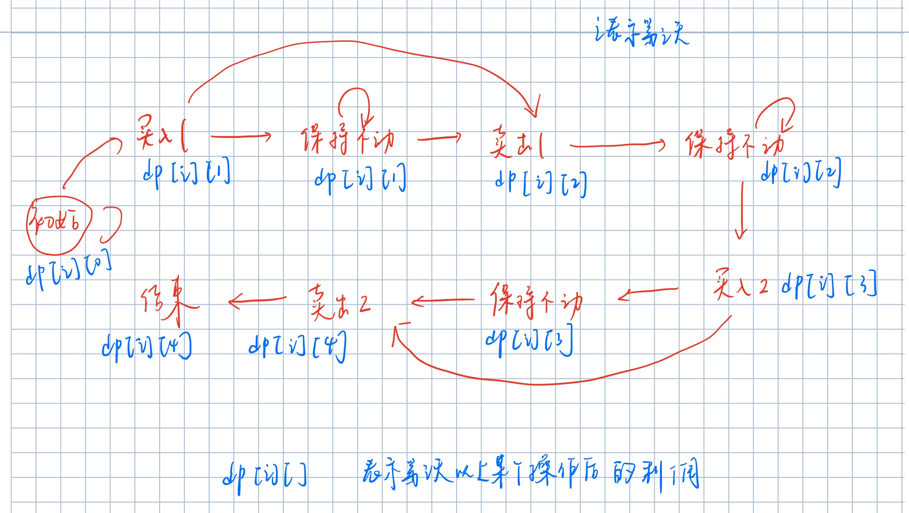

# 1 数组的典型题目

## 1.1 多数元素

```
169. 多数元素

给定一个大小为 n 的数组，找到其中的多数元素。多数元素是指在数组中出现次数大于 ⌊ n/2 ⌋ 的元素。

你可以假设数组是非空的，并且给定的数组总是存在多数元素。


示例 1:

输入: [3,2,3]
输出: 3
示例 2:

输入: [2,2,1,1,1,2,2]
输出: 2
```

**解法 1：哈希表法**

- 新建一个哈希表(对象)保存元素的个数，当元素的数量大于⌊ n/2 ⌋时，return 该元素即可 这里使用的是对象[属性名]
- 需要注意对象中未定义某个属性时，该值会被认为是 undefined
- 时间复杂度：O(n) 空间复杂度：O(n-n/2) 最坏情况下

```
var majorityElement = function (nums) {
  var hash = {};
  var len = nums.length;
  for (let i = 0; i < len; i++) {
    hash[nums[i]] = (hash[nums[i]] || 0) + 1;
    if (hash[nums[i]] > len / 2) {
      return nums[i];
    }
  }
};
```

**方法 2：排序**

根据题目的意思，nums 中一定存在多数元素，而多数元素是指在数组中出现次数大于 ⌊ n/2 ⌋ 的元素，也就是说数组中总共有 n 个元素，而多数元素最少出现⌊ n/2 ⌋+1 次，即**数组中一半都是多数元素**

    如果数组长度为3，则多数元素最少出现⌊ n/2 ⌋+1=2次，即该数组内一定存在两个或者以上的相同元素
        比如[a,b,a] [a,a,b] [b,a,a] [a,a,a]
        将其排序之后可以发现 不是[a a b] 就是[b a a]

如果将数组 nums 中的所有元素按照单调递增或单调递减的顺序排序，那么下标为[n/2]的元素（下标从 0 开始）一定是众数。

时间复杂度：排序算法 O(nlogn) 空间复杂度：O(logn)

```
var majorityElement = function (nums) {
  nums.sort();
  return nums[parseInt(nums.length / 2)];
};
```

**方法 3：栈方法**

因为众数一定是出现次数最多的那个元素

- 建立一个空栈

  - 遍历数组，判断栈顶元素是否等于当前元素，如果相等或者栈为空，则将该元素放入栈中 -不相等则出栈

- 时间复杂度:O(n) 空间复杂度：O(n)

```
var majorityElement = function (nums) {
  let stack = [];
  for(let n of nums){
      let m = stack.length-1;
      if(stack[m] === n || !m){
          stack.push(n);
      }else{
          stack.pop()
      }
  }
  return stack[0];
};
```

**方法 4：Boyer_Moore 投票算法**

如果将众数记作+1，将其他数记作-1,则最终得到的结果一定的大于 0 的，因为众数的个数大于其他数的数量总和

初始时：将任意的值指定为 candidate,count=0 表示该值在数组中出现的次数；
遍历数组：
元素=该值，则 count+1;
元素不等于该值，则 count-1
在下一次循环前，先判断 count 是否为 0，如果为 0，则重新指定当前元素为 candidate

总之：**因为众数出现的次数大于其他元素出现的次数总和，所以结果总是大于 0 的**

例如：[2,2,3,3,3]

    candidata=2  count=0
    n=2 n=candidate count=1
    n=2 n=candidate count=2
    n = 3 n≠candidate count=1
    n = 3 n≠candidate count=0
    n = 3 因为count=0 candidate = 3 => n=candidate => count=1
    return candidate

```
var majorityElement = function (nums) {
  let count = 0,candidate = nums[0];
  for (let n of nums) {
    if(count === 0){
        candidate = n;
    }
    if(candidate === n){
        count ++;
    }else{
        count--;
    }
  }
  return candidate;
};
```

## 1.2 移动 0

```
283. 移动零
给定一个数组 nums，编写一个函数将所有 0 移动到数组的末尾，同时保持非零元素的相对顺序。

示例:

输入: [0,1,0,3,12]
输出: [1,3,12,0,0]
说明:

必须在原数组上操作，不能拷贝额外的数组。
尽量减少操作次数。
```

**解法 1**：

- 遍历数组，检测该元素是否为 0：
  - 一旦发现该元素为 0，则在该位置删除一个元素，同时在数组的最后添加一个 0，不要增加索引，因为此时索引已经自动切换到了下一个元素上，记录这个操作的次数 count
  - 如果元素不是 0，则直接 i++跳到下一轮循环
  - 判断如果 count+i=nums.length,说明所有的元素均已经循环了一遍，break
- 时间复杂度 O(n) 空间复杂度 O(1)

```
var moveZeroes = function (nums) {
  let count = 0;
  for (let i = 0; i < nums.length; ) {
    if (nums[i] === 0) {
      nums.splice(i, 1);
      nums.push(0);
      count++;
    } else {
      i++;
    }
    if (count + i === nums.length) {
      break;
    }
  }
  return nums;
};
```


**解法 2:双指针法**

i,j 指针均指向索引 0，移动指针 i,一旦 nums[i]非 0，则将其和 nums[j]交换，j++

    [0,0,1]
    j=0,i=0 0=0
    j=0 i=1 0=0
    j=0 i=2 1≠0 [1,0]=[0,1] j=1
    j=1 i=3 不满足条件break

```
var moveZeroes = function (nums) {
  for (let i = 0, j = 0; i < nums.length; i++) {
    if (nums[i] !== 0) {
      [nums[i], nums[j]] = [nums[j], nums[i]];
      j++;
    }
  }
  return nums;
};
```

## 1.3 找到所有数组中消失的数字

```
448. 找到所有数组中消失的数字
给定一个范围在  1 ≤ a[i] ≤ n ( n = 数组大小 ) 的 整型数组，数组中的元素一些出现了两次，另一些只出现一次。

找到所有在 [1, n] 范围之间没有出现在数组中的数字。

您能在不使用额外空间且时间复杂度为O(n)的情况下完成这个任务吗?
你可以假定返回的数组不算在额外空间内。  也就是说最后可以创建一个数组用于保存返回的结果

示例:

输入:
[4,3,2,7,8,2,3,1]

输出:
[5,6]
```

**解法 1：**

- 创建一个等长数组 arr，并且遍历使得其内部元素分布为[1,..,n]
- 遍历原数组 nums,在 arr 中删除 nums[i],用 0 补位，所以遍历结束后 arr 中就剩下 0 和 nums 中没有的数了
- 最后再遍历 arr,将其中不为 0 的元素挑出来赋值给另一个数组
- 时间复杂度：O(n)
- 空间复杂度：O(n),不满足要求

```
var findDisappearedNumbers = function (nums) {
  let arr = Array(nums.length);
  // 先新建一个数组，内部元素分布[1,2,3,..,n]
  for (let i = 0; i < arr.length; i++) {
    arr[i] = i + 1;
  }
  // 将nums中有的元素从arr中剔除
  for (let i = 0; i < nums.length; i++) {
    if (arr[nums[i] - 1] != 0) {
      arr.splice(nums[i] - 1, 1, 0);
    }
  }
  // 挑出arr中的非零元素
  var arr1 = [],
    j = 0;
  for (let i = 0; i < arr.length; i++) {
    if (arr[i] != 0) {
      arr1[j] = arr[i];
      j++;
    }
  }
  return arr1;
};
```


**解法 2：**

- 遍历输入数组的每个元素一次,对于每一个 nums[i],将 nums[nums[i]-1]标记为负数。即 `nums[nums[i]-1] *=-1;`
- 然后遍历数组，若当前数组元素 nums[i] 为负数，说明 nums 中存在数字 i+1。所以去除 nums[i]大于 0 的 i+1 即可
- 时间复杂度 O(n),空间复杂度 O(1)

        例如[3,4,2,2,3,1,7,8]
        nums[0]=3,则令nums[2]=-2
        nums[1]=4,则令nums[3]=-2
        nums[2]=2,则令nums[1]=-4
        nums[3]=2,由于nums[1]已经为负了,说明nums中存在2，而该元素就是2，所以nums[nums[i]-1]<0就不需要进行任何操作
        nums[4]=3,而nums[2]<0,所以同上跳过
        nums[5]=1,nums[0]=-3
        nums[6]=7,nums[6]=-7
        nums[7]=8,nums[7]=-8

```
var findDisappearedNumbers = function (nums) {
  for (let i = 0; i < nums.length; i++) {
    let absnum = Math.abs(nums[i]);
    if (nums[absnum - 1] > 0) {
      nums[absnum - 1] *= -1;
    }
  }
  const res = [];
  for (let i = 1; i <= nums.length; i++) {
    if (nums[i - 1] > 0) {
      res.push(i);
    }
  }
  return res;
};
```

## 1.3 买卖股票的最佳时机

### 1.3.1 买卖一次

```
121. 买卖股票的最佳时机
给定一个数组，它的第 i 个元素是一支给定股票第 i 天的价格。

如果你最多只允许完成一笔交易（即买入和卖出一支股票一次），设计一个算法来计算你所能获取的最大利润。

注意：你不能在买入股票前卖出股票。


示例 1:

输入: [7,1,5,3,6,4]
输出: 5
解释: 在第 2 天（股票价格 = 1）的时候买入，在第 5 天（股票价格 = 6）的时候卖出，最大利润 = 6-1 = 5 。
     注意利润不能是 7-1 = 6, 因为卖出价格需要大于买入价格；同时，你不能在买入前卖出股票。
示例 2:

输入: [7,6,4,3,1]
输出: 0
解释: 在这种情况下, 没有交易完成, 所以最大利润为 0。
```

**暴力解法：双重循环**

```
var maxProfit = function (prices) {
  let max = 0;
  for (let i = 0; i < prices.length - 1; i++) {
    for (let j = i + 1; j < prices.length; j++) {
      if (max < prices[j] - prices[i]) {
        max = prices[j] - prices[i];
      }
    }
  }
  return max;
};
```

**解法 2：一次遍历**

min:表示买入股票时的价格
max_profit:表示可以获取到的最大利润
先确定那一天卖出股票，而买入股票就选择那一天之前的股票价格最低的一天
时间复杂度：O(n)  
空间复杂度：O(1)

```
var maxProfit = function (prices) {
  if (!prices.length) {
    return 0;
  }
  // 这里要将最大值赋予min,是为了保证卖出的值位于买入之后
  let min = Math.max(...prices);
  // 记录最大利润
  let max_profit = 0;
  for (let i = 0; i < prices.length; i++) {
    if (prices[i] < min) {
        // 如果当天的价格比min小，则重新设定min
      min = prices[i];
    }
    if (prices[i] - min > max_profit) {
        // 如果当天卖出的利润大于当前的最大利润，则重新设定最大利润
      max_profit = prices[i] - min;
    }
  }
  return max_profit;
};
```

**解法 3：动态规划**

先得到到今天为止买入股票的最低值，然后得到以该值买入，今天卖出获取的利润，与之前获取的利润比较，取最大值作为最大利润

```
var maxProfit = function (prices) {
  if (!prices.length || prices == null) {
    return 0;
  }
  let max_profit = 0,
    min = Number.MAX_VALUE;

  for (let i = 0; i < prices.length; i++) {
    // 获取当第i天卖出时，买入股票的最低价格
    min = Math.min(min, prices[i]);
    // 获取第i天卖出股票后的利润
    max_profit = Math.max(max_profit, prices[i] - min);
  }
  return max_profit;
};
```

### 1.3.2 可以买卖多次

加入条件：可以完成多笔交易，但是前一个股票卖出之后才可以买入下一个股票

```
示例 1:

输入: [7,1,5,3,6,4]
输出: 7
解释: 在第 2 天（股票价格 = 1）的时候买入，在第 3 天（股票价格 = 5）的时候卖出, 这笔交易所能获得利润 = 5-1 = 4 。
     随后，在第 4 天（股票价格 = 3）的时候买入，在第 5 天（股票价格 = 6）的时候卖出, 这笔交易所能获得利润 = 6-3 = 3 。
示例 2:

输入: [1,2,3,4,5]
输出: 4
解释: 在第 1 天（股票价格 = 1）的时候买入，在第 5 天 （股票价格 = 5）的时候卖出, 这笔交易所能获得利润 = 5-1 = 4 。
     注意你不能在第 1 天和第 2 天接连购买股票，之后再将它们卖出。
     因为这样属于同时参与了多笔交易，你必须在再次购买前出售掉之前的股票。
示例 3:

输入: [7,6,4,3,1]
输出: 0
解释: 在这种情况下, 没有交易完成, 所以最大利润为 0。
```

**解法 1：峰谷法**

根据题目的要求，买入在卖出之前，则将所有的价格弄成一个曲线，先得到一个谷值，然后紧接其后的峰值就卖出


```
var maxProfit = function (prices) {
  let i = 0,
    valley = prices[0],
    peak = prices[0],
    max_profit = 0;
  while (i < prices.length - 1) {
    while (i < prices.length - 1 && prices[i] >= prices[i + 1]) {
      // 找到第一个波谷
      valley = prices[++i];
    }
    while (i < prices.length - 1 && prices[i] <= prices[i + 1]) {
      // 找到紧接着该波谷的第一个波峰
      peak = prices[++i];
      max_profit += peak - valley;
    }
  }
  return max_profit;
};
```

**方法 2：简单的一次遍历**

只要后一个数大于前一个数，就在前一天买入，在后一天卖出，因为题目并没有限制买入卖出的次数

举例说明：[7, 7, 7, 1, 5, 3, 6, 4]

    0+(5-1)+(6-3)=7

```
var maxProfit = function (prices) {
  let max_profit = 0;
  for (let i = 0; i < prices.length - 1; i++) {
    if (prices[i] < prices[i + 1]) {
      max_profit += prices[i + 1] - prices[i];
    }
  }
  return max_profit;
};
```

**动态规划解法**

两个状态值：买入之后的利润 和 卖出之后的利润

```
var maxProfit = function (prices) {
  if (!prices.length || prices == null) {
    return 0;
  }
  // 假定第一天买入，则第一天的利润就是-prices[0]
  let buy = -prices[0],
    sell = 0;

  // 从第2天开始，才可以有机会卖出股票
  for (let i = 1; i < prices.length; i++) {
    sell = Math.max(sell,prices[i]+buy);  //第i天卖出股票后的利润
    buy = Math.max(buy,sell-prices[i]);  // 第i天买入的利润：第i天卖出后得到的利润-股票的价格
  }
  return sell;
};
```

### 1.3.3 只能买卖两次

加入条件：最多只能完成两笔交易
例如：

     输入: [3,3,5,0,0,3,1,4]
     输出: 6
     解释: 在第 4 天（股票价格 = 0）的时候买入，在第 6 天（股票价格 = 3）的时候卖出，这笔交易所能获得利润 = 3-0 = 3 。
       随后，在第 7 天（股票价格 = 1）的时候买入，在第 8 天 （股票价格 = 4）的时候卖出，这笔交易所能获得利润 = 4-1 = 3 。

**动态规划的解法**

参考：https://leetcode-cn.com/problems/best-time-to-buy-and-sell-stock-iii/solution/wu-chong-shi-xian-xiang-xi-tu-jie-123mai-mai-gu-pi/

直接考虑利润：根据买入或者卖出股票的状态不同，利润就会发生变化，导致利润变化的主要有下面 5 个状态，通过一个数组 dp 保存下面状态变化后利润值：

    初始状态：dp[i][0] :第i天的利润初始状态
    买入1后的利润：dp[i][1]
    卖出1后的利润：dp[i][2]
    买入2后的利润：dp[i][3]
    卖出2后的利润：dp[i][4]

状态图如下：


达到买入 1 的状态的有两个途径：从买入 1 后保持 或者 初始状态转换得到
达到卖出 1 的状态的有两个途径：从卖出 1 后保持 或者 买入 1 后转换得到
达到买入 2 的状态的有两个途径：从买入 2 后保持 或者 卖出 1 后转换得到
达到卖出 2 的状态的有两个途径：从卖出 2 后保持或者买入 2 后转换得到

```
var maxProfit = function (prices) {
  if (prices === null || prices.length <= 1) {
    return 0;
  }
  let n = prices.length;
  let dp = Array(n);
  for (let i = 0; i < n; i++) {
    dp[i] = Array(5);
  }
  // 由于js很难创建多维数组，所以直接使用变量表示
  dp[0][0] = 0;
  dp[0][1] = -prices[0]; // 买入1
  dp[0][2] = 0; // 卖出1
  dp[0][3] = -prices[0]; // 买入2
  dp[0][4] = 0; // 卖出2

  for (let i = 1; i < n; i++) {
    dp[i][0] = dp[i - 1][0];
    // 第一次买入：第一次买入后保持 或者 从初始化状态转换而来
    dp[i][1] = Math.max(dp[i - 1][1], dp[i - 1][0] - prices[i]);
    // 第一次卖出：第一次卖出后保持 或者 第一次买入后转换而来
    dp[i][2] = Math.max(dp[i - 1][2], dp[i - 1][1] + prices[i]);
    // 第二次买入：第二次买入后保持 或者 第一次卖出后转换而来
    dp[i][3] = Math.max(dp[i - 1][3], dp[i - 1][2] - prices[i]);
    // 第二次卖出：第二次买处后保持 或者 第二次买入后转换而来
    dp[i][4] = Math.max(dp[i - 1][4], dp[i - 1][3] + prices[i]);
  }
  return Math.max(...dp[n - 1]);
};
```

可以发现上面的做法需要创建一个二维数组，不仅耗时，而且耗空间，所以考虑用 4 个变量直接表示，不创建数组

利润分为四个状态：第一次买入后，第一次卖出后，第二次买入后，第二次卖出后

初始化时：

    第一次买入时的利润为：-price[i]
    第一次卖出后的利润为：第一次买入时的利润+price[i]卖出时的价格
    第二次买入后的利润为：第一次卖出后的利润-price[i]
    第二次卖出后的利润为：第二次买入后的利润+price[i]卖出时的价格

```
var maxProfit = function (prices) {
  let dp1 = -Number.MAX_VALUE,
    dp3 = -Number.MAX_VALUE,
    dp2 = 0,
    dp4 = 0;
  for (let price of prices) {
    // 第一次买入后的利润：第一次买入后保持 或者 初始状态转变
    dp1 = Math.max(dp1, -price);
    // 第一次卖出后的利润
    dp2 = Math.max(dp2, price + dp1);
    // 第二次买入时的利润
    dp3 = Math.max(dp3, dp2 - price);
    // 第二次卖出时的利润
    dp4 = Math.max(dp4, price + dp3);
  }
  return dp4;
};
```

### 1.3.4 多次交易，但是每次交易的手续费 2 元

```
var maxProfit = function (prices, fee = 2) {
  // 初始化第一天的状态
  let dp0 = 0; // 卖出后的利润为0，因为第一天不可能卖出
  let dp1 = -prices[0]; // 假定第一天买入了
  for (let i = 1; i < prices.length; i++) {
    let tmp = dp0; // 第i天前的利润
    dp0 = Math.max(dp0, dp1 + prices[i] - fee); // 第i天卖出后的利润
    dp1 = Math.max(dp1, tmp - prices[i]); // 第i天买入后的利润
  }
  return dp0;
};
```

或者直接不要 tmp 进行初始化状态

```
var maxProfit = function (prices, fee = 2) {
  // 初始化第一天的状态
  let dp0 = -prices[0]; // 假定第一天买入了
  let dp1 = 0; // 卖出后的利润为0，因为第一天不可能卖出
  for (let i = 1; i < prices.length; i++) {
    dp1 = Math.max(dp1, dp0 + prices[i] - fee); // 第i天卖出后的利润
    dp0 = Math.max(dp0, dp1 - prices[i]); // 第i天买入后的利润
  }
  return dp1;
};
```
