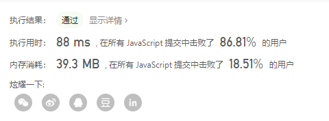
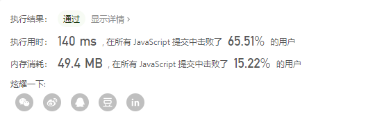
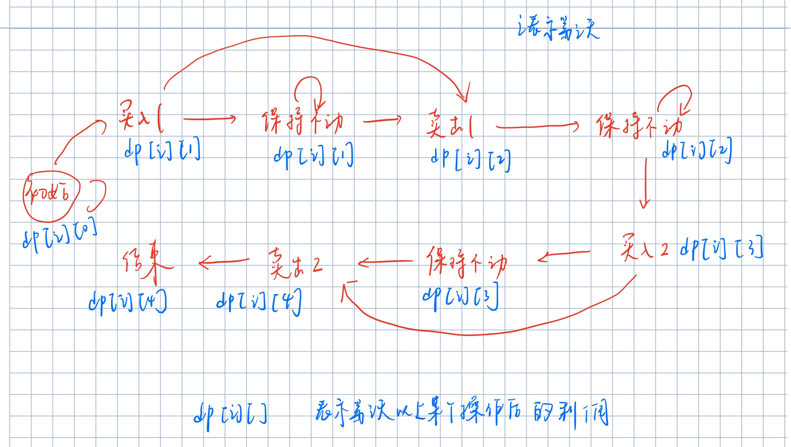
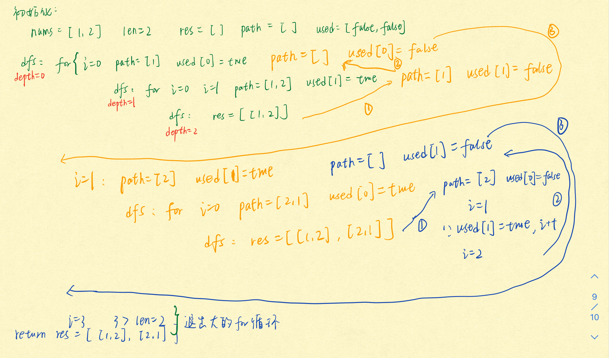
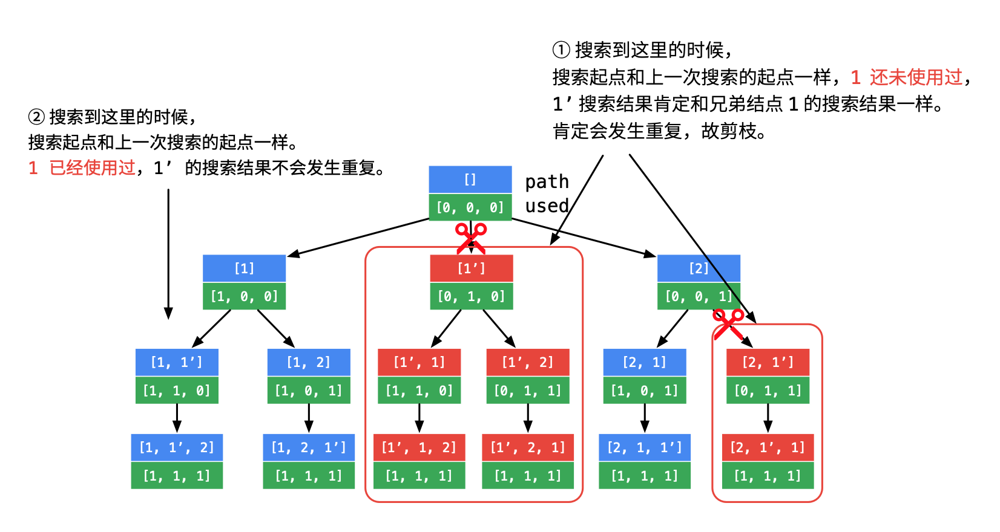

<!-- TOC -->

- [1 数组的典型题目](#1-数组的典型题目)
  - [1.1 多数元素](#11-多数元素)
  - [1.2 移动 0](#12-移动-0)
  - [1.3 找到所有数组中消失的数字](#13-找到所有数组中消失的数字)
  - [1.4 动态规划](#14-动态规划)
    - [1.4.1 买卖股票的最佳时机](#141-买卖股票的最佳时机)
      - [1.4.1.1 买卖一次](#1411-买卖一次)
      - [1.4.1.2 可以买卖多次](#1412-可以买卖多次)
      - [1.4.1.3 只能买卖两次](#1413-只能买卖两次)
      - [1.4.1.4 多次交易，但是每次交易的手续费 2 元](#1414-多次交易但是每次交易的手续费-2-元)
      - [1.4.1.5 包含冷冻期](#1415-包含冷冻期)
    - [1.4.2 最大子序和](#142-最大子序和)
  - [1.5 hash 表](#15-hash-表)
    - [1.5.1 两数之和](#151-两数之和)
  - [1.6 三数之和](#16-三数之和)
  - [1.7 深度优先遍历](#17-深度优先遍历)
    - [1.7.1 全排列](#171-全排列)
  - [1.7.2 全排列 2](#172-全排列-2)
  - [1.7.3 组合总和](#173-组合总和)
    - [1.7.4 组合 2](#174-组合-2)
    - [1.7.5 组合](#175-组合)
    - [1.7.6 子集](#176-子集)
    - [1.7.7 子集 2](#177-子集-2)

<!-- /TOC -->

# 1 数组的典型题目

## 1.1 多数元素

```
169. 多数元素

给定一个大小为 n 的数组，找到其中的多数元素。多数元素是指在数组中出现次数大于 ⌊ n/2 ⌋ 的元素。

你可以假设数组是非空的，并且给定的数组总是存在多数元素。


示例 1:

输入: [3,2,3]
输出: 3
示例 2:

输入: [2,2,1,1,1,2,2]
输出: 2
```

**解法 1：哈希表法**

- 新建一个哈希表(对象)保存元素的个数，当元素的数量大于⌊ n/2 ⌋时，return 该元素即可 这里使用的是对象[属性名]
- 需要注意对象中未定义某个属性时，该值会被认为是 undefined
- 时间复杂度：O(n) 空间复杂度：O(n-n/2) 最坏情况下

```
var majorityElement = function (nums) {
  var hash = {};
  var len = nums.length;
  for (let i = 0; i < len; i++) {
    hash[nums[i]] = (hash[nums[i]] || 0) + 1;
    if (hash[nums[i]] > len / 2) {
      return nums[i];
    }
  }
};
```

**方法 2：排序**

根据题目的意思，nums 中一定存在多数元素，而多数元素是指在数组中出现次数大于 ⌊ n/2 ⌋ 的元素，也就是说数组中总共有 n 个元素，而多数元素最少出现⌊ n/2 ⌋+1 次，即**数组中一半都是多数元素**

    如果数组长度为3，则多数元素最少出现⌊ n/2 ⌋+1=2次，即该数组内一定存在两个或者以上的相同元素
        比如[a,b,a] [a,a,b] [b,a,a] [a,a,a]
        将其排序之后可以发现 不是[a a b] 就是[b a a]

如果将数组 nums 中的所有元素按照单调递增或单调递减的顺序排序，那么下标为[n/2]的元素（下标从 0 开始）一定是众数。

时间复杂度：排序算法 O(nlogn) 空间复杂度：O(logn)

```
var majorityElement = function (nums) {
  nums.sort();
  return nums[parseInt(nums.length / 2)];
};
```

**方法 3：栈方法**

因为众数一定是出现次数最多的那个元素

- 建立一个空栈

  - 遍历数组，判断栈顶元素是否等于当前元素，如果相等或者栈为空，则将该元素放入栈中 -不相等则出栈

- 时间复杂度:O(n) 空间复杂度：O(n)

```
var majorityElement = function (nums) {
  let stack = [];
  for(let n of nums){
      let m = stack.length-1;
      if(stack[m] === n || !m){
          stack.push(n);
      }else{
          stack.pop()
      }
  }
  return stack[0];
};
```

**方法 4：Boyer_Moore 投票算法**

如果将众数记作+1，将其他数记作-1,则最终得到的结果一定的大于 0 的，因为众数的个数大于其他数的数量总和

初始时：将任意的值指定为 candidate,count=0 表示该值在数组中出现的次数；
遍历数组：
元素=该值，则 count+1;
元素不等于该值，则 count-1
在下一次循环前，先判断 count 是否为 0，如果为 0，则重新指定当前元素为 candidate

总之：**因为众数出现的次数大于其他元素出现的次数总和，所以结果总是大于 0 的**

例如：[2,2,3,3,3]

    candidata=2  count=0
    n=2 n=candidate count=1
    n=2 n=candidate count=2
    n = 3 n≠candidate count=1
    n = 3 n≠candidate count=0
    n = 3 因为count=0 candidate = 3 => n=candidate => count=1
    return candidate

```
var majorityElement = function (nums) {
  let count = 0,candidate = nums[0];
  for (let n of nums) {
    if(count === 0){
        candidate = n;
    }
    if(candidate === n){
        count ++;
    }else{
        count--;
    }
  }
  return candidate;
};
```

## 1.2 移动 0

```
283. 移动零
给定一个数组 nums，编写一个函数将所有 0 移动到数组的末尾，同时保持非零元素的相对顺序。

示例:

输入: [0,1,0,3,12]
输出: [1,3,12,0,0]
说明:

必须在原数组上操作，不能拷贝额外的数组。
尽量减少操作次数。
```

**解法 1**：

- 遍历数组，检测该元素是否为 0：
  - 一旦发现该元素为 0，则在该位置删除一个元素，同时在数组的最后添加一个 0，不要增加索引，因为此时索引已经自动切换到了下一个元素上，记录这个操作的次数 count
  - 如果元素不是 0，则直接 i++跳到下一轮循环
  - 判断如果 count+i=nums.length,说明所有的元素均已经循环了一遍，break
- 时间复杂度 O(n) 空间复杂度 O(1)

```
var moveZeroes = function (nums) {
  let count = 0;
  for (let i = 0; i < nums.length; ) {
    if (nums[i] === 0) {
      nums.splice(i, 1);
      nums.push(0);
      count++;
    } else {
      i++;
    }
    if (count + i === nums.length) {
      break;
    }
  }
  return nums;
};
```



**解法 2:双指针法**

i,j 指针均指向索引 0，移动指针 i,一旦 nums[i]非 0，则将其和 nums[j]交换，j++

    [0,0,1]
    j=0,i=0 0=0
    j=0 i=1 0=0
    j=0 i=2 1≠0 [1,0]=[0,1] j=1
    j=1 i=3 不满足条件break

```
var moveZeroes = function (nums) {
  for (let i = 0, j = 0; i < nums.length; i++) {
    if (nums[i] !== 0) {
      [nums[i], nums[j]] = [nums[j], nums[i]];
      j++;
    }
  }
  return nums;
};
```

## 1.3 找到所有数组中消失的数字

```
448. 找到所有数组中消失的数字
给定一个范围在  1 ≤ a[i] ≤ n ( n = 数组大小 ) 的 整型数组，数组中的元素一些出现了两次，另一些只出现一次。

找到所有在 [1, n] 范围之间没有出现在数组中的数字。

您能在不使用额外空间且时间复杂度为O(n)的情况下完成这个任务吗?
你可以假定返回的数组不算在额外空间内。  也就是说最后可以创建一个数组用于保存返回的结果

示例:

输入:
[4,3,2,7,8,2,3,1]

输出:
[5,6]
```

**解法 1：**

- 创建一个等长数组 arr，并且遍历使得其内部元素分布为[1,..,n]
- 遍历原数组 nums,在 arr 中删除 nums[i],用 0 补位，所以遍历结束后 arr 中就剩下 0 和 nums 中没有的数了
- 最后再遍历 arr,将其中不为 0 的元素挑出来赋值给另一个数组
- 时间复杂度：O(n)
- 空间复杂度：O(n),不满足要求

```
var findDisappearedNumbers = function (nums) {
  let arr = Array(nums.length);
  // 先新建一个数组，内部元素分布[1,2,3,..,n]
  for (let i = 0; i < arr.length; i++) {
    arr[i] = i + 1;
  }
  // 将nums中有的元素从arr中剔除
  for (let i = 0; i < nums.length; i++) {
    if (arr[nums[i] - 1] != 0) {
      arr.splice(nums[i] - 1, 1, 0);
    }
  }
  // 挑出arr中的非零元素
  var arr1 = [],
    j = 0;
  for (let i = 0; i < arr.length; i++) {
    if (arr[i] != 0) {
      arr1[j] = arr[i];
      j++;
    }
  }
  return arr1;
};
```



**解法 2：**

- 遍历输入数组的每个元素一次,对于每一个 nums[i],将 nums[nums[i]-1]标记为负数。即 `nums[nums[i]-1] *=-1;`
- 然后遍历数组，若当前数组元素 nums[i] 为负数，说明 nums 中存在数字 i+1。所以去除 nums[i]大于 0 的 i+1 即可
- 时间复杂度 O(n),空间复杂度 O(1)

        例如[3,4,2,2,3,1,7,8]
        nums[0]=3,则令nums[2]=-2
        nums[1]=4,则令nums[3]=-2
        nums[2]=2,则令nums[1]=-4
        nums[3]=2,由于nums[1]已经为负了,说明nums中存在2，而该元素就是2，所以nums[nums[i]-1]<0就不需要进行任何操作
        nums[4]=3,而nums[2]<0,所以同上跳过
        nums[5]=1,nums[0]=-3
        nums[6]=7,nums[6]=-7
        nums[7]=8,nums[7]=-8

```
var findDisappearedNumbers = function (nums) {
  for (let i = 0; i < nums.length; i++) {
    let absnum = Math.abs(nums[i]);
    if (nums[absnum - 1] > 0) {
      nums[absnum - 1] *= -1;
    }
  }
  const res = [];
  for (let i = 1; i <= nums.length; i++) {
    if (nums[i - 1] > 0) {
      res.push(i);
    }
  }
  return res;
};
```

## 1.4 动态规划

### 1.4.1 买卖股票的最佳时机

#### 1.4.1.1 买卖一次

```
121. 买卖股票的最佳时机
给定一个数组，它的第 i 个元素是一支给定股票第 i 天的价格。

如果你最多只允许完成一笔交易（即买入和卖出一支股票一次），设计一个算法来计算你所能获取的最大利润。

注意：你不能在买入股票前卖出股票。


示例 1:

输入: [7,1,5,3,6,4]
输出: 5
解释: 在第 2 天（股票价格 = 1）的时候买入，在第 5 天（股票价格 = 6）的时候卖出，最大利润 = 6-1 = 5 。
     注意利润不能是 7-1 = 6, 因为卖出价格需要大于买入价格；同时，你不能在买入前卖出股票。
示例 2:

输入: [7,6,4,3,1]
输出: 0
解释: 在这种情况下, 没有交易完成, 所以最大利润为 0。
```

**暴力解法：双重循环**

```
var maxProfit = function (prices) {
  let max = 0;
  for (let i = 0; i < prices.length - 1; i++) {
    for (let j = i + 1; j < prices.length; j++) {
      if (max < prices[j] - prices[i]) {
        max = prices[j] - prices[i];
      }
    }
  }
  return max;
};
```

**解法 2：一次遍历**

min:表示买入股票时的价格
max_profit:表示可以获取到的最大利润
先确定那一天卖出股票，而买入股票就选择那一天之前的股票价格最低的一天
时间复杂度：O(n)  
空间复杂度：O(1)

```
var maxProfit = function (prices) {
  if (!prices.length) {
    return 0;
  }
  // 这里要将最大值赋予min,是为了保证卖出的值位于买入之后
  let min = Math.max(...prices);
  // 记录最大利润
  let max_profit = 0;
  for (let i = 0; i < prices.length; i++) {
    if (prices[i] < min) {
        // 如果当天的价格比min小，则重新设定min
      min = prices[i];
    }
    if (prices[i] - min > max_profit) {
        // 如果当天卖出的利润大于当前的最大利润，则重新设定最大利润
      max_profit = prices[i] - min;
    }
  }
  return max_profit;
};
```

**解法 3：动态规划**

先得到到今天为止买入股票的最低值，然后得到以该值买入，今天卖出获取的利润，与之前获取的利润比较，取最大值作为最大利润

```
var maxProfit = function (prices) {
  if (!prices.length || prices == null) {
    return 0;
  }
  let max_profit = 0,
    min = Number.MAX_VALUE;

  for (let i = 0; i < prices.length; i++) {
    // 获取当第i天卖出时，买入股票的最低价格
    min = Math.min(min, prices[i]);
    // 获取第i天卖出股票后的利润
    max_profit = Math.max(max_profit, prices[i] - min);
  }
  return max_profit;
};
```

#### 1.4.1.2 可以买卖多次

加入条件：可以完成多笔交易，但是前一个股票卖出之后才可以买入下一个股票

```
示例 1:

输入: [7,1,5,3,6,4]
输出: 7
解释: 在第 2 天（股票价格 = 1）的时候买入，在第 3 天（股票价格 = 5）的时候卖出, 这笔交易所能获得利润 = 5-1 = 4 。
     随后，在第 4 天（股票价格 = 3）的时候买入，在第 5 天（股票价格 = 6）的时候卖出, 这笔交易所能获得利润 = 6-3 = 3 。
示例 2:

输入: [1,2,3,4,5]
输出: 4
解释: 在第 1 天（股票价格 = 1）的时候买入，在第 5 天 （股票价格 = 5）的时候卖出, 这笔交易所能获得利润 = 5-1 = 4 。
     注意你不能在第 1 天和第 2 天接连购买股票，之后再将它们卖出。
     因为这样属于同时参与了多笔交易，你必须在再次购买前出售掉之前的股票。
示例 3:

输入: [7,6,4,3,1]
输出: 0
解释: 在这种情况下, 没有交易完成, 所以最大利润为 0。
```

**解法 1：峰谷法**

根据题目的要求，买入在卖出之前，则将所有的价格弄成一个曲线，先得到一个谷值，然后紧接其后的峰值就卖出


```
var maxProfit = function (prices) {
  let i = 0,
    valley = prices[0],
    peak = prices[0],
    max_profit = 0;
  while (i < prices.length - 1) {
    while (i < prices.length - 1 && prices[i] >= prices[i + 1]) {
      // 找到第一个波谷
      valley = prices[++i];
    }
    while (i < prices.length - 1 && prices[i] <= prices[i + 1]) {
      // 找到紧接着该波谷的第一个波峰
      peak = prices[++i];
      max_profit += peak - valley;
    }
  }
  return max_profit;
};
```

**方法 2：简单的一次遍历**

只要后一个数大于前一个数，就在前一天买入，在后一天卖出，因为题目并没有限制买入卖出的次数

举例说明：[7, 7, 7, 1, 5, 3, 6, 4]

    0+(5-1)+(6-3)=7

```
var maxProfit = function (prices) {
  let max_profit = 0;
  for (let i = 0; i < prices.length - 1; i++) {
    if (prices[i] < prices[i + 1]) {
      max_profit += prices[i + 1] - prices[i];
    }
  }
  return max_profit;
};
```

**动态规划解法**

两个状态值：买入之后的利润 和 卖出之后的利润

```
var maxProfit = function (prices) {
  if (!prices.length || prices == null) {
    return 0;
  }
  // 假定第一天买入，则第一天的利润就是-prices[0]
  let buy = -prices[0],
    sell = 0;

  // 从第2天开始，才可以有机会卖出股票
  for (let i = 1; i < prices.length; i++) {
    sell = Math.max(sell,prices[i]+buy);  //第i天卖出股票后的利润
    buy = Math.max(buy,sell-prices[i]);  // 第i天买入的利润：第i天卖出后得到的利润-股票的价格
  }
  return sell;
};
```

#### 1.4.1.3 只能买卖两次

加入条件：最多只能完成两笔交易
例如：

     输入: [3,3,5,0,0,3,1,4]
     输出: 6
     解释: 在第 4 天（股票价格 = 0）的时候买入，在第 6 天（股票价格 = 3）的时候卖出，这笔交易所能获得利润 = 3-0 = 3 。
       随后，在第 7 天（股票价格 = 1）的时候买入，在第 8 天 （股票价格 = 4）的时候卖出，这笔交易所能获得利润 = 4-1 = 3 。

**动态规划的解法**

参考：https://leetcode-cn.com/problems/best-time-to-buy-and-sell-stock-iii/solution/wu-chong-shi-xian-xiang-xi-tu-jie-123mai-mai-gu-pi/

直接考虑利润：根据买入或者卖出股票的状态不同，利润就会发生变化，导致利润变化的主要有下面 5 个状态，通过一个数组 dp 保存下面状态变化后利润值：

    初始状态：dp[i][0] :第i天的利润初始状态
    买入1后的利润：dp[i][1]
    卖出1后的利润：dp[i][2]
    买入2后的利润：dp[i][3]
    卖出2后的利润：dp[i][4]

状态图如下：


达到买入 1 的状态的有两个途径：从买入 1 后保持 或者 初始状态转换得到
达到卖出 1 的状态的有两个途径：从卖出 1 后保持 或者 买入 1 后转换得到
达到买入 2 的状态的有两个途径：从买入 2 后保持 或者 卖出 1 后转换得到
达到卖出 2 的状态的有两个途径：从卖出 2 后保持或者买入 2 后转换得到

```
var maxProfit = function (prices) {
  if (prices === null || prices.length <= 1) {
    return 0;
  }
  let n = prices.length;
  let dp = Array(n);
  for (let i = 0; i < n; i++) {
    dp[i] = Array(5);
  }
  // 由于js很难创建多维数组，所以直接使用变量表示
  dp[0][0] = 0;
  dp[0][1] = -prices[0]; // 买入1
  dp[0][2] = 0; // 卖出1
  dp[0][3] = -prices[0]; // 买入2
  dp[0][4] = 0; // 卖出2

  for (let i = 1; i < n; i++) {
    dp[i][0] = dp[i - 1][0];
    // 第一次买入：第一次买入后保持 或者 从初始化状态转换而来
    dp[i][1] = Math.max(dp[i - 1][1], dp[i - 1][0] - prices[i]);
    // 第一次卖出：第一次卖出后保持 或者 第一次买入后转换而来
    dp[i][2] = Math.max(dp[i - 1][2], dp[i - 1][1] + prices[i]);
    // 第二次买入：第二次买入后保持 或者 第一次卖出后转换而来
    dp[i][3] = Math.max(dp[i - 1][3], dp[i - 1][2] - prices[i]);
    // 第二次卖出：第二次买处后保持 或者 第二次买入后转换而来
    dp[i][4] = Math.max(dp[i - 1][4], dp[i - 1][3] + prices[i]);
  }
  return Math.max(...dp[n - 1]);
};
```

可以发现上面的做法需要创建一个二维数组，不仅耗时，而且耗空间，所以考虑用 4 个变量直接表示，不创建数组

利润分为四个状态：第一次买入后，第一次卖出后，第二次买入后，第二次卖出后

初始化时：

    第一次买入时的利润为：-price[i]
    第一次卖出后的利润为：第一次买入时的利润+price[i]卖出时的价格
    第二次买入后的利润为：第一次卖出后的利润-price[i]
    第二次卖出后的利润为：第二次买入后的利润+price[i]卖出时的价格

```
var maxProfit = function (prices) {
  let dp1 = -Number.MAX_VALUE,
    dp3 = -Number.MAX_VALUE,
    dp2 = 0,
    dp4 = 0;
  for (let price of prices) {
    // 第一次买入后的利润：第一次买入后保持 或者 初始状态转变
    dp1 = Math.max(dp1, -price);
    // 第一次卖出后的利润
    dp2 = Math.max(dp2, price + dp1);
    // 第二次买入时的利润
    dp3 = Math.max(dp3, dp2 - price);
    // 第二次卖出时的利润
    dp4 = Math.max(dp4, price + dp3);
  }
  return dp4;
};
```

#### 1.4.1.4 多次交易，但是每次交易的手续费 2 元

每次卖出时减去两块钱手续费，因为卖出后就是自己的实际利润了

```
var maxProfit = function (prices, fee = 2) {
  // 初始化第一天的状态
  let dp0 = 0; // 卖出后的利润为0，因为第一天不可能卖出
  let dp1 = -prices[0]; // 假定第一天买入了
  for (let i = 1; i < prices.length; i++) {
    let tmp = dp0; // 第i天前的利润
    dp0 = Math.max(dp0, dp1 + prices[i] - fee); // 第i天卖出后的利润
    dp1 = Math.max(dp1, tmp - prices[i]); // 第i天买入后的利润
  }
  return dp0;
};
```

或者直接不要 tmp 进行初始化状态

```
var maxProfit = function (prices, fee = 2) {
  // 初始化第一天的状态
  let dp0 = -prices[0]; // 假定第一天买入了
  let dp1 = 0; // 卖出后的利润为0，因为第一天不可能卖出
  for (let i = 1; i < prices.length; i++) {
    dp1 = Math.max(dp1, dp0 + prices[i] - fee); // 第i天卖出后的利润
    dp0 = Math.max(dp0, dp1 - prices[i]); // 第i天买入后的利润
  }
  return dp1;
};
```

#### 1.4.1.5 包含冷冻期

卖出股票后，你无法在第二天买入股票 (即冷冻期为 1 天)。
例如：

    输入: [1,2,3,0,2]
    输出: 3
    解释: 对应的交易状态为: [买入, 卖出, 冷冻期, 买入, 卖出]

对于第 0 天，只能存在两种情况：买入 不买
对于第 1 天，只能存在两种情况：卖出 买入
对于第 2 天，存在三种情况：冷冻期 卖出 买入
对于第 3 天，存在三种情况：买入 冷冻期 卖出
...
也就是说只要大于等于第 2 天，就存在冷冻期的状况需要判断，在只存在两种状态的情况下，就需要判断第 i-2 天是否卖出来决定当天是否买入，第 i-2 天卖出，得出第 i-1 天是冷冻期，从而第 i 天就可以买入了

    定义两个状态：
          dp[i][0]: 第 i 天买入股票的利润
          dp[i][1]:第 i 天卖出股票的利润

     初始化第0天：
        买入：dp[0][0] = -prices[0]; // 买入
        卖出：dp[0][1] = 0; // 卖出
     第一天：
        卖出：dp[1][1] = Math.max(dp[0][1], dp[0][0] + prices[1]);
            第0天卖出 vs 第1天卖出
        买入：dp[1][0] = Math.max(dp[0][0], dp[0][1] - prices[1]);
            第0天买入 vs 第1天买入
     第三天：
        卖出：dp[2][1] = Math.max(dp[1][1], dp[1][0] + prices[2]);
            第1天卖出 vs 第2天卖出
        买入：dp[2][0] = Math.max(dp[1][0], dp[0][1] - prices[2]);
            第0天买入 vs 第2天买入
            因为包含一天的冷冻期，只能是第0天买入，第一天卖出，然后第2天就不能买入了
            所以转入第二天买入的状态只能是：第i-1天买入的利润小于第i天买入的利润  或者  第i-2天卖出，第i-1天是冷冻期，第i天再买入

```
var maxProfit = function (prices) {
  if (prices.length < 2) {
    return 0;
  }
  // 初始化第0天的状态
  let dp = Array(prices.length);
  for (let i = 0; i < prices.length; i++) {
    dp[i] = Array(2);
  }
  // 初始化第0天
  dp[0][0] = -prices[0]; // 买入
  dp[0][1] = 0; // 卖出
  // 第1天
  dp[1][1] = Math.max(dp[0][1], dp[0][0] + prices[1]);
  dp[1][0] = Math.max(dp[0][0], dp[0][1] - prices[1]);
  for (let i = 2; i < prices.length; i++) {
    // 第i天卖出后的利润  第i-1天卖出后的利润  vs  第i-1天买入后的利润+第i天卖出的
    dp[i][1] = Math.max(dp[i - 1][1], dp[i - 1][0] + prices[i]);
    // 第i天买入后的利润  第i-1天买入后的利润  vs  第i-2天卖出后的利润-第i天买入的
    dp[i][0] = Math.max(dp[i - 1][0], dp[i - 2][1] - prices[i]);
  }
  return dp[prices.length - 1][1];
};
```

加入一个状态：冷冻期

大于等于第 2 天是否买入就可以通过：判断第 i-1 天是否是冷冻期来决定，此时只初始化第 0 天即可

    定义三个状态：
          dp[i][0]: 第 i 天买入股票的利润
          dp[i][1]:第 i 天卖出股票的利润
          dp[i][2]:第i天为冷冻期时股票的利润

     初始化第0天：
        买入：dp[0][0] = -prices[0]; // 买入
        卖出：dp[0][1] = 0; // 卖出
        冷冻期：dp[0][2] = 0;
     第i天：
        卖出：第i-1天卖出 vs 第i-1天买入，第i天卖出
            dp[i][1] = Math.max(dp[i-1][1], dp[i-1][0] + prices[1]);

        买入：第i-1天买入 vs 第i-1为冷冻期，第i天买入
            dp[i][0] = Math.max(dp[0][0], dp[0][1] - prices[1]);

        冷冻期：第i-1天卖出
            dp[i][2] = dp[i-1][1];

```
var maxProfit = function (prices) {
  if (prices.length < 2) {
    return 0;
  }
  // 初始化第0天的状态
  let dp = Array(prices.length);
  for (let i = 0; i < prices.length; i++) {
    dp[i] = Array(3);
  }
  // 初始化第0天
  dp[0][0] = -prices[0]; // 买入
  dp[0][1] = 0; // 卖出
  dp[0][2] = 0; //冷冻期

  for (let i = 1; i < prices.length; i++) {
    // 第i天卖出后的利润  第i-1天卖出后的利润  vs  第i-1天买入后的利润+第i天卖出的
    dp[i][1] = Math.max(dp[i - 1][1], dp[i - 1][0] + prices[i]);
    // 第i天买入后的利润  第i-1天买入后的利润  vs  第i-1天为冷冻期的利润-第i天买入的
    dp[i][0] = Math.max(dp[i - 1][0], dp[i - 1][2] - prices[i]);
    // 第i天为冷冻期的利润 = 第i-1天卖出后的利润
    dp[i][2] = dp[i - 1][1];
  }
  return dp[prices.length - 1][1];
};
```

空间压缩+动态规划：

需要注意的是：dp2 中保存的是前一天卖出后获取的利润 dp1，所以需要先将前一天的 dp1 保存，因为在第 i 天还会计算得到第 i 天的 dp1

```
var maxProfit = function (prices) {
  if (prices.length < 2) {
    return 0;
  }
  // 初始化第0天
  dp0 = -prices[0]; // 买入
  dp1 = 0; // 卖出
  dp2 = 0; //冷冻期

  for (let i = 1; i < prices.length; i++) {
    let tmp = dp1; // 保存第i-1天卖出后的利润
    // 第i天卖出后的利润  第i-1天卖出后的利润  vs  第i-1天买入后的利润+第i天卖出的
    dp1 = Math.max(dp1, dp0 + prices[i]);
    // 第i天买入后的利润  第i-1天买入后的利润  vs  第i-1天为冷冻期的利润-第i天买入的
    dp0 = Math.max(dp0, dp2 - prices[i]);
    // 第i天为冷冻期的利润 = 第i-1天卖出后的利润
    dp2 = tmp;
  }
  return dp1;
};
```

### 1.4.2 最大子序和

```
53. 最大子序和
给定一个整数数组 nums ，找到一个具有最大和的连续子数组（子数组最少包含一个元素），返回其最大和。

示例:

输入: [-2,1,-3,4,-1,2,1,-5,4]
输出: 6
解释: 连续子数组 [4,-1,2,1] 的和最大，为 6。
```

**动态规划解法**

定义:以 i 结束的数组包括[nums[0],...,nums[i]]，总共 i+1 个数

dp[i][0]:表示以下标 i-1 结束的数组的最大子序和 + nums[i] vs nums[i] 的较大者，也就是判断是否需要加入 nums[i]
dp[i][1]:表示以下标 i 结束的数组的最大子序和：以下标 i-1 结束的数组的最大子序 vs dp[i][0]

比如：

    [-2, 1, -3, 4, -1, 2, 1, -5, 4]

    dp[0][0] = -2, dp[0][1] = -2
    dp[1][0] = 1:因为-2+1<1,所以dp[1][0]取nums[1]

```
var maxSubArray = function (nums) {
  // dp[i][0] 保存前i-1个数的最大子序和+第i个数 vs 第i个数 的较大者
  // dp[i][1] 保存前i个数的最大子序和
  let dp = Array(nums.length);
  for (let i = 0; i < nums.length; i++) {
    dp[i] = Array(2);
  }
  dp[0][0] = nums[0];
  dp[0][1] = nums[0];
  for (let i = 1; i < nums.length; i++) {
    // 前i-1个数的最大子序和+第i个数  vs  第i个数
    dp[i][0] = Math.max(dp[i - 1][0] + nums[i], nums[i]);
    // 前i个数的最大子序和： 前i-1个数的最大子序和  vs  dp[i][0]
    dp[i][1] = Math.max(dp[i - 1][1], dp[i][0]);
  }
  return dp[nums.length - 1][1];
};
```

压缩空间：

```
var maxSubArray = function (nums) {
  // dp0 前i-1个数的最大子序和+第i个数  vs  第i个数
  // dp1 保存前i-1个数的最大子序和
  dp0 = nums[0];
  dp1 = nums[0];
  for (let i = 1; i < nums.length; i++) {
    // 前i-1个数的最大子序和+第i个数  vs  第i个数
    dp0 = Math.max(dp0 + nums[i], nums[i]);
    // 前i个数的最大子序和： 前i-1个数的最大子序和  vs  前i个数的最大子序和
    dp1 = Math.max(dp1, dp0);
  }
  return dp1;
};
```

## 1.5 hash 表

### 1.5.1 两数之和

```
1. 两数之和
给定一个整数数组 nums 和一个目标值 target，请你在该数组中找出和为目标值的那 两个 整数，并返回他们的数组下标。

你可以假设每种输入只会对应一个答案。但是，数组中同一个元素不能使用两遍。
```

**解法 1：双重循环**

**解法 2：hash**
先将所有的数值的 index 保存在一个 hash 中，然后遍历整个数组，然后在数组中寻找 hash[target-nums[i]],需要保证 hash[target-nums[i]]!==i,即保证找到的不是一个数，则返回即可

```
var twoSum = function (nums, target) {
  var hash = {};
  for (let i = 0; i < nums.length; i++) {
    hash[nums[i]] = i;
  }
  for (let i = 0; i < nums.length; i++) {
    if (hash[target - nums[i]] && hash[target - nums[i]] != i) {
      return [i, hash[target - nums[i]]];
    }
  }
};
```

例如：

    输入[1,3,4,2] 6
    hash = { '1': 0, '2': 3, '3': 1, '4': 2 }
    遍历数组：
    nums[0]=1 hash[6-1]=hash[5]不存在
    nums[1]=3 hash[6-3]=1,但是1=i
    nums[2]=4 hash[6-4]=3 且 3!=2

## 1.6 三数之和

排序+双指针

参考：https://leetcode-cn.com/problems/3sum/solution/pai-xu-shuang-zhi-zhen-zhu-xing-jie-shi-python3-by/

首先：最容易想到的是三重循环的做法，但是这样做存在出现重复结果的可能，比如[0,0,0,0,0,0],就会得到很多个[0,0,0]的解

所以本题的难度是去重复：考虑将数组按照正序排列，保证第二重循环的值大于第一重循环的值，第三重循环的值大于第二重循环的值，

- 先对数组进行排序
- 遍历排序后的数组：确定某个 nums[i]
  - 如果 nums[i]>0,则因为数组已经按照正序排列，所以后面一定不会存在三个数相加之和为 0，因为最小的数已经大于 0 了，直接返回结果即可
  - 如果 nums[i]===nums[i-1],则执行下一次循环，因为在遇到第一个 nums[i]时，已经经过了一轮判断，获取到了符合条件的结果，遇到相同值就需要直接跳过，去除重复；
  - 令左指针 L=i+1,右指针 R=n-1,当 L<R 时执行循环：
    - 当 nums[i] + nums[L] + nums[R] === 0，则在 res 中添加结果，判断左界和右界是否和下一位置的数相同，移动指针到第一个不相同的位置
    - 如果和大于 0，则说明 nums[R]太大，R 左移
    - 如果和小于 0，则说明 nums[L]太小，L 右移
- 时间复杂度：O(n2),空间复杂度 O(1)

```
var threeSum = function (nums) {
  let n = nums.length;
  let res = [];
  // 如果数组为null或者数组的长度小于3，直接返回null
  if (!nums || n < 3) {
    return res;
  }
  // 将数组按照正序排列
  nums.sort((a, b) => {
    return a - b;
  });
  // 如果nums[i]>0,因为数组已经按照正序排列，说明后面不可能存在三数之和为0
  // 因为最小的数就大于0了
  for (let i = 0; i < n; i++) {
    if (nums[i] > 0) {
      return res;
    }
    // 对于已经循环过的相同的数直接跳过
    // 不能写nums[i]===nums[i+1]，这样会先排除重复的数
    // 如果存在[-1,-1,0],则会直接跳过第一个数，导致[-1,-1,0]被丢失
    if (i > 0 && nums[i] === nums[i - 1]) {
      continue;
    }
    let L = i + 1,
      R = n - 1;
    while (L < R) {
      // console.log(nums[i], nums[L], nums[R]);
      if (nums[i] + nums[L] + nums[R] === 0) {
        res.push([nums[i], nums[L], nums[R]]);
        // 去重
        while (L < R && nums[L] === nums[L + 1]) {
          L += 1;
        }
        while (L < R && nums[R] === nums[R - 1]) {
          R -= 1;
        }
        L += 1;
        R -= 1;
      } else if (nums[i] + nums[L] + nums[R] > 0) {
        R -= 1;
      } else {
        L += 1;
      }
    }
  }
  return res;
};
```

另一种做法:https://leetcode-cn.com/problems/3sum/solution/man-hua-jue-bu-wu-ren-zi-di-xiang-kuai-su-kan-dong/

目标是：nums[i]+nums[L]+nums[R]=0,则可以先固定一个数，移动指针找到其他两个符合条件的数
对于 4 个数，5 个数等也可以使用相同的方法得到结果

```
var threeSum = function (nums) {
  let n = nums.length;
  let res = [];
  // 如果数组为null或者数组的长度小于3，直接返回null
  if (!nums || n < 3) {
    return res;
  }
  // 将数组按照正序排列
  nums.sort((a, b) => {
    return a - b;
  });
  // 如果nums[i]>0,因为数组已经按照正序排列，说明后面不可能存在三数之和为0
  // 因为最小的数就大于0了
  for (let i = 0; i < n; i++) {
    if (nums[i] > 0) {
      return res;
    }
    // 对于已经循环过的相同的数直接跳过
    // 不能写nums[i]===nums[i+1]，这样会先排除重复的数
    // 如果存在[-1,-1,0],则会直接跳过第一个数，导致[-1,-1,0]被丢失
    if (i > 0 && nums[i] === nums[i - 1]) {
      continue;
    }
    // 目标是：nums[i]+nums[L]+nums[R]=0,则可以先固定一个数，移动指针找到其他两个符合条件的数
    let target = 0 - nums[i];
    let L = i + 1,
      R = n - 1;
    while (L < R) {
      // console.log(nums[i], nums[L], nums[R]);
      if (nums[L] + nums[R] === target) {
        res.push([nums[i], nums[L], nums[R]]);
        // 去重
        while (L < R && nums[L] === nums[L + 1]) {
          L += 1;
        }
        while (L < R && nums[R] === nums[R - 1]) {
          R -= 1;
        }
        L += 1;
        R -= 1;
      } else if (nums[L] + nums[R] > target) {
        R -= 1;
      } else {
        L += 1;
      }
    }
  }
  return res;
};
```

## 1.7 深度优先遍历

### 1.7.1 全排列

```
46. 全排列
给定一个 没有重复 数字的序列，返回其所有可能的全排列。

示例:

输入: [1,2,3]
输出:
[
  [1,2,3],
  [1,3,2],
  [2,1,3],
  [2,3,1],
  [3,1,2],
  [3,2,1]
]
```

**深度优先遍历 dfs:回溯**




解析参考：https://leetcode-cn.com/problems/permutations/solution/hui-su-suan-fa-python-dai-ma-java-dai-ma-by-liweiw/

```
const permute = (nums) => {
  let len = nums.length;
  let res = Array();
  if (len === 0) {
    return res;
  }
  let path = [];
  let used = Array(len).fill(false);
  // 从nums中的第一个元素开始深度优先遍历
  dfs(nums, len, 0, path, used, res);
  return res;
};
function dfs(nums, len, depth, path, used, res) {
  if (depth === len) {
    // 注意这里：不能直接写push(path)
    res.push(path.slice());
    return;
  }
  for (let i = 0; i < len; i++) {
    if (used[i]) {
      continue;
    }
    path.push(nums[i]);
    used[i] = true;
    // 将该元素放入path中后，寻找下一个元素
    dfs(nums, len, depth + 1, path, used, res);
    // 将该条路径遍历结束后，将元素从path中去除，寻找下一个遍历开始的元素
    path.pop();
    used[i] = false;
  }
}
```

## 1.7.2 全排列 2

数组中包含重复元素

注意：**一般如果想要避免无序数组导致的重复，就需要首先对其进行排序**
参考题解：https://leetcode-cn.com/problems/permutations-ii/solution/hui-su-suan-fa-python-dai-ma-java-dai-ma-by-liwe-2/

总之需要找到剪枝的条件：

```
if (i > 0 && nums[i] == nums[i - 1] && !used[i - 1]) {
    continue;
}
```



```
const permuteUnique = (nums) => {
  // 排序
  nums.sort();

  let len = nums.length;
  let res = Array();
  if (len === 0) {
    return res;
  }
  let path = [];
  let used = Array(len).fill(false);

  dfs(nums, len, 0, path, used, res);
  return res;
};
function dfs(nums, len, depth, path, used, res) {
  if (depth === len) {
    // 注意这里：不能直接写push(path)
    res.push(path.slice());
    return;
  }
  for (let i = 0; i < len; i++) {
    if (used[i] || (i > 0 && nums[i - 1] === nums[i] && !used[i - 1])) {
      continue;
    }
    path.push(nums[i]);
    used[i] = true;
    dfs(nums, len, depth + 1, path, used, res);
    path.pop();
    used[i] = false;
  }
}
```

## 1.7.3 组合总和

给定的数组无序，但是无重复元素
注意题目的要求：candidates 中的元素可以多次使用

```
39. 组合总和
给定一个无重复元素的数组 candidates 和一个目标数 target ，找出 candidates 中所有可以使数字和为 target 的组合。

candidates 中的数字可以无限制重复被选取。

说明：

所有数字（包括 target）都是正整数。
解集不能包含重复的组合。
示例 1：

输入：candidates = [2,3,6,7], target = 7,
所求解集为：
[
  [7],
  [2,2,3]
]
示例 2：

输入：candidates = [2,3,5], target = 8,
所求解集为：
[
  [2,2,2,2],
  [2,3,3],
  [3,5]
]
```

解法参考：
https://leetcode-cn.com/problems/combination-sum/solution/hui-su-suan-fa-jian-zhi-python-dai-ma-java-dai-m-2/

这道题目中使用的是 begin,没有使用 used,上面的题解中提到了如果需要的结果中的元素如果顺序不同则代表不同，就使用 used,如果与元素顺序无关，则使用 begin

```
var dfs = function (candidates, begin, len, target, path, res) {
  if (target === 0) {
    res.push(path.slice());
    return;
  }
  for (let i = begin; i < len; i++) {
    // 剪枝
    if (target - candidates[i] < 0) {
      break;
    }
    path.push(candidates[i]);
    // console.log("递归之前 => " + path + "，剩余 = " + (target - candidates[i]));

    // 由于同一个元素可以多次使用，所以下一次深度遍历也是从当前元素所在的位置，即也需要遍历当前元素  i
    dfs(candidates, i, len, target - candidates[i], path, res);
    path.pop();
    // console.log("递归之后 => " + path);
  }
};
var combinationSum = function (candidates, target) {
  candidates.sort((a, b) => {
    return a - b;
  });
  let len = candidates.length;
  const res = Array();
  if (len === 0) {
    return res;
  }
  const path = [];
  dfs(candidates, 0, len, target, path, res);
  return res;
};
```

### 1.7.4 组合 2

每个元素只能使用一次，有重复元素

首先有重复元素，则表明需要排序，当 candidates[i-1]===candidates[i]并且 i>begin 时就直接跳过该元素
其次，每个元素只能使用一次，则上面的 begin 就不能设置为 i,需要设置为 i+1,这样就跳过了当前元素本身

```
var dfs = function (candidates, begin, len, target, path, res) {
  if (target === 0) {
    res.push(path.slice());
    return;
  }
  for (let i = begin; i < len; i++) {
    if (target - candidates[i] < 0) {
      // 大剪枝，当新一轮的target小于0，则停止这条线路上的循环，因为candidates[i]相比于其后面的数而言已经是这条线路上最小的数了
      break;
    }
    if (candidates[i] === candidates[i - 1] && i > begin) {
      continue;
    }
    path.push(candidates[i]);
    console.log("递归之前 => " + path + "，剩余 = " + (target - candidates[i]));
    dfs(candidates, i + 1, len, target - candidates[i], path, res);
    path.pop();
    console.log("递归之后 => " + path);
  }
};
var combinationSum = function (candidates, target) {
  candidates.sort((a, b) => {
    return a - b;
  });
  let len = candidates.length;
  if (len === 0) {
    return res;
  }
  const res = Array();
  const path = [];
  dfs(candidates, 0, len, target, path, res);
  return res;
};
```

### 1.7.5 组合

```
77. 组合
给定两个整数 n 和 k，返回 1 ... n 中所有可能的 k 个数的组合。

示例:

输入: n = 4, k = 2
输出:
[
  [2,4],
  [3,4],
  [2,3],
  [1,2],
  [1,3],
  [1,4],
]
```

注意：

- 1 本题中给定 n,产生一个长度为 n 的数组，元素为[1,...,n]
- 2 [1,2]和[2,1]属于同一组数，所以使用 begin

解题思路：

- 首先定义一个数组保存[1,...,n]
- 然后依次遍历每个元素，当 depth=k 时，就回溯
- 使用 begin=i+1,保证当前元素不发生重复

```
const combine = (n, k) => {
  let res = Array();
  if (n < k) {
    return res;
  }
  let nums = [];
  for (let i = 0; i < n; i++) {
    nums[i] = i + 1;
  }
  let path = [];
  dfs(nums, n, k, (depth = 0), path, res, 0);
  return res;
};
function dfs(nums, n, k, depth, path, res, begin) {
  if (depth === k) {
    // 注意这里：不能直接写push(path)
    res.push(path.slice());
    return;
  }
  for (let i = begin; i < n; i++) {
    path.push(nums[i]);
    // 将该元素放入path中后，寻找下一个元素
    dfs(nums, n, k, depth + 1, path, res, i + 1);
    // 将该条路径遍历结束后，将元素从path中去除，寻找下一个遍历开始的元素
    path.pop();
  }
}
```

### 1.7.6 子集

```
78. 子集
给定一组不含重复元素的整数数组 nums，返回该数组所有可能的子集（幂集）。

说明：解集不能包含重复的子集。

示例:

输入: nums = [1,2,3]
输出:
[
  [3],
  [1],
  [2],
  [1,2,3],
  [1,3],
  [2,3],
  [1,2],
  []
]
```

注意题目要求：

- 数组不含重复元素
- [1,2]和[2,1]属于同一个元素，所以考虑使用 begin=i+1

```
const subsets = (nums) => {
  let n = nums.length;
  let res = Array();
  let path = [];
  dfs(nums, n, path, res, 0);
  return res;
};
function dfs(nums, n, path, res, begin) {
  res.push(path.slice());
  for (let i = begin; i < n; i++) {
    path.push(nums[i]);
    dfs(nums, n, path, res, i + 1);
    path.pop();
  }
}
```

### 1.7.7 子集 2

- 非有序数组，包含重复元素：考虑首先使用排序算法对其排序，保证后面去重的有效性
- 同 1.7.4 题相同，当 nums[i] === nums[i-1] && i>begin 时剪枝

```
const subsets = (nums) => {
  let n = nums.length;
  let res = Array();
  let path = [];
  dfs(nums, n, path, res, 0);
  return res;
};
function dfs(nums, n, path, res, begin) {
  res.push(path.slice());
  for (let i = begin; i < n; i++) {
    // 剪枝
    if (nums[i] === nums[i - 1] && i > begin) {
      continue;
    }
    path.push(nums[i]);
    // 将该元素放入path中后，寻找下一个元素
    dfs(nums, n, path, res, i + 1);
    path.pop();
  }
}
```
