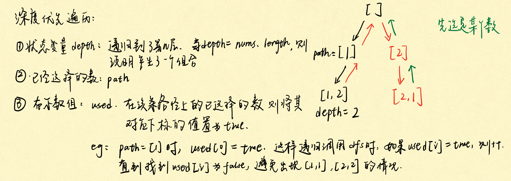
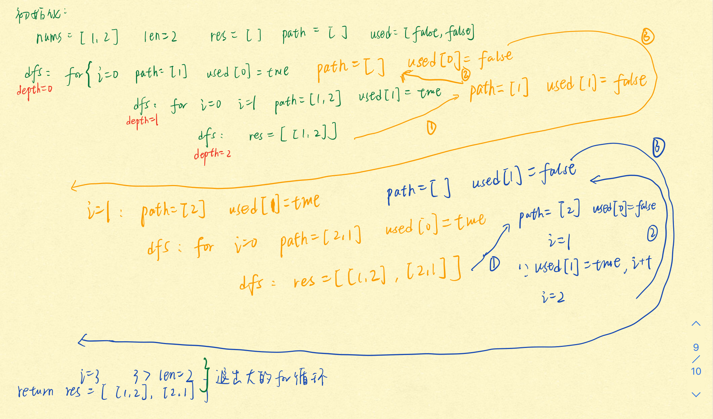

<!-- TOC -->

- [1. 深度优先遍历](#1-深度优先遍历)
  - [1.1. 概念](#11-概念)
  - [1.2. 排列、组合、子集类经典问题](#12-排列组合子集类经典问题)
    - [1.2.1. 排列问题](#121-排列问题)
      - [1.2.1.1. 全排列](#1211-全排列)
      - [1.2.1.2. 全排列 2](#1212-全排列-2)
      - [1.2.1.3 第 k 个全排列](#1213-第-k-个全排列)
    - [1.2.2. 组合问题](#122-组合问题)
      - [1.2.2.1 组合总和](#1221-组合总和)
      - [1.2.2.2 组合总和 2](#1222-组合总和-2)
      - [1.2.2.3 组合](#1223-组合)
    - [1.2.3 子集问题](#123-子集问题)
      - [1.2.3.1 子集](#1231-子集)
      - [1.2.3.2 子集 2](#1232-子集-2)
    - [1.2.4 其他应用](#124-其他应用)
      - [1.2.4.1 复原 IP 地址](#1241-复原-ip-地址)
  - [1.3 字符串中的回溯问题](#13-字符串中的回溯问题)
    - [1.3.1 电话号码的字母组合(中等)](#131-电话号码的字母组合中等)
    - [1.3.2 字母大小写全排列](#132-字母大小写全排列)
    - [1.3.3 括号生成](#133-括号生成)

<!-- /TOC -->

# 1. 深度优先遍历

## 1.1. 概念

定义：Depth-First-Search,DFS,是一种用于遍历或搜索树或图的算法。这个算法会 尽可能深 的搜索树的分支。当结点 v 的所在边都己被探寻过，搜索将 回溯 到发现结点 v 的那条边的起始结点。这一过程一直进行到已发现从源结点可达的所有结点为止。如果还存在未被发现的结点，则选择其中一个作为源结点并重复以上过程，整个进程反复进行直到所有结点都被访问为止。

具体的可以看：https://leetcode-cn.com/problems/permutations/solution/hui-su-suan-fa-python-dai-ma-java-dai-ma-by-liweiw/
其中关于全排列问题的解析，比较容易理解一些

## 1.2. 排列、组合、子集类经典问题

### 1.2.1. 排列问题

#### 1.2.1.1. 全排列

```
46. 全排列
给定一个 没有重复 数字的序列，返回其所有可能的全排列。

示例:

输入: [1,2,3]
输出:
[
  [1,2,3],
  [1,3,2],
  [2,1,3],
  [2,3,1],
  [3,1,2],
  [3,2,1]
]
```

首先需要定义几个状态变量：

path:栈，负责存储当前的路由
used:负责将当前已经使用过的元素的索引设置为 true,例如[1,2,3],选择 1，则令 used[0]=true,然后开始下一轮的 dfs 查询，for 循环从 0 开始，发现 used[0]=true,则跳过 i=0，i=1 找到了 2。
depth: 对于一个树而言，根节点的 depth=0,第一级子节点的 depth=1,...



树形图：


- 可以发现当 depth === nums.length 时，我们就找出了一个排列，此时就将该排列插入到最终的结果数组中

解析参考：https://leetcode-cn.com/problems/permutations/solution/hui-su-suan-fa-python-dai-ma-java-dai-ma-by-liweiw/

```
const permute = (nums) => {
  let len = nums.length;
  let res = Array();
  if (len === 0) {
    return res;
  }
  let path = [];
  let used = Array(len).fill(false);
  // 从nums中的第一个元素开始深度优先遍历
  dfs(nums, len, 0, path, used, res);
  return res;
};
function dfs(nums, len, depth, path, used, res) {
  if (depth === len) {
    // 注意这里：不能直接写push(path)
    res.push(path.slice());
    return;
  }
  for (let i = 0; i < len; i++) {
    if (used[i]) {
      continue;
    }
    path.push(nums[i]);
    used[i] = true;
    // 将该元素放入path中后，寻找下一个元素
    dfs(nums, len, depth + 1, path, used, res);
    // 将该条路径遍历结束后，将元素从path中去除，寻找下一个遍历开始的元素
    path.pop();
    used[i] = false;
  }
}
```



#### 1.2.1.2. 全排列 2

数组中包含重复元素

注意：**一般如果想要避免无序数组导致的重复，就需要首先对其进行排序**
参考题解：https://leetcode-cn.com/problems/permutations-ii/solution/hui-su-suan-fa-python-dai-ma-java-dai-ma-by-liwe-2/

总之需要找到剪枝的条件：

```
if (i > 0 && nums[i] == nums[i - 1] && !used[i - 1]) {
    continue;
}
```


```
const permuteUnique = (nums) => {
  // 排序
  nums.sort();

  let len = nums.length;
  let res = Array();
  if (len === 0) {
    return res;
  }
  let path = [];
  let used = Array(len).fill(false);

  dfs(nums, len, 0, path, used, res);
  return res;
};
function dfs(nums, len, depth, path, used, res) {
  if (depth === len) {
    // 注意这里：不能直接写push(path)
    res.push(path.slice());
    return;
  }
  for (let i = 0; i < len; i++) {
    if (used[i] || (i > 0 && nums[i - 1] === nums[i] && !used[i - 1])) {
      continue;
    }
    path.push(nums[i]);
    used[i] = true;
    dfs(nums, len, depth + 1, path, used, res);
    path.pop();
    used[i] = false;
  }
}
```

#### 1.2.1.3 第 k 个全排列

困难

```
60. 排列序列
给出集合 [1,2,3,...,n]，其所有元素共有 n! 种排列。

按大小顺序列出所有排列情况，并一一标记，当 n = 3 时, 所有排列如下：

"123"
"132"
"213"
"231"
"312"
"321"
给定 n 和 k，返回第 k 个排列。


示例 1：

输入：n = 3, k = 3
输出："213"
示例 3：

输入：n = 3, k = 1
输出："123"
```

解题思路：从第一个全排列开始找到第 k 个全排列，当 res.length >= k-1 时，说明找到了第 k 个全排列，剪枝即可

```
const getPermutation = (n, k) => {
  let res = Array();
  let nums = [];
  for (let i = 0; i < n; i++) {
    nums[i] = i + 1;
  }
  let path = [];
  let used = Array(n).fill(false);
  // 从nums中的第一个元素开始深度优先遍历
  dfs(nums, n, 0, path, used, res, k);
  // 由于得到的res[k-1]为[2,1,3],先将其转为string,然后通过正则表达式全局去除所有的逗号
  return res[k - 1].toString().replace(/,/g, "");
};
function dfs(nums, n, depth, path, used, res, k) {
  // 剪枝，如果res.length比k大
  // 说明已经找到了第k大的组合
  if (res.length >= k) {
    return;
  }
  if (depth === n) {
    // 注意这里：不能直接写push(path)
    res.push(path.slice());
    return;
  }
  for (let i = 0; i < n; i++) {
    if (used[i]) {
      continue;
    }
    path.push(nums[i]);
    used[i] = true;
    // 将该元素放入path中后，寻找下一个元素
    dfs(nums, n, depth + 1, path, used, res, k);
    // 将该条路径遍历结束后，将元素从path中去除，寻找下一个遍历开始的元素
    path.pop();
    used[i] = false;
  }
}
```

### 1.2.2. 组合问题

#### 1.2.2.1 组合总和

给定的数组无序，但是无重复元素
注意题目的要求：candidates 中的元素可以多次使用

```
39. 组合总和
给定一个无重复元素的数组 candidates 和一个目标数 target ，找出 candidates 中所有可以使数字和为 target 的组合。

candidates 中的数字可以无限制重复被选取。

说明：

所有数字（包括 target）都是正整数。
解集不能包含重复的组合。
示例 1：

输入：candidates = [2,3,6,7], target = 7,
所求解集为：
[
  [7],
  [2,2,3]
]
示例 2：

输入：candidates = [2,3,5], target = 8,
所求解集为：
[
  [2,2,2,2],
  [2,3,3],
  [3,5]
]
```

解法参考：
https://leetcode-cn.com/problems/combination-sum/solution/hui-su-suan-fa-jian-zhi-python-dai-ma-java-dai-m-2/

这道题目中使用的是 begin,没有使用 used，这是因为在排列问题中[1,2]和[2,1]不是同一个结果，而在子集问题中[1,2]和[2,1]是一个结果

使用 used 时：

- 遍历 nums:
- 选择 1，则新一轮的 dfs 从 i=0 开始，因为 used[0]=true,所以跳到了 i=1,就选到了 2，得到了[1,2]；
- 当选择 2 时，新一轮的 dfs 还是从 i=0 开始，但是此时 used[0]=false,此时就可以选择 1 得到[2,1]了

使用 begin 时：(新的 begin=i)

- 遍历 nums:
- 选择 1 后，还可以选择 1 或者 2；
- 选择 2 后可以选择 2，就不能选择 2 以前的数了

```
var dfs = function (candidates, begin, len, target, path, res) {
  if (target === 0) {
    res.push(path.slice());
    return;
  }
  for (let i = begin; i < len; i++) {
    // 剪枝
    if (target - candidates[i] < 0) {
      break;
    }
    path.push(candidates[i]);
    // console.log("递归之前 => " + path + "，剩余 = " + (target - candidates[i]));

    // 由于同一个元素可以多次使用，所以下一次深度遍历也是从当前元素所在的位置，即也需要遍历当前元素  i
    dfs(candidates, i, len, target - candidates[i], path, res);
    path.pop();
    // console.log("递归之后 => " + path);
  }
};
var combinationSum = function (candidates, target) {
  candidates.sort((a, b) => {
    return a - b;
  });
  let len = candidates.length;
  const res = Array();
  if (len === 0) {
    return res;
  }
  const path = [];
  dfs(candidates, 0, len, target, path, res);
  return res;
};
```

#### 1.2.2.2 组合总和 2

参考题解：https://leetcode-cn.com/problems/combination-sum-ii/solution/hui-su-suan-fa-jian-zhi-python-dai-ma-java-dai-m-3/

```
var dfs = function (candidates, begin, len, target, path, res) {
  if (target === 0) {
    res.push(path.slice());
    return;
  }
  for (let i = begin; i < len; i++) {
    if (target - candidates[i] < 0) {
      // 大剪枝，当新一轮的target小于0，则停止这条线路上的循环，因为candidates[i]相比于其后面的数而言已经是这条线路上最小的数了
      break;
    }
    if (candidates[i] === candidates[i - 1] && i > begin) {
      continue;
    }
    path.push(candidates[i]);
    console.log("递归之前 => " + path + "，剩余 = " + (target - candidates[i]));
    dfs(candidates, i + 1, len, target - candidates[i], path, res);
    path.pop();
    console.log("递归之后 => " + path);
  }
};
var combinationSum = function (candidates, target) {
  candidates.sort((a, b) => {
    return a - b;
  });
  let len = candidates.length;
  if (len === 0) {
    return res;
  }
  const res = Array();
  const path = [];
  dfs(candidates, 0, len, target, path, res);
  return res;
};
```

#### 1.2.2.3 组合

```
77. 组合
给定两个整数 n 和 k，返回 1 ... n 中所有可能的 k 个数的组合。

示例:

输入: n = 4, k = 2
输出:
[
  [2,4],
  [3,4],
  [2,3],
  [1,2],
  [1,3],
  [1,4],
]
```

注意：

- 1 本题中给定 n,产生一个长度为 n 的数组，元素为[1,...,n]
- 2 [1,2]和[2,1]属于同一组数，所以使用 begin

解题思路：

- 首先定义一个数组保存[1,...,n]
- 然后依次遍历每个元素，当 depth=k 时，就回溯
- 使用 begin=i+1,保证当前元素不发生重复

```
const combine = (n, k) => {
  let res = Array();
  if (n < k) {
    return res;
  }
  let nums = [];
  for (let i = 0; i < n; i++) {
    nums[i] = i + 1;
  }
  let path = [];
  dfs(nums, n, k, (depth = 0), path, res, 0);
  return res;
};
function dfs(nums, n, k, depth, path, res, begin) {
  if (depth === k) {
    // 注意这里：不能直接写push(path)
    res.push(path.slice());
    return;
  }
  for (let i = begin; i < n; i++) {
    path.push(nums[i]);
    // 将该元素放入path中后，寻找下一个元素
    dfs(nums, n, k, depth + 1, path, res, i + 1);
    // 将该条路径遍历结束后，将元素从path中去除，寻找下一个遍历开始的元素
    path.pop();
  }
}
```

### 1.2.3 子集问题

#### 1.2.3.1 子集

```
78. 子集
给定一组不含重复元素的整数数组 nums，返回该数组所有可能的子集（幂集）。

说明：解集不能包含重复的子集。

示例:

输入: nums = [1,2,3]
输出:
[
  [3],
  [1],
  [2],
  [1,2,3],
  [1,3],
  [2,3],
  [1,2],
  []
]
```

注意题目要求：

- 数组不含重复元素
- [1,2]和[2,1]属于同一个元素，所以考虑使用 begin=i+1

```
const subsets = (nums) => {
  let n = nums.length;
  let res = Array();
  let path = [];
  dfs(nums, n, path, res, 0);
  return res;
};
function dfs(nums, n, path, res, begin) {
  res.push(path.slice());
  for (let i = begin; i < n; i++) {
    path.push(nums[i]);
    dfs(nums, n, path, res, i + 1);
    path.pop();
  }
}
```

#### 1.2.3.2 子集 2

- 非有序数组，包含重复元素：考虑首先使用排序算法对其排序，保证后面去重的有效性
- 同 1.7.4 题相同，当 nums[i] === nums[i-1] && i>begin 时剪枝

```
const subsets = (nums) => {
  let n = nums.length;
  let res = Array();
  let path = [];
  dfs(nums, n, path, res, 0);
  return res;
};
function dfs(nums, n, path, res, begin) {
  res.push(path.slice());
  for (let i = begin; i < n; i++) {
    // 剪枝
    if (nums[i] === nums[i - 1] && i > begin) {
      continue;
    }
    path.push(nums[i]);
    // 将该元素放入path中后，寻找下一个元素
    dfs(nums, n, path, res, i + 1);
    path.pop();
  }
}
```

### 1.2.4 其他应用

#### 1.2.4.1 复原 IP 地址

注意：有效的 IP 地址要求：(1)4 个字段；(2)每个字段范围[0,255];(3)字段之间使用.隔开

例如："0.1.2.201" 和 "192.168.1.1" 是 有效的 IP 地址，但是 "0.011.255.245"、"192.168.1.312" 和 "192.168@1.1" 是 无效的 IP 地址。

```
示例 1：

输入：s = "25525511135"
输出：["255.255.11.135","255.255.111.35"]
示例 2：

输入：s = "0000"
输出：["0.0.0.0"]

来源：力扣（LeetCode）
链接：https://leetcode-cn.com/problems/restore-ip-addresses
```

解题参考：https://leetcode-cn.com/problems/restore-ip-addresses/solution/fu-yuan-ipdi-zhi-by-leetcode-solution/

画出树图如下：
执行顺序相当于对该树的前序遍历

```
var restoreIpAddresses = function (s) {
  // 总共4个地址段
  let SEG_COUNT = 4;
  // 存放4段的IP地址
  const segments = new Array(SEG_COUNT);
  // 存放最后的结果
  const ans = [];

  var dfs = function (s, segId, segStart) {
    // 如果已经找到了第4段
    if (segId === SEG_COUNT) {
      if (segStart === s.length) {
        // 并且用光了所有字符,则找到了一个IP
        ans.push(segments.join("."));
      }
      // 找到了4段并且用完了所有字符  或者  找到了4段但未用完所有字符
      return;
    }

    // 如果还没有找到4段IP地址就遍历完了字符串，那就提前回溯
    if (segStart === s.length) {
      return;
    }

    // 剪枝：如果剩余可选的字符的长度大于所需的长度，则直接return回溯
    if (segId === 1 && s.length - segStart > 9) {
      return;
    }
    if (segId === 2 && s.length - segStart > 6) {
      return;
    }
    if (segId === 3 && s.length - segStart > 3) {
      return;
    }

    // 如果当前数字为0，则这一段的IP地址只能为0
    if (s.charAt(segStart) === "0") {
      segments[segId] = 0;
      dfs(s, segId + 1, segStart + 1);
    }

    // 一般情况,枚举所有可能性并且递归
    let addr = 0;
    for (let segEnd = segStart; segEnd < s.length; segEnd++) {
      addr = addr * 10 + (s.charAt(segEnd) - "0");
      // console.log(addr);
      if (addr > 0 && addr <= 255) {
        segments[segId] = addr;
        dfs(s, segId + 1, segEnd + 1);
      } else {
        break;
      }
    }
  };

  dfs(s, 0, 0);
  return ans;
};
```

## 1.3 字符串中的回溯问题

### 1.3.1 电话号码的字母组合(中等)

```17. 电话号码的字母组合
给定一个仅包含数字 2-9 的字符串，返回所有它能表示的字母组合。

给出数字到字母的映射如下（与电话按键相同）。注意 1 不对应任何字母。


示例:

输入："23"
输出：["ad", "ae", "af", "bd", "be", "bf", "cd", "ce", "cf"].
```

注意：参数 digits 不仅仅为两个数字组成的字符串，还可以更多
题解参考：https://leetcode-cn.com/problems/letter-combinations-of-a-phone-number/

```
const letterCombinations = function (digits) {
  if (digits.length === 0) {
    return [];
  }
  const res = []; // 存放最终的结果
  const map = {
    2: "abc",
    3: "def",
    4: "ghi",
    5: "jkl",
    6: "mno",
    7: "pqrs",
    8: "tuv",
    9: "wxyz",
  };
  const dfs = function (curStr, i) {
    if (i > digits.length - 1) {
      res.push(curStr);
      return;
    }

    const letters = map[digits[i]];
    for (let letter of letters) {
      dfs(curStr + letter, i + 1);
    }
  };
  dfs("", 0);
  return res;
};
```

### 1.3.2 字母大小写全排列

```
784. 字母大小写全排列
给定一个字符串S，通过将字符串S中的每个字母转变大小写，我们可以获得一个新的字符串。返回所有可能得到的字符串集合。


示例：
输入：S = "a1b2"
输出：["a1b2", "a1B2", "A1b2", "A1B2"]

输入：S = "3z4"
输出：["3z4", "3Z4"]

输入：S = "12345"
输出：["12345"]

输入：S = "C"
输出：["c","C"]
```

先画出树形图：其中红色表示需要回溯的地方


```
var letterCasePermutation = function (s) {
  if (s.length === 0) {
    return [];
  }
  let res = [];
  // 回溯算法：curStr:当前的串   i:当前的指针
  const dfs = function (curStr, i) {
    // 如果当前指针指向了超出s范围的索引，则说明得到了一个结果
    if (i > s.length - 1) {
      res.push(curStr);
      return;
    }
    // 如果s[i]是数字，则直接将其添加到curStr中，进行下一轮dfs
    if (s[i] >= 0 && s[i] <= 9) {
      curStr += s[i];
      dfs(curStr, i + 1);
    }
    // 如果s[i]是小写字母，则先将s[i]本身添加到curStr中，进行下一轮dfs
    if (s[i] >= "a" && s[i] <= "z") {
      curStr += s[i];
      dfs(curStr, i + 1);
      // 当小写字母这一路径结束后，再将str[i]的大写添加到curStr中，进行下一轮dfs
      curStr = curStr.slice(0, curStr.length - 1) + s[i].toUpperCase();
      dfs(curStr, i + 1);
    }
    if (s[i] >= "A" && s[i] <= "Z") {
      curStr += s[i].toLowerCase();
      dfs(curStr, i + 1);
      curStr = curStr.slice(0, curStr.length - 1) + s[i];
      dfs(curStr, i + 1);
    }
  };
  dfs("", 0);
  return res;
};
```

### 1.3.3 括号生成

```
22. 括号生成
数字 n 代表生成括号的对数，请你设计一个函数，用于能够生成所有可能的并且 有效的 括号组合。


示例：

输入：n = 3
输出：[
       "((()))",
       "(()())",
       "(())()",
       "()(())",
       "()()()"
     ]
```

首先画出树形图：


插入左右括号的原则：

- 各自的插入数量不可以超过 n
- 可以插入右括号的原则：左括号已经插入的数量大于右括号

```
var generateParenthesis = function (n) {
  let res = [];
  const dfs = function (curStr, left, right) {
    if (curStr.length === 2 * n) {
      res.push(curStr);
      return;
    }
    if (left > 0) {
      dfs(curStr + "(", left - 1, right);
    }
    if (left < right) {
      dfs(curStr + ")", left, right - 1);
    }
  };
  dfs("", n, n);
  return res;
};
```

参考题解：https://leetcode-cn.com/problems/generate-parentheses/solution/ru-men-ji-bie-de-hui-su-fa-xue-hui-tao-lu-miao-don/

https://leetcode-cn.com/problems/generate-parentheses/solution/shou-hua-tu-jie-gua-hao-sheng-cheng-hui-su-suan-fa/
