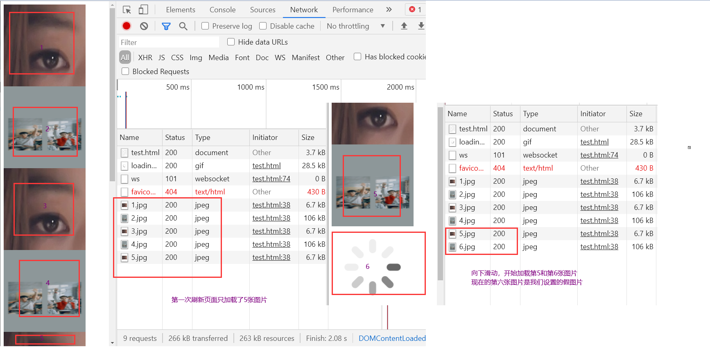

###  1 Symbol值作为属性名

```
Symbol作为属性名时：
	遍历对象的时候，该属性不会出现在 for in 或者for of循环中
	也不会出现在Object.getOwnPropertyNames(obj)、Object.keys(obj)、JSON.stringify(obj)中
	
	只能通过Object.getOwnPropertySymbols(obj) 获得obj中的Symbol属性
	
因此可以使用Symbol属性为对象定义一些非私有的、但又希望只用于对象内部的方法
例如：Iterator迭代器

Object.getOwnPropertyNames()   获取所有对象自身的属性，包括不可遍历的属性
Object.keys/for in 获取所有对象自身的属性,不包括不可遍历的属性
```

### 2 Reflect.ownKeys()

```
可以返回所有类型的属性名，包括Symbol属性名
```

### 3 判断一个对象为空

```
Object.keys(obj)判断可遍历属性的长度
Object.getOwnPropertySymbols(obj)判断obj的Symbol属性的长度

function isObjNUll(obj){
	return Object.keys(obj).length === 0 && Object.getOwnPropertySymbols(obj).length === 0;
}
```

### 4 使用闭包实现每隔1秒打印1,2,3,4

```
// 形成闭包 需要有两个函数 外部函数是立即执行函数 内部函数是回调函数  内部函数使用了外部函数的变量
for(var i=1;i<5;i++){
	(function(i){
		setTimeout(()=>{
            console.log(i);
        },1000*i)
	})(i);
}

// 不用闭包，则必须使用let关键字 声明块级作用域
for(let i=1;i<5;i++){
    setTimeout(()=>{
        console.log(i);
    },1000*i)
}
```

### 5 手写一个Jsonp

```
JsonP:
	跨域通信的手段
	使用script脚本的src属性发送ajax请求，url就是服务器的地址
	只能是get请求 
	
<script src='http:xxxxxxx?name=whh&age=18&callback=fun></script>

	1. callback定义了一个函数名，而远程服务端通过调用指定的函数并传入参数来实现传递参数，将fun(data)传递回客户端
	2. 服务器端返回执行函数fun的js脚本：res.send("fun(data)")
	3. 客户端接收到返回的js脚本，开始解析和执行fn(response)
	
注意：
	1. 页面动态加载的脚本文件，如果加载失败，需要处理
		兼容：
		// script标签的onerror事件，IE6~8与opera11都不支持
		script.onerror = function () {
          callback && callback({ error: "error" });
          container.removeChild(script);
          window[fnName] && delete window[fnName];
        };
        // 只有IE11不支持
        script.onreadystatechange = function () {
          // readyState是onreadystatechange事件的一个状态，loaded和complete表示脚本成功加载完
          if (
            !this.readyState ||   // 非ie11
            this.readyState === "loaded" ||
            this.readyState === "complete" ||
            !window[fnName]  // 未给window添加fnName属性，表明脚本出错，未执行
          ) {
            callback && callback({ error: "error" });
            container.removeChild(script);
            window[fnName] && delete window[fnName];
          }
        };
```

客户端：

```
(function (window) {
  var jsonp = function (options) {
    var { url, params, callback, fnName } = options;
    // 处理地址
    // 1 判断当前传入的地址中是否已经包含有参数  并且新参数是否有值
    var paramStr = url.indexOf("?") === -1 ? "?" : "&";
    // 2 添加新的参数
    Object.keys(params).forEach((key) => {
      paramStr += key + "=" + params[key] + "&";
    });

    // 处理回调函数名   Math.random返回一个浮点数,  伪随机数在范围从0到小于1
    let random1 = Math.random().toString().replace(".", "");
    fnName += random1;

    // 添加回调函数
    paramStr += "callback=" + fnName;

    // 新建一个script标签
    var container = document.getElementsByTagName("head")[0];
    var script = document.createElement("script");
    console.log(url + paramStr);
    script.src = url + paramStr;

    // 定义前端的回调,给window添加了一个函数方法，服务器返回该方法的执行语句
    // 服务器返回的结果：myJsonp随机数(data),所以在收到服务器的响应结果时就会自动调用下面的函数
    window[fnName] = function (data) {
      // 执行回调
      callback(...arguments);
      // 删除这个引入的脚本
      container.removeChild(script);
      delete window[fnName]; //使用完就删掉为其添加的属性
    };

    // 请求出错处理：script的onerror事件，IE6~8与opera11都不支持
    script.onerror = script.onreadystatechange = function () {
      // readyState是onreadystatechange事件的一个状态
      if (
        !this.readyState ||
        this.readyState === "loaded" ||
        this.readyState === "complete" ||
        !window[fnName]
      ) {
        callback && callback({ error: "error" });
        container.removeChild(script);
        window[fnName] && delete window[fnName];
      }
    };

    container.appendChild(script);
  };
  // 将封装的jsonp添加为window的属性
  window.jsonp = jsonp;
})(this);
window.jsonp({
  url: "http://localhost:8000/products1",
  params: {},
  callback: function (data) {
    console.log(typeof data);
    var result = JSON.stringify(data); // 转为json字符串
    console.log(result);
  },
  fnName: "myJsonp",
});
```

服务器端要对于响应数据进行特殊处理：

```
服务器端返回的是执行指定回调的语句，参数是响应结果，则因为该回调已经成为了window的方法，所以会直接执行该方法

app.get("/products1", (req, res) => {
  const { callback } = req.query;
  const data ="age:13";
  const str = callback + '("' + data + '")';
  res.send(str);   // 返回的是 callback函数名(data)  执行该函数的语句
});
```

### 6 手写一个观察者模式，即发布订阅模式

> - 定义一个对象，保存所有用户对于不同消息的订阅回调
>
>   - 在某个用户订阅时，使用一个对象保存对应消息的回调(并且需要标记是哪一个用户的订阅)
>
>   - 在发布某个消息时，依次执行该消息所对应的对象中保存的所有回调
>
>   - ```
>     callbacksObj={
>     	add:{
>     		token0:fun1,
>     		token1:fun2
>     	},
>     	minus:{
>     		token2:fun3,
>     		token3:fun4
>     	}
>     }
>     ```
>
> - 取消消息订阅：就是操作回调栈

```
var PubSub = (function () {
  var callbacksObj = {}; // 保存所有回调的容器
  let id = 0; // 用于生成token的标记，标记某个用户
  return {
    /* 
    1. 订阅消息
    */
    subscribe: function (msgName, callback) {
      // 确定token
      const token = "token_" + ++id;
      // 取出当前消息对应的callbacks
      const callbacks = callbacksObj[msgName];
      if (!callbacks) {
        // 如果callbacks是undefined,则表示当前回调中对应的msgName消息还没有订阅信息
        callbacksObj[msgName] = {
          [token]: callback,
        };
      } else {
        // 否则就加入当前token用户的订阅信息
        callbacks[token] = callback;
      }
      return token;
    },
    /* 
    2. 发布异步消息
    */
    publish: function (msgName, data) {
      // 取出当前消息对应的回调列表
      let callbacks = callbacksObj[msgName];
      if (callbacks) {
        // 启动定时器，异步执行所有的回调
        setTimeout(() => {
          Object.values(callbacks).forEach((callback) => {
            callback(data);
          });
        }, 0);
      }
    },
    /* 
    3. 发布同步消息
    */
    publishSync: function (msgName, data) {
      // 取出当前消息对应的回调列表
      let callbacks = callbacksObj[msgName];
      if (callbacks) {
        // 立即依次执行所有的回调，因为订阅时是后订阅的放尾部
        Object.values(callbacks).forEach((callback) => {
          callback(data);
        });
      }
    },
    /*
    4.取消消息订阅   操作回调栈
        4.1 flag:undefined   取消所有的消息订阅，清空回调栈
        4.2 flag:token   取消某个用户的所有类型的消息订阅
        4.3 flag:msgName  取消某类型消息的消息订阅
    */
    unsubscribe: function (flag) {
      if (flag === undefined) {
        // 4.1
        callbacksObj = {};
      } else if (typeof flag === "string") {
        if (flag.indexOf("token_") !== -1) {
          // 4.2
          Object.keys(callbacksObj).forEach((msgNameObj) => {
            msgNameObj[flag] && delete msgNameObj[flag];
          });
        } else {
          // 4.3
          delete callbacksObj[flag];
        }
      } else {
        throw new Error("如果传入参数，则类型必须是字符串");
      }
    },
  };
})();
// 订阅消息
PubSub.subscribe("add", (data) => {
  console.log("add()...", data);
});
PubSub.subscribe("add", (data) => {
  console.log("add2()...", data);
});
const token = PubSub.subscribe("add", (data) => {
  console.log("add3()...", data);
});
PubSub.subscribe("update", (data) => {
  console.log("update()...", data);
});

PubSub.publish("add", 123);
```

### 7 事件

#### 7.1 手写事件总线：事件回调处理

> - on: 绑定事件监听，保存事件回调
> - emit: 触发事件回调，执行该事件对应的所有回调
> - off: 解除事件绑定，清除回调队列

```
var eventBus = (function () {
  var callbackObj = {};
  return {
    /* 
    1. 绑定事件监听
    */
    on: function (eventName, callback) {
      var callbacks = callbackObj[eventName];
      if (!callbacks) {
        callbackObj[eventName] = [callback];
      } else {
        callbacks.push(callback);
      }
    },
    /* 
    2. 分发事件,触发事件
    */
    emit: function (eventName, data) {
      var callbacks = callbackObj[eventName];
      if (callbacks && callbacks.length > 0) {
        callbacks.forEach((callback) => {
          callback(data);
        });
      }
    },
    /* 
    3. 移除事件监听
    	3.1 eventName:undefined  清除所有的回调
    	3.2 eventName：  清除某个事件的所有回调
    */
    off: function (eventName) {
      if (eventName) {
        delete callbackObj[eventName];
      } else {
        callbackObj = {};
      }
    },
  };
})();

eventBus.on("add", (data) => {
  console.log("add", data);
});
eventBus.on("add", (data) => {
  console.log("add2", data);
});
eventBus.on("delete", (data) => {
  console.log("delete", data);
});

// eventBus.off("add");
// eventBus.off();

eventBus.emit("add", 123);
eventBus.emit("delete", "abc");
```

#### 7.2 封装一个兼容的事件监听器函数

```
const eventUtils = {
	// 添加事件
	addEvent: function(element,type,handler){
		if(element.addEventListener){
			// IE9+
			element.addEventListener(type,handler,false);
		}else if(element.attachEvent){
			// IE5-IE10
			element.attachEvent("on"+type,handler);
		}else{
			element["on"+type] = handler;
		}
	}
	// 移除事件
	removeEvent: function(element,type,handler){
		if(element.removeEventListener){
			element.removeEventListener(type,handler,false);
		}else if(element.detachEvent){
			element.detachEvent("on"+type,handler);
		}else{
			element["on"+type] = null;
		}
	}
	// 获取事件的目标
	getEvent: function(event){
		// target兼容IE    srcElement兼容firefox
		return event.target || event.srcElement;
	}
	// 获取event的引用
	getEvent: function(){
		return event||window.event;
	}
	// 阻止事件冒泡
	stopPropagation: function(event){
		if(event.stopPropagation){
			event.stopPropagation();   //Chrome forefox
		}else{
			event.cancelBubble = true;  // Ie
		}
	}
	// 取消事件的默认行为
	preventDefault: function(event){
		if(event.preventDefault){
			// IE11 其他浏览器
			event.preventDefault();
		}else{
			// IE10-
			event.returnValue = false;
		}
	}
}
```

##### 7.2.1 表单项 超链接 阻止默认跳转

```
常见的浏览器默认行为：
	form表单项提交
	a标签跳转
	
使用return false可以阻止上面的默认行为，但是要注意使用方法,并不是事件回调fn中return false，而是要在指定方法时就return false

表单项：
    <form action="http://baidu.com" id="form" onsubmit="return false;">
    </form>
    <form action="http://baidu.com" id="form" onsubmit="fn(); return false;">
    </form>
超链接：
	<a href='http://baidu.com' onclick='fn(); return false;'></a>
	
这种的return false是可以支持所有的浏览器阻止默认行为的
```

##### 7.2.2 文字拖拽问题

```
当文字或者图片被选中时，浏览器会给予它们默认的拖拽行为，拖动鼠标，被选中的文字或图片就会跟着鼠标被拖动

所以在拖拽例子中，就存在一个问题：选中图片或文字时，拖动div块，会发现div块没有动，但是图片和文字跟着移动了，这说明浏览器又响应了默认行为

阻止默认行为：

1. IE8+ 其他浏览器中：
	在事件最后添加return false;

2.IE7-:element.setCapture()
    - 设置某个元素对于鼠标按下相关的事件进行捕获
    - 当调用某个元素A的setCapture方法后，这个元素会将下一次所有的鼠标按下相关的事件捕获到自己身上，即点击其他元素的鼠标按下事件，会直接触发元素A的鼠标按下事件，但是只有效一次，再次点击其他元素则会正常触发其他元素的鼠标按下事件
    - 需要与element.releaseCapture()结合使用，如果在使用完之后不取消捕获element.releaseCapture()，则只要在页面内按下鼠标，则均会触发element的鼠标按下事件
    - 相当于使用element的鼠标按下事件代替了浏览器的默认事件
```

#### 7.3 带委派的事件监听

```
/* 
语法：myAddEventListener(element, type, fn, selector)
    element:父级元素选择器
    type:事件类型
    fn:事件回调
    selector:子元素选择器
说明：
    1 如果selector没有，直接给element绑定事件，这样由于冒泡，所有的子元素点击都会触发事件
    2 如果selector有，将selector对应的多个元素的事件委托绑定给父元素element，只有满足selector的子元素点击才可以触发事件
        例如：给父元素添加了事件点击，selector是子元素btn1,则实际上只有点击了btn1时才会触发事件，点击父元素的其他btn不会触发事件
*/
function myAddEventListener(element, type, fn, selector) {
  // 获取父元素
  if (typeof element === "string") {
    element = document.querySelector(element);
  }
  // 如果没有指定selector, 普通的事件绑定,直接绑定为父元素 element
  if (!selector) {
    element.addEventListener(type, fn);
  } else {
    // 否则是带委托的事件绑定：将事件绑定给父元素，但是是在子元素点击时调用的
    element.addEventListener(type, function (event) {
      // 得到真正发生事件的目标元素,即子元素
      const target = event.target;
      // 如果与选择器匹配
      if (target.matches(selector)) {
        // 调用处理事件的回调fn, 并指定this为目标元素, 参数为event
        fn.call(target, event);
      }
    });
  }
}
```

### 手写ajax

不需要返回promise对象

```
/* 
 method
 url
 data
 success 数据下载成功以后执行的函数
 error  数据下载失败以后执行的函数
 */
function $ajax({ method = "get", url, data, success, error }) {
  //1、创建ajax对象
  var xhr = null;
  try {
    xhr = new XMLHttpRequest();
  } catch (error) {
    xhr = new ActiveXObject("Microsoft.XMLHTTP");
  }
  //判断如果数据存在
  if (data) {
    data = querystring(data);
  }
  if (method == "get" && data) {
    url += "?" + data;
  }
  xhr.open(method, url, true);
  if (method == "get") {
    xhr.send();
  } else {
    //必须在send方法之前，去设置请求的格式
    xhr.setRequestHeader("content-type", "application/x-www-form-urlencoded");
    xhr.send(data);
  }
  //4、等待数据响应
  xhr.onreadystatechange = function () {
    if (xhr.readyState == 4) {
      //判断本次下载的状态码都是多少
      if (xhr.status == 200) {
        /* 
  如何去处理数据操作不确定
  回调函数
  */
          success(xhr.responseText);
      } else {
          error("Error:" + xhr.status);
      }
    }
  };
}
function querystring(obj) {
  var str = "";
  for (var attr in obj) {
    str += attr + "=" + obj[attr] + "&";
  }
  return str.substring(0, str.length - 1);
}

```

### 8 手写axios封装

> - 1 axios返回的是一个promise对象
> - 2 get请求中，url中需要携带请求参数，所以需要对于参数进行处理
>   - 其他方法也可以在url中携带参数
> - 3 post,put,delete请求中，数据位于请求体中
>   - 3.1 告诉服务器请求体的格式是json:`xhr.setRequestHeader("Content-Type","application/json;charset=utf-8");`
>   - 3.2 将数据转换为JSON格式：`xhr.send(JSON.stringify(data));`
> - 4 还需要进行方法的封装

```
var myAxios = function (options) {
  return new Promise((resolve, reject) => {
    var { url, method = "GET", params, data } = options;
    // 将方法统一为大写格式
    var method = method.toUpperCase();
    /*
    1. 处理地址
    */
    // 1.1 判断当前传入的地址中是否已经包含有参数  并且新参数是否有值
    var paramStr = url.indexOf("?") === -1 ? "?" : "&";
    // 1.2 添加新的参数
    Object.keys(params).forEach((key) => {
      paramStr += key + "=" + params[key] + "&";
    });
    paramStr = paramStr.substring(0, paramStr.length - 1);
    url = url + paramStr;

    /*
    2 执行异步ajax请求
    */
    var xhr = new XMLHttpRequest();
    xhr.open(method, url, true);
    // 发送请求
    if (method === "GET") {
      xhr.send();
    } else if (
      method === "POST" ||
      method === "PUT" ||
      method === "DELETE"
    ) {
      // 告诉服务器请求体的格式是json
      xhr.setRequestHeader(
        "Content-Type",
        "application/json;charset=utf-8"
      );
      // 发送json格式请求体参数
      xhr.send(JSON.stringify(data));
    }

    /*
    3 绑定状态改变的监听
    */
    xhr.onreadystatechange = function () {
      // 如果请求没有完成, 直接结束
      if (xhr.readyState !== 4) {
        return;
      }
      // 如果响应状态码在[200, 300)之间代表成功, 否则失败
      const { status, statusText } = xhr;
      // 2.1. 如果请求成功了, 调用resolve()
      if (status >= 200 && status <= 299) {
        // 准备结果数据对象response
        const response = {
          data: JSON.parse(xhr.response),
          status,
          statusText,
        };
        resolve(response); // 修改promise的状态为fulfilling
      } else {
        // 2.2. 如果请求失败了, 调用reject()
        reject(new Error("request error status is " + status)); // 修改promise的状态为rejected
      }
    };
  });
};

// 方法封装
myAxios.get = function (url, options) {
  // 覆盖其中的参数
  return myAxios(Object.assign(options, { url, method: "GET" }));
};
myAxios.delete = function (url, options) {
  return myAxios(Object.assign(options, { url, method: "DELETE" }));
};
myAxios.post = function (url, data, options) {
  return myAxios(Object.assign(options, { url, data, method: "POST" }));
};
myAxios.put = function (url, data, options) {
  return myAxios(Object.assign(options, { url, data, method: "PUT" }));
};

/* 1. GET请求: 从服务器端获取数据*/
myAxios({
  url: "http://localhost:4000/products1",
  method: "GET",
  params: {
    id: 1,
    xxx: "abc",
  },
})
  // axios.get('http://localhost:3000/posts', {params: {id: 1}})
  .then(
    (response) => {
      console.log(response);
    },
    (error) => {
      alert(error.message);
    }
  );
myAxios({
  url: "https://api.apiopen.top/getJoke",
  method: "POST",
  params: {
    a: 100,
  },
  data: {
    title: "json-server---",
    author: "typicode---",
  },
})
  // axios.post('http://localhost:3000/posts', {title: 'aaa', author: 'bbb'})
  .then(
    (response) => {
      console.log(response);
    },
    (error) => {
      alert(error.message);
    }
  );
```

### 9 手写axios二次封装

> - 之所以称为二次封装，是因为axios本身就封装了浏览器的XMLHttpRequest对象，所以对axios再次封装，就称为二次封装
> - 二次封装是在axios包的基础上添加一些基础的配置，添加拦截器操作等，使得axios的使用变得简单，不需要再为每一个axios请求添加相同的配置以及拦截器，代码复用率变高
>   - 1 需要引入axios包
>   - 2 分环境设置基地址
>   - 3 设置超时时间和快鱼是否允许携带凭证
>   - 4 token校验：接收服务器返回的token,存储在redux或者本地存储中，每一次向服务器发送请求，则需要携带token

```
// 二次封装axios
import axios from "axios";

// 根据环境变量区分接口，设置请求基地址
switch (process.env.NODE_ENV) {
  // 生产环境，基地址是生产时服务器的地址
  case "production":
    axios.defaults.baseURL = "http://api.baidu.com";
    break;
  // 测试环境，基地址就是测试服务器的地址
  case "beat":
    axios.defaults.baseURL = "http://192.168.20.12:8080";
    break;
  // 开发环境，匹配开发环境的服务器的地址
  default:
    axios.defaults.baseURL = "http://localhost:4000";
}

// 设置超时时间和快鱼是否允许携带凭证：允许携带cookie信息
axios.defaults.timeout = 10000; // 10s
axios.defaults.withCredentials = true;

// 具体还是要看服务器要求的格式，json格式最常用
// 将请求体的格式修改为json格式，并且添加请求头
axios.defaults.transformRequest = (data) => JSON.stringify(data);
axios.defaults.headers["Content-Type"] = "application/x-www-form-urlencoded";

// token校验：接收服务器返回的token,存储在cookie、redux或者本地存储localStorage中，每一次向服务器发送请求，则需要携带token
// 添加请求拦截器
axios.interceptors.request.use(
  (config) => {
    // 在配置项中添加token
    let token = localStorage.getItem("token");
    token && (config.headers.Authorization = token);  //放置在Authorization请求头中
    return config;
  },
  (error) => {
    return Promise.reject(error);
  }
);

// 添加响应拦截器
axios.defaults.validateStatus = (status) => {
  // 自定义响应成功的HTTP状态码   2xx 或者 3xx 则表示成功  3xx一般走缓存
  return /^(2|3)\d{2}$/.test(status);
};
axios.interceptors.response.use(
  (response) => {
    // 在响应拦截器中直接返回主体内容
    return response.data;
  },
  (error) => {
    console.log(error);
    let { response } = error;
    if (response) {
      // 服务器最起码返回结果了
      switch (response.status) {
        case 401: // 当前请求用户需要验证，一般是未登录
          break;
        case 403: // 服务器已经理解请求，但是拒绝执行，token过期
          localStorage.removeItem("token");
          // 跳转到登录页
          break;
        case 404: // 请求失败，请求所希望得到的资源未在服务器上发现，找不到界面
          break;
        default:
          break;
      }
    } else {
      // 服务器没有返回结果
      if (!window.navigator.onLine) {
        console.log("断网啦");
        // 如果是断网，则进行响应处理，一般就是刷新界面
        return;
      }
      //   如果不是断网的原因，而是服务器的原因，则返回错误原因
      return Promise.reject(error);
    }
  }
);

export default axios;
```

> - 使用express开启一个4000端口的服务器，然后在3000端口的服务器上，访问4000端口的服务器的数据
> - 注意：此时由于属于跨域请求，所以需要在服务器响应端添加响应头：`res.setHeader("Access-Control-Allow-Origin", "*");`,表示允许跨域访问
> - 但是又由于ajax请求时开启了允许携带cookie参数的请求头：`axios.defaults.withCredentials = true;`,所以不能将`Access-Control-Allow-Origin`设置为`*`,需要将其修改为除了`*`之外的值，这里将其修改为请求地址`http://localhost:3000`
> - **如果前端配置了这个withCredentials=true，后段设置Access-Control-Allow-Origin不能为 " \* ",必须是你的源地址**，主要是考虑安全性，客户端将cookie信息交给服务器端，如果其他客户端也可以访问服务器获取到该客户端的cookie信息，就会造成cookie信息的泄漏


### 10 token,session,cookie

**http是一个无状态协议**:说这一次请求和上一次请求是没有任何关系的，互不认识的，没有关联的。这种无状态的的好处是快速。

#### 10.1 基于cookie的身份验证

```
cookie是源自站点并由浏览器存储在客户计算机上的简单文件。它们通常包含一个名称和一个值，用于将客户端标识为对站点具有特定许可权的特定用户。

cookie与源域相连接的方式可以确保仅源域能够访问其中存储的信息。第三方服务器既不能读取也不能更改用户计算机上该域的cookie内容。

基于cookie的验证是有状态的，就是说验证或者会话信息必须同时在客户端和服务端保存。这个信息服务端一般在数据库中记录，而前端会保存在cookie中。

验证的一般流程如下：

    1. 用户输入登陆凭据；
    2. 服务器验证凭据是否正确，并创建会话，然后把会话数据(包括cookie)存储在数据库中；
    3. 具有会话id的cookie被放置在用户浏览器中；
    4. 在后续请求中，服务器会根据数据库验证会话id，如果验证通过，则继续处理；
    5. 一旦用户登出，服务端和客户端同时销毁该会话。
```

[《基于cookie和token的验证方式》](https://www.jianshu.com/p/ce9802589143)

#### 10.2 基于session的身份验证

```
1. 首先，客户端会发送一个http请求到服务器端。
2. 服务器端接受客户端请求后，建立一个session(很多数据，保存在服务器端)，访问服务器会在服务器端生成一个session，并发送一个http响应到客户端，服务器在返回响应时，会返回该sessionId(保存在客户端)
3. 在客户端发起的第二次请求，假如服务器给了set-Cookie响应头，浏览器会自动在请求头中添加cookie，如果没有给，则可以将sessionId放在url中传递
	注意：服务器端在将sessionId作为cookie传递给用户时，必须使用HttpOnly属性来防止Cookie被JavaScript读取，从而避免跨站脚本攻击（XSS攻击）。
4. 服务器接收请求，分解cookie，验证信息，核对成功后返回response给客户端

可以发现，服务器端占用了大量内存保存session
```

#### 10.3 基于token的身份验证

```
Token是服务端生成的一串字符串，以作客户端进行请求的一个令牌，当第一次登录后，服务器生成一个Token便将此Token返回给客户端，以后客户端只需带上这个Token前来请求数据即可，无需再次带上用户名和密码。

基于 Token 的身份验证, 使得在服务端不需要存储用户的登录记录。一般都是说的JSON Web Tokens（JWT）

流程是这样的：
    1. 客户端使用用户名跟密码请求登录
    2. 服务端收到请求，去验证用户名与密码
    3. 验证成功后，服务端会签发一个Token(数字证书)字符串，再把这个 Token 发送给客户端
    4. 客户端收到 Token 以后可以把它存储起来，比如放在 Cookie 里或者 Local Storage 里
    5. 客户端每次向服务端请求资源的时候需要带着服务端签发的 Token，该标记既可以加在header中，可以在POST请求的主体中发送，也可以作为查询参数发送
    6. 服务端收到请求，然后去验证客户端请求里面带着的 Token，对token解码，如果验证成功(证书中的内容即可验证)，就得到token中用户的id信息，从数据库中得到数据，返回给客户端
    
    APP登录的时候发送加密的用户名和密码到服务器，服务器验证用户名和密码，如果成功，以某种方式比如随机生成32位的字符串作为token，存储到服务器中，并返回token到APP，以后APP请求时，凡是需要验证的地方都要带上该token，然后服务器端验证token，成功返回所需要的结果，失败返回错误信息，让他重新登录。其中服务器上token设置一个有效期，每次APP请求的时候都验证token和有效期。
    
    单点登陆是一个广泛使用JWT的场景，因为它的开销相对较小，并且能够在不同的域中轻松使用。
    
    JWT是在可以安全地传输信息。因为JWT可以被签名，收信人可以确认发信人的身份，同时也能够验证内容是否被篡改。
    
    服务器端不需要存储token
```

[《JWT安全传输的原理》](http://blog.leapoahead.com/2015/09/06/understanding-jwt/)

```
一个JWT实际上就是一个字符串，它由三部分组成，头部、载荷与签名。

头部对象header包含：指定的加密算法，说明是JWT
载荷对象Payload：该JWT的签发者、该JWT所面向的用户、接收该JWT的一方、什么时候过期，这里是一个Unix时间戳以及客户的不敏感信息(比如：用户id)等

使用base64分别对header和payload编码得到p1,p2字符串，使用.连接得到p=p1+'.'+p2
选定公钥，使用选定的加密算法加密p得到s
使用.连接得到JWT=p+'.'+s

从而保证了JWT是在可以安全地传输信息。如果有人对头部以及载荷的内容解码(得到base64编码之前的数据)之后进行修改,比如修改了接收JMT的用户，再进行编码的话，那么新的头部和载荷的签名和之前的签名就将是不一样的。而且，如果不知道服务器加密的时候用的密钥的话，得出来的签名也一定会是不一样的。从而就可以避免第三方攻击了

如果第三方修改了明文中的userid信息，导致p发生了变化，则由于它不能获取到私钥，不能对s解密，从而导致加密后的p和s不一致，服务器就知道数据被篡改了；如果它没有修改userid信息，很明显他自己的userid和s解密得到的userid不一致，从而说明数据被截获了；这都是验证不通过的
```

#### 10.4 session，cookie，token比较：

	1. 用session只需要在客户端保存一个id，实际上大量数据都是保存在服务端
	2. 如果全部用cookie，数据量大的时候客户端是没有那么多空间的
	3. 如果只用cookie不用session，那么账户信息全部保存在客户端，一旦被劫持，全部信息都会泄露。并且客户端数据量变大，网络传输的数据量也会变大
	4. Session方式存储用户id的最大弊病在于要占用大量服务器内存，对于较大型应用而言,每一个用户都需要保存一个session状态,则需要保存许多的状态。
	5. token只需要在客户端保存一个token信息，可以明显减轻服务端的内存压力

### 11 js图片懒加载

#### 11.1 方法1

[《js实现图片懒加载原理》](https://blog.csdn.net/w1418899532/article/details/90515969)

```
一张图片就是一个标签，浏览器是否发起请求图片是根据的src属性，所以实现懒加载的关键就是，在图片没有进入可视区域时，先不给的src赋值，这样浏览器就不会发送请求了，等到图片进入可视区域再给src赋值。

实现懒加载有四个步骤，如下：
    1.加载loading图片
    2.判断哪些图片要加载【重点】
    3.隐形加载图片:在没有达到加载条件之间，先显示loading.gif
    4.达到加载条件后，替换真图片
方法1：如下图，Element.offsetTop – 滚动条的高度 scrollTop < 可视区高度 window.innerHeight时，开始加载数据。
```


```
<!DOCTYPE html>
<html lang="en">
  <head>
    <meta charset="UTF-8" />
    <meta http-equiv="X-UA-Compatible" content="IE=edge" />
    <meta name="viewport" content="width=device-width, initial-scale=1.0" />
    <title>Document</title>
    <style>
      img {
        display: block;
        width: 300px;
        height: 300px;
      }
    </style>
  </head>
  <body>
    <div class="img-list">
      
      
      
      
      
      
      
      
    </div>
    <script>
      window.onload = function () {
        var imgList = document.getElementsByTagName("img");
        var imgLazyLoad = function (imgs) {
          // 页面可视区域高度
          var h = window.innerHeight;
          // 页面上滑的高度
          var s = document.documentElement.scrollTop;
		  // 注意：这里要使用let
          for (let i = 0; i < imgList.length; i++) {
            // 如果页面可视区域高度+页面上滑的高度大于 元素距离页面顶部的距离，则说明元素进入了可视区域
            if (h + s > imgList[i].offsetTop) {
              setTimeout(() => {
                // 创建一个临时图片，这个图片在内存中不会到页面上去。实现隐形加载
                var img = new Image();
                img.src = imgList[i].getAttribute("data-src");
                img.onload = function () {
                  // 临时图片加载完之后，直接在页面上替换掉假图片
                  imgList[i].src = imgList[i].getAttribute("data-src");
                };
              }, 2000);
            }
          }
        };
        imgLazyLoad(imgList);
        // 滚动后重新加载对应的图片
        window.onscroll = function () {
          imgLazyLoad(imgList);
        };
      };
    </script>
  </body>
</html>

```



```
如果上面的那部分不同let,则需要使用匿名函数，产生闭包，从而保证索引i保存在对应的闭包中
for (var i = 0; i < imgList.length; i++) {
    (function (i) {
      console.log(i, h, s, h + s, imgList[i].offsetTop);
      // 如果页面可视区域高度+页面上滑的高度大于 元素距离页面顶部的距离，则说明元素进入了可视区域
      if (h + s > imgList[i].offsetTop) {
        setTimeout(function () {
          // 创建一个临时图片，这个图片在内存中不会到页面上去。实现隐形加载
          var img = new Image();
          console.log(i);
          if (imgList[i].getAttribute) {
            console.log("我支持");
          } else {
            console.log("我不支持");
          }

          img.src = imgList[i].getAttribute("data-src");
          img.onload = function () {
            // 临时图片加载完之后，直接在页面上替换掉假图片
            imgList[i].src = imgList[i].getAttribute("data-src");
          };
        }, 2000);
      }
    })(i);
}
```

#### 11.2 方法2

```
方法2：除了图中的方法外，还可以使用element.getBoundingClientRect()
    返回一个对象，该对象具备6个属性，top,bottom,right,left均是相对于视口的，height,width
    right和bottom比较特别，right指的是元素右边到视口左侧的距离，bottom是元素下边到视口上边的距离
    ie8及以下只具备left,right,top,bottom属性，ie9及以上具备了width和height属性
    
    var attr = ele.getBoundingClientRect();
    if(attr.top < window.clientHeight && attr.bottom>0){
    	// 修改src,显示图片
    }
上面两个方法的缺点：
	需要监听window.scroll方法，由于scroll事件密集发生，计算量很大，容易造成性能问题。
```

#### 11.3 方法3：IntersectionObserver

[IntersectionObserver - IntersectionObserver.observe() - 《阮一峰 Web API 教程》 - 书栈网 · BookStack](https://www.bookstack.cn/read/webapi-tutorial/spilt.2.docs-intersectionObserver.md)

	IntersectionObserver   iE和Opera不支持
	    可以异步监听目标元素与其祖先或视窗( viewport )交叉状态的手段。
	
	    // 产生观察器实例，callback指定回调，options指定配置
	    var observer = new IntersectionObserver(callback, options);
	    // 指定观察哪个节点target,如果要观察多个节点，就要多次调用这个方法。
	    observer.observe(target);
	    // 停止观察
	    observer.unobserve(element);
	    // 关闭观察器
	    observer.disconnect();
	
	    callback会触发两次。一次是目标元素刚刚进入视口（开始可见），另一次是完全离开视口（开始不可见）。

callback函数接收两个参数：

```
var observer = new IntersectionObserver(
  (entries, observer) => {
    console.log(entries);
  }
);
如果同时有两个被观察的对象的可见性发生变化，entries数组就会有两个成员,每个成员都是一个IntersectionObserverEntry 对象，包含以下属性：
{
  time: 3893.92,    // 可见性发生变化的时间，是一个高精度时间戳，单位为毫秒
  rootBounds: ClientRect {  // 容器元素的矩形区域的信息，getBoundingClientRect()方法的返回值，如果没有容器元素（即直接相对于视口滚动），则返回null
    bottom: 920,
    height: 1024,
    left: 0,
    right: 1024,
    top: 0,
    width: 920
  },
  boundingClientRect: ClientRect {  //目标元素的矩形区域的信息
     // ...
  },
  intersectionRect: ClientRect {  // 目标元素与视口（或容器元素）的交叉区域的信息
    // ...
  },
  intersectionRatio: 0.54,   // 目标元素的可见比例,在视口中的比例
  target: element,   // 被观察的目标元素，是一个 DOM 节点对象
  isIntersecting: true,    // 是否与视口相交(出现在视口中)
  isVisible: false
}
```

option对象可以设置下面的属性值：

```
threshold 属性：threshold属性决定了什么时候触发回调函数，即元素进入视口（或者容器元素）多少比例时，执行回调函数。它是一个数组，每个成员都是一个门槛值，默认为[0]，即交叉比例（intersectionRatio）达到0时触发回调函数。

root 属性，rootMargin 属性：root属性指定目标元素所在的容器节点，容器元素必须是目标元素的祖先节点。

rootMargin属性：用来扩展或缩小rootBounds这个矩形的大小，从而影响intersectionRect交叉区域的大小。它的写法类似于 CSS 的margin属性，比如0px 0px 0px 0px，依次表示 top、right、bottom 和 left 四个方向的值。
	上例的0px 0px -200px 0px，表示容器的下边缘向上收缩200像素，导致页面向下滚动时，目标元素的顶部进入可视区域200像素以后，才会触发回调函数。
```

图片懒加载：

```
<!DOCTYPE html>
<html lang="en">
  <head>
    <meta charset="UTF-8" />
    <meta http-equiv="X-UA-Compatible" content="IE=edge" />
    <meta name="viewport" content="width=device-width, initial-scale=1.0" />
    <title>Document</title>
    <script type="text/javascript" src="./babel.min.js"></script>
    <style>
      #div1 {
        height: 1200px;
        width: 100%;
        background-color: red;
      }
      img {
        display: block;
        width: 300px;
        height: 300px;
      }
    </style>
  </head>
  <body>
    <div id="div1"></div>
    <div class="img-list">
      
      
      
      
    </div>
    <script type="text/javascript">
      var imgList = document.getElementsByTagName("img");
      // 新建观察器实例
      var observer = new IntersectionObserver(
        function (entries, observer) {
          entries.forEach(function (entry) {
            // 目标元素与视口相交（目标元素出现在视口中）
            if (entry.isIntersecting) {
              imgLazyLoad(entry.target);
              observer.unobserve(entry.target);
            }
          });
        },
        {
          threshold: [0.5], // 被监听元素出现在视口的大小达到其一半时，才会触发上面的回调
          rootMargin: "0px 0px -500px 0px", // 目标元素的顶部进入可视区域100像素以后，才会触发回调函数
        }
      );
      // 为每一个图片添加监听
      [...imgList].forEach(function (item) {
        observer.observe(item);
      });
      // 加载图片
      var imgLazyLoad = function (imgs) {
        setTimeout(function () {
          // 创建一个临时图片，这个图片在内存中不会到页面上去。实现隐形加载
          var img = new Image();
          img.src = imgs.getAttribute("data-src");
          img.onload = function () {
            // 临时图片加载完之后，直接在页面上替换掉假图片
            imgs.src = imgs.getAttribute("data-src");
          };
        }, 2000);
      };
    </script>
  </body>
</html>
```


### 12 js图片预加载

```
有时我们需要实现例如快速快速切换页面、图片之类的功能时，能尽快的加载出我们所需的图片会极大提升用户体验，这时用预加载将图片先缓存到浏览器，用户使用需显示图片时无疑会顺畅很多。

当一个图片在其它地方被加载过，那么它就会存在于浏览器缓存中，用到它时可直接从本地缓存中渲染。

方式1：css实现
	先将图片加载了放在浏览器中，当需要使用时再修改background-position
	background-position:url('./01.png') no-repeat -9999px -9999px;
	
方式2：JS方式

<div class="hidden">  
    <script type="text/javascript">   
            var images = new Array()  
            function preload() {  
                for (i = 0; i < preload.arguments.length; i++) {  
                    images[i] = new Image()  
                    // 这样就实现了3张图片的预加载，后面需要使用的话直接用images即可
                    images[i].src = preload.arguments[i]  
                }  
            }  
            preload(  
                "./image-001.jpg",  
                "./image-002.jpg",  
                "./image-003.jpg"  
            )  
    </script>  
</div>
```

### 13 找一篇英文文章中出现次数最多的单词

```
function findMostWord(article) {
  // 合法性判断,不是文章，则返回undefined
  if (!article) return;

  // 参数处理,不区分大小写,去掉就表示区分大小写
  article = article.trim().toLowerCase();

  let wordList = article.match(/[a-z]+/g), // 得到所有单词组成的数组，排除特殊字符
    visited = {},
    maxNum = 0,
    maxWord = "";

  article = " " + wordList.join("  ") + " ";

  // 遍历判断单词出现次数
  wordList.forEach(function (item) {
    if (visited[item] === undefined) {
      // 加入 visited
      visited[item] = true;

      let wordReg = new RegExp(" " + item + " ", "g"), // 加空格方便后面匹配 / aa /g   必须是前后有空格的，这样aaaaa中就不能适配aa了
        num = article.match(wordReg).length;

      if (num > maxNum) {
        maxNum = num;
        maxWord = item;
      }
    }
  });

  return maxWord + "  " + maxNum;
}
```

### 14 手写实现instanceof

原理：判断Fn的显式原型是否在obj的隐式原型链上

```
function myInstanceOf(Fn,obj){
	let protoObj = obj.__proto__;
	while(protoObj){
		if(protoObj === Fn.prototype){
			return true;
		}
		protoObj = protoObj.__proto__;
	}
	return false;
}
```

### 15 手写new

```
function myNew(Fn, ...args) {
  // 创建一个空的object实例对象obj, 作为Fn的实例对象
  const obj = {};
  // 将Fn的prototype属性值赋值给obj的__proto__属性值
  obj.__proto__ = Fn.prototype;
  // 调用Fn, 指定this为obj, 参数为args列表
  const result = Fn.call(obj, ...args);
  // 如果Fn返回的是一个对象类型, 那返回的就不再是obj, 而是Fn返回的对象
  // 否则返回obj
  return result instanceof Object ? result : obj;
}
```

### 16 浅克隆 深克隆

> - 在一个对象中，可以令某个属性值为另一个对象

```
// 浅克隆方式1：
var obj = {
	a:1,
	b:2,
	c:{
		x:1,y:2
	},
	d:/^d/   正则表达式
}

// 浅拷贝obj
var obj2 = {};
for(let key in obj){
	if(!obj.hasOwnProperty(key)){break;} // 如果不是obj自身的属性(原型链上的属性),则不拷贝
	obj2[key] = obj[key];
}

obj2.c.x = 10;
obj1.c.x  // 10    因为上面的过程属于浅拷贝，obj和obj2中的属性c中保存了同一个指针，指向了{x:1,y:2}

// 浅克隆方式2
let obj3 = {...obj}

// 浅克隆方式3
let obj3 = Object.assign(obj)
```

那么如何实现深拷贝呢？？？

```
// 方法1：
var obj = {
	a:1,
	b:2,
	c:{
		x:1,y:2
	},
	d:/\d/   正则表达式
}
var jsonStr = JSON.stringify(obj);   // 将obj转化为JSON字符串
var obj2 = JSON.parse(jsonStr);  // 将JSON字符串转为obj2对象

但是JSON.stringify对于函数属性、正则表达式属性、Date类型的属性值存在问题：
	对于obj中的函数属性，stringify会将其忽略，例如JSON.stringify({func:function(){}})  "{}"
	对于正则表达式：JSON.stringify({d:/\d/})  "{"d":"{}"}"
	对于Date类型的值会直接转为一个字符串：JSON.stringify({d:Date.now()})  "{"d":"2021-04-18T15:20:17.414Z"}"
	
所以使用这个方法可以正确深拷贝不包含以上三个属性值的多层对象

方法2：
function deepClone(obj) {
  // 因为typeof null 也是object,所以如果是null,则返回其自身
  if (obj === null) {
    return null;
  }
  // 如果属性值不是object类型，则返回该值本身
  if (typeof obj !== "object") {
    return obj;
  }
  // 如果属性值是正则表达式，则返回一个新的正则对象
  if (obj instanceof RegExp) {
    return new RegExp(obj);
  }
  // 如果属性值是Date类型，则返回一个新的Date实例对象
  if (obj instanceof Date) {
    return new Date(obj);
  }

  // 如果属性值是一个对象，则返回一个新的深克隆的对象

  // 这里这样写的目的：obj.constructor指向产生obj实例的构造函数
  // new obj.constructor 相当于又创造了一个该构造函数的实例
  let newObj = new obj.constructor();
  for (let key in obj) {
    if (obj.hasOwnProperty(key)) {
      newObj[key] = deepClone(obj[key]);
    }
  }
  return newObj;
}
```

### 17 对象合并

```
// 方式1：
let obj3 = {...obj}

// 方式:2：
let obj3 = Object.assign(obj)

// 方式3：自定义浅合并
合并多个对象, 返回一个合并后对象(不改变原对象)
例子:
    { a: [{ x: 2 }, { y: 4 }, { z: 3}], b: 1}
    { a: { z: 3}, b: [1, 2, 3], c: 'foo'}
    合并后: { a: [ { x: 2 }, { y: 4 }, { z: 3 }, { z: 3 } ], b: [ 1, 1, 2, 3 ], c: 'foo' }
不会去重

function mergeObject(...objs) {
  const result = {};

  // 遍历objs
  objs.forEach((obj) => {
    Object.keys(obj).forEach((key) => {
      // 如果result还没有key值属性
      if (!result.hasOwnProperty(key)) {
        result[key] = obj[key];
      } else {
        // 否则 合并属性
        result[key] = [].concat(result[key], obj[key]);
        // 对于一般类型，下面的句子可以达到合并并且去重的效果，对于引用类型，由于变量内部保存的是地址指针，所以使用set去重会发现内容值不相同，从而达不到去重的效果
        // result[key] = [...new Set([].concat(result[key], obj[key]))];
      }
    });
  });

  // 可以使用reduce来代替forEach手动添加
  return result;
}
```

### 18 带委托的事件监听

事件委托/代理

- 将多个子元素的同类事件监听委托给(绑定在)共同的一个父组件上
- 好处：
  - 减少内存占用(事件监听回调从n变为
  - 动态添加的内部元素也能响应

```
语法：addEventListener(element, type, fn, selector)
    element:父级元素选择器
    type:事件类型
    fn:事件回调
    selector:子元素选择器
说明：
    1 如果selector没有，直接给element绑定事件，这样由于冒泡，所有的子元素点击都会触发事件
    2 如果selector有，将selector对应的多个元素的事件委托绑定给父元素element，只有满足selector的子元素点击才可以触发事件
        例如：给父元素添加了事件点击，selector是子元素btn1,则实际上只有点击了btn1时才会触发事件，点击父元素的其他btn不会触发事件
        
function addEventListener(element, type, fn, selector) {
  // 获取父元素
  if (typeof element === "string") {
    element = document.querySelector("element");
  }
  // 如果没有指定selector, 普通的事件绑定
  if (!selector) {
    element.addEventListener(type, fn);
  } else {
    // 否则是带委托的事件绑定：将事件绑定给父元素，但是是在子元素点击时调用的
    element.addEventListener(type, function (event) {
      // 得到真正发生事件的目标元素
      const target = event.target;
      // 如果与选择器匹配
      if (target.matches(selector)) {
        // 调用处理事件的回调fn, 并指定this为目标元素, 参数为event
        fn.call(target, event);
      }
    });
  }
}
```

### 19 判断对象类型

```
function getType(value) {
  // 判断数据是 null 的情况
  if (value === null) {
    return value + "";
  }

  // 判断数据是引用类型的情况
  if (typeof value === "object") {
    let valueClass = Object.prototype.toString.call(value),  // 以Object为例："[object Object]"
      type = valueClass.split(" ")[1].split("");   
      // split(" ")   ["[object","Object]"]
      // split(" ")[1].split("")   ['O','b','j','e','c','t',']']
    type.pop()   // 去除]
    return type.join("").toLowerCase();  // "object"
  } else {
    // 判断数据是基本数据类型的情况和函数的情况
    return typeof value;
  }
}
```

### 20 节流和防抖

https://blog.csdn.net/hhhhhh__hh/article/details/116427829

防抖：debounce

```
函数防抖，函数被触发了多次，但是只会执行最后一次触发的事件

例如在一个点击事件中：用户第一次点击后，异步任务定时器模块，等待wait时间，如果在这个时间段内，又触发了任务，则关闭上一次触发的定时器，执行本次的定时器，如果在wait时间内又出现了新的点击触发，则关闭之前的定时器，从刚才的点击开始计时

如果一直点击，则会从最后一次点击结束的时刻开始计时，执行回调

从而保证在wait时间内，回调最多只会执行一次

function debounce (callback, wait) {
  // 用来保存定时器任务的标识id
  let timeoutId = -1 
  // 返回一个事件监听函数(也就是防抖函数)
  // dom事件触发时会传入一个event对象，需要声明实参接收
  return function (event) {
    console.log('debounce event')
    // 清除未执行的定时器任务
    if (timeoutId!==-1) {
      clearTimeout(timeoutId)
    }
    // 启动延迟 await 时间后执行的定时器任务
    timeoutId = setTimeout(() => {
      // 箭头函数：内部的this与外部函数作用域中的this指向一致
      // 调用 callback 处理事件
      callback.call(this, event)
      // 处理完后重置标识
      timeoutId = -1
    }, wait)
  }
}
```

函数节流：

```
function throttle(callback, wait) {
  // 在初始化页面时，throttle函数就会执行，则start就会被赋值，并且在它所返回的函数中产生一个闭包
  // 由于不知道何时会触发该事件，所以将start设置为0或者Date.now()都可以，因为很可能第一次触发时间隔的时间早就超过了wait
  let start = 0
  // 返回一个事件监听函数(也就是节流函数)
  return function (event) {
    console.log('throttle event')
    // 只有当距离上次处理的时间间隔超过了wait时, 才执行处理事件的函数
    const current = Date.now()
    if ( current - start > wait) {
      callback.call(this, event) // 需要指定this和参数
      start = current
    }
  }
}
```

### 获取url中的参数

```
function getUrlParam(sUrl, sKey) {
}

获取 url 中的参数
1. 如果不指定key,则返回全部的参数对象{key1:[],key2:value2}
3. 如果指定了key,则返回该key的所有value组成的数组或者值
4. 如果指定了key,但是key不存在，则返回""

举例：
输入："http://www.nowcoder.com?key=1&key=2&key=3&test=4#hehe" "key"
输出：[1,2,3]
```

代码：

```
function getUrlParam(sUrl, sKey) {
  var paramArr = sUrl.split("?")[1].split("#")[0].split("&"); // 取出每个参数的键值对放入数组
  const obj = {};
  paramArr.forEach((element) => {
    const [key, value] = element.split("="); // 取出数组中每一项的键与值
    if (!obj[key]) {
      // 表示第一次遍历这个元素，直接添加到对象上面
      obj[key] = value;
    } else {
      obj[key].push(value); // 表示不是第一次遍历说明这个键已有，通过数组存起来。
    }
  });
  return !sKey? obj : obj[sKey] || ""; // 如果该方法为一个参数，则返回对象。
  //如果为两个参数，sKey存在，则返回值或数组，否则返回空字符。
}
```

自己写的：比较麻烦

```
function getUrlParam(sUrl, sKey) {
  let res = {};
  let index = sUrl.indexOf("?") + 1;
  let index_ = sUrl.indexOf("#");
  sUrl = sUrl.slice(index, index_);  // key=1&key=2&key=3&key=4&test=4
  for (let i = 0; i < sUrl.length; i++) {
      // 得到key
    let index = i;
    while (sUrl[index] !== "=" && index < sUrl.length) {
      index++;
    }
    m = index - i;   // key的长度
    key = sUrl.slice(i, index);
      // 获取key对应的value
    let index1 = index;
    while (sUrl[index1] !== "&" && index1 < sUrl.length) {
      index1++;
    }
    if (!res[key]) {
      res[key] = [sUrl.slice(index + 1, index1)];
    } else {
      res[key].push(sUrl.slice(index + 1, index1));
    }
    i = index1;
  }
    // 如果没有提供key,则返回所有的key-value组成的对象
  if (!sKey) {
    return res;
  }
    // 提供了key,则返回对应的值
  return !res[sKey] ? "" : res[sKey].length === 1 ? res[sKey][0] : res[sKey];
}
```

### **dom 节点查找**

node.contains(node1)方法判断node1是否是node的后代节点

```
function commonParentNode(oNode1, oNode2) {
    let p1 = oNode1.parentNode;
    let p2 = oNode2.parentNode;
    if(p1.contains(oNode2)){
        return p1;
    }
    if(p2.contains(oNode1)){
        return p2;
    }
    return commonParentNode(p1,p2);
}
```

###  **根据包名，在指定空间中创建对象**

```
输入描述：
{a: {test: 1, b: 2}}  'a.b.c.d'
输出描述：
{a: {test: 1, b: {c: {d: {}}}}}
```

代码：

```
function namespace(oNamespace, sPackage) {
  var res = oNamespace; //保存当前空间名
  var arr = sPackage.split("."); //得到[a,b,c,d]
  //开始循环空间名并进行创建对象的操作
  for (var i = 0, len = arr.length; i < len; i++) {
    //如果arr[i]存在于当前空间中
    if (arr[i] in oNamespace) {
      //使用typeof判断空间中的这个属性是否是个对象,如果不是设为空对象
      if (typeof oNamespace[arr[i]] !== "object") {
        oNamespace[arr[i]] = {};
      }
      //如果是个对象则保留原值
    }
    //如果不在当前空间中则创建为一个空对象
    else {
      oNamespace[arr[i]] = {};
    }
    //指向下一个空间进行下一次循环
    oNamespace = oNamespace[arr[i]];
  }
  //循环完成后输出结果
  return res;
}
```

### 数组去重

NaN需要单独判断

其他使用Map保存判断即可

```
Array.prototype.uniq = function () {
  let map = new Map();
  let arr1 = [];
  let count = 0;
  for (let i = 0; i < this.length; i++) {

    if (Object.is(this[i], NaN)) {
      if (count !== 0) {
        continue;
      }
      count++;
      arr1.push(this[i]);
      continue;
    }
    if (!map.has(this[i])) {
      map.set(this[i], 1);
      arr1.push(this[i]);
    }
  }
  return arr1;
}
```

另外，ES7中提出了一个新方法，Array.prototype.includes()可以判别NaN

### 时间格式化输出

```
输入：new Date(1409894060000), 'yyyy-MM-dd HH:mm:ss 星期w'
输出：2014-09-05 13:14:20 星期五

new Date返回一个Date类型的对象
getMonth()获取到的是0-11,表示1-12月份
date.getDay()获取到的是0-6，表示星期天，星期一,...,星期六
{
  yyyy: 2014,    date.getFullYear()
  yy: 14,        date.getFullYear()%100
  MM: '09',      addZero(date.getMonth() + 1)
  M: 9,          date.getMonth() + 1
  dd: '05',      
  d: 5,          date.getDate()  // 返回某一天
  HH: 13,
  H: 13,
  hh: '01',
  h: 1,
  mm: 14,
  m: 14,
  ss: 20,
  s: 20,
  w: '五'
}
几个需要注意的点：
```

代码：

```
function formatDate(date, format) {
    let addZero = function (data) {
        if (data < 10) {
            return '0' + data
        }
        return data
    }
    let obj = {
        'yyyy': date.getFullYear(),
        'yy': date.getFullYear() % 100,
        'MM': addZero(date.getMonth() + 1),
        'M': date.getMonth() + 1,
        'dd': addZero(date.getDate()),
        'd': date.getDate(),
        'HH': addZero(date.getHours()),
        'H': date.getHours(),
        'hh': addZero(date.getHours() % 12),
        'h': date.getHours() % 12,
        'mm': addZero(date.getMinutes()),
        'm': date.getMinutes(),
        'ss': addZero(date.getSeconds()),
        's': date.getSeconds(),
        'w': function () {
            arr = ['日', '一', '二', '三', '四', '五', '六']
            return arr[date.getDay()]
        }()
    }
    for (let i in obj) {
        format = format.replace(i, obj[i])
    }
    return format
}
```

### **获取字符串的长度**

```
如果第二个参数 bUnicode255For1 === true，则所有字符长度为 1
否则如果字符 Unicode 编码 > 255 则长度为 2
```

代码：

```
function strLength(s, bUnicode255For1) {
  let res = 0;
  if (bUnicode255For1) {
    return s.length;
  }
  for (let i = 0; i < s.length; i++) {
    if (s.charCodeAt(i) > 255) {
      res += 2;
    } else {
      res += 1;
    }
  }
  return res;
}

console.log(strLength("hello world, 牛客", true));  // 15
console.log(strLength("hello world, 牛客", false));  // 17
```

### **邮箱字符串判断**

1. 不限制长度
2. 不限制大小写
3. 邮箱开头必须是数字或字符串
4. 邮箱中可以使用字母、数字、点号、下划线、减号，但是不能连写点号、下划线、减号
5. @符号前后不能为点号、下划线、减号

```
function isAvailableEmail(sEmail) {
    var pattern = /^[\da-zA-Z]+[\w\.-]?[\da-zA-Z]+@[a-zA-Z\d]+[\w\.-]?[a-zA-Z\d]+\.[a-zA-Z\d]{2,}$/i;
    return pattern.test(sEmail);
}
```

### **颜色字符串转换**

```
将 rgb 颜色字符串转换为十六进制的形式，如 rgb(255, 255, 255) 转为 #ffffff
1. rgb 中每个 , 后面的空格数量不固定
2. 十六进制表达式使用六位小写字母
3. 如果输入不符合 rgb 格式，返回原始输入

输入：'rgb(255, 255, 255)'
输出：#ffffff
```

括号的匹配需要使用[]包裹起来

10进制字符串转16进制：parseInt(str).toString(16)

```
function rgb2hex(sRGB) {
  let reg = /rgb[(]\d?\d?\d{1}\s*,\s*\d?\d?\d{1}\s*,\s*\d?\d?\d{1}[)]/;
  if (!reg.test(sRGB)) {
    return sRGB;
  }
  let arr = sRGB.split(",");
  arr[0] = arr[0].slice(4);
  let res = "#";
  for (let i = 0; i < arr.length; i++) {
    let u = parseInt(arr[i]).toString(16);
    if (u <= 0x9) {
      //0 --> 00
      u = "0" + u;
    }
    res += u;
  }
  return res;
}

console.log(rgb2hex("rgb(1,1,1)"));
```

### **将字符串转换为驼峰格式**

```
输入：'font-size'
输出：fontSize

```

代码：

```
function cssStyle2DomStyle(sName) {
  let res = sName.split("-");
  let res1 = res.reduce(
    (a, b) => a + b.slice(0, 1).toUpperCase() + b.slice(1).toLowerCase(),
    ""
  );
  return res1[0].toLowerCase() + res1.slice(1);
}
```

### 找到数组中重复的元素

判断indexOf和lastIndexOf，相同则表示没有重复，否则表示重复，前提是两者都存在

```
function duplicates(arr) {
    let newArr = [];
    arr.forEach((el, index)=>{
        if(newArr.indexOf(el) !== -1 && arr.lastIndexOf(el)!==-1 && arr.indexOf(el) !== arr.lastIndexOf(el)){
            newArr.push(el);
        }
    })
    return newArr;
}
```

### **正确的使用 parseInt**

parseInt(string, radix) 当参数 radix 的值为 0，或没有设置该参数时，parseInt() 会根据 string 来判断数字的基数。

1. 如果 *string* 以 "0x" 开头，parseInt() 会把 *string* 的其余部分解析为十六进制的整数。
2. 如果 *string* 以 0 开头，那么 ECMAScript v3 允许 parseInt() 的一个实现把其后的字符解析为八进制或十六进制的数字。
3. 如果 *string* 以 1 ~ 9 的数字开头，parseInt() 将把它解析为十进制的整数。

```
function parse2Int(num)
{
    return parseInt(num,10);
}
```

### **计时器**

实现一个打点计时器，要求
1、从 start 到 end（包含 start 和 end），每隔 100 毫秒 console.log 一个数字，每次数字增幅为 1
2、返回的对象中需要包含一个 cancel 方法，用于停止定时操作
3、第一个数需要立即输出

```
function count(start, end) {
    console.log(start);  //立即输出第一个数
    var timer = setInterval(()=>{
        if(start < end){ //从start到end
            console.log(++start); //每次数字增幅为1
        }else{
            clearInterval(timer);
        }
    },100)  // 100毫秒执行一次
    return {  //返回一个包含cancel的方法
        cancel(){
            clearInterval(timer);
        }
    }
}
```

### 闭包-**返回函数**

实现函数 functionFunction，调用之后满足如下条件：
1、返回值为一个函数 f
2、调用返回的函数 f，返回值为按照调用顺序的参数拼接，拼接字符为英文逗号加一个空格，即 ', '
3、所有函数的参数数量为 1，且均为 String 类型

```
function functionFunction(str) {
    return function(args){
        str += ', ' + args;  //注意这里需要修改闭包中的值，这样在多次调用时才会在上一次的结果中添加值
        return str;
    }
}
```

### **使用闭包

实现函数 makeClosures，调用之后满足如下条件：
1、返回一个函数数组 result，长度与 arr 相同
2、运行 result 中第 i 个函数，即 result[i]()，结果与 fn(arr[i]) 相同

```
[1, 2, 3], function (x) { 
	return x * x; 
}
```

代码：

```
function makeClosures(arr, fn) {
    return arr.map(el=>{
        return function(){
            return fn(el);
        }
    })
}
```

### 将num转为二进制字符串

num.toString(2)

###  **判断是否符合 USD 格式**

给定字符串 str，检查其是否符合美元书写格式
1、以 $ 开始
2、整数部分，从个位起，满 3 个数字用 , 分隔
3、如果为小数，则小数部分长度为 2
4、正确的格式如：$1,023,032.03 或者 $2.03，错误的格式如：$3,432,12.12 或者 $34,344.3

```
/^\$[1-9]{1}[0-9]{0,2}(,\d{3})*(\.\d{2})?$/.test(str)

注意：一定要写结尾的限制，因为这样的话才会保证要不不包含小数位，包含的话小数位也是3位
```

