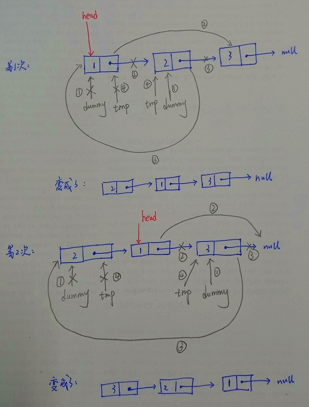

# 链表
- 链表中最简单的一种是单向链表，它包含两个域，一个信息域和一个指针域，这个链接指向列表中的下一个节点，而最后一个节点则指向一个空值。
- 链表不能用下标进行操作，数组可以直接查找arr[10],但是链表不行

```
// 定义链表的节点
class ListNode{
    constructor(val){
        this.val = val;
        this.next = null;
    }
}

// 添加节点，node1->node2->node3->node4->null
let node1 = new ListNode(11);
let node2 = new ListNode(12);
let node3 = new ListNode(13);
let node4 = new ListNode(); // 未赋值则为undefined
node1.next = node2;
node2.next = node3;
node3.next = node4;

// 常规调用
let tmp = node1;
while(tmp!=null) {
    console.log(tmp.val);
    tmp = tmp.next;
}

// 递归调用
function RecursiveTraverse(head){
    if(head!=null){
        console.log(head.val);
        RecursiveTraverse(head.next);
    }
}
RecursiveTraverse(node1);
```

#### 1 经典题目：翻转一条单向链表
```
input:1->2->3->4->5->null
output:5->4->3->2->1->null
```

- 下面的方法：
- head指针一直不变，指向原链表的头部
- 添加两个临时变量dummy和tmp存储变化后的链表:空间复杂度为O(n)

```
function reverseLinkedList(head){
    let dummy = head;   // O(1)
    let tmp = dummy;   // O(1)
    while(head != null && head.next != null){
        dummy = head.next;   // O(1)
        head.next = dummy.next;   // O(1)
        dummy.next = tmp;  // O(1)
        tmp = dummy;   // O(1)
    }
    // 返回翻转后的列表的表头
    return dummy;
}
// 遍历该列表
var reversed_head = reverseLinkedList(node1);
let tmp = reversed_head;
while(tmp != null){
    console.log(tmp.val);
    tmp = tmp.next;
}

得到： undefined->13->12->11->null
```

- 图片演示：
- 上面的程序的时间复杂度为O(n),空间复杂度为O(n)
