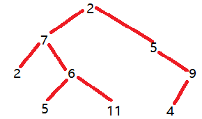
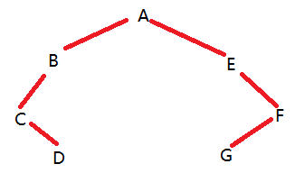
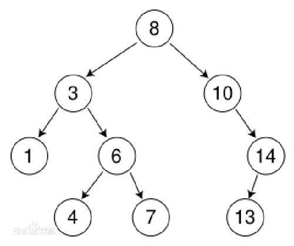

# 二叉树 
- 有一个根节点，每个节点都最多只能有两个子节点
- 例如在DOM中：下面就可以看作是一个二叉树
```
            root
    left-div    right-div
span           span
<div class='root'>
    <div class='left-div'>
        <span></span>
    </div>
    <div class='right-div'>
        <span></span>
    </div>
</div>
```

#### 1 创建二叉树
```
class treeNode{
    constructor(val){
        this.val = val;
        this.left = null;
        this.right = null;
    }
}

// 二叉树
/*

                2
    7                   5
2       6                   9
    5       11          4
 */
let root = new treeNode(2);

// 左子树
root.left = new treeNode(7);
root.left.left = new treeNode(2);
root.left.right = new treeNode(6);
root.left.right.left = new treeNode(5);
root.left.right.right = new treeNode(11);

// 右子树
root.right = new treeNode(5);
root.right.right = new treeNode(9);
root.right.right.left = new treeNode(4);
```

- 二叉树效果展示


#### 2 前序遍历二叉树(根节点->左子树->右子树)
- 先遍历根节点
- 再前序遍历左子树
- 最后前序遍历右子树
```
// 前序遍历
function preOrder(root){
    if(root != null){
        // 根节点
        console.log(root.val);
        // 左子树
        preOrder(root.left);
        // 右子树
        preOrder(root.right);
    }
}

// 前序遍历结果：2 7 2 6 5 11 4 9 4
preOrder(root);
```

#### 3 中序遍历：中间遍历根节点
- (左子树->根节点->右子树)
```
// 中序遍历
function inOrder(root){
    if(root!=null){
        inOrder(root.left);
        console.log(root);
        inOrder(root.right);
    }
}
inOrder(root);
结果：2 7 5 6 11 2 5 4 9
```

#### 4 后序遍历：最后遍历根节点
- (左子树->右子树->根节点)
```
function postOrder(root){
    if(root != null){
        postOrder(root.left);
        postOrder(root.right);
        console.log(root);
    }
}
postOrder(root);
2 5 11 6 7 4 9 5 2```
```

#### 5 已知一个二叉树的前序遍历为ABCDEFG，中序遍历为CDBAEGF，能否唯一地确定一个二叉树？如果可以请画出这个二叉树
- 可以
- 首先根据前序遍历：可以知道A是根节点，然后在中序遍历中就可以判断：CDB是左子树，EGF是右子树；得到
```
    A
CDB    EGF
```

- 然后依次根据前序遍历:A->B得到B是左子树的根节点，中序遍历中可以知道CD是B左节点
```
        A
    B       EGF
CD
```

- 前序遍历A->B->C:则B的左子节点就是C，中序遍历：D是C的右子节点
```
        A
    B        EGF
C
    D
```

- 右子树按照同理解决即可
- 二叉树：


```
let preorder = 'ABCDEFG';
let inorder = 'CDBAEGF';
function buildTree(preorder,inorder){
    // 如果前序遍历长度为0，则表示该二叉树为空
    if(preorder.length==0){
        return null;
    }
    // 如果前序遍历长度为1，则表示该二叉树只有根节点
    if(preorder.length==1){
        let root = new treeNode(preorder[0]);
        return root;
    }
    // 前序遍历的第一个元素就是整个二叉树的根节点
    let root = new treeNode(preorder[0]);
    // 获取根节点在中序遍历中的位置，然后就可以将左右子树的元素得到
    let index = inorder.indexOf(root.val);
    // 使用迭代的方法依次建立左右子树
    // slice(start,end);提取[start,end-1]的元素
    root.left = buildTree(preorder.slice(1,index+1),inorder.slice(0,index));
    root.right = buildTree(preorder.slice(index+1,preorder.length),inorder.slice(index+1,inorder.length));
    return root;
}
var root1 = buildTree(preorder,inorder);
postOrder(root1);
// DCBGFEA
```

# 二、 二叉查找树/二叉搜索树
- 左子树的所有节点值小于根节点
- 右子树的所有节点的值大于根节点
- 左子树和右子树都是二叉查找树
- 举例：


- 二叉查找树的中序遍历就是增序排列
- 如果是平衡二叉查找树，查找一个元素的时间复杂度为O(logn)
```
let root1 = new treeNode(8);

// 左子树
root1.left = new treeNode(3);
root1.left.left = new treeNode(1);
root1.left.right = new treeNode(6);
root1.left.right.left = new treeNode(4);
root1.left.right.right = new treeNode(7);

// 右子树
root1.right = new treeNode(10);
root1.right.right = new treeNode(14);
root1.right.right.left = new treeNode(13);

var flag = false;
/*
    传入一个全局flag标记：因为一个二叉搜索树，需要嵌套执行很多次，最终只会返回第一次执行binarySearchTree的return,
    所以如果最内层的嵌套返回的是true,而最终只能返回false
*/
function binarySearchTree(root,target){
    if(root != null){
        if(root.val == target){
            console.log(11111);
            flag = true;
            return flag;
        }else if(root.val > target){
            console.log(22222)
            binarySearchTree(root.left,target);
        }else{
            console.log(33333);
            binarySearchTree(root.right,target);
        }
    }
    console.log(4444);
    return flag; 
}
console.log(binarySearchTree(root1,13));

输出：
33333:(第一次调用该函数)8<13
33333:(第二次调用该函数)10<13
22222:(第三次调用该函数)14>13
11111:(第四次调用该函数)13=13   flag=true  return flag 
4444:第三次rreturn flag
4444:第二次return flag
4444:第一次return flag
true:所以最后return true

// 不加flag:
33333:(第一次调用该函数)8<13
33333:(第二次调用该函数)10<13
22222:(第三次调用该函数)14>13
11111:(第四次调用该函数)13=13  return true 
4444:第三次rreturn false
4444:第二次return false
4444:第一次return false
false:所以最后return false
```

- **不平衡二叉搜索树**
    - 左子树和右子树的高度相差>1
    - 对于下面的不平衡二叉搜索树，查找的时间复杂度为O(n)
```
                    6
                5
            4
        3
    2
1
```

- **平衡二叉搜索树**
    - 左子树和右子树的高度相差<=1
    - 左子树和右子树都是平衡二叉树
    - 对于下面的平衡二叉查找树而言，查找一个元素的时间复杂度就会变为O(logn);
```
        6
    5       7
4               8
```

- 平衡二叉树的代表
    - 红黑树
    - AVL树

- 所以**一般为了降低时间复杂度，对于一个不平衡的二叉查找树，我们可以先将其转换为一个平衡的二叉查找树**