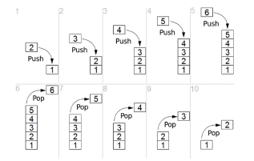

# 栈Stack
- 举例：

- 先进后出
- 基本操作：
    - size:栈中元素的个数
    - is_empty:是否为空
    - pop:弹栈
    - push:压栈
    - peak:返回栈顶元素，但是不弹出
```
class Stack{
    constructor(){
        // 使用数组的形式
        this.stack = [];
    }

    // 栈是否为空
    is_empty(){
        if(this.stack.length == 0){
            return true;
        }else{
            return false;
        }
    }

    // 栈的大小
    size(){
        return this.stack.length;
    }

    // 弹栈
    pop(){
        if(this.is_empty()){
            return null;
        }else{
            return this.stack.pop();
        }
    }

    // 压栈
    push(val){
        return this.stack.push(val);
    }

    // 返回栈顶元素
    peak(){
        if(this.is_empty()){
            return null;
        }else{
            return this.stack[this.stack.length-1]
        }
    }
}

var stack1 = new Stack();
stack1.push(1);
stack1.push(2);
stack1.push(3);
stack1.push(4);
console.log(stack1.size()); // 4
stack1.pop();
console.log(stack1);  // [1,2,3]
console.log(stack1.peak());  // 3
console.log(stack1);  // [1,2,3]
```

# 二、队列
- 先进先出法
- 使用数组实现，只要让其先进先出原则满足即可，使用链表也可以实现
```
class Queue{
    constructor(){
        this.queue = [];
    }
    size(){
        return this.queue.length;
    }
    is_empty(){
        if(this.queue.length == 0){
            return true;
        }else{
            return false;
        }
    }
    enQueue(val){
        // unshift向数组的开头添加一个新的元素
        this.queue.unshift(val);
    }
    deQueue(){
        if(this.is_empty()){
            return null;
        }else{
            return this.queue.pop();
        }
    }
}

var queue = new Queue();
console.log(queue);  // []
queue.enQueue(1);
queue.enQueue(2);
queue.enQueue(3);
queue.enQueue(4);
console.log(queue);  // [4,3,2,1]
queue.dequeue();
console.log(queue);  //[4,3,2]
```

#### 1 使用两个栈模拟队列的先进先出
- 首先将数据1，数据2，数据3压入栈1
- 为了保证先进先出，先将数据3，数据2分别弹栈压入栈2
- 然后使得数据1出栈，再将数据2，数据3从栈2中弹栈，压入栈1

```
    constructor(){
        this.stack1 = new Stack();
        this.stack2 = new Stack();
    }
    // 入队列
    enQueue(val){
        // 在末尾加入元素
        this.stack1.push(val);
    }
    // 出队列
    deQueue(){
        // 只弹出栈1中第一个元素后面的元素
        // 需要先定义一个变量保存原栈1的长度，在for循环中不能直接写i<this.stack1.size(),因为栈1的长度是随着循环次数减小的
        var len1 = this.stack1.size();
        for(let i=0; i<len1-1; i++){
            // i只定义次数,pop()指的是弹出末尾的元素
            let value = this.stack1.pop();
            this.stack2.push(value);
        }
        let res = this.stack1.pop();
        // 同理也需要提前用一个变量保存栈2的长度
        var len2 = this.stack2.size();
        for(let i=0; i<len2; i++){
            let value = this.stack2.pop();
            this.stack1.push(value);
        }
        return res;
    }
}

let qbts = new QueueByTwostack();
console.log(qbts.stack1);
qbts.enQueue(1);
qbts.enQueue(2);
qbts.enQueue(3);
qbts.enQueue(4);
console.log(qbts.stack1);//[1,2,3,4]
console.log(qbts.stack1.size());
qbts.deQueue();
console.log(qbts.stack1);//[2,3,4]
qbts.deQueue();
console.log(qbts.stack1);//[3,4]
```

#### 2 使用一个队列模拟栈的先进后出
```
class StackByQueue{
    constructor(){
        this.queue = new Queue();
    }
    push(val){
        // inQueue中用的是unshift(),在头部添加
        this.queue.enQueue(val);
    }
    pop(){
        /* 
        由于队列在进入时使用的是unshift,在队列前面插入元素
        所以最后进入的元素处于Index=0的位置
        先试用pop()将先进入队列的元素移出去，然后再
        使用unshift依次插入头部，这样最后一个插入的元素
        就在队列中处于最后的位置，然后使用pop()排出即可   
        */
        for (let i=0; i<this.queue.size()-1; i++){
            var value = this.queue.deQueue();
            this.queue.enQueue(value);
        }
        return this.queue.deQueue();
    }
}

var sbq = new StackByQueue();
sbq.push(1);
sbq.push(2);
sbq.push(3);
sbq.push(4);
console.log(sbq.queue);  // [4,3,2,1]
sbq.pop();
console.log(sbq.queue);  // [3,2,1]
sbq.pop();
console.log(sbq.queue);  // [2,1]
```