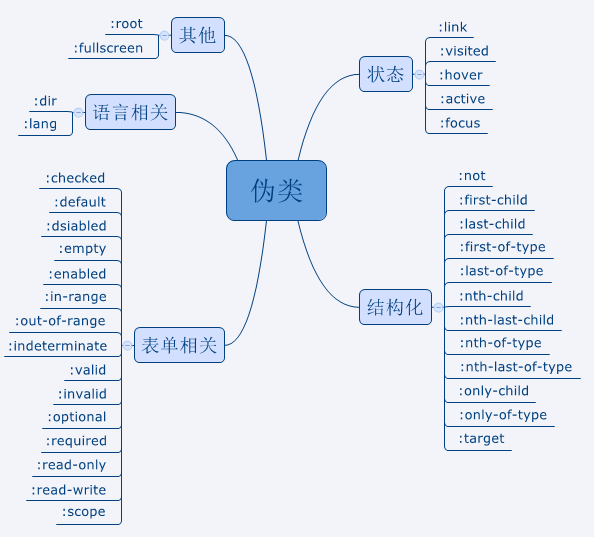

问题1：

    同源策略：同协议、同域名，同端口
    http://store.company.com/dir/page.html
    协议：http
    域名：store.company.com
    端口：http默认端口80

问题2：DOMContentLoaded和load

    load:整个html网页，包含css,js,图片等等加载完成之后才会执行
    DOMContentLoaded：dom内容加载完毕。
        什么是dom内容加载完毕呢？
        当输入一个URL，页面的展示首先是空白的，然后过一会，页面会展示出内容，但是页面的有些资源比如说图片资源还无法看到，此时页面是可以正常的交互，过一段时间后，图片才完成显示在页面。从页面空白到展示出页面内容，会触发DOMContentLoaded事件。而这段时间就是HTML文档被加载和解析完成。

    也就是说load事件是在DOMContentLoaded事件之后发生的

问题3：如何在一个div块中显示<div></div>这个字符

    <div><div></div></div>   // 会直接将其作为html标签解析
    <div>"<div></div>"</div>   // " "
    document.querySelector('div').innerText = "<div></div>"
    document.querySelector('div').innerHTML = "<div>sssssss</div>"  //会作为html标签解析


     innerHTML：设置或获取标签所包含的HTML与文本信息。（不含标签本身，但是包含该标签内部的标签）
    innerText：设置或获取标签所包含的文本信息。（不含标签本身，只包含标签内部的文字信息）

    举例：
    <div id="div1">
        <p id="p1">this is text</p>
    </div>
    <script>
        var div=document.getElementsByTagName("div");
        console.log(div[0].innerHTML);      //  <p id="p1">this is text</p>
        console.log(div[0].innerText);         //  this is text
        console.log(div[0].outerHTML);     // <div id="div1"><p id="p1">this is text</p></div>
        console.log(div[0].outerText);        //  this is text
    </script>

问题4：所有块级元素

    CSS将标签分为块级元素和行内元素：
        块级元素：div,p,h,dt,dd,li
        行内元素：a,b,span,em,u,i

    HTML将标签分为容器级元素和文本级
        容器级：div,h,dt,dd,li
        文本级：a,b,span,em,u,i,p

问题6：box-sizing

    content-box
        在宽度和高度之外绘制元素的内边距和边框。
    border-box
        从已设定的宽度和高度分别减去边框和内边距才能得到内容的宽度和高度。
    inherit
        规定应从父元素继承 box-sizing 属性的值。

问题7：伪元素和伪类

    伪元素：创造一些不在DOM树中的元素，并为其创建一些样式
        例如：(::before,::after,::first-letter,::first-line)
    伪类：当元素处于某种状态(状态随着用户的行为而动态变化)时，为其添加样式，如(:hover)



问题8：

    >>这个是带符号右移
    >>>这个是无符号右移

    -1 >>> 32:
     1的二进制 00000000 00000000 00000000 00000001
    -1的二进制 10000000 00000000 00000000 00000001 
    取反加1得到补码 11111111 11111111 11111111 11111111  //首位不变，其余为取反

    右移32位（高位补符号位1） 也就是11111111 11111111 11111111 11111111  //32位

    假设该数值加上一也就是变成
    1 00000000 00000000 00000000 00000000  //1后面有32个0

    那就把刚才加上的1减掉

    也就是结果
    2^32-1

问题9：[1 < 2 < 3, 3 < 2 < 1]

     1<2 => true
    true < 3 => true // true自动转换为1

    3<2 => false
    false < 1 =>  true //false 自动转换为0

    answer: [true, true]

问题10：['1', '2', '3'].map(parseInt) ( )

    map((item, index, thisArr) => ( newArr ))
    【参数解析】
    　item: callback 的第一个参数，数组中正在处理的当前元素。
    　index: callback 的第二个参数，数组中正在处理的当前元素的索引。
    　thisArr: callback 的第三个参数，map 方法被调用的数组。
    【返回】
    一个新数组，每个元素都是执行回调函数的结果。

    parseInt(string, radix)
    【参数解析】
    　string: 必需。要被解析的字符串。
    　radix: 可选。表示要解析的字符串的基数。该值介于 2 ~ 36 之间。如果省略该参数或其值为 0，则数字将以 10 为基础来解析。如果它以 “0x” 或 “0X” 开头，将以 16 为基数。如果该参数小于 2 或者大于 36，则 parseInt() 将返回 NaN。
    【返回】
    　解析后的数字

    通过上述对 map 和 parseInt 函数的分析可以知道，执行方法时，map给parseInt传递了三个参数:
    parseInt(item, index, thisArr)

    其中第三个参数会被 parseInt 忽略，因此会依次执行：
    parseInt('1', 0)
    // radix 为 0，默认以十进制解析字符串，返回 1
    parseInt('2', 1)
    // radix 为 1，不在 2 ~ 36 之间，返回 NaN
    parseInt('3', 2)
    // radix 为 2， 字符串却为 3，超出二进制的表示范围，因此要解析的字符串和基数矛盾，返回 NaN
    综上，最后返回的数组为 [1, NaN, NaN]

问题12：
console.log(1);
setTimeout(() => {console.log(2)}, 0);
console.log(3);
Promise.resolve(4).then(b => {
console.log(b);
});
console.log(5);
它的输出为？？？？

    console.log() -> 同步
    promise -> 异步，微任务
    setTimeout ->  异步，宏任务
    存在一个任务序列，先执行同步任务，然后执行微任务，微任务全部执行结束后才会执行宏任务
    执行顺序: 同步 > 异步,微任务 > 异步，宏任务

    JavaScript中异步任务又可以分为两种：
        宏任务：I/O、setTimeout、setInterval、整体代码 
        微任务：process.nextTick、MutationObserver、Promise.then .catch .finally
    宏任务存放在任务队列中，微任务相当于宏任务中的子任务,一个宏任务中的微任务未完成是不会执行下一个宏任务的，所以微任务的执行会先于宏任务。

问题16：
function setname(name){
 this.name = name
}
setname.prototype.printName = function(){ console.log(this.name) }
let a = new setname("cc")
a.name = "dd"
a.__proto__.name = "ee"

a.__proto__.printName()  // ?
a.printName() // ?

    记住：谁调用方法，this就是谁
    a.__proto__.printName();  调用printName方法的是a.__proto__,所以this就是a.__proto__，可以发现this.name = a.__proto__.name = "ee";
    a.printName(); this就是a,this.name = a.name = "dd";

问题17：（不懂）
const players = [ {name: 'UZI', team: 'RNG', position: 'ADC'}, 
{name: 'theshy', team: 'IG', position: 'TOP'}, 
{name: 'Metoer', team: 'BLG', position: 'Jungle'},
{name: 'ADD', team: 'BLG', position: 'TOP'},
{name: 'Scout', team: 'EDG', position: 'Middle'},
{name: 'iBoy', team: 'EDG', position: 'ADC'},
{name: 'Baolan', team: 'IG', position: 'Support'}, 
{name: 'Xiaohu', team: 'RNG', position: 'Middle'}] 
获取列表中战队名是BLG 位置上路的 选手对象？

    players.filter(x=&gt; x.position === 'TOP' &amp;&amp; x.team === 'BLG')
    // 注意：同样需要的条件使用&amp;&amp;符号连接起来

    filter() 方法创建一个新的数组，新数组中的元素是通过检查指定数组中符合条件的所有元素。
    语法
        array.filter(function(currentValue,index,arr), thisValue)
            function(currentValue, index,arr)必须。函数，数组中的每个元素都会执行这个函数
            thisValue 可选，执行 function(currentValue,index,arr) 时的用于 this 的值。
                currentValue 必须。当前元素的值
                index 可选。当前元素的索引值
                arr 可选。当前元素属于的数组对象

    举例：
    function isBig(item) {
      return item>= 10;
    }
    var filtered = [10, 5, 8, 14, 25].filter(isBig);
    console.log(filtered);//[ 10, 14, 25 ]

问题18：

示例
输入
5
1 3 4 6 8
10

输出
4 6

```
function getSum(len,arr,sum){
    var flag = 0;
    for(var i=0; i<len; i++){
        for(var j=i+1; j<len; j++){
            if(arr[i]+arr[j]==sum){
                flag = 1;
                return arr[i]+''+arr[j];
            }
        }
    }
    if(flag == 0){
       return 'notfound'
    }
}
```

问题19：
 判断由"()[]{}"6种括号组成的字符串是否合法
1. 所有括号必须闭合
2. 左括号必须在正确的位置闭合

输入描述:由6种符号组成的字符串
输出描述:合法则输出"true"，不合法输出"false"
示例：
(]_-------->_false
{[][()()]} --------> true
{([)]}  --------> false
```
思想：使用栈，将左括号入栈，判断出现一个右括号，则将该左括号出栈
function isLegal(str){
    var obj = {
        "(":")",
        "[":"]",
        "{":"}"
    }
    var stack = [];
    for(var i=0;i<str.length;i++){
        if(str[i] == "{" || str[i] == "[" || str[i] == "("){
            stack.push(str[i]);
        }else {
            if(str[i] != obj[stack[stack.length-1]]){
                console.log(1);
                return false;
            }else{
                stack.pop();
            }
        }
    }
    console.log(stack);
    if(stack.length == 0){
        return true;
    }else{
        return false;
    }
}

// 注意：数组和string求字符串长度均是length属性
```


问题20：
有n级台阶，每一步可以走1级或2级，问一共有多少种走法

输入描述:台阶的级数n
输出描述:走法数量

示例1
2 ---------> 2     走法为1+1或2
3 ---------> 3     走法为1+1+1或1+2或2+1

```

```


