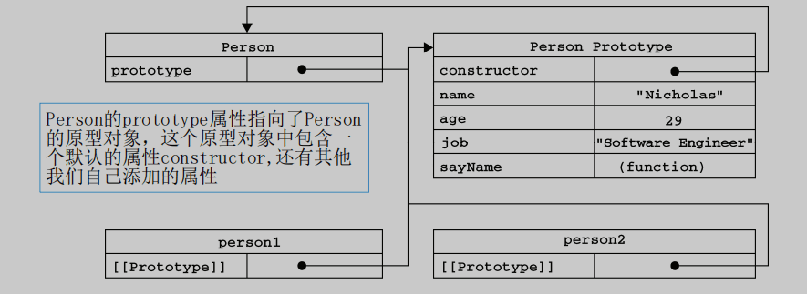
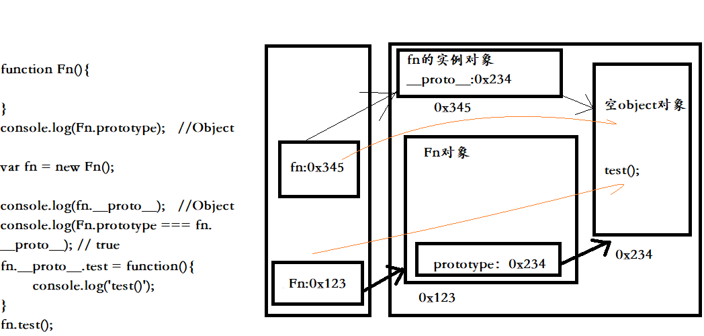

# 原型prototype属性
```
    每个函数均有一个prototype属性，它默认指向一个prototype空对象(即：原型对象),空指的是不具备我们自己定义的方法的对象
        function Fun(){
            prototype:{
                constructor:Fun;
                ... // 其余我们自己添加的属性，方法
            };    //指向一个对象，这个对象就是原型对象
        }
    原型对象中有一个属性：constructor,它指向函数对象
        console.log(Date.prototype.constructor === Date) // true
        console.log(Fun.prototype.constructor === Fun) // true

给原型对象添加属性(一般是方法)：
    函数的所有实例对象都会自动拥有原型中的属性
```

结构参见：

```
function Fun(){

}
// 给原型对象添加方法属性,这个方法添加后，所有的实例对象均可以使用
Fun.prototype.test = function(){
    console.log('test()');
}

// 创建一个实例对象验证
var fun = new Fun();
fun.test();   //'test()'
```

每个实例对象都有一个__proto__，可称为隐式原型属性
    对象的隐式原型的值为其对应构造函数的显式原型的值
        prototype和__proto__保存着同一个地址值，都指向着原型对象

```
function Fn(){

}
console.log(Fn.prototype);   //Object

var fn = new Fn();
//每个实例对象都有一个__proto__
console.log(fn.__proto__);   //Object

// 对象的隐式原型的值为其对应构造函数的显式原型的值
console.log(Fn.prototype === fn.__proto__); // true

fn.__proto__.test = function(){

}
console.log(Fn.prototype === fn.__proto__); // true
```

结构参见：