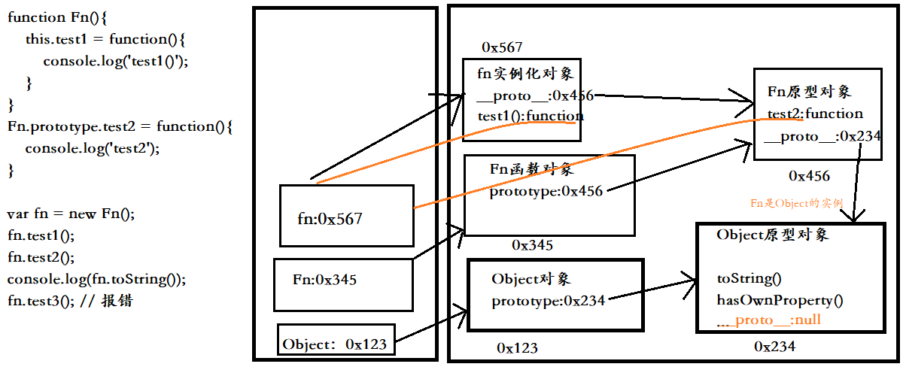
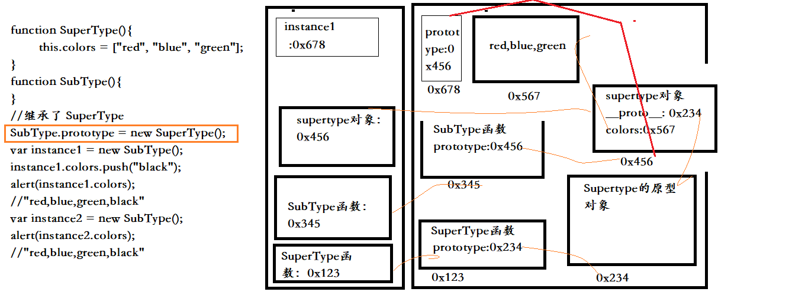

# 原型链

Fn函数对象是Object函数的实例，而fn又是Fn函数对象的实例，从而由于对象的实例化链条,存在下面的：

    当访问一个对象的属性时：
        先在自身寻找
        没有则在该对象的__proto__属性中查找，找到则返回
        没有找到，则沿着__proto__这条链一直向上查找
        如果最终没找到，则返回undefined(因为Object的__proto__属性为null)

```
<!-- 在全局作用域中创建的函数都是Object对象的实例 -->
function Fn(){
    this.test1 = function(){
        console.log('test1()');
    }
}
Fn.prototype.test2 = function(){
    console.log('test2');
}

var fn = new Fn();
fn.test1();
fn.test2();
console.log(fn.toString());
console.log(fn.test3); // undefined
fn.test3(); // 报错
```


结构图参见：

另外，还可以将一个函数的实例作为另一个函数对象的原型对象：
结构图参见：


# 作用
查找对象的属性(方法)

# 注意：

函数的显式原型指向的对象默认是空Object实例对象，但Object不满足
```
Fn.prototype instanceof Object  // true
Object.prototype instanceof Object   //false
```

所有函数均是大写Function的实例，包括它本身
```
Function.__proto__ === Function.prototype  // true
```

Object原型对象是原型链的尽头，它的隐式原型为null