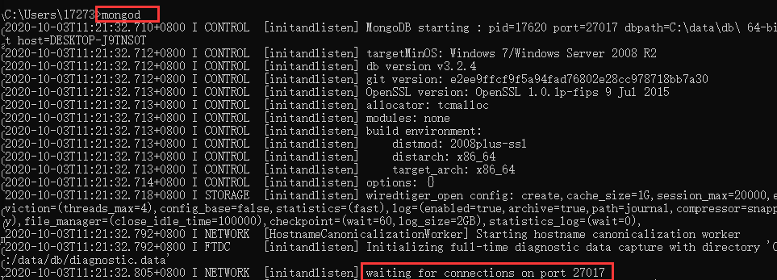
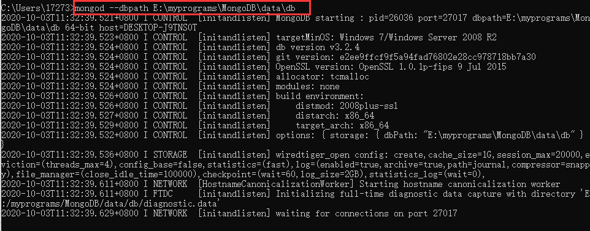
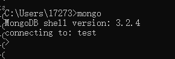
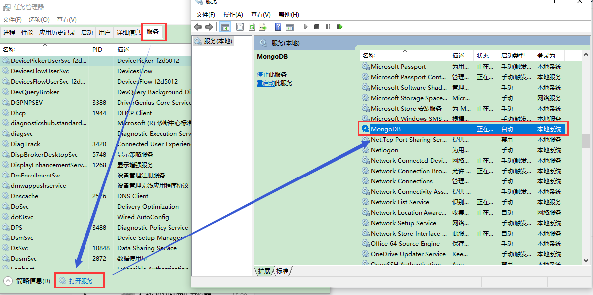
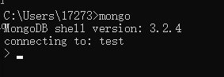
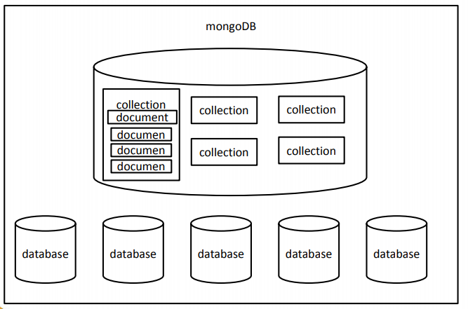
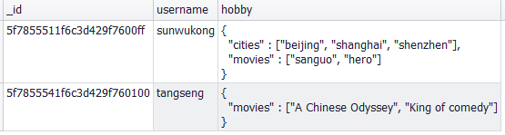
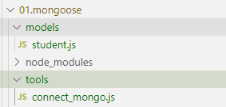

# 1.安装MongoDB

### 1 安装好mongodb,配置环境变量
### 2 启动mongodb服务器

- 找到mongodb的安装位置，找到bin文件夹:`E:\myprograms\MongoDB\Server\3.2\bin`,具体是啥取决于安装位置
- 数据库的默认保存位置在：`C:\data\db`，所以我们在c盘根目录
    - 创建一个文件夹 data
    - 在data中创建一个文件夹db    
- 打开cmd命令行窗口,输入`mongod` 启动mongodb服务器

- 如果需要修改数据库的默认保存位置和端口号，则可以使用：`mongod --dbpath 数据库路径 --port 端口号`,注意：端口号最大不可以超过65535

- 服务器打开之后，这个命令行窗口不能关掉（也不能选中页面中的内容），否则后面要连接客户端就连接不上了

### 3 启动客户端，连接mongodb服务器

- 再打开一个cmd窗口，输入 `mongo` 连接mongodb 


# 2 数据库（database）

- 数据库包含两方面的内容：
  
```
- 数据库的服务器
  - 服务器用来保存数据
  - mongod 用来启动服务器
	
- 数据库的客户端
  - 客户端用来操作服务器，对数据进行增删改查的操作
  - mongo 用来启动客户端
```
	
# 3 将MongoDB设置为系统服务，可以自动在后台启动，不需要每次都手动启动
- 1.在c盘根目录创建data
  - 在data下创建db和log文件夹
  - 在log文件夹下创建mongod.log文件
- 2.创建配置文件
	- 在目录 E:\myprograms\MongoDB\Server\3.2 下添加一个配置文件mongod.cfg，文件的配置如下：(下面的内容除了路径外，其余均不要修改，尤其是格式)
  
```
systemLog:
  destination: file
  path: E:\myprograms\MongoDB\data\log\mongod.log
storage:
  dbPath: E:\myprograms\MongoDB\data\db
```
  
- 3.以管理员的身份打开命令行窗口，执行如下的命令

```
sc.exe create MongoDB binPath= "\"E:\myprograms\MongoDB\Server\3.2\bin\mongod.exe\" --service --config=\"E:\myprograms\MongoDB\Server\3.2\mongod.cfg\"" DisplayName= "MongoDB" start= "auto"
```
	
- 4.启动mongodb服务：打开`任务管理器-->服务`，找到`mongodb`,然后右键启动即可


- 5.如果启动失败，证明上边的操作有误
	- 在控制台输入 sc delete MongoDB 删除之前配置的服务
	- 然后从第一步再来一次
- 6.没有报错，则直接打开一个命令行输入：`mongo`打开客户端并且连接服务器端，出现下面的内容则说明成功
  

- 7. 成功之后，之后连接数据库服务器时则直接运行mongo命令即可

# 4 mongodb的基本操作

### 4.1 基本概念

- 数据库（database）：是一个仓库，在仓库中可以存放集合
  - 集合（collection）：集合类似于数组，在集合中可以存放文档
  - 文档（document）：文档是文档数据库中的最小单位，我们存储和操作的内容都是文档，mongodb就是一个文档数据库
  - 一个数据库中可以有多个集合，一个集合中可以有多个文档



- 在MongoDB中，数据库和集合都不需要手动创建，
	- 当我们创建文档时，如果文档所在的集合或数据库不存在会自动创建数据库和集合

### 4.2 基本指令

- 在命令行执行`mongo`操作后，就实现了客户端和数据库服务器端的连接，进入了mongo shell操作模式，然后就可以使用指令操作数据库了
- 显示当前的所有数据库： `show dbs`或者`show databases`
- 进入到指定的数据库中：`use 数据库名`
- 查看当前所处的数据库：`db`
- 显示数据库中所有的集合:`show collections`

### 4.3 数据库的CRUD（create read update delete增删改查）的操作

##### 1 插入操作

```
- db.collection_name.insert([doc1,doc2,...]):向数据库中插入一个或者多个文档:
- db.collection_name.insertOne(dox):插入一个文档
- db.collection_name.insertMany([dox1,...])：插入多个文档，即使只有一个文档，也要是用数组的形式
- 后面两个方法只支持mongodb3.2+
```
  
- db.collection_name.insert([doc1,doc2,...])
  - 向集合中插入一个文档或多个文档
  - 例子：向test数据库中的，stus集合中插入一个新的学生对象{name:"孙悟空",age:18,gender:"男"}：`db.stus.insert({name:"孙悟空",age:18,gender:"男"})`
  - 例子：向集合中插入多个文档(对象)
  
    ```
    db.stus.insert([
        {name:'沙和尚', age:19, gender:'男'},
        {name:'白骨精', age:16, gender:'女'},
        {name:'蜘蛛精', age:14, gender:'女'}
    ]);
    ```

- 当我们向mongodb数据库中插入文档时，如果没有给文档指定`_id`属性，则mongodb数据库会自动为文档添加_id属性，该属性将作为文档的唯一标识符，这个值不会发生重复，它是根据时间戳和机器码产生的，如果想要自己指定，则可以使用：

```
db.stus.insert({_id:'我爱念经',name:"唐僧",age:20,gender:"男"})
```
- 所以我们可以自己指定_id,但是也需要保证它的唯一性，一般自己不要指定

	
##### 2 查询操作
-  查询当前集合中的所有的文档: `db.collection_name.find({条件})`
   -  find用来查询集合中所有符合条件的文档（返回一个数组），find中接收一个对象作为条件参数：{属性名:值},查询属性是指定值得文档
   -  不写或者{}表示查找所有文档

```
// 查询_id为我爱念经的文档
db.collection_name.find({_id:'我爱念经'});
// 查询_id为我爱念经并且age为20的文档
db.collection_name.find({_id:'我爱念经', age:20});
```

- `db.collection_name.findOne({属性名:值})`:找到集合中符合条件的第一个文档

```
// 因为它只返回一个对象，所以后面可以.属性名
db.collection_name.findOne({age:20}).name;
```

- 获取符合条件的文档的个数：`db.collection_name.find({条件}).count()`
				
##### 3 修改文档

- `db.collection_name.update({查询条件}, newDox)`:按照查询条件找到所需修改的文档，并将其内容更换为newDox
  - 默认只修改符合条件的第一个文档，如果要让其修改所有符合条件的文档，则还需要加入第三个参数对象
  - 如果只需要修改指定的属性(不替换所有)，则需要使用修改操作符
    - $set 可以用来修改文档中的指定属性
    - $unset 删除文档中的指定属性

```
// 把沙和尚的那个文档修改为新文档{age:28},即没有姓名和性别属性了
db.collection_name.update({name:"沙和尚"}, {age:28})

// 将沙和尚的年龄修改为28，没有则为其添加年龄属性
db.collection_name.update(
    {name:"沙和尚"}, 
    {
        $set:{
            age:28
        }
    }
)
```

- `db.collection_name.updateMany({查询条件}, newDox)` 同时修改多个符合条件的文档
- `db.collection_name.updateOne({查询条件}, newDox)` 修改符合条件的第一个文档
- `db.collection_name.replaceOne({查询条件}, newDox)` ：替换符合条件的第一个文档
- 上面这三个方面都只适用于mongodb3.2+
- 为update添加第三个条件参数实现多个文档的同时修改

```
db.collection_name.update(
    {name:"沙和尚"}, 
    {
        $set:{
            age:28
        }
    },
    {
        multi: true;  // 表示修改多个
    }
)
```

##### 4 删除文档

- `db.collection_name.remove({条件},{justOne: false})`:删除符合条件的所有文档：;
    - 默认情况下justOne是false,即删除所有,如果只想删除一个则令justOne为true
    - 或者：`db.collection_name.remove({条件}, true)`
- `db.collection_name.remove({})`:删除所有文档，传入空对象会匹配所有文档
  - 这个指令的性能比较差，一般不要用
  - 如果需要清空集合，使用`db.collection_name.drop()`,直接删除集合
  - 删除数据库：`db.dropDatabase()`
- `db.collection_name.deleteOne({条件});` 删除第一个
- `db.collection_name.deleteMany({条件});`  删除所有
- 一般数据库中的数据都不会删除，所以删除的方法很少调用
  - 一般会在数据中添加一个字段来表示数据是否被删除

```
db.collection_name.insert([
    {name:'孙悟空',isDel:0},
    {name:'沙和尚',isDel:0},
    {name:'猪八戒',isDel:0},
    {name:'唐僧',isDel:0}
])

删除时：只修改isDel属性，表示它已经被删除了，但是在数据库中还存在
db.collection_name.updateOne(
    {name:'唐僧'},
    {
        $set:{
            isDel: 1;
        }
    }
)

查询时直插isDel为0的文档：
db.collection_name.find({isDel:0});
```

- 这样如果用户不小心删除了一些不该删除的前台数据，还是可以在数据库中恢复的

# 5 练习

- mongodb的文档的属性值也可以是一个文档
  - 当一个文档的属性值是文档时，将其称之为内嵌文档
  - 下面的图片中第一行是一个文档，该文档的hobby属性的值又是一个文档，所以后面的文档就可以成为内嵌文档，访问内嵌文档的属性需要加引号
```
hobby:{
    cities:["beijing","shanghai","shenzhen"] , movies:["sanguo","hero"]
}
```


- 查询喜欢电影hero的文档
  - mongoDB支持直接通过内嵌文档的属性查询
  - 如果需要使用内嵌文档查询，则属性名必须加引号
  
```
db.users.find({"hobby.movies":'hero'})
```
- 向tangseng中添加一个新的电影Interstellar
  - 使用push操作符，不管里面有没有，都会添加
  - 还可以使用addToSet操作符，只有里面没有时才会添加

```
db.users.update(
    {username:"tangseng"},
    {
        $push: {
            'hobby.movies':'Interstellar'
        }
    }
)
```

- 删除喜欢beijing的用户

```
db.users.remove({'hobby.cities':'beijing'})
```
- 删除user集合

```
db.users.drop()
```		

- 向numbers中插入20000条数据

```
// 执行了8.2s,效率太低了
for(var i=1; i<=20000; i++){
    // 数据库的插入操作执行了20000次
    db.numbers.insert({num:i});
}

// 改进：0.1s 尽量减少数据库方法的调用次数，提高速度
var arr = [];
for(var i=20000; i<=20000; i++){
    arr.push(i);
}
db.numbers.insert(arr);   
```		


```
//1.进入my_test数据库
use my_test
show dbs  // local test
//2.向数据库的users集合中插入一个文档  
db.users.insert({
    username:'sunwukong'
})
show dbs   // local test my_test
//3.查询user集合中的文档
db.users.find();   // sunwukong
//4.向数据库的user集合中插入一个文档   
db.users.insert({
    username:'zhubajie'
})   
//5.查询数据库user集合中的文档
db.users.find();  // sunkukong zhubajie
//6.统计数据库user集合中的文档数量
db.users.find().count()  // 2
//7.查询数据库user集合中username为sunwukong的文档
db.users.find({username:"sunwukong"})
//8.向数据库user集合中的username为sunwukong的文档，添加一个address属性，属性值为huaguoshan
db.users.update(
    {username:"sunwukong"},
    {
        $set: {
            address:'huoguoshan'
        }
    }
)
//9.使用{username:"tangseng"} 替换 username 为 zhubajie的文档
db.users.replaceOne({username:"zhubajie"},{username:'tangseng'})
//10.删除username为sunwukong的文档的address属性
db.users.update(
    {username:"sunwukong"},
    {
    $unset: {
            address:'huoguoshan'
        }
    }
)
//11.向username为sunwukong的文档中，添加一个hobby:{cities:["beijing","shanghai","shenzhen"] , movies:["sanguo","hero"]}
db.users.update(
    {username:"sunwukong"},
    {
    $set: {
            hobby:{cities:["beijing","shanghai","shenzhen"] , movies:["sanguo","hero"]}
        }
    }
)
//12.向username为tangseng的文档中，添加一个hobby:{movies:["A Chinese Odyssey","King of comedy"]}
db.users.update(
    {username:"tangseng"},
    {
    $set: {
            hobby:{movies:["A Chinese Odyssey","King of comedy"]}
        }
    }
)
//13.查询喜欢电影hero的文档
db.users.find({"hobby.movies":"hero"})
//14.向tangseng中添加一个新的电影Interstellar
db.users.update(
    {username:"tangseng"},
    {
        $push: {
            'hobby.movies':'Interstellar'
        }
    }
)
//15.删除喜欢beijing的用户
db.users.remove({'hobby.cities':'beijing'})
//16.删除user集合
db.users.drop()


//17.向numbers中插入20000条数据:执行了8.2s,效率太低了
for(var i=20000; i<=20000; i++){
    db.numbers.insert({num:i});
}

db.numbers.find().count();

db.numbers.remove({})  // 0.2s

var arr = [];
for(var i=20000; i<=20000; i++){
    arr.push(i);
}
db.numbers.insert(arr);   // 0.1s 尽量减少数据库方法的调用次数，提高速度
```


- 查询方法：

```
//18.查询numbers中num为500的文档
db.numbers.find({num:500})

//19.查询numbers中num大于5000的文档,需要使用查询操作符$gt,匹配比目标值大的文档
db.numbers.find({num:{$gt:500}})
//20.查询numbers中num小于30的文档
db.numbers.find({num:{$lt:30}})
//21.查询numbers中num大于40小于50的文档
db.numbers.find({num:{$gt:40, $lt:50}})
//22.查询numbers中num大于19996的文档
db.numbers.find({num:{$gt:19996}})
//23.查看numbers集合中的前10条数据,limit可以设置显示数据的上限,在开发时绝对不会执行不带条件的查询
// 比如我们在baidu搜索一个关键词时，会出现很多条的结果，但是第一页一般只会显示一部分数据，limit就是用于分页显示搜索结果的
db.numbers.find().limit(10)
//24.查看numbers集合中的第11条到20条数据
/* 
    skip用于跳过一定数量的查询结果，所以下面这句话就是跳过前10条，显示11-20条数据
    limit分页：
        1-10
        11-20
        ...
        skip(m).limit(每页显示的条数):跳过m条数据
            m = (页码-1)*每页显示的条数
            limit与skip的顺序可以交换，因为mongodb会自动调整两者的位置，但是一般为了好理解就将limit写在skip后
    
*/
db.numbers.find().skip(10).limit(10)
//25.查看numbers集合中的第21条到30条数据
db.numbers.find().skip(20).limit(10)
```

# 6 文档之间的关系

- 文档之间的关系：
    - 一对一：one to one:
        - 夫妻关系
    - 一对多(one to many)/多对一(many to one):
        - 父母孩子
        - 用户 --- 订单
        - 文章 --- 评论
    - 多对多(many to many)

- 一对一：
```
db.wifeAndHusband.insert([
    {
        name:'黄蓉',
        husband:{
            name: '郭靖'
        }
    },
    {
    name:'潘金莲',
        husband:{
        name: '武大郎'
        }
    }
])

db.wifeAndHusband.find()
```

- 一对多

```
// 用户列表信息
db.users.insert([
    {username:'swk'},
    {username:'zbj'}
])
db.users.find()
/*
{ "_id" : ObjectId("5f7943aa1f6c3d429f769d44"), "username" : "swk" }
{ "_id" : ObjectId("5f7943aa1f6c3d429f769d45"), "username" : "zbj" }
*/

// 创建swk的第一个订单信息
db.order.insert({
    list:['苹果','香蕉','大鸭梨'],
    // 这个id是users中zbj的_id,这样就将两者关联起来了
    user_id:ObjectIdObjectId("5f7943aa1f6c3d429f769d44")
})
// 创建swk的第二个订单信息
db.order.insert({
    list:['苹果','香蕉'],
    // 这个id是users中zbj的_id,这样就将两者关联起来了
    user_id:ObjectIdObjectId("5f7943aa1f6c3d429f769d44")
})

// 创建zbj的订单信息
db.order.insert({
    list:['牛肉','漫画'],
    // 这个id是users中zbj的_id,这样就将两者关联起来了
    user_id:ObjectId("5f7943aa1f6c3d429f769d45")
})

db.order.find()
/*
{ "_id" : ObjectId("5f7944101f6c3d429f769d46"), "list" : [ "苹果", "香蕉", "大鸭梨" ], "user_id" : ObjectId("5f7943aa1f6c3d429f769d44") }
{ "_id" : ObjectId("5f7944731f6c3d429f769d47"), "list" : [ "西瓜", "香蕉" ], "user_id" : ObjectId("5f7943aa1f6c3d429f769d44") }
{ "_id" : ObjectId("5f7944911f6c3d429f769d48"), "list" : [ "牛肉", "漫画" ], "user_id" : ObjectId("5f7943aa1f6c3d429f769d45") }
*/

// 查找用户孙悟空的订单,先获取swk的_id,再将其带入订单信息中查找
var user_id = db.users.findOne({username:'swk'})._id;
db.order.find({user_id:user_id})
```

- 多对多
    - 分类 - 商品


```
// 三个老师
db.teachers.insert([
    {name:'洪七公'},
    {name:'黄药师'},
    {name:'龟仙人'}
]);
db.teachers.find()
/*
{ "_id" : ObjectId("5f7955fa1f6c3d429f769d49"), "name" : "洪七公" }
{ "_id" : ObjectId("5f7955fa1f6c3d429f769d4a"), "name" : "黄药师" }
{ "_id" : ObjectId("5f7955fa1f6c3d429f769d4b"), "name" : "龟仙人" }
*/

// 两个学生，郭靖同时是其中两个老师的学生，swk是三个老师的学生
db.students.insert([
    {
        name:' 郭靖',
        teachers_id:[
            ObjectId("5f7955fa1f6c3d429f769d49"),
            ObjectId("5f7955fa1f6c3d429f769d4a")
        ]
    },
    {
    name:'swk',
        teachers_id:[
            ObjectId("5f7955fa1f6c3d429f769d49"),
            ObjectId("5f7955fa1f6c3d429f769d4a"),
            ObjectId("5f7955fa1f6c3d429f769d4b")
        ]
    }    
])
db.students.find()
/*
{ "_id" : ObjectId("5f7956a41f6c3d429f769d4c"), "name" : " 郭靖", "teachers_id" : [ ObjectId("5f7955fa1f6c3d429f769d49"), ObjectId("5f7955fa1f6c3d429f769d4a") ] }
{ "_id" : ObjectId("5f7956a41f6c3d429f769d4d"), "name" : "swk", "teachers_id" : [ ObjectId("5f7955fa1f6c3d429f769d49"), ObjectId("5f7955fa1f6c3d429f769d4a"), ObjectId("5f7955fa1f6c3d429f769d4b") ] }
*/
```

# 7 练习3

```
//26.将dept和emp集合导入到数据库中
找到集合所在的位置，右键单击collections-->import data from file --> 选择json文件 --> next 

//27.查询工资小于2000的员工
db.emp.find({sal:{$lt:2000}});
//28.查询工资在1000-2000之间的员工
db.emp.find({sal:{$lt:2000, $gt:1000}});
//29.查询工资小于1000或大于2500的员工
db.emp.find({$or:[{sal:{$lt:1000}},{sal:{$gt:2500}}]});
//30.查询财务部的所有员工
var depno = db.dept.findOne({dname:'财务部'}).deptno;
db.emp.find({depno:depno})
//31.查询销售部的所有员工
var depno = db.dept.findOne({dname:'销售部'}).deptno;
db.emp.find({depno:depno})
//32.查询所有mgr为7698的所有员工
db.emp.find({mgr:7698})
//33.为所有薪资低于1000的员工增加工资400元:$inc操作符为在原基础上增加
db.emp.updateMany({sal:{$lte:1000}}, {$inc:{sal:400}})
db.emp.find()
```

# 8 srot和投影
- sort(排序对象)可以用于指定文档的排序的规则
    - 排序对象:{排序字段:1或者-1}
    - 1表示升序排列
    - -1表示降序排列
- sort,limit,skip可以以任意顺序书写，先调用sort,然后使skip,最后是limit

```
// 按照sal字段排序，1表示升序排列
db.emp.find().sort({sal:1});

// 先按照sal字段排序，再按照empno字段排序
db.emp.find().sort({sal:1, empno:-1});
```

- 在查询时，可以在第二个位置设置查询结果的投影
    - 就是在查询到结果后，只显示文档中的哪些内容(列)
    - _id默认显示
    - 1表示显示，0表示不显示

```
// 只显示员工的ename和_id
db.emp.find({},{ename:1})

// 只显示员工的ename
db.emp.find({},{ename:1, _id:0})
```

# 9 mongoose

- 之前我们都是通过shell操作数据库的，但是在开发中这并不方便，所以mongoose就是一个可以通过Node来操作mongoDb数据库的模块
- mongoose是一个对象文档模型(ODM)库，它对Node原生的MongoDb模块进行了进一步的优化封装，并提供了更多的功能
- 在大多数情况下，它被用来把结构化的模式应用到一个MongoDb集合

### 9.1 mongoose简介

- mongoose的好处：可以为文档创建一个模式结构
- mongoogse为我们提供了几个新的对象：
    - Schema:模式对象，定义了约束了数据库中的文档结构，比如文档中有几个字段，哪些字段是必须的...
    - Model:作为集合中所有文档的表示，相当于MongoDB数据库中的集合collection，比如emp,dept等等
    - Document:表示集合中的具体文档，相当于集合中一个具体的文档，就相当于集合中某一个具体的对象，json文档

### 9.2 mongoose的使用方法

- 1 连接数据库

```
1 下载安装Mongoose: npm i mongoose --save
2 在项目中引入mongoose
    var mongoose = require('mongoose');
3 连接mongoDB数据库
    mongoose.connect('mongodb://数据库的ip地址:端口号/数据库名', {useNewUrlParser: true, useUnifiedTopology: true});
    如果端口号是默认端口号27017可以省略
4 断开数据库的连接：mongoose.disconnect()
    一般情况下只需要连接一次，除非项目停止服务器关闭，否则连接一般不会断开

5 监听mongodb数据库的连接状态  
    在mongoose对象中，有一个属性叫做connection,表示数据库的连接
    通过监视该对象的状态可以监听数据库的连接与断开
    mongoose.connection.once("open",function(){})  当数据库连接成功时触发function
    mongoose.connection.once("close",function(){})  当数据库连接断开时触发function

例子：
var mongoose = require('mongoose');
// localhost相当于127.0.0.1
// mongoose.disconnect()
mongoose.connect("mongodb://localhost:27017/mongoose_test", { useNewUrlParser: true, useUnifiedTopology: true });
mongoose.connection.once("open",function(){
    console.log('数据库连接成功...')
})
mongoose.connection.once("close",function(){
    console.log('数据库连接已经断开...')
})
```

- 2 创建Schema对象

```
// 创建Schema(模式)对象
var Schema = mongoose.Schema;

var stuSchema = new Schema({
    name: String,
    age: Number,
    gender: {
        type: String,
        // 这个写法可以指定默认值
        default: 'female'
    },
    address: String
});
```

- 3 通过Schema创建model,model就是数据库中的collection,通过model才可以对数据库进行操作

```
// mongoose.model(modelName,schema); 
// modelName就是在数据库中映射的集合,schema就是其对应的约束
var StuModel = mongoose.model('student',stuSchema);
```

- 4 向数据库的集合中插入文档

```
// StuModel.create(doc,function(error){})

StuModel.create({
    name:'孙悟空',
    age: 18,
    gender: 'male',
    address: "花果山"
},function(err){
    if(!err){
        console.log('插入成功...');
    }
})

// 此时执行代码后，更新数据库可以发现该数据库就存在了，因为此时插入了最小的数据库单位：document
// 可以发现此时它所创建的集合名为students,上面我们指定的是student,这是因为mongoose会自动将集合名变成小写及复数
```

### 9.3 Model中的方法

#### (1)增加 Model.create:

```
Model.create(doc(s), [callback])：创建一个文档，并且添加到数据库中
    可以是一个文档，也可以是多个文档组成的数组
    callback用[]围起来，表示是可选的 当操作完成以后调用的回调函数

StuModel.create([
    {
        name: '沙和尚',
        age:38,
        gender: 'male',
        address: '流沙河'
    }
],function(err){
    if(!err){
        console.log(arguments);
        // arguments是一个数组，
        // [null, [插入的文档1,插入的文档2,...] ]
        /* 
        [Arguments] {
            '0': null,
            '1': [
                {
                gender: 'male',
                _id: 5f7a823f34739677fc345e30,
                name: '沙和尚',
                age: 38,
                address: '流沙河',
                __v: 0
                }
            ]
        }
        */
    }
})
```

#### (2)查询 Model.find:

- Model.find(condition, [projection], [options], [callback]);
    - 查询所有符合条件的文档
    - condition:查询条件
    - projection:投影，只显示哪些列 'name age -_id'  或者 {name:1, age:1, _id:0}  
        - _id默认存在,{id:0}和'-_id'均表示不显示_id
    - options:查询选项：limit,skip等
    - callback:查询结果通过回调函数返回,回调函数必须传，如果不传回调函数就不会查询

- Model.findById(id, [projection], [options], [callback]);
    - 根据文档的id属性查询对应的那一个文档，因为id是唯一的
    - 回调函数中返回的是一个对象(文档)

- Model.findOne(condition, [projection], [options], [callback]);
    - 查询符合条件的第一个文档
    - 回调函数中返回的是一个对象(文档)

- find()方法返回的是document对象，文档对象，就是所对应的Model的实例
    - 可以用instanceof检查

```
StuModel.find({}, 'name age', {skip:3, limit:2}, function(error,docs){
    // 传入'name age'表示只显示doc的name和age属性
    if(!error){
        console.log(docs);
        // 返回的是一个数组:[doc1,doc2,...],因为find查询的是所有的符合条件的文档
        // docs[0].age
        console.log(docs instanceof StuModel);  // false
        console.log(docs[0] instanceof StuModel);  // true
    }
})

StuModel.findOne({}, 'name age' , function(error,doc){
    // 传入'name age'表示只显示doc的name和age属性
    if(!error){
        // 返回的是一个document文档，一个对象
        console.log(doc.name);
        console.log(doc instanceof StuModel);  // true
    }
})

StuModel.findById("5f7a8160169cca50849c6475", 'name age -_id' , function(error,doc){
    // 传入'name age'表示只显示doc的name和age属性
    if(!error){
        console.log(doc.name);
        console.log(doc instanceof StuModel);  //true
    }
})
```

#### (3) 修改：Model.update

- Model.update({condition}, doc, [options], [callback])
    - 修改一个或者多个文档
    - condition: 条件
    - doc: 修改后的对象
    - options: 配置参数
    - callback: 回调函数
- Model.updateMany({condition}, doc, [options], [callback])
    - 修改多个
- Model.updateOne({condition}, doc, [options], [callback])
    - 修改第一个符合条件的

```
StuModel.updateOne({name:'唐僧'},{$set:{age:21}},function(error, res){
    if(!error){
        console.log('修改成功');
        console.log(res);
        // res是一个对象，表示修改操作的数量： { ok: 1, nModified: 1, n: 1 }
        // res.n: Number of documents matched
        // res.nModified: Number of documents modified
    }
})
```

- Model.replaceOne(condition, doc, [options], [callback])
    - 直接用doc替换符合条件的第一个文档
```
StuModel.replaceOne({name:'孙悟空'},{name:'蜘蛛精'},function(error, res){
    if(!error){
        console.log('修改成功');
        console.log(res);
        // res是一个对象，表示修改操作的数量： { ok: 1, nModified: 1, n: 1 }
    }
})
// 孙悟空那个文档将直接替换为{name:'蜘蛛精'}
```

#### （4）删除Model.remove

- Model.remove(condition, [options], [callback]);
    - 从集合中删除符合条件的所有文档
    - 但是这个方法目前已经不常用了，不推荐使用
- Model.deleteOne(condition, [options], [callback]);
    - 只删除第一个符合条件的文档
- Model.deleteMany(condition, [options], [callback]);
    - 删除所有符合条件的文档

```
// 只删除符合条件的第一个文档
StuModel.remove({name:'沙和尚'},{single: true},function(error, res){
    if(!error){
        console.log('修改成功');
        console.log(res);
        // { ok: 1, n: 1, deletedCount: 1 }
        // res.n: 匹配的文档数量
        // res.deletedCount: 删除的文档数量
    }
})

// 删除符合条件的所有文档
StuModel.remove({name:'沙和尚'},{single: true},function(error, res){
    if(!error){
        console.log('修改成功');
        console.log(res);
        // { ok: 1, n: 3, deletedCount: 3 }
    }
})
```

#### (5)Model.count()
- Model.count(condition, [callback])
    - 统计匹配的文档的数量
    - 回调函数中会返回结果
    - 但是这个方法未来不会再用了
- Model.countDocuments(condition, [callback])
    - 统计该集合中匹配的文档的数量
- Model.estimatedDocumentCount([options], [callback])
    - 统计该集合中文档的数量
```
StuModel.count({name:'沙和尚'},function(error, count){
    if(!error){
        console.log('修改成功');
        console.log(count);
    }
})
```

### 9.4 document的方法

- Document和集合中的文档是一一对应的,Document是Model的实例
- 通过Model查询到的结果都是Document

#### （1）保存文档，插入操作
- document.save([options],[callback])

```
// 创建一个Document
var stu = new StuModel({
    name:'霸波奔',
    age: 48,
    gender: 'male',
    address: '碧波潭'
})
console.log(stu)
/*
{
  gender: 'male',
  _id: 5f7aaaca76ae556494de00f2,   此时发现_id属性就存在了，但是此时并没有插入数据库
  name: '霸波奔',
  age: 48,
  address: '碧波潭'
}
*/

// 将文档插入数据库的集合中
stu.save(function(err){
    if(!err){
        console.log("保存成功...")
        // 此时Document对象stu就插入到了数据库mongoose_test的集合students中了
    }
})
```

#### (2)修改文档

- document.update(update,[options],[callback]);
    - 不用传入条件，因为要更新的文档已经确定了
- document.updateOne(update,[options],[callback]);

```
StuModel.findOne({},function(err,doc){
    if(!err){
        console.log(doc)
        // 此时Document对象stu就插入到了数据库mongoose_test的集合students中了

        // 方法1：
        doc.updateOne({$set:{age:16}}, function(error,res){
            if(!error){
                console.log("修改成功....");
                console.log(res)
                // { ok: 1, nModified: 1, n: 1 }
            }
        })

        // 方法2：
        doc.age = 18;
        doc.save();
    }
})
```


#### (3)删除文档

- document.remove([callback]);
    - 不用传入条件，因为要删除的文档已经确定了

```
StuModel.findOne({},function(err,doc){
    if(!err){
        console.log(doc)
        // 此时Document对象stu就插入到了数据库mongoose_test的集合students中了

        doc.remove(function(error,res){
            if(!error){
                console.log("删除成功....");
                console.log(res)
                // { ok: 1, nModified: 1, n: 1 }
                // res.n: 匹配的文档数量
                // res.deletedCount: 删除的文档数量
            }
        })
    }
})
```

#### （4）其他方法

- get(name):
    - 获取文档的指定属性值:doc.get("name");
    - doc.name
- set(name)
    - 设置文档的指定属性值:doc.set("name")="猪小小"
    - doc.name = "猪小小"
- id:获取文档的_id属性值
    - doc.id 相当于 doc._id
- toJSON()：
    - 转换为一个json对象
- toObject()：
    - 将Document对象转换为一个普通的js对象
    - 转换之后，所有属于Document对象的方法均不能使用了

```
如果需要删除某个属性，才会将其转为js对象
doc = doc.toObject();
delete doc.address;
console.log(doc);
```


# 10 Node.js模块加载方法

- js现有两种模块加载方法：
    - es6模块
        - es6专用的，使用import和export
    - CommonJS模块
        - Node.js专用的，使用require()和module.exports
        - 从Node.js v13.2开始，默认打开了es6模块的支持，用法如下所示：
            - 用法1：要求es6模块采用.mjs为后缀名，这样才可以使用es6的方式(export,import)加载模块
                - 在.mjs文件中就不能使用CommonJS的方式加载模块了
            - 用法2：在package.json文件中，指定type字段为module:`{ "type": "module" }`
                - 一旦在package.json中添加了type字段为module后，就不能再使用require和module.exports命令了

### 10.1 项目的模块化实现

- 将对应的文档模块化，有需要再引入：
- 
- 将连接数据库操作connect_mongo.js放在一个新的文件夹connect中，将建立学生模型student.js操作放在一个文件夹models中,这个模型文件夹中还可以存放其他的模型;入口文件index.js

- 入口文件index.js

```
// 连接数据库
require('./tools/connect_mongo');
// 建立集合students的模型
var StuModel = require('./models/student');

// 执行数据库的操作
StuModel.find({name:"霸波奔"},function(err,docs){
    if(!err){
        console.log(docs)
    }
})
```

- connect_mongo.js
```
// 定义一个模块，连接mongodb数据库

// 连接数据库
var mongoose = require("mongoose");

mongoose.connect("mongodb://localhost:27017/mongoose_test", { useNewUrlParser: true, useUnifiedTopology: true });
mongoose.connection.once("open",function(){
    console.log("数据库连接成功...");
})
```

- student.js

```
// 用来定义student的模型

var mongoose = require('mongoose');  // require是CommonJS 模块的用法，就是原来的js中的方法

var Schema = mongoose.Schema;

var stuSchema = new Schema({
    name: String,
    age: Number,
    gender: {
        type: String,
        // 这个写法可以指定默认值
        default: 'female'
    },
    address: String
})

// 定义模型
var StuModel = mongoose.model("students",stuSchema);

// 直接将学生模型暴露
module.exports = StuModel;
```