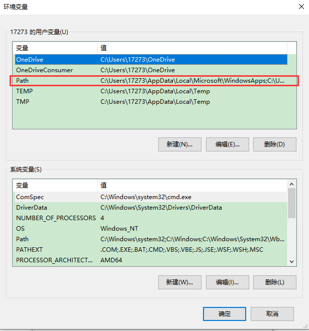
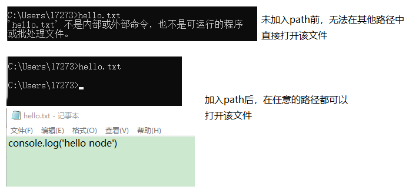

<!-- TOC -->

- [1 准备工作](#1-准备工作)
  - [1.1. 命令行](#11-命令行)
  - [1.2. 进程和线程](#12-进程和线程)
  - [1.3. node](#13-node)
    - [1.3.1. node 简介](#131-node-简介)
    - [1.3.2. 使用 node 执行.js 文件](#132-使用-node-执行js-文件)
    - [1.3.3 模块化](#133-模块化)
    - [1.3.4 包（package）](#134-包package)
    - [1.3.5 npm](#135-npm)
    - [1.3.5.1 配置 cnpm](#1351-配置-cnpm)
    - [1.3.5.2 node 搜索包的流程](#1352-node-搜索包的流程)
- [2 node.js 中的内容](#2-nodejs-中的内容)
  - [2.1 Buffer 缓冲区](#21-buffer-缓冲区)
  - [2.2 文件系统](#22-文件系统)
    - [2.2.1 同步文件的写入：](#221-同步文件的写入)
    - [2.2.2 异步文件写入：结果通过回调函数的参数返回](#222-异步文件写入结果通过回调函数的参数返回)
    - [2.2.3 简单的文件写入方式](#223-简单的文件写入方式)
    - [2.2.4 文件的写入方式：flag](#224-文件的写入方式flag)

<!-- /TOC -->

# 1 准备工作

## 1.1. 命令行

打开命令行：开始菜单 --> 运行 --> CMD --> 回车

常用的指令：

    dir 列出当前目录下的所有文件
    cd 目录名 进入到指定的目录
    md 目录名 创建一个文件夹
    rd 目录名 删除一个文件夹

目录：

    . 表示当前目录
    .. 表示上一级目录

环境变量（windows 系统中变量）path：`右键点击此电脑-->设置-->高级系统设置-->环境变量`

    用户变量是当前用户下设置的变量
    系统变量是当前 windows 系统设置的变量
    一般不需要操作系统变量，只修改用户变量下的path即可



查看用户变量下的 path:

    %USERPROFILE%\AppData\Local\Microsoft\WindowsApps;C:\Users\17273\AppData\Local\Programs\Microsoft VS Code\bin;E:\myprograms\Anaconda3\Scripts;C:\Program Files\Bandizip\;C:\Users\17273\AppData\Roaming\npm;E:\myprograms\MongoDB\Server\3.2\bin;E:\myprograms\Anaconda3;E:\myprograms\Anaconda3\Scripts;E:\myprograms\Anaconda3\Library\mingw-w64;E:\myprograms\Anaconda3\Library\bin;C:\Users\17273\Desktop\hello;

如果需要打开命令行就可以打开某个文件，或者执行某个.exe 程序，就可以将该文件或者程序所在的文件夹加入到 path 路径中。例如在上面将桌面上的 `hello 文件夹所在的完整路径加入到 path 中`


如果 hello 文件夹中存在一个 hello.txt 文件，则我们可以在终端的任意路径下输入`hello,txt`打开该文件


总结：
（1） 当我们在命令行窗口打开一个文件，或调用一个程序时，系统会首先在当前目录下寻找文件程序，如果找到了则直接打开；如果没有找到则会依次到环境变量 path 的路径中寻找，直到找到为止；如果没找到则报错

（2）所以我们可以将一些经常需要访问的程序和文件的路径添加到 path 中，这样我们就可以在任意位置来访问这些文件和程序了

（3）由于刚才添加的 hello 只是为了测试，测试完成之后将其从 path 中删除

## 1.2. 进程和线程

I/O (Input/Output)操作指的是对磁盘的读写操作

- 进程
  - 进程就是一个一个的工作计划（工厂中的车间）
- 线程
  - 线程是计算机最小的运算单位（工厂中的工人）
  - 线程是干活的
- 传统的服务器都是多线程的
  - 每进来一个请求，就创建一个线程去处理请
- Node 的服务器单线程的
  - Node 处理请求时是单线程，但是在后台拥有一个 I/O 线程池

## 1.3. node

Node 是对 ES 标准一个实现，Node 也是一个 JS 引擎。通过 Node 可以使 js 代码在服务器端执行

Node 仅仅对 ES 标准进行了实现，所以在 Node 中不包含 DOM 和 BOM

Node 中可以使用所有的内建对象：`String Number Boolean Math Date RegExp Function Object Array`,而 BOM 和 DOM 都不能使用,但是可以使用 console,也可以使用定时,（setTimeout() setInterval()）

Node 可以在后台来编写服务器,Node 编写服务器都是单线程的服务器

### 1.3.1. node 简介

- node 是一款对 ES 标准实现的 JS 引擎
  - 通过 node 可以使 js 在服务器中运行
  - node 就是一款使用 js 编写的 web 服务器
  - node 底层是使用 c++的编写的
  - node 的中 js 引擎使用的 chrome 的 v8 引擎
  - node 的特点：
    - 1.非阻塞、异步的 I/O
    - 2.事件和回调函数
    - 3.单线程（主线程单线程，后台 I/O 线程池）
    - 4.跨平台

### 1.3.2. 使用 node 执行.js 文件

- 首先需要将 node.exe 加入到环境变量 path 中，具体做法如(#1 命令行)中所示。
  - 一般在安装 node 时会自动加入到环境变量中，如果没有则先找到 node.exe 所在的文件夹，将其加入到 path 中即可
  - 测试：打开命令行，输入 `node`,出现其版本号则证明加入环境变量成功
- 创建一个 js 文件(如 hello.js)，在命令行中打开 js 文件所在的路径，输入`node hello.js`，回车，即可看到该文件的执行结果

### 1.3.3 模块化

ES5 中没有原生支持模块化，我们只能通过 script 标签引入 js 文件来实现模块化；在 node 中为了对模块管理，引入了 CommonJS 规范

模块：就是一个 js 文件，在一个模块中可以使用 `require` 引入其他的模块，也可以将本模块的内容通过 `exports.xxx = xxx 或者 module.exports.xxx = xxx` 暴露出去方便其他模块引入

模块的引用： 使用 require()函数来引入一个模块，例如：

    var 变量 = require("模块的标识");

模块的定义：

    在 node 中一个 js 文件就是一个模块
    默认情况下在 js 文件中编写的内容，都是运行在一个独立的函数(注意是一个函数)中，外部的模块无法访问,如果需要导出则需要将其作为exports的属性导出
      导出变量和函数：
        （1）使用 exports：
          exports.属性 = 属性值;
          exports.方法 = 函数;
        （2）使用 module.exports：
          module.exports.属性 = 属性值;
          module.exports.方法 = 函数;
          module.exports = {
              属性 ：属性值，
              方法：函数
          };

```
// hello.js
console.log("我是hello模块");
var a = 10;
function add(x, y) {
  return x + y;
}
exports.add = add;
exports.a = a;

// hello2.js
var he = require("./hello");
console.log(he.add(1, 2));
console.log(a);

执行hello2.js得到的结果：
我是hello模块
3
10
```

模块的标识

    模块的标识就是模块的名字或路径

node 通过模块的标识来寻找模块的

    对于核心模块（npm 中下载的模块），直接使用模块的名字对其进行引入
        var fs = require("fs");
        var express = require("express");
    
    对于自定义的文件模块，需要通过文件的路径来对模块进行引入
        路径可以是绝对路径，如果是相对路径必须以./或 ../开头
        var router = require("./router");

node 中的 global 全局对象：

    在全局中创建的变量会作为 global 的属性保存
        不使用var let const关键字创建的变量都属于global
        属于global的变量不需要暴露，在另一个模块中直接可以使用
    
    在全局中创建的函数会作为 global 的方法保存

```
// hello.js
a = 10;    // a属于global

// hello2.js
var he = require("./hello");
console.log(a);

执行hello2.js得到的结果：
10
```

一个模块中编写的代码会产生一个函数将其全部包裹起来，例如 hello.js 文件就是一个模块,为什么说它是一个函数呢？？？函数一般都具有 arguments 参数，保存的是函数传入的形参，可以通过打印 arguments 查看,也可以通过将 callee 直接查看当前的函数对象，+""会将函数通过 toString 转为一个字符串：

```
console.log("我是hello模块");
a = 10;
function add(x, y) {
  return x + y;
}
exports.add = add;
console.log(arguments.length);
console.log(arguments.callee + "");

// 执行的结果：
我是hello模块
5
function (exports, require, module, __filename, __dirname) {
    console.log("我是hello模块");
    a = 10;
    function add(x, y) {
      return x + y;
    }
    exports.add = add;
    console.log(arguments.length);
    console.log(arguments.callee + "");
}
```

可以发现这个函数的内容就是我们编辑的 js 代码，另外该函数还传入了 5 个参数：

    exports:暴露当前模块的元素
    require：引入其他模块
    module：当前模块
    __filename：当前模块的完整路径  C://.../node.js/hello.js
    __dirname：当前模块所在的文件夹的完整路径 C://.../node.js

注意：module.exports = {}可以，但是 exports={}不行

### 1.3.4 包（package）

**将多个模块组合为一个完整的功能，就是一个包**

包结构

    bin - 二进制的可执行文件，一般都是一些工具包中才有
    lib - js 文件
    doc - 文档
    test - 测试代码
    package.json
      - 包的描述文件，必须具备
      - 它是一个 json 格式的文件，在它里面保存了包各种相关的信息
          name 包名
          version 版本
          dependencies 依赖
          main 包的主要的文件
          bin 可执行文件
          ...

### 1.3.5 npm

npm（Node Package Manager），是 node 的包管理器

CommonJS 包规范是理论，NPM 是其中一种实践。

对于 Node 而言，NPM 帮助其完成了第三方模块的发布、安装和依赖等。借助 NPM，Node 与第三方模块之间形成了很好的一个生态系统。

- 通过 npm 可以对 node 中的包进行上传、下载、搜索等操作

  - npm 会在安装完 node 以后，自动安装
  - npm 的常用指令

        npm -v
            查看 npm 的版本
        npm version
            查看所有模块的版本
        npm init
            初始化项目（创建 package.json）
        npm i/install 包名
            安装指定的包
        npm i/install 包名 --save
            安装指定的包并添加依赖
        npm i/install 包名 -g
            全局安装（一般都是一些工具）
        npm i/install
            安装当前项目所依赖的包(package.json中dependencies中指定的所有包)
        npm s/search 包名
            搜索包
        npm r/remove 包名
            删除一个包

使用这个命令可以在包描述文件 package.json 中的 dependencies 中加入所下载的包。一般在写好项目之后会将项目上传到 github 上，开源，但是由于 node_modules 文件夹的内容比较大，所以一般不会上传，用户在将项目文件在克隆到本地后，直接在项目的根目录下使用`npm install` 即可直接将 dependencies 中的包下载到 node_modules 下，不需要再去查看当前
项目需要安装哪些包，即可实现项目的运行

### 1.3.5.1 配置 cnpm

使用 npm 安装包，而发送下载请求之后，npm 的服务器在国外，由于速度的限制，会导致下载速度变慢，所以淘宝就创建了一个 npm 的镜像服务器，这个服务器将国外的 npm 服务器上的内容下载到该服务器(该服务器每 10 分钟会检测一次 npm 服务器的更新，保证该服务器上的内容是与 npm 服务器的更新一致)，我们在下载时直接连接到该镜像服务器即可加快速度

但是一般使用 npm 下载没有其他问题，所以可以将这个命令保存，添加一个命令从淘宝服务器下载包：`cnpm`

设置 cnpm 命令：`npm install -g cnpm --registry=https://registry.npm.taobao.org`

查看当前 npm 的镜像：`npm config get registry `

npm 镜像的原服务器：`https://registry.npmjs.org/`

修改当前 npm 的镜像为淘宝镜像：`npm config set registry https://registry.npm.taobao.org/`，但是添加一个 cnpm 命令最好

### 1.3.5.2 node 搜索包的流程

通过 npm 命令下载的包都会放在该目录下的 node_modules 文件夹中，这些包直接使用包名引入即可，不需要指定路径

node 在通过模块名字引入模块时，首先在当前目录的 node_modules 中查找该模块，如果有则直接使用，如果没有则去其父目录的 node_modules 中寻找，没有则再去上一级目录，直到找到磁盘的根目录(C:/,D:/,E:/)都没有找到，则会报错

# Node.js 模块加载方法

- js 现有两种模块加载方法：
  - es6 模块
    - es6 专用的，使用 import 和 export
  - CommonJS 模块
    - Node.js 专用的，使用 require()和 module.exports
    - 从 Node.js v13.2 开始，默认打开了 es6 模块的支持，用法如下所示：
      - 用法 1：要求 es6 模块采用.mjs 为后缀名，这样才可以使用 es6 的方式(export,import)加载模块
        - 在.mjs 文件中就不能使用 CommonJS 的方式加载模块了
      - 用法 2：在 package.json 文件中，指定 type 字段为 module:`{ "type": "module" }`
        - 一旦在 package.json 中添加了 type 字段为 module 后，就不能再使用 require 和 module.exports 命令了


# 2 node.js 中的内容

## 2.1 Buffer 缓冲区

Buffer 的结构和数组很像，操作的方法和数组很类似，既然和数据很像，为啥要产生 Buffer 呢？这是因为数组虽然功能强大，可以保存 number,string 等数据，但是由于后台应用还需要传输图片，MP3 文件以及其他的内容，这些内容统称为二进制文件，是不能在数组中保存的，所以就产生了 Buffer

- 数组中不能存储二进制文件，而 Buffer 就是专门用于存储二进制数据的
  - 在 buffer 中保存的都是二进制数据，但是当我们打印输出时会自动转化为 16 进制的数据，因为二进制太长了
  - buffer 中每一个元素的范围是从 00~ff 对应二进制 0000 0000~1111 1111
    - 如果超出这个范围，则只会保存对应元素的二进制的后 8 位
  - 计算机的内存中只能保存 0 或者 1，一个 0 或者 1 称为 1 位
    - 8 bit = 1Byte
    - 1024byte = 1kb
    - 1024kb = 1mb
    - 1024mb = 1gb
    - 1024gb = 1tb
  - buffer 中的一个元素占据一个字节，buffer 的长度即就是该元素占据内存的字节数
  - 1 个英文字母(或英文符号)在内存中占据 1 个字节
  - 1 个中文汉字(或中文符号)在内存中占据 3 个字节

将字符串转为 buffer:`Buffer.from(str)`
将缓冲区的内容转换为字符串：`buf.toString()`

```
var str = "hello,world!";
// 将字符串保存到buffer中
var buf = Buffer.from(str);
console.log(buf); //<Buffer 68 65 6c 6c 6f 2c 77 6f 72 6c 64 21>
console.log(buf.length); // 占用内存12字节
console.log(str.length); // 字符串长度12

var str1 = "hello,世界！";
// 将字符串保存到buffer中
var buf1 = Buffer.from(str1);
console.log(buf1); //<Buffer 68 65 6c 6c 6f 2c e4 b8 96 e7 95 8c ef bc 81>
console.log(buf1.length); // 15：hello, 6字节   世界！ 9字节
console.log(str1.length); // 9
```

创建占据指定内存大小的 `Buffer:alloc(size,fill,)`，不指定 fill 时使用 0 初始化,清空所分配内存空间
创建占据指定内存大小的 `Buffer:allocUnsafe(size,fill,)`，不指定 fill 时不清理指定的内存空间，因为内存都是循环使用的，可能分配到的内存有人之前使用过了

- buffer 的大小一旦设置，不能更改，因为它是对底层内存的直接分配，刚开始分配会分配到一个连续的内存空间
  - 如果后期增加，会导致分配的内存不连续，不好维护，所以不允许修改
- 直接读取 buffer 中某一个元素的值，在控制台输出得到的一定是十进制
  - 如果想要打印 16 进制的输出，直接使用 buf[2].toString(16)将其转换为字符串,其他进制 2,8 类似

```
var buf = Buffer.alloc(10);  // 创建了一个10字节的Buffer
// 默认以0填充
console.log(buf);  //<Buffer 00 00 00 00 00 00 00 00 00 00>

var buf2 = Buffer.allocUnsafe(10);  //所分配的内存中保存的内容没有清理
console.log(buf2);  //<Buffer 28 f6 20 64 c1 02 00 00 0c ea>

buf[0] = 1;
buf[13] = 2;   // 超出索引范围的设置不会生效，数组会自动增加
console.log(buf); // <Buffer 01 00 00 00 00 00 00 00 00 00>

buf[3] = 34;
console.log(buf); // <Buffer 01 00 00 22 00 00 00 00 00 00>
console.log(buf[3]); // 34
console.log(buf[3].toString(2)); // 100010
```

## 2.2 文件系统

通过 node 操作系统中的文件

在 node 中，与文件系统的交互很重要，服务器的本质就是将本地的文件发送给远程的客户端，比如我们搜索一个内容，服务器就会返回给我们一个网页

- node 中提供了一个模块`fs`来实现文件系统的操作，fs 是核心模块，直接引入，不需要下载

  - fs 中所有的操作都有同步和异步两种选择
  - 同步文件会阻塞程序的执行，即除非操作完毕，否则不会向下执行代码 fs.openSync()
  - 异步文件系统不会阻塞程序的执行，而是在操作完成时，通过回调函数将结果返回 fs.open()

- 文件的写入

  - 打开文件
  - 写入内容
  - 保存并且关闭文件

### 2.2.1 同步文件的写入：

（1）打开文件 `var fd = fs.openSync(path,flags[],mode)`

    path:要打开文件的完整路径，可以是相对路径
    flags:打开文件要做的操作类型
        r:只读
        w:可写的
    mode:设置文件的操作权限，一般不传
    flie:文件的返回值，是文件的描述符，可以使用该描述符对文件进行各种操作

（2）向文件中写入内容：`fs.writeSync(fd,string[],position[],encoding[])`

    fd:文件的描述符
    string:要写入文件的内容
    position:写入内容的起始位置
    encoding:写入内容的编码，默认utf-8

（3）关闭文件

    fs.close(fd)

```
// 同步写入
var fs = require("fs");

// 同步文件的写入
var fd = fs.openSync("hello.txt", "w");
console.log(fd); // 随机返回的值：3
//此时在该目录下就会出现一个hello.txt,文件内容为：今天天气好晴朗
fs.writeSync(fd, "今天天气好晴朗");
//再添加一句：在文件的第30个字节处添加新的内容,中间空出的字节没写相当于0
fs.writeSync(fd, "今天天气好晴朗", 30);
fs.closeSync(fd);

// 文件的最终结果：今天天气好晴朗         今天天气好晴朗
```


### 2.2.2 异步文件写入：结果通过回调函数的参数返回

（1）打开文件`fs.open(path,flags,mode,callback)`

    callback 有两个参数:
    err:错误对象，没有错误则为 null
    fd:文件的描述符

（2）写入内容 `fs.write(fd,postion,encoding,callback)`

    callback 有 3 个参数:
    err:错误对象，没有错误则为 null
    byte_num:写入的字节数
    content:写入的内容

（3）关闭文件 `fs.close(fd,callback)`

    callback 有 1 个参数:
    err:错误对象，没有错误则为 null

```
var fs = require("fs");
fs.open("hello1.txt", "w", function (err, fd) {
  console.log(arguments);
  /*
  // 两个参数，第一个参数为err,为null表示没出错
  // 第二个参数是文件的描述符
    [Arguments] { '0': null, '1': 3 }
  */
  // 写入内容
  fs.write(fd, "这是异步操作的内容", function (err, byte_num, string) {
    console.log(arguments);
    /* 错误对象  字节数   内容
    [Arguments] { '0': null, '1': 27, '2': '这是异步操作的内容' }
    */

    // 关闭文件
    fs.close(fd);
  });
});
```

### 2.2.3 简单的文件写入方式

同步文件与异步文件写入方式都太麻烦了，所以这里学习一个简单文件写入方式，它也分异步和同步

异步写入：`fs.writeFile(file, data[, options], callback)`

- 其内部封装了 `fs.open,fs.write 及 fs.close` 方法
- options 中的参数设置：
  - encoding 默认值: 'utf8' 设置写入文件的编码方式。
  - mode <integer> 默认值: 0o666 设置文件的操作权限。
  - flag <string> 默认值: 'w' 可写。

```
var fs = require("fs");
fs.writeFile("hello.txt", "今天出太阳啦！", function (err) {
  if (!err) {
    console.log("写入成功");
  } else {
    console.log("发生了错误", err);
  }
});
```

同步方式：`fs.writeFileSync(file, data[, options])`

```
fs.writeFileSync("hello1.txt", "今天是个大晴天！");
```

### 2.2.4 文件的写入方式：flag

目前为止，我们只是用了两个:`w`,`r`,可以发现`w`会将文件内原本的内容清空，加入新的内容，`r`运行我们只能读取文件的内容，如果需要在文件的原有内容之后追加内容，则需要新的 [flag](http://nodejs.cn/api/fs.html#fs_file_system_flags)

- 'a': 打开文件用于追加。 如果文件不存在，则创建该文件。
- 'w': 打开文件用于写入。 如果文件不存在则创建文件，如果文件存在则截断文件。
- 'r': 打开文件用于读取。 如果文件不存在，则会发生异常。
